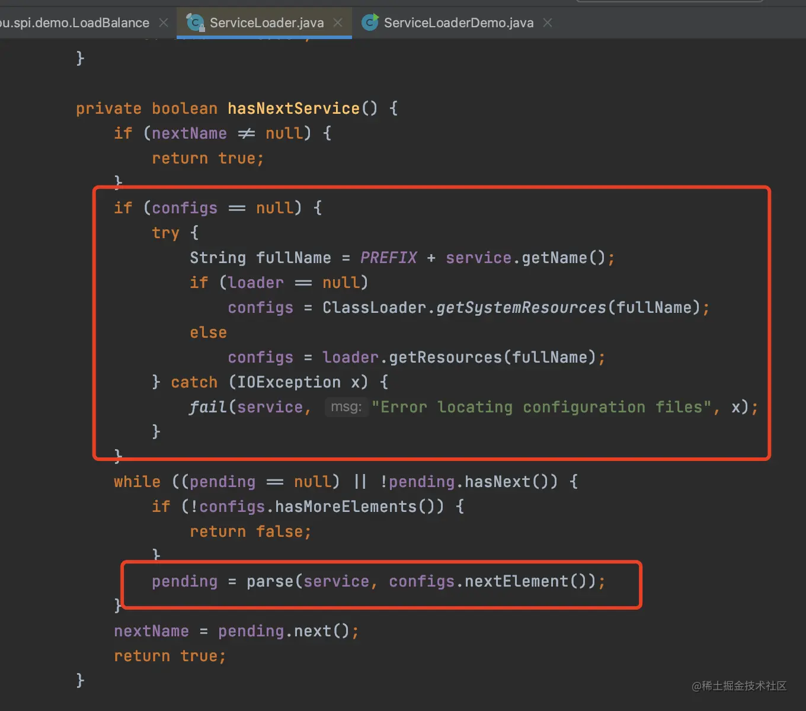
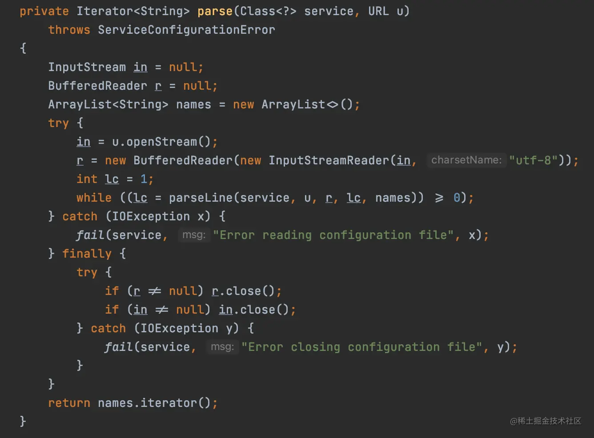
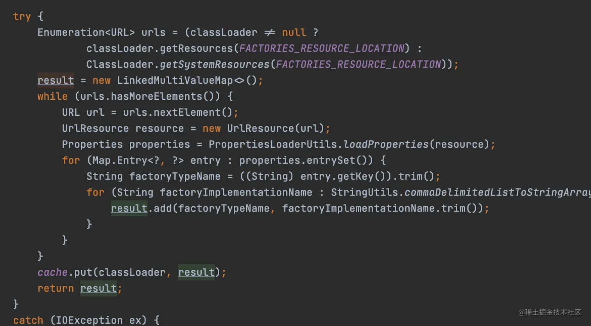
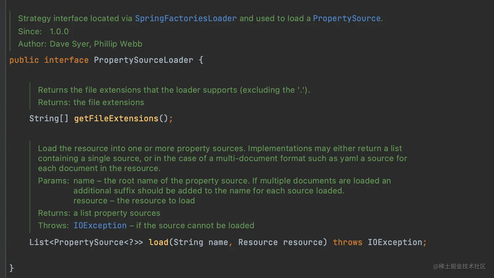
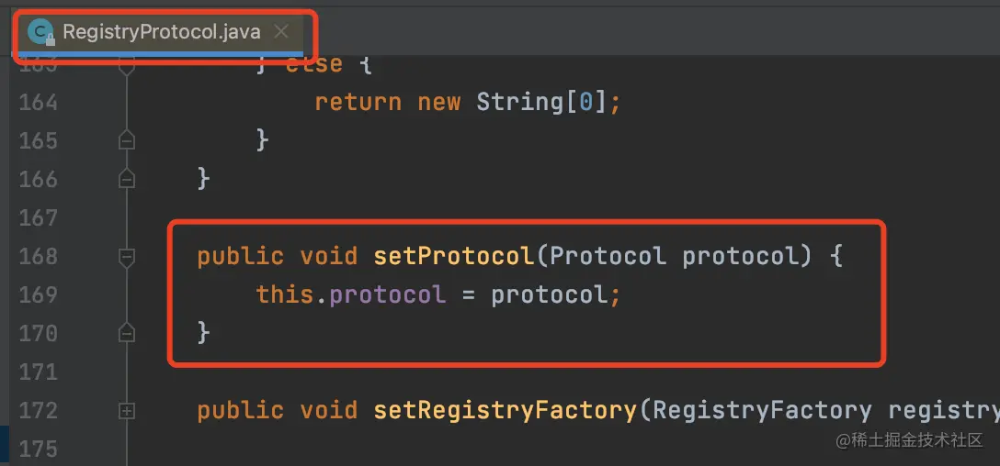
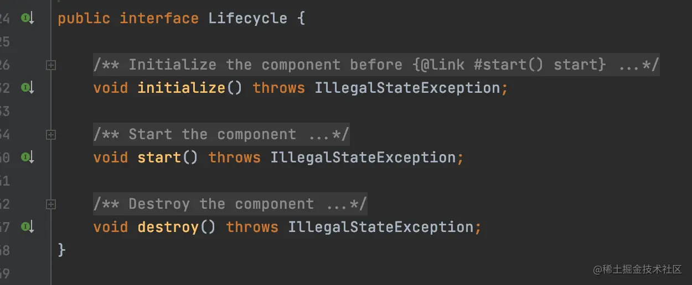
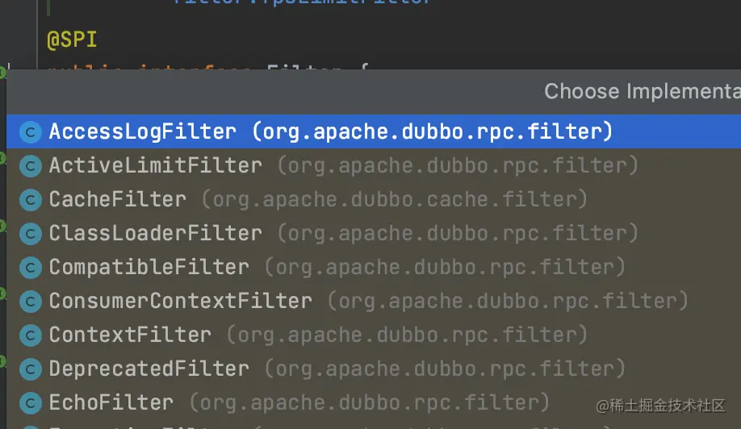

# 阿里一面：说一说Java、Spring、Dubbo三者SPI机制的原理和区别

## 什么是SPI
SPI全称为Service Provider Interface，是一种动态替换发现的机制，一种解耦非常优秀的思想，SPI可以很灵活的让接口和实现分离，让api提供者只提供接口，第三方来实现，然后可以使用配置文件的方式来实现替换或者扩展，在框架中比较常见，提高框架的可扩展性。

简单来说SPI是一种非常优秀的设计思想，它的核心就是解耦、方便扩展。

## Java SPI机制--ServiceLoader
ServiceLoader是Java提供的一种简单的SPI机制的实现，Java的SPI实现约定了以下两件事：

+ 文件必须放在`META-INF/services/`目录底下
+ 文件名必须为接口的全限定名，内容为接口实现的全限定名

这样就能够通过ServiceLoader加载到文件中接口的实现。

#### 来个demo
第一步，需要一个接口以及他的实现类

```plain
public interface LoadBalance {
}

public class RandomLoadBalance implements LoadBalance{
}
```

第二步，在`META-INF/services/`目录创建一个文件名LoadBalance全限定名的文件，文件内容为RandomLoadBalance的全限定名


测试类：

```plain
public class ServiceLoaderDemo {

    public static void main(String[] args) {
        ServiceLoader<LoadBalance> loadBalanceServiceLoader = ServiceLoader.load(LoadBalance.class);
        Iterator<LoadBalance> iterator = loadBalanceServiceLoader.iterator();
        while (iterator.hasNext()) {
            LoadBalance loadBalance = iterator.next();
            System.out.println("获取到负载均衡策略:" + loadBalance);
        }
    }

}
```

测试结果：


此时就成功获取到了实现。

在实际的框架设计中，上面这段测试代码其实是框架作者写到框架内部的，而对于框架的使用者来说，要想自定义LoadBalance实现，嵌入到框架，仅仅只需要写接口的实现和spi文件即可。

#### 实现原理
如下是ServiceLoader中一段核心代码



首先获取一个fullName，其实就是`META-INF/services/接口的全限定名`


然后通过ClassLoader获取到资源，其实就是接口的全限定名文件对应的资源，然后交给`parse`方法解析资源



`parse`方法其实就是通过IO流读取文件的内容，这样就可以获取到接口的实现的全限定名

再后面其实就是通过反射实例化对象，这里就不展示了。

所以其实不难发现ServiceLoader实现原理比较简单，总结起来就是通过IO流读取`META-INF/services/接口的全限定名`文件的内容，然后反射实例化对象。

#### 优缺点
由于Java的SPI机制实现的比较简单，所以他也有一些缺点。

第一点就是浪费资源，虽然例子中只有一个实现类，但是实际情况下可能会有很多实现类，而Java的SPI会一股脑全进行实例化，但是这些实现了不一定都用得着，所以就会白白浪费资源。

第二点就是无法对区分具体的实现，也就是这么多实现类，到底该用哪个实现呢？如果要判断具体使用哪个，只能依靠接口本身的设计，比如接口可以设计为一个策略接口，又或者接口可以设计带有优先级的，但是不论怎样设计，框架作者都得写代码进行判断。

所以总得来说就是ServiceLoader无法做到按需加载或者按需获取某个具体的实现。

#### 使用场景
虽然说ServiceLoader可能有些缺点，但是还是有使用场景的，比如说：

+ 不需要选择具体的实现，每个被加载的实现都需要被用到
+ 虽然需要选择具体的实现，但是可以通过对接口的设计来解决

## Spring SPI机制--SpringFactoriesLoader
Spring我们都不陌生，他也提供了一种SPI的实现SpringFactoriesLoader。

Spring的SPI机制的约定如下：

+ 配置文件必须在`META-INF/`目录下，文件名必须为spring.factories
+ 文件内容为键值对，一个键可以有多个值，只需要用逗号分割就行，同时键值都需要是类的全限定名，键和值可以没有任何类与类之间的关系，当然也可以有实现的关系。

所以也可以看出，Spring的SPI机制跟Java的不论是文件名还是内容约定都不一样。

#### 来个demo
在`META-INF/`目录下创建spring.factories文件，LoadBalance为键，RandomLoadBalance为值


测试：

```plain
public class SpringFactoriesLoaderDemo {

    public static void main(String[] args) {
        List<LoadBalance> loadBalances = SpringFactoriesLoader.loadFactories(LoadBalance.class, MyEnableAutoConfiguration.class.getClassLoader());
        for (LoadBalance loadBalance : loadBalances) {
            System.out.println("获取到LoadBalance对象:" + loadBalance);
        }
    }

}
```

运行结果：


成功获取到了实现对象。

#### 核心原理
如下是SpringFactoriesLoader中一段核心代码



其实从这可以看出，跟Java实现的差不多，只不过读的是`META-INF/`目录下spring.factories文件内容，然后解析出来键值对。

#### 使用场景
Spring的SPI机制在内部使用的非常多，尤其在SpringBoot中大量使用，SpringBoot启动过程中很多扩展点都是通过SPI机制来实现的，这里我举两个例子

##### 1、自动装配
在SpringBoot3.0之前的版本，自动装配是通过SpringFactoriesLoader来加载的。


但是SpringBoot3.0之后不再使用SpringFactoriesLoader，而是Spring重新从`META-INF/spring/`目录下的`org.springframework.boot.autoconfigure.AutoConfiguration.imports`文件中读取了。


至于如何读取的，其实猜也能猜到就跟上面SPI机制读取的方式大概差不多，就是文件路径和名称不一样。

##### 2、PropertySourceLoader的加载
PropertySourceLoader是用来解析application配置文件的，它是一个接口



SpringBoot默认提供了 PropertiesPropertySourceLoader 和 YamlPropertySourceLoader两个实现，就是对应properties和yaml文件格式的解析。

SpringBoot在加载PropertySourceLoader时就用了SPI机制


#### 与Java SPI机制对比
首先Spring的SPI机制对Java的SPI机制对进行了一些简化，Java的SPI每个接口都需要对应的文件，而Spring的SPI机制只需要一个spring.factories文件。

其次是内容，Java的SPI机制文件内容必须为接口的实现类，而Spring的SPI并不要求键值对必须有什么关系，更加灵活。

第三点就是Spring的SPI机制提供了获取类限定名的方法`loadFactoryNames`，而Java的SPI机制是没有的。通过这个方法获取到类限定名之后就可以将这些类注入到Spring容器中，用Spring容器加载这些Bean，而不仅仅是通过反射。

但是Spring的SPI也同样没有实现获取指定某个指定实现类的功能，所以要想能够找到具体的某个实现类，还得依靠具体接口的设计。

所以不知道你有没有发现，PropertySourceLoader它其实就是一个策略接口，注释也有说，所以当你的配置文件是properties格式的时候，他可以找到解析properties格式的PropertiesPropertySourceLoader对象来解析配置文件。

## Dubbo SPI机制--ExtensionLoader
ExtensionLoader是dubbo的SPI机制的实现类。每一个接口都会有一个自己的ExtensionLoader实例对象，这点跟Java的SPI机制是一样的。

同样地，Dubbo的SPI机制也做了以下几点约定：

+ 接口必须要加@SPI注解
+ 配置文件可以放在`META-INF/services/`、`META-INF/dubbo/internal/ `、`META-INF/dubbo/` 、`META-INF/dubbo/external/`这四个目录底下，文件名也是接口的全限定名
+ 内容为键值对，键为短名称（可以理解为spring中Bean的名称），值为实现类的全限定名

#### 先来个demo
首先在LoadBalance接口上@SPI注解

```plain
@SPI
public interface LoadBalance {

}
```

然后，修改一下Java的SPI机制测试时配置文件内容，改为键值对，因为Dubbo的SPI机制也可以从`META-INF/services/`目录下读取文件，所以这里就没重写文件

```plain
random=com.sanyou.spi.demo.RandomLoadBalance
```

测试类：

```plain
public class ExtensionLoaderDemo {

    public static void main(String[] args) {
        ExtensionLoader<LoadBalance> extensionLoader = ExtensionLoader.getExtensionLoader(LoadBalance.class);
        LoadBalance loadBalance = extensionLoader.getExtension("random");
        System.out.println("获取到random键对应的实现类对象：" + loadBalance);
    }

}
```

通过ExtensionLoader的`getExtension`方法，传入短名称，这样就可以精确地找到短名称对的实现类。

所以从这可以看出Dubbo的SPI机制解决了前面提到的无法获取指定实现类的问题。

测试结果：


dubbo的SPI机制除了解决了无法获取指定实现类的问题，还提供了很多额外的功能，这些功能在dubbo内部用的非常多，接下来就来详细讲讲。

#### dubbo核心机制
##### 1、自适应机制
自适应，自适应扩展类的含义是说，基于参数，在运行时动态选择到具体的目标类，然后执行。

每个接口有且只能有一个自适应类，通过ExtensionLoader的`getAdaptiveExtension`方法就可以获取到这个类的对象，这个对象可以根据运行时具体的参数找到目标实现类对象，然后调用目标对象的方法。

举个例子，假设上面的LoadBalance有个自适应对象，那么获取到这个自适应对象之后，如果在运行期间传入了`random`这个key，那么这个自适应对象就会找到`random`这个key对应的实现类，调用那个实现类的方法，如果动态传入了其它的key，就路由到其它的实现类。

自适应类有两种方式产生，第一种就是自己指定，在接口的实现类上加@Adaptive注解，那么这个这个实现类就是自适应实现类。

```plain
@Adaptive
public class RandomLoadBalance implements LoadBalance{
}
```

除了自己代码指定，还有一种就是dubbo会根据一些条件帮你动态生成一个自适应类，生成过程比较复杂，这里就不展开了。

自适应机制在Dubbo中用的非常多，而且很多都是自动生成的，如果你不知道Dubbo的自适应机制，你在读源码的时候可能都不知道为什么代码可以走到那里。。

##### 2、IOC和AOP
一提到IOC和AOP，立马想到的都是Spring，但是IOC和AOP并不是Spring特有的概念，Dubbo也实现IOC和AOP的功能，但是是一个轻量级的。

**2.1、依赖注入**

Dubbo依赖注入是通过setter注入的方式，注入的对象默认就是上面提到的自适应的对象，在Spring环境下可以注入Spring Bean。

```plain
public class RoundRobinLoadBalance implements LoadBalance {

    private LoadBalance loadBalance;
    
    public void setLoadBalance(LoadBalance loadBalance) {
        this.loadBalance = loadBalance;
    }

}
```

如上代码，RoundRobinLoadBalance中有一个setLoadBalance方法，参数LoadBalance，在创建RoundRobinLoadBalance的时候，在非Spring环境底下，Dubbo就会找到LoadBalance自适应对象然后通过反射注入。

这种方式在Dubbo中也很常见，比如如下的一个场景



RegistryProtocol中会注入一个Protocol，其实这个注入的Protocol就是一个自适应对象。

**2.2、接口回调**

Dubbo也提供了一些类似于Spring的一些接口的回调功能，比如说，如果你的类实现了Lifecycle接口，那么创建或者销毁的时候就会回调以下几个方法



在dubbo3.x的某个版本之后，dubbo提供了更多接口回调，比如说ExtensionPostProcessor、ExtensionAccessorAware，命名跟Spring的非常相似，作用也差不多。

**2.3、自动包装**

自动包装其实就是aop的功能实现，对目标对象进行代理，并且这个aop功能在默认情况下就是开启的。

在Dubbo中SPI接口的实现中，有一种特殊的类，被称为Wrapper类，这个类的作用就是来实现AOP的。

判断Wrapper类的唯一标准就是这个类中必须要有这么一个构造参数，这个构造方法的参数只有一个，并且参数类型就是接口的类型，如下代码：

```plain
public class RoundRobinLoadBalance implements LoadBalance {

    private final LoadBalance loadBalance;

    public RoundRobinLoadBalance(LoadBalance loadBalance) {
        this.loadBalance = loadBalance;
    }

}
```

此时RoundRobinLoadBalance就是一个Wrapper类。

当通过`random`获取RandomLoadBalance目标对象时，那么默认情况下就会对RandomLoadBalance进行包装，真正获取到的其实是RoundRobinLoadBalance对象，RoundRobinLoadBalance内部引用的对象是RandomLoadBalance。

_**测试一下**_

在配置文件中加入

```plain
roundrobin=com.sanyou.spi.demo.RoundRobinLoadBalance
```

测试结果


从结果可以看出，虽然指定了`random`，但是实际获取到的是RoundRobinLoadBalance，而RoundRobinLoadBalance内部引用了RandomLoadBalance。

如果有很多的包装类，那么就会形成一个责任链条，一个套一个。

所以dubbo的aop跟spring的aop实现是不一样的，spring的aop底层是基于动态代理来的，而dubbo的aop其实算是静态代理，dubbo会帮你自动组装这个代理，形成一条责任链。

到这其实我们已经知道，dubbo的spi接口的实现类已经有两种类型了：

+ 自适应类
+ Wrapper类

除了这两种类型，其实还有一种，叫做默认类，就是`@SPI`注解的值对应的实现类，比如

```plain
@SPI("random")
public interface LoadBalance {

}
```

此时`random`这个key对应的实现类就是默认实现，通过`getDefaultExtension`这个方法就可以获取到默认实现对象。

#### 3、自动激活
所谓的自动激活，就是根据你的入参，动态地选择一批实现类返回给你。

自动激活的实现类上需要加上`Activate`注解，这里就又学习了一种实现类的分类。

```plain
@Activate
public interface RandomLoadBalance {

}
```

此时RandomLoadBalance就属于可以被自动激活的类。

获取自动激活类的方法是`getActivateExtension`，所以根据这个方法的入参，可以动态选择一批实现类。

自动激活这个机制在Dubbo一个核心的使用场景就是Filter过滤器链中。

Filter是dubbo中的一个扩展点，可以在请求发起前或者是响应获取之后就行拦截，作用有点像Spring MVC中的HandlerInterceptor。



Filter的一些实现类

如上Filter有很多实现，所以为了能够区分Filter的实现是作用于provider的还是consumer端，所以就可以用自动激活的机制来根据入参来动态选择一批Filter实现。

比如说ConsumerContextFilter这个Filter就作用于Consumer端。


ConsumerContextFilter

## 总结
通过以上分析可以看出，实现SPI机制的核心原理就是通过IO流读取指定文件的内容，然后解析，最后加入一些自己的特性。

最后总的来说，Java的SPI实现的比较简单，并没有什么其它功能；Spring得益于自身的ioc和aop的功能，所以也没有实现太复杂的SPI机制，仅仅是对Java做了一点简化和优化；但是dubbo的SPI机制为了满足自身框架的使用要求，实现的功能就比较多，不仅将ioc和aop的功能集成到SPI机制中，还提供注入自适应和自动激活等功能。  


> 来自: [阿里一面：说一说Java、Spring、Dubbo三者SPI机制的原理和区别](https://juejin.cn/post/7210601680554246202?searchId=202411171559346D261F10324872C548CE#heading-1)
>


> 更新: 2024-11-17 21:20:09  
> 原文: <https://www.yuque.com/tulingzhouyu/db22bv/pulzrwazeuldai89>