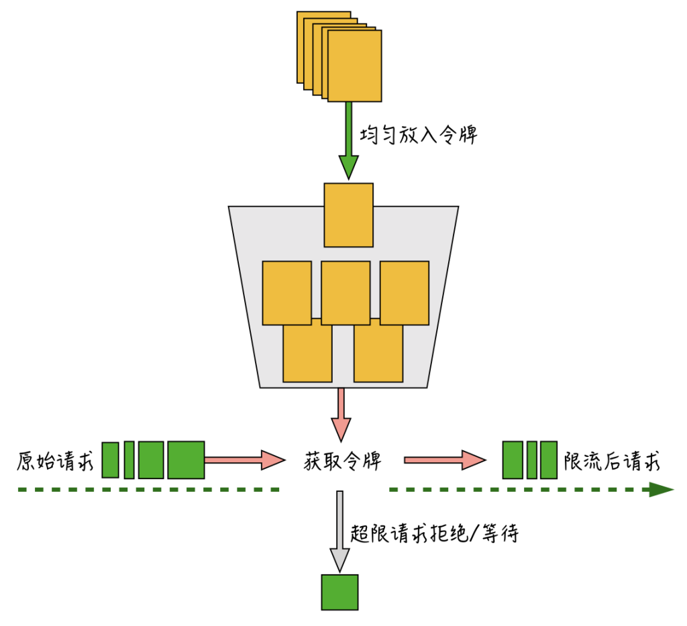
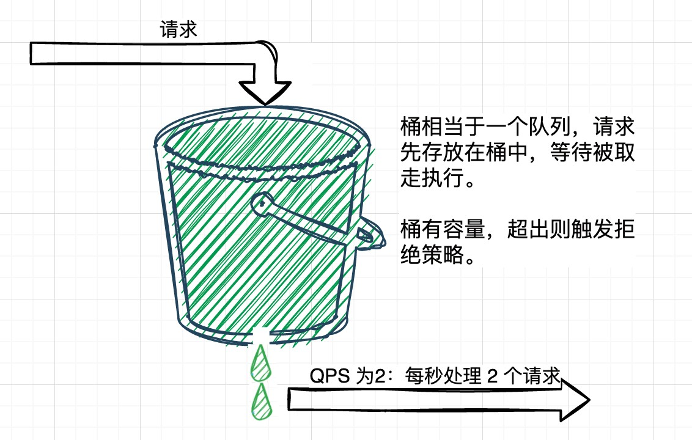

# 限流：高并发架构中的保护机制

<font style="color:rgba(6, 8, 31, 0.88);">在高并发、高可用的系统架构中，</font>**<font style="color:rgba(6, 8, 31, 0.88);">限流</font>**<font style="color:rgba(6, 8, 31, 0.88);">是必不可少的服务自我保护手段。</font>

<font style="color:rgba(6, 8, 31, 0.88);">本文将系统梳理常见限流算法（令牌桶、漏桶、计数器），对比其工作原理、特点及适用场景，并结合Java主流实践作举例说明。</font>

---

## <font style="color:rgba(6, 8, 31, 0.88);">一、为什么要限流？</font>
很简单，<font style="color:rgba(6, 8, 31, 0.88);">每个系统都有自身的容量上限。不管是突发流量还是恶意流量超出系统上线就可能会导致系统崩溃</font>

<font style="color:rgba(6, 8, 31, 0.88);">so  限流就是</font>**<font style="color:rgba(6, 8, 31, 0.88);">当系统面临高并发流量或瞬时流量高峰时，为确保服务可用性与稳定性，通过牺牲、延迟、拒绝部分请求，保护核心服务能力不被压垮。</font>**

<font style="color:rgba(6, 8, 31, 0.88);">常见应用场景：</font>

+ <font style="color:rgba(6, 8, 31, 0.88);">核心接口的流量保护</font>
+ <font style="color:rgba(6, 8, 31, 0.88);">防止恶意/异常请求淹没系统</font>
+ <font style="color:rgba(6, 8, 31, 0.88);">分布式服务/中间件防雪崩</font>
+ <font style="color:rgba(6, 8, 31, 0.88);">短时间流量激增的缓冲</font>

---

## <font style="color:rgba(6, 8, 31, 0.88);">二、主流限流算法详解</font>
### <font style="color:rgba(6, 8, 31, 0.88);">1. 令牌桶算法（Token Bucket）</font>


#### <font style="color:rgba(6, 8, 31, 0.88);">原理</font>
<font style="color:rgba(6, 8, 31, 0.88);">系统以恒定速率（如每秒N个）往桶中添加令牌。当用户请求到来时，只有“抢到”令牌的请求才被处理，否则被丢弃或延迟。桶有最大容量，防止长期积累超发。</font>

#### <font style="color:rgba(6, 8, 31, 0.88);">特点</font>
+ **<font style="color:rgba(6, 8, 31, 0.88);">支持突发流量</font>**<font style="color:rgba(6, 8, 31, 0.88);">：平时未被消耗的令牌可累积，允许高峰期突发消费</font>
+ **<font style="color:rgba(6, 8, 31, 0.88);">平滑控制速率</font>**<font style="color:rgba(6, 8, 31, 0.88);">：最大吞吐由速率和桶容量共同决定</font>
+ **<font style="color:rgba(6, 8, 31, 0.88);">实现简单</font>**<font style="color:rgba(6, 8, 31, 0.88);">：易于与现有框架、缓存中间件集成</font>

#### <font style="color:rgba(6, 8, 31, 0.88);">实践举例（Guava RateLimiter）</font>
```java
RateLimiter limiter = RateLimiter.create(5); // 每秒5个令牌
if(limiter.tryAcquire()) {
    // 允许访问
} else {
    // 被限流，拒绝或排队
}
```

#### <font style="color:rgba(6, 8, 31, 0.88);">常见模式说明</font>
+ `<font style="color:rgba(6, 8, 31, 0.88);">acquire(n)</font>`<font style="color:rgba(6, 8, 31, 0.88);"> </font><font style="color:rgba(6, 8, 31, 0.88);">支持一次性消费多令牌，典型用于需要瞬间完成多任务的场景。</font>
+ `<font style="color:rgba(6, 8, 31, 0.88);">tryAcquire(timeout, unit)</font>`<font style="color:rgba(6, 8, 31, 0.88);"> 支持设定最大等待时间，不阻塞主流程，提高用户的响应体验。</font>

#### **<font style="color:rgba(6, 8, 31, 0.88);">注意问题</font>**
+ **<font style="color:rgba(6, 8, 31, 0.88);">桶容量不应过大，否则短时间过多积压会冲垮后端。</font>**
+ <font style="color:rgba(6, 8, 31, 0.88);">高并发热点场景建议配合动态参数调整、监控报警。</font>
+ <font style="color:rgba(6, 8, 31, 0.88);">比如 Guava 的 SmoothWarmingUp 实现，可以“预热”，让系统冷启动时令牌速率逐步提升，防止刚上线资源未预热被打爆。</font>

```java
RateLimiter limiter = RateLimiter.create(5, 1, TimeUnit.MINUTES); // 1分钟平滑预热
```

#### <font style="color:rgba(6, 8, 31, 0.88);">场景：API限流、服务流控、允许瞬时流量高峰</font>
#### <font style="color:rgba(6, 8, 31, 0.88);">SmoothBursty 与 SmoothWarmingUp</font>
<font style="color:rgba(6, 8, 31, 0.88);">SmoothBursty（平滑突发型）</font>

+ **<font style="color:rgba(6, 8, 31, 0.88);">定义与特性</font>**
    - <font style="color:rgba(6, 8, 31, 0.88);">允许令牌在桶中积累，平时如果流量没用光，令牌会在桶内持续存储。</font>
    - <font style="color:rgba(6, 8, 31, 0.88);">当有突发流量（比如顿时来一批并发请求），可以瞬间消费掉已积累的令牌，实现</font><font style="color:rgba(6, 8, 31, 0.88);"> </font>**<font style="color:rgba(6, 8, 31, 0.88);">“瞬时突发”处理能力</font>**<font style="color:rgba(6, 8, 31, 0.88);">。</font>
    - <font style="color:rgba(6, 8, 31, 0.88);">达到限流速率限制后，会恢复稳定的输出速率。</font>
+ **<font style="color:rgba(6, 8, 31, 0.88);">适用场景</font>**
    - <font style="color:rgba(6, 8, 31, 0.88);">需要允许短时间流量激增的接口，比如秒杀抢购、热点API等。</font>
    - <font style="color:rgba(6, 8, 31, 0.88);">系统对短时突刺有承受能力，但希望整体被控速率稳定。</font>

<font style="color:rgba(6, 8, 31, 0.88);">SmoothWarmingUp（平滑预热型）</font>

+ **<font style="color:rgba(6, 8, 31, 0.88);">定义与特性</font>**
    - <font style="color:rgba(6, 8, 31, 0.88);">令牌发放速率在系统初启动时不是立即达到最大速率，而是</font>**<font style="color:rgba(6, 8, 31, 0.88);">“逐步平滑爬升”，经过一段预热期</font>**<font style="color:rgba(6, 8, 31, 0.88);">后才进入正常速率。</font>
    - <font style="color:rgba(6, 8, 31, 0.88);">预热期间，令牌生成速率缓慢提升，防止冷启动时一下子被打爆。</font>
    - <font style="color:rgba(6, 8, 31, 0.88);">达到设定的预热时间点后，速率爬满，变为稳定输出。</font>
+ **<font style="color:rgba(6, 8, 31, 0.88);">适用场景</font>**
    - <font style="color:rgba(6, 8, 31, 0.88);">系统刚上线或实例重启时，需要冷静恢复，不希望瞬间流量冲击“冷接口”或未作好缓存/准备的子系统。</font>
    - <font style="color:rgba(6, 8, 31, 0.88);">类如后台批处理、冷接口、分布式实例启动时的流量平滑过渡。</font>

<font style="color:rgba(6, 8, 31, 0.88);">对比</font>

| **<font style="color:rgba(6, 8, 31, 0.88);">场景</font>** | **<font style="color:rgba(6, 8, 31, 0.88);">SmoothBursty</font>** | **<font style="color:rgba(6, 8, 31, 0.88);">SmoothWarmingUp</font>** |
| --- | --- | --- |
| **<font style="color:rgba(6, 8, 31, 0.88);">启动时流量</font>** | <font style="color:rgba(6, 8, 31, 0.88);">可突发流量（马上瞬时可用）</font> | <font style="color:rgba(6, 8, 31, 0.88);">缓慢释放令牌（平滑升至最大速率）</font> |
| **<font style="color:rgba(6, 8, 31, 0.88);">令牌积累机制</font>** | <font style="color:rgba(6, 8, 31, 0.88);">可以积累，支持瞬时取大量</font> | <font style="color:rgba(6, 8, 31, 0.88);">不积累，初期速度受限</font> |
| **<font style="color:rgba(6, 8, 31, 0.88);">适合业务</font>** | <font style="color:rgba(6, 8, 31, 0.88);">抢购、API突发流量、抗压能力较强系统</font> | <font style="color:rgba(6, 8, 31, 0.88);">冷接口、批量任务、后端需预热、不能立即全速的场景</font> |
| **<font style="color:rgba(6, 8, 31, 0.88);">Guava配置方式</font>** | <font style="color:rgba(6, 8, 31, 0.88);">RateLimiter.create(速率)</font> | <font style="color:rgba(6, 8, 31, 0.88);">RateLimiter.create(速率, 预热时长, TimeUnit)</font> |


---

### <font style="color:rgba(6, 8, 31, 0.88);">2. 漏桶算法（Leaky Bucket）</font>


#### <font style="color:rgba(6, 8, 31, 0.88);">原理</font>
<font style="color:rgba(6, 8, 31, 0.88);">所有请求先进入漏桶，漏桶按固定出水速率依次处理。进水速度>出水速率时，且漏桶满了，多余部分被溢出、丢弃。</font>

#### <font style="color:rgba(6, 8, 31, 0.88);">特点</font>
+ **<font style="color:rgba(6, 8, 31, 0.88);">匀速处理请求</font>**<font style="color:rgba(6, 8, 31, 0.88);">：严格控制最大流出速率</font>
+ **<font style="color:rgba(6, 8, 31, 0.88);">不支持大突发</font>**<font style="color:rgba(6, 8, 31, 0.88);">：任何突发高峰都会被直接丢弃</font>
+ **<font style="color:rgba(6, 8, 31, 0.88);">实现简单</font>**<font style="color:rgba(6, 8, 31, 0.88);">：流程直观</font>

#### <font style="color:rgba(6, 8, 31, 0.88);">实践举例（Guava RateLimiter）</font>
```java
import java.util.concurrent.*;

public class LeakyBucketRateLimiter {
    private final int capacity;
    private final BlockingQueue<Runnable> bucket;
    private final ScheduledExecutorService scheduler;

    public LeakyBucketRateLimiter(int capacity, int rate) {
        this.capacity = capacity;
        this.bucket = new ArrayBlockingQueue<>(capacity);
        this.scheduler = Executors.newScheduledThreadPool(1);
        // 按固定间隔匀速消费
        scheduler.scheduleAtFixedRate(() -> {
            Runnable task = bucket.poll();
            if (task != null) {
                task.run(); // 业务处理
            }
        }, 0, 1000 / rate, TimeUnit.MILLISECONDS);
    }

    // 尝试放入漏桶
    public boolean trySubmit(Runnable task) {
        return bucket.offer(task);  // 队满时返回false，表示被限流
    }

    // 关闭限流器
    public void shutdown() {
        scheduler.shutdown();
    }
}

// 用例
public class Demo {
    public static void main(String[] args) {
        LeakyBucketRateLimiter limiter = new LeakyBucketRateLimiter(10, 5); // 桶容量10，速率5 req/sec

        for (int i = 0; i < 20; i++) {
            final int reqNo = i;
            boolean accepted = limiter.trySubmit(() -> {
                System.out.println("处理请求 " + reqNo + " at " + System.currentTimeMillis());
            });
            if (!accepted) {
                System.out.println("请求 " + reqNo + " 被限流丢弃！");
            }
        }
        // 等待一会儿观察效果
        try { Thread.sleep(3000); } catch (Exception ignore) {}
        limiter.shutdown();
    }
}
```

#### **<font style="color:rgba(6, 8, 31, 0.88);">注意问题</font>**
+ **<font style="color:rgba(6, 8, 31, 0.88);">漏桶不可突发高于出桶速率的流量</font>**<font style="color:rgba(6, 8, 31, 0.88);">：所有“积蓄”均由出桶速率决定，超速永远被丢弃。</font>
+ **<font style="color:rgba(6, 8, 31, 0.88);">排队等待可能带来延迟</font>**<font style="color:rgba(6, 8, 31, 0.88);">，需衡量业务最大可接受延时。</font>
+ **<font style="color:rgba(6, 8, 31, 0.88);">适用严格限流/均匀处理型场景</font>**<font style="color:rgba(6, 8, 31, 0.88);">，不适合需要允许部分高并发突刺的业务（此类建议用令牌桶）。</font>
+ **<font style="color:rgba(6, 8, 31, 0.88);">监控桶内队列长度</font>**<font style="color:rgba(6, 8, 31, 0.88);">，队满时需及时告警；可结合日志统计限流丢弃行为，辅助参数调整。</font>
+ **<font style="color:rgba(6, 8, 31, 0.88);">可配合降级方案</font>**<font style="color:rgba(6, 8, 31, 0.88);">，队列满自动熔断或者切换降级响应。</font>

#### <font style="color:rgba(6, 8, 31, 0.88);">场景</font>
<font style="color:rgba(6, 8, 31, 0.88);">带宽整形、对严格稳定输出要求的接口或服务。</font>

---

### <font style="color:rgba(6, 8, 31, 0.88);">3. 计数器算法（Counter）</font>
#### <font style="color:rgba(6, 8, 31, 0.88);">原理</font>
<font style="color:rgba(6, 8, 31, 0.88);">维护某时间窗口内累计请求数（如每秒一次统计），超阈值即拒绝新请求。通常有</font>**<font style="color:rgba(6, 8, 31, 0.88);">滑动</font>**<font style="color:rgba(6, 8, 31, 0.88);">、</font>**<font style="color:rgba(6, 8, 31, 0.88);">固定窗口</font>**<font style="color:rgba(6, 8, 31, 0.88);">两种。</font>

#### <font style="color:rgba(6, 8, 31, 0.88);">特点</font>
+ **<font style="color:rgba(6, 8, 31, 0.88);">实现极简</font>**<font style="color:rgba(6, 8, 31, 0.88);">：单计数器或滑动窗口结构</font>
+ **<font style="color:rgba(6, 8, 31, 0.88);">实时性一般</font>**<font style="color:rgba(6, 8, 31, 0.88);">：难以严格限制“窗口边沿突发”</font>
+ **<font style="color:rgba(6, 8, 31, 0.88);">适合总量控制</font>**<font style="color:rgba(6, 8, 31, 0.88);">：线程池大小、数据库连接等</font>

#### <font style="color:rgba(6, 8, 31, 0.88);">实践方法</font>
+ **<font style="color:rgba(6, 8, 31, 0.88);">AtomicInteger（固定窗口）</font>**<font style="color:rgba(6, 8, 31, 0.88);">：</font><font style="color:rgba(6, 8, 31, 0.88);">固定窗口指将时间轴划分为一段一段等长的区间（如每1秒为一个窗口）。在每个窗口内，累计请求次数；只要计数未超过阈值就放行，当达到阈值后本窗口内其它请求就会被限流。每当时间进入下一个窗口，计数重置为0。</font>
    - **<font style="color:rgba(6, 8, 31, 0.88);">优点</font>**<font style="color:rgba(6, 8, 31, 0.88);">：实现简单，性能高。</font>
    - **<font style="color:rgba(6, 8, 31, 0.88);">缺点</font>**<font style="color:rgba(6, 8, 31, 0.88);">：临界时刻存在“突刺”现象——在窗口边界前后短时间内可能允许近两倍的阈值通过，防护性较弱。</font>
    - **<font style="color:rgba(6, 8, 31, 0.88);">举例</font>**<font style="color:rgba(6, 8, 31, 0.88);">：如果1秒限制100次请求，窗口边界之前和之后连续来了200次，都会放行。</font>


```java
AtomicInteger count = new AtomicInteger(0);
int limit = 100;
long windowStart = System.currentTimeMillis();

if (System.currentTimeMillis() - windowStart > 1000) {
    count.set(0);
    windowStart = System.currentTimeMillis();
}

if (count.incrementAndGet() > limit) {
    // 拒绝服务，系统繁忙
}
```

+ **<font style="color:rgba(6, 8, 31, 0.88);">阿里 Sentinel（滑动窗口）</font>**<font style="color:rgba(6, 8, 31, 0.88);">：</font><font style="color:rgba(6, 8, 31, 0.88);">滑动窗口将统计时间窗口再细分为多个更小的子窗口（如将1秒分10份，每100ms为一个子窗口），时间轴上可“滑动”地累加最近一段时间内所有子窗口的请求总数。每次请求时动态统计最近N个小窗口的总和，从而减少突刺，提高流控精准度。</font>
    - **<font style="color:rgba(6, 8, 31, 0.88);">优点</font>**<font style="color:rgba(6, 8, 31, 0.88);">：更加平滑、精准地限制请求，几乎消除了“窗口临界突刺”问题，适合高并发场景。</font>
    - **<font style="color:rgba(6, 8, 31, 0.88);">缺点</font>**<font style="color:rgba(6, 8, 31, 0.88);">：实现略复杂，对内存要求略高。</font>
    - **<font style="color:rgba(6, 8, 31, 0.88);">举例</font>**<font style="color:rgba(6, 8, 31, 0.88);">：如果1秒限制100次请求，但每100ms都有单独计数，仅允许最近10个小窗口累计不超过100次，即便在窗口交界时也不会让短时间高流量全部通过。</font>


```java
import com.alibaba.csp.sentinel.Entry;
import com.alibaba.csp.sentinel.SphU;
import com.alibaba.csp.sentinel.slots.block.BlockException;
import com.alibaba.csp.sentinel.slots.block.flow.FlowRule;
import com.alibaba.csp.sentinel.slots.block.flow.FlowRuleManager;
import java.util.Collections;

public class SentinelSlidingWindowDemo {
    public static void main(String[] args) {
        // 1. 配置QPS限流规则
        FlowRule rule = new FlowRule();
        rule.setResource("myApi");
        rule.setGrade(com.alibaba.csp.sentinel.slots.block.RuleConstant.FLOW_GRADE_QPS);
        rule.setCount(5); // QPS 5
        FlowRuleManager.loadRules(Collections.singletonList(rule));

        // 2. 在代码中保护资源
        while (true) {
            try (Entry entry = SphU.entry("myApi")) {
                // 业务逻辑
                System.out.println("pass");
            } catch (BlockException ex) {
                // 限流时的处理
                System.out.println("blocked");
            }
        }
    }
}
```

---

## <font style="color:rgba(6, 8, 31, 0.88);">三、分布式限流及工程实现要点</font>
<font style="color:rgba(6, 8, 31, 0.88);">实际生产多为集群部署，需全局限流，常见方法有：</font>

### <font style="color:rgba(6, 8, 31, 0.88);">1. Redis+Lua 实现 (常见分布式限流方式）</font>
```lua
-- redis lua脚本示意：原子自增+过期
local key = KEYS[1]
local limit = tonumber(ARGV[1])
local current = redis.call('incr', key)
if current == 1 then
  redis.call('expire', key, 1)
end
if current > limit then
  return 0
else
  return 1
end
```

+ <font style="color:rgba(6, 8, 31, 0.88);">利用Redis自增/过期能力和Lua脚本原子性，单Key可实现全局QPS固定窗口限流。</font>
+ <font style="color:rgba(6, 8, 31, 0.88);">滑动窗口分布式限流要实现更高精度逻辑（需多Key统计&脚本判断）。</font>
+ <font style="color:rgba(6, 8, 31, 0.88);">当前主流微服务API限流多用此法，推荐配合高可用Redis集群。</font>

### <font style="color:rgba(6, 8, 31, 0.88);">2. Nginx/OpenResty限流</font>
+ <font style="color:rgba(6, 8, 31, 0.88);">在“接入层”采用OpenResty、Nginx限流模块，配置简单，可前置保护全部接口。</font>
+ <font style="color:rgba(6, 8, 31, 0.88);">自带limit_req，支持突发量与速率双调优，适合网关层保护。</font>

### <font style="color:rgba(6, 8, 31, 0.88);">3. 限流框架（如Sentinel）</font>
+ **<font style="color:rgba(6, 8, 31, 0.88);">阿里 Sentinel 内部就是滑动窗口统计机制</font>**<font style="color:rgba(6, 8, 31, 0.88);">（默认统计1秒、2个小格桶）。</font>
+ <font style="color:rgba(6, 8, 31, 0.88);">只需配置FlowRule为QPS/线程数限流，Sentinel自动实现滑动窗口平滑计数。</font>
+ <font style="color:rgba(6, 8, 31, 0.88);">支持实时监控、规则热更新，推荐生产应用直接集成而非手写，稳健性和性能都更优。</font>

---

## <font style="color:rgba(6, 8, 31, 0.88);">四、算法对比与场景分析</font>
| **<font style="color:rgba(6, 8, 31, 0.88);">算法/实现</font>** | **<font style="color:rgba(6, 8, 31, 0.88);">支持突发流量</font>** | **<font style="color:rgba(6, 8, 31, 0.88);">流量平滑</font>** | **<font style="color:rgba(6, 8, 31, 0.88);">窗口精度</font>** | **<font style="color:rgba(6, 8, 31, 0.88);">分布式支持</font>** | **<font style="color:rgba(6, 8, 31, 0.88);">实现难度</font>** | **<font style="color:rgba(6, 8, 31, 0.88);">资源消耗</font>** | **<font style="color:rgba(6, 8, 31, 0.88);">典型适用场景</font>** | **<font style="color:rgba(6, 8, 31, 0.88);">优点</font>** | **<font style="color:rgba(6, 8, 31, 0.88);">局限或注意点</font>** |
| --- | :---: | :---: | :---: | :---: | :---: | :---: | --- | --- | --- |
| **<font style="color:rgba(6, 8, 31, 0.88);">固定窗口计数器</font>** | <font style="color:rgba(6, 8, 31, 0.88);">部分</font> | <font style="color:rgba(6, 8, 31, 0.88);">✖️</font> | <font style="color:rgba(6, 8, 31, 0.88);">低</font> | <font style="color:rgba(6, 8, 31, 0.88);">易</font> | <font style="color:rgba(6, 8, 31, 0.88);">低</font> | <font style="color:rgba(6, 8, 31, 0.88);">低</font> | <font style="color:rgba(6, 8, 31, 0.88);">基础接口/管理后台、低并发总量限制</font> | <font style="color:rgba(6, 8, 31, 0.88);">简单高效、代码实现极简</font> | <font style="color:rgba(6, 8, 31, 0.88);">临界窗口突刺风险、实际QPS不稳定</font> |
| **<font style="color:rgba(6, 8, 31, 0.88);">滑动窗口计数器</font>** | <font style="color:rgba(6, 8, 31, 0.88);">部分</font> | <font style="color:rgba(6, 8, 31, 0.88);">✔️</font> | <font style="color:rgba(6, 8, 31, 0.88);">高</font> | <font style="color:rgba(6, 8, 31, 0.88);">中</font> | <font style="color:rgba(6, 8, 31, 0.88);">中</font> | <font style="color:rgba(6, 8, 31, 0.88);">中</font> | <font style="color:rgba(6, 8, 31, 0.88);">精细限流、需平滑流量的API</font> | <font style="color:rgba(6, 8, 31, 0.88);">降低突刺、控制更精确</font> | <font style="color:rgba(6, 8, 31, 0.88);">实现略复杂、内存消耗较固定窗口略高</font> |
| **<font style="color:rgba(6, 8, 31, 0.88);">令牌桶</font>** | <font style="color:rgba(6, 8, 31, 0.88);">✔️</font> | <font style="color:rgba(6, 8, 31, 0.88);">✔️</font> | <font style="color:rgba(6, 8, 31, 0.88);">高</font> | <font style="color:rgba(6, 8, 31, 0.88);">易</font> | <font style="color:rgba(6, 8, 31, 0.88);">低</font> | <font style="color:rgba(6, 8, 31, 0.88);">低</font> | <font style="color:rgba(6, 8, 31, 0.88);">面向API、分布式服务/接口</font> | <font style="color:rgba(6, 8, 31, 0.88);">支持大突发、灵活、易扩展</font> | <font style="color:rgba(6, 8, 31, 0.88);">短时超发需设置合理令牌桶容量</font> |
| **<font style="color:rgba(6, 8, 31, 0.88);">漏桶</font>** | <font style="color:rgba(6, 8, 31, 0.88);">✖️</font> | <font style="color:rgba(6, 8, 31, 0.88);">✔️</font> | <font style="color:rgba(6, 8, 31, 0.88);">高</font> | <font style="color:rgba(6, 8, 31, 0.88);">中</font> | <font style="color:rgba(6, 8, 31, 0.88);">低</font> | <font style="color:rgba(6, 8, 31, 0.88);">低</font> | <font style="color:rgba(6, 8, 31, 0.88);">严格速率限制，如带宽、任务出队口</font> | <font style="color:rgba(6, 8, 31, 0.88);">输出稳定、简单少突刺</font> | <font style="color:rgba(6, 8, 31, 0.88);">不允许突发流量、请求易被丢弃</font> |
| **<font style="color:rgba(6, 8, 31, 0.88);">信号量/线程池控制</font>** | <font style="color:rgba(6, 8, 31, 0.88);">部分</font> | <font style="color:rgba(6, 8, 31, 0.88);">✔️</font> | <font style="color:rgba(6, 8, 31, 0.88);">中</font> | <font style="color:rgba(6, 8, 31, 0.88);">难</font> | <font style="color:rgba(6, 8, 31, 0.88);">低</font> | <font style="color:rgba(6, 8, 31, 0.88);">低</font> | <font style="color:rgba(6, 8, 31, 0.88);">并发/线程受限、线程池、异步任务</font> | <font style="color:rgba(6, 8, 31, 0.88);">控制并发、利用Java原生工具</font> | <font style="color:rgba(6, 8, 31, 0.88);">难以全局QPS限制、适合并发量固定/资源敏感场景</font> |
| **<font style="color:rgba(6, 8, 31, 0.88);">分布式限流(Redis/Lua)</font>** | <font style="color:rgba(6, 8, 31, 0.88);">部分</font> | <font style="color:rgba(6, 8, 31, 0.88);">✔️</font> | <font style="color:rgba(6, 8, 31, 0.88);">高</font> | <font style="color:rgba(6, 8, 31, 0.88);">强</font> | <font style="color:rgba(6, 8, 31, 0.88);">中</font> | <font style="color:rgba(6, 8, 31, 0.88);">中</font> | <font style="color:rgba(6, 8, 31, 0.88);">集群API流控、微服务全局总量限流</font> | <font style="color:rgba(6, 8, 31, 0.88);">适合多节点、规则可伸缩</font> | <font style="color:rgba(6, 8, 31, 0.88);">Redis延迟/单点风险需高可用保障，需要元素原子性和时钟同步</font> |
| **<font style="color:rgba(6, 8, 31, 0.88);">Nginx/OpenResty模块</font>** | <font style="color:rgba(6, 8, 31, 0.88);">✔️</font> | <font style="color:rgba(6, 8, 31, 0.88);">✔️</font> | <font style="color:rgba(6, 8, 31, 0.88);">高</font> | <font style="color:rgba(6, 8, 31, 0.88);">强</font> | <font style="color:rgba(6, 8, 31, 0.88);">低</font> | <font style="color:rgba(6, 8, 31, 0.88);">低</font> | <font style="color:rgba(6, 8, 31, 0.88);">接入层API统一限流、突发洪峰保护</font> | <font style="color:rgba(6, 8, 31, 0.88);">配置简单、支持分布式、可靠性高</font> | <font style="color:rgba(6, 8, 31, 0.88);">适用接口/网关层，业务侧自定义需二次开发</font> |
| **<font style="color:rgba(6, 8, 31, 0.88);">Sentinel限流</font>** | <font style="color:rgba(6, 8, 31, 0.88);">✔️</font> | <font style="color:rgba(6, 8, 31, 0.88);">✔️</font> | <font style="color:rgba(6, 8, 31, 0.88);">高</font> | <font style="color:rgba(6, 8, 31, 0.88);">强</font> | <font style="color:rgba(6, 8, 31, 0.88);">低</font> | <font style="color:rgba(6, 8, 31, 0.88);">低</font> | <font style="color:rgba(6, 8, 31, 0.88);">API/微服务、流量治理和敏感接口</font> | <font style="color:rgba(6, 8, 31, 0.88);">动态调整、滑动窗口平滑、易监控</font> | <font style="color:rgba(6, 8, 31, 0.88);">依赖组件集成、需额外部署</font> |


---

## <font style="color:rgba(6, 8, 31, 0.88);">五、总结</font>
<font style="color:rgba(6, 8, 31, 0.88);">限流不是单一算法能够“包打天下”，而是根据业务需求、系统状态、流量模型灵活选型、组合应用。在现代分布式系统设计中，合理恰当的限流配置，是保证高并发场景下服务稳定可用的重要基石。</font>


> 更新: 2025-05-06 20:52:51  
> 原文: <https://www.yuque.com/tulingzhouyu/db22bv/mosfnh9lzt8xmqfk>