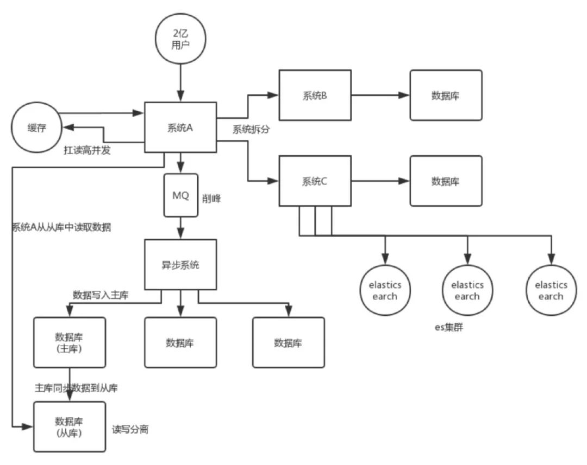
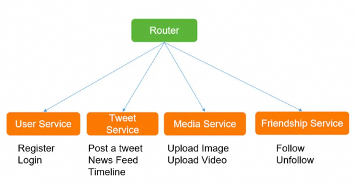
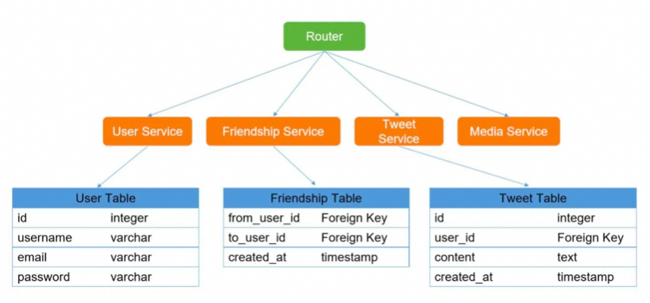

# 架构设计篇

<font style="color:rgb(255, 129, 36);">一、社区系统的架构</font>



**<font style="color:rgb(62, 62, 62);">系统拆分</font>**

<font style="color:rgb(62, 62, 62);">通过DDD领域模型，对服务进行拆分，将一个系统拆分为多个子系统，做成SpringCloud的微服务。微服务设计时要尽可能做到少扇出，多扇入，根据服务器的承载，进行客户端负载均衡，通过对核心服务的上游服务进行限流和降级改造。</font>

<font style="color:rgb(62, 62, 62);">一个服务的代码不要太多，1 万行左右，两三万撑死了吧。</font>

<font style="color:rgb(62, 62, 62);">大部分的系统，是要进行</font>**<font style="color:rgb(62, 62, 62);">多轮拆分</font>**<font style="color:rgb(62, 62, 62);">的，第一次拆分，可能就是将以前的多个模块该拆分开来了，比如说将电商系统拆分成</font>**<font style="color:rgb(62, 62, 62);">订单系统、商品系统、采购系统、仓储系统、用户系统</font>**<font style="color:rgb(62, 62, 62);">等等吧。</font>

<font style="color:rgb(62, 62, 62);">但是后面可能每个系统又变得越来越复杂了，比如说采购系统里面又分成了</font>**<font style="color:rgb(62, 62, 62);">供应商管理系统、采购单管理系统</font>**<font style="color:rgb(62, 62, 62);">，订单系统又拆分成了</font>**<font style="color:rgb(62, 62, 62);">购物车系统、价格系统、订单管理</font>**<font style="color:rgb(62, 62, 62);">系统。</font>

**<font style="color:rgb(62, 62, 62);">CDN、Nginx静态缓存、JVM缓存</font>**

<font style="color:rgb(62, 62, 62);">利用Java的模板thymeleaf可以将页面和数据动态渲染好，然后通过Nginx直接返回。动态数据可以从redis中获取。其中redis里的数据由一个缓存服务来进行消费指定的变更服务。</font>

<font style="color:rgb(62, 62, 62);">商品数据，每条数据是 10kb。100 条数据是 1mb，10 万条数据是 1g。常驻内存的是 200 万条商品数据，占用内存是 20g，仅仅不到总内存的 50%。目前高峰期每秒就是 3500 左右的请求量。</font>

**<font style="color:rgb(62, 62, 62);">缓存</font>**

<font style="color:rgb(62, 62, 62);">Redis cluster，10 台机器，5主5从，5 个节点对外提供读写服务，</font>**<font style="color:rgb(62, 62, 62);">每个节点的读写高峰 QPS</font>**<font style="color:rgb(62, 62, 62);"> 可能可以达到每秒 5 万，</font>**<font style="color:rgb(62, 62, 62);">5 台机器最多是 25 万读写请求每秒</font>**<font style="color:rgb(62, 62, 62);">。</font>

**<font style="color:rgb(62, 62, 62);">32G 内存+ 8 核 CPU + 1T </font>**<font style="color:rgb(62, 62, 62);">磁盘，但是分配给 </font>**<font style="color:rgb(62, 62, 62);">Redis 进程的是 10g 内存</font>**<font style="color:rgb(62, 62, 62);">，一般线上生产环境，Redis 的内存尽量不要超过 10g，超过 10g 可能会有问题。</font>

<font style="color:rgb(62, 62, 62);">因为每个主实例都挂了一个从实例，所以是</font>**<font style="color:rgb(62, 62, 62);">高可用的</font>**<font style="color:rgb(62, 62, 62);">，任何一个主实例宕机，都会自动故障迁移，Redis 从实例</font>**<font style="color:rgb(62, 62, 62);">会自动变成主实例</font>**<font style="color:rgb(62, 62, 62);">继续提供读写服务。</font>

**<font style="color:rgb(62, 62, 62);">MQ</font>**

<font style="color:rgb(62, 62, 62);">可以通过消息队列对微服务系统进行</font><font style="color:rgb(62, 62, 62);">解耦</font><font style="color:rgb(62, 62, 62);">，异步调用的更适合微服务的扩展</font>

<font style="color:rgb(62, 62, 62);">同时可以应对秒杀活动中[应对高并发写请求](# 6、应对高并发的写请求)，比如kafka在毫秒延迟基础上可以实现10w级吞吐量</font>

<font style="color:rgb(62, 62, 62);">针对</font><font style="color:rgb(62, 62, 62);">IOT流量洪峰</font><font style="color:rgb(62, 62, 62);">做了一些特殊的优化，保证消息的及时性</font>

<font style="color:rgb(62, 62, 62);">同时可以使用消息队列保证分布式系统</font><font style="color:rgb(62, 62, 62);">最终一致性</font>

**<font style="color:rgb(62, 62, 62);">分库分表</font>**

<font style="color:rgb(62, 62, 62);">分库分表，可能到了最后数据库层面还是免不了抗高并发的要求，好吧，那么就 将一个数据库拆分为多个库，多个库来扛更高的并发；然后将一个表拆分为多个 表，每个表的数据量保持少一点，提高 sql 跑的性能。</font>**<font style="color:rgb(62, 62, 62);">在通讯录、订单和商城商品模块超过千万级别都应及时考虑分表分库。</font>**

**<font style="color:rgb(62, 62, 62);">读写分离</font>**

<font style="color:rgb(62, 62, 62);">读写分离，这个就是说大部分时候数据库可能也是读多写少，没必要所有请求都 集中在一个库上吧，可以搞个主从架构，主库写入，从库读取，搞一个读写分离。读流量太多的时候，还可以加更多的从库。比如</font>**<font style="color:rgb(62, 62, 62);">统计监控类的微服务</font>**<font style="color:rgb(62, 62, 62);">通过读写分离，只需访问从库就可以完成统计，例如ES</font>

**<font style="color:rgb(62, 62, 62);">ElasticSearch</font>**

<font style="color:rgb(62, 62, 62);">Elasticsearch，简称 es。es 是分布式的，可以随便扩容，分布式天然就可以支撑高并发，因为动不动就可以扩容加机器来扛更高的并发。那么一些比较简单的</font>**<font style="color:rgb(62, 62, 62);">查询、统计类</font>**<font style="color:rgb(62, 62, 62);">的操作，比如</font>**<font style="color:rgb(62, 62, 62);">运营平台</font>**<font style="color:rgb(62, 62, 62);">上的各地市的汇聚统计，还有一些</font>**<font style="color:rgb(62, 62, 62);">全文搜索类</font>**<font style="color:rgb(62, 62, 62);">的操作，比如</font>**<font style="color:rgb(62, 62, 62);">通讯录和订单</font>**<font style="color:rgb(62, 62, 62);">的查询。</font>

<font style="color:rgb(255, 129, 36);">二、商城系统-亿级商品如何存储</font>

<font style="color:rgb(62, 62, 62);">基于 Hash 取模、一致性 Hash 实现分库分表</font>

<font style="color:rgb(62, 62, 62);">高并发读可以通过</font><font style="color:rgb(62, 62, 62);">多级缓存</font><font style="color:rgb(62, 62, 62);">应对</font>

<font style="color:rgb(62, 62, 62);">大促销热key读的问题通过</font><font style="color:rgb(62, 62, 62);">redis集群+本地缓存+限流+key加随机值</font><font style="color:rgb(62, 62, 62);">分布在多个实例中。</font>

<font style="color:rgb(62, 62, 62);">高并发写的问题通过</font>**<font style="color:rgb(62, 62, 62);">基于 Hash 取模、一致性 Hash 实现分库分表</font>**<font style="color:rgb(62, 62, 62);">均匀落盘。</font>

<font style="color:rgb(62, 62, 62);">业务分配不均导致的</font>**<font style="color:rgb(62, 62, 62);">热key</font>**<font style="color:rgb(62, 62, 62);">读写问题，可以根据业务场景进行range分片，将热点范围下的子key打散。</font>

<font style="color:rgb(62, 62, 62);">具体实现：预先设定主键的生成规则，根据规则进行数据的分片路由，但这种方式会侵入商品各条线主数据的业务规则，更好的方式是基于</font>**<font style="color:rgb(62, 62, 62);">分片元数据服务器</font>**<font style="color:rgb(62, 62, 62);">（即每次访问分片前先询问分片元服务器在路由到实际分片）不过会带来复杂性，比如保证元数据服务器的</font>**<font style="color:rgb(62, 62, 62);">一致性</font>**<font style="color:rgb(62, 62, 62);">和可用性。</font>

<font style="color:rgb(255, 129, 36);">三、对账系统-分布式事务一致性</font>

<font style="color:rgb(136, 136, 136);">尽量避免分布式事务，单进程用数据库事务，跨进程用消息队列。</font>

<font style="color:rgb(62, 62, 62);">主流实现分布式系统事务一致性的方案：</font>

1. **<font style="color:rgb(62, 62, 62);">最终一致性：</font>**<font style="color:rgb(62, 62, 62);">也就是基于 MQ 的可靠消息投递的机制；</font>
2. <font style="color:rgb(62, 62, 62);">基于重试加确认的的</font>**<font style="color:rgb(62, 62, 62);">最大努力通知方案</font>**<font style="color:rgb(62, 62, 62);">。</font>

<font style="color:rgb(62, 62, 62);">理论上也可以使用（2PC两阶段提交、3PC三阶段提交、TCC短事务、SAGA长事务方案），但是这些方案工业上落地代价很大，不适合互联网的业界场景。针对金融支付等需要强一致性的场景可以通过前两种方案实现。（</font>**<font style="color:rgb(62, 62, 62);">展开说的话参考分布式事务</font>**<font style="color:rgb(62, 62, 62);">）</font>


<font style="color:rgb(62, 62, 62);">本地数据库事务原理：</font>**<font style="color:rgb(62, 62, 62);">undo log</font>**<font style="color:rgb(62, 62, 62);">（原子性） + </font>**<font style="color:rgb(62, 62, 62);">redo log</font>**<font style="color:rgb(62, 62, 62);">（持久性） + </font>**<font style="color:rgb(62, 62, 62);">数据库锁</font>**<font style="color:rgb(62, 62, 62);">（原子性&隔离性） + </font>**<font style="color:rgb(62, 62, 62);">MVCC</font>**<font style="color:rgb(62, 62, 62);">（隔离性）</font>

<font style="color:rgb(62, 62, 62);">分布式事务原理：</font>**<font style="color:rgb(62, 62, 62);">全局事务协调器（原子性）</font>**<font style="color:rgb(62, 62, 62);"> + 全局锁（隔离性） + </font>**<font style="color:rgb(62, 62, 62);">DB本地事务（原子性、持久性）</font>**

<font style="color:rgb(62, 62, 62);">一、我们公司账单系统和第三方支付系统对账时，就采用“</font>**<font style="color:rgb(62, 62, 62);">自研补偿/MQ方案 + 人工介入</font>**<font style="color:rgb(62, 62, 62);">”方式</font>

<font style="color:rgb(62, 62, 62);">落地的话：方案最“轻”，性能损失最少。可掌控性好，简单易懂，易维护。  
</font><font style="color:rgb(62, 62, 62);">考虑到分布式事务问题是小概率事件，留有补救余地就行，性能的损失可是实打实的反应在线上每一个请求上</font>

<font style="color:rgb(62, 62, 62);">二、也了解到业界比如阿里成熟</font>**<font style="color:rgb(62, 62, 62);">Seata AT模式</font>**<font style="color:rgb(62, 62, 62);">，平均性能会降低35%以上</font>

<font style="color:rgb(62, 62, 62);">我觉得不是特殊的场景不推荐</font>

<font style="color:rgb(62, 62, 62);">三、RocketMQ事务消息</font>

<font style="color:rgb(62, 62, 62);">听起来挺好挺简单的方案，但它比较挑业务场景，同步性强的处理链路不适合。</font>

<font style="color:rgb(62, 62, 62);">【重要】要求下游MQ消费方一定能成功消费消息。否则转人工介入处理。  
</font><font style="color:rgb(62, 62, 62);">【重要】千万记得实现幂等性。</font>

<font style="color:rgb(255, 129, 36);">四、用户系统-多线程数据割接</font>

<font style="color:rgb(62, 62, 62);">由于项目需要进行数据割接，保证用户多平台使用用户感知的一致，将广东项目的几百万用户及业务数据按照一定的逻辑灌到社区云平台上，由于依赖了第三方统一认证和省侧crm系统，按照之前系统内割接的方法，通过数据库将用户的唯一标识查出来然后使用多线程向省侧crm系统获取结果。</font>

<font style="color:rgb(62, 62, 62);">但是测试的过程中，发现每个线程请求的数据发生了错乱，导致每个请求处理的数据有重复，于是立即停止了脚本，当时怀疑是多线程对资源并发访问导致的，于是把ArrayList 改成了CopyOnWriteArrayList，但是折腾了一晚上，不管怎么修改，线程之间一直有重复数据，叫了一起加班的同事也没看出问题来，和同事估算了一下不使用多线程，大概30-40个小时能跑完，想了下也能接受，本来已经准备放弃了。</font>

<font style="color:rgb(62, 62, 62);">不过回到家，我还是用多线程仔细单步模拟了下，整个处理的过程，发现在起线程的时候，有些子线程并没有把分配给他的全部id的list处理完，导致最终状态没更新，新线程又去执行了一遍，然后我尝试通过修改在线程外深拷贝一个List再作为参数传入到子线程里，（后续clear的时候也是clear老的List）果然，整个测试过程中再也没出现过重复处理的情况。</font>

<font style="color:rgb(62, 62, 62);">事后，我也深究了下原因：</font>

```plain
if(arrayBuffer.length == 99) { val asList = arrayBuffer.toList exec.execute ( openIdInsertMethod(asList) ) arrayBuffer.clear}
```

<font style="color:rgb(62, 62, 62);">在一个线程中开启另外一个新线程，则新开线程称为该线程的子线程，子线程初始优先级与父线程相同。不过主线程先启动占用了cpu资源，因此主线程总是优于子线程。然而，即使设置了优先级，也无法保障线程的执行次序。只不过，优先级高的线程获取CPU资源的概率较大，优先级低的并非没机会执行。</font>

<font style="color:rgb(62, 62, 62);">所以主线程上的clear操作有可能先执行，那么子线程中未处理完的数据就变成一个空的数组，所以就出现了多个线程出现了重复数据的原因，所以我们要保证的是子线程每次执行完后再进行clear即可。而不是一开始定位的保证ArrayList的安全性。所以将赋值(buffer->list)操作放在外面去执行后，多线程数据就正常了。</font>

<font style="color:rgb(255, 129, 36);">五、秒杀系统场景设计</font>

<font style="color:rgb(62, 62, 62);">会在后续篇幅中详细描述。</font>

<font style="color:rgb(255, 129, 36);">六、统计系统-海量计数</font>

**<font style="color:rgb(62, 62, 62);">中小规模的计数服务（万级）</font>**

<font style="color:rgb(62, 62, 62);">最常见的计数方案是采用缓存 + DB 的存储方案。当计数变更时，先变更计数 DB，计数加 1，然后再变更计数缓存，修改计数存储的 Memcached 或 Redis。这种方案比较通用且成熟，但在高并发访问场景，支持不够友好。在互联网社交系统中，有些业务的计数变更特别频繁，比如微博 feed 的阅读数，计数的变更次数和访问次数相当，每秒十万到百万级以上的更新量，如果用 DB 存储，会给 DB 带来巨大的压力，DB 就会成为整个计数服务的瓶颈所在。即便采用聚合延迟更新 DB 的方案，由于总量特别大，同时请求均衡分散在大量不同的业务端，巨大的写压力仍然是 DB 的不可承受之重。</font>

**<font style="color:rgb(62, 62, 62);">大型互联网场景（百万级）</font>**

<font style="color:rgb(62, 62, 62);">直接把计数全部存储在 Redis 中，通过 hash 分拆的方式，可以大幅提升计数服务在 Redis 集群的写性能，通过主从复制，在 master 后挂载多个从库，利用读写分离，可以大幅提升计数服务在 Redis 集群的读性能。而且 Redis 有持久化机制，不会丢数据</font>

<font style="color:rgb(62, 62, 62);">一方面 Redis 作为通用型存储来存储计数，内存存储效率低。以存储一个 key 为 long 型 id、value 为 4 字节的计数为例，Redis 至少需要 65 个字节左右，不同版本略有差异。但这个计数理论只需要占用 12 个字节即可。内存有效负荷只有 12/65=18.5%。如果再考虑一个 long 型 id 需要存 4 个不同类型的 4 字节计数，内存有效负荷只有 (8+16)/(65*4)= 9.2%。</font>

<font style="color:rgb(62, 62, 62);">另一方面，Redis 所有数据均存在内存，单存储历史千亿级记录，单份数据拷贝需要 10T 以上，要考虑核心业务上 1 主 3 从，需要 40T 以上的内存，再考虑多 IDC 部署，轻松占用上百 T 内存。就按单机 100G 内存来算，计数服务就要占用上千台大内存服务器。存储成本太高。</font>

**<font style="color:rgb(62, 62, 62);">微博、微信、抖音（亿级）</font>**

<font style="color:rgb(62, 62, 62);">定制数据结构，共享key 紧凑存储，提升计数有效负荷率</font>

<font style="color:rgb(62, 62, 62);">超过阈值后数据保存到SSD硬盘，内存里存索引</font>

<font style="color:rgb(62, 62, 62);">冷key从SSD硬盘中读取后，放入到LRU队列中</font>

<font style="color:rgb(62, 62, 62);">自定义主从复制的方式，海量冷数据异步多线程并发复制</font>

<font style="color:rgb(255, 129, 36);">七、系统设计 - 微软</font>

<font style="color:rgb(62, 62, 62);">  
</font>

**<font style="color:rgb(62, 62, 62);">1、需求收集</font>**

<font style="color:rgb(62, 62, 62);">确认</font>**<font style="color:rgb(62, 62, 62);">使用的对象</font>**<font style="color:rgb(62, 62, 62);">（ToC：高并发，ToB：高可用）</font>

**<font style="color:rgb(62, 62, 62);">系统的服务场景</font>**<font style="color:rgb(62, 62, 62);">（</font>**<font style="color:rgb(62, 62, 62);">即时通信：</font>**<font style="color:rgb(62, 62, 62);">低延迟，</font>**<font style="color:rgb(62, 62, 62);">游戏：</font>**<font style="color:rgb(62, 62, 62);">高性能，</font>**<font style="color:rgb(62, 62, 62);">购物：</font>**<font style="color:rgb(62, 62, 62);">秒杀-一致性）</font>

**<font style="color:rgb(62, 62, 62);">用户量级</font>**<font style="color:rgb(62, 62, 62);">（</font>**<font style="color:rgb(62, 62, 62);">万级：</font>**<font style="color:rgb(62, 62, 62);">双机、</font>**<font style="color:rgb(62, 62, 62);">百万：</font>**<font style="color:rgb(62, 62, 62);">集群、</font>**<font style="color:rgb(62, 62, 62);">亿级：</font>**<font style="color:rgb(62, 62, 62);">弹性分布式、容器化编排架构）</font>

**<font style="color:rgb(62, 62, 62);">百万读：</font>**<font style="color:rgb(62, 62, 62);">3主6从，</font>**<font style="color:rgb(62, 62, 62);">每个节点的读写高峰 QPS </font>**<font style="color:rgb(62, 62, 62);">可能可以达到每秒 5 万，可以实现15万，30万读性能；</font>

**<font style="color:rgb(62, 62, 62);">亿级读</font>**<font style="color:rgb(62, 62, 62);">，通过CDN、静态缓存、JVM缓存等多级缓存来提高读并发；</font>

**<font style="color:rgb(62, 62, 62);">百万写</font>**<font style="color:rgb(62, 62, 62);">，通过消息队列削峰填谷，通过hash分拆，水平扩展分布式缓存；</font>

**<font style="color:rgb(62, 62, 62);">亿级写</font>**<font style="color:rgb(62, 62, 62);">，redis可以定制数据结构、SSD+内存LRU、冷数据异步多线程复制；</font>

<font style="color:rgb(62, 62, 62);">持久化，（Mysql）承受量约为 1K的QPS，读写分离提升</font>**<font style="color:rgb(62, 62, 62);">读并发</font>**<font style="color:rgb(62, 62, 62);">，分库分表提升</font>**<font style="color:rgb(62, 62, 62);">写并发。</font>**

<font style="color:rgb(62, 62, 62);">  
</font>

**<font style="color:rgb(62, 62, 62);">2、顶层设计</font>**

<font style="color:rgb(62, 62, 62);">核心功能包括什么：</font>

<font style="color:rgb(62, 62, 62);">写功能：发送微博</font>

<font style="color:rgb(62, 62, 62);">读功能：热点资讯</font>

<font style="color:rgb(62, 62, 62);">交互：点赞、关注</font>

<font style="color:rgb(62, 62, 62);">  
</font>

**<font style="color:rgb(62, 62, 62);">3、系统核心指标</font>**

+ <font style="color:rgb(62, 62, 62);">系统</font>**<font style="color:rgb(62, 62, 62);">性能</font>**<font style="color:rgb(62, 62, 62);">和</font>**<font style="color:rgb(62, 62, 62);">延迟</font>**
    - <font style="color:rgb(62, 62, 62);">边缘计算 | 动静分离 | 缓存 | 多线程 |</font>
+ **<font style="color:rgb(62, 62, 62);">可扩展性</font>**<font style="color:rgb(62, 62, 62);">和</font>**<font style="color:rgb(62, 62, 62);">吞吐量</font>**
    - <font style="color:rgb(62, 62, 62);">负载均衡 | 水平扩展 | 垂直扩展 | 异步 | 批处理 | 读写分离</font>
+ **<font style="color:rgb(62, 62, 62);">可用性</font>**<font style="color:rgb(62, 62, 62);">和</font>**<font style="color:rgb(62, 62, 62);">一致性</font>**
    - <font style="color:rgb(62, 62, 62);">主从复制 | 哨兵模式 | 集群 | 分布式事务</font>

<font style="color:rgb(62, 62, 62);">  
</font>

**<font style="color:rgb(62, 62, 62);">4、数据存储</font>**

<font style="color:rgb(62, 62, 62);">键值存储 : Redis ( 热点资讯 )</font>

<font style="color:rgb(62, 62, 62);">文档存储 : MongoDB ( 微博文档分类)</font>

<font style="color:rgb(62, 62, 62);">分词倒排：Elasticsearch（搜索）</font>

<font style="color:rgb(62, 62, 62);">列型存储：Hbase、BigTable（大数据）</font>

<font style="color:rgb(62, 62, 62);">图形存储：Neo4j （社交及推荐）</font>

<font style="color:rgb(62, 62, 62);">多媒体：FastDfs（图文视频微博）</font>

<font style="color:rgb(255, 129, 36);">八、如何设计一个微博</font>

**<font style="color:rgb(62, 62, 62);">实现哪些功能：</font>**

<font style="color:rgb(62, 62, 62);">筛选出核心功能（Post a Tweet，Timeline，News Feed，Follow/Unfollow a user，Register/Login）</font>

**<font style="color:rgb(62, 62, 62);">承担多大QPS：</font>**

<font style="color:rgb(62, 62, 62);">QPS = 100，那么用我的笔记本做Web服务器就好了</font>

<font style="color:rgb(62, 62, 62);">QPS = 1K，一台好点的Web 服务器也能应付，需要考虑单点故障；</font>

<font style="color:rgb(62, 62, 62);">QPS = 1m，则需要建设一个1000台Web服务器的集群，考虑动态扩容、负载分担、故障转移</font>

<font style="color:rgb(62, 62, 62);">一台 SQL Database （Mysql）承受量约为 1K的QPS；</font>

<font style="color:rgb(62, 62, 62);">一台 NoSQL Database (Redis) 约承受量是 20k 的 QPS；</font>

<font style="color:rgb(62, 62, 62);">一台 NoSQL Database (Memcache) 约承受量是 200k 的 QPS；</font>

**<font style="color:rgb(62, 62, 62);">微服务战略拆分</font>**



**<font style="color:rgb(62, 62, 62);">针对不同服务选择不同存储</font>**


**<font style="color:rgb(62, 62, 62);">设计数据表的结构</font>**



<font style="color:rgb(62, 62, 62);">基本差不多就形成了一个解决方案，但是并不是完美的，仍然需要小步快跑的不断的针对</font>**<font style="color:rgb(62, 62, 62);">消息队列、缓存、分布式事务、分表分库、大数据、监控、可伸缩</font>**<font style="color:rgb(62, 62, 62);">方面进行优化。</font>

**<font style="color:rgb(62, 62, 62);">你时常焦虑吗？</font>**

  


<font style="color:rgb(62, 62, 62);">你时常焦虑吗？一般是在什么场景，工作或生活？我们是否掉入了</font><font style="color:rgb(62, 62, 62);">“别人贩卖的焦虑”（PUA、35岁危机）的陷阱？</font>


  


> 更新: 2024-04-29 20:18:52  
> 原文: <https://www.yuque.com/tulingzhouyu/db22bv/si21dgkzd4sq4e2o>