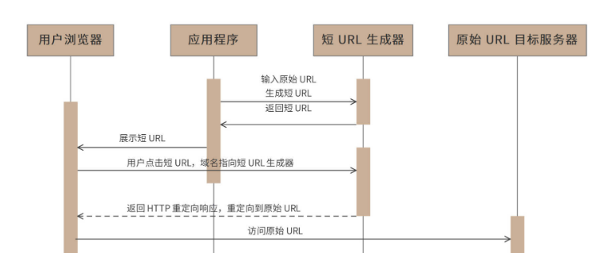
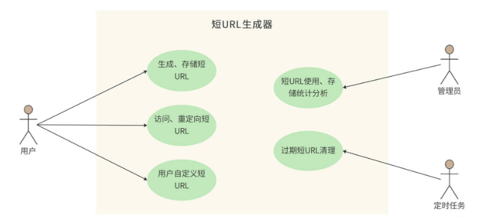
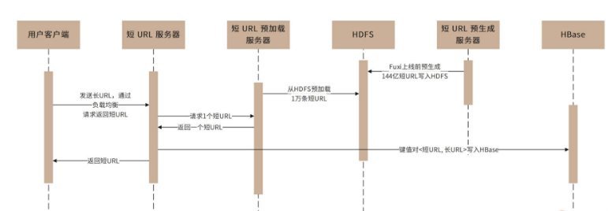
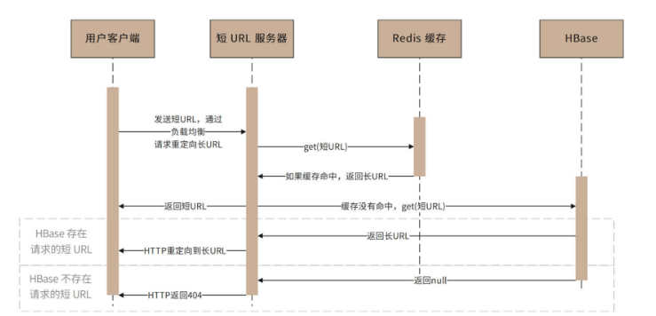
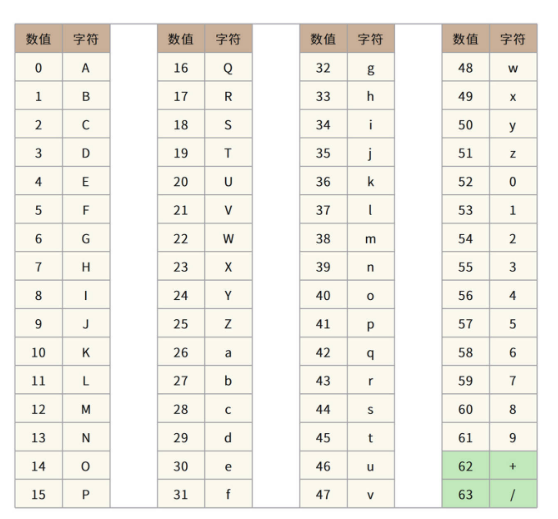

# 短 URL 生成器设计：百亿短 URL 怎样做到无冲突

:::info
<font style="color:rgb(77, 77, 77);">在社交媒体上，人们经常需要分享一些URL，但是有些URL可能会很长，比如：</font><font style="color:rgb(77, 77, 77);">https://geek.qq.org/hybrid/pvip?utm_source=geek-pc-discover-banner&utm_term=geek-pc-discover-banner</font>

<font style="color:rgb(77, 77, 77);">这样长的URL显然体验并不友好。我们期望分享的是一些更短、更易于阅读的短URL，比如像</font><font style="color:rgb(77, 77, 77);"> </font>[http://1.cn/ScW4dt](http://1.cn/ScW4dt)<font style="color:rgb(77, 77, 77);"> </font><font style="color:rgb(77, 77, 77);">这样的。当用户点击这个短URL的时候，可以重定向访问到原始的链接地址。为此我们将设计开发一个短URL生成器，产品名称是“Fuxi（伏羲）”。</font>

<font style="color:rgb(77, 77, 77);">我们预计Fuxi需要管理的短URL规模在百亿级别，并发吞吐量达到数万级别。这个量级的数据对应的存储方案是什么样的？用传统的关系数据库存储，还是有其他更简单的办法？此外，如何提升系统的并发处理能力呢？这些是我们今天要重点考虑的问题。</font>

:::


### **<font style="color:rgb(79, 79, 79);">1 需求分析</font>**
<font style="color:rgb(77, 77, 77);">短URL生成器，也称作短链接生成器，就是将一个比较长的URL生成一个比较短的URL，当浏览器通过短URL生成器访问这个短URL的时候，重定向访问到原始的长URL目标服务器，访问时序图如下。</font>



<font style="color:rgb(77, 77, 77);">对于需要展示短URL的应用程序，由该应用调用短URL生成器生成短URL，并将该短URL展示给用户，用户在浏览器中点击该短URL的时候，请求发送到短URL生成器（短URL生成器以HTTP服务器的方式对外提供服务，短URL域名指向短URL生成器），短URL生成器返回HTTP重定向响应，将用户请求重定向到最初的原始长URL，浏览器访问长URL服务器，完成请求服务。</font>

#### **<font style="color:rgb(79, 79, 79);">1.1 短URL生成器的用例图</font>**


1. <font style="color:rgb(51, 51, 51);">用户client程序可以使用短URL生成器Fuxi为每个长URL生成唯一的短URL，并存储起来。</font>
2. <font style="color:rgb(51, 51, 51);">用户可以访问这个短URL，Fuxi将请求重定向到原始长URL。</font>
3. <font style="color:rgb(51, 51, 51);">生成的短URL可以是Fuxi自动生成的，也可以是用户自定义的。用户可以指定一个长URL对应的短URL内容，只要这个短URL还没有被使用。</font>
4. <font style="color:rgb(51, 51, 51);">管理员可以通过web后台检索、查看Fuxi的使用情况。</font>
5. <font style="color:rgb(51, 51, 51);">短URL有有效期（2年），后台定时任务会清理超过有效期的URL，以节省存储资源，同时回收短URL地址链接资源。</font>

#### **<font style="color:rgb(79, 79, 79);">1.2 性能指标估算</font>**
<font style="color:rgb(77, 77, 77);">Fuxi的</font>**<font style="color:rgb(77, 77, 77);">存储容量</font>**<font style="color:rgb(77, 77, 77);">和</font>**<font style="color:rgb(77, 77, 77);">并发量</font>**<font style="color:rgb(77, 77, 77);">估算如下。</font>

<font style="color:rgb(77, 77, 77);">预计每月新生成短URL 5亿条，短URL有效期2年，那么总URL数量120亿。</font>

<font style="color:rgb(77, 77, 77);">s</font><font style="color:rgb(77, 77, 77);">m</font><font style="color:rgb(77, 77, 77);">a</font><font style="color:rgb(77, 77, 77);">l</font><font style="color:rgb(77, 77, 77);">l</font><font style="color:rgb(77, 77, 77);">5</font><font style="color:rgb(77, 77, 77);">亿</font><font style="color:rgb(77, 77, 77);">t</font><font style="color:rgb(77, 77, 77);">i</font><font style="color:rgb(77, 77, 77);">m</font><font style="color:rgb(77, 77, 77);">e</font><font style="color:rgb(77, 77, 77);">s</font><font style="color:rgb(77, 77, 77);">12</font><font style="color:rgb(77, 77, 77);">月</font><font style="color:rgb(77, 77, 77);">t</font><font style="color:rgb(77, 77, 77);">i</font><font style="color:rgb(77, 77, 77);">m</font><font style="color:rgb(77, 77, 77);">e</font><font style="color:rgb(77, 77, 77);">s</font><font style="color:rgb(77, 77, 77);">2</font><font style="color:rgb(77, 77, 77);">年</font><font style="color:rgb(77, 77, 77);">=</font><font style="color:rgb(77, 77, 77);">120</font><font style="color:rgb(77, 77, 77);">亿</font><font style="color:rgb(77, 77, 77);">𝑠</font><font style="color:rgb(77, 77, 77);">𝑚</font><font style="color:rgb(77, 77, 77);">𝑎</font><font style="color:rgb(77, 77, 77);">𝑙</font><font style="color:rgb(77, 77, 77);">𝑙</font><font style="color:rgb(77, 77, 77);">5</font><font style="color:rgb(77, 77, 77);">亿</font><font style="color:rgb(77, 77, 77);">𝑡</font><font style="color:rgb(77, 77, 77);">𝑖</font><font style="color:rgb(77, 77, 77);">𝑚</font><font style="color:rgb(77, 77, 77);">𝑒</font><font style="color:rgb(77, 77, 77);">𝑠</font><font style="color:rgb(77, 77, 77);">12</font><font style="color:rgb(77, 77, 77);">月</font><font style="color:rgb(77, 77, 77);">𝑡</font><font style="color:rgb(77, 77, 77);">𝑖</font><font style="color:rgb(77, 77, 77);">𝑚</font><font style="color:rgb(77, 77, 77);">𝑒</font><font style="color:rgb(77, 77, 77);">𝑠</font><font style="color:rgb(77, 77, 77);">2</font><font style="color:rgb(77, 77, 77);">年</font><font style="color:rgb(77, 77, 77);">=</font><font style="color:rgb(77, 77, 77);">120</font><font style="color:rgb(77, 77, 77);">亿</font>

+ **<font style="color:rgb(51, 51, 51);">存储空间</font>**<font style="color:rgb(51, 51, 51);">- 每条短URL数据库记录大约1KB，那么需要总存储空间12TB（不含数据冗余备份）。</font>

<font style="color:rgb(77, 77, 77);">s</font><font style="color:rgb(77, 77, 77);">m</font><font style="color:rgb(77, 77, 77);">a</font><font style="color:rgb(77, 77, 77);">l</font><font style="color:rgb(77, 77, 77);">l</font><font style="color:rgb(77, 77, 77);">120</font><font style="color:rgb(77, 77, 77);">亿</font><font style="color:rgb(77, 77, 77);">t</font><font style="color:rgb(77, 77, 77);">i</font><font style="color:rgb(77, 77, 77);">m</font><font style="color:rgb(77, 77, 77);">e</font><font style="color:rgb(77, 77, 77);">s</font><font style="color:rgb(77, 77, 77);">1</font><font style="color:rgb(77, 77, 77);">K</font><font style="color:rgb(77, 77, 77);">B</font><font style="color:rgb(77, 77, 77);">=</font><font style="color:rgb(77, 77, 77);">12</font><font style="color:rgb(77, 77, 77);">T</font><font style="color:rgb(77, 77, 77);">B</font><font style="color:rgb(77, 77, 77);">𝑠</font><font style="color:rgb(77, 77, 77);">𝑚</font><font style="color:rgb(77, 77, 77);">𝑎</font><font style="color:rgb(77, 77, 77);">𝑙</font><font style="color:rgb(77, 77, 77);">𝑙</font><font style="color:rgb(77, 77, 77);">120</font><font style="color:rgb(77, 77, 77);">亿</font><font style="color:rgb(77, 77, 77);">𝑡</font><font style="color:rgb(77, 77, 77);">𝑖</font><font style="color:rgb(77, 77, 77);">𝑚</font><font style="color:rgb(77, 77, 77);">𝑒</font><font style="color:rgb(77, 77, 77);">𝑠</font><font style="color:rgb(77, 77, 77);">1</font><font style="color:rgb(77, 77, 77);">𝐾</font><font style="color:rgb(77, 77, 77);">𝐵</font><font style="color:rgb(77, 77, 77);">=</font><font style="color:rgb(77, 77, 77);">12</font><font style="color:rgb(77, 77, 77);">𝑇</font><font style="color:rgb(77, 77, 77);">𝐵</font>

+ **<font style="color:rgb(51, 51, 51);">吞吐量</font>**<font style="color:rgb(51, 51, 51);">- 每条短URL平均读取次数100次，那么平均访问吞吐量（每秒访问次数）2万。</font>

<font style="color:rgb(77, 77, 77);">s</font><font style="color:rgb(77, 77, 77);">m</font><font style="color:rgb(77, 77, 77);">a</font><font style="color:rgb(77, 77, 77);">l</font><font style="color:rgb(77, 77, 77);">l</font><font style="color:rgb(77, 77, 77);">（</font><font style="color:rgb(77, 77, 77);">5</font><font style="color:rgb(77, 77, 77);">亿</font><font style="color:rgb(77, 77, 77);">t</font><font style="color:rgb(77, 77, 77);">i</font><font style="color:rgb(77, 77, 77);">m</font><font style="color:rgb(77, 77, 77);">e</font><font style="color:rgb(77, 77, 77);">s</font><font style="color:rgb(77, 77, 77);">100</font><font style="color:rgb(77, 77, 77);">）</font><font style="color:rgb(77, 77, 77);">d</font><font style="color:rgb(77, 77, 77);">i</font><font style="color:rgb(77, 77, 77);">v</font><font style="color:rgb(77, 77, 77);">（</font><font style="color:rgb(77, 77, 77);">30</font><font style="color:rgb(77, 77, 77);">t</font><font style="color:rgb(77, 77, 77);">i</font><font style="color:rgb(77, 77, 77);">m</font><font style="color:rgb(77, 77, 77);">e</font><font style="color:rgb(77, 77, 77);">s</font><font style="color:rgb(77, 77, 77);">24</font><font style="color:rgb(77, 77, 77);">t</font><font style="color:rgb(77, 77, 77);">i</font><font style="color:rgb(77, 77, 77);">m</font><font style="color:rgb(77, 77, 77);">e</font><font style="color:rgb(77, 77, 77);">s</font><font style="color:rgb(77, 77, 77);">60</font><font style="color:rgb(77, 77, 77);">t</font><font style="color:rgb(77, 77, 77);">i</font><font style="color:rgb(77, 77, 77);">m</font><font style="color:rgb(77, 77, 77);">e</font><font style="color:rgb(77, 77, 77);">s</font><font style="color:rgb(77, 77, 77);">60</font><font style="color:rgb(77, 77, 77);">）</font><font style="color:rgb(77, 77, 77);">a</font><font style="color:rgb(77, 77, 77);">p</font><font style="color:rgb(77, 77, 77);">p</font><font style="color:rgb(77, 77, 77);">r</font><font style="color:rgb(77, 77, 77);">o</font><font style="color:rgb(77, 77, 77);">x</font><font style="color:rgb(77, 77, 77);">20000</font><font style="color:rgb(77, 77, 77);">𝑠</font><font style="color:rgb(77, 77, 77);">𝑚</font><font style="color:rgb(77, 77, 77);">𝑎</font><font style="color:rgb(77, 77, 77);">𝑙</font><font style="color:rgb(77, 77, 77);">𝑙</font><font style="color:rgb(77, 77, 77);">（</font><font style="color:rgb(77, 77, 77);">5</font><font style="color:rgb(77, 77, 77);">亿</font><font style="color:rgb(77, 77, 77);">𝑡</font><font style="color:rgb(77, 77, 77);">𝑖</font><font style="color:rgb(77, 77, 77);">𝑚</font><font style="color:rgb(77, 77, 77);">𝑒</font><font style="color:rgb(77, 77, 77);">𝑠</font><font style="color:rgb(77, 77, 77);">100</font><font style="color:rgb(77, 77, 77);">）</font><font style="color:rgb(77, 77, 77);">𝑑</font><font style="color:rgb(77, 77, 77);">𝑖</font><font style="color:rgb(77, 77, 77);">𝑣</font><font style="color:rgb(77, 77, 77);">（</font><font style="color:rgb(77, 77, 77);">30</font><font style="color:rgb(77, 77, 77);">𝑡</font><font style="color:rgb(77, 77, 77);">𝑖</font><font style="color:rgb(77, 77, 77);">𝑚</font><font style="color:rgb(77, 77, 77);">𝑒</font><font style="color:rgb(77, 77, 77);">𝑠</font><font style="color:rgb(77, 77, 77);">24</font><font style="color:rgb(77, 77, 77);">𝑡</font><font style="color:rgb(77, 77, 77);">𝑖</font><font style="color:rgb(77, 77, 77);">𝑚</font><font style="color:rgb(77, 77, 77);">𝑒</font><font style="color:rgb(77, 77, 77);">𝑠</font><font style="color:rgb(77, 77, 77);">60</font><font style="color:rgb(77, 77, 77);">𝑡</font><font style="color:rgb(77, 77, 77);">𝑖</font><font style="color:rgb(77, 77, 77);">𝑚</font><font style="color:rgb(77, 77, 77);">𝑒</font><font style="color:rgb(77, 77, 77);">𝑠</font><font style="color:rgb(77, 77, 77);">60</font><font style="color:rgb(77, 77, 77);">）</font><font style="color:rgb(77, 77, 77);">𝑎</font><font style="color:rgb(77, 77, 77);">𝑝</font><font style="color:rgb(77, 77, 77);">𝑝</font><font style="color:rgb(77, 77, 77);">𝑟</font><font style="color:rgb(77, 77, 77);">𝑜</font><font style="color:rgb(77, 77, 77);">𝑥</font><font style="color:rgb(77, 77, 77);">20000</font>

<font style="color:rgb(77, 77, 77);">一般系统高峰期访问量是平均访问量的2倍，因此系统架构需要支持的吞吐能力应为4万。</font>

+ **<font style="color:rgb(51, 51, 51);">网络带宽</font>**<font style="color:rgb(51, 51, 51);">- 短URL的重定向响应包含长URL地址内容，长URL地址大约500B，HTTP响应头其他内容大约500B，所以每个响应1KB，高峰期需要的响应网络带宽320Mb。</font>

<font style="color:rgb(77, 77, 77);">s</font><font style="color:rgb(77, 77, 77);">m</font><font style="color:rgb(77, 77, 77);">a</font><font style="color:rgb(77, 77, 77);">l</font><font style="color:rgb(77, 77, 77);">l</font><font style="color:rgb(77, 77, 77);">4</font><font style="color:rgb(77, 77, 77);">万</font><font style="color:rgb(77, 77, 77);">（</font><font style="color:rgb(77, 77, 77);">每</font><font style="color:rgb(77, 77, 77);">秒</font><font style="color:rgb(77, 77, 77);">）</font><font style="color:rgb(77, 77, 77);">次</font><font style="color:rgb(77, 77, 77);">请</font><font style="color:rgb(77, 77, 77);">求</font><font style="color:rgb(77, 77, 77);">t</font><font style="color:rgb(77, 77, 77);">i</font><font style="color:rgb(77, 77, 77);">m</font><font style="color:rgb(77, 77, 77);">e</font><font style="color:rgb(77, 77, 77);">s</font><font style="color:rgb(77, 77, 77);">1</font><font style="color:rgb(77, 77, 77);">K</font><font style="color:rgb(77, 77, 77);">B</font><font style="color:rgb(77, 77, 77);">=</font><font style="color:rgb(77, 77, 77);">40</font><font style="color:rgb(77, 77, 77);">M</font><font style="color:rgb(77, 77, 77);">B</font><font style="color:rgb(77, 77, 77);">t</font><font style="color:rgb(77, 77, 77);">i</font><font style="color:rgb(77, 77, 77);">m</font><font style="color:rgb(77, 77, 77);">e</font><font style="color:rgb(77, 77, 77);">s</font><font style="color:rgb(77, 77, 77);">8</font><font style="color:rgb(77, 77, 77);">b</font><font style="color:rgb(77, 77, 77);">i</font><font style="color:rgb(77, 77, 77);">t</font><font style="color:rgb(77, 77, 77);">=</font><font style="color:rgb(77, 77, 77);">320</font><font style="color:rgb(77, 77, 77);">M</font><font style="color:rgb(77, 77, 77);">b</font><font style="color:rgb(77, 77, 77);">𝑠</font><font style="color:rgb(77, 77, 77);">𝑚</font><font style="color:rgb(77, 77, 77);">𝑎</font><font style="color:rgb(77, 77, 77);">𝑙</font><font style="color:rgb(77, 77, 77);">𝑙</font><font style="color:rgb(77, 77, 77);">4</font><font style="color:rgb(77, 77, 77);">万</font><font style="color:rgb(77, 77, 77);">（</font><font style="color:rgb(77, 77, 77);">每</font><font style="color:rgb(77, 77, 77);">秒</font><font style="color:rgb(77, 77, 77);">）</font><font style="color:rgb(77, 77, 77);">次</font><font style="color:rgb(77, 77, 77);">请</font><font style="color:rgb(77, 77, 77);">求</font><font style="color:rgb(77, 77, 77);">𝑡</font><font style="color:rgb(77, 77, 77);">𝑖</font><font style="color:rgb(77, 77, 77);">𝑚</font><font style="color:rgb(77, 77, 77);">𝑒</font><font style="color:rgb(77, 77, 77);">𝑠</font><font style="color:rgb(77, 77, 77);">1</font><font style="color:rgb(77, 77, 77);">𝐾</font><font style="color:rgb(77, 77, 77);">𝐵</font><font style="color:rgb(77, 77, 77);">=</font><font style="color:rgb(77, 77, 77);">40</font><font style="color:rgb(77, 77, 77);">𝑀</font><font style="color:rgb(77, 77, 77);">𝐵</font><font style="color:rgb(77, 77, 77);">𝑡</font><font style="color:rgb(77, 77, 77);">𝑖</font><font style="color:rgb(77, 77, 77);">𝑚</font><font style="color:rgb(77, 77, 77);">𝑒</font><font style="color:rgb(77, 77, 77);">𝑠</font><font style="color:rgb(77, 77, 77);">8</font><font style="color:rgb(77, 77, 77);">𝑏</font><font style="color:rgb(77, 77, 77);">𝑖</font><font style="color:rgb(77, 77, 77);">𝑡</font><font style="color:rgb(77, 77, 77);">=</font><font style="color:rgb(77, 77, 77);">320</font><font style="color:rgb(77, 77, 77);">𝑀</font><font style="color:rgb(77, 77, 77);">𝑏</font>

<font style="color:rgb(77, 77, 77);">Fuxi的</font>**<font style="color:rgb(77, 77, 77);">短URL长度估算</font>**<font style="color:rgb(77, 77, 77);">如下。</font>

<font style="color:rgb(77, 77, 77);">短URL采用Base64编码，如果短URL长度是7个字符的话，大约可以编码4万亿个短URL。</font>

<font style="color:rgb(77, 77, 77);">s</font><font style="color:rgb(77, 77, 77);">m</font><font style="color:rgb(77, 77, 77);">a</font><font style="color:rgb(77, 77, 77);">l</font><font style="color:rgb(77, 77, 77);">l</font><font style="color:rgb(77, 77, 77);">64</font><font style="color:rgb(77, 77, 77);">7</font><font style="color:rgb(77, 77, 77);">a</font><font style="color:rgb(77, 77, 77);">p</font><font style="color:rgb(77, 77, 77);">p</font><font style="color:rgb(77, 77, 77);">r</font><font style="color:rgb(77, 77, 77);">o</font><font style="color:rgb(77, 77, 77);">x</font><font style="color:rgb(77, 77, 77);">4</font><font style="color:rgb(77, 77, 77);">万</font><font style="color:rgb(77, 77, 77);">亿</font><font style="color:rgb(77, 77, 77);">𝑠</font><font style="color:rgb(77, 77, 77);">𝑚</font><font style="color:rgb(77, 77, 77);">𝑎</font><font style="color:rgb(77, 77, 77);">𝑙</font><font style="color:rgb(77, 77, 77);">𝑙</font><font style="color:rgb(77, 77, 77);">64</font><font style="color:rgb(77, 77, 77);">7</font><font style="color:rgb(77, 77, 77);">𝑎</font><font style="color:rgb(77, 77, 77);">𝑝</font><font style="color:rgb(77, 77, 77);">𝑝</font><font style="color:rgb(77, 77, 77);">𝑟</font><font style="color:rgb(77, 77, 77);">𝑜</font><font style="color:rgb(77, 77, 77);">𝑥</font><font style="color:rgb(77, 77, 77);">4</font><font style="color:rgb(77, 77, 77);">万</font><font style="color:rgb(77, 77, 77);">亿</font>

<font style="color:rgb(77, 77, 77);">如果短URL长度是6个字符的话，大约可以编码680亿个短URL。</font>

<font style="color:rgb(77, 77, 77);">s</font><font style="color:rgb(77, 77, 77);">m</font><font style="color:rgb(77, 77, 77);">a</font><font style="color:rgb(77, 77, 77);">l</font><font style="color:rgb(77, 77, 77);">l</font><font style="color:rgb(77, 77, 77);">64</font><font style="color:rgb(77, 77, 77);">6</font><font style="color:rgb(77, 77, 77);">a</font><font style="color:rgb(77, 77, 77);">p</font><font style="color:rgb(77, 77, 77);">p</font><font style="color:rgb(77, 77, 77);">r</font><font style="color:rgb(77, 77, 77);">o</font><font style="color:rgb(77, 77, 77);">x</font><font style="color:rgb(77, 77, 77);">680</font><font style="color:rgb(77, 77, 77);">亿</font><font style="color:rgb(77, 77, 77);">𝑠</font><font style="color:rgb(77, 77, 77);">𝑚</font><font style="color:rgb(77, 77, 77);">𝑎</font><font style="color:rgb(77, 77, 77);">𝑙</font><font style="color:rgb(77, 77, 77);">𝑙</font><font style="color:rgb(77, 77, 77);">64</font><font style="color:rgb(77, 77, 77);">6</font><font style="color:rgb(77, 77, 77);">𝑎</font><font style="color:rgb(77, 77, 77);">𝑝</font><font style="color:rgb(77, 77, 77);">𝑝</font><font style="color:rgb(77, 77, 77);">𝑟</font><font style="color:rgb(77, 77, 77);">𝑜</font><font style="color:rgb(77, 77, 77);">𝑥</font><font style="color:rgb(77, 77, 77);">680</font><font style="color:rgb(77, 77, 77);">亿</font>

<font style="color:rgb(77, 77, 77);">按我们前面评估，总URL数120亿，6个字符的编码就可以满足需求。因此Fuxi的短URL编码长度6个字符，形如</font>[http://l.cn/ScW4dt](http://l.cn/ScW4dt)<font style="color:rgb(77, 77, 77);"> </font><font style="color:rgb(77, 77, 77);">。</font>

#### **<font style="color:rgb(79, 79, 79);">1.3 非功能需求</font>**
1. <font style="color:rgb(51, 51, 51);">系统需要保持高可用，不因为服务器、数据库宕机而引起服务失效。</font>
2. <font style="color:rgb(51, 51, 51);">系统需要保持高性能，服务端80%请求响应时间应小于5ms，99%请求响应时间小于20ms，平均响应时间小于10ms。</font>
3. <font style="color:rgb(51, 51, 51);">短URL应该是不可猜测的，即不能猜测某个短URL是否存在，也不能猜测短URL可能对应的长URL地址内容。</font>

### **<font style="color:rgb(79, 79, 79);">2 概要设计</font>**
<font style="color:rgb(77, 77, 77);">短URL生成器的设计核心就是短URL的生成，即长URL通过某种函数，计算得到一个6个字符的短URL。短URL有几种不同的生成算法。</font>

#### **<font style="color:rgb(79, 79, 79);">2.1 单项散列函数生成短URL</font>**
<font style="color:rgb(77, 77, 77);">通常的设计方案是，将长URL利用MD5或者SHA256等单项散列算法，进行Hash计算，得到128bit或者256bit的Hash值。然后对该Hash值进行Base64编码，得到22个或者43个Base64字符，再截取前面的6个字符，就得到短URL了，如图。</font>


<font style="color:rgb(77, 77, 77);">但是这样得到的短URL，可能会发生Hash冲突，即不同的长URL，计算得到的短URL是相同的（MD5或者SHA256计算得到的Hash值几乎不会冲突，但是Base64编码后再截断的6个字符有可能会冲突）。所以在生成的时候，需要先校验该短URL是否已经映射为其他的长URL，如果是，那么需要重新计算（换单向散列算法，或者换Base64编码截断位置）。重新计算得到的短URL依然可能冲突，需要再重新计算。</font>

<font style="color:rgb(77, 77, 77);">但是这样的冲突处理需要多次到存储中查找URL，无法保证Fuxi的性能要求。</font>

#### **<font style="color:rgb(79, 79, 79);">2.2 自增长短URL</font>**
<font style="color:rgb(77, 77, 77);">一种免冲突的算法是用自增长自然数来实现，即维持一个自增长的二进制自然数，然后将该自然数进行Base64编码即可得到一系列的短URL。这样生成的的短URL必然唯一，而且还可以生成小于6个字符的短URL，比如自然数0的Base64编码是字符“A”，就可以用http://1.cn/A作为短URL。</font>

<font style="color:rgb(77, 77, 77);">但是这种算法将导致短URL是可猜测的，如果某个应用在某个时间段内生成了一批短URL，那么这批短URL就会集中在一个自然数区间内。只要知道了其中一个短URL，就可以通过自增（以及自减）的方式请求访问其他URL。Fuxi的需求是不允许短URL可预测。</font>

#### **<font style="color:rgb(79, 79, 79);">2.3 预生成短URL</font>**
<font style="color:rgb(77, 77, 77);">因此，Fuxi采用预生成短URL的方案。即预先生成一批没有冲突的短URL字符串，当外部请求输入长URL需要生成短URL的时候，直接从预先生成好的短URL字符串池中获取一个即可。</font>

<font style="color:rgb(77, 77, 77);">预生成短URL的算法可以采用随机数来实现，6个字符，每个字符都用随机数产生（用0~63的随机数产生一个Base64编码字符）。为了避免随机数产生的短URL冲突，需要在预生成的时候检查该URL是否已经存在（用布隆过滤器检查）。因为预生成短URL是离线的，所以这时不会有性能方面的问题。事实上，Fuxi在上线之前就已经生成全部需要的144亿条短URL并存储在文件系统中（预估需要短URL120亿，Fuxi预生成的时候进行了20%的冗余，即144亿。）</font>

#### **<font style="color:rgb(79, 79, 79);">2.4 Fuxi的整体部署模型</font>**
<font style="color:rgb(77, 77, 77);">Fuxi的业务逻辑比较简单，相对比较有挑战的就是</font>**<font style="color:rgb(77, 77, 77);">高并发的读请求如何处理、预生成的短URL如何存储以及访问</font>**<font style="color:rgb(77, 77, 77);">。高并发访问主要通过负载均衡与分布式缓存解决，而海量数据存储则通过HDFS以及HBase来完成。具体架构图如下。</font>


<font style="color:rgb(77, 77, 77);">系统调用可以分成两种情况，一种是用户请求生成短URL的过程；另一种是用户访问短URL，通过Fuxi跳转到长URL的过程。</font>

<font style="color:rgb(77, 77, 77);">对于用户请求生成短URL的过程，在短URL系统Fuxi上线前，已经通过随机数算法预生成144亿条短URL并将其存储在HDFS文件系统中。系统上线运行后，应用程序请求生成短URL的时候（即输入长URL，请求返回短URL），请求通过负载均衡服务器被发送到短URL服务器集群，短URL服务器再通过负载均衡服务器调用短URL预加载服务器集群。</font>

<font style="color:rgb(77, 77, 77);">短URL预加载服务器此前已经从短URL预生成文件服务器（HDFS）中加载了一批短URL存放在自己的内存中，这时，只需要从内存中返回一个短URL即可，同时将短URL与长URL的映射关系存储在HBase数据库中，时序图如下。</font>



<font style="color:rgb(77, 77, 77);">对于用户通过客户端请求访问短URL的过程（即输入短URL，请求返回长URL），请求通过负载均衡服务器发送到短URL服务器集群，短URL服务器首先到缓存服务器中查找是否有该短URL，如果有，立即返回对应的长URL，短URL生成服务器构造重定向响应返回给客户端应用。</font>

<font style="color:rgb(77, 77, 77);">如果缓存没有用户请求访问的短URL，短URL服务器将访问HBase短URL数据库服务器集群。如果数据库中存在该短URL，短URL服务器会将该短URL写入缓存服务器集群，并构造重定向响应返回给客户端应用。如果HBase中没有该短URL，短URL服务器将构造404响应返回给客户端应用，时序图如下。</font>



<font style="color:rgb(77, 77, 77);">过期短URL清理服务器会每个月启动一次，将已经超过有效期（2年）的URL数据删除，并将这些短URL追加写入到短URL预生成文件中。</font>

<font style="color:rgb(77, 77, 77);">为了保证系统</font>**<font style="color:rgb(77, 77, 77);">高可用</font>**<font style="color:rgb(77, 77, 77);">，Fuxi的应用服务器、文件服务器、数据库服务器都采用集群部署方案，单个服务器故障不会影响Fuxi短URL的可用性。</font>

<font style="color:rgb(77, 77, 77);">对于Fuxi的</font>**<font style="color:rgb(77, 77, 77);">高性能</font>**<font style="color:rgb(77, 77, 77);">要求，80%以上的访问请求将被设计为通过缓存返回。Redis的缓存响应时间1ms左右，服务器端请求响应时间小于3ms，满足80%请求小于5ms的性能目标。对于缓存没有命中的数据，通过HBase获取，HBase平均响应时间10ms，也可以满足设计目标中的性能指标。</font>

<font style="color:rgb(77, 77, 77);">对于Redis缓存</font>**<font style="color:rgb(77, 77, 77);">内存空间</font>**<font style="color:rgb(77, 77, 77);">估算，业界一般认为，超过80%请求集中在最近6天生成的短URL上，Fuxi主要缓存最近六天生成的短URL即可。根据需求容量估计，最近6天生成的短URL数量约1亿条，因此需要Redis缓存服务器内存空间：</font><font style="color:rgb(77, 77, 77);">s</font><font style="color:rgb(77, 77, 77);">m</font><font style="color:rgb(77, 77, 77);">a</font><font style="color:rgb(77, 77, 77);">l</font><font style="color:rgb(77, 77, 77);">l</font><font style="color:rgb(77, 77, 77);">1</font><font style="color:rgb(77, 77, 77);">亿</font><font style="color:rgb(77, 77, 77);">t</font><font style="color:rgb(77, 77, 77);">i</font><font style="color:rgb(77, 77, 77);">m</font><font style="color:rgb(77, 77, 77);">e</font><font style="color:rgb(77, 77, 77);">s</font><font style="color:rgb(77, 77, 77);">1</font><font style="color:rgb(77, 77, 77);">K</font><font style="color:rgb(77, 77, 77);">B</font><font style="color:rgb(77, 77, 77);">=</font><font style="color:rgb(77, 77, 77);">100</font><font style="color:rgb(77, 77, 77);">G</font><font style="color:rgb(77, 77, 77);">B</font><font style="color:rgb(77, 77, 77);">𝑠</font><font style="color:rgb(77, 77, 77);">𝑚</font><font style="color:rgb(77, 77, 77);">𝑎</font><font style="color:rgb(77, 77, 77);">𝑙</font><font style="color:rgb(77, 77, 77);">𝑙</font><font style="color:rgb(77, 77, 77);">1</font><font style="color:rgb(77, 77, 77);">亿</font><font style="color:rgb(77, 77, 77);">𝑡</font><font style="color:rgb(77, 77, 77);">𝑖</font><font style="color:rgb(77, 77, 77);">𝑚</font><font style="color:rgb(77, 77, 77);">𝑒</font><font style="color:rgb(77, 77, 77);">𝑠</font><font style="color:rgb(77, 77, 77);">1</font><font style="color:rgb(77, 77, 77);">𝐾</font><font style="color:rgb(77, 77, 77);">𝐵</font><font style="color:rgb(77, 77, 77);">=</font><font style="color:rgb(77, 77, 77);">100</font><font style="color:rgb(77, 77, 77);">𝐺</font><font style="color:rgb(77, 77, 77);">𝐵</font><font style="color:rgb(77, 77, 77);">。</font>

### **<font style="color:rgb(79, 79, 79);">3 详细设计</font>**
<font style="color:rgb(77, 77, 77);">详细设计关注重定向响应码、短URL预生成文件及加载、用户自定义短URL等几个关键设计点。</font>

#### **<font style="color:rgb(79, 79, 79);">3.1 重定向响应码</font>**
<font style="color:rgb(77, 77, 77);">满足短URL重定向要求的HTTP重定向响应码有301和302两种，其中301表示永久重定向，即浏览器一旦访问过该短URL，就将重定向的原始长URL缓存在本地，此后不再请求短URL生成器，直接根据缓存在浏览器（HTTP客户端）的长URL路径进行访问。</font>

<font style="color:rgb(77, 77, 77);">302表示临时重定向，每次访问短URL都需要访问短URL生成器。</font>

<font style="color:rgb(77, 77, 77);">一般说来，使用301状态码可以降低Fuxi服务器的负载压力，但无法统计短URL的使用情况，而Fuxi的架构设计完全可以承受这些负载压力，因此Fuxi使用302状态码构造重定向响应。</font>

#### **<font style="color:rgb(79, 79, 79);">3.2 短URL预生成文件及预加载</font>**
<font style="color:rgb(77, 77, 77);">Fuxi的短URL是在系统上线前全部预生成的，并存储在HDFS文件中。共144亿个短URL，每个短URL 6个字符，文件大小</font><font style="color:rgb(77, 77, 77);">s</font><font style="color:rgb(77, 77, 77);">m</font><font style="color:rgb(77, 77, 77);">a</font><font style="color:rgb(77, 77, 77);">l</font><font style="color:rgb(77, 77, 77);">l</font><font style="color:rgb(77, 77, 77);">144</font><font style="color:rgb(77, 77, 77);">亿</font><font style="color:rgb(77, 77, 77);">t</font><font style="color:rgb(77, 77, 77);">i</font><font style="color:rgb(77, 77, 77);">m</font><font style="color:rgb(77, 77, 77);">e</font><font style="color:rgb(77, 77, 77);">s</font><font style="color:rgb(77, 77, 77);">6</font><font style="color:rgb(77, 77, 77);">B</font><font style="color:rgb(77, 77, 77);">=</font><font style="color:rgb(77, 77, 77);">86.4</font><font style="color:rgb(77, 77, 77);">G</font><font style="color:rgb(77, 77, 77);">B</font><font style="color:rgb(77, 77, 77);">𝑠</font><font style="color:rgb(77, 77, 77);">𝑚</font><font style="color:rgb(77, 77, 77);">𝑎</font><font style="color:rgb(77, 77, 77);">𝑙</font><font style="color:rgb(77, 77, 77);">𝑙</font><font style="color:rgb(77, 77, 77);">144</font><font style="color:rgb(77, 77, 77);">亿</font><font style="color:rgb(77, 77, 77);">𝑡</font><font style="color:rgb(77, 77, 77);">𝑖</font><font style="color:rgb(77, 77, 77);">𝑚</font><font style="color:rgb(77, 77, 77);">𝑒</font><font style="color:rgb(77, 77, 77);">𝑠</font><font style="color:rgb(77, 77, 77);">6</font><font style="color:rgb(77, 77, 77);">𝐵</font><font style="color:rgb(77, 77, 77);">=</font><font style="color:rgb(77, 77, 77);">86.4</font><font style="color:rgb(77, 77, 77);">𝐺</font><font style="color:rgb(77, 77, 77);">𝐵</font><font style="color:rgb(77, 77, 77);">。</font>

<font style="color:rgb(77, 77, 77);">文件格式就是直接将144亿个短URL的ASC码无分割地存储在文件中，如下是存储了3个短URL的文件示例：</font>

```plain
Wdj4FbOxTw9CHtvPM1
```

<font style="color:rgb(77, 77, 77);">所以如果短URL预加载服务器第一次启动的时候加载1万个短URL，那么就从文件头读取60K数据，并标记当前文件偏移量60K。下次再加载1万个短URL的时候，再从文件60K偏移位置继续读取60K数据即可。</font>

<font style="color:rgb(77, 77, 77);">因此，Fuxi除了需要一个在HDFS记录预生成短URL的文件外，还需要一个记录偏移量的文件，记录偏移量的文件也存储在HDFS中。同时，由于预加载短URL服务器集群部署多台服务器，会出现多台服务器同时加载相同短URL的情况，所以还需要利用偏移量文件对多个服务器进行互斥操作，即</font>**<font style="color:rgb(77, 77, 77);">利用文件系统写操作锁的互斥性实现多服务器访问互斥</font>**<font style="color:rgb(77, 77, 77);">。</font>

<font style="color:rgb(77, 77, 77);">应用程序的文件访问流程应该是：写打开偏移量文件 -> 读偏移量 -> 读打开短URL文件 -> 从偏移量开始读取60K数据 -> 关闭短URL文件 -> 修改偏移量文件 -> 关闭偏移量文件。</font>

<font style="color:rgb(77, 77, 77);">由于写打开偏移量文件是一个互斥操作，所以第一个预加载短URL服务器写打开偏移量文件以后，其他预加载短URL服务器无法再写打开该文件，也就无法完成读60K短URL数据及修改偏移量的操作，这样就能保证这两个操作是并发安全的。</font>

<font style="color:rgb(77, 77, 77);">加载到预加载短URL服务器的1万个短URL会以链表的方式存储，每使用一个短URL，链表头指针就向后移动一位，并设置前一个链表元素的next对象为null。这样用过的短URL对象可以被垃圾回收。</font>

<font style="color:rgb(77, 77, 77);">当剩余链表长度不足2000的时候，触发一个异步线程，从文件中加载1万个新的短URL，并链接到链表的尾部。</font>

<font style="color:rgb(77, 77, 77);">与之对应的URL链表类图如下。</font>


**<font style="color:rgb(77, 77, 77);">URLNode</font>**<font style="color:rgb(77, 77, 77);">：URL链表元素类，成员变量uRL即短URL字符串，next指向下一个链表元素。</font>

**<font style="color:rgb(77, 77, 77);">LinkedURL</font>**<font style="color:rgb(77, 77, 77);">：URL链表主类，成员变量head指向链表头指针元素，uRLAmount表示当前链表剩余元素个数。acquireURL()方法从链表头指针指向的元素中取出短URL字符串，并执行urlAmount– 操作。当urlAmount < 2000的时候，调用私有方法loadURL()，该方法调用一个线程从文件中加载1万个短URL并构造成链表添加到当前链表的尾部，并重置uRLAmount。</font>

##### **<font style="color:rgb(79, 79, 79);">3.2.1 用户自定义短URL</font>**
<font style="color:rgb(77, 77, 77);">Fuxi允许用户自己定义短URL，即在生成短URL的时候，由用户指定短URL的内容。为了避免预生成的短URL和用户指定的短URL冲突，Fuxi限制用户自定义短URL的字符个数，不允许用户使用6个字符的自定义短URL，且URL长度不得超过20个字符。</font>

<font style="color:rgb(77, 77, 77);">但是用户自定义短URL依然可能和其他用户自定义短URL冲突，所以Fuxi生成自定义短URL的时候需要到数据库中检查冲突，是否指定的URL已经被使用，如果发生冲突，要求用户重新指定。</font>

##### **<font style="color:rgb(79, 79, 79);">3.2.2 URL Base64编码</font>**
<font style="color:rgb(77, 77, 77);">标准Base64编码表如下。</font>



<font style="color:rgb(77, 77, 77);">其中“+”和“/”在URL中会被编码为“%2B”以及“%2F”，而“%”在写入数据库的时候又和SQL编码规则冲突，需要进行再编码，因此直接使用标准Base64编码进行短URL编码并不合适。URL保留字符编码表如下。</font>


<font style="color:rgb(77, 77, 77);">所以，我们需要针对URL场景对Base64编码进行改造，使用URL保留字符表以外的字符对Base64编码表中的62，63进行编码：将“+”改为“-”，将“/”改为“_”，Fuxi最终采用的URL Base64编码表如下。</font>


> 更新: 2024-07-15 22:21:19  
> 原文: <https://www.yuque.com/tulingzhouyu/db22bv/ercfbgeuan0gt6wb>