# n8n + MCP本地化部署AI工作流实战

## <font style="color:rgba(0, 0, 0, 0.88);background-color:rgb(246, 246, 246);">1. n8n与MCP概述</font>
n8n是一个具有原生AI功能的工作流自动化平台，提供代码灵活性和无代码速度的结合。它支持400多种集成，采用公平代码许可。

MCP(Model Context Protocol)是一种标准化协议，旨在为AI应用提供与外部工具、数据源和服务的交互接口。其核心功能是帮助AI系统动态捕捉、结构化处理上下文信息，并高效传递至模型 。

两者的结合可以创建强大的本地化AI工作流，实现从设计到部署的全流程自动化。

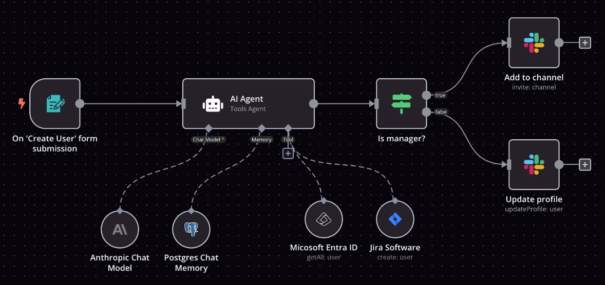

## 2. 本地部署n8n
<font style="color:rgba(0, 0, 0, 0.88);background-color:rgb(246, 246, 246);">n8n支持多种本地部署方式，以下是三种主要方法：</font>

### 2.1 使用Docker部署（推荐）
```plain
# 创建数据卷
docker volume create n8n_data

# 运行n8n容器
docker run -it --rm --name n8n -p 5678:5678 -v n8n_data:/home/node/.n8n docker.n8n.io/n8nio/n8n
```

#### n8n镜像拉取失败
如果出现n8n镜像下载不下来的问题，可以使用我提供的私有仓库的镜像

```plain
docker run -it --rm --name n8n -p 5678:5678 -v n8n_data:/home/node/.n8n registry.cn-hangzhou.aliyuncs.com/tulingfox/n8n
```

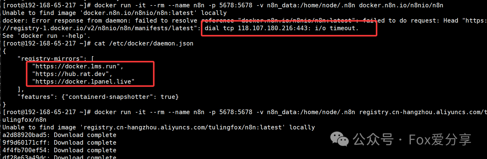

#### <font style="color:rgba(0, 0, 0, 0.88);background-color:rgb(246, 246, 246);">n8n安全Cookie配置问题</font>
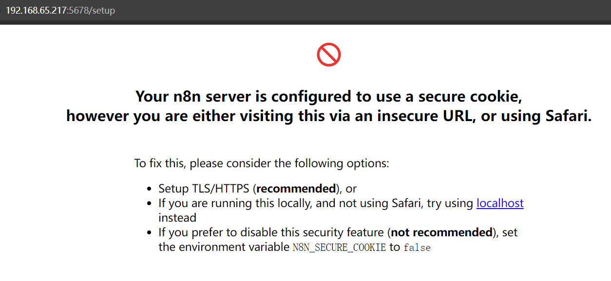

**三种解决方案：**

**1）启用HTTPS/TLS（推荐方案）**

这是最安全且推荐的解决方案，特别适合生产环境使用。

**<font style="color:rgba(0, 0, 0, 0.88);background-color:rgb(246, 246, 246);">2） 使用localhost访问（本地开发推荐）</font>**

如果您只是在本地开发测试，最简单的解决方案是：

+ 确保通过`http://localhost:5678`访问
+ 不要使用IP地址或域名访问
+ 避免使用Safari浏览器（因其特殊的安全策略）

这种方法保持了安全设置不变，仅调整访问方式。

**<font style="color:rgba(0, 0, 0, 0.88);background-color:rgb(246, 246, 246);">3）禁用安全Cookie（临时解决方案）</font>**

注意：这会降低安全性，仅建议在受控环境或临时测试时使用。

```plain
# 遇到安全cookie问题，可以添加环境变量禁用
docker run -it --rm --name n8n -p 5678:5678 -e N8N_SECURE_COOKIE=false -v n8n_data:/home/node/.n8n registry.cn-hangzhou.aliyuncs.com/tulingfox/n8n
```

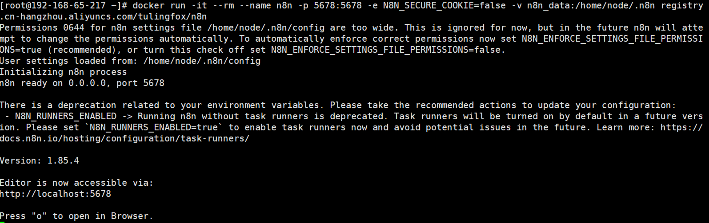

浏览器访问http://ip:5678，首次访问进入注册页面

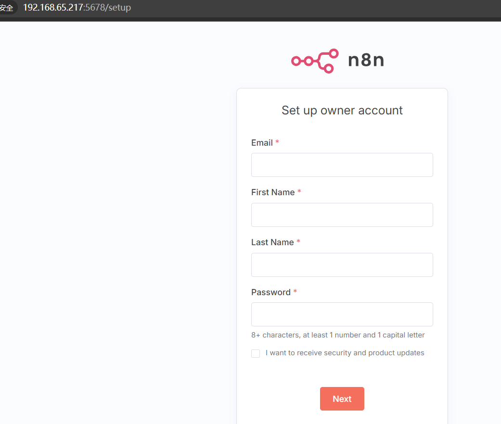

### <font style="color:rgba(0, 0, 0, 0.88);background-color:rgb(246, 246, 246);">2.2 使用Docker Compose部署（适合生产环境）</font>
<font style="color:rgba(0, 0, 0, 0.88);background-color:rgb(246, 246, 246);">创建</font>`<font style="color:rgba(0, 0, 0, 0.88);background-color:rgb(246, 246, 246);">docker-compose.yml</font>`<font style="color:rgba(0, 0, 0, 0.88);background-color:rgb(246, 246, 246);">文件：</font>

```plain
version: '3.8'

volumes:
  db_storage:
  n8n_storage:

services:
  postgres:
    image: postgres:16
    restart: always
    environment:
      - POSTGRES_USER=root
      - POSTGRES_PASSWORD=123456
      - POSTGRES_DB=n8n
    volumes:
      - db_storage:/var/lib/postgresql/data
    healthcheck:
      test: ['CMD-SHELL', 'pg_isready -h localhost -U root -d n8n']
      interval: 5s
      timeout: 5s
      retries: 10

  n8n:
    image: docker.n8n.io/n8nio/n8n
    restart: always
    environment:
      - DB_TYPE=postgresdb
      - DB_POSTGRESDB_HOST=postgres
      - DB_POSTGRESDB_PORT=5432
      - DB_POSTGRESDB_DATABASE=n8n
      - DB_POSTGRESDB_USER=root
      - DB_POSTGRESDB_PASSWORD=123456
    ports:
      - "5678:5678"
    volumes:
      - n8n_storage:/home/node/.n8n
    depends_on:
      postgres:
        condition: service_healthy
```

然后运行

```plain
docker compose up -d
```

### <font style="color:rgba(0, 0, 0, 0.88);background-color:rgb(246, 246, 246);">2.3 使用npm安装</font>
```plain
npx n8n
```

或者从源码安装

```plain
git clone https://github.com/n8n-io/n8n.git
cd n8n
npm install
npm run build
npm run start
```


## <font style="color:rgba(0, 0, 0, 0.88);background-color:rgb(246, 246, 246);">3. 安装MCP社区节点</font>
n8n默认不包含MCP支持，需要手动安装社区节点：

+ 登录n8n后进入个人账号设置页面
+ 点击"社区节点"

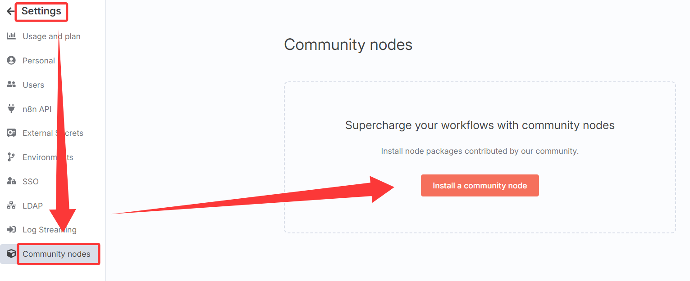

+ 选择"安装一个社区节点"，输入`n8n-nodes-mcp`

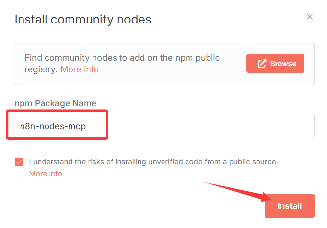

+ 等待安装完成 


## <font style="color:rgba(0, 0, 0, 0.88);background-color:rgb(246, 246, 246);">4. 创建MCP AI工作流</font>
<font style="color:rgba(0, 0, 0, 0.88);background-color:rgb(246, 246, 246);">安装MCP节点后，可以创建AI工作流：</font>

1. **<font style="color:rgba(0, 0, 0, 0.88);background-color:rgb(246, 246, 246);">创建On Chat Message触发器</font>**<font style="color:rgba(0, 0, 0, 0.88);background-color:rgb(246, 246, 246);">：作为工作流的起点</font>

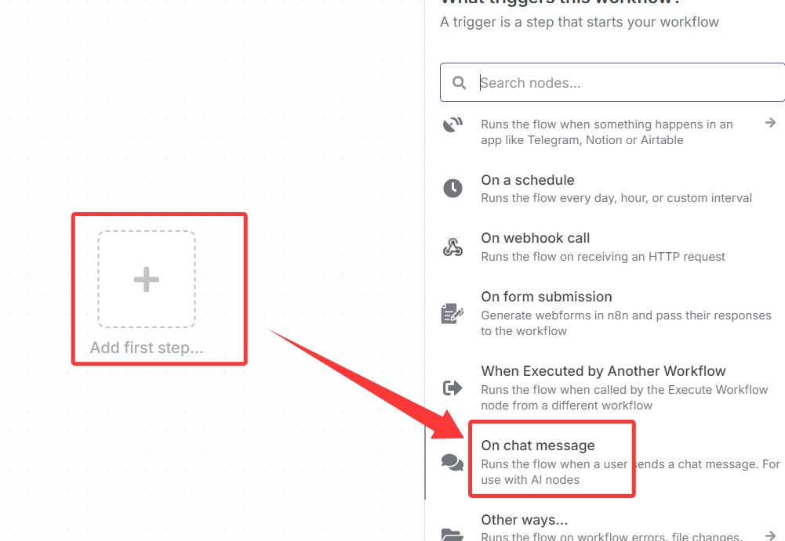

2. **<font style="color:rgba(0, 0, 0, 0.88);background-color:rgb(246, 246, 246);">添加AI Agent节点</font>**<font style="color:rgba(0, 0, 0, 0.88);background-color:rgb(246, 246, 246);">：配置AI模型（如deepseek或本地部署的DeepSeek-R1-Distill-Qwen-1.5B ）</font>

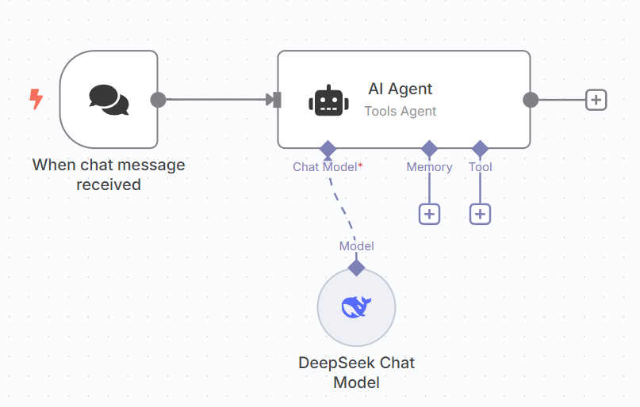

3. **<font style="color:rgba(0, 0, 0, 0.88);background-color:rgb(246, 246, 246);">添加MCP Tool节点</font>**<font style="color:rgba(0, 0, 0, 0.88);background-color:rgb(246, 246, 246);">：点击AI Agent下的Tool加号添加</font>
    - <font style="color:rgba(0, 0, 0, 0.88);background-color:rgb(246, 246, 246);">这是n8n连接MCP服务的核心通道</font>
    - <font style="color:rgba(0, 0, 0, 0.88);background-color:rgb(246, 246, 246);">配置MCP服务器地址和认证信息</font>

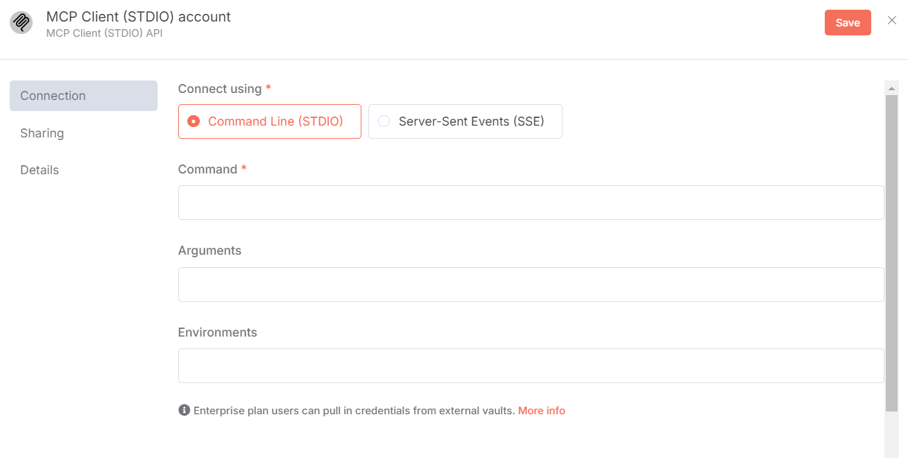

接入百度地图

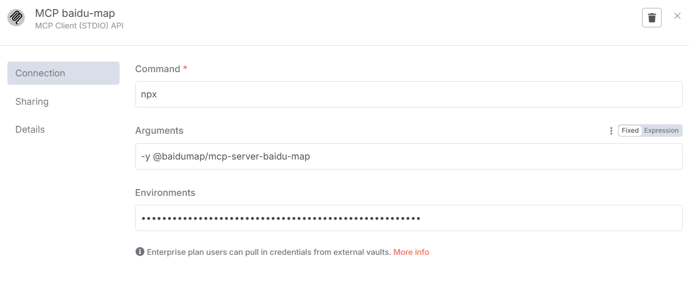

完整的工作流

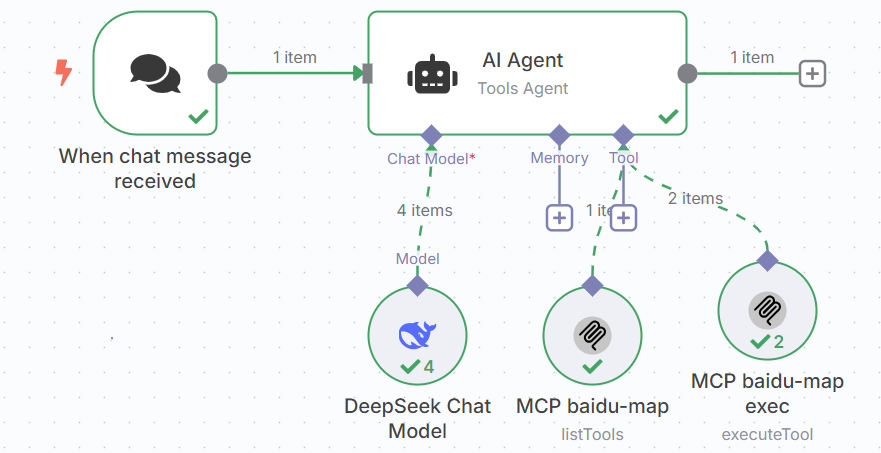

**4.测试效果**

提示词：<font style="color:rgb(65, 66, 68);background-color:rgb(217, 222, 232);">请为我计划一次北京赏花一日游。尽量给出更舒适的出行安排，当然，也要注意天气状况。</font>

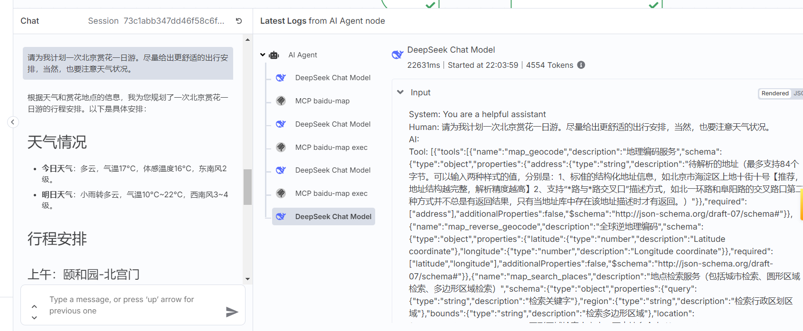


## <font style="color:rgba(0, 0, 0, 0.88);background-color:rgb(246, 246, 246);">5. 应用场景</font>
<font style="color:rgba(0, 0, 0, 0.88);background-color:rgb(246, 246, 246);">结合n8n和MCP可以实现多种高级应用：</font>

1. **<font style="color:rgba(0, 0, 0, 0.88);background-color:rgb(246, 246, 246);">Claude桌面应用集成</font>**<font style="color:rgba(0, 0, 0, 0.88);background-color:rgb(246, 246, 246);">：集成文件系统、搜索引擎和网页功能 </font><font style="color:rgb(0, 0, 0);background-color:rgb(217, 217, 217);"></font>
2. **<font style="color:rgba(0, 0, 0, 0.88);background-color:rgb(246, 246, 246);">智能代码生成</font>**<font style="color:rgba(0, 0, 0, 0.88);background-color:rgb(246, 246, 246);">：通过@codebase指令分析整个项目结构，解决跨文件逻辑联动问题 </font><font style="color:rgb(0, 0, 0);background-color:rgb(217, 217, 217);"></font>
3. **<font style="color:rgba(0, 0, 0, 0.88);background-color:rgb(246, 246, 246);">自动化测试与部署</font>**<font style="color:rgba(0, 0, 0, 0.88);background-color:rgb(246, 246, 246);">：生成单元测试脚本，结合SonarQube插件实现代码安全审计 </font><font style="color:rgb(0, 0, 0);background-color:rgb(217, 217, 217);"></font>
4. **<font style="color:rgba(0, 0, 0, 0.88);background-color:rgb(246, 246, 246);">多语言混合开发</font>**<font style="color:rgba(0, 0, 0, 0.88);background-color:rgb(246, 246, 246);">：在TypeScript与Go混合项目中解决类型兼容性问题 </font><font style="color:rgb(0, 0, 0);background-color:rgb(217, 217, 217);"></font>
5. **<font style="color:rgba(0, 0, 0, 0.88);background-color:rgb(246, 246, 246);">3D建模自动化</font>**<font style="color:rgba(0, 0, 0, 0.88);background-color:rgb(246, 246, 246);">：Blender + MCP打造极致3D建模场景 </font><font style="color:rgb(0, 0, 0);background-color:rgb(217, 217, 217);"></font>
6. **<font style="color:rgba(0, 0, 0, 0.88);background-color:rgb(246, 246, 246);">智能出行规划</font>**<font style="color:rgba(0, 0, 0, 0.88);background-color:rgb(246, 246, 246);">：Claude + 百度地图MCP </font>

#### <font style="color:rgba(0, 0, 0, 0.88);background-color:rgb(246, 246, 246);">部署MCP服务器示例</font>
**<font style="color:rgb(37, 43, 72);">快速接入高德地图 MCP Server</font>**

[**https://lbs.amap.com/api/mcp-server/gettingstarted**](https://lbs.amap.com/api/mcp-server/gettingstarted)

```plain
{
  "mcpServers": {
    "amap-amap-sse": {
      "url": "https://mcp.amap.com/sse?key=您在高德官网上申请的key"
    }
  }
}
```


**快速接入百度地图****<font style="color:rgb(37, 43, 72);">MCP Server</font>**

[https://lbsyun.baidu.com/faq/api?title=mcpserver/quickstart](https://lbsyun.baidu.com/faq/api?title=mcpserver/quickstart)

```plain
{
    "mcpServers": {
        "baidu-map": {
            "command": "npx",
            "args": [
                "-y",
                "@baidumap/mcp-server-baidu-map"
            ],
            "env": {
                "BAIDU_MAP_API_KEY": "{您的AK}"
            }
        }
    }
}

```


## <font style="color:rgba(0, 0, 0, 0.88);background-color:rgb(246, 246, 246);">6. 总结</font>
n8n与MCP的结合为本地化AI工作流提供了强大的解决方案。通过可视化界面和丰富的集成能力，用户可以构建从简单自动化到复杂AI代理的各种工作流。虽然配置过程有一定复杂度，但其灵活性、数据控制能力和成本效益使其成为企业和技术团队理想的自动化平台选择。

随着AI模型能力的提升（如Claude 3.7支持12万Token上下文窗口），MCP在复杂项目中的应用潜力将进一步释放 。

建议从简单工作流开始，逐步探索更复杂的自动化场景。


> 更新: 2025-04-09 14:28:49  
> 原文: <https://www.yuque.com/u12222632/as5rgl/uf0d5z16ur2lu1ru>