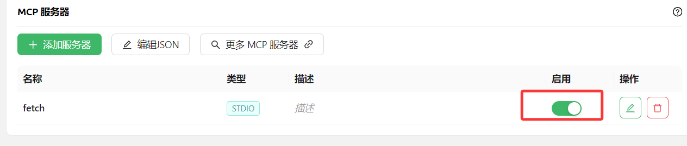

# 三分钟搞定Cherry Studio使用MCP实现联网搜索


## **<font style="color:rgb(45, 21, 20);background-color:rgb(255, 255, 254);">什么是 MCP（Model Context Protocol）？</font>**
<font style="color:rgb(45, 21, 20);background-color:rgb(255, 255, 254);">MCP 是一种开源协议，旨在以标准化的方式向大型语言模型（LLM）提供上下文信息。</font>

+ **<font style="color:rgb(45, 21, 20);background-color:rgb(255, 255, 254);">类比理解：</font>**<font style="color:rgb(45, 21, 20);background-color:rgb(255, 255, 254);"> 可以把 MCP 想象成 AI 领域的“U盘”。我们知道，U盘可以存储各种文件，插入电脑后就能直接使用。类似地，MCP Server 上可以“插”上各种提供上下文的“插件”，LLM 可以根据需要向 MCP Server 请求这些插件，从而获取更丰富的上下文信息，增强自身能力。</font>
+ **<font style="color:rgb(45, 21, 20);background-color:rgb(255, 255, 254);">与 Function Tool 的对比：</font>**<font style="color:rgb(45, 21, 20);background-color:rgb(255, 255, 254);"> 传统的 Function Tool（函数工具）也可以为 LLM 提供外部功能，但 MCP 更像是一种更高维度的抽象。Function Tool 更多的是针对具体任务的工具，而 MCP 则提供了一种更通用的、模块化的上下文获取机制。</font>


### **<font style="color:rgb(45, 21, 20);background-color:rgb(255, 255, 254);">MCP 的核心优势</font>**
1. **<font style="color:rgb(45, 21, 20);background-color:rgb(255, 255, 254);">标准化：</font>**<font style="color:rgb(45, 21, 20);background-color:rgb(255, 255, 254);"> MCP 提供了统一的接口和数据格式，使得不同的 LLM 和上下文提供者可以无缝协作。</font>
2. **<font style="color:rgb(45, 21, 20);background-color:rgb(255, 255, 254);">模块化：</font>**<font style="color:rgb(45, 21, 20);background-color:rgb(255, 255, 254);"> MCP 允许开发者将上下文信息分解为独立的模块（插件），方便管理和复用。</font>
3. **<font style="color:rgb(45, 21, 20);background-color:rgb(255, 255, 254);">灵活性：</font>**<font style="color:rgb(45, 21, 20);background-color:rgb(255, 255, 254);"> LLM 可以根据自身需求动态选择所需的上下文插件，实现更智能、更个性化的交互。</font>
4. **<font style="color:rgb(45, 21, 20);background-color:rgb(255, 255, 254);">可扩展性：</font>**<font style="color:rgb(45, 21, 20);background-color:rgb(255, 255, 254);"> MCP 的设计支持未来添加更多类型的上下文插件，为 LLM 的能力拓展提供了无限可能。</font>


## <font style="color:rgb(45, 21, 20);background-color:rgb(255, 255, 254);">在 Cherry Studio 中使用 MCP</font>
> [https://cherry-ai.com/](https://cherry-ai.com/)
>


精选的 MCP 服务器

> [https://github.com/punkpeye/awesome-mcp-servers/blob/main/README-zh.md#search](https://github.com/punkpeye/awesome-mcp-servers/blob/main/README-zh.md#search)
>

<font style="color:rgb(45, 21, 20);background-color:rgb(255, 255, 254);">下面以搜索服务 </font>`<font style="color:rgb(45, 21, 20);">server-fetch</font>`<font style="color:rgb(45, 21, 20);background-color:rgb(255, 255, 254);"> 功能为例，演示如何在 Cherry Studio 中使用 MCP。</font>

> [https://github.com/modelcontextprotocol/servers/tree/main/src/fetch](https://github.com/modelcontextprotocol/servers/tree/main/src/fetch)
>


```plain
"mcpServers": {
  "fetch": {
    "command": "uvx",
    "args": ["mcp-server-fetch"]
  }
}
```

### **<font style="color:rgb(45, 21, 20);background-color:rgb(255, 255, 254);">准备工作：安装 uv、bun</font>**
Cherry Studio 目前只使用内置的 [uv](https://github.com/astral-sh/uv) 和 [bun](https://github.com/oven-sh/bun)，**不会复用**系统中已经安装的 uv 和 bun。

<font style="color:rgb(45, 21, 20);background-color:rgb(255, 255, 254);">在 </font>`<font style="color:rgb(45, 21, 20);">设置 - MCP 服务器</font>`<font style="color:rgb(45, 21, 20);background-color:rgb(255, 255, 254);"> 中，点击 </font>`<font style="color:rgb(45, 21, 20);">安装</font>`<font style="color:rgb(45, 21, 20);background-color:rgb(255, 255, 254);"> 按钮，即可自动下载并安装。因为是直接从 GitHub 上下载，速度可能会比较慢，且有较大可能失败。安装成功与否，以下文提到的文件夹内是否有文件为准。</font>


**<font style="color:rgb(45, 21, 20);background-color:rgb(255, 255, 254);">可执行程序安装目录：</font>**

<font style="color:rgb(45, 21, 20);background-color:rgb(255, 255, 254);">Windows: </font>`<font style="color:rgb(45, 21, 20);">C:\Users\用户名\.cherrystudio\bin</font>`

<font style="color:rgb(45, 21, 20);background-color:rgb(255, 255, 254);">macOS，Linux: </font>`<font style="color:rgb(45, 21, 20);">~/.cherrystudio/bin</font>`


**<font style="color:rgb(45, 21, 20);background-color:rgb(255, 255, 254);">无法正常安装的情况下：</font>**

<font style="color:rgb(45, 21, 20);background-color:rgb(255, 255, 254);">可以将系统中的相对应命令使用软链接的方式链接到这里，如果没有对应目录，需要手动建立。也可以手动下载可执行文件放到这个目录下面：</font>

<font style="color:rgb(45, 21, 20);background-color:rgb(255, 255, 254);">Bun: </font>[<font style="background-color:rgb(255, 255, 254);">https://github.com/oven-sh/bun/releases</font>](https://github.com/oven-sh/bun/releases)<font style="color:rgb(45, 21, 20);background-color:rgb(255, 255, 254);"> </font>

<font style="color:rgb(45, 21, 20);background-color:rgb(255, 255, 254);">UV: </font>[<font style="background-color:rgb(255, 255, 254);">https://github.com/astral-sh/uv/releases</font>](https://github.com/astral-sh/uv/releases)

### **<font style="color:rgb(45, 21, 20);background-color:rgb(255, 255, 254);">配置 MCP服务器</font>**
1. <font style="color:rgb(45, 21, 20);background-color:rgb(255, 255, 254);">打开 Cherry Studio 设置。</font>
2. <font style="color:rgb(45, 21, 20);background-color:rgb(255, 255, 254);">找到 "MCP 服务器" 选项。</font>


3. <font style="color:rgb(45, 21, 20);background-color:rgb(255, 255, 254);">编写JSON，添加server fetch的uvx配置</font>


4. <font style="color:rgb(45, 21, 20);background-color:rgb(255, 255, 254);">启用</font>fetchfetch<font style="color:rgb(45, 21, 20);background-color:rgb(255, 255, 254);">配置</font>



启用后，我们就可以开始使用了！


### <font style="color:rgb(45, 21, 20);background-color:rgb(255, 255, 254);">在聊天框中启用 MCP 服务</font>


<font style="color:rgb(45, 21, 20);background-color:rgb(255, 255, 254);">在聊天框看到启用 MCP 服务的按钮，需要满足以下条件：</font>

+ <font style="color:rgb(45, 21, 20);background-color:rgb(255, 255, 254);">需要使用支持函数调用（在模型名字后会出现扳手符号）的模型</font>


+ <font style="color:rgb(45, 21, 20);background-color:rgb(255, 255, 254);">在 </font>`<font style="color:rgb(45, 21, 20);">MCP 服务器</font>`<font style="color:rgb(45, 21, 20);background-color:rgb(255, 255, 254);"> 设置成功添加了 MCP 服务器</font>


### **<font style="color:rgb(45, 21, 20);background-color:rgb(255, 255, 254);">使用效果展示</font>**


<font style="color:rgb(45, 21, 20);background-color:rgb(255, 255, 254);">从上图可以看出，结合了 MCP 的 </font>`<font style="color:rgb(45, 21, 20);">fetch</font>`<font style="color:rgb(45, 21, 20);background-color:rgb(255, 255, 254);"> 功能后，Cherry Studio 能够更好地理解用户的查询意图，并从网络上获取相关信息，给出更准确、更全面的回答。</font>


> 更新: 2025-04-09 15:12:25  
> 原文: <https://www.yuque.com/u12222632/as5rgl/qafzr64lmcv5a5ak>