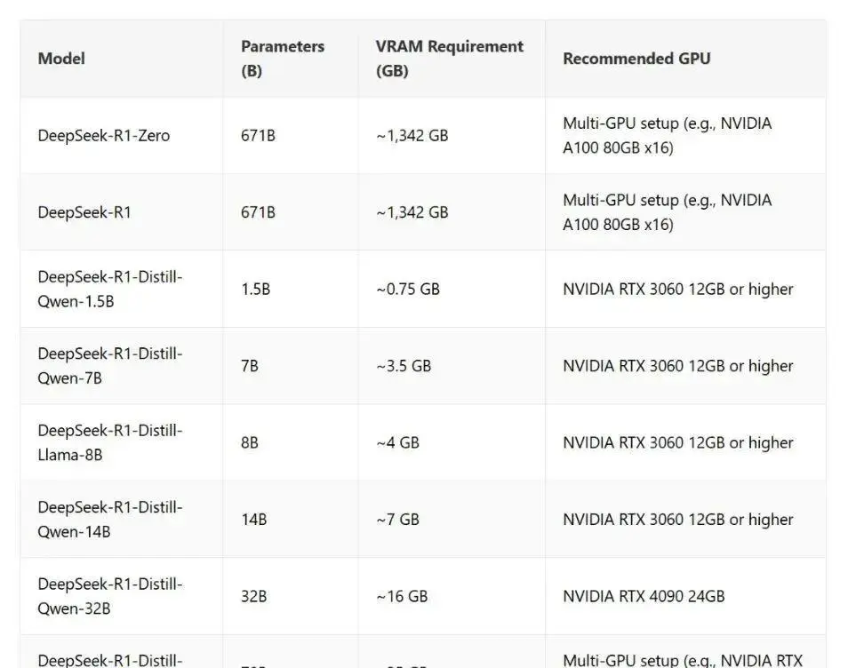
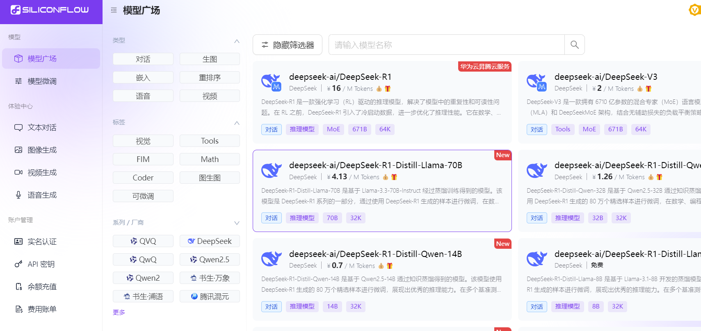

# 三分钟搞定！Windows本地部署DeepSeek-R1推理模型

**步骤一：安装Ollama**

官网下载：👉[ https://ollama.co](https://ollama.com)m

操作就像安装QQ一样简单，点击Download

双击下载的.exe安装包

点「下一步」直到完成

**步骤二：回到ollama的官网，搜索框里搜索deepseek-r1，选择要安装的模型**

[https://ollama.com/library/deepseek-r1](https://ollama.com/library/deepseek-r1)

点击下拉框，可以看到多个版本，区别是参数不一样，数字越大，代表参数越多，性能就越强，但也对计算机的性能要求较高。

模型版本怎么选？电脑配置不行的，建议选择1.5B版本，这个模型有15亿参数，属于最轻量的Deepseek版本，电脑配置好点的，可以选择7b以上的。

下面是不同模型推荐配置

**步骤三：复制右边的这串代码“****ollama run deepseek-r1:1.5b****”**

**步骤四：安装模型**

按下键盘上的win+R，调出运行窗口，输入cmd回车，调出命令行窗口。

**把复制的代码“****ollama run deepseek-r1:1.5b****”粘贴到命令行中，再点击回车。**

按回车键之后，就会开始安装，会有百分比的进度条，如下图所示

跑到了100%之后，就代表安装完成了，就可以和他对话了。

**步骤四：安装可视化工具：chatbox**

ChatBox客户端

官网直达：[https://chatboxai.app](https://chatboxai.app)

安装姿势：

点击免费下载后，解压后双击ChatBoxSetup.exe

自定义安装路径（别放C盘！建议装D盘）

Chatbox安装好后，打开。

点击右下角的设置，设置好模型，选择Ollama API，最后选择已经安装好的模型就可以了。

点击保存后就可以对话了

**拓展：使用硅基流动体验满血版deepseek**

**SiliconFlow** 联合 **华为昇腾**（国产芯片）推出了 **DeepSeek-R1** 和 **DeepSeek-V3** 的 **671B 满血版 API 服务**，响应速度与官方 API 基本一致，性能强劲且稳定。当前SiliconFlow正在做活动，注册即送 2000 万 Tokens（14 元平台额度），链接：[https://cloud.siliconflow.cn/i/wn4Ok7Iz](https://cloud.siliconflow.cn/i/wn4Ok7Iz)

登录之后，直接就进入【模型广场】了。排在第一位的模型就是**DeepSeek-R1** 。

但是你不用管，直接看最左边的导航栏，找到【API密钥】，点进去，再点右上角的新建API密钥。新建完成之后，你就会得到一个看着是加密的API Key了，这就是你的密钥，点击密钥那块就能复制。

**配置Chatbox**

在Chatbox模型提供方里，找到这个SiliconFlow API，这个就是硅基流动的英文名。在API密钥里，输入上一步咱们复制下来的API key，直接粘贴进去，粘贴完以后，下面模型下拉框就会出现一堆数据了，全部都是硅基流动部署的模型，我们直接拉到后面选DeepSeek R1模型就行。

点击保存后就可以对话了

> 更新: 2025-02-23 20:19:32  
> 原文: <https://www.yuque.com/u12222632/as5rgl/roeu8czeulye5306>