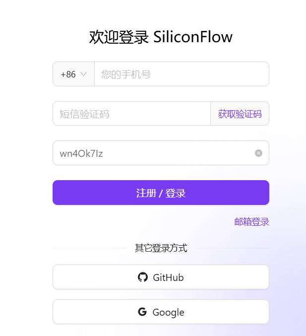
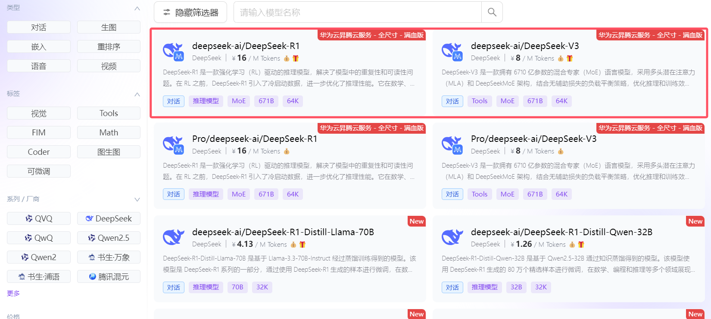
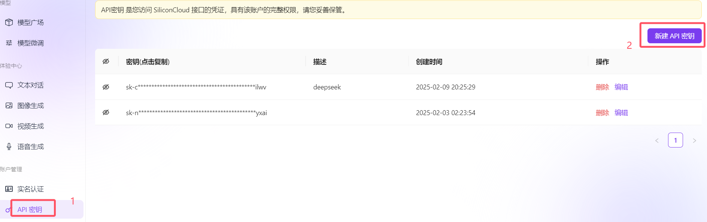
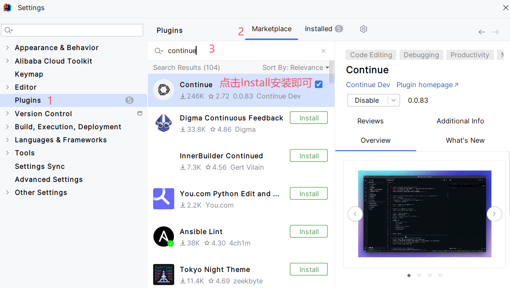
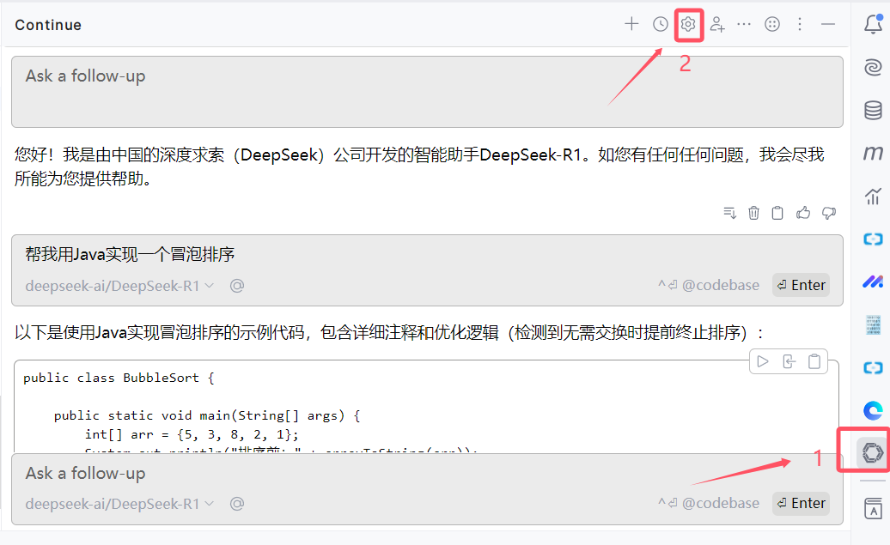
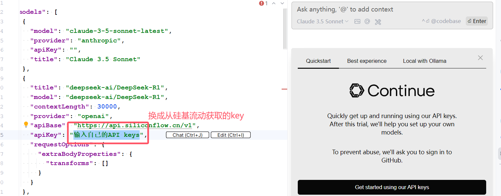
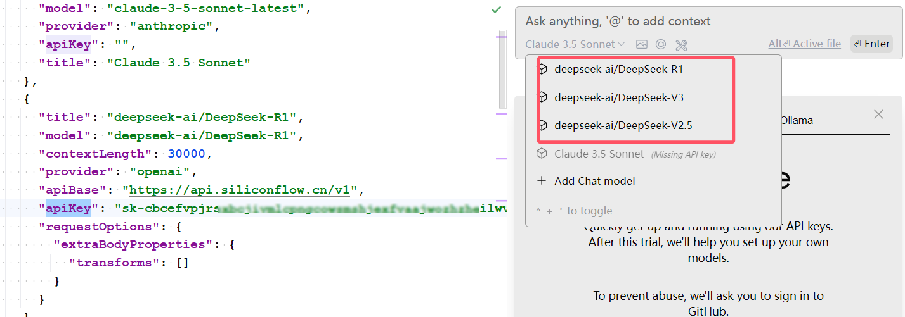
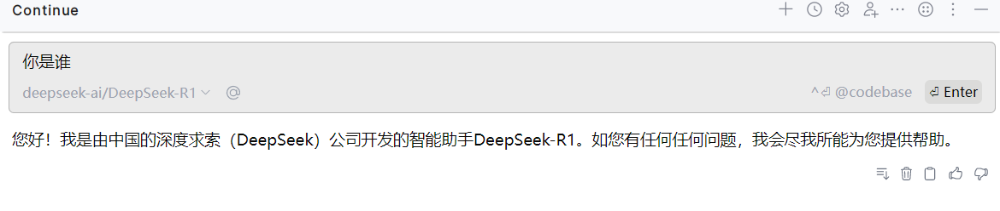
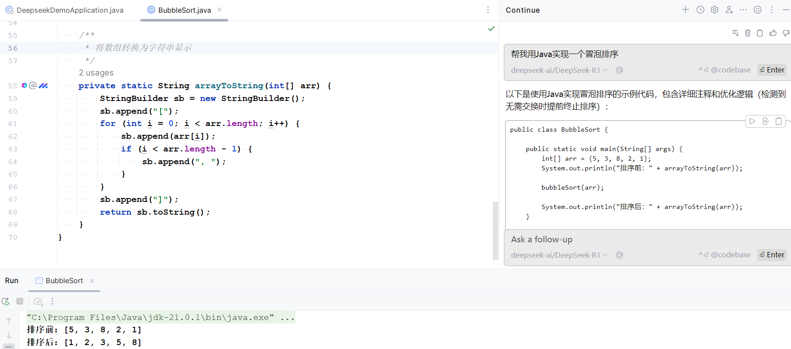

# 两分钟IDEA完美接入满血deepseek R1模型，基于continue插件+硅基流动实现


<font style="color:rgb(6, 6, 7);">原本想在 IntelliJ IDEA 中接入 deepseek 的，打开官网 API 平台时，我沉默了</font>


<font style="color:rgb(6, 6, 7);">不能充值了，好吧，到此结束，关灯睡觉。</font>

<font style="color:rgb(6, 6, 7);">等等，别急，还有解决方案呢，跟着我一步步实操起来。</font>

## <font style="color:rgb(6, 6, 7);">一、注册硅基流动账号</font>


<font style="color:rgb(6, 6, 7);">访问 </font>[硅基流动](https://cloud.siliconflow.cn/i/wn4Ok7Iz)<font style="color:rgb(6, 6, 7);">（</font>[https://cloud.siliconflow.cn/i/wn4Ok7Iz](https://cloud.siliconflow.cn/i/wn4Ok7Iz)<font style="color:rgb(6, 6, 7);">），直接点击注册（获得2000万的Tokens）。</font>



<font style="color:rgb(6, 6, 7);">注册完成后，你会发现这里提供了丰富的模型资源，包括华为云部署的满血 R1 和 V3。</font>




<font style="color:rgb(6, 6, 7);">在左侧的 </font>**<font style="color:rgb(6, 6, 7);">API 密钥</font>**<font style="color:rgb(6, 6, 7);"> 菜单栏中，生成你的 API 密钥。</font>



## <font style="color:rgb(6, 6, 7);">二、通过 Continue 插件接入 deepseek</font>
### <font style="color:rgb(6, 6, 7);">Continue 插件介绍</font>
[<font style="color:rgb(6, 6, 7);">Continue</font>](https://www.continue.dev/)<font style="color:rgb(6, 6, 7);"> 是一款开源的 AI 代码助手插件，专为 VS Code 和 JetBrains 系列 IDE 设计，能够实时提供代码补全建议，显著提升编码效率。它支持连接多种语言模型。</font>

### <font style="color:rgb(6, 6, 7);">Continue 插件安装</font>
<font style="color:rgb(6, 6, 7);">在Idea插件市场中搜索 </font>**<font style="color:rgb(6, 6, 7);">Continue</font>**<font style="color:rgb(6, 6, 7);"> 并安装。</font>



<font style="color:rgb(6, 6, 7);">安装完成后，分别点击右侧边栏的 </font>**<font style="color:rgb(6, 6, 7);">Continue</font>**<font style="color:rgb(6, 6, 7);"> 图标和设置按钮。</font>



<font style="color:rgb(6, 6, 7);">此时，你将看到 Continue 的配置文件。我简单地写了一些配置，你可以直接拷贝以下配置，并替换为你在硅基流动上生成的 API 密钥。如果需要更多配置，请参考插件官网：</font>[配置文件参考](https://docs.continue.dev/reference)([https://docs.continue.dev/reference](https://docs.continue.dev/reference))<font style="color:rgb(6, 6, 7);">。</font>

```java
{
"models": [
    {
      "model": "claude-3-5-sonnet-latest",
      "provider": "anthropic",
      "apiKey": "",
      "title": "Claude 3.5 Sonnet"
    },
    {
      "title": "deepseek-ai/DeepSeek-R1",
      "model": "deepseek-ai/DeepSeek-R1",
      "contextLength": 30000,
      "provider": "openai",
      "apiBase": "https://api.siliconflow.cn/v1",
      "apiKey": "输入自己的API keys",
      "requestOptions": {
        "extraBodyProperties": {
          "transforms": []
        }
      }
    },
    {
      "title": "deepseek-ai/DeepSeek-V3",
      "model": "deepseek-ai/DeepSeek-V3",
      "contextLength": 30000,
      "provider": "openai",
      "apiBase": "https://api.siliconflow.cn/v1",
      "apiKey": "输入自己的API keys",
      "requestOptions": {
        "extraBodyProperties": {
          "transforms": []
        }
      }
    },
    {
      "title": "deepseek-ai/DeepSeek-V2.5",
      "provider": "openai",
      "model": "deepseek-ai/DeepSeek-V2.5",
      "contextLength": 30000,
      "apiBase": "https://api.siliconflow.cn/v1",
      "apiKey": "输入自己的API keys",
      "useLegacyCompletionsEndpoint": false
    }
  ],

"tabAutocompleteModel": [
    {
      "title": "deepseek-ai/DeepSeek-V2.5",
      "provider": "openai",
      "model": "deepseek-ai/DeepSeek-V2.5",
      "contextLength": 30000,
      "apiBase": "https://api.siliconflow.cn/v1",
      "apiKey": "输入自己的API keys",
      "useLegacyCompletionsEndpoint": false
    }
  ],
    
"tabAutocompleteOptions": {
    "template": "Please teach me what I should write in the `hole` tag, but without any further explanation and code backticks, i.e., as if you are directly outputting to a code editor. It can be codes or comments or strings. Don't provide existing & repetitive codes. If the provided prefix and suffix contain incomplete code and statement, your response should be able to be directly concatenated to the provided prefix and suffix. Also note that I may tell you what I'd like to write inside comments. \n{{{prefix}}}<hole></hole>{{{suffix}}}\n\nPlease be aware of the environment the hole is placed, e.g., inside strings or comments or code blocks, and please don't wrap your response in ```. You should always provide non-empty output.\n",
    "maxPromptTokens": 2048,
    "prefixPercentage": 0.85,
    "maxSuffixPercentage": 0.15,
    "debounceDelay": 500,
    "multilineCompletions": "always",
    "slidingWindowPrefixPercentage": 0.75,
    "slidingWindowSize": 350,
    "maxSnippetPercentage": 0.6,
    "recentlyEditedSimilarityThreshold": 0.3,
    "useCache": true,
    "onlyMyCode": false,
    "useOtherFiles": false,
    "useRecentlyEdited": true,
    "recentLinePrefixMatchMinLength": 7
  },


"customCommands": [
    {
      "name": "test",
      "prompt": "{{{ input }}}\n\nWrite a comprehensive set of unit tests for the selected code. It should setup, run tests that check for correctness including important edge cases, and teardown. Ensure that the tests are complete and sophisticated. Give the tests just as chat output, don't edit any file.",
      "description": "Write unit tests for highlighted code"
    }
  ],
"contextProviders": [
    {
      "name": "diff",
      "params": {}
    },
    {
      "name": "folder",
      "params": {}
    },
    {
      "name": "codebase",
      "params": {}
    }
  ],
"slashCommands": [
    {
      "name": "share",
      "description": "Export the current chat session to markdown"
    },
    {
      "name": "commit",
      "description": "Generate a git commit message"
    }
  ]
}
```



<font style="color:rgb(6, 6, 7);">在对话窗口中，你将看到我们加入的模型。</font>




<font style="color:rgb(6, 6, 7);">我们来测试一下。</font>



帮我用Java实现一个冒泡排序。



<font style="color:rgb(6, 6, 7);"></font>

<font style="color:rgb(6, 6, 7);"></font>


> 更新: 2025-02-10 22:02:21  
> 原文: <https://www.yuque.com/u12222632/as5rgl/kkid10ytdtoz7zy2>