# 如何0代码将存量 API 适配 MCP 协议？Nacos+Higress 的方案实现0代码改造将 Agent 连接到存量应用

<font style="color:rgb(136, 136, 136);">本文主要讲述通过 Nacos+Higress 的方案实现0代码改造将 Agent 连接到存量应用，能够显著降低存量应用的改造成本。</font>

<font style="color:rgb(62, 62, 62);">MCP 的发展速度之快，似乎超出了大部分人的想象。今年2月，Cursur、Winsurf、Cline 均开始引入 MCP，近日 OpenAI 宣布支持 MCP，国内百度地图、高德地图陆续发布 MCP Server，还有一众非常活跃的提供 MCP 托管和中间件服务的供应商，MCP 生态正呈现越加丰富和成熟的发展态势。</font>

<font style="color:rgb(62, 62, 62);">虽然 AI 在短期内依旧面临 ROI 的考验，但几乎所有人都不会怀疑他的未来，都不希望错过这一场“军备竞赛”。问题随之而来，存量业务架构中的 API 改造成 MCP Server，既面临时间成本，还有人力上的挑战。企业对能提升 MCP 构建效率的开源和商业方案愈加渴望。</font>

<font style="color:rgb(255, 129, 36);">一、“0改动”适配 MCP Server</font>

<font style="color:rgb(62, 62, 62);">Nacos 作为 MCP Registry，扮演控制面的角色，不仅管理 Tool 的元信息，还可以把存量 API 转化成 MCP 协议。</font>

<font style="color:rgb(62, 62, 62);">Nacos 可以帮助应用快速把业务已有的 API 接口，转换成 MCP 协议接口，结合 Higress AI 网关，实现 MCP 协议和存量协议的转换。其中，Nacos 提供存量的服务管理和动态的服务信息定义，帮助业务在存量接口不改动的情况下，通过 Nacos 的服务管理动态生效 Higress 网关所生成的 MCP Server 协议。</font>

<font style="color:rgb(62, 62, 62);">借助 MCP 的发展契机，Nacos （Naming and Configuration Service）正从构建云原生应用向云原生 AI 应用的动态服务发现、配置管理和服务管理平台开源项目进行演进 ，近期 Nacos 即将发布3.0 正式版本，会体系化面向 AI 架构进行升级。</font>

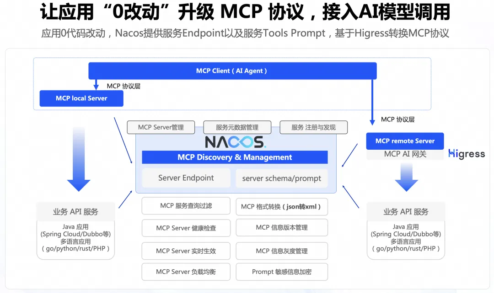

**<font style="color:rgb(62, 62, 62);">为什么能实现“0代码”适配 MCP Server</font>**

<font style="color:rgb(62, 62, 62);">我们先看一下普通的调用是如何发生。</font>

<font style="color:rgb(62, 62, 62);">首先，调用者需要知道服务提供者的地址(一个域名或者是一个 IP)，之后调用者根据提前约定好的参数，对接口进行调用。调用流程图如下：</font>

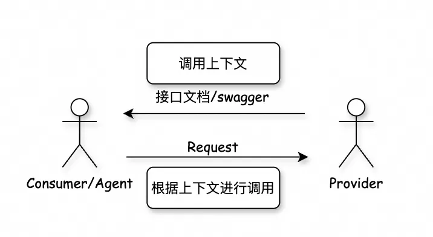

<font style="color:rgb(62, 62, 62);">在日常开发中，我们已经知悉当前的提供者的接口集合、接口和接口参数的具体作用，所以可以基于这些上下文，在业务代码中写入调用逻辑，实现服务间的调用。对模型而言，这些调用上下文也是必须的，模型也需要知道服务提供者的接口集合以及接口的详细描述，才能根据上下文进行接口调用。</font>

<font style="color:rgb(62, 62, 62);">因此，对于已经使用 Nacos 作为注册配置中心的存量服务而言，Nacos 中已经存储了服务的调用地址，只需要增加服务的接口信息就能实现模型来调用上下文。</font>

<font style="color:rgb(62, 62, 62);">为此，我们引入了“应用全局描述”来描述当前应用以及接口的详细信息，通过统一的接口描述协议对Nacos 中的服务进行 MCP 化改造。对于之前未注册在 Nacos 中的服务，只需要通过 Nacos 持久化服务发现手动注册即可。在配置完服务相关信息之后，MCP 协议需要的相关数据都已经齐全了，接下来就需要考虑如何将这些数据通过 MCP 协议暴露出去，这里我们通过 Higress 的插件机制完成 MCP 协议的暴露能力。调用流程图如下：</font>

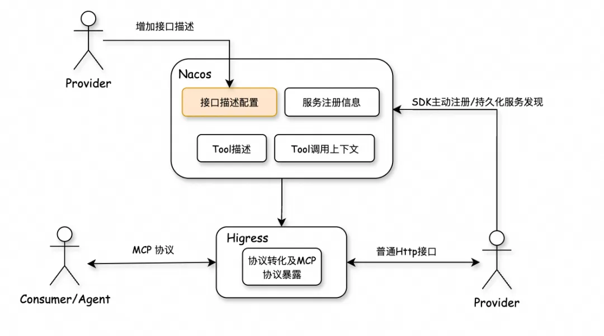

**<font style="color:rgb(62, 62, 62);">Nacos 转化 MCP 的具体实现原理</font>**

<font style="color:rgb(62, 62, 62);">MCP 协议目前支持多种资源（Tool、Prompt、Resource 等），我们对使用量较高的 Tool 进行了优先实现，再借助 Higress 提供的统一的 SSE 协议支持，便加速了 MCP Server 的构建。</font>

<font style="color:rgb(62, 62, 62);">实现原理上，我们通过在 Higress 中的 MCP Server 插件实现了 Nacos 中管理的 Tools 的暴露，对外通过 MCP 协议暴露普通 HTTP 服务，需要先完成两件事，实现原理图如下：</font>

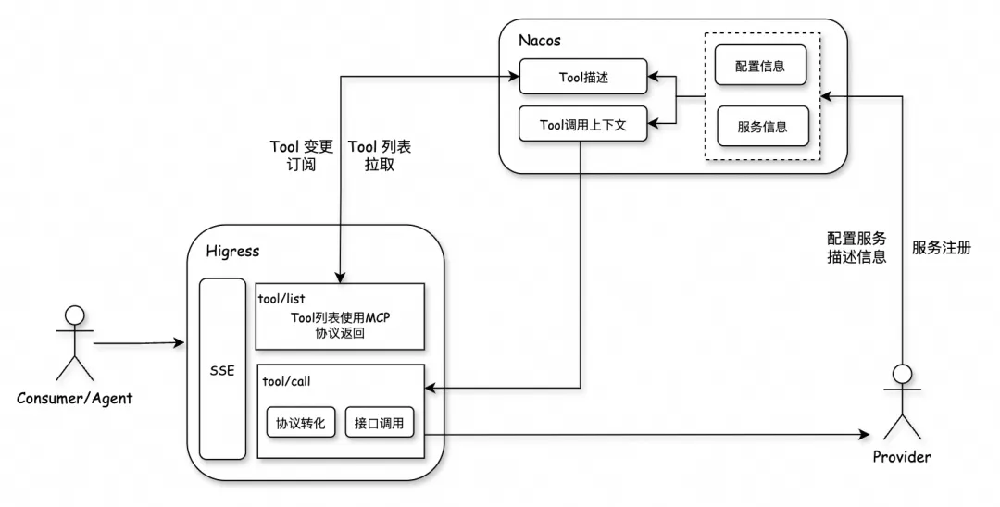

**<font style="color:rgb(62, 62, 62);">1. 暴露 tool/list 接口，由 Higress 代理返回所有的 Tool 列表</font>**

_**<font style="color:rgb(62, 62, 62);">tool/list</font>**_<font style="color:rgb(62, 62, 62);"> </font><font style="color:rgb(62, 62, 62);">方法主要负责将当前 MCP Server 支持的 Tool 的详细信息列表返回给客户端，返回信息包含 Tool 的作用描述和 Tool 的参数描述（包含类型，作用等），然后通过将 Nacos 存储的描述信息转化为标准的 MCP 协议里的</font><font style="color:rgb(62, 62, 62);"> </font>_**<font style="color:rgb(62, 62, 62);">tool/list</font>**_<font style="color:rgb(62, 62, 62);"> </font><font style="color:rgb(62, 62, 62);">结果，返回给客户端。</font>

<font style="color:rgb(62, 62, 62);">Nacos 中会注册多个服务，每个服务会有多个接口，每一个接口映射为一个 Tool，Tool 的描述信息就是接口的描述信息，之后根据接口名，将所有服务中的所有 Tool 的服务名等生成全局唯一的 Tool 名称，然后将这些 Tool 聚合为当前的 Tool 列表，返回给 MCP Client。</font>

**<font style="color:rgb(62, 62, 62);">2. 协议转化，对 MCP 协议的 Json RPC 转化为普通 HTTP 请求，并转发到后端服务</font>**

<font style="color:rgb(62, 62, 62);">当 MCP Client 要调用 Tool 的时候，Higress 将</font><font style="color:rgb(62, 62, 62);"> </font>_**<font style="color:rgb(62, 62, 62);">tool/call</font>**_<font style="color:rgb(62, 62, 62);"> </font><font style="color:rgb(62, 62, 62);">的 Json RPC 请求解析出来，通过用户配置的参数映射信、Path、后端地址等信息，Higress 生成后端的 HTTP 调用请求，并进行调用。调用完成后，再将后端的调用结果包装供标准的 tool/call 接口调用的返回结果。</font>

<font style="color:rgb(62, 62, 62);">在整体实现中，Nacos 作为 MCP Registry，扮演控制面的角色来管理 Tool 的元信息，Higress 在数据面做协议转换和 RPC 调用。</font>_**<font style="color:rgb(62, 62, 62);">存量服务只需要添加接口描述即可，无需做任何改动。</font>**_

**<font style="color:rgb(62, 62, 62);">使用 Nacos 管理 Tool 的元信息的优势</font>**

+ **<font style="color:rgb(62, 62, 62);">存量 API 可以快速构建 MCP Server：</font>**<font style="color:rgb(62, 62, 62);">Nacos 集成 Higress 的方案可以让用户快速，0代码的构建成MCP Server，快速跟进 MCP 协议；</font>**<font style="color:rgb(51, 51, 51);">  
</font>**
+ **<font style="color:rgb(62, 62, 62);">MCP 信息动态下发实时生效：</font>**<font style="color:rgb(62, 62, 62);">MCP 描述信息、Tools 以及 Prompt 都需要进行调试，才能达到更好效果，Nacos 可以帮助管理和下发信息，更高效的调试描述；</font>
+ **<font style="color:rgb(62, 62, 62);">MCP信息历史版本管理：</font>**<font style="color:rgb(62, 62, 62);">Nacos 会管理和存储 MCP 信息历史版本，方便进行 Diff 对比差异，方便进行快速回滚；</font>
+ **<font style="color:rgb(62, 62, 62);">MCP信息灰度管理：</font>**<font style="color:rgb(62, 62, 62);">Nacos 在 MCP 信息生效的时候，可以进行灰度分批生效，方便对比 MCP 信息效果；</font>
+ **<font style="color:rgb(62, 62, 62);">密码配置加密：</font>**<font style="color:rgb(62, 62, 62);">MCP 信息里以及调用 API 过程中，需要密码等敏感信息，Nacos 提供了敏感信息加密的能力，帮助更安全的使用 MCP；</font>
+ **<font style="color:rgb(62, 62, 62);">MCP 返回格式 JSON 转换 XML：</font>**<font style="color:rgb(62, 62, 62);">和大模型交互都有体感，对模型来说，JSON 没有 XML 格式好用，所以在 MCP 返回信息格式上，Nacos 可以帮助 MCP 把返回格式从 JSON 变成 XML，方便大模型理解；</font>
+ **<font style="color:rgb(62, 62, 62);">MCP 服务管理及健康检查：</font>**<font style="color:rgb(62, 62, 62);">MCP 服务会越来越多，Nacos 有大规模服务管理能力，并且持续在迭代过程中，为 MCP 做健康检查、实时更新、负载均衡，起到 MCP 服务发现中心的托管作用。</font>

<font style="color:rgb(255, 129, 36);">二、手把手演示“0代码”复刻高德 MCP Server</font>

<font style="color:rgb(62, 62, 62);">最近高德推出了 MCP Server 获得了业内广泛关注，这部分 Server 是高德基于 MCP 社区的开发指引实现的，构建成本较高。接下来，我们基于高德官方的 Open API 接口，通过 Nacos+Higress 的方案，来演示如何0代码适配 MCP Server。</font>

**<font style="color:rgb(62, 62, 62);">环境准备</font>**

#### <font style="color:rgb(255, 104, 39);">Nacos 部署</font>
<font style="color:rgb(62, 62, 62);">通过 docker 部署 nacos：</font>

```plain
export NACOS_AUTH_TOKEN=自定义的token，token为原始内容的base64编码结果
export NACOS_AUTH_IDENTITY_VALUE=自定义的IDENTITY_VALUE，任意英文和数字组合
docker run -td -e PREFER_HOST_MODE=hostname -e MODE=standalone -e NACOS_AUTH_IDENTITY_KEY=serverIdentity -e NACOS_AUTH_IDENTITY_VALUE=${NACOS_AUTH_IDENTITY_VALUE} -e NACOS_AUTH_TOKEN=${NACOS_AUTH_TOKEN} -p 8848:8848 -p 9848:9848 nacos/nacos-server
```


#### <font style="color:rgb(255, 104, 39);">Higress 部署</font>
<font style="color:rgb(62, 62, 62);">部署文档可参考：https://higress.cn/ai/mcp-quick-start/</font>

**<font style="color:rgb(62, 62, 62);">高德开发者 API KEY 申请</font>**

<font style="color:rgb(62, 62, 62);">调用高德 API，我们首先需要申请到高德 API 的 key。</font>

<font style="color:rgb(62, 62, 62);">进入</font><font style="color:rgb(62, 62, 62);">高德开发者平台:</font><font style="color:rgb(62, 62, 62);">https://console.amap.com/dev/index</font><font style="color:rgb(62, 62, 62);"> </font><font style="color:rgb(62, 62, 62);">，登陆之后，创建新应用。</font>

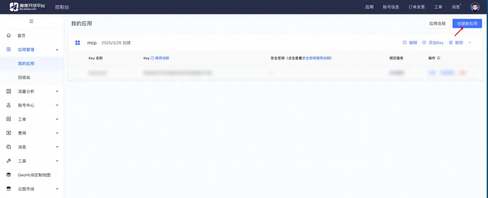

<font style="color:rgb(62, 62, 62);">创建新应用：</font>

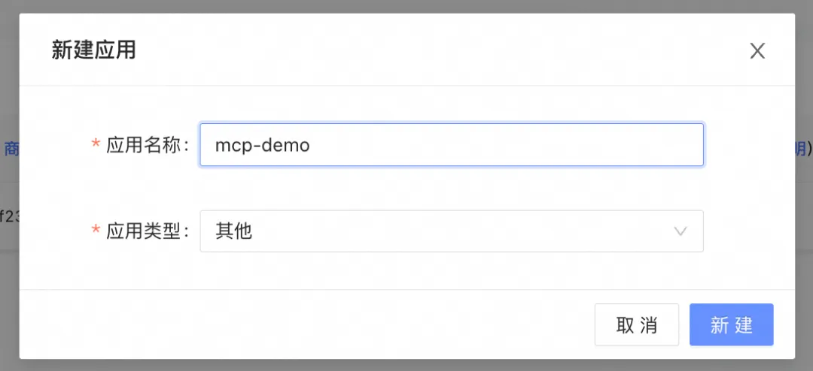

<font style="color:rgb(62, 62, 62);">应用创建完成之后，我们创建 key：</font>

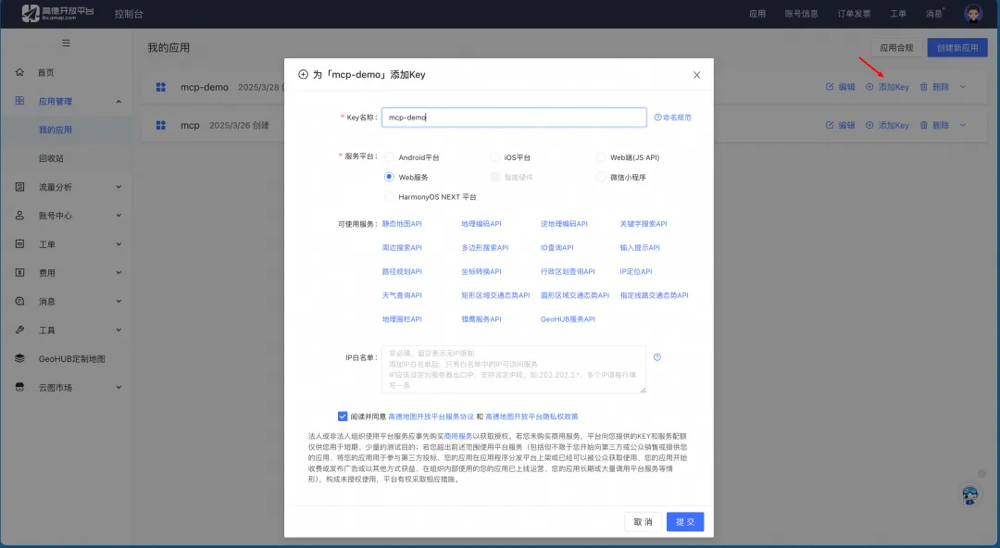

<font style="color:rgb(62, 62, 62);">在控制台看到 key，将 key 保存下来</font>


<font style="color:rgb(62, 62, 62);">接下来我们在Nacos中配置完成高德HttpApi的描述文件的配置以及高德域名信息配置。</font>

**<font style="color:rgb(62, 62, 62);">在 Nacos 中进行高德 API 服务配置</font>**

<font style="color:rgb(62, 62, 62);">首先我们通过持久化服务发现的能力将高德的域名注册到 nacos 中，服务名为</font><font style="color:rgb(62, 62, 62);"> </font>_**<font style="color:rgb(62, 62, 62);">amap</font>**_<font style="color:rgb(62, 62, 62);">，分组为</font><font style="color:rgb(62, 62, 62);"> </font>_**<font style="color:rgb(62, 62, 62);">amap。</font>**_

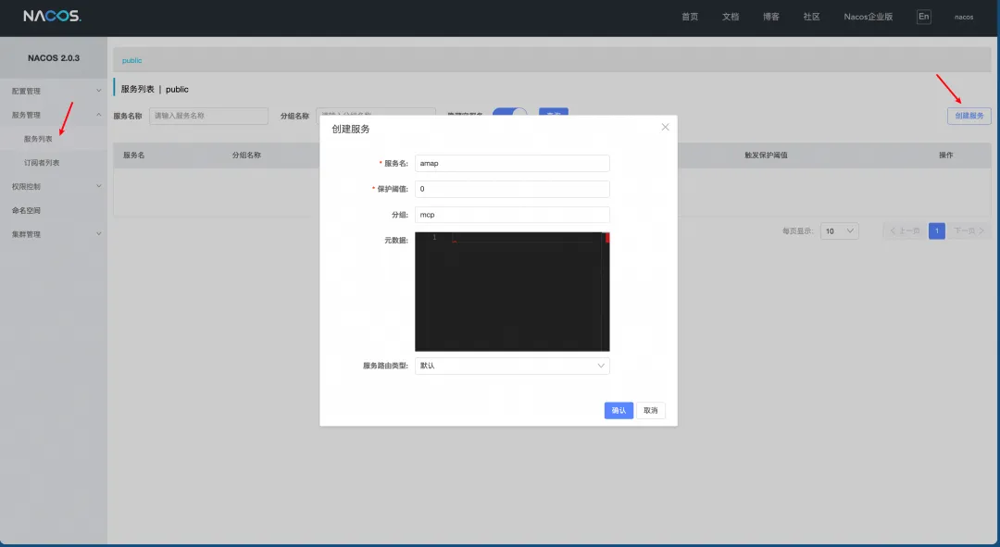

<font style="color:rgb(62, 62, 62);">创建完服务之后，我们将高德的域名注册到 Nacos 中。</font>

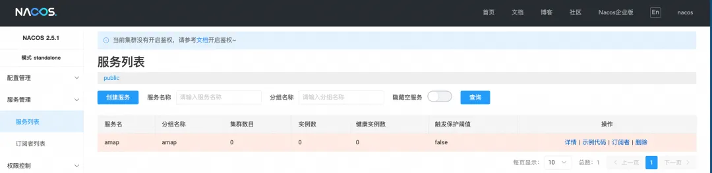

<font style="color:rgb(62, 62, 62);">通过以下命令注册高德的域名。</font>

```plain
curl -X POST 'http://127.0.0.1:8848/nacos/v1/ns/instance?serviceName=amap&groupName=amap&ip=restapi.amap.com&port=80&ephemeral=false'

```

<font style="color:rgb(62, 62, 62);">检查 amap 服务的实例数变为1。</font>

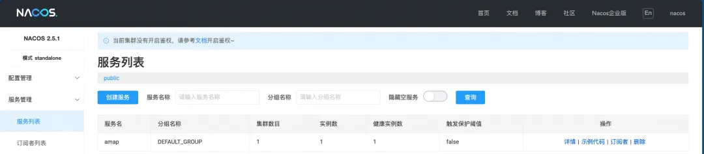

<font style="color:rgb(62, 62, 62);">在配置中心新建一个配置文件对高德的 API 进行描述。</font>

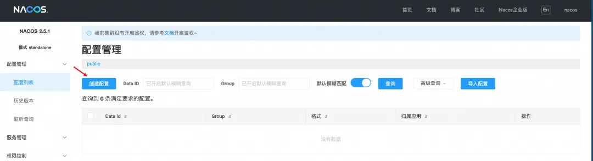

<font style="color:rgb(62, 62, 62);">进入配置中心，点击新建配置。</font>

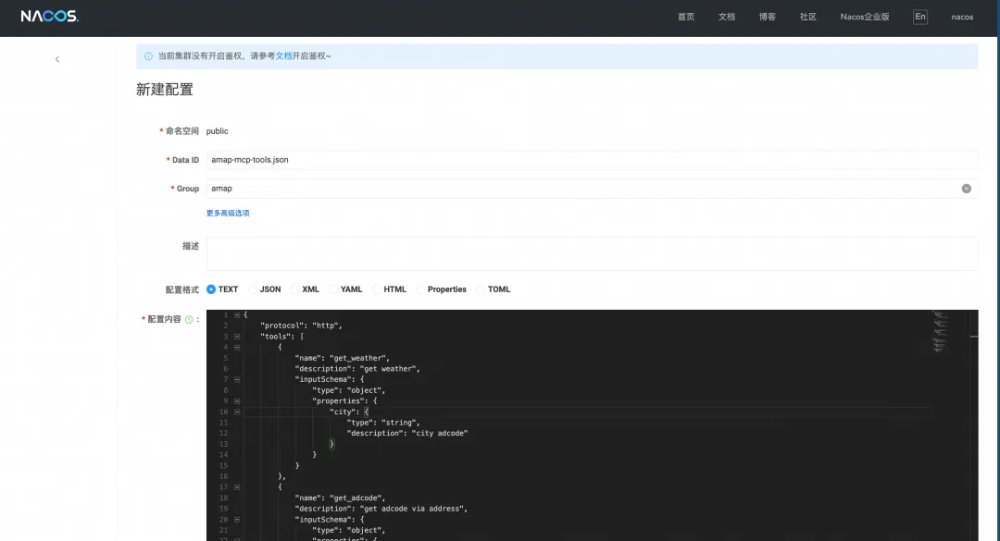

<font style="color:rgb(62, 62, 62);">创建 DataId 为 </font>_**<font style="color:rgb(62, 62, 62);">amap-mcp-tools.json</font>**_<font style="color:rgb(62, 62, 62);">分组为 </font>_**<font style="color:rgb(62, 62, 62);">amap </font>**_<font style="color:rgb(62, 62, 62);">的配置项，配置内容为</font>

```plain
{
  "protocol": "http",
  "tools": [
    {
      "name": "get_weather",
      "description": "get weather",
      "inputSchema": {
        "type": "object",
        "properties": {
          "city": {
            "type": "string",
            "description": "city adcode"
          }
        }
      }
    },
    {
      "name": "get_adcode",
      "description": "get adcode via address",
      "inputSchema": {
        "type": "object",
        "properties": {
          "address": {
            "type": "string",
            "description": "address"
          }
        }
      }
    },
    {
      "name": "get_address_via_ip",
      "description": "get address via ip",
      "inputSchema": {
        "type": "object",
        "properties": {
          "ip": {
            "type": "string",
            "description": "ip address"
          }
        }
      }
    }
  ],
  "toolsMeta": {
    "get_weather": {
      "credentialRef": "amap-key.json",
      "InvokeContext": {
        "path": "/v3/weather/weatherInfo",
        "method": "GET"
      }
    },
    "get_adcode": {
      "credentialRef": "amap-key.json",
      "InvokeContext": {
        "path": "/v3/geocode/geo",
        "method": "GET"
      }
    },
    "get_address_via_ip": {
      "credentialRef": "amap-key.json",
      "InvokeContext": {
        "path": "/v3/ip",
        "method": "GET"
      }
    }
  }
}
```

<font style="color:rgb(62, 62, 62);">这个配置描述了高德的 HTTP API 的相关参数信息，以及 Higress 进行协议转换时需要的上下文信息。再创建 DataId 为 </font>_**<font style="color:rgb(62, 62, 62);">amap-key.json</font>**_<font style="color:rgb(62, 62, 62);">， 分组为 </font>_**<font style="color:rgb(62, 62, 62);">amap </font>**_<font style="color:rgb(62, 62, 62);">的配置项配置内容为：</font>

```plain
{
  "type": "fixed-query-token",
  "credentialsMap": {
    "key": "key",
    "value": "高德的api key"
  }
}
```

**<font style="color:rgb(62, 62, 62);">在 Nacos 中进行获取出口 IP 服务配置</font>**

<font style="color:rgb(62, 62, 62);">注册一个获取当前出口 IP 的服务获取当前的 IP。以</font><font style="color:rgb(62, 62, 62);"> </font>_**<font style="color:rgb(62, 62, 62);">ipinfo.io</font>**__**<font style="color:rgb(62, 62, 62);"> </font>**_<font style="color:rgb(62, 62, 62);">为例，在服务管理中创建服务</font><font style="color:rgb(62, 62, 62);"> </font>_**<font style="color:rgb(62, 62, 62);">ip</font>**_<font style="color:rgb(62, 62, 62);">, 分组为</font><font style="color:rgb(62, 62, 62);"> </font>_**<font style="color:rgb(62, 62, 62);">ip：</font>**_

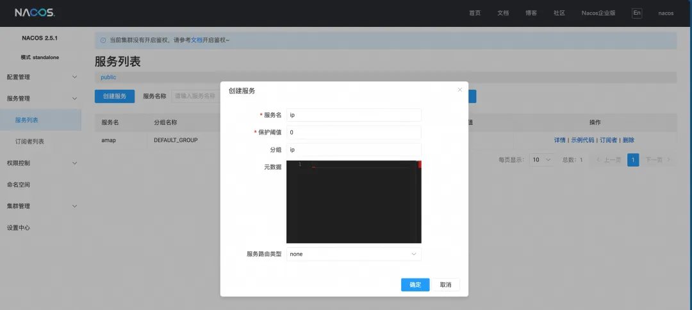

<font style="color:rgb(62, 62, 62);">服务创建完成之后，向 Nacos 中注册 ipinfo.io 的域名信息，执行以下命令。</font>

```plain
curl -X POST 'http://127.0.0.1:8848/nacos/v1/ns/instance?serviceName=ip&groupName=ip&ip=ipinfo.io&port=80&ephemeral=false'

```

<font style="color:rgb(62, 62, 62);">注册完成之后，就能在 Nacos 控制台看到 IP 服务的下有一个实例了。</font>

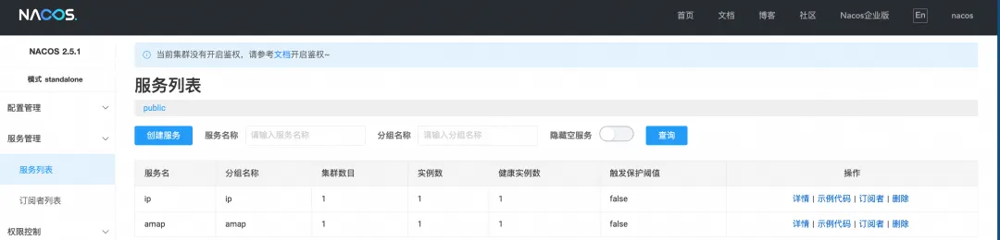

<font style="color:rgb(62, 62, 62);">服务创建完成之后，我们在配置中心配置获取 IP 服务的接口描述。创建 DataId </font>_**<font style="color:rgb(62, 62, 62);">ip-mcp-tools.json</font>**_<font style="color:rgb(62, 62, 62);">为 ，分组为 </font>_**<font style="color:rgb(62, 62, 62);">ip</font>**_<font style="color:rgb(62, 62, 62);">的配置，配置内容为：</font>

```plain
{
    "protocol": "http",
    "tools": [
        {
            "name": "get_current_ip_address",
            "description": "get current caller's ip address",
            "inputSchema": {
                "type": "object",
                "properties": {
                    "empty_args": {
                        "type": "string",
                        "description": "should be empty"
                    }
                }
            } 
        }
    ],
    "toolsMeta": {
        "get_current_ip_address": {
            "InvokeContext": {
                "path": "/",
                "method": "GET"
            }
        }
    }
}
```

<font style="color:rgb(62, 62, 62);">配置创建完之后，就可以在 Cursor 中配置 Higress 作为 MCP Server 调用 Tool 了。</font>

**<font style="color:rgb(62, 62, 62);">Cursor MCP 配置</font>**

<font style="color:rgb(62, 62, 62);">Cursor 的具体配置方法如下：首先安装最新版本的 Cursor，安装完成之后在 Cursor 的设置中，配置 MCP Server 的具体信息。</font>

```plain
{
  "mcpServers": {
    "nacos-registry": {
      "url": "http://localhost/registry/sse"
    }
  }
}
```

<font style="color:rgb(62, 62, 62);">配置完成后可以看到 通过 Higress + Nacos 暴露的 MCP Server 提供的 Tool。</font>

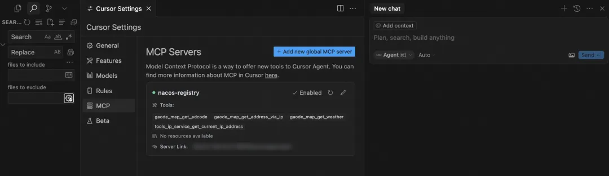

**<font style="color:rgb(62, 62, 62);">查询天气</font>**

<font style="color:rgb(62, 62, 62);">接下来，我们通过 Agent 模式向智能体，询问今天天气怎么样。</font>

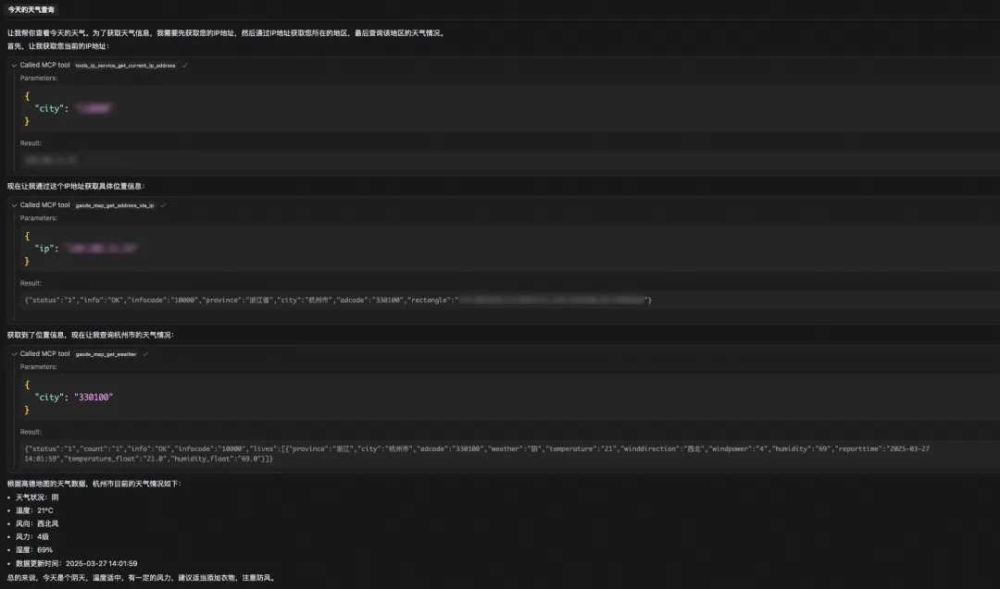

<font style="color:rgb(62, 62, 62);">可以看到，智能体先获取了当前主机的出口 IP，再通过 IP 获取到具体的省市信息，再通过省市信息获取到adcode，最终通过 adcode 获取到当前的天气信息。</font>

<font style="color:rgb(62, 62, 62);">整个过程中，用户只需要将服务注册在 Nacos 中，并且在 Nacos 中配置服务接口相关的描述信息即可，服务本身的代码无需任何改造；</font>

<font style="color:rgb(255, 129, 36);">三、总结</font>

<font style="color:rgb(62, 62, 62);">通过 Nacos+Higress 的方案实现0代码改造将 Agent 连接到存量应用，能够显著降低存量应用的改造成本。</font>

<font style="color:rgb(62, 62, 62);">当前需要用户手动配置接口描述信息，后续可以通过工具化的能力将接口进一步简化，用户只需要微调即可。现实中，我们有大量的存量服务和接口，按照接口到 Tool 的映射，我们将会有非常多的 Tool，当 Agent 拉取 Tool 列表并传递给模型的时候，将会有非常多的 token 消耗，并且模型的性能也可能会下降。</font>

<font style="color:rgb(62, 62, 62);">那么如何在上下文中圈定有效的 Tool 列表，并返回给 Agent，将会是我们后续重要的演进方向之一。除了Tool，MCP 协议还有 Prompt、Resource 等，MCP 社区也在持续更新协议，我们将在后续逐个支持，助力 MCP 生态的发展。</font>


> 更新: 2025-04-08 10:56:51  
> 原文: <https://www.yuque.com/u12222632/as5rgl/pt37xc1xhwepnhuf>