# 手写MCP服务，并借助 serverless 将 MCP 服务部署到云端

**<font style="color:rgb(115, 119, 122);">简介：</font>**<font style="color:rgb(115, 119, 122);background-color:rgb(249, 249, 249);"> </font><font style="color:rgb(115, 119, 122);">本文介绍了如何将 MCP 服务通过 SSE 协议部署到云端，避免本地下载和启动的麻烦。首先，使用 Python 实现了一个基于 FastMCP 的网络搜索工具，并通过设置 `transport='sse'` 启用 SSE 协议。接着，编写客户端代码测试服务功能，确保其正常运行。随后，利用阿里云函数计算服务（FC 3.0）以 Serverless 方式部署该服务，包括创建函数、配置环境变量、添加依赖层以及部署代码。最后，提供了客户端测试方法和日志排查技巧，并展示了如何在不同工具（如 Cherry-Studio、Cline 和 Cursor）中配置云端 MCP 服务。</font>

<font style="color:rgb(115, 119, 122);"></font>

<font style="color:rgb(36, 41, 46);">市面上大部分教程都是讲的如何使用本地的 MCP 服务，但是有时我们希望直接把 MCP 服务部署到云端来直接调用，就省去了本地下载启动的烦恼了。此时，我们就需要来使用 MCP 的 SSE 的协议来实现了。</font>

<font style="color:rgb(36, 41, 46);">此时，我们先来写 SSE 协议的 MCP 服务。实现起来很简单，只需要将我们最后的</font><font style="color:rgb(36, 41, 46);"> </font>`<font style="color:rgb(36, 41, 46);">run</font>`<font style="color:rgb(36, 41, 46);"> </font><font style="color:rgb(36, 41, 46);">命令中的</font><font style="color:rgb(36, 41, 46);"> </font>`<font style="color:rgb(36, 41, 46);">transport</font>`<font style="color:rgb(36, 41, 46);"> </font><font style="color:rgb(36, 41, 46);">参数设置为</font><font style="color:rgb(36, 41, 46);"> </font>`<font style="color:rgb(36, 41, 46);">sse</font>`<font style="color:rgb(36, 41, 46);"> </font><font style="color:rgb(36, 41, 46);">即可。下面还是以上面的网络搜索为例子，来实现一下 ，具体代码如下：</font>

```plain
# sse_web_search.py
import httpx

from mcp.server import FastMCP


app = FastMCP('web-search', port=9000)


@app.tool()
async def web_search(query: str) -> str:
    """
    搜索互联网内容

    Args:
        query: 要搜索内容

    Returns:
        搜索结果的总结
    """
    async with httpx.AsyncClient() as client:
        response = await client.post(
            'https://open.bigmodel.cn/api/paas/v4/tools',
            headers={
   'Authorization': 'YOUR API KEY'},
            json={
   
                'tool': 'web-search-pro',
                'messages': [
                    {
   'role': 'user', 'content': query}
                ],
                'stream': False
            }
        )

        res_data = []
        for choice in response.json()['choices']:
            for message in choice['message']['tool_calls']:
                search_results = message.get('search_result')
                if not search_results:
                    continue
                for result in search_results:
                    res_data.append(result['content'])

        return '\n\n\n'.join(res_data)


if __name__ == "__main__":
    app.run(transport='sse')
```

<font style="color:rgb(36, 41, 46);">在</font><font style="color:rgb(36, 41, 46);"> </font>`<font style="color:rgb(36, 41, 46);">FastMCP</font>`<font style="color:rgb(36, 41, 46);"> </font><font style="color:rgb(36, 41, 46);">中，有几个可以设置 SSE 协议相关的参数：</font>

+ <font style="color:rgb(36, 41, 46);">host: 服务地址，默认为</font><font style="color:rgb(36, 41, 46);"> </font>`<font style="color:rgb(36, 41, 46);">0.0.0.0</font>`
+ <font style="color:rgb(36, 41, 46);">port: 服务端口，默认为 8000。上述代码中，我设置为</font><font style="color:rgb(36, 41, 46);"> </font>`<font style="color:rgb(36, 41, 46);">9000</font>`
+ <font style="color:rgb(36, 41, 46);">sse_path：sse 的路由，默认为</font><font style="color:rgb(36, 41, 46);"> </font>`<font style="color:rgb(36, 41, 46);">/sse</font>`

<font style="color:rgb(36, 41, 46);">申请apikey地址：</font>

<font style="color:rgb(36, 41, 46);">智谱AI:</font>[https://www.bigmodel.cn/invite?icode=AkjjbQuT4ZJNepbT3slpGGczbXFgPRGIalpycrEwJ28%3D](https://www.bigmodel.cn/invite?icode=AkjjbQuT4ZJNepbT3slpGGczbXFgPRGIalpycrEwJ28%3D)（2000万免费tokens）

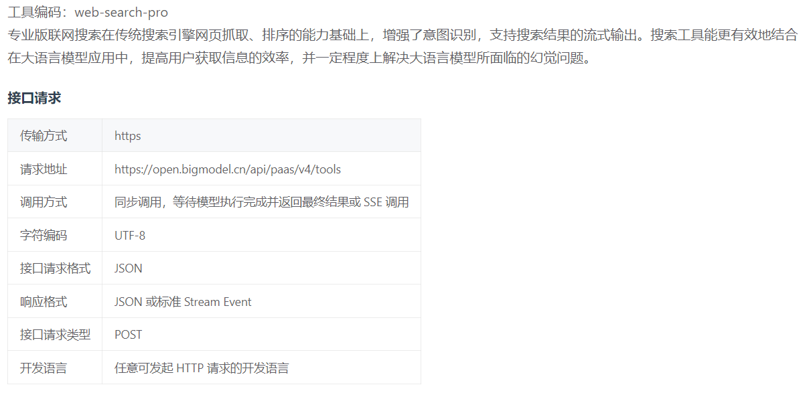

<font style="color:rgb(36, 41, 46);">此时，我们就可以直接写一个客户端的代码来进行测试了。具体代码如下：</font>

```plain
import asyncio
from mcp.client.sse import sse_client
from mcp import ClientSession


async def main():
    async with sse_client('http://localhost:9000/sse') as streams:
        async with ClientSession(*streams) as session:
            await session.initialize()

            res = await session.call_tool(
                'web_search', {
   'query': '杭州今天天气'})
            print(res)


if __name__ == '__main__':
    asyncio.run(main())
```

<font style="color:rgb(36, 41, 46);">我们可以看到，他正常工作了，并搜索到了内容：  
</font>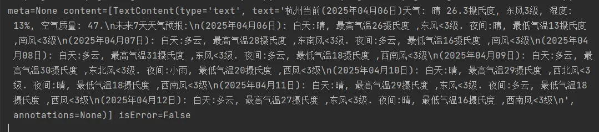

<font style="color:rgb(36, 41, 46);">当然，我们也可以使用</font><font style="color:rgb(36, 41, 46);"> </font>`<font style="color:rgb(36, 41, 46);">mcp dev sse_web_search.py</font>`<font style="color:rgb(36, 41, 46);"> </font><font style="color:rgb(36, 41, 46);">的方式来测试。这里要注意的是，</font>`<font style="color:rgb(36, 41, 46);">Transport Type</font>`<font style="color:rgb(36, 41, 46);"> </font><font style="color:rgb(36, 41, 46);">需要改成</font><font style="color:rgb(36, 41, 46);"> </font>`<font style="color:rgb(36, 41, 46);">SSE</font>`<font style="color:rgb(36, 41, 46);">，然后下面填写我们的本地服务地址。  
</font>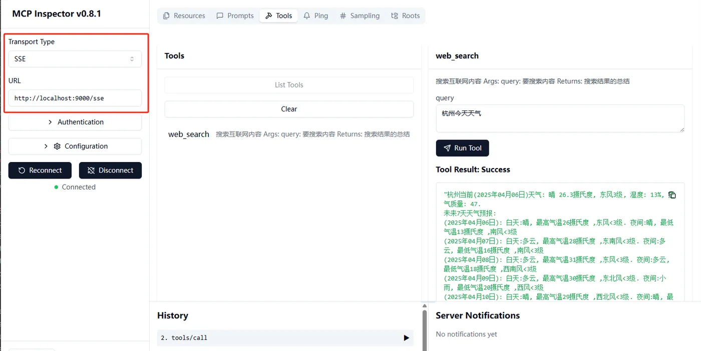

<font style="color:rgb(36, 41, 46);">当一切都测试没有问题后，我们就来将他通过 severless 的方式来部署到云端。这里我们选择的是阿里云的函数计算服务。首先我们先进入到阿里云的 </font>`<font style="color:rgb(36, 41, 46);">函数计算 FC 3.0</font>`<font style="color:rgb(36, 41, 46);"> 的 </font>`<font style="color:rgb(36, 41, 46);">函数</font>`<font style="color:rgb(36, 41, 46);"> 菜单，并点击 </font>`<font style="color:rgb(36, 41, 46);">创建函数</font>`<font style="color:rgb(36, 41, 46);"> 来创建我们的服务。地址是：</font>[<font style="color:rgb(19, 102, 236);">https://fcnext.console.aliyun.com/cn-hangzhou/functions</font>](https://fcnext.console.aliyun.com/cn-hangzhou/functions)<font style="color:rgb(36, 41, 46);">  
</font>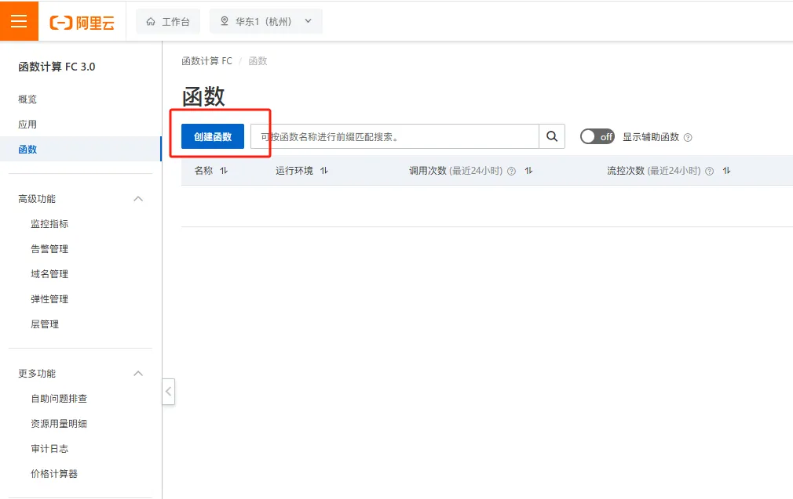<font style="color:rgb(36, 41, 46);">  
</font>

<font style="color:rgb(36, 41, 46);">我们这里选择</font><font style="color:rgb(36, 41, 46);"> </font>`<font style="color:rgb(36, 41, 46);">Web函数</font>`<font style="color:rgb(36, 41, 46);"> </font><font style="color:rgb(36, 41, 46);">，运行环境我们选择</font><font style="color:rgb(36, 41, 46);"> </font>`<font style="color:rgb(36, 41, 46);">Python 10</font>`<font style="color:rgb(36, 41, 46);">。代码上传方式这里可以根据大家需求来，因为我这里就一个 python 文件，所以我这里就直接选择</font>`<font style="color:rgb(36, 41, 46);">使用示例代码</font>`<font style="color:rgb(36, 41, 46);">了，这样我后面直接把我的代码覆盖进去了就行了。启动命令和监听端口我这里都保留为默认(</font>**<font style="color:rgb(36, 41, 46);">端口需要和代码中一致</font>**<font style="color:rgb(36, 41, 46);">)。</font>

<font style="color:rgb(36, 41, 46);">环境变量大家可以将代码中用到的 apikey 可以设置为一个环境变量，这里我就不设置了。最后设置完成截图如下：  
</font>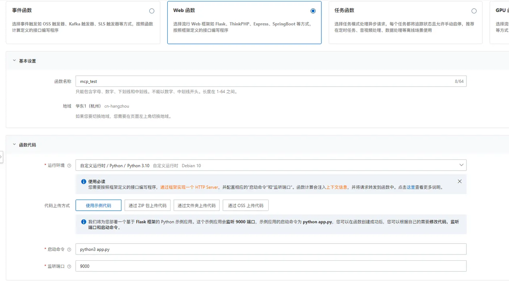

<font style="color:rgb(36, 41, 46);">在高级设置中，为了方便调试，我启动了日志功能。  
</font>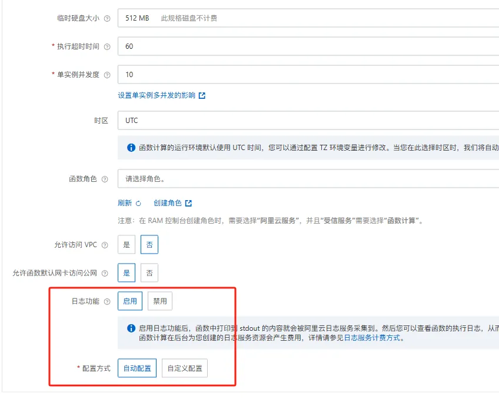

<font style="color:rgb(36, 41, 46);">设置完成后，点创建即可。他就跳转到代码编辑部分，然后我们把之前的代码复制进去即可。  
</font>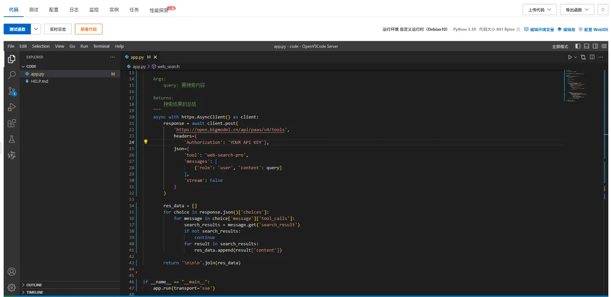

<font style="color:rgb(36, 41, 46);">完成后，我们来安装下依赖。我们点击右上角的</font>`<font style="color:rgb(36, 41, 46);">编辑层</font>`<font style="color:rgb(36, 41, 46);">。这里默认会有个默认的 flask 的层，因为开始的模板用的是 flask，这里我们就不需要了。我们删除他，再添加一个 mcp 的层。选择</font>`<font style="color:rgb(36, 41, 46);">添加官方公共层</font>`<font style="color:rgb(36, 41, 46);">，然后搜索</font><font style="color:rgb(36, 41, 46);"> </font>`<font style="color:rgb(36, 41, 46);">mcp</font>`<font style="color:rgb(36, 41, 46);"> </font><font style="color:rgb(36, 41, 46);">就能看到了一个 python 版的 MCP 层，里面包含了 MCP 所有用到的依赖。  
</font>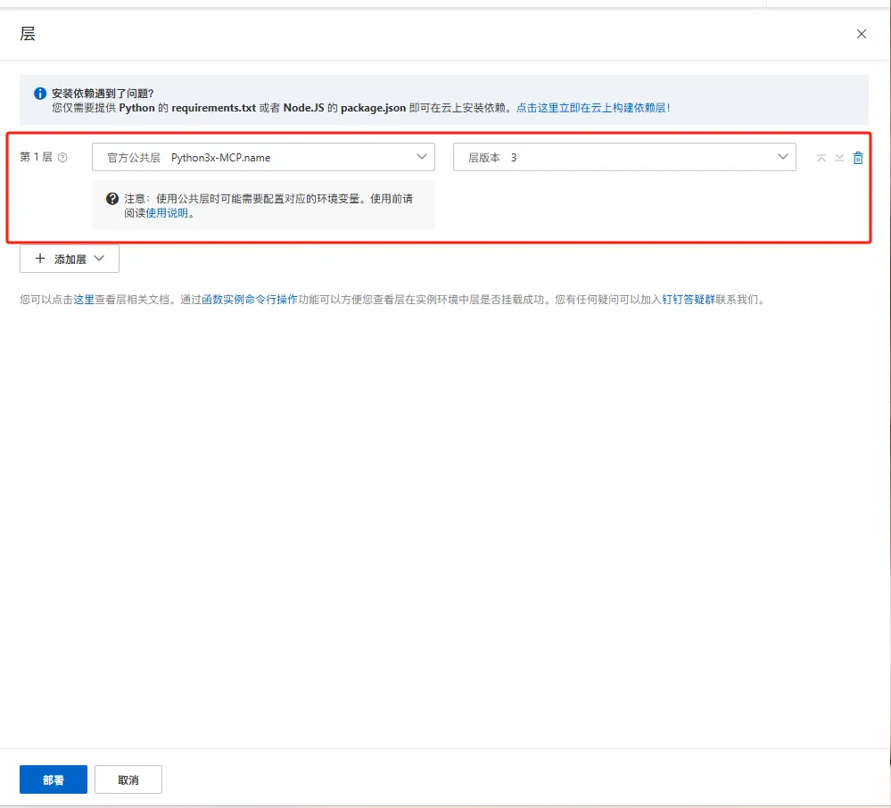

<font style="color:rgb(36, 41, 46);">如果你还有其他第三方的，可以先搜索下看看公共层中是否有，没有就可以自行构建一个自定义的层。点击这里就可以，只需要提供一个</font><font style="color:rgb(36, 41, 46);"> </font>`<font style="color:rgb(36, 41, 46);">requirements</font>`<font style="color:rgb(36, 41, 46);"> </font><font style="color:rgb(36, 41, 46);">列表就可以了，这里就不赘述了。  
</font>

<font style="color:rgb(36, 41, 46);">当我们都设置完成后，点击右下角的部署即可。</font>

<font style="color:rgb(36, 41, 46);">然后我们又回到了我们代码编辑的页面，此时，我们再点击左上角的部署代码。稍等一两秒就会提示代码部署成功。此时，我们的 MCP 服务就被部署到了云端。  
</font>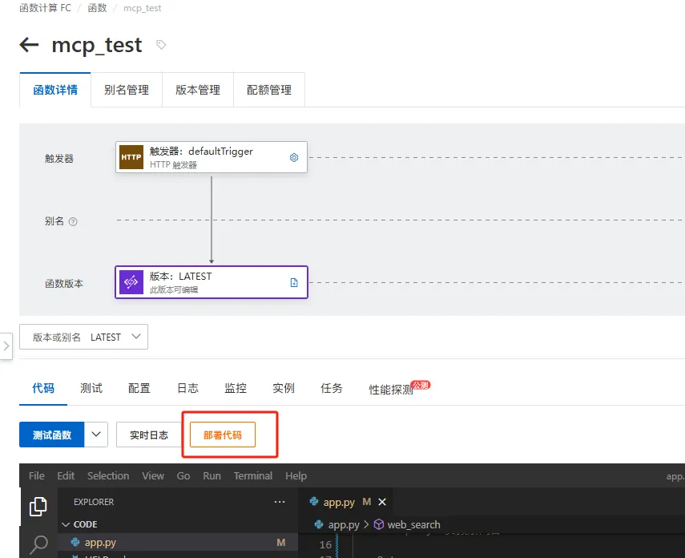

<font style="color:rgb(36, 41, 46);">然后，我们切换到</font>`<font style="color:rgb(36, 41, 46);">配置</font>`<font style="color:rgb(36, 41, 46);">的</font>`<font style="color:rgb(36, 41, 46);">触发器</font>`<font style="color:rgb(36, 41, 46);">中，就可以看到我们用来访问的 URL 地址了。当然，你也可以绑定自己的域名。  
</font>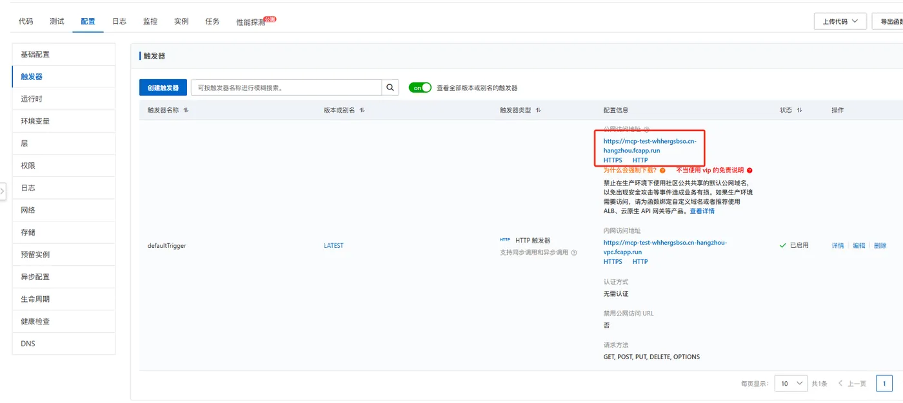

<font style="color:rgb(36, 41, 46);">然后，我们就可以用我们上面的客户端代码进行测试了。</font>

```plain
import asyncio
from mcp.client.sse import sse_client
from mcp import ClientSession


async def main():
    async with sse_client('https://mcp-test-whhergsbso.cn-hangzhou.fcapp.run/sse') as streams:
        async with ClientSession(*streams) as session:
            await session.initialize()

            res = await session.call_tool('web_search', {
   'query': '杭州今天天气'})
            print(res)


if __name__ == '__main__':
    asyncio.run(main())
```

<font style="color:rgb(36, 41, 46);">如果我们发现在客户端有报也不用慌，我们可以直接在日志中找到对应出错的请求点击</font>`<font style="color:rgb(36, 41, 46);">请求日志</font>`<font style="color:rgb(36, 41, 46);">查看报错来修复。  
</font>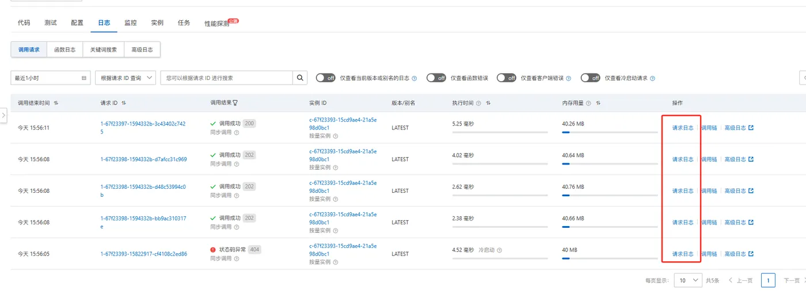

<font style="color:rgb(36, 41, 46);">到这里，我们的 MCP 服务就被部署到了云端，我们就可以在任何地方直接来使用它了。</font>

<font style="color:rgb(36, 41, 46);">比如，在</font><font style="color:rgb(36, 41, 46);"> </font>`<font style="color:rgb(36, 41, 46);">Cherry-Studio</font>`<font style="color:rgb(36, 41, 46);"> </font><font style="color:rgb(36, 41, 46);">中，我们可以这样来设置：  
</font>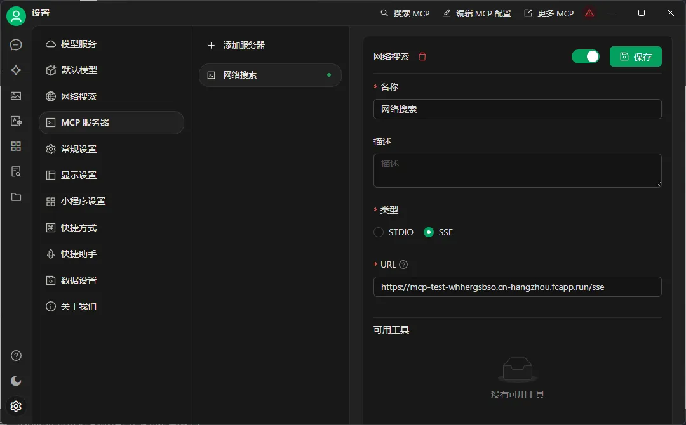

<font style="color:rgb(36, 41, 46);">在</font><font style="color:rgb(36, 41, 46);"> </font>`<font style="color:rgb(36, 41, 46);">Cline</font>`<font style="color:rgb(36, 41, 46);"> </font><font style="color:rgb(36, 41, 46);">中：  
</font>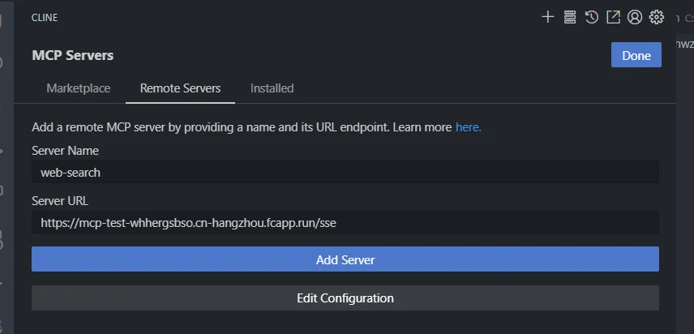

<font style="color:rgb(36, 41, 46);">在</font><font style="color:rgb(36, 41, 46);"> </font>`<font style="color:rgb(36, 41, 46);">Cursor</font>`<font style="color:rgb(36, 41, 46);"> </font><font style="color:rgb(36, 41, 46);">中：  
</font>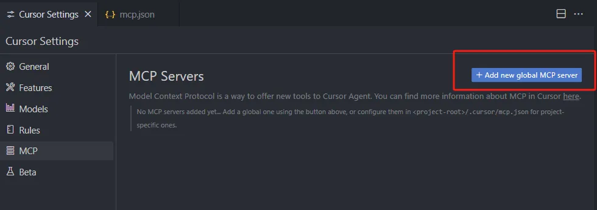

```plain
{
   
  "mcpServers": {
   
    "web-search": {
   
      "url": "https://mcp-test-whhergsbso.cn-hangzhou.fcapp.run/sse"
    }
  }
}
```

<font style="color:rgb(115, 119, 122);">  
</font><font style="color:rgb(115, 119, 122);"> </font>


> 更新: 2025-04-11 10:34:11  
> 原文: <https://www.yuque.com/u12222632/as5rgl/hggri39osbqfewpo>