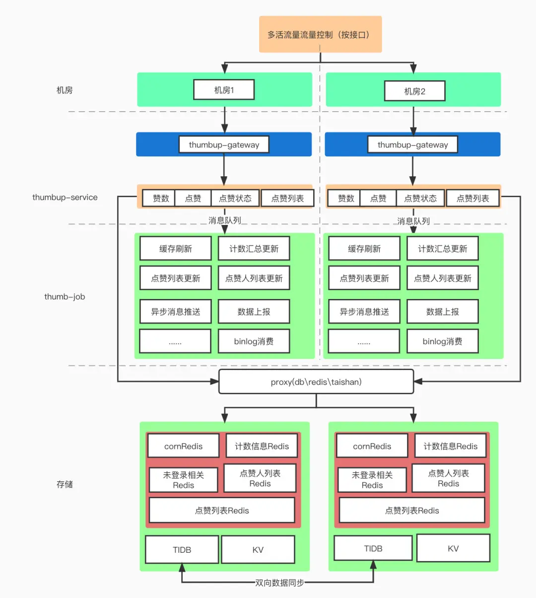
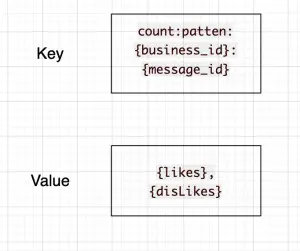
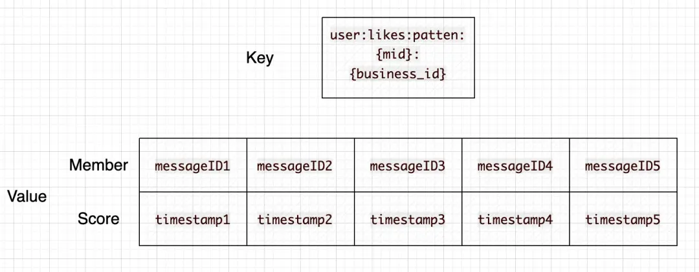
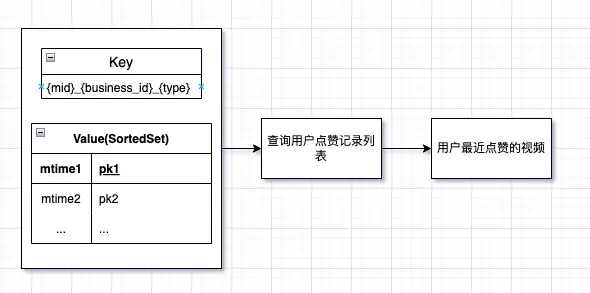
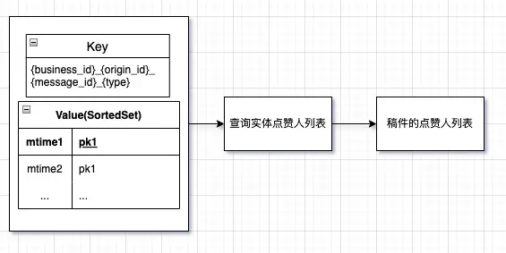
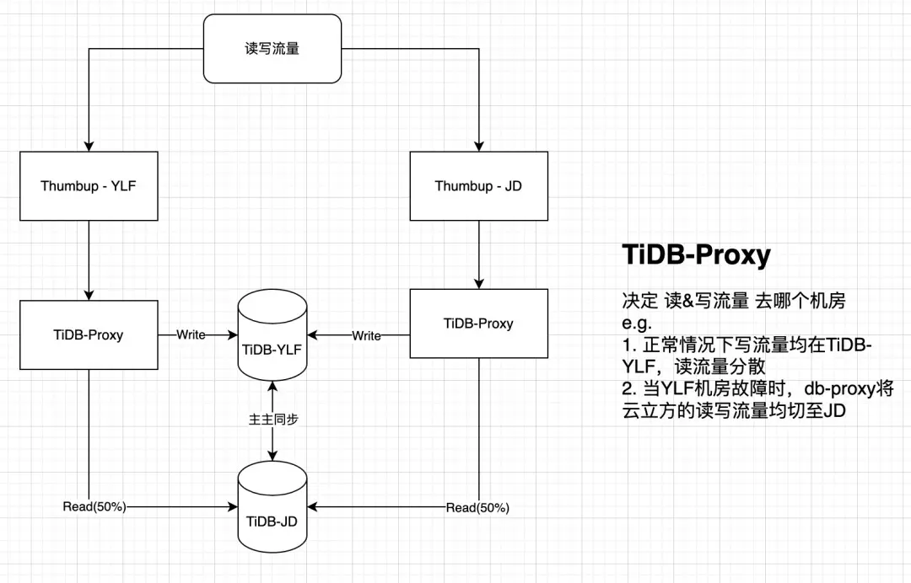
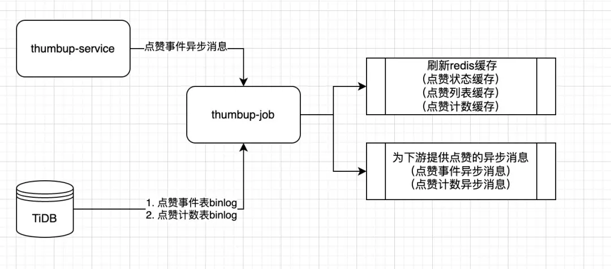

# B站千亿级点赞系统服务架构设计

**<font style="color:rgb(86, 193, 254);">一、前言</font>**

**<font style="color:rgb(24, 25, 28);"></font>****<font style="color:rgb(86, 193, 254);">1、什么是点赞</font>**

<font style="color:rgb(24, 25, 28);">点赞相信大家都不陌生，在B站，点赞是UP主们跟粉丝之间的特殊羁绊。B 站的点赞系统提供了对</font>**<font style="color:rgb(24, 25, 28);">视频、动态、专栏、评论、弹幕</font>**<font style="color:rgb(24, 25, 28);">等多种实体维度的点赞、点踩以及其余配套的数据查询的能力。</font>

+ **<font style="color:rgb(24, 25, 28);">稿件点赞</font>**<font style="color:rgb(24, 25, 28);">（类推动态、专栏、评论等也具备该功能）</font>


+ **<font style="color:rgb(24, 25, 28);">总获赞数</font>**


+ <font style="color:rgb(24, 25, 28);">点赞记录</font>


**<font style="color:rgb(86, 193, 254);">2、点赞服务需要提供哪些系统能力</font>**

**<font style="color:rgb(24, 25, 28);">业务能力:</font>**

<font style="color:rgb(24, 25, 28);">以 “</font>**<font style="color:rgb(24, 25, 28);">稿件</font>**<font style="color:rgb(24, 25, 28);">” 为例，点赞服务需要提供</font>

+ <font style="color:rgb(24, 25, 28);">对某个稿件点赞（取消点赞）、点踩（取消点踩）</font>
+ <font style="color:rgb(24, 25, 28);">查询是否对 单个 或者 一批稿件 点过赞（踩） - 即点赞状态查询</font>
+ <font style="color:rgb(24, 25, 28);">查询某个稿件的点赞数</font>
+ <font style="color:rgb(24, 25, 28);">查询某个用户的点赞列表</font>
+ <font style="color:rgb(24, 25, 28);">查询某个稿件的点赞人列表</font>
+ <font style="color:rgb(24, 25, 28);">查询用户收到的总点赞数</font>

**<font style="color:rgb(24, 25, 28);">平台能力：</font>**

<font style="color:rgb(24, 25, 28);">点赞作为一个与社区实体共存的服务，中台化、平台化也是点赞服务需要具备的能力</font>

+ <font style="color:rgb(24, 25, 28);">提供业务快速接入的能力（配置级别）</font>
+ <font style="color:rgb(24, 25, 28);">数据存储上（缓存、DB），具备数据隔离存储的能力（多租户）</font>

**<font style="color:rgb(24, 25, 28);">容灾能力：</font>**

<font style="color:rgb(24, 25, 28);">作为被用户强感知的站内功能，需要考虑到各种情况下的系统容灾。例如当：</font>

**<font style="color:rgb(24, 25, 28);">存储不可用</font>**

+ <font style="color:rgb(24, 25, 28);">例如当DB不可用时，需要依托缓存尽可能提供服务。</font>
+ <font style="color:rgb(24, 25, 28);">同理当缓存不可用时，DB也需要保证自己不宕机的情况下尽可能提供服务。</font>

**<font style="color:rgb(24, 25, 28);">消息队列不可用</font>**

+ <font style="color:rgb(24, 25, 28);">当消息队列不可用时，依托B站自研的railgun，通过RPC调用的方式自动降级</font>

**<font style="color:rgb(24, 25, 28);">机房灾难</font>**

+ <font style="color:rgb(24, 25, 28);">切换机房</font>

**<font style="color:rgb(24, 25, 28);">数据同步延迟</font>**

+ <font style="color:rgb(24, 25, 28);">比如点赞就遇到过因为Tidb的数据同步问题（断流、延迟）导致的点赞计数同步延迟问题。</font>

<font style="color:rgb(24, 25, 28);">当然还有其他比如 </font>**<font style="color:rgb(24, 25, 28);">下游依赖宕机、点赞消息堆积</font>**<font style="color:rgb(24, 25, 28);"> 以及其他未知问题</font>

**<font style="color:rgb(24, 25, 28);"></font>****<font style="color:rgb(86, 193, 254);">3、系统需要承载哪些压力</font>**

**<font style="color:rgb(255, 140, 198);">1.流量压力</font>**

**<font style="color:rgb(24, 25, 28);">全局流量压力：</font>**

<font style="color:rgb(24, 25, 28);">全站点赞状态查询、点赞数查询等【读流量】超过300k，点赞、点踩等【写流量】超过15K</font>

+ <font style="color:rgb(24, 25, 28);">针对写流量，为了保证数据写入性能，我们在写入【点赞数】数据的时候，在内存中做了部分聚合写入，比如聚合10s内的点赞数，一次性写入。如此可大量减少数据库的IO次数。</font>
+ <font style="color:rgb(24, 25, 28);">同时数据库的写入我们也做了全面的异步化处理，保证了数据库能以合理的速率处理写入请求。</font>
+ <font style="color:rgb(24, 25, 28);">另外为了保证点赞状态的正确性，且同时让程序拥有自我纠错的能力，我们在每一次更新点赞状态之前，都会取出老的点赞状态作为更新依据。例如：如果当前是取消点赞，那么需要数据库中已有点赞状态。</font>

**<font style="color:rgb(24, 25, 28);">单点流量（热点）压力：</font>**

<font style="color:rgb(24, 25, 28);">热门事件、稿件等带来的系统热点问题，包括DB热点、缓存热点</font>

+ <font style="color:rgb(24, 25, 28);">当一个稿件成为超级热门的时候，大量的流量就会涌入到存储的单个分片上，造成读写热点问题。此时需要有热点识别机制来识别该热点，并将数据缓存至本地，并设置合理的TTL。例如，UP主 【杰威尔音乐】发布第一个稿件的时候就是一次典型热点事件。</font>

**<font style="color:rgb(255, 140, 198);">2.数据存储压力</font>**

+ <font style="color:rgb(24, 25, 28);">点赞数据存储超过千亿级别</font>
+ <font style="color:rgb(24, 25, 28);">如何高效的利用存储介质存放这些数据才能既满足业务需求，也能最大程度节省成本，也是一个点赞服务正在努力改造的工程 - KV化存储</font>

**<font style="color:rgb(255, 140, 198);">3.面对未知灾难</font>**

+ <font style="color:rgb(24, 25, 28);">DB宕机、Redis集群抖动、机房故障、网络故障等</font>

<font style="color:rgb(24, 25, 28);">针对前言中提到的点赞的平台能力、系统压力与容灾，我会在下文中作出更加详细的介绍。</font>

**<font style="color:rgb(86, 193, 254);">二、点赞整体系统架构简介</font>**

<font style="color:rgb(24, 25, 28);">为了在提供上述能力的前提下经受住流量、存储、容灾三大压力，点赞目前的系统实现方式如下：</font>

**<font style="color:rgb(86, 193, 254);">1、系统架构简介</font>**



<font style="color:rgb(24, 25, 28);">整个点赞服务的系统可以分为五个部分</font>

<font style="color:rgb(24, 25, 28);">1、流量路由层（决定流量应该去往哪个机房）</font>

<font style="color:rgb(24, 25, 28);">2、业务网关层（统一鉴权、反黑灰产等统一流量筛选）</font>

<font style="color:rgb(24, 25, 28);">3、点赞服务（thumbup-service）,提供统一的RPC接口</font>

<font style="color:rgb(24, 25, 28);">4、点赞异步任务（thumbup-job）</font>

<font style="color:rgb(24, 25, 28);">5、数据层（db、kv、redis）</font>

<font style="color:rgb(24, 25, 28);">下文将重点分享下</font>**<font style="color:rgb(24, 25, 28);">数据存储层、点赞服务层（thumbup-service）</font>**<font style="color:rgb(24, 25, 28);">与</font>**<font style="color:rgb(24, 25, 28);"> 异步任务层（thumbup-job）</font>**<font style="color:rgb(24, 25, 28);">的系统设计</font>

**<font style="color:rgb(86, 193, 254);">2、三级数据存储</font>**

**<font style="color:rgb(24, 25, 28);">基本数据模型：</font>**

+ <font style="color:rgb(24, 25, 28);">点赞记录表：记录用户在什么时间对什么实体进行了什么类型的操作(是赞还是踩，是取消点赞还是取消点踩)等</font>
+ <font style="color:rgb(24, 25, 28);">点赞计数表：记录被点赞实体的累计点赞（踩）数量</font>

**<font style="color:rgb(24, 25, 28);">①、第一层存储：DB层 - （TiDB）</font>**

**<font style="color:rgb(24, 25, 28);">点赞系统中最为重要的就是点赞记录表（likes）和点赞计数表（counts），负责整体数据的持久化保存，以及提供缓存失效时的回源查询能力。</font>**

+ <font style="color:rgb(24, 25, 28);">点赞记录表 - likes : 每一次的点赞记录（用户Mid、被点赞的实体ID（messageID）、点赞来源、时间）等信息，并且在Mid、messageID两个维度上建立了满足业务求的联合索引。</font>
+ <font style="color:rgb(24, 25, 28);">点赞数表 - counts : 以业务ID（BusinessID）+实体ID(messageID)为主键，聚合了该实体的点赞数、点踩数等信息。并且按照messageID维度建立满足业务查询的索引。</font>
+ <font style="color:rgb(24, 25, 28);">由于DB采用的是分布式数据库TiDB，所以对业务上无需考虑分库分表的操作</font>

**<font style="color:rgb(24, 25, 28);">②、第二层存储</font>**

**<font style="color:rgb(24, 25, 28);">缓存层Cache：点赞作为一个高流量的服务，缓存的设立肯定是必不可少的。点赞系统主要使用的是CacheAside模式。这一层缓存主要基于</font>**<font style="color:rgb(24, 25, 28);">Redis缓存：以</font>**<font style="color:rgb(24, 25, 28);">点赞数</font>**<font style="color:rgb(24, 25, 28);">和</font>**<font style="color:rgb(24, 25, 28);">用户点赞列表</font>**<font style="color:rgb(24, 25, 28);">为例</font>

<font style="color:rgb(24, 25, 28);">1.点赞数</font>



```javascript
key-value = count:patten:{business_id}:{message_id} - {likes},{disLikes}
用业务ID和该业务下的实体ID作为缓存的Key,并将点赞数与点踩数拼接起来存储以及更新
```

<font style="color:rgb(24, 25, 28);">2.用户点赞列表</font>



```javascript
key-value = user:likes:patten:{mid}:{business_id} - member(messageID)-score(likeTimestamp)
* 用mid与业务ID作为key，value则是一个ZSet,member为被点赞的实体ID，score为点赞的时间。当改业务下某用户有新的点赞操作的时候，被点赞的实体则会通过 zadd的方式把最新的点赞记录加入到该ZSet里面来
为了维持用户点赞列表的长度（不至于无限扩张），需要在每一次加入新的点赞记录的时候，按照固定长度裁剪用户的点赞记录缓存。该设计也就代表用户的点赞记录在缓存中是有限制长度的，超过该长度的数据请求需要回源DB查询
```

**<font style="color:rgb(24, 25, 28);">③、第三层存储</font>**

**<font style="color:rgb(24, 25, 28);">LocalCache - 本地缓存</font>**

+ <font style="color:rgb(24, 25, 28);">本地缓存的建立，目的是为了应对缓存热点问题。</font>
+ <font style="color:rgb(24, 25, 28);">利用最小堆算法，在可配置的时间窗口范围内，统计出访问最频繁的缓存Key,并将热Key（Value）按照业务可接受的TTL存储在本地内存中。</font>
+ <font style="color:rgb(24, 25, 28);">其中热点的发现之前也有同步过：</font><font style="color:rgb(2, 162, 255);">https://mp.weixin.qq.com/s/C8CI-1DDiQ4BC_LaMaeDBg</font>

**<font style="color:rgb(24, 25, 28);">④、针对TIDB海量历史数据的迁移归档</font>**

<font style="color:rgb(24, 25, 28);">迁移归档的原因(初衷)，是为了减少TIDB的存储容量,节约成本的同时也多了一层存储，可以作为灾备数据。</font>

<font style="color:rgb(24, 25, 28);">以下是在KV数据库（taishan）中点赞的数据与索引的组织形式：</font>

1. <font style="color:rgb(24, 25, 28);">点赞记录</font>

```javascript
1_{mid}_${business_id}_${type}_${message_id} =&gt; {origin_id}_{mtime}
```

<font style="color:rgb(24, 25, 28);">2.用户点赞列表索引</font>



```javascript
2_{mid}_${business_id}_${type}_${mtime}_{message_id} =&gt; {origin_id}
```

<font style="color:rgb(24, 25, 28);">3.实体维度点赞记录索引</font>



```javascript
3_{message_id}_${business_id}_${type}_${mtime}_${mid}=&gt;{origin_id}
```

**<font style="color:rgb(86, 193, 254);">3、存储层的优化和思考</font>**

**<font style="color:rgb(24, 25, 28);">作为一个典型的大流量基础服务，点赞的存储架构需要最大程度上满足两个点</font>**

**<font style="color:rgb(24, 25, 28);">①、满足业务读写需求的同时具备最大的可靠性</font>**

**<font style="color:rgb(24, 25, 28);">②、选择合适的存储介质与数据存储形态，最小化存储成本</font>**

<font style="color:rgb(24, 25, 28);">从以上两点触发，考虑到KV数据在业务查询以及性能上都更契合点赞的业务形态，且TaiShan可以水平扩容来满足业务的增长。点赞服务从开的的关系型数据库（TiDB）+ 缓存（Redis）逐渐过渡至KV形数据库（TaiShai）+ 缓存（Redis），以具备更强的可靠性。</font>

<font style="color:rgb(24, 25, 28);">同时TaiShan作为公司自研的KV数据库，在成本上也能更优于使用TiDB存储。</font>

**<font style="color:rgb(86, 193, 254);">4、点赞服务层（thumbup-service）</font>**

<font style="color:rgb(24, 25, 28);">作为面对C端流量的直接接口，在提供服务的同时，需要思考在面对各种未知或者可预知的灾难时，如何尽可能提供服务</font>

+ **<font style="color:rgb(24, 25, 28);">存储（db、redis等）的容灾设计</font>**<font style="color:rgb(24, 25, 28);">（同城多活）</font>

<font style="color:rgb(24, 25, 28);">在DB的设计上，点赞服务有两地机房互为灾备，正常情况下，机房1承载所有写流量与部分读流量，机房2承载部分读流量。当DB发生故障时，通过db-proxy（sidercar）的切换可以将读写流量切换至备份机房继续提供服务。</font>




<font style="color:rgb(24, 25, 28);">在缓存（Redis）上，点赞服务也拥有两套处于不同机房的集群，并且通过异步任务消费TiDB的binLog维护两地缓存的一致性。可以在需要时切换机房来保证服务的提供，而不会导致大量的冷数据回源数据库。</font>

**<font style="color:rgb(24, 25, 28);">服务的容灾与降级</font>**

<font style="color:rgb(24, 25, 28);">（以点赞数、点赞状态、点赞列表为例），点赞作为一个用户强交互的社区功能服务，对于灾难发生时用户体验的保证是放在第一位的。所以针对重点借口，我们都会有兜底的数据作为返回。</font>

<font style="color:rgb(24, 25, 28);">多层数据存储互为灾备</font>

+ <font style="color:rgb(24, 25, 28);">点赞的热数据在reids缓存中存有一份。</font>
+ <font style="color:rgb(24, 25, 28);">kv数据库中存有全量的用户数据，当缓存不可用时，KV数据库会扛起用户的所有流量来提供服务。</font>
+ <font style="color:rgb(24, 25, 28);">TIDB目前也存储有全量的用户数据，当缓存、KV均不可用时，tidb会依托于限流，最大程度提供用户数据的读写服务。</font>
+ <font style="color:rgb(24, 25, 28);">因为存才多重存储，所以一致性也是业务需要衡量的点。</font>

<font style="color:rgb(24, 25, 28);">◎首先写入到每一个存储都是有错误重试机制的，且重要的环节，比如点赞记录等是无限重试的。</font>

<font style="color:rgb(24, 25, 28);">◎另外，在拥有重试机制的场景下，极少数的不同存储的数据不一致在点赞的业务场景下是可以被接收的</font>

+ <font style="color:rgb(24, 25, 28);">多地方机房互为灾备</font><font style="color:rgb(24, 25, 28);">        ◎点赞机房、缓存、数据库等都在不同机房有备份数据，可以在某一机房或者某地中间件发生故障时快速切换。</font>
+ <font style="color:rgb(24, 25, 28);">点赞重点接口的降级</font>
+ <font style="color:rgb(24, 25, 28);">点赞数、点赞、列表查询、点赞状态查询等接口，在所有兜底、降级能力都已失效的前提下也不会直接返回错误给用户，而是会以空值或者假特效的方式与用户交互。后续等服务恢复时，再将故障期间的数据写回存储。</font>

**<font style="color:rgb(86, 193, 254);">5、异步任务层（thumbup-job）</font>**

+ <font style="color:rgb(24, 25, 28);">异步任务主要作为点赞数据写入、刷新缓存、为下游其他服务发送点赞、点赞数消息等功能</font>

<font style="color:rgb(24, 25, 28);">首先是最重要的用户行为数据（点赞、点踩、取消等）的写入。搭配对数据库的限流组件以及消费速度监控，保证数据的写入不超过数据库的负荷的同时也不会出现数据堆积造成的C数据端查询延迟问题。</font>



+ <font style="color:rgb(24, 25, 28);">缓存刷新：点赞状态缓存、点赞列表缓存、点赞计数缓存</font>
+ <font style="color:rgb(24, 25, 28);">同步点赞消息</font>

<font style="color:rgb(24, 25, 28);">◎点赞事件异步消息、点赞计数异步消息</font>

+ <font style="color:rgb(24, 25, 28);">针对 WriteBack方式的思考</font>

<font style="color:rgb(24, 25, 28);">◎由于目前点赞系统异步处理能力或者说速率是能够满足业务的。所以当前写DB与写缓存都放在异步流程中。</font>

<font style="color:rgb(24, 25, 28);">◎后续随着流量的增加，实施流程中写缓存，再由异步Job写入持久层相对来说是一个更好的方案。</font>

**<font style="color:rgb(24, 25, 28);">点赞job对binLog的容灾设计</font>**

<font style="color:rgb(24, 25, 28);">由于点赞的存储为TiDB,且数据量较大。在实际生产情况中，binLog会偶遇数据延迟甚至是断流的问题。为了减少binLog数据延迟对服务数据的影响。服务做了以下改造。</font>

+ **<font style="color:rgb(24, 25, 28);">监控：</font>**

<font style="color:rgb(24, 25, 28);">首先在运维层面、代码层面都对binLog的实时性、是否断流做了监控</font>

+ **<font style="color:rgb(24, 25, 28);">应对</font>**

<font style="color:rgb(24, 25, 28);">脱离binlog，由业务层（thumb-service）发送重要的数据信息（点赞数变更、点赞状态事件）等。当发生数据延迟时，程序会自动同时消费由thumbup-service发送的容灾消息，继续向下游发送。</font>

**<font style="color:rgb(86, 193, 254);">三、未来规划</font>**

<font style="color:rgb(24, 25, 28);">1、点赞服务单元化：要陆续往服务单元化的方向迭代、演进。</font>

<font style="color:rgb(24, 25, 28);">2、点赞服务平台化：在目前的业务接入基础上增加迭代数据分库存储能力，做到服务、数据自定义隔离。</font>

<font style="color:rgb(24, 25, 28);">3、点赞业务形态探索：以社区为基础，继续探索通过点赞衍生的业务形态。</font>


> 更新: 2025-03-18 15:41:49  
> 原文: <https://www.yuque.com/u12222632/as5rgl/qlwiqenwnr96ovue>