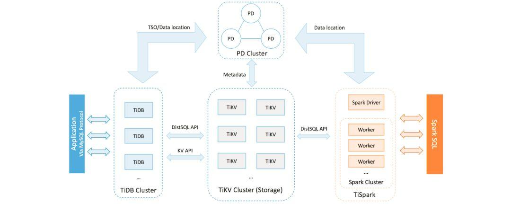
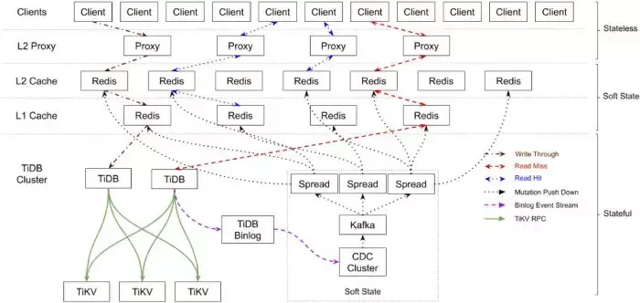
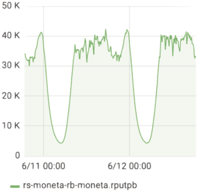
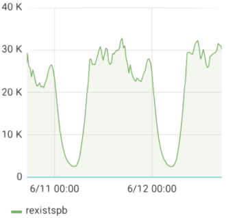
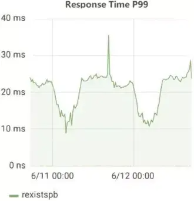
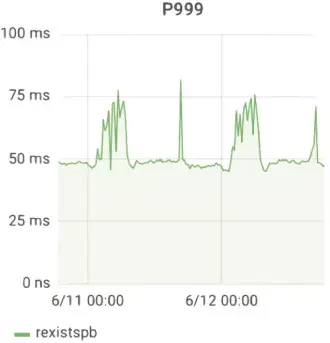
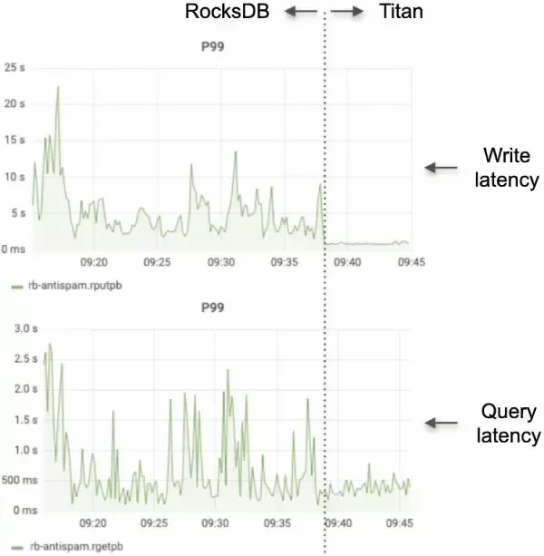

# “万亿”级数据查询，如何做到毫秒级响应？

作为中国最大的知识共享平台，我们目前拥有 2.2 亿注册用户，3000 万个问题，网站答案超过 1.3 亿。

随着用户群的增长，我们的应用程序的数据大小无法实现。我们的 Moneta 应用程序中存储了大约 1.3 万亿行数据（存储用户已经阅读过的帖子）。

由于每月累计产生大约 1000 亿行数据且不断增长，这一数字将在两年内达到 3 万亿。在保持良好用户体验的同时，我们在扩展后端方面面临严峻挑战。

在这篇文章中，我将深入探讨如何在如此大量的数据上保持毫秒级的查询响应时间，以及 TiDB 是一个开源的 MySQL 兼容的 [NewSQL 混合事务/分析处理](https://zhida.zhihu.com/search?content_id=169318742&content_type=Article&match_order=1&q=NewSQL+%E6%B7%B7%E5%90%88%E4%BA%8B%E5%8A%A1%2F%E5%88%86%E6%9E%90%E5%A4%84%E7%90%86&zhida_source=entity)（ HTAP）数据库，如何为我们提供支持获得对我们数据的实时洞察。

我将介绍为什么我们选择 TiDB，我们如何使用它，我们学到了什么，优秀实践以及对未来的一些想法。

**我们的痛点**

本节介绍了我们的 Moneta 应用程序的体系结构，我们尝试构建的理想体系结构，以及数据库可伸缩性作为我们的主要难点。

  

**系统架构要求**

知乎的 [Post Feed 服务](https://zhida.zhihu.com/search?content_id=169318742&content_type=Article&match_order=1&q=Post+Feed+%E6%9C%8D%E5%8A%A1&zhida_source=entity)是一个关键系统，用户可以通过该系统接收网站上发布的内容。

后端的 Moneta 应用程序存储用户已阅读的帖子，并在知乎的推荐页面的帖子流中过滤掉这些帖子。

Moneta 应用程序具有以下特征：

  

+ **需要高可用性数据：**Post Feed 是第一个出现的屏幕，它在推动用户流量到知乎方面发挥着重要作用。
+ **处理巨大的写入数据：**例如，在高峰时间每秒写入超过 4 万条记录，记录数量每天增加近 30 亿条记录。
+ **长期存储历史数据：**目前，系统中存储了大约 1.3 万亿条记录。随着每月累积约 1000 亿条记录并且不断增长，历史数据将在大约两年内达到 3 万亿条记录。
+ **处理高吞吐量查询：**在高峰时间，系统处理平均每秒在 1200 万个帖子上执行的查询。
+ **将查询的响应时间限制为 90 毫秒或更短：**即使对于执行时间最长的长尾查询，也会发生这种情况。
+ **容忍误报：**这意味着系统可以为用户调出许多有趣的帖子，即使有些帖子被错误地过滤掉了。

  

考虑到上述事实，我们需要一个具有以下功能的应用程序架构：

+ **高可用性：**当用户打开知乎的推荐页面时，找到大量已经阅读过的帖子是一种糟糕的用户体验。
+ **出色的系统性能：**我们的应用具有高吞吐量和严格的响应时间要求。
+ **易于扩展：**随着业务的发展和应用程序的发展，我们希望我们的系统可以轻松扩展。

  

**勘探**

为了构建具有上述功能的理想架构，我们在之前的架构中集成了三个关键组件：

+ **代理：**这会将用户的请求转发给可用节点，并确保系统的高可用性。
+ **缓存：**这暂时处理内存中的请求，因此我们并不总是需要处理数据库中的请求。这可以提高系统性能。
+ **存储：**在使用 TiDB 之前，我们在独立的 MySQL 上管理我们的业务数据。随着数据量的激增，独立的 MySQL 系统还不够。然后我们采用了 [MySQL 分片](https://zhida.zhihu.com/search?content_id=169318742&content_type=Article&match_order=1&q=MySQL+%E5%88%86%E7%89%87&zhida_source=entity)和 Master High Availability Manager（ [MHA](https://zhida.zhihu.com/search?content_id=169318742&content_type=Article&match_order=1&q=MHA&zhida_source=entity)）的解决方案，但是当每月有 1000 亿条新记录涌入我们的数据库时，这个解决方案是不可取的。

  

## **MySQL Sharding 和 MHA 的缺点**
MySQL 分片和 MHA 不是一个好的解决方案，因为 MySQL 分片和 MHA 都有它们的缺点。

### MySQL 分片的缺点：
+ 应用程序代码变得复杂且难以维护。
+ 更改现有的分片键很麻烦。
+ 升级应用程序逻辑会影响应用程序的可用性。

### MHA 的缺点：
+ 我们需要通过编写脚本或使用第三方工具来实现虚拟 IP（VIP）配置。
+ MHA 仅监视主数据库。
+ 要配置 MHA，我们需要配置无密码安全 Shell（ SSH）。这可能会导致潜在的安全风险。
+ MHA 不为从属服务器提供读取负载平衡功能。
+ MHA 只能监视主服务器（而不是从主服务器）是否可用。

  

在我们发现 TiDB 并将数据从 MySQL 迁移到 TiDB 之前，数据库可伸缩性仍然是整个系统的弱点。

**什么是 TiDB？**

TiDB 平台是一组组件，当它们一起使用时，它们将成为具有 HTAP 功能的 NewSQL 数据库。

TiDB 平台架构

  

**在 TiDB 平台内部，主要组件如下：**

+ TiDB 服务器是一个无状态的 SQL 层，它处理用户的 SQL 查询，访问存储层中的数据，并将相应的结果返回给应用程序。它与 MySQL 兼容并且位于 [TiKV](https://zhida.zhihu.com/search?content_id=169318742&content_type=Article&match_order=1&q=TiKV&zhida_source=entity) 之上。
+ TiKV 服务器是数据持久存在的分布式事务键值存储层。它使用 [Raft 共识协议](https://zhida.zhihu.com/search?content_id=169318742&content_type=Article&match_order=1&q=Raft+%E5%85%B1%E8%AF%86%E5%8D%8F%E8%AE%AE&zhida_source=entity)进行复制，以确保强大的数据一致性和高可用性。
+ [TiSpark 集群](https://zhida.zhihu.com/search?content_id=169318742&content_type=Article&match_order=1&q=TiSpark+%E9%9B%86%E7%BE%A4&zhida_source=entity)也位于 TiKV 之上。它是一个 Apache Spark 插件，可与 TiDB 平台配合使用，支持商业智能（BI）分析师和数据科学家的复杂在线分析处理（OLAP）查询。
+ 放置驱动程序（PD）服务器是由 etcd 支持的元数据集群，用于管理和调度 TiKV。

除了这些主要组件之外，TiDB 还拥有一个工具生态系统，例如用于快速部署的 Ansible 脚本，用于从 MySQL 迁移的 Syncer 和 TiDB 数据迁移。

以及用于收集对 TiDB 群集进行的逻辑更改并提供增量备份的 TiDB Binlog。复制到下游（TiDB，Kafka 或 MySQL）。

**TiDB 的主要功能包括：**

+ 水平可扩展性。
+ MySQL 兼容的语法。
+ 具有强一致性的分布式事务。
+ 云原生架构。
+ 使用 HTAP 进行最小提取，转换，加载（ ETL）。
+ 容错和 Raft 恢复。
+ 在线架构更改。

  

**我们如何使用 TiDB**

在本节中，我将向您展示如何在 Moneta 的架构中运行 TiDB 以及 Moneta 应用程序的性能指标。

**我们架构中的 TiDB**

  

知乎的 Moneta 应用程序中的 TiDB 架构

  

我们在系统中部署了 TiDB，Moneta 应用程序的整体架构变为：

+ **顶层：**无状态和可伸缩的客户端 API 和代理。这些组件易于扩展。
+ **中间层：**软状态组件和分层 Redis 缓存作为主要部分。当服务中断时，这些组件可以通过恢复保存在 TiDB 群集中的数据来自我恢复服务。
+ **底层：**TiDB 集群存储所有有状态数据。它的组件高度可用，如果节点崩溃，它可以自我恢复其服务。

在该系统中，所有组件都是可自我恢复的，整个系统具有全局故障监视机制。然后，我们使用 [Kubernetes](https://zhida.zhihu.com/search?content_id=169318742&content_type=Article&match_order=1&q=Kubernetes&zhida_source=entity) 来协调整个系统，以确保整个服务的高可用性。

  

**TiDB 的性能指标**

由于我们在生产环境中应用了 TiDB，因此我们的系统具有高可用性和易于扩展性，并且系统性能得到显著改善。例如，在 2019 年 6 月为 Moneta 应用程序采用一组性能指标。

在高峰时间每秒写入 40,000 行数据：

每秒写入的数据行（数千）

  

在高峰时段每秒检查 30,000 个查询和 1200 万个帖子：

每秒写入的数据行（数千）

  

第 99 百分位响应时间约为 25 毫秒，第 999 百分位响应时间约为 50 毫秒。实际上，平均响应时间远远小于这些数字，即使对于需要稳定响应时间的长尾查询也是如此。

第 99 百分位响应时间

  

第 999 百分位响应时间

  

_**我们学到了什么**_

我们迁移到 TiDB 并非顺利，在这里，我们想分享一些经验教训。

**更快地导入数据**我们使用 TiDB 数据迁移（DM）来收集 MySQL 增量 Binlog 文件，然后使用 TiDB Lightning 将数据快速导入 TiDB 集群。

令我们惊讶的是，将这 1.1 万亿条记录导入 TiDB 只用了四天时间。如果我们逻辑地将数据写入系统，可能需要一个月或更长时间。如果我们有更多的硬件资源，我们可以更快地导入数据。

**减少查询延迟**

完成迁移后，我们测试了少量的读取流量。当 Moneta 应用程序首次上线时，我们发现查询延迟不符合我们的要求。为解决延迟问题，我们与 PingCap 工程师合作调整系统性能。

在此过程中，我们积累了宝贵的数据和数据处理知识：

  

+ 有些查询对查询延迟很敏感，有些则不然。我们部署了一个单独的 TiDB 数据库来处理对延迟敏感的查询。（其他非延迟敏感的查询在不同的 TiDB 数据库中处理。）这样，大型查询和对延迟敏感的查询在不同的数据库中处理，前者的执行不会影响后者。
+ 对于没有理想执行计划的查询，我们编写了 SQL 提示来帮助执行引擎选择最佳执行计划。
+ 我们使用低精度时间戳 Oracle（ TSO）和预处理语句来减少网络往返。

  

**评估资源**

在我们尝试 TiDB 之前，我们没有分析我们需要多少硬件资源来支持 MySQL 端的相同数据量。

  

为了降低维护成本，我们在单主机 - 单从机拓扑中部署了 MySQL。相反，在 TiDB 中实现的 Raft 协议至少需要三个副本。

因此，我们需要更多的硬件资源来支持 TiDB 中的业务数据，我们需要提前准备机器资源。

一旦我们的数据中心设置正确，我们就可以快速完成对 TiDB 的评估。

对 TiDB 3.0 的期望

  

在知乎，反垃圾邮件和 Moneta 应用程序的架构相同。我们在用于生产数据的反垃圾邮件应用程序中尝试了 TiDB 3.0（TiDB 3.0.0-rc.1 和 TiDB 3.0.0-rc.2）的候选版本中的 Titan 和 [Table Partition](https://zhida.zhihu.com/search?content_id=169318742&content_type=Article&match_order=1&q=Table+Partition&zhida_source=entity)。

**①Titan 缩短了延迟**

反垃圾邮件应用程序一直受到严重的查询和写入延迟折磨。

我们听说 TiDB 3.0 将引入 Titan，一种键值存储引擎，用于在使用大值时减少 RocksDB（TiKV 中的底层存储引擎）的写入放大。为了尝试这个功能，我们在 TiDB 3.0.0-rc.2 发布后启用了 Titan。

下图分别显示了与 RocksDB 和 Titan 相比的写入和查询延迟：

在 RocksDB 和 Titan 中编写和查询延迟

  

统计数据显示，在我们启用 Titan 后，写入和查询延迟都急剧下降。这真是太惊人了！当我们看到统计数据时，我们无法相信自己的眼睛。

**②表分区改进了查询性能**

我们还在反垃圾邮件应用程序中使用了 TiDB 3.0 的表分区功能。使用此功能，我们可以按时将表分成多个分区。

当查询到来时，它将在覆盖目标时间范围的分区上执行。这大大提高了我们的查询性能。

让我们考虑一下如果我们将来在 Moneta 和反垃圾邮件应用程序中实施 TiDB 3.0 会发生什么。

**③Moneta 应用程序中的 TiDB 3.0**

TiDB 3.0 具有诸如 [gRPC 中的批处理消息](https://zhida.zhihu.com/search?content_id=169318742&content_type=Article&match_order=1&q=gRPC+%E4%B8%AD%E7%9A%84%E6%89%B9%E5%A4%84%E7%90%86%E6%B6%88%E6%81%AF&zhida_source=entity)，[多线程 Raftstore](https://zhida.zhihu.com/search?content_id=169318742&content_type=Article&match_order=1&q=%E5%A4%9A%E7%BA%BF%E7%A8%8B+Raftstore&zhida_source=entity)，SQL 计划管理和 [TiFlash](https://zhida.zhihu.com/search?content_id=169318742&content_type=Article&match_order=1&q=TiFlash&zhida_source=entity) 等功能。我们相信这些将为 Moneta 应用增添光彩。

### **④gRPC 和多线程 Raftstore 中的批处理消息**
Moneta 的写入吞吐量超过每秒 4 万次交易（TPS），TiDB 3.0 可以批量发送和接收 Raft 消息，并且可以在多个线程中处理 Region Raft 逻辑。我们相信这些功能将显著提高我们系统的并发能力

### **⑤SQL 计划管理**
如上所述，我们编写了大量 SQL 提示，以使查询优化器选择最佳执行计划。

TiDB 3.0 添加了一个 SQL 计划管理功能，可以直接在 TiDB 服务器中将查询绑定到特定的执行计划。使用此功能，我们不需要修改查询文本以注入提示。

### **⑥TiFlash**
在 TiDB DevCon 2019 上，我第一次听说 TiFlash 是 TiDB 的扩展分析引擎。

它使用面向列的存储技术来实现高数据压缩率，并在数据复制中应用扩展的 Raft 一致性算法以确保数据安全性。

由于我们拥有高写入吞吐量的海量数据，因此我们无法每天使用 ETL 将数据复制到 Hadoop 进行分析。但是对于 TiFlash，我们乐观地认为我们可以轻松分析我们庞大的数据量。

### **⑦反垃圾邮件应用程序中的 TiDB 3.0**
与 Moneta 应用程序的巨大历史数据大小相比，反垃圾邮件应用程序具有更高的写入吞吐量。

但是，它仅查询过去 48 小时内存储的数据。在此应用程序中，数据每天增加 80 亿条记录和 1.5 TB。

由于 TiDB 3.0 可以批量发送和接收 Raft 消息，并且它可以在多个线程中处理 Region Raft 逻辑，因此我们可以用更少的节点管理应用程序。

以前，我们使用了七个物理节点，但现在我们只需要五个。即使我们使用商用硬件，这些功能也可提升性能。

> 更新: 2025-03-31 19:07:23  
> 原文: <https://www.yuque.com/u12222632/as5rgl/ursg9kr0tuiyqryv>