# 云原生消息流系统 Apache RocketMQ 在腾讯云的大规模生产实践

本文将围绕 RocketMQ 5.x 的新特性展开探讨，详细解读其在腾讯云上的实际应用案例，并展望未来的发展规划。

随着云计算技术的日益成熟，云原生应用已逐渐成为企业数字化转型的核心驱动力。在这一大背景下，高效、稳定、可扩展的消息流系统显得尤为重要。腾讯云高级开发工程师李伟先生，凭借其深厚的技术功底和丰富的实战经验，为我们带来了《云原生消息流系统 Apache RocketMQ 在腾讯云的大规模生产实践》的分享。本文将围绕 RocketMQ 5.x 的新特性展开探讨，详细解读其在腾讯云上的实际应用案例，并展望未来的发展规划。

从 2022 年 9 月 22 日社区开始推 5.x 后，很多厂商公司都在研究或者使用 5.x 版本的 RocketMQ，在使用的过程中可以发现，很多问题比如消费卡住的问题等就可以通过 Proxy 和 Pop 的消费来解决。

接下来我们先从第一个主题 RocketMQ 5.x 的新特性开始。

## RocketMQ 5.x 的新特性
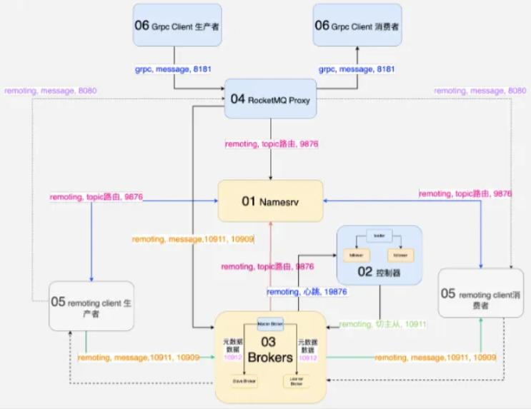

RocketMQ 5.x 版本的新特性涵盖了两个方面：首先，它增强了那些广受用户关注并频繁使用的核心功能，这些功能在实际应用中发挥着至关重要的作用；其次，该版本还引入了一系列全新的功能特性，这些新功能将进一步丰富 RocketMQ 的应用场景，并提升其在消息流处理中的性能和效率。

### RocketMQ 5.x Arch
RocketMQ 5.x 的架构相较于 4.x 有了显著的变化，新增了几个关键组件，使得整个系统更加完善和高效。在部署 RocketMQ 时，我们会按照一定的顺序进行：首先是 Namesrv、控制器、Broker，然后是 Proxy，最后是生产消费环节。

在生产消费环节中，有两种类型的客户端：一种是基于 TCP 的生产者，通常使用 Remoting 协议，这是 4.x 版本常用的客户端；另一种则是 gRPC 客户端，在代码仓库中被称为 RocketMQ Clients。这些客户端通过不同的协议和端口与各个组件进行通信。

以 Namesrv 和 Broker 之间的通信为例，当 Namesrv 启动后，它会提供一个注册服务。接着，在启动 Broker 时， Broker 会根据配置的 Namesrv 地址将自己的心跳信息上报给 Namesrv。这个过程中，Broker 会使用 Remoting 协议通过 9876 端口将 Topic 的路由信息上报给 Namesrv。同时，如果存在控制器，Broker 还会通过 19876 端口向控制器上报状态信息，以便在主从切换时进行管理。

在 RocketMQ 4.x 中，生产者在发送消息前会先通过 Namesrv 获取路由信息，然后根据这些信息将消息发送给相应的 Broker。同样地，消费者在消费消息时也会先从 Namesrv 获取路由信息，然后再根据这些信息从指定的 Broker 中拉取消息进行消费。这种机制确保了消息能够准确、高效地传输到目标 Broker 并被正确消费。

RocketMQ 5.x 与 4.x 之间的一个显著差异在于客户端的变化。在 5.x 版本中，客户端采用了 gRPC 通信方式，与 4.x 的客户端相比，它不再持有路由信息。这种改变简化了客户端的角色和责任。

当 gRPC 客户端需要发送消息时，它会直接发送一个 RPC 请求给 Proxy 组件。在这个过程中，Proxy 扮演了之前 Remoting Client 的角色。Proxy 会负责先去 Namesrv 上获取 Topic 的路由信息，然后根据这些信息决定将消息发送给哪个 Broker。这就是 5.x 版本中消息发送的过程。  

在消费消息时，过程也是类似的。gRPC 客户端通过发送 Pop 的 gRPC 请求给 Proxy 来请求消息。Proxy 在访问  Broker 时使用 Pop 协议，这种协议解决了之前 Push Consumer 可能遇到的消息堆积和卡住的问题。通过 Pop 协议，消费者可以更灵活地拉取和处理消息，提高了系统的整体性能和可靠性。

总的来说，RocketMQ 5.x 通过引入 gRPC 客户端和 Proxy 组件，以及使用 Pop 协议进行消费，实现了更高效、更灵活的消息处理机制。这些改进有助于提升系统的可扩展性、性能和用户体验。

### RocketMQ Proxy
RocketMQ 在 5.x 版本中引入了 Proxy 组件，这是其向云原生架构转型的初步尝试。Proxy 在系统中扮演了关键角色，负责处理客户端的连接、计算路由信息以及管理消息的续期等逻辑。

在这个新架构下，RocketMQ 的层次结构被划分为三层。最上层是用户层，负责消息的生产和消费。中间层是 Proxy 层，也被称为计算层。这一层主要负责处理客户端的连接请求，执行路由计算，以及处理消息的续期等关键逻辑。最下层是存储层，包括 Namesrv 和 Broker。Namesrv 仍然负责存储元数据，如 Topic 的路由信息和 Broker 的列表。而 Broker 则负责存储实际的消息数据、Consumer 队列以及索引等信息。

通过这种层次划分，RocketMQ 5.x 实现了更清晰、更灵活的系统架构。Proxy 层的引入不仅提升了系统的可扩展性和可维护性，还为用户提供了更便捷、更高效的消息处理体验。

RocketMQ Proxy 是一个专门为 RocketMQ 协议设计的代理服务。目前，它主要支持 gRPC 客户端的连接，并对 Remoting 协议提供了部分接口支持。通过引入计算层（即 Proxy 层），RocketMQ 在云环境中的优势变得更为明显。对于服务提供者来说，计算和存储资源可以根据实际需求进行灵活部署，并按需计费。这种灵活性不仅提高了资源的利用率，也使得客户能够更经济高效地使用 RocketMQ 服务。

#### 优势
RocketMQ Proxy 的优势非常显著，主要表现在以下几个方面：

首先，它实现了存算分离。这意味着存储和计算资源可以完全按需付费，为用户提供了更高的灵活性和成本效益。用户可以根据实际需求调整存储和计算资源的配比，从而更有效地利用资源并控制成本。

其次，RocketMQ Proxy 基于 gRPC 协议，支持多种编程语言的客户端，如 C++、Python、Go 等。这一特性极大地简化了不同技术栈用户的使用体验。在过去，Remoting 客户端需要针对不同语言进行单独实现，而社区版中 Remoting 客户端在各语言中的功能并不对等，Java 版本最为完整和稳定。然而，有了 Proxy 之后，各种语言的客户端逻辑都变得非常简单，本质上就是一个 RPC 客户端。这意味着一旦 RPC 客户端稳定下来，基本不需要改动代码，各种语言和技术栈的用户都可以方便地使用 RocketMQ。

最后，RocketMQ Proxy 有助于收敛云上的复杂性。在没有 Proxy 的情况下，用户需要直接访问 Namesrv 和 Broker，这涉及到复杂的网络配置和隔离问题。然而，有了 Proxy 之后，用户只需要与 Proxy 进行网络联通，无需关心内部细节。这种对内复杂、对外简单的设计理念使得客户看起来更简单，从而降低了整体复杂性。此外， Proxy 可以充当 HDP（Highly Distributed Platform）的角色，进一步简化了用户的接入过程。

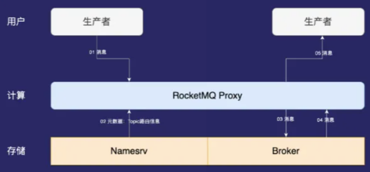

#### 功能预测
讲师对 Proxy 功能未来的发展做出了一些预测：  

+ 流量调度（灰度、迁移）

首先是流量调度，包括灰度发布和迁移。讲师认为，随着 Proxy 的功能越来越接近网关，它可能会承担起流量调度、灰度发布和迁移的任务。例如，在进行跨云多活部署时，如果某个云服务出现故障，我们需要能够迅速切换到其他服务。这就需要一个上层的调度组件来管理集群间的切换，而 Proxy 正是这个角色的理想选择。

+ Namesrv、Broker 故障切换

其次是 Namesrv 和 Broker 的故障切换。在正常的发布迭代过程中，当 Broker 出现 Bug 并修复后，我们需要进行灰度测试以确保新的版本没有问题。这时，就需要进行流量灰度，可以根据流量、用户等因素来进行。在 RocketMQ 中，Proxy 应该承担起这部分的责任，负责灰度策略的实施。

+ 统一鉴权

最后是统一鉴权。对于 RocketMQ 内部而言，Proxy、Namesrv 和 Broker 是紧密集成的，不需要进行鉴权。但是，对于外部客户来说，我们需要确保他们只能访问到他们被授权访问的数据。因此，未来 Proxy 可能会支持鉴权功能，以防止数据被错误地读取或泄露，从而保护我们的数据安全。

如果 Proxy 能够支持以上三个预测的功能，那么它的角色将更接近于一个全功能的网关，其功能将比现在更加强大和全面。

#### Pop messages
客户可能会遇到一些问题，比如当消费者卡住或不消费时，我们不清楚具体原因，业务也可能受到影响。在高峰期，重启消费者又怕触发 Rebalance 导致消息延迟，对业务造成不良影响。这种情况下，用户会质疑我们能否承担责任，处理起来非常棘手。Pop Consumer 的出现就是为了解决这些问题。  

在 Pop Consumer 模型中，假设有三个实例（即三个进程）属于相同的消费者组，每个实例都可以消费所有队列的消息。每个实例在拉取队列时都会进行加法运算，然后下一个实例再拉取下一个队列。这种模型与 Push 模型不同，Push 模型一旦分配好消费队列，比如 Consumer3 确定消费最后两个队列，在 Rebalance 之前它只能消费这两个队列。如果它卡住了或发生其他不明状况导致不消费，特别是在高峰期，重启会带来很大的困扰，容易造成消息延迟。这对于金融等对时间敏感的场景来说是不可接受的，因为交易慢一秒可能就意味着巨大的成本损失。

  

而 Pop Consumer 模型有一个 Retry 机制，与以前的机制略有不同。当所有 Pop 实例拉取消息时，会有一定的概率可以拉取到从事的消息（这里可能是指之前未处理成功的消息）。这个概率是通过一个随机数算法计算出来的，以确定何时可以拉取到 Pop 的从事消息。这样，即使某个实例卡住或不消费，其他实例仍有机会处理这些消息，从而保证了系统的可靠性和稳定性。

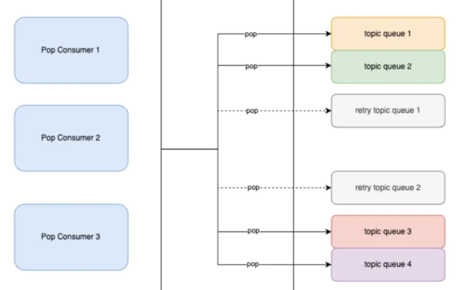

#### Pop and ack
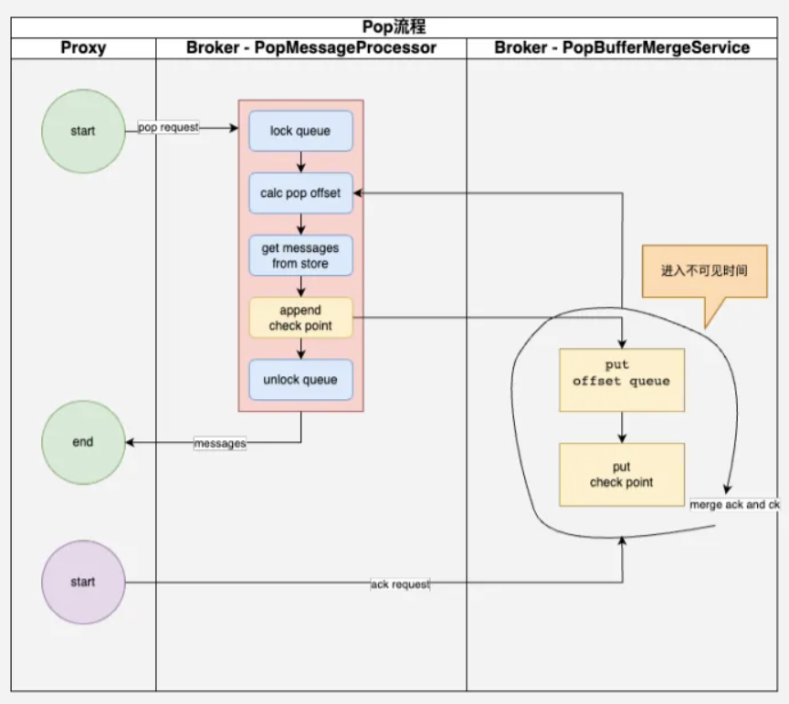

上面这个图展示了 Pop 消费在 Broker 端拉取消息以及进行 ACK 确认的整个过程。

整个过程从 gRPC 客户端发起请求开始，这个请求会先到达 Proxy。Proxy 接着会向 Broker 发送一个 Pop 请求。Broker 收到请求后的第一步是确定要拉取哪个 Queue，并将这个 Queue 锁定。锁定期间，其他 Pop 客户端或实例将无法拉取这个 Queue 的消息。

锁定 Queue 后，Broker 会根据当前的消费位点计算并决定从哪个位置开始拉取消息。确定位置后，Broker 会从 Committer 中拉取消息，并在此过程中写入一个 Check Point。这个 Check Point 非常重要，它记录了哪些位点的消息已经被拉取，用于后续的 ACK 确认。

拉取到的消息会进入一个不可见的时间段。这意味着，如果 Queue 被释放了，其他客户端或实例在拉取消息时会从上一批拉取的最后一条消息的下一条开始。这是因为当前这批消息已经处于不可见状态。

写完 Check Point 后，Broker 会释放锁定的 Queue，并将拉取到的消息进行包装后返回给 Proxy。Proxy 再通过 gRPC 将消息返回给客户端，完成整个 Pop 过程。

与 Push 过程相比，Pop 过程的不同之处在于它不会一直锁定 Queue。一旦 Queue 被释放，其他 Pop Consumer 实例就可以继续拉取并消费这个消息。这意味着，如果之前拉取某个 Queue 的 Pop 实例停止消费，其他实例可以接管并继续消费这个消息，避免了需要切换消费者或生产者的麻烦。

### ACK
当客户端消费完消息后，会触发一个 ACK 流程，这是确保消息被成功处理的关键步骤。ACK 主要分为两大步骤：

**生成 Checkpoint 与消息句柄**：在返回消息给客户端时，系统会生成一个 Checkpoint，这是一个记录消息处理进度的标记。同时，还会生成一个消息句柄，它是由 Broker Name、QID（队列 ID）和位点信息组合而成的一个字符串。这个句柄在 ACK 时会被客户端携带，用于在内存中匹配和确认消息。

**内存匹配与位点持久化**：当客户端发送 ACK 请求时，系统会在内存中进行匹配操作。这意味着，当客户端确认一条消息时，系统会检查这条消息是否与之前拉取的消息匹配。如果所有拉取的消息都被成功 ACK，那么 Checkpoint 对应的位点信息就会被持久化保存。这样，在下次拉取消息时，系统就会从这个持久化的位点开始，确保不会拉取到重复的消息。  

在某些情况下，比如客户端处理消息耗时较长，再来进行 ACK 时可能内存中已经没有相关数据了。为了处理这种情况，RocketMQ 会将 Checkpoint 的消息持久化到一个特定的 Topic 中，并定期重新消费这个 Topic 的消息来进行异步匹配。

Pop 和 ACK 的过程主要实现在 PopMessageProcessor  和 PopBufferMergeService 两个组件中。其中，MergeService 负责将 ACK 和 Checkpoint 消息进行匹配，并在所有消息都被 ACK 后更新消费的进度。

#### Pop 的优势
相比于 Push 模型，Pop 模型有以下优势：  

**客户端简单性**：由于 Pop 客户端基于 gRPC 实现，因此相对更简单。这种简单性有助于实现快速稳定，并减少客户端更新的需求。

**无状态性**：Pop 模型的无状态特性使得切换和升级更加容易实现。

**多语言生态支持**：利用 gRPC 的多语言支持能力，Pop 模型在生成不同语言的客户端时能够保持逻辑上的一致性。

#### 思考性问题
为什么 Pop 客户端会比较简单？答：因为它基于 gRPC 客户端实现，而 gRPC 客户端本身具有简单性。

Pop 是否可以替换 PULL，并集成到 Flink 等流平台中？答：这是一个值得探讨的问题。理论上，Pop 由于其无状态性和简单性，可能更适合某些流处理场景。然而，具体是否能替换 PULL 并集成到 Flink 等平台中，还需要考虑平台兼容性、性能需求以及业务需求等多方面因素。  

#### Delay Message
RocketMQ 5.x 中的延迟消息机制与 4.x 版本有所不同。在 4.x 版本中，延迟消息是通过一个固定的 Schedule_Topic_XXXX 来实现的，它默认支持最多 16 个队列。每个队列对应一个延迟级别，并且每个级别都有一个定时器（timer）与之关联。这些定时器会定时触发对应级别的延迟消息。当某个延迟级别的消息被触发后，系统会启动一个新的定时器来处理下一个延迟级别。然而，如果支持的队列数量过多，系统的负担会加重，可能会影响整体的稳定性。

在 4.x 版本中，延迟消息的处理过程是这样的：当延迟级别的消息被触发时，定时器中的一个报告服务（Report Service）会将该消息重新发送到正常的 Topic 中，这样用户就可以消费到这条消息了。但这种方式存在一些问题，比如系统负担过重和稳定性问题等。  

因此，在 RocketMQ 5.x 中，延迟消息的处理机制可能有所改进和优化，以解决 4.x 版本中存在的问题。

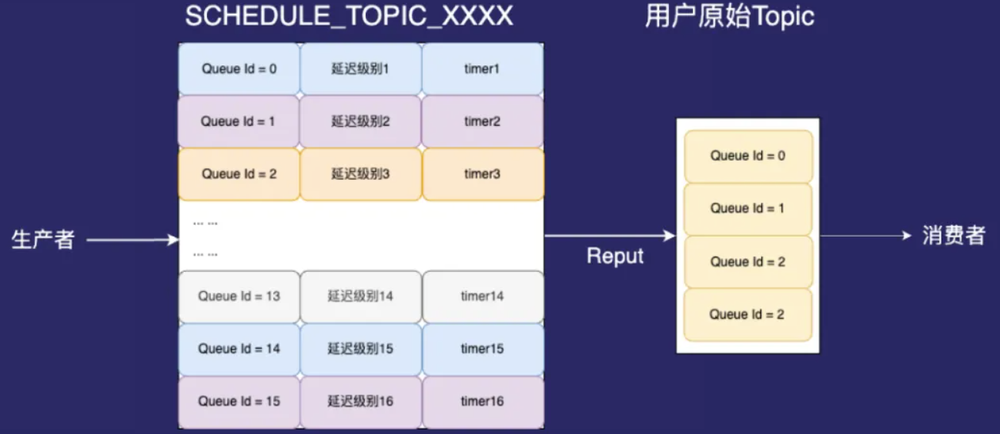  

#### Timer Message
在 RocketMQ 5.x 中，引入了任意维度的定时消息功能，这是一个重要的改进。需要注意的是，延迟消息和定时消息并不完全相同。在新版本中，定时消息（也被称作 Timer Message）是通过时间轮技术来实现的，这种技术能够更有效地处理和管理定时任务，提高了系统的性能和稳定性。  

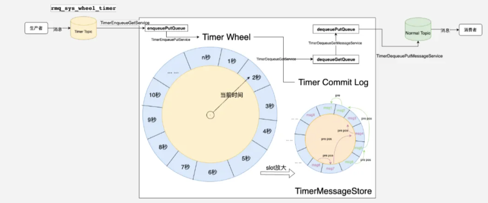

  

RocketMQ 5.x 引入了时间轮模型来实现任意维度的定时消息功能，这是一个重要的技术改进。时间轮主要由一些小格子组成，每个小格子代表一定的时间单位，在 5.x 中默认是每秒。这些格子就像时钟的刻度一样，随着时间推进而转动。每个格子，或者称为 Slot，对应一个定时消息的触发点。

  

当时间推进到某个特定的 Slot 时，系统会检查该 Slot 中是否有定时消息需要触发。这些消息被组织成一个链表，链表的每个节点都包含一条定时消息的相关信息。当时间到达链表中某个消息的定时点时，系统就会触发该消息。

  

为了高效处理这些定时消息，RocketMQ 5.x 使用了指针和链表的数据结构。每个 Slot 都有一个指针指向其对应的消息链表，这样系统就可以快速地找到并处理到期的定时消息。同时，RocketMQ 还使用了一个称为 Timer Commit Log 的机制来顺序存储这些定时消息，以确保消息的有序性和可靠性。

  

时间轮模型的好处在于它支持更大范围的定时消息，并且性能更好。与以前的模型相比，时间轮模型可以处理更多的定时消息，同时保持较高的处理效率。此外，由于时间轮是循环的，所以它可以支持超过 48 小时的定时消息。当时间超过 48 小时时，时间轮会回到起点并继续下一个周期。

  

在实现上，RocketMQ 5.x 通过异步线程池来处理消息的扭转和触发过程。当一条正常的消息进入系统时，它首先被发送到一个专门的 Timer Topic 中。然后，异步线程将消息转化为时间轮格式，并生成相应的 Timer Log 文件。接着，触发器服务会根据时间轮的当前位置来判断是否有定时消息需要触发，并根据 Slot 中的指针来找到并处理这些消息。

  

然而，需要注意的是，虽然 RocketMQ 5.x 支持了任意维度的定时消息功能，但目前并不支持未到期消息的取消操作。这意味着一旦一条定时消息被发送出去，就无法在到期之前撤销它。这是当前版本的一个限制，未来可能会考虑增加相关的功能来满足用户的需求。

  

另外，关于 4.x 版本的支持情况，目前社区上的新版本并不支持时间轮模型的任意延迟消息功能。但是，腾讯云上的 4.x 版本已经实现了基于时间轮的任意延迟消息支持，为用户提供了更多的选择和灵活性。

  

### 5.x 其他特性介绍
  

以下是关于 RocketMQ 从 4.8 到 5.0 版本的一些重要特性的简要解释：

  

+ **Dledger**：这是一个容器化的存储方案，作为第三方的 Commit Log 使用，并支持 Cloud Direct 协议的多副本功能，提供数据的冗余和可靠性。
+ **Dledger Controller**：这是 RocketMQ 5.x 引入的一个组件，用于控制和切换 Dledger 的组成，确保数据的一致性和高可用性。
+ **Request-reply**：类似于 gRPC 协议，它要求生产者在发送消息后必须等待消费者的确认。只有当消费者确认收到消息后，生产者才会继续发送下一条消息。这确保了消息的可靠传递，但可能会增加延迟。
+ **Broker Container**：这个特性允许用户在一个进程内运行多个 Broker 实例，这些实例可以相互备份，提高了系统的容错性和可扩展性。
+ **Logic Queue / Static Topic / Dynamic Topic**：逻辑队列是 RocketMQ 中的一个新概念，它同时支持静态 Topic 和动态 Topic。静态 Topic 的队列数量是固定的，而动态 Topic 的队列数量可以根据 Broker 的数量动态调整。这对于需要灵活扩展的系统非常有用。同时，逻辑队列对应的物理队列可以在不影响上层应用的情况下进行替换或调整。
+ **Light Message Queue**：轻量级队列设计用于解决大量 Topic 和源数据过大的问题。通过使用轻量级队列，可以减小源数据的大小，提高系统的处理效率。
+ **Compaction Topic**：这个特性主要针对计算平台，允许用户像存储普通 Topic 一样存储基于 KV 的状态数据。它提供了写快读慢的特性，使得随机读取更加方便。这对于需要维护状态的应用非常有用。
+ **MQTT (Millions Topic)**：RocketMQ 现在支持 MQTT 协议，这使得它能够处理数百万的 Topic 和队列，并支持数百万甚至上亿的设备连接。这对于物联网等需要处理大量设备数据的场景非常有用。
+ **gRPC Client**：RocketMQ 5.x 引入了 gRPC 客户端，提供了更多的通信选项和更好的跨平台支持。
+ **OT= Open Telemetry (prometheus, ot, log)**：这个特性主要关注可观测性，集成了日志、Metrics 和 Tracing 等功能，可以直接与 Prometheus 等监控系统集成，提供全面的系统监控和诊断能力。

  

## RocketMQ 上云实践
  

### 容器化实践
容器化本质上是为了解决交付的问题。交付在这里指的是进程管理，进程管理包含进程的运行以及进程运行时包含的资源等。进程管理是操作系统的一个核心功能，它涉及到对系统进程的控制，包括创建（Create）、读取（Read，通常指查看进程状态）、更新（Update，比如改变进程优先级）和删除（Delete）进程，类似 CRUD 操作。

容器技术，如 Docker 和 Kubernetes（K8s），提供了解决这些问题的工具和平台。

容器化：进程标准化

容器化解决了进程标准化的问题，因为只有标准化了以后，才能批量生  

### 标准化有哪些?
+ 进程和进程的生命周期

在 Kubernetes（K8s）中，进程的状态转换被重新定义和抽象化。如果我们将传统进程的状态转换视为一个简单的过程（如左图所示），那么 Kubernetes 则为这些状态转换提供了一个更加复杂但更加健壮的框架（如右图所示）。Kubernetes 追求的是“最终一致性”，这意味着当系统从一个状态向另一个状态转换时，它会持续进行调度和调整，直到最终达到预期的状态为止。这种机制确保了系统的稳定性和可靠性，即使在面临各种挑战和变化时也能保持一致性。

+ 进程管理  

当用户需要管理成千上万甚至数十万个进程时，传统的管理方式，如使用脚本或自己编写的插件或组件，并将其嵌入到虚拟机或容器中，可能会变得非常繁琐和复杂。然而，一旦 Kubernetes 成为管理这些进程的标准化工具，它就会提供一套统一且标准化的管理方式。通过 Kubernetes 的控制器和管理器，用户可以更加高效地管理和调度这些进程，从而简化管理流程并提高系统的可靠性和性能。

+ 进程资源隔离

Kubernetes 主要通过 Cgroups（控制组）来实现 CPU 和内存的隔离，确保每个容器都能获得其所需的计算资源，并且不会相互干扰。同时，在网络方面，Kubernetes 使用命名空间来进行标准化的隔离，确保每个容器的网络通信都是独立且安全的。这种隔离机制使得多个容器可以在同一台宿主机上高效、稳定地运行，而不会相互影响。

+ 跨 AZ，跨 Region 交付

利用 Kubernetes，用户可以轻松实现跨可用区（AZ）和跨区域的交付。只需为资源打上相应的标签（Tag）或（Label），或者添加一个亲和性策略，即可实现这一目的。这些亲和性策略还可以根据用户的实际需求进行自定义。这样的机制大大简化了跨地域部署和管理的复杂性。  

上图中右边的部分其实就是 Kubelet，K8S 对于进程状态的实现，Kubelet 的实现。当进程启动重新部署后，Kubelet 会帮用户自动的把这三个状态进行扭转，直到这个状态为最终态为止。

  

### 容器化：运行时标准化
+ 标准化分发包

容器化技术为软件分发提供了标准化的方式。在进程管理之前，应用程序及其所有依赖项会被打包成一个容器镜像。这种打包方式使得软件可以方便地分发给不同的客户，无论是私有云、公有云用户，还是其他类型的用户。因为容器镜像是标准化的，所以它们可以轻松地实现量产和部署。  

+ 标准化运行环境

除了分发包外，容器化技术还标准化了进程的运行环境。这意味着无论进程是否依赖于特定的系统库（如 SMD、library、SO 等）或 Java 的 JDK 等组件，容器都能提供一个一致的运行环境。  

在下图中，这种标准化运行环境主要分为两层：  

**静态层 - 镜像（Image）**：这一层包含了应用程序运行所需的所有静态依赖项。例如，Java 应用程序可能包含 JDK、阿尔萨斯调试工具等；C++ 或 Python 程序可能依赖于特定的库或第三方共享对象（SO）。这些依赖项都被标准化并封装在容器镜像中。镜像采用分层存储的方式，每一层都存储了不同的内容，最终为应用程序提供了一个完整的运行环境。

**动态层 - 容器（Container）**：当从镜像启动一个实例时，就创建了一个容器。这个容器是动态的，它包含了进程运行时所需的资源（如 CPU、内存）、持久化卷声明（PVC）、配置信息以及网络设置等。这些资源在进程启动并转化为容器时由容器运行时自动初始化。这种标准化的环境确保了无论在 Kubernetes 环境的哪个部分运行容器，其表现都是一致的。

通过这种方式，容器化技术大大简化了软件分发和部署的复杂性，同时确保了应用程序在不同环境中都能以一致和可靠的方式运行。

### 容器化其他优势
只有有了标准化的进程，标准化的运行环境和定义的进程生命周期之后，才能做到标准化和分发。这时候用户的扩容缩容运维才会更方便。

+ 快速扩容 / 缩容
+ 标准化运维
+ 多进程 HA，跨 AZ、跨 Region 交付更简单
+ 交付更快、更可靠

  

容器化：提高资源利用率

容器化通过标准化进程管理，使得用户可以轻松地同时管理多达 50 万个进程，这不仅简化了进程管理的复杂性，还提高了资源的利用率。然而，对于许多企业决策者来说，他们更关心的是容器化是否能够真正实现降本增效。

事实上，降本增效是一个包含两个方面的目标，而这两个目标往往难以同时实现。容器化主要贡献在于提高资源利用率。在传统的管理方式下，进程往往是散乱分布的，很难确保资源得到最大化利用。进程与进程之间可能存在较大的资源间隙。但是，通过 Kubernetes 的标准化管理，每个进程都可以根据实际需求进行资源申请。Kubernetes 使用 Cgroups 等技术对 CPU 和内存进行隔离，确保所有资源都在一个统一的资源池中进行分配。

这种资源池的方式意味着系统可以根据实际需求动态地分配资源，尽可能保持 CPU 利用率在 40% 或 50% 以上，从而提高整体资源利用率。这就像是在一个大家庭中共享食物和水源，每个人都可以按需取用，避免了浪费。  

然而，尽管容器化可以提高资源利用率，但它并不能直接降低成本。正如一位 Kubernetes 领域的大佬所说：“RocketMQ 就是一个人，容器化前吃喝多少，容器化后也会吃喝多少！”这意味着无论是否进行容器化，系统的总体资源消耗并不会减少。因此，我们不能期望通过容器化来直接降低成本。但是，通过提高资源利用率，企业可以更加高效地利用现有资源，从而间接地实现成本优化和效率提升。

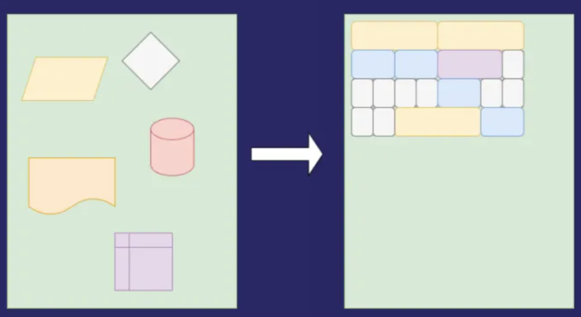

### RocketMQ 容器化需要重点关注哪些呢？
#### 容器化：选择容器平台
腾讯内部有多套容器化平台：TKE 标准版， TKE Serverless 等，都是久经考验的，稳定可靠。腾讯云 RocketMQ 是基于 TKE Serverless 容器平台打造。

TKE Serverless 是腾讯云推出的无须用户购买节点即可部署工作负载的服务模式，集群完全兼容原生 Kubernetes，支持使用原生方式购买及管理资源，按照容器真实使用的资源量计费。TKE Serverless 集群还扩展支持腾讯云的存储及网络等产品，同时确保用户容器的安全隔离，开箱即用。

  

在 RocketMQ 容器化选择容器平台时，主要考虑

+ 是否需要备货

TKE Serverless 无需备货。货源在大池子里，无需购买 Node 添加到容器平台，大池子货源相对充足。当然也能提高大池子资源利用率。  

+ 按使用量付费，不浪费 CPU、Mem
+ 支持固定 IP
+ 在 Pod 重启前后，Pod IP 保持不变。
+ 支持 VPC-CNI（IP 打平）

#### 容器化：复杂的网络
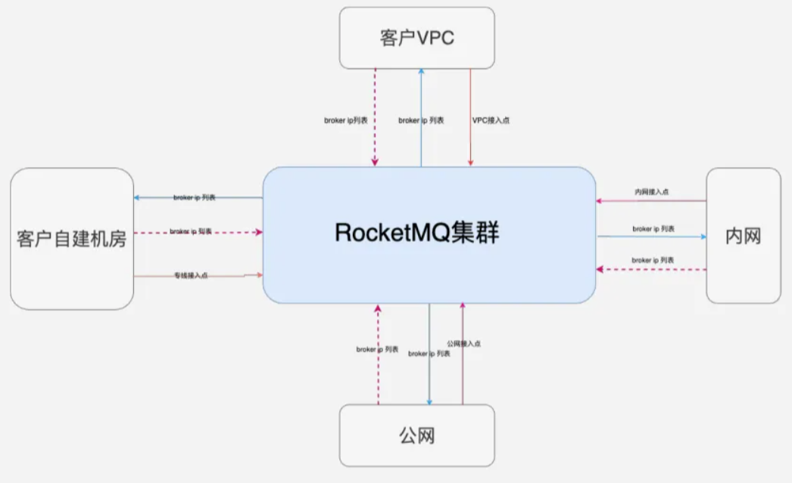

容器化网络之所以复杂，原因在于同一个 RocketMQ 集群需要为多种场景提供服务。这些场景可能包括位于腾讯不同 VPC（虚拟私有云）内的服务、公网上的服务、开发调试环境、办公环境，甚至是位于客户自建机房或其他云服务提供商的服务。每种场景的网络环境都各不相同，且彼此间可能并不直接相通。

当用户尝试访问 RocketMQ 集群时，他们通常首先从服务器获取路由信息，这些信息会返回一个 IP 列表，然后用户通过这个列表与 RocketMQ 集群进行交互。但是，难点在于如何让这同一套 RocketMQ 集群能够适应并

#### 容器化其他问题
1. 配置一致性问题

容器化 RocketMQ 时，配置文件可以通过 Config Map 下发。同时在不重启进程的前提下，也可以通过 Admin API 修改，两者需要保持数据一致。  

2. 存储问题

在重启前后，配置文件、数据文件所挂载的 PVC 需要保持不变。  

3. 公有云、私有化兼顾问题  

做资源层抽象，可以同时适配公有云和私有化的各种容器平台，甚至非容器平台。

  

4. Yaml 、 Helm Chart 、 Operator, 怎么选？

  

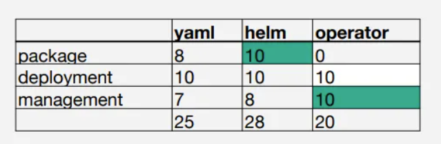

  

### 分层存储实践
#### 分层存储架构
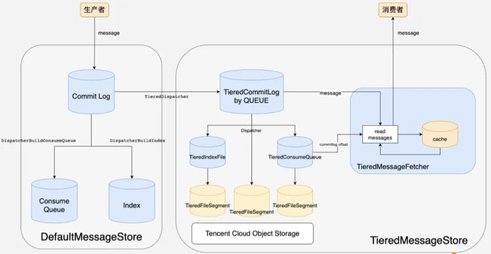

上图主要描述了两个分发过程：Commit log 的分发和分层存储的分发。

  

对于 Commit log 的分发，它与常规流程相同。当用户发送一条消息时，该消息会被写入 Commit log 中。随后，通过两个异步的 Dispatcher，系统会分发并构建 Consumer Queue 的索引和 Index 索引。

  

在 5.x 版本中，分层存储的实现是通过新增一个 Dispatcher 来实现的。这个新的 Dispatcher 会被注册到原有的 Dispatcher 中。当用户写入数据时，数据会异步地分发到分层存储的 Commit log 里。一旦数据被分发到这里，新的 Dispatcher 会负责将数据最终分发到 Index File 或 Consumer Queue 中。这些 Index File 和 Consumer Queue 的底层实际上是通过腾讯云上的对象存储来实现的。因此，文件会被存储在腾讯云的对象存储里。这个异步分发过程与 Commit log 的分发过程非常相似。

  

在生产过程中，数据会经历上述的分发和存储过程。而在消费过程中，系统会首先尝试从缓存中读取数据。如果缓存中的消息数量不足，系统会通过 Consumer Queue 和 Commit log 的 Offset 来定位并读取分层存储中的数据。主要的过程仍然涉及到 Dispatcher 和数据的读取。

  

简而言之，这段描述解释了在一个消息系统中，消息是如何被写入、分发、存储和读取的，特别是涉及到 Commit log 和分层存储的部分。

  

#### 分层存储优势
  

+ Topic TTL（自研支持，社区不支持）
+ 冷热数据分级存储
+ 真正海量、低成本存储

  

### 分布式限流实践
  

#### 分布式限流架构
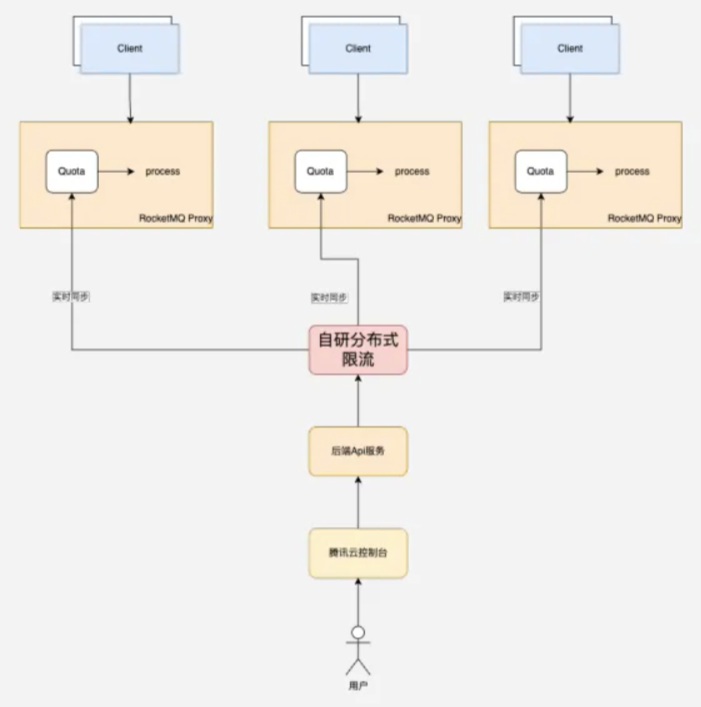

在 5.x 版本中，我们引入了分布式限流机制，这实际上是对集中限流的一种补充。在共享集群中，由于存在多租户隔离的需求，我们希望每个用户都能按照其购买的 TPS （每秒传输次数）进行使用，而不影响其他用户。因此，当用户超过其购买的 TPS 时，我们会对其进行限流，以确保整个系统的稳定性和公平性。

当然，在实施限流的同时，我们也会向用户发送告警信息，让他们知道当前的流量已经超过了限制，需要采取相应措施进行控制。

那么，为什么在 5.x 版本中需要引入分布式限流呢？这主要是因为 RocketMQ Proxy 在处理流量时存在一些热点问题。尽管 Proxy 现在是无状态的，但在处理客户端连接、消息生产和消费确认（ACK）时，仍然存在一定的局限性。具体来说，当一个客户端连接到某个 Proxy 进行消息生产或消费时，该 Proxy 会负责处理所有的 ACK 确认信息。这是因为只有该 Proxy 才能识别并处理相应的 Check Point 信息。因此，当某个 Proxy 上的消息流量过大时，其他 Proxy 无法有效地分担其压力。

  

为了解决这个问题，我们引入了分布式限流机制。在这个机制中，我们设置了一个集中的管理节点，负责定期向各个 Proxy 节点下发流量配额（Quota）。这样一来，即使某个 Proxy 节点上的流量过大，也能通过限流机制确保整个系统的稳定性和可用性。同时，这也使得其他 Proxy 节点能够在必要时提供一定的支持，从而更有效地利用系统资源。

  

#### 分布式限流特点
+ 限流类型：全局 or 本地。
+ 限流维度：标签键值对，客户端通过标签匹配规则。
+ 限流阈值：请求数 / 统计周期，如 1000/s。
+ 降级策略：当网络等原因导致请求 Server 失败时，降级为单机限流 or 直接放行。
+ 限流效果：快速失败 or 均匀排队。
+ 优先级：0-9 降序，适用多条规则匹配的场景，例如通配符和精确匹配。  

## 未来规划
未来，作者将继续致力于 RocketMQ 的社区布道工作，通过撰写技术文章、参与技术交流活动等方式，让更多开发者了解并熟悉 RocketMQ 4.x 及 5.x 版本的新特性，推动其在行业内的广泛应用。同时，作为公司与社区之间的桥梁，他将积极分享腾讯云上关于 RocketMQ 的实践经验和代码，将久经考验的技术成果回馈给社区，助力开源生态的繁荣发展。

在职业发展上，作者坚信稳定性是任何系统的基石，因此他将持续关注并提升 RocketMQ 在稳定性和可靠性方面的表现。此外，作者将始终坚持以用户价值为导向，深入了解用户的需求和痛点，通过技术创新和产品优化，为用户提供更加高效、便捷的消息流处理解决方案。值得一提的是，腾讯云 RocketMQ 5.x Serverless 版本已经上线，这一新版本将为用户带来更多便利和可能性，欢迎大家积极体验并提出宝贵意见。  

展望未来，期待与更多同行携手合作，共同推动 RocketMQ 在云原生消息流系统领域的发展，为企业的数字化转型提供强有力的技术支持。

  

## 总结
Apache RocketMQ 是一个可靠、高吞吐量、分布式的消息队列服务。腾讯云作为中国领先的云计算服务商之一，也大规模的提供了 Apache RocketMQ 服务。同时，腾讯云也对 Apache RocketMQ 进行了一系列优化和定制，以更好地适应公有云复杂的业务需求。在这个过程中，腾讯云也积累了大量的经验和技术，包括如何优化 Apache RocketMQ 的性能、如何提高其可靠性、如何进行监控和调优等方面。这些经验对于其他企业和开发者也具有很大的参考价值， 希望通过以上文章的深入剖析，能够为广大技术同行提供有益的参考和启示。

> 更新: 2025-03-17 19:25:32  
> 原文: <https://www.yuque.com/u12222632/as5rgl/bp7gytlxku2cdxtz>