# 亿级月活全民 K 歌 Feed 业务在腾讯云 MongoDB 中的应用及优化实践

# <font style="color:rgb(53, 53, 53);">业务背景及业务 MongoDb 规模</font>
<font style="color:rgb(48, 48, 48);">全民 K 歌作为腾讯音乐集团四大产品线之一，月活超过 1.5 亿，并不断推出新的音娱功能及新玩法，极大丰富了数亿用户的音乐娱乐活动。</font>

<font style="color:rgb(48, 48, 48);">MongoDb 天然支持高可用、分布式、高性能、高压缩、schema free、完善的客户端访问均衡策略等功能。作为腾讯音乐集体核心部门，K 歌 feed 业务采用腾讯云 MongoDb 作为主存储服务，极大的方便了 K 歌业务的快速迭代开发。</font>

<font style="color:rgb(48, 48, 48);">本文主要分享 K 歌技术演进过程中的一些踩坑过程、方案设计、性能优化等，主要包括以下技术点：</font>

+ **<font style="color:rgb(48, 48, 48);">全民 K 歌业务特性</font>**
+ **<font style="color:rgb(48, 48, 48);">Feed 业务读写选型</font>**
+ **<font style="color:rgb(48, 48, 48);">Feed 数据吐出控制策略优化</font>**
+ **<font style="color:rgb(48, 48, 48);">Feed 核心表设计</font>**
+ **<font style="color:rgb(48, 48, 48);">K 歌业务层面踩坑及优化过程</font>**
+ **<font style="color:rgb(48, 48, 48);">K 歌业务 MongoDb 使用踩坑及优化</font>**

**<font style="color:rgb(48, 48, 48);"></font>**

# <font style="color:rgb(53, 53, 53);">第一章：业务层面优化过程</font>
# <font style="color:rgb(53, 53, 53);">1.   腾讯音乐全民 K 歌业务特性</font>
<font style="color:rgb(48, 48, 48);">每一个社交产品，都离不开 Feed 流设计，在全民 K 歌的场景，需要解决以下主要问题：</font>

<font style="color:rgb(48, 48, 48);">1.      我们有一些千 w 粉丝，百万粉丝的用户，存在关系链扩散的性能挑战</font>

<font style="color:rgb(48, 48, 48);">2.      Feed 业务种类繁多，有复杂的业务策略来控制保证重要的 Feed 曝光</font>

<font style="color:rgb(48, 48, 48);"></font>

<font style="color:rgb(48, 48, 48);">对于 Feed 流的数据吐出，有种类繁多的控制策略，通过这些不同的控制策略来实现不通功能：</font>

<font style="color:rgb(48, 48, 48);">1.      大 v 曝光频控，避免刷流量的行为</font>

<font style="color:rgb(48, 48, 48);">2.      好友共同发布了一些互动玩法的 Feed，进行合并，避免刷屏</font>

<font style="color:rgb(48, 48, 48);">3.      支持不同分类 Feed 的检索</font>

<font style="color:rgb(48, 48, 48);">4.      安全问题需要过滤掉的用户 Feed</font>

<font style="color:rgb(48, 48, 48);">5.      推荐实时插流/混排</font>

<font style="color:rgb(48, 48, 48);">6.      低质量的 Feed，系统自动发类型的 Feed 做曝光频控</font>

# <font style="color:rgb(53, 53, 53);">2.   读写选型</font>
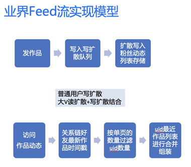

<font style="color:rgb(48, 48, 48);">Feed 主流实现模型主要分为 3 种，这些模型在业界都有大型产品在用：</font>

<font style="color:rgb(48, 48, 48);">1.      读扩散 （QQ 空间）</font>

<font style="color:rgb(48, 48, 48);">2.      写扩散 （微信朋友圈）</font>

<font style="color:rgb(48, 48, 48);">3.      大 v 读扩散+普通用户写扩散 （新浪微博）</font>

<font style="color:rgb(48, 48, 48);">  
</font>

<font style="color:rgb(48, 48, 48);">没有最好的模式，只有适合的架构，主要是权衡自己的业务模型，读写比，以及历史包袱和实现成本。</font>

<font style="color:rgb(48, 48, 48);">K 歌使用的是读扩散模型，使用读扩散模型的考虑如下：</font>

<font style="color:rgb(48, 48, 48);">1.      存在不少千万/百万粉丝的大 v，写扩散严重，推送延迟高，同时存储成本会高</font>

<font style="color:rgb(48, 48, 48);">2.      低活用户，流失用户推送浪费计算资源和存储资源</font>

<font style="color:rgb(48, 48, 48);">3.      安全合规相关的审核会引发大量写扩散</font>

<font style="color:rgb(48, 48, 48);">4.      写扩散 qps=3 x 读扩散 qps</font>

<font style="color:rgb(48, 48, 48);">5.      K 歌关系链导入的历史原因，早起写扩散成本高，同时后期改成读写扩散混合的模式改造成本大。</font>

<font style="color:rgb(51, 51, 51);"></font>

<font style="color:rgb(48, 48, 48);">但是读扩散模式存在以下比较明显的缺点：</font>

<font style="color:rgb(48, 48, 48);">1.      翻页把时间线前面的所有数据拉出来，性能开销越来越大，性能越来越差</font>

<font style="color:rgb(48, 48, 48);">2.      关注+好友数量可达万级别，实现全局的过滤，插流，合并，频控策略复杂，性能不足</font>

# <font style="color:rgb(53, 53, 53);">3. 读扩散优化</font>
<font style="color:rgb(48, 48, 48);">读扩散模型的存储数据主要分为 3 大块：</font>

+ <font style="color:rgb(48, 48, 48);">关系链</font>
+ <font style="color:rgb(48, 48, 48);">Feed 数据</font>
+ <font style="color:rgb(48, 48, 48);">最新更新时间戳。</font>

## <font style="color:rgb(53, 53, 53);">3.1. 优化背景</font>
<font style="color:rgb(48, 48, 48);">未优化前的关系链读扩散模型，每次拉取 Feed 数据的时候，都需要通过关系链，时间戳，以及 Feed 索引数据来读扩散构建候选结果集。最后根据具体的 Feedid 拉取 Feed 详情来构建结果进行返回。</font>

<font style="color:rgb(48, 48, 48);">对于首屏，如果一页为 10 条，通过关系链+最新时间戳过滤出最新的 20 个 uid（预拉多一些避免各种业务过滤合并策略把数据过滤完了），然后拉取每个 uid 最新的 60 条 Feed 的简单的索引信息来构建候选集合，通过各种业务合并过滤策略来构建最多 10 条最新 Feedid，再拉取 Feed 详细信息构建响应结果。</font>

<font style="color:rgb(48, 48, 48);">翻页的时候把上一次返回的数据的最小时间戳 basetime 带过来，然后需要把 basetime 之前的有发布 Feed 的 uid 以及 basetime 之后有发布的最近 20 个 uid 过滤出来，重复上面构建候选集合的过程来输出这一页的数据。这种实现逻辑翻页会越来越慢，延迟不稳定。</font>

## <font style="color:rgb(53, 53, 53);">3.2. 优化过程</font>
<font style="color:rgb(48, 48, 48);">针对以上问题，所以我们在读扩散模型上进行了一些优化，优化架构图如下：</font>

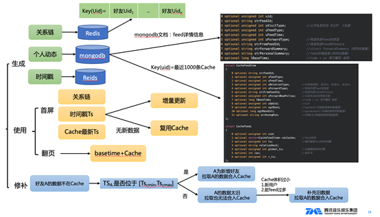

<font style="color:rgb(48, 48, 48);">我们通过读扩散结果的 Cache 模式，解决翻页越来越慢，复杂的全局过滤逻辑。</font>

**<font style="color:rgb(51, 51, 51);">Cahce 优势</font>**

+ <font style="color:rgb(48, 48, 48);">灵活过滤，实现复杂的过滤合并逻辑</font>
+ <font style="color:rgb(48, 48, 48);">翻页读 Cache 性能高，首页使用 Cache 避免重复计算</font>

**<font style="color:rgb(51, 51, 51);">时间线 Cache 需要解决的问题？弊端？</font>**

+ <font style="color:rgb(48, 48, 48);">关系链变更 Cache 有延迟</font>
+ <font style="color:rgb(48, 48, 48);">脏 Feed 导致 Cache 体积减小</font>

<font style="color:rgb(51, 51, 51);"></font>

<font style="color:rgb(48, 48, 48);">此外，我们把 Cache 主要分为全量生成过程，增量更新过程，以及修补逻辑三部分来解决这些问题：</font>

+ <font style="color:rgb(48, 48, 48);">全量是在首次拉取，和 24 小时定时更新</font>
+ <font style="color:rgb(48, 48, 48);">增量则是在首页刷新，无最新数据则复用 Cache</font>
+ <font style="color:rgb(48, 48, 48);">通过缓存关系链，如果关系链变更，活脏 Feed 太多过滤后导致的 Cache 体积过小，则触发修补逻辑。</font>

<font style="color:rgb(48, 48, 48);"></font>

<font style="color:rgb(48, 48, 48);">最终，通过这些策略，让我们的 Feed 流系统也具备了写扩散的一些优势，主要优势如下：</font>

+ <font style="color:rgb(48, 48, 48);">减少重复计算</font>
+ <font style="color:rgb(51, 51, 51);">有全局的 Feed 视图，方便实现全局策略</font>

# <font style="color:rgb(53, 53, 53);">4. 主要表设计</font>
## <font style="color:rgb(53, 53, 53);">4.1. Feed 表设计</font>
<font style="color:rgb(48, 48, 48);">Feed 这里的设计建立了 2 个表：</font>

+ **<font style="color:rgb(51, 51, 51);">一个是 Feed 详情表</font>**

<font style="color:rgb(48, 48, 48);">该表使用用户 userid 做片健，Feedid 做唯一健，表核心字段如下：</font>

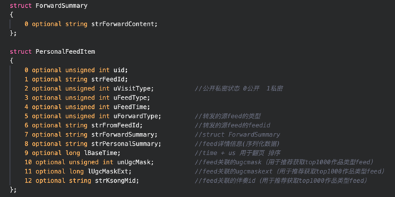

+ **<font style="color:rgb(51, 51, 51);">Feed Cache 表</font>**

<font style="color:rgb(48, 48, 48);">该表使用 uid 做片健和唯一健，并且做 ttl，表核心字段如下：</font>

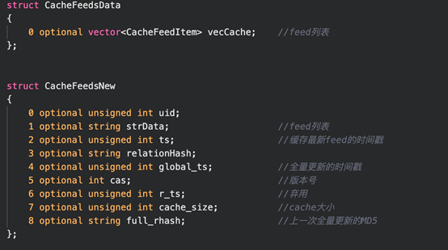

<font style="color:rgb(48, 48, 48);">FeedCache 是一个 kv 存储的文档，k 是 uid，value 是 CacheFeedData jce 序列化后的结果。为了避免 TTL 删除数据消耗线上业务性能：可以在写入数据时指定过期时间。过期时间直接配置成业务低峰期时段</font>

## <font style="color:rgb(53, 53, 53);">4.2. 账号关系表设计</font>
<font style="color:rgb(48, 48, 48);">关注关系链常规涉及两个维度的数据：</font>

<font style="color:rgb(48, 48, 48);">一个关注，一个粉丝 (一个关注动作会产生两个维度数据)。</font>

+ **<font style="color:rgb(51, 51, 51);">关注列表</font>**

<font style="color:rgb(48, 48, 48);">关注一般不是很多，最多一般只有几千，经常会被全部拉出来，这个可以存储为 kv 的方式（高性能可以考虑内存型数据库或 cache)。</font>

<font style="color:rgb(48, 48, 48);">关注是用 Redis 存储的，一个 key 对应的 value 是上面 RightCache 这个结构的 jce 序列化后的结果。</font>

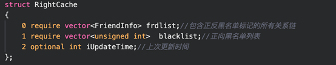

<font style="color:rgb(48, 48, 48);">  
</font>

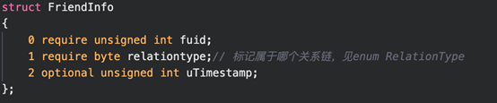

+ **<font style="color:rgb(51, 51, 51);">粉丝</font>**

<font style="color:rgb(48, 48, 48);">粉丝是一个长列表(几百万甚至上千万)，一般会以列表展示，存储与 mongodb 中，以用户 id 为片健, 每个粉丝作为一个单独的 doc，使用内存型的存储内存碎片的损耗比较高，内存成本大。关注和粉丝数据可以使用消息队列来实现最终一致性。</font>

<font style="color:rgb(48, 48, 48);">粉丝数据按照 MongoDb 文档存储，主要包含以下字段：opuid，fuid，realtiontype，time。</font>

<font style="color:rgb(48, 48, 48);"></font>

# <font style="color:rgb(53, 53, 53);">第二章：MongoDb 使用层面优化</font>
<font style="color:rgb(48, 48, 48);">该业务 mongodb 部署架构图如下：</font>

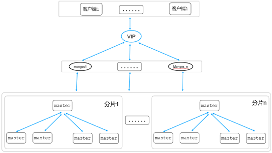

<font style="color:rgb(48, 48, 48);">K 歌业务 MongoDb 架构图：客户端通过腾讯云 VIP 转发到代理 mongos 层，代理 mongos 接受到请求后，从 config server(存储路由信息，架构图中未体现)获取路由信息，然后根据这条路由信息获取转发规则，最终转发该请求到对应的存储层分片。</font>

<font style="color:rgb(48, 48, 48);">在业务上线开发过程中，发现 MongoDb 使用的一些不合理，通过对这些不合理的使用方式优化，提升了访问 MongoDb 的性能，最终提升了整个 Feed 流系统用户体验。K 歌业务 MongoDb 访问主要优化点如下：</font>

# <font style="color:rgb(53, 53, 53);">1. 最优片建及分片方式选择</font>
<font style="color:rgb(48, 48, 48);">前面提到信息流业务 Feed 详情表、粉丝列表存储在 MongoDb 中，两个表都采用用户 userId 来做分片片建，分片方式采用 hashed 分片，并且提前进行预分片：</font>

<font style="color:rgb(48, 48, 48);">sh.shardCollection("xx.follower", {userId:"hashed"}, false, { numInitialChunks: 8192*分片数} )</font>

<font style="color:rgb(48, 48, 48);">sh.shardCollection("xx.FeedInfo", {FeedId:"hashed"}, false, { numInitialChunks: 8192*分片数} )</font>

<font style="color:rgb(48, 48, 48);">两个表分别选择 FeedId 和 userId 做片建，并且采用 hashed 分片方式，同时提前对表做预分片操作，主要基于以下方面考虑：</font>

+ **<font style="color:rgb(51, 51, 51);">数据写</font>**

<font style="color:rgb(48, 48, 48);">通过提前预分片并且采用 hashed 分片方式，可以保证数据均衡的写入到不同分片，避免数据不均引起的 moveChunk 操作，充分利用了每个分片的存储能力，实现写入性能的最大化。</font>

+ **<font style="color:rgb(51, 51, 51);">数据读</font>**

<font style="color:rgb(48, 48, 48);">通过 FeedId 查询某条 Feed 详情和通过 userId 查询该用户的粉丝列表信息，由于采用 hashed 分片方式，同一个 Id 值对应的 hash 计算值会落在同一个 shard 分片，这样可以保证整个查询的效率最高。</font>

<font style="color:rgb(48, 48, 48);">  
</font>

**<font style="color:rgb(48, 48, 48);">说明：</font>**

<font style="color:rgb(48, 48, 48);">由于查询都是指定 id 类型查询，因此可以保证从同一个 shard 读取数据，实现了读取性能的最大化。但是，如果查询是例如 FeedId 类的范围查询，例如 db.FeedInfo.find({FeedId:{$gt: 1000，$lt:2000}})，这种场景就不适合用 hashed 分片方式，因为满足{$gt: 1000}条件的数据可能很多条，通过 hash 计算后，这些数据会散列到多个分片，这种场景范围分片会更好，一个范围内的数据可能落到同一个分片。所以，分片集群片建选择、分片方式对整个集群读写性能起着非常重要的核心作用，需要根据业务的实际情况进行选择。</font>

<font style="color:rgb(48, 48, 48);">K 歌 feed 业务都是根据 feedId、userId 进行查询，不存在范围查询，因此选用 hash 预分片方式进行片建设置，这样可以最大化提升查询、写入功能。</font>

# <font style="color:rgb(53, 53, 53);">2. 查询不带片建如何优化</font>
<font style="color:rgb(48, 48, 48);">上一节提到，查询如果带上片建，可以保证数据落在同一个 shard，这样可以实现读性能的最大化。但是，实际业务场景中，一个业务访问同一个表，有些请求可以带上片建字段，有些查询没有片建，这部分不带片建的查询需要广播到多个 shard，然后 mongos 聚合后返回客户端，这类不带片建的查询效率相比从同一个 shard 获取数据性能会差很多。</font>

<font style="color:rgb(48, 48, 48);">如果集群分片数比较多，某个不带片建的查询 SQL 频率很高，为了提升查询性能，可以通过建立辅助索引表来规避解决该问题。以 Feed 详情表为例，该表片建为用户 userId，如果用户想看自己发表过的所有 Feed，查询条件只要带上 userId 即可。</font>

<font style="color:rgb(48, 48, 48);">但是，如果需要 FeedId 获取指定某条 Feed 则需要进行查询的广播操作，因为 Feed 详情表片建为 userId，这时候性能会受影响。不带片建查询不仅仅影响查询性能，还有加重每个分片的系统负载，因此可以通过增加辅助索引表(假设表名：FeedId_userId_relationship)的方式来解决该问题。辅助表中每个 doc 文档主要包含 2 个字段：</font>

+ **<font style="color:rgb(51, 51, 51);">FeedId 字段</font>**

<font style="color:rgb(48, 48, 48);">该字段和详情表的 FeedId 一致，代表具体的一条 Feed 详情。</font>

+ **<font style="color:rgb(51, 51, 51);">UserId</font>**

<font style="color:rgb(48, 48, 48);">该字段和详情表 userId 一致，代表该 FeedId 对应的这条 Feed 详情信息由该 user 发起。</font>

<font style="color:rgb(48, 48, 48);">FeedId_userId_relationship 辅助表采用 FeedId 做为片建，同样采用前面提到的预分片功能，该表和 Feed 详情表的隐射关系如下：</font>

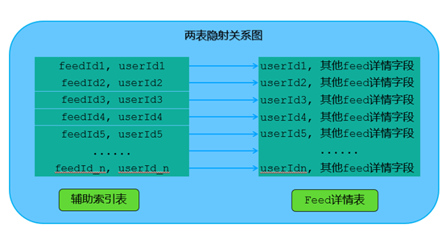

<font style="color:rgb(48, 48, 48);">如上图，通过某个 FeedId 查询具体 Feed，首先根据 FeedId 从辅助索引表中查找该 FeedId 对应的 userId，然后根据查询到的 userId+FeedId 的组合获取对应的详情信息。整个查询过程需要查两个表，查询语句如下：</font>

```plain
//FeedId_userId_relationship表分片片建为FeedId，提前hashed预分片  
db.FeedId_userId_relationship.find({“FeedId”: “375”},  {userId:1}) //假设返回的userId为”3567”  
//FeedInfo表分片片建为userId，提前hashed预分片  
db.FeedInfo.find({“userId”: “3567”})  

```

<font style="color:rgb(48, 48, 48);">如上，通过引入辅助索引表，最终解决跨分片广播问题。引入辅助表会增加一定的存储成本，同时会增加一次辅助查询，一般只有在分片 shard 比较多，并且不带片建的查询比较频繁的情况使用。</font>

# <font style="color:rgb(53, 53, 53);">3. count 慢操作优化</font>
<font style="color:rgb(48, 48, 48);">前面提到，粉丝关系表存在 MongoDb 中，每条数据主要包含几个字段，用户的每个粉丝对应一条 MongoDb 文档数据，对应数据内容如下：</font>

```plain
	{ "_id" : ObjectId("6176647d2b18266890bb7c63"), "userid" : “345”, "follow_userid" : “3333”, "realtiontype" : 3, "follow_time" : ISODate("2017-06-12T11:26:26Z") }   
```

<font style="color:rgb(48, 48, 48);">一个用户的每个粉丝对应一条数据，如果需要查找某个用户下面拥有多少个粉丝，则通过下面的查询获取(例如查找用户 id 为”345”的用户的粉丝总数)：</font>

<font style="color:rgb(48, 48, 48);">db.fans.count({"userid" : “345”})</font>

<font style="color:rgb(48, 48, 48);">该查询对应执行计划如下：</font>

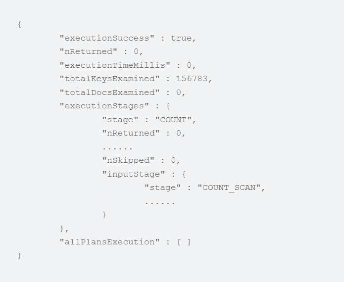

<font style="color:rgb(48, 48, 48);">和其他关系型数据库(例如 mysql)类似，从上面的执行计划可以看出，对某个表按照某个条件求 count，走最优索引情况下，其快慢主要和满足条件的数据量多少成正比关系。例如该用户如果粉丝数量越多，则其扫描的 keys(也就是索引表)会越多，因此其查询也会越慢。</font>

<font style="color:rgb(48, 48, 48);">从上面的分析可以看出，如果某个用户粉丝很多，则其 count 性能会很慢。因此，我们可以使用一个幂等性计算的计数来存储粉丝总数和关注总数，这个数据访问量比较高，可以使用高性能的存储，例如 Redis 的来存储。幂等性的计算可以使用 Redis 的 lua 脚本来保证。</font>

<font style="color:rgb(48, 48, 48);">优化办法：粉丝数量是一个 Redis 的 key，用 lua 脚本执行（计数 key incrby 操作与 opuid_touid_op 做 key 的 setnx expire）来完成幂等性计算。</font>

# <font style="color:rgb(53, 53, 53);">4. 写大多数优化</font>
<font style="color:rgb(48, 48, 48);">写入数据可以根据业务的数据可靠性来选择不同的 writeConcern 策略：</font>

<font style="color:rgb(48, 48, 48);">{w: 0} ：对客户端的写入不需要发送任何确认。场景：性能要求高；不关注数据完整性</font>

<font style="color:rgb(48, 48, 48);">{w: 1}：默认的 writeConcern，数据写入到 Primary 就向客户端发送确认。场景：兼顾性能与一定层度得数据可靠性。</font>

<font style="color:rgb(48, 48, 48);">{w: “majority”}：数据写入到副本集大多数成员后向客户端发送确认。场景：数据完整性要求比较高、避免数据回滚场景，该选项会降低写入性能</font>

<font style="color:rgb(48, 48, 48);">对于数据可靠性要求比较高的场景往往还会使用{j: true}选项来保证写入时 journal 日志持久化之后才返回给客户端确认。数据可靠性高的场景会降低写的性能，在 K 歌 Feed 业务使用初期的场景会发现写大多数的场景都写延迟不太稳定，核心业务都出现了这种情况，从 5ms 到 1s 抖动。通过分析定位，我们发现是写时候到链式复制到策略导致的。</font>

<font style="color:rgb(48, 48, 48);">链式复制的概念：假设节点 A(primary)、B 节点(secondary)、C 节点(secondary)，如果 B 节点从 A 节点同步数据，C 节点从 B 节点同步数据，这样 A->B->C 之间就形成了一个链式的同步结构，如下图所示：</font>

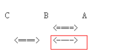

<font style="color:rgb(48, 48, 48);">  
</font>

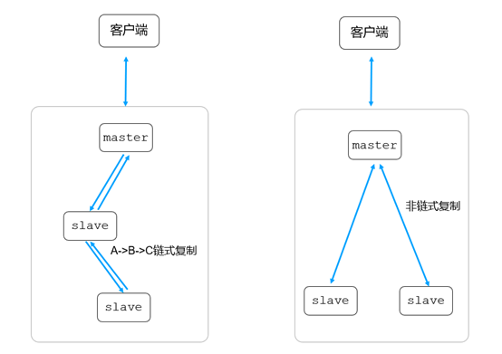

<font style="color:rgb(48, 48, 48);">mongodb 多节点副本集可以支持链式复制，可以通过如下命令获取当前副本集是否支持链式复制：</font>

```plain
cmgo-xx:SECONDARY> rs.conf().settings.chainingAllowed  
true  
cmgo-xx:SECONDARY>   

```

<font style="color:rgb(51, 51, 51);">此外，可以通过查看副本集中每个节点的同步源来判断当前副本集节点中是否存在有链式复制情况，如果同步源为 secondary 从节点，则说明副本集中存在链式复制，具体查看如下副本集参数：</font>

```plain
cmgo-xx:SECONDARY> rs.status().syncSourceHost  
xx.xx.xx.xx:7021  
cmgo-xx:SECONDARY>   
```

<font style="color:rgb(51, 51, 51);">由于业务配置为写多数派，鉴于性能考虑可以关闭链式复制功能，mongodb 可以通过如下命令操作进行关闭：</font>

```plain
cfg = rs.config()  
cfg.settings.chainingAllowed = false
rs.reconfig(cfg)  

```

**<font style="color:rgb(48, 48, 48);">链式复制好处：</font>**<font style="color:rgb(48, 48, 48);">可以大大减轻主节点同步 oplog 的压力。</font>

**<font style="color:rgb(48, 48, 48);">链式复制不足：</font>**<font style="color:rgb(48, 48, 48);">当写策略为 majority 时，写请求的耗时变大</font>

<font style="color:rgb(48, 48, 48);">当业务采用“写大多数”策略时，也相应的关闭链式复制；避免写请求耗时变大。我们关闭了链式复制后整体写延迟文档在 10ms 以内。</font>

# <font style="color:rgb(53, 53, 53);">5. 海量 qps 业务抖动优化</font>
<font style="color:rgb(51, 51, 51);"></font><font style="color:rgb(48, 48, 48);">在一些核心集群，我们发现在高峰期偶尔会慢查询变多，服务抖动，抖动的表象看起来是因为个别 CPU 飙升导致的，通过分析具体高 CPU 的线程，以及 perf 性能分析具体的函数，我们发现主要是两个问题：</font>

<font style="color:rgb(48, 48, 48);">1、高峰期连接数量陡涨，连接认证开销过大，导致的 CPU 飙升</font>

<font style="color:rgb(48, 48, 48);">2、WT 存储引擎 cache 使用率及脏数据比例太高，MongoDb 的用户线程阻塞进行脏数据清理，最终业务侧抖动。</font>

<font style="color:rgb(48, 48, 48);">为了优化这两个问题，我们通过优化 MongoDb 的配置参数来解决</font>

<font style="color:rgb(48, 48, 48);">1、MongoDb 连接池上下限一致，减少建立连接的开销</font>

<font style="color:rgb(48, 48, 48);">2、提前触发内存清理 eviction_target=60 ，用户线程参与内存清理的触发值提高到 97%：eviction_trigger=97，增加更多的清理线程：evict.threads_max：20，从而减少高峰期慢查询 150k/min=>20k/min，服务稳定性也的到了提升。</font>

<font style="color:rgb(48, 48, 48);">优化后效果如图：</font>

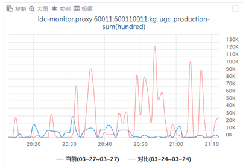

<font style="color:rgb(48, 48, 48);">  
</font>

# <font style="color:rgb(53, 53, 53);">6. 数据备份过程业务抖动优化</font>
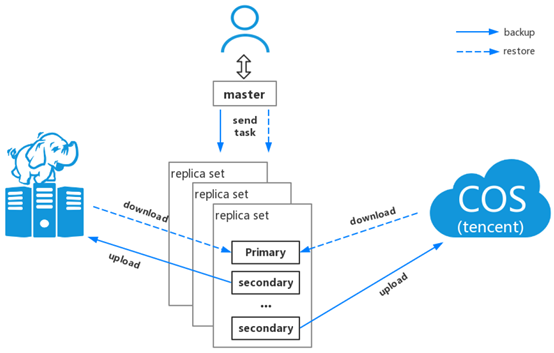

<font style="color:rgb(48, 48, 48);">腾讯云 MongoDb 默认凌晨会定期对集群数据做全量备份和增量备份，并支持默认 7 天内的任意时间点回档。但是，随着集群数据量逐渐的增加，当前该集群数据量已经比较大，开始出现凌晨集群定期抖动，主要现象如下：</font>

<font style="color:rgb(48, 48, 48);">1.      访问时延增加</font>

<font style="color:rgb(48, 48, 48);">2.      慢日志增加</font>

<font style="color:rgb(48, 48, 48);">3.      CPU 使用率增加</font>

<font style="color:rgb(48, 48, 48);">通过分析，发现问题和数据备份时间点一致，由于物理备份和逻辑备份期间需要对整实例进行数据备份，系统资源负载增加，最终影响业务查询服务。</font>

<font style="color:rgb(48, 48, 48);">优化方式：数据备份期间隐藏节点，确保该节点对客户端不可见。</font>

<font style="color:rgb(48, 48, 48);"></font>

<font style="color:rgb(48, 48, 48);">关于作者</font>

<font style="color:rgb(48, 48, 48);">全民 K 歌后台开发一组：</font>

<font style="color:rgb(48, 48, 48);">       ctychen，ianxiong</font>

<font style="color:rgb(48, 48, 48);">腾讯云 mongodb：</font>

<font style="color:rgb(48, 48, 48);">       腾讯云 MongoDB 当前服务于游戏、电商、社交、教育、新闻资讯、金融、物联网、软件服务等多个行业；MongoDB 团队(简称 CMongo)致力于对开源 MongoDb 内核进行深度研究及持续性优化(如百万库表、物理备份、免密、审计等)，为用户提供高性能、低成本、高可用性的安全数据库存储服务。后续持续分享 MongoDb 在腾讯内部及外部的典型应用场景、踩坑案例、性能优化、内核模块化分析。</font>


> 更新: 2025-03-17 16:33:53  
> 原文: <https://www.yuque.com/u12222632/as5rgl/izt2mxruovszg3fo>