# 从一个事故中理解Redis（几乎）所有知识点

作者从一个事故中总结了Redis（几乎）所有的知识点，供大家学习。

简单回顾

事故回溯总结一句话：

（1）因为大KEY调用量，随着白天自然流量趋势增长而增长，最终在业务高峰最高点期占满带宽使用100%。

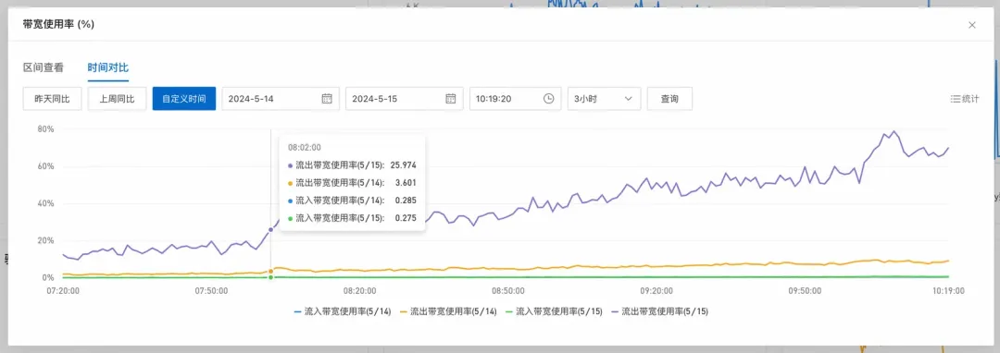

（2）从而引发redis的内存使用率，在5min之内从0%->100%。

（3）最终全面GET SET timeout崩溃（11点22分02秒）。

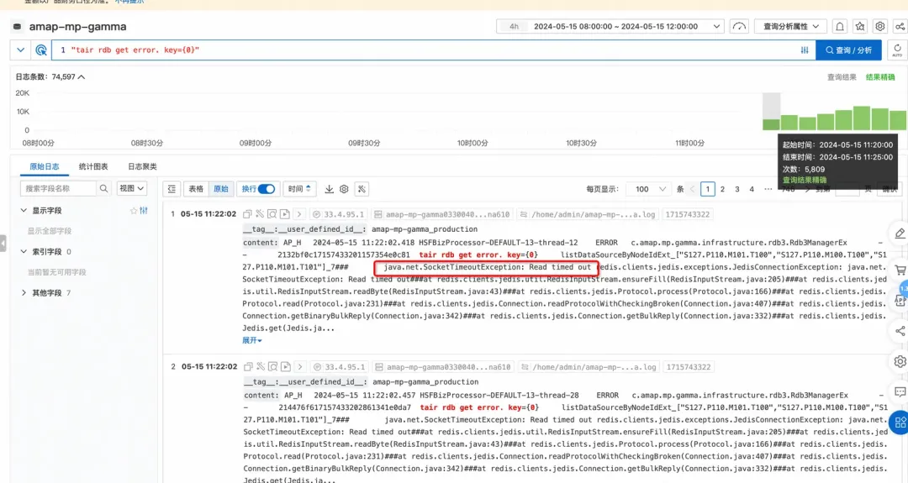

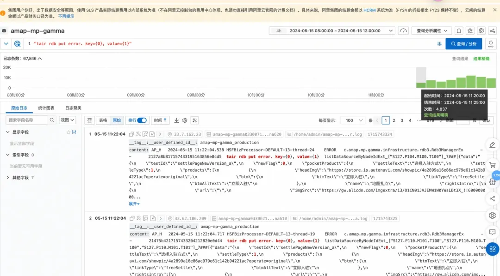

（4）最终导致页面返回timeout。

  

**未解之谜**

### 疑问点：内存使用率100% 就等同于redis不可用吗？
#### **解答：正常使用情况下，不是。**
redis有【缓存淘汰机制】，Redis 在内存使用率达到 100% 时不会直接崩溃。相反，它依赖内存淘汰策略来释放内存，确保系统的稳定性。

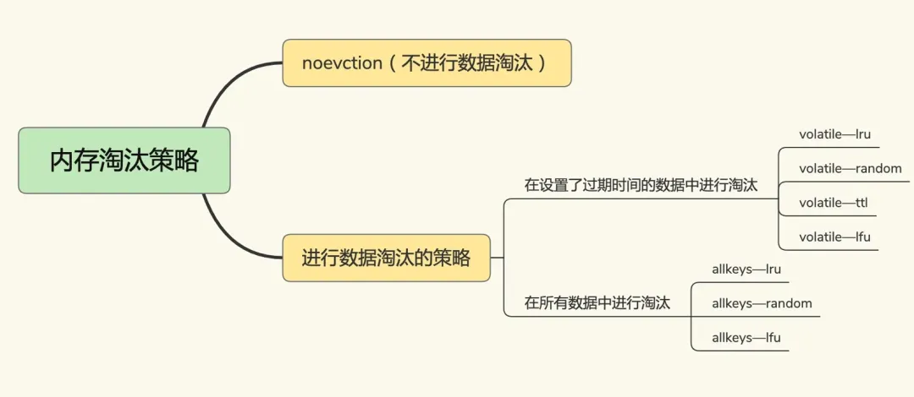

 学习更多：24 替换策略：缓存满了怎么办？

https://time.geekbang.org/column/article/294640

这个配置在哪里？

大部分同学都是不会主动去调整这里的参数的。

因此大概率默认的是：volatile-lru

+ 行为： 使用 LRU（Least Recently Used，最近最少使用）算法驱逐键。volatile-lru 仅驱逐设有过期时间的键，allkeys-lru 则驱逐所有键。
+ 适用场景： 缓存场景，不介意丢失一些数据。

确保你根据实际需求配置适当的内存淘汰策略，以便在内存达到上限时，系统能够稳定地处理新请求，而不会出现写操作失败的情况（只要不是noeviction）。

也就是说，照理SET GET都应该没啥问题才对（先不考虑其他复杂命令）。

+ 尽管 Redis 本身不会轻易崩溃，但如果内存耗尽且没有淘汰策略或者淘汰策略未能生效，Redis 可能拒绝新的写操作，并返回错误：OOM command not allowed when used memory > 'maxmemory'
+ 如果系统的配置或者操作系统的内存管理不当，可能会导致 Redis 进程被操作系统杀死。

### 疑问点：但是事故现象就是：内存使用率100% 时，redis不可用，怎么解释？
#### **猜测1：会是淘汰不及时导致的性能瓶颈吗？**
也就是说：写入的速度>>淘汰的速度。

##### **解答：如果是正常的业务写入，不可能！**
+ redis纯内存，淘汰速度是非常快的；
+ 这个业务特性，也并非高频写入；

这个redis实例其实里面存储的KEY很少，最终占了整个实例的内存使用率<5%。

不太符合正常使用下KEY不断增多，最终挤爆内存使用率的问题。

因此，初步结论：Redis 的崩溃一般不会是由于单纯写入速度超过淘汰速度引起的，尤其是使用了合理的内存淘汰策略时；如果写入速度非常高，而淘汰策略无法及时清除旧数据，Redis 可能会非常频繁地进行键的查找和淘汰操作，从而导致性能下降。

 18 波动的响应延迟：如何应对变慢的Redis？（上）

https://time.geekbang.org/column/article/286549

###### 具体机制如下：
过期 key 的自动删除机制。它是 Redis 用来回收内存空间的常用机制，应用广泛，本身就会引起 Redis 操作阻塞，导致性能变慢，所以，你必须要知道该机制对性能的影响。

Redis 键值对的 key 可以设置过期时间。默认情况下，Redis 每 100 毫秒会删除一些过期 key，具体的算法如下：

1.采样：

ACTIVE_EXPIRE_CYCLE_LOOKUPS_PER_LOOP 个数的 key，并将其中过期的 key 全部删除；

2.如果超过 25% 的 key 过期了，则重复删除的过程，直到过期 key 的比例降至 25% 以下。

ACTIVE_EXPIRE_CYCLE_LOOKUPS_PER_LOOP 是 Redis 的一个参数，默认是 20，那么，一秒内基本有 200 个过期 key 会被删除。这一策略对清除过期 key、释放内存空间很有帮助。如果每秒钟删除 200 个过期 key，并不会对 Redis 造成太大影响。

但是，如果触发了上面这个算法的第二条，Redis 就会一直删除以释放内存空间。注意，删除操作是阻塞的（Redis 4.0 后可以用异步线程机制来减少阻塞影响）。所以，一旦该条件触发，Redis 的线程就会一直执行删除，这样一来，就没办法正常服务其他的键值操作了，就会进一步引起其他键值操作的延迟增加，Redis 就会变慢。

那么，算法的第二条是怎么被触发的呢？其中一个重要来源，就是**频繁使用带有相同时间参数的 EXPIREAT 命令设置过期 key**，这就会导致，在同一秒内有大量的 key 同时过期。

可以类比JVM频繁GC造成的性能影响。

#### **猜测2：那就是写入太凶猛，且是【非正常业务写入】**
那到底是什么导致了内存使用率激增呢？？

##### **蛛丝马迹**
 如何解决Redis内存使用率突然升高：

https://help.aliyun.com/zh/redis/support/how-to-solve-the-sudden-increase-in-redis-memory-usage?spm=a2c4g.11186623.0.i12

因此查阅了资料，发现最为贴近的答案。

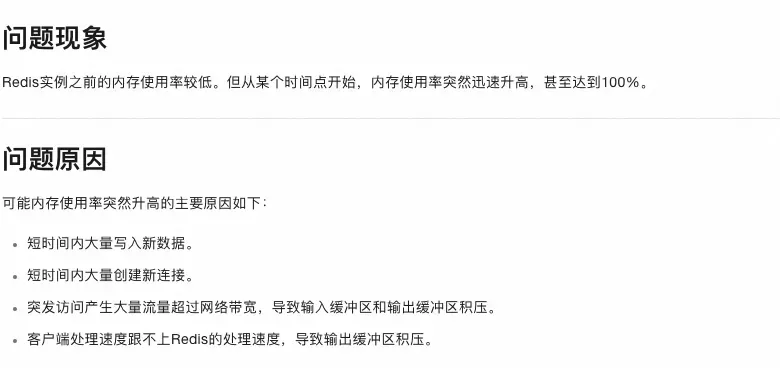

##### **证据支撑**
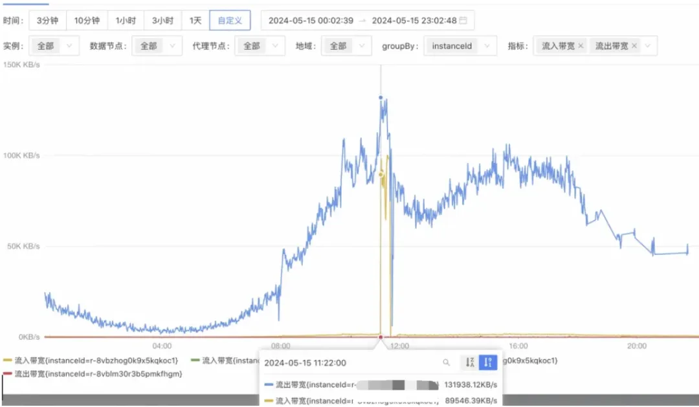

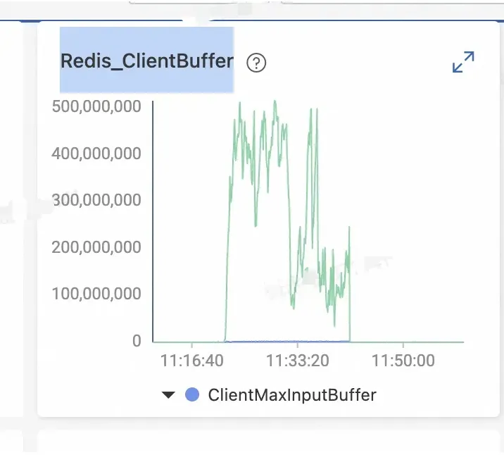

##### **真相大白**
果然是这样，说明内存是被【缓冲区】挤爆的。

 21 缓冲区：一个可能引发“惨案”的地方：

https://time.geekbang.org/column/article/291277 

#### **知识点：Redis的内存占用组成**
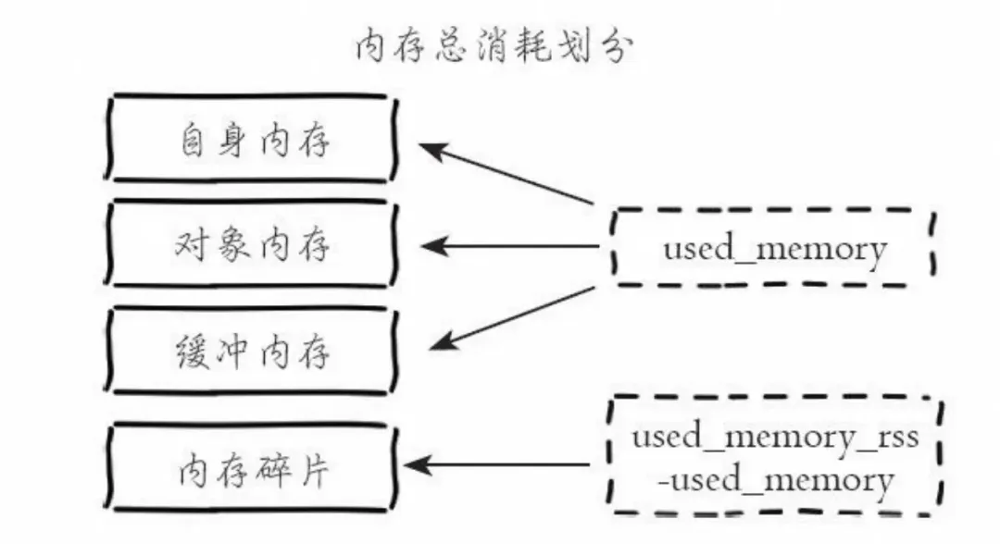

使用info memory进行分析（我随便模拟了一个缓冲区溢出的case，并非事故现场，因为当时不会）。

# Memoryused_memory:1072693248used_memory_human:1023.99Mused_memory_rss:1090519040used_memory_rss_human:1.02Gused_memory_peak:1072693248used_memory_peak_human:1023.99Mused_memory_peak_perc:100.00%used_memory_overhead:1048576000used_memory_startup:1024000used_memory_dataset:23929848used_memory_dataset_perc:2.23%allocator_allocated:1072693248allocator_active:1090519040allocator_resident:1090519040total_system_memory:16777216000total_system_memory_human:16.00Gused_memory_lua:37888used_memory_lua_human:37.89Kused_memory_scripts:1024000used_memory_scripts_human:1.00Mmaxmemory:1073741824maxmemory_human:1.00Gmaxmemory_policy:noevictionallocator_frag_ratio:1.02allocator_frag_bytes:17825792allocator_rss_ratio:1.00allocator_rss_bytes:0rss_overhead_ratio:1.00rss_overhead_bytes:0mem_fragmentation_ratio:1.02mem_fragmentation_bytes:17825792mem_not_counted_for_evict:0mem_replication_backlog:0mem_clients_slaves:0mem_clients_normal:1048576000mem_aof_buffer:0mem_allocator:jemalloc-5.1.0active_defrag_running:0lazyfree_pending_objects:0

**分析和解释**

从上面的 INFO memory 输出中，我们可以看到一些关键信息，这些信息表明大部分内存被缓冲区占用殆尽：

1.内存使用情况：

+ used_memory: 1072693248 （1.02 GB）
+ maxmemory: 1073741824 （1.00 GB）

上面的输出表明，当前内存使用几乎达到了配置的最大内存限制，内存已接近耗尽。

2.缓冲区占用：

+ used_memory_overhead: 1048576000 （1.00 GB）

这个值表示 Redis 开销的内存，包括缓冲区、连接和其他元数据。在这种情况下，大部分 used_memory (1.02 GB) 被 used_memory_overhead (1.00 GB) 占用，这意味着大部分内存都被缓冲区等开销占据。

3.数据集占用：

+ used_memory_dataset: 23929848 （23.93 MB）
+ used_memory_dataset_perc: 2.23%

这里显示，实际存储的数据只占了非常少的一部分内存（约 23.93 MB），而绝大部分内存被缓冲区占据。

4.客户端缓冲区：

+ mem_clients_normal: 1048576000 （1.00 GB）

这表明普通客户端连接占用了约 1.00 GB 内存，这通常意味着输出缓冲区可能已经接近或达到了设定的限制。

5.内存碎片：

+ allocator_frag_ratio: 1.02
+ mem_fragmentation_ratio: 1.02

碎片率不高，表明内存被合理使用但被缓冲区占用过多。

**总结**

从上面的例子可以看出，Redis 的内存几乎被缓冲区占用殆尽。以下是具体的结论：

+ 当前内存使用 (used_memory) 已经接近最大内存限制 (maxmemory)，即 1.02 GB 接近 1.00 GB 的限制。
+ 内存开销 (used_memory_overhead) 很大，主要被客户端普通连接使用（可能是输出缓冲区），而实际的数据仅占用了很少的内存。
+ 分配器和 RSS 碎片率 (allocator_frag_ratio 和 mem_fragmentation_ratio) 较低，表明碎片不是问题。

##### **缓冲内存的理论最大值推导**
###### **为什么要有缓冲区**
Redis工作原理-单客户端视角简单版：

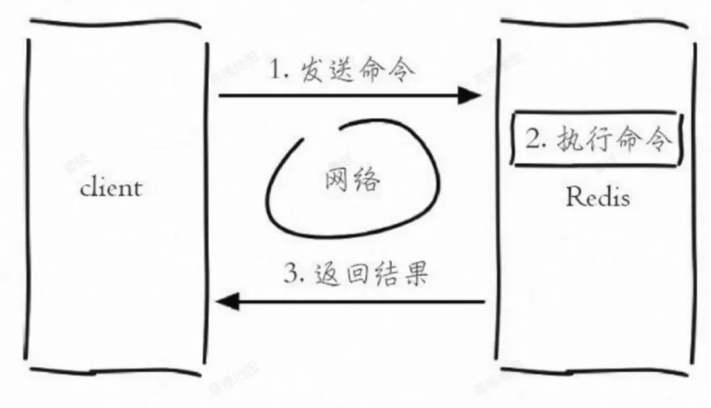

Redis工作原理-单客户端视角复杂版：

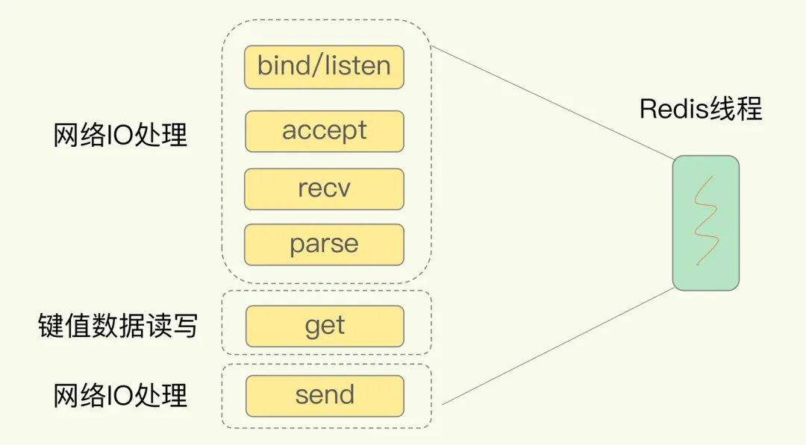

缓冲区的功能其实很简单，主要就是用一块内存空间来暂时存放命令数据，以免出现因为数据和命令的处理速度慢于发送速度而导致的数据丢失和性能问题。

因此，Redis工作原理-多客户端视角简单版（含缓冲区）。

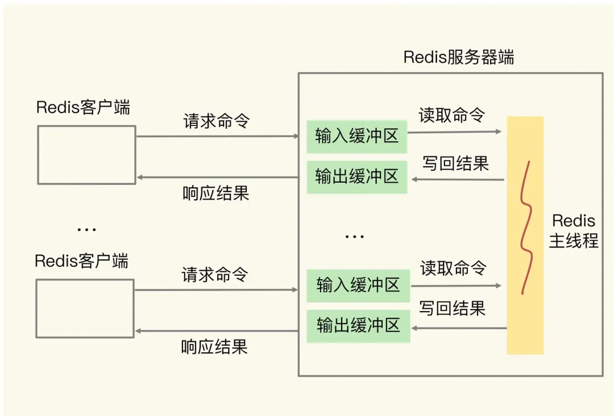

###### **输入缓冲区**
**定义**

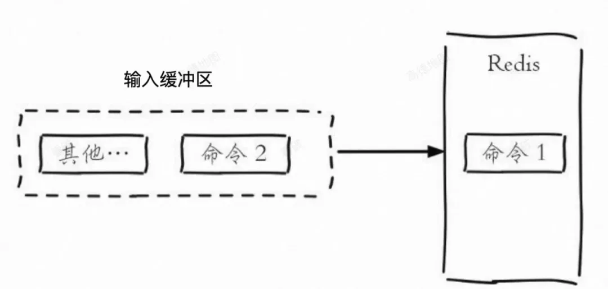

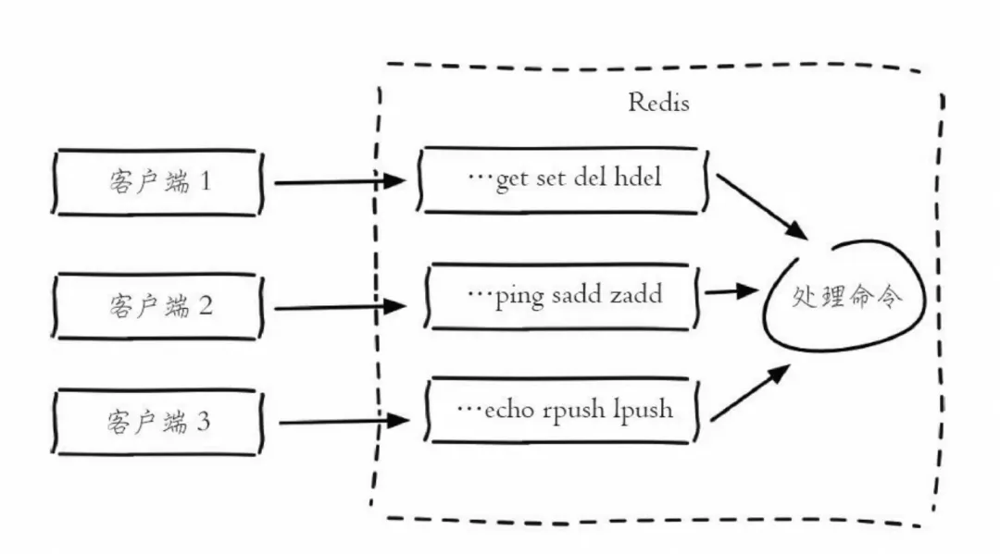

**内存占用**

###### **输出缓冲区**
**定义**

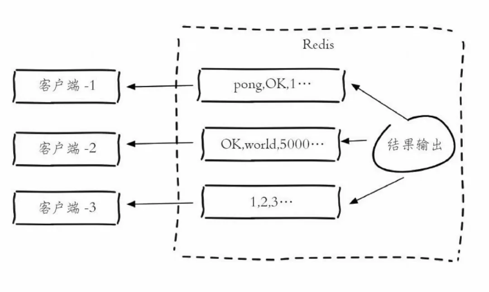

**内存占用**

Redis Server 的输出大小通常是不可控制的。存在bigkey的时候，就会产生体积庞大的返回数据。另外也有可能因为执行了太多命令，导致产生返回数据的速率超过了往客户端发送的速率，导致服务器堆积大量消息，从而导致输出缓冲区越来越大，占用过多内存，甚至导致系统崩溃。Redis 通过设置 client-output-buffer-limit来保护系统安全。

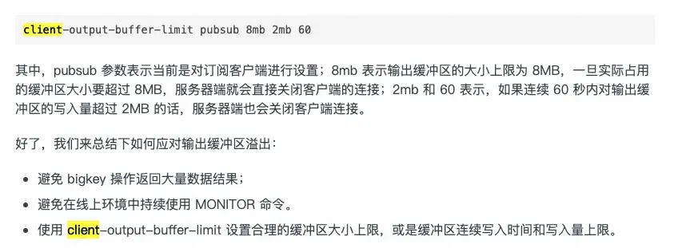

不出意外，默认是：32MB 8MB 60s

对于 Pub/Sub 连接:

+ 硬限制：每个 Pub/Sub 客户端连接的输出缓冲区最大可以达到 32MB 。
+ 连接池最大连接数：300 个连接，其中所有连接假设都在处理 Pub/Sub 消息且达到了最大缓冲区限制。

故理论上，最大输出缓冲区可以达到：

最大输出缓冲区占用=硬限制×连接池最大连接数最大输出缓冲区占用=硬限制×连接池最大连接数=32MB×300=9600MB=9.375GB

因此，在这种配置下，所有 Pub/Sub 连接的输出缓冲区理论上的最大占用内存为 9.375 GB。

因此，在client-output-buffer-limit是默认的情况下，最大占用内存为 9.375 GB。

#### **所以，MAX（输出缓冲区+输入缓冲区）是否会造成内存使用率100%？**
当然！

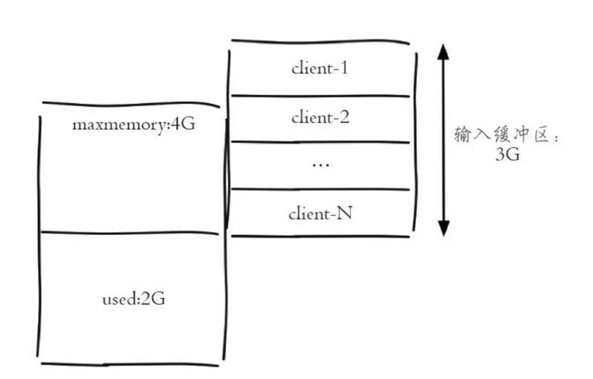

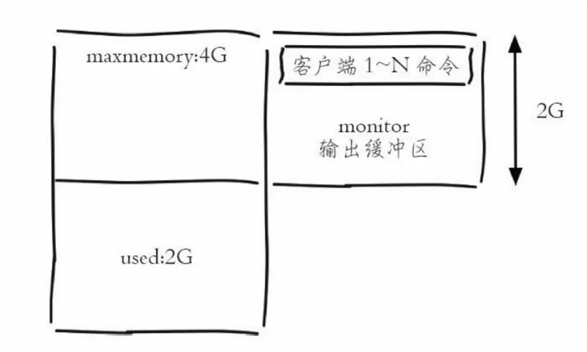

MAX（输出缓冲区+输入缓冲区）=10.375GB >> 一个实例的内存规格（在本case中，是2G）

最后的效果就是：

对象存储的部分因为是有过期时间的，过期了自然被清理了。

+ 【缓冲内存】↑ （涌入）
+ 【对象内存】↓ （定时清理）
+ 并受MAX内存掣肘（上限）

最终的结局：Redis 的内存完全被缓冲区占据。

自然，每当有SET请求进来的时候，SET不进来——因为「内存淘汰策略」(maxmemory-policy) 淘汰的是【对象内存】，压根起不到作用！！！

结论：

Redis 的内存完全被缓冲区占据，实际上 Redis 将无法正常工作，包括数据存储（SET 操作）和数据读取（GET 操作）。

#### **分析：为何缓冲区激增（Redis不可用的时间点11:22:02，之前都发生了什么）**
知道了缓冲区挤爆Redis内存会导致Redis不工作之后，接下来就是分析为何当时出现了缓冲区激增并最终导致redis不可用。

##### **实例信息**
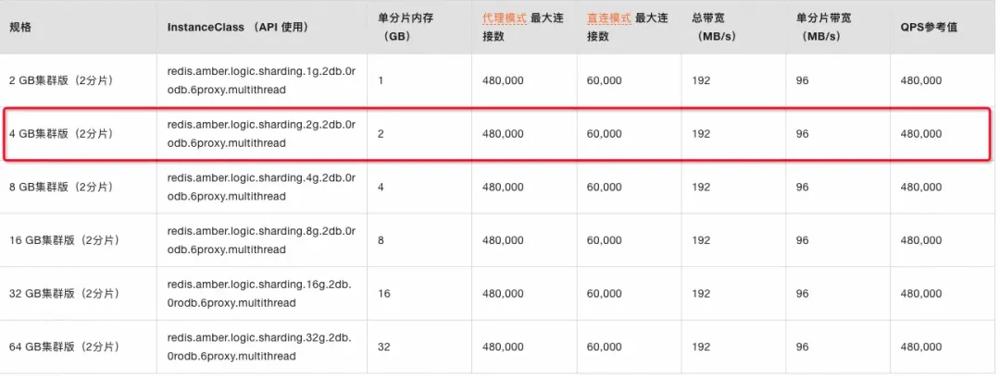

##### **相关代码**
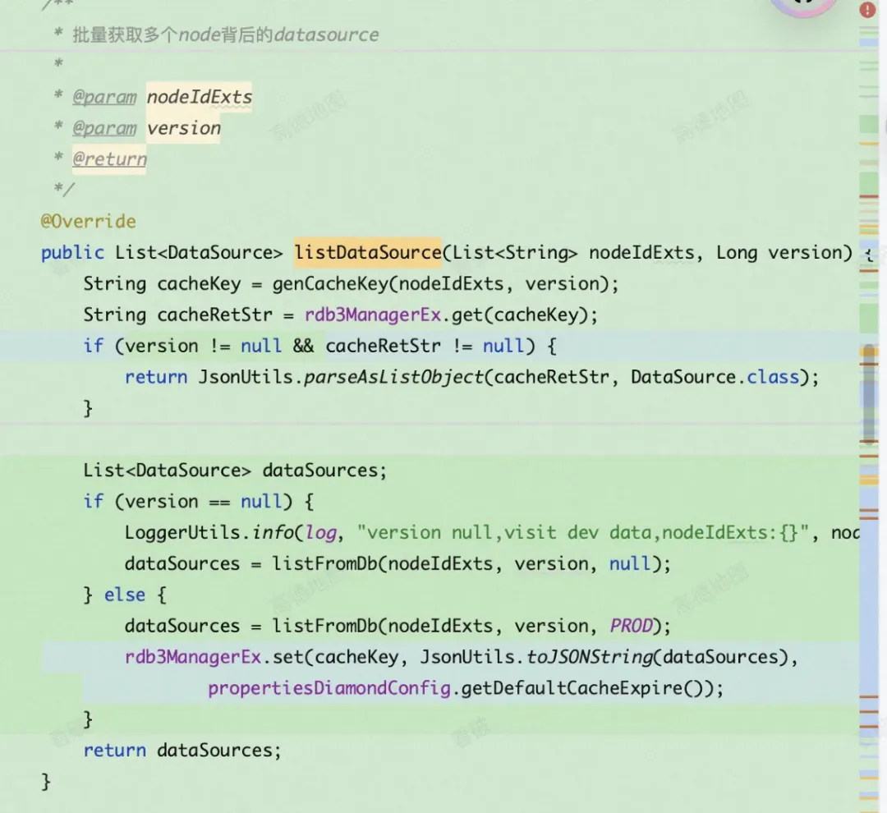

##### **案件还原**
1.自然增长导致流出带宽不断变大直至96MB/s。

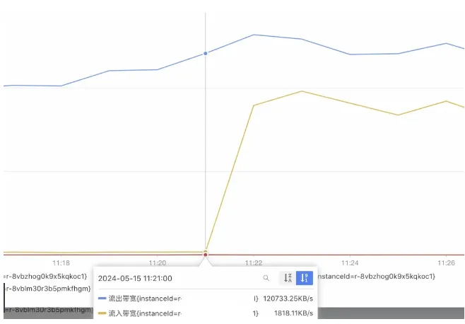

2.流出带宽超过96MB/s，输出缓冲区内存占用激增甚至溢出 （300setMaxTotal*10机器ip数量个客户端，之前推导过可以到9G）。

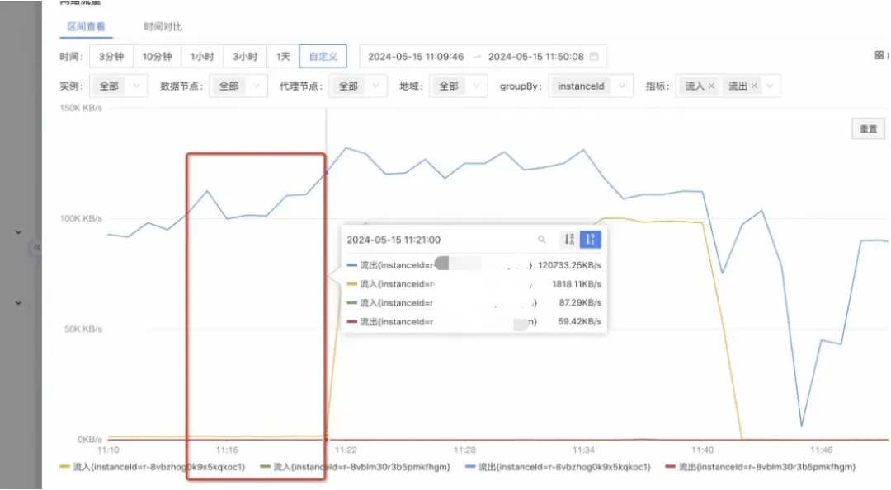

3.导致输出缓冲区爆了，redis客户端连接不得不关闭。

4.客户端连接关闭后，导致请求都走DB。

5.DB走完之后都会执行SET。

6.SET流量飙升，且因都是大KEY，导致流入带宽激增（别看写QPS只有50，但是如果每个写都是2MB，就可以做到瞬间占满流入带宽）。

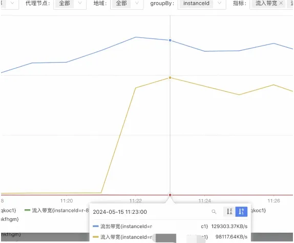

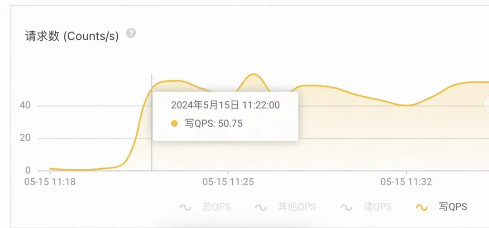

7.Redis主线程模型，处理请求的速度过慢（大KEY），出现了间歇性阻塞，无法及时处理正常发送的请求，导致客户端发送的请求在输入缓冲区越积越多。

8.输入缓冲区内存随即激增。

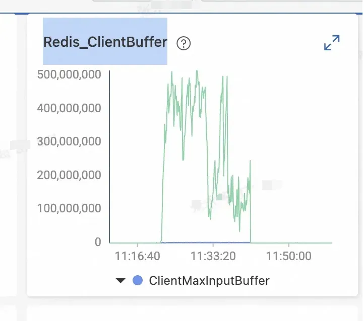

9.最终，redis内存被缓冲区内存（输入、输出）完全侵占。

10.后续的SET GET命令甚至都进不了输入缓冲区，阻塞持续到客户端配置的SoTimeout时间；但是流入流出带宽依然占据并持续，总带宽到达了216MB/s > 实例最大带宽192MB/s。

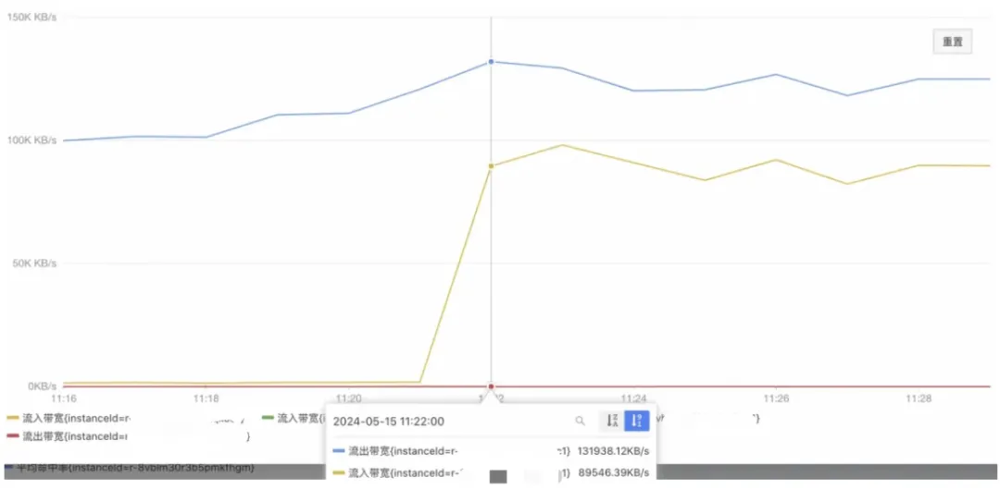

11.造成最终的不可用（后续的命令想进场，要依赖当前输入缓冲区里的命令被执行给你腾出来位置，但是还是那句话Redis主线程处理消化的速度，实在是太慢了；从图中，可以看到Redis的QPS骤降。

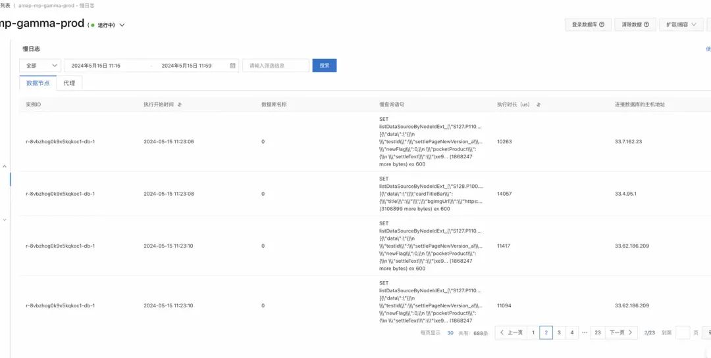

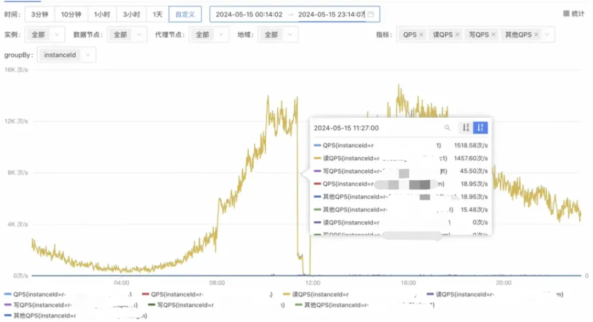

11:35分之后，我把redis降级了，全使用db来抗流量。

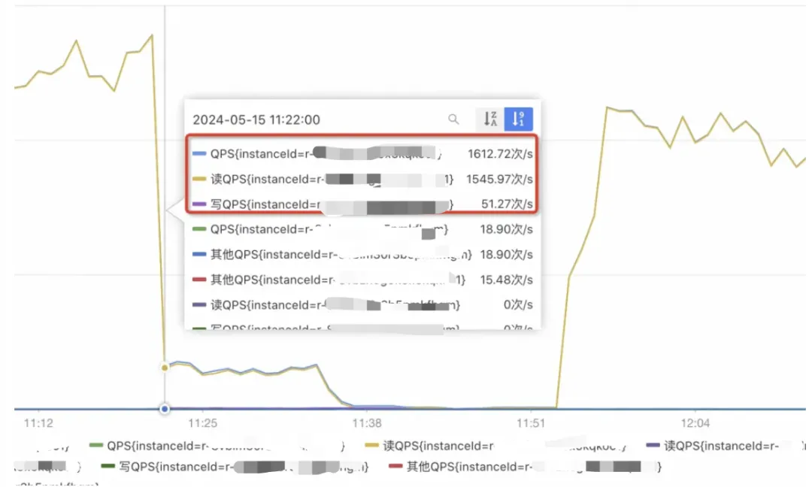

开发运维规范

可以看到Redis的性能是有边界的，不能盲目相信所谓的高性能。

真正理解性能须使用benchmark。 

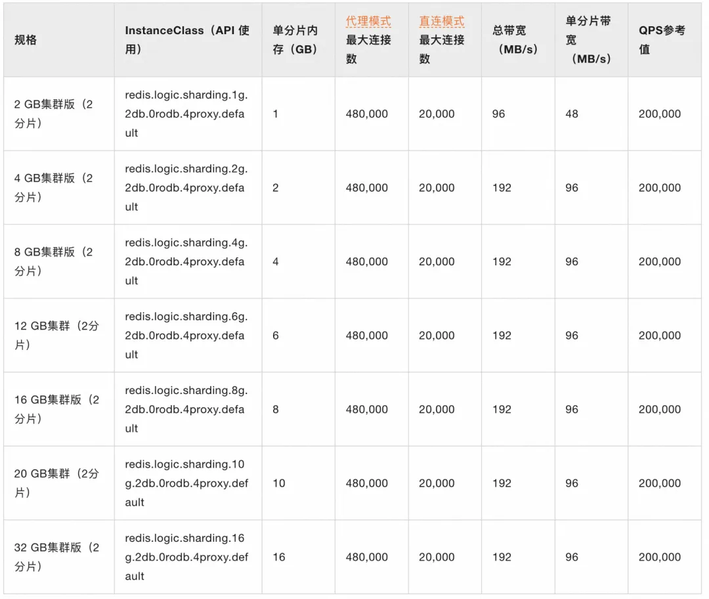

它也是有问题能造成他的性能瓶颈的。

| 计算资源 | 使用通配符、Lua并发、1对多的PUBSUB、热点Key等会大量消耗计算资源，集群架构下还会导致访问倾斜，无法有效利用所有数据分片。 |
| --- | --- |
| 存储资源 | Streaming慢消费、大Key等会占用大量存储资源，集群架构下还会导致数据倾斜，无法有效利用所有数据分片。 |
| 网络资源 | 扫描全库（KEYS命令）、大Value、大Key的范围查询（如HGETALL命令）等会消耗大量的网络资源，且极易引发线程阻塞。 **重要** Redis的高并发能力不等同于高吞吐能力，例如将大Value存在Redis里以期望提升访问性能，此类场景往往不会有特别大的收益，反而会影响Redis整体的服务能力。 |

在上述的事故中，就占了【网络资源消耗高】【存储资源消耗高】两大问题

因此也到了本文的方法论环节：从业务部署、Key的设计、SDK、命令、运维管理等维度展示云数据库Redis开发运维规范：

+  业务部署规范：https://help.aliyun.com/zh/redis/use-cases/development-and-o-and-m-standards-for-apsaradb-for-redis 
+  Key设计规范：https://help.aliyun.com/zh/redis/use-cases/development-and-o-and-m-standards-for-apsaradb-for-redis 
+  SDK使用规范：https://help.aliyun.com/zh/redis/use-cases/development-and-o-and-m-standards-for-apsaradb-for-redis 
+  命令使用规范：https://help.aliyun.com/zh/redis/use-cases/development-and-o-and-m-standards-for-apsaradb-for-redis 
+ 运维管理规范：https://help.aliyun.com/zh/redis/use-cases/development-and-o-and-m-standards-for-apsaradb-for-redis 

## **业务部署规范**
| 重要程度 | 规范 | 说明 |
| --- | --- | --- |
| ★★★★★ | 确定使用场景为**高速缓存**或**内存数据库**。 | + 高速缓存：建议关闭AOF以降低开销，同时，由于数据可能会被淘汰，业务设计上避免强依赖缓存中的数据。例如Redis被写满后，会触发数据淘汰策略以挪移出空间给新的数据写入，根据业务的写入量会相应地导致延迟升高。 **重要** 如需使用通过数据闪回按时间点恢复数据功能，AOF功能需保持开启状态。 + 内存数据库：应选购企业版（持久内存型），支持命令级持久化，同时应通过监控报警关注内存使用率。具体操作，请参见报警设置。 |
| ★★★★★ | 就近部署业务，例如将业务部署在同一个专有网络VPC下的ECS实例中。 | Redis具备极强的性能，如果部署位置过远（例如业务服务器与Redis实例通过公网连接），网络延迟将极大影响读写性能。 **说明** 针对多地部署应用的场景，您可以通过全球多活功能，借助其提供的跨域复制（Geo-replication）能力，快速实现数据异地灾备和多活，降低网络延迟和业务设计的复杂度。更多信息，请参见Redis全球多活简介。 |
| ★★★★☆ | 为每个业务提供单独的Redis实例。 | 避免业务混用，尤其需要避免将同一Redis实例同时用作高速缓存和内存数据库业务。带来的影响例如针对某个业务淘汰策略设置、产生的慢请求或执行**FLUSHDB**命令影响将扩散至其他业务。 |
| ★★★★☆ | 设置合理的过期淘汰策略。 | 云数据库Redis默认的默认逐出策略为** volatile-lru **，关于各逐出策略的说明，请参见Redis配置参数列表。 |
| ★★★☆☆ | 合理控制压测的数据和压测时间。 | 云数据库Redis不会对您压测的数据执行自动删除操作，您需要自行控制压测数据的数据量和压测时间，避免对业务造成影响。 |

## **Key设计规范**
| 重要程度 | 规范 | 说明 |
| --- | --- | --- |
| ★★★★★ | 设计合理的Key中Value的大小，推荐小于10 KB。 | 过大的Value会引发数据倾斜、热点Key、实例流量或CPU性能被占满等问题，应从设计源头上避免此类问题带来的影响。 |
| ★★★★★ | 设计合理的Key名称与长度。 | + Key名称： + 使用可读字符串作为Key名，如果使用Key名拼接库、表和字段名时，推荐使用英文冒号（:）分隔。例如project:user:001。 + 在能完整描述业务的前提下，尽量简化Key名的长度，例如username可简化为u。 + 由于大括号（{}）为Redis的hash tag语义，如果使用的是集群架构的实例，Key名称需要正确地使用大括号避免 引发数据倾斜 ，更多信息，请参见keys-hash-tags。 **说明** 集群架构下执行同时操作多个Key的命令时（例如RENAME命令），如果被操作的Key未使用hash tag让其处于相同的数据分片，则命令无法正常执行。 + 长度：推荐Key名的长度不超过128字节（越短越好）。 |
| ★★★★★ | 对于支持子Key的复杂数据结构，应避免一个Key中包含过多的子Key（推荐低于1,000）。 **说明** 常见的复杂数据结构例如Hash、Set、Zset、Geo、Stream及Tair（Redis企业版）特有的exHash、Bloom、TairGIS等。 | 由于某些命令（例如**HGETALL**）的时间复杂度直接与Key中的子Key数量相关。如果频繁执行时间复杂度为**O(N)**及以上的命令，且Key中的子Key数量过多容易引发慢请求、数据倾斜或热点Key问题。 |
| ★★★★☆ | 推荐使用串行化方法将Value转变为可读的结构。 | 由于编程语言的字节码随着版本可能会变化，如果存储裸对象（例如Java Object、C#对象）会导致整个软件栈升级困难，推荐使用串行化方法将Value变成可读的结构。 |

## **SDK使用规范**
| 重要程度 | 规范 | 说明 |
| --- | --- | --- |
| ★★★★★ | 推荐使用JedisPool或者JedisCluster连接实例。 **说明** 企业版（内存型）实例推荐使用TairJedis客户端，支持新数据结构的封装类。使用方法，请参见通过客户端程序连接Redis。 | 如果使用单连接的方式，一旦遇到单次超时则无法自动恢复。关于JedisPool的连接方法，请参见通过客户端程序连接Redis、JedisPool资源池优化和JedisCluster。 |
| ★★★★☆ | 程序客户端需要对超时和慢请求做容错处理。 | 由于Redis服务可能因网络波动或资源占满引发超时或慢请求，您需要在程序客户端上设计合理的容错机制。 |
| ★★★★☆ | 程序客户端应设置相对宽松的超时重试时间。 | 如果超时重试时间设置的非常短（例如200毫秒以下），可能引发重试风暴，极易引发业务层雪崩。更多信息，请参见Redis客户端重连指南。 |

## **命令使用规范**
| 重要程度 | 规范 | 说明 |
| --- | --- | --- |
| ★★★★★ | 避免执行范围查询（例如**KEYS ***），使用多次单点查询或**SCAN**命令来获取延迟优势。 | 执行范围查询可能导致服务发生抖动、引发慢请求或产生阻塞。 |
| ★★★★★ | 推荐使用扩展数据结构（数据结构模块集成）实现复杂功能，避免使用Lua脚本。 | Lua脚本会占用较多的计算和内存资源，且无法被多线程加速，过于复杂或不合理的Lua脚本可能导致资源被占满的情况。 |
| ★★★★☆ | 合理使用管道（pipeline）降低链路的往返时延RTT（Round-trip time）。 | 如果有多个操作命令需要被迅速提交至服务器端，且客户端不依赖每个操作返回的结果，那么可以通过管道来作为优化性能的批处理工具，注意事项如下： + 管道执行期间客户端将独占与服务器端的连接，推荐为管道单独建立一个连接，将其与常规操作分离。 + 每个管道应包含合理的命令数量（不超过100个）。 |
| ★★★★☆ | 正确使用Redis社区版命令支持。 | 使用事务（Transaction）时，需要注意其限制： + 不同于关系型数据库的事务功能，Redis的事务功能不支持回滚（**Rollback**）。 + 对于集群架构的实例，需要使用hash tag确保命令所要操作的Key都分布在1个Hash槽中，同时还需要避免hash tag带来的存储倾斜问题。 + 避免在Lua脚本中封装事务命令，可能因编译加载消耗较多的计算资源。 |
| ★★★★☆ | 避免使用Redis社区版命令支持执行大量的消息分发工作。 | 由于Pub和Sub不支持数据持久化，且不支持ACK应答机制无法实现数据可靠性，当执行大量消息分发工作时（例如订阅客户端数量超过100且Value超过1 KB），订阅客户端可能因服务端资源被占满而无法接收到数据。 **说明** 为提升性能和均衡性，云数据库Redis对Pub和Sub类命令进行了优化，集群架构下，代理节点会根据channel name进行Hash计算，并分配至对应数据节点。 |

## **运维管理规范**
| 重要程度 | 规范 | 说明 |
| --- | --- | --- |
| ★★★★★ | 充分了解不同的实例管理操作带来的影响。 | 在对Redis实例执行变更配置、重启等操作时，实例的状态将发生变化并产生某些影响（例如产生秒级的连接闪断），在操作前您需要充分了解。更多信息，请参见实例状态与影响。 |
| ★★★★★ | 验证客户端程序的差错处理能力或容灾逻辑。 | 云数据库Redis支持节点健康状态监测，当监测到实例中的主节点不可用时，会自动触发主备切换，保障实例的高可用性。在客户端程序正式上线前，推荐手动触发主备切换，可帮助您验证客户端程序的差错处理能力或容灾逻辑。具体操作，请参见手动执行主备切换。 |
| ★★★★★ | 禁用高耗时或高风险的命令。 | 生产环境中，无限制地使用命令可能带来诸多问题，例如执行**FLUSHALL**会直接清空全部数据；执行**KEYS**会阻塞Redis服务。为保障业务稳定、高效率地运行，您可以根据实际情况禁用特定的命令，具体操作，请参见禁用高风险命令。 |
| ★★★★☆ | 及时处理阿里云发起的计划内运维操作（即待处理事件）。 | 为提供更优质的服务，持续提升产品性能和稳定性，阿里云会不定期地发起计划内运维操作（即待处理事件），对部分实例所属的机器执行软硬件或网络换代升级（例如数据库小版本升级）。当您收到来自阿里云的事件通知后，您可以查看本次事件的影响，根据业务需求评估是否需要调整执行时间。更多信息，请参见查看并管理待处理事件。 |
| ★★★★☆ | 为核心指标配置监控报警，帮助掌握实例运行状态。 | 为CPU使用率、内存使用率、带宽使用率等核心指标配置监控报警，实时掌握实例运行状态。具体操作，请参见报警设置。 |
| ★★★★☆ | 通过云数据库Redis提供的丰富的运维功能，定期检查实例状态或辅助排查资源消耗异常问题。 | + 分析慢日志：帮助您快速找到慢请求问题发生的位置，定位发出请求的客户端IP，为彻底解决超时问题提供可靠的依据。 + 查看性能监控：云数据库Redis支持丰富的性能监控指标，帮助您掌握Redis服务的运行状况和进行问题溯源。 + 发起实例诊断：帮助您从性能水位、访问倾斜情况、慢日志等多方面评估实例的健康状况，快速定位实例的异常情况。 + 发起缓存分析：帮助您快速发现实例中的大Key，帮助您掌握Key在内存中的占用和分布、Key过期时间等信息。 + 实时Top Key统计：帮助您快速发现实例中的热点Key，为进一步的优化提供数据支持。 |
| ★★★☆☆ | 评估并开启审计日志功能。 | 开通审计日志功能后，可记录写操作的审计信息，为您提供日志的查询、在线分析、导出等功能，助您时刻掌握产品安全及性能情况。更多信息，请参见开通审计日志。 **重要** 开通审计日志后，视写入量或审计量可能会对Redis实例造成5%～15%的性能损失。如果业务对Redis实例的写入量非常大，建议仅在运维需要（例如故障排查）期间开通审计功能，以免带来性能损失。 |

重点行动项

  

**大KEY**

大KEY其实并不是长度过长的KEY，而是存放了慢查询命令的KEY。

对于String类型，慢查询的本质在于value的大小。

对于其他类型，慢查询的本质在于集合的大小（时间复杂度带来）。

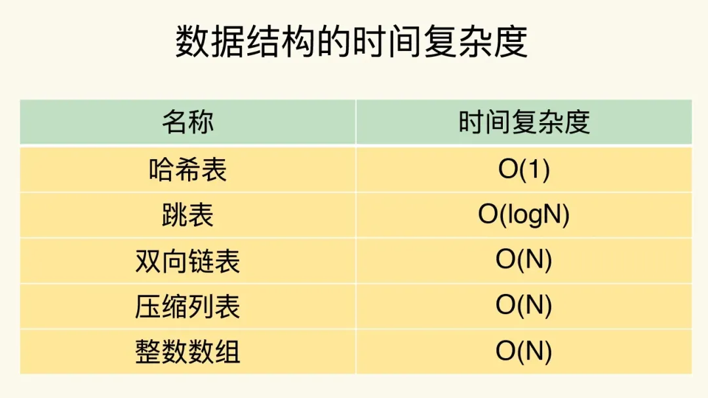

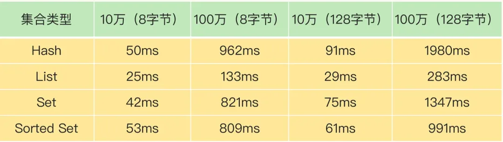

#### **如何找到大key？**
 阿里云：发现并处理Redis的大Key和热Key：

https://help.aliyun.com/zh/redis/user-guide/identify-and-handle-large-keys-and-hotkeys?spm=a2c4g.11186623.0.i1

#### **如何解决大key？**
其实就是一个字 "拆"。

1.对于字符串类型的key，我们通常要在业务层面将value的大小控制在10KB左右，如果value确实很大，可以考虑采用序列化算法和压缩算法来处理，推荐常用的几种序列化算法:Protostuff、Kryo或者Fst。

2.对于集合类型的key，我们通常要通过控制集合内元素数量来避免bigKey，通常的做法是将一个大的集合类型的key拆分成若干小集合类型的key来达到目的。

  

**压测关注点**

1.数据是否倾斜（不能只看聚合信息，要切换到分片上，看数据节点）；

2.是否有大key、热key；

a.压测过程中关注（1）CloudDBA-实时TOP KEY统计（2）CloudDBA-慢请求；

b.压测后（1）CloudDBA-离线全量KEY分析（2）CloudDBA-诊断报告，做到分析报告时间覆盖压测时段；

3.CPU使用率、内存使用率、带宽使用率变化趋势（流入、流出都要看，最好看一个缓存周期）；

4.如果可以，打开审计日志，看写入日志是否符合代码逻辑。

  

**常用运维命令**

出线上事故的时候，用于快速分析和保留现场。

#### **CLIENT LIST**
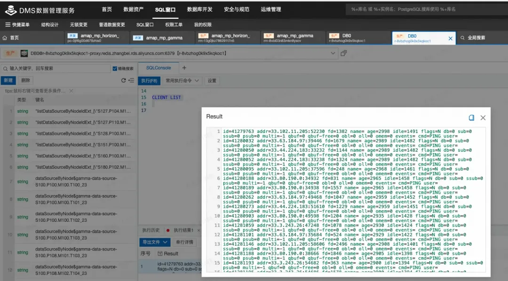

#### **info memory**
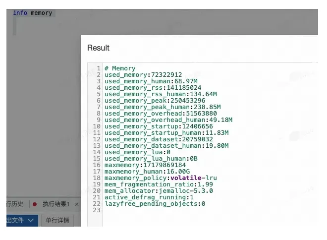

#### **MEMORY USAGE**
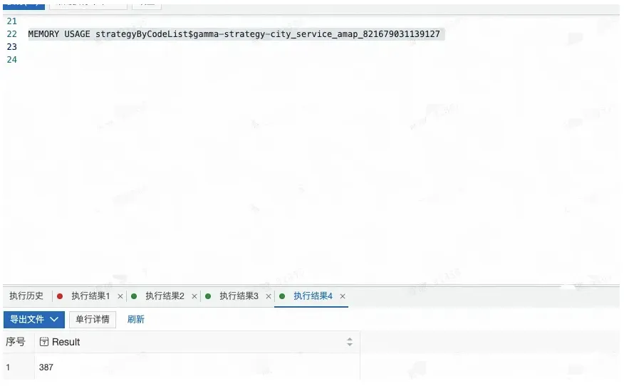

> 更新: 2025-03-18 09:47:30  
> 原文: <https://www.yuque.com/u12222632/as5rgl/mshyqgp0w9a8adn6>