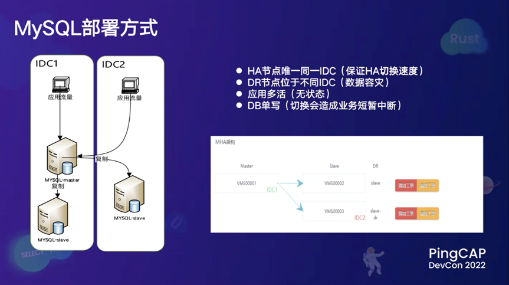
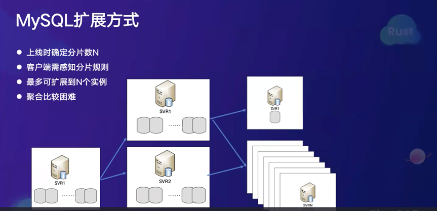
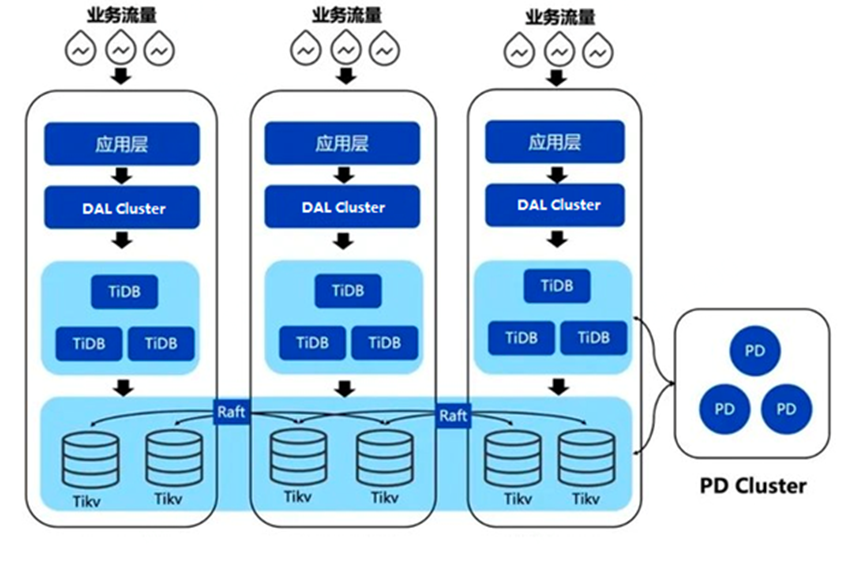
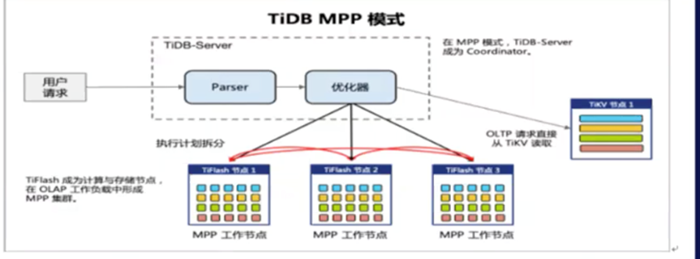
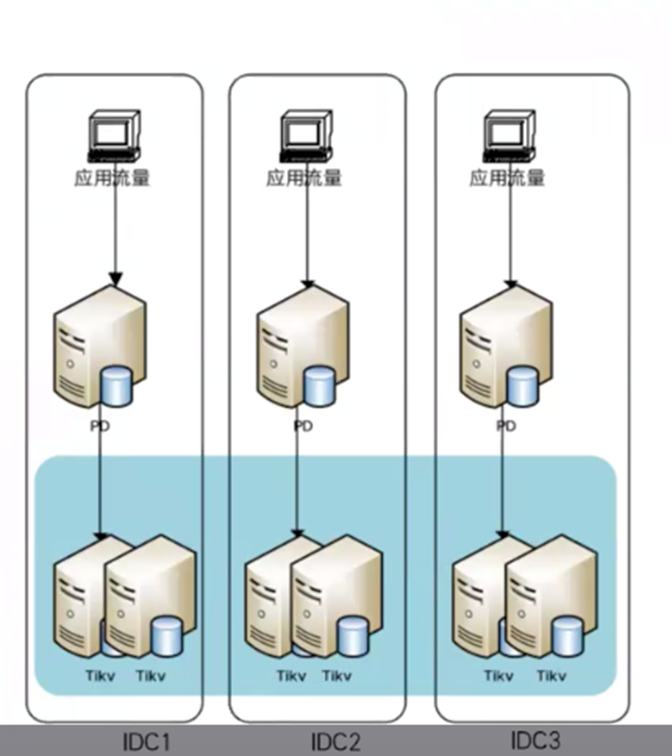
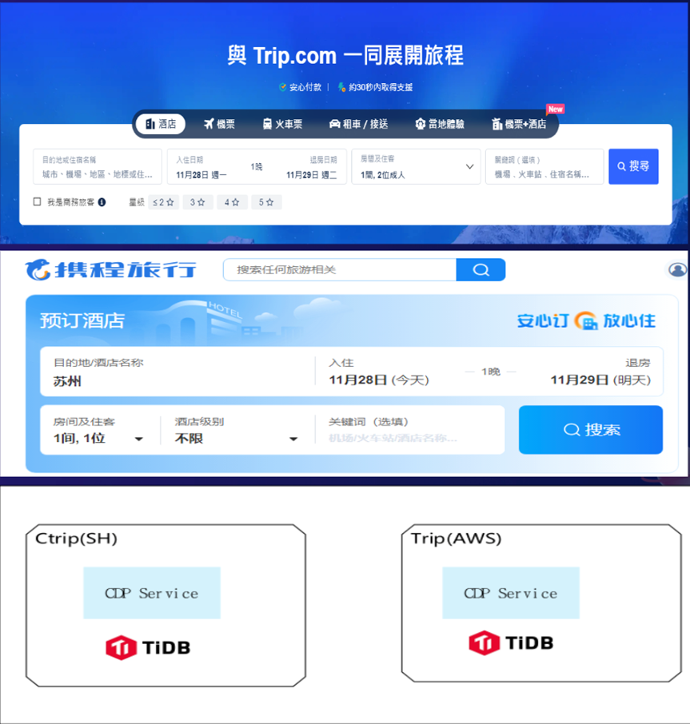

# 分布式数据库 TiDB 在携程的实践

携程作为全球领先的一站式旅行平台，旗下拥有携程旅行网、去哪儿网、Skyscanner 等品牌。携程旅行网向超过 9000 万会员提供酒店预订、酒店点评及特价酒店查询、机票预订、飞机票查询、时刻表、票价查询、航班查询等服务。

随着业务量迅速增长，携程需要更敏捷的技术架构来满足不断激增的并发与数据量，一个稳定、可靠，可以随业务增长不断扩展的数据库对于携程来说显得尤其重要。作为海内外在线旅游行业的翘楚，携程也曾面临着数据库带来的技术挑战。

携程创立于 1999 年，最初选择使用 SQL Server 数据库，在整体数据库技术栈中占比达到 99%。 2012 年初，携程开始逐步关注开源技术，尤其是 MySQL，不过该阶段 MySQL 使用占比仍然很低，只有 10% 左右。从 2014 至 2019 年，携程开始加深 MySQL 的应用，并因为业务形态发生了变化，携程开始从 SQL Server 转型到 MySQL，对 MySQL 进行了深入研究，包括内核补丁、全自动故障诊断等。

## 原 MySQL 架构痛点与挑战

  

携程的应用部署在两个或多个 IDC 中，数据库也对等部署在每个 IDC 中。MySQL 部署方式采用 HA 节点，即主备节点，在同一机房部署，另一节点在不同 IDC 部署，这种方式保证了 HA 切换速度和数据的容灾。比如遇到单机房故障或者整个机房宕机，可以迅速把第二节点启动起来。携程在主备切换和第二切换时做了很多自动化工作，但这种架构也有明显缺点，由于应用的无状态化，数据库的切换会造成业务的短暂中断，因为数据库只有一个主节点。  

  

在扩展方式方面，携程没有采用中间件的方式，而是采用客户端实现分片规则。客户端在上线时会确定分片规则，比如 64。再根据 ID 使用取模运算定位到某个分片，这样可以更方便地进行扩展。当业务增加时实例数量从 1 变成 N ，当负载下降时也可以缩回来。

但是这种扩展方式对 DBA 运维来说还有一些挑战，随着 DBA 越来越多，聚合会比较困难，业务代码也变得复杂。  

## 分布式数据库选型
2018 年，随着携程业务的快速发展，底层架构需要支持弹性扩展，特别是在季节性高峰期（例如春运火车票抢票等）。分布式数据库由于具有 DB 级弹性、快速扩展和混合负载（HTAP）等优势，更适合业务的发展，携程开始考虑引入分布式数据库，并进行调研选型。携程主要从以下几个维度考量分布式数据库：

+ 性能：平衡性能和成本，选择通用机型，不使用高端存储或机器，并要求响应稳定；
+ 运维与社区：学习成本适中，运维复杂度低，产品需开源且社区活跃；
+ 成本：一方面，业务研发需要学习使用 SQL，特别是 MySQL 协议；另一方面，运维团队希望产品不要过于复杂，易于维护；
+ 扩展性：分布式数据库需要具有快速的扩展能力，扩缩容对业务影响小。

  

  

2018 年，携程开始正式引入 TiDB。考虑到 TiDB 的架构和携程的 IDC 环境，携程将 TiDB 分别部署在三个 IDC 机房（IDC1、IDC2、IDC3）中，遵循同时部署的标准。TiKV、TiDB 和 PD 均匀分布在三个 IDC 机房中，业务流量可以本地感知到每个机房的 TiDB Server ，在单机房故障时可以自动重启到其它机房。因为客户端对 TiDB 进行了探活与感知，单个 TiDB 服务器故障时客户端可以重新定向。

## TiDB 在酒店和度假结算场景的应用
在酒店和度假结算场景应用中，携程原 MySQL 架构主要采用分片（sharding）的扩展方式，对于酒店和度假结算这类业务来说，分片会变得非常困难。最初的方案是把 SQL Server 上的数据原封不动导入到 MySQL 中，但测试后发现性能不佳，扩展性也受限。如果采用分片方式部署，不论从酒店的维度、供应商的维度或者是用户维度，都很难选择合适的分片键（ sharding key），这种方式也对业务代码侵入性比较大。因此，携程最终选择了 TiDB，将酒店和度假结算业务从 SQL server 迁移到 TiDB 上，总数据量规模达到 8TB，并受到了开发人员的一致好评，满足了性能和扩展性的诸多要求。

## TiDB 在海量数据场景中的应用

携程的海量数据场景涉及到大量数据存储。原架构中由于单机存储限制，扩展必须通过 sharding 方式实现。但该解决方案对于一些业务而言过于复杂，例如在 IBU 海外业务部数据，单表数据已经超过 300 亿。应用 TiDB 可以大幅提高查询性能，实现大量数据的高效存储。TiDB 的行列混存架构（ TiFlash 和 MPP 技术），使得携程部分查询性能有了 20 倍提升；在信息安全源数据标记数据时，单表数据也超过了 60 亿行，读写的响应时间都达到毫秒级，单天聚合查询秒级返回。

  

除了使用 TiDB ，携程还在使用其存储层 TiKV。引入 TiKV 是因为携程现在的业务有一些简单的 KV 存储需求，携程在使用的产品有 Redis 和 Hbase，但是 Hbase 的性能相比于 Redis 比较差，而 Redis 则存在数据不一致的风险，比如网络抖动、中断等。携程有一些业务有强一致 KV 需求，例如近期引入的酒店取消政策项目，Redis 虽然能满足业务需求，但没有强一致性能。综合考量之后，携程选择了 TiKV 解决上述挑战。TiKV 的部署与 TiDB 类似，也是在三个机房分布部署，应用可以感知到每个机房的 PD，并且 PD 也在三个机房分别部署。该架构可以确保如果出现机房级故障，或是单 PD 故障，运维团队都可以做到平滑切换。

  

## TiDB 在携程的全球化运用

  

随着携程近年来开始走向海外，海外业务呈现迅猛增长趋势。携程也将国内成熟的数据库技术直接用于海外。目前，TiDB 在携程的国内和海外业务是分开部署的，海外应用复用了国内的 schema 和代码，监控告警方式也与国内保持一致，部署方式也是相同的

携程引入 TiDB 并完成了一系列内部生态整合，包括发布系统（如表结构发布、索引发布）、数据修改和查询等。由于 TiDB 和 MySQL 采用了相同的协议，整合过程相对简单平滑：

+ TiDB 原生支持 Prometheus + Grafana，提供了丰富的诊断数据，可以根据 TiDB 故障诊断手册快速定位问题。
+ 由于 Grafana 的数据在每个集群上单独分布，携程通过 prometheus 源生 remote write 转发性能数据到携程统一监控平台，以便在监控平台上进行性能告警和大盘监控。

目前，携程已经顺利完成从 SQL server 到 TiDB 的迁移，稳定应用于携程的国内、海外各业务场景中，借助 TiDB HTAP 能力，携程大幅提高了查询性能，实现海量数据的高效存储。

> 更新: 2025-03-17 19:17:46  
> 原文: <https://www.yuque.com/u12222632/as5rgl/uzff3mtfbr9u19av>