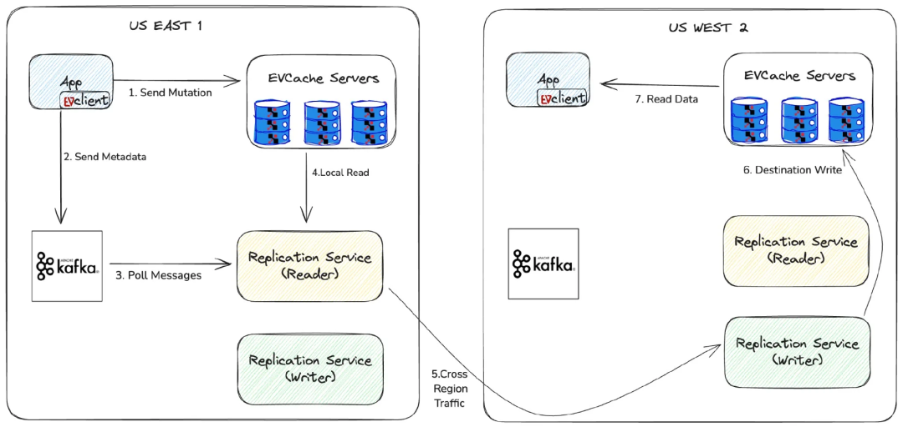
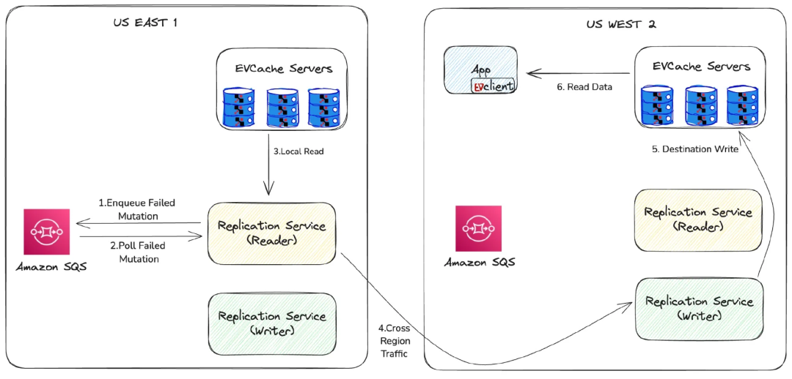
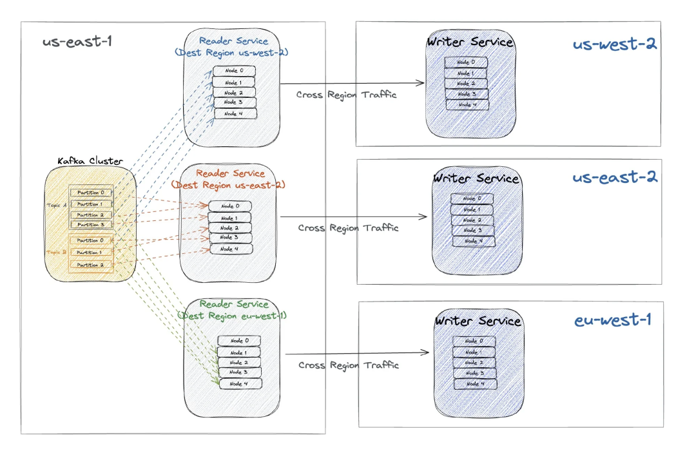
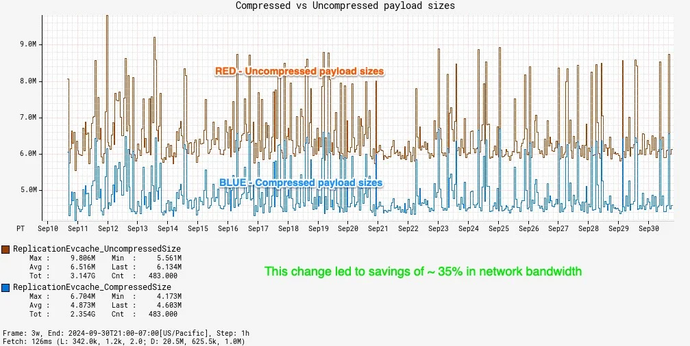
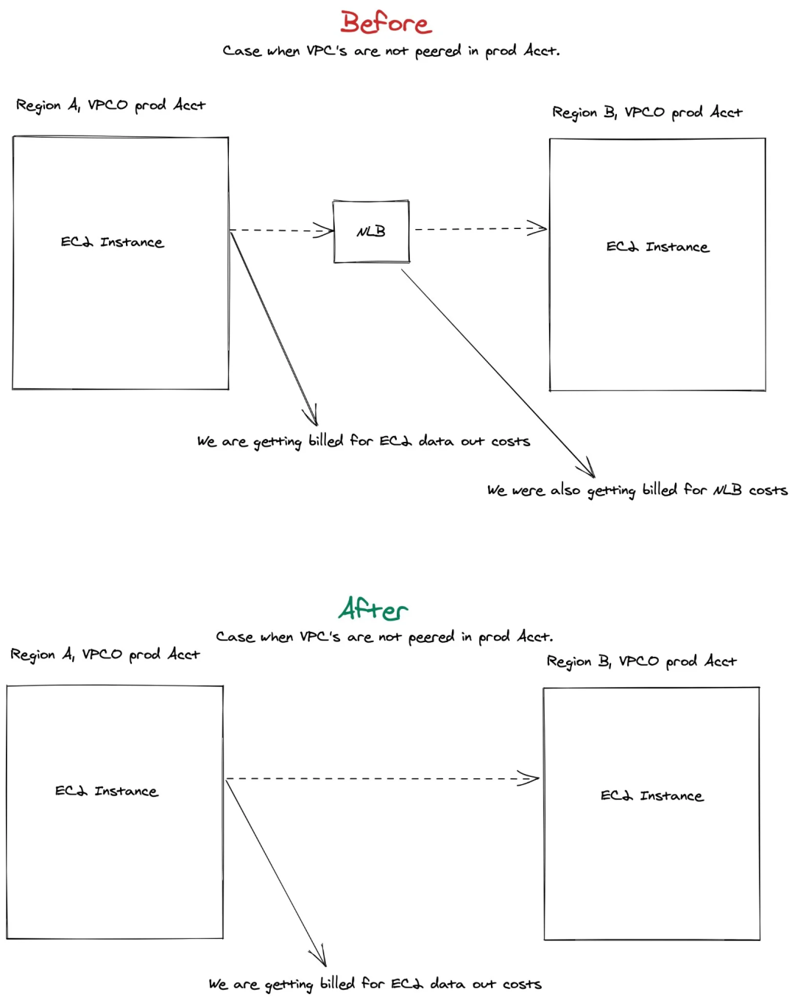
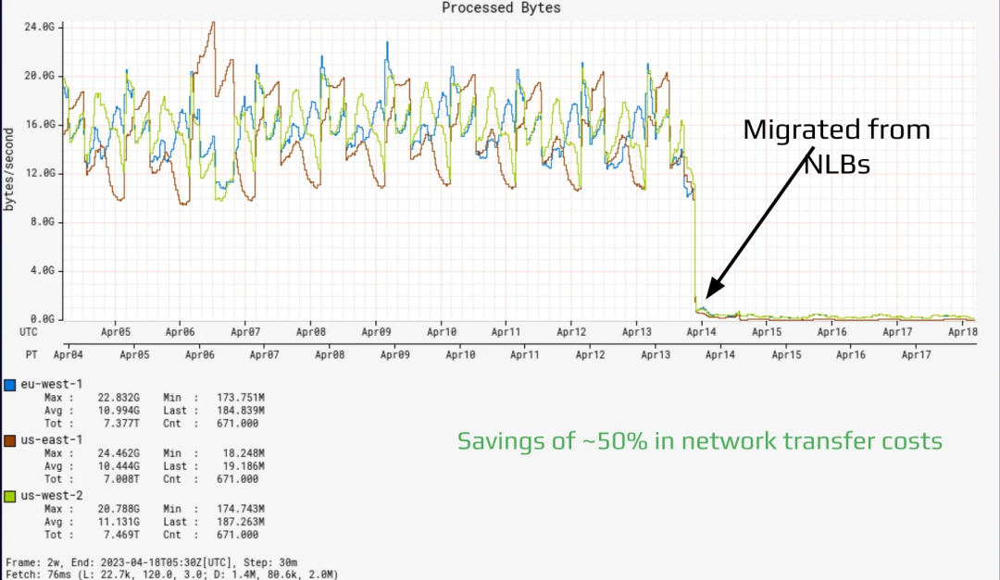

# 在 Netflix 构建全球缓存系统：深入了解全局复制

## 1 介绍

在当今这个高度互联的世界中，提供无缝且响应迅速的用户体验至关重要，尤其是对于像奈飞（Netflix）这样旨在向全球数百万人传播欢乐的全球娱乐服务而言。实现这一目标的一个关键挑战是确保多个区域数据的可用性。这就是分布式缓存发挥作用的地方了。  

分布式缓存是一种跨多台服务器存储数据以确保快速访问和高可用的方法。它有助于减少后端数据库的负载，并加快数据检索速度，从而提供更流畅的用户体验。  

在本文中，我们将深入探讨 Netflix 如何使用分布式缓存解决方案 EVCache 来掌控全局复制的复杂性。我们将探索其架构、设计原则和创新策略，它们使 Netflix 能够在保持严格性能标准的同时实现大规模的运营。

## 2. EVCache： Netflix 缓存解决方案的支柱
EVCache 是指短暂易失性缓存（Ephemeral Volatile Cache）。它是一个基于 Memcached 的分布式键值存储，旨在提供线性的可扩展性和强大的弹性。尽管它名为 EVCache，但其受益于 SSD 的支持，SSD 可确保其可靠且持久的存储。

尽管 Memcached 默认情况下不使用 SSD 进行持久化，但它的 extstore 扩展允许将不太频繁访问的数据卸载到 SSD，从而为频繁访问的数据释放 RAM。Netflix 在 EVCache 中利用了这一点，将 RAM 的速度与 SSD 的容量相结合，从而优化性能和存储效率。

Netflix 的 EVCache 部署在四个区域，包括 200 个 Memcached 集群，这些集群经过定制，专门用于支持各种用例。每个集群负责为一个应用程序或一组应用程序提供服务。这个庞大的基础设施包括 22000 个服务器实例，使系统能够在全球范围内处理 3000 万个复制事件，每秒处理 4 亿次总体操作。在数据方面，EVCache 管理着约 2 万亿个条目，总计 14.3 PB，展示了其巨大的容量和可扩展性。

**EVCache 的主要功能：**

+ **全局复制（Global Replication）**：EVCache 将无缝的全局复制集成到客户端中，实现了高效的跨区域数据访问。
+ **拓扑感知客户端（Topology-Aware Client）**：EVCache 客户端能够感知服务器的物理和逻辑位置，从而优化数据检索和存储。
+ **弹性（Resilience）**：EVCache 旨在承受各种级别的故障，包括实例、可用区以及区域级别。
+ **无缝部署（Seamless Deployments）**：EVCache 支持无缝部署，无需停机或服务中断即可进行更新和更改。

## 3. 为什么要复制缓存数据？

快速的数据可用性对于保持无缝且响应迅速的用户体验至关重要。通过保持缓存数据随时可访问，该系统避免了耗时且资源密集的数据库查询。这种即时访问可以保持用户的参与度和满意度。如果发生区域故障转移，在故障转移区域中提供缓存数据可确保以最小的延迟提供不间断的服务，从而防止对用户造成任何明显的中断。这种级别的性能和可靠性对于满足用户期望和保持高参与度至关重要。

构建个性化推荐需要大量的计算资源，特别是对于 Netflix 来说，机器学习算法是关键。为缓存丢失而重新计算数据可能会耗费大量 CPU，并且成本高昂。每次缓存丢失都需要大量的计算能力来检索和重新计算数据，包括运行复杂的机器学习模型。通过跨区域复制缓存数据，Netflix 最大限度地减少了这些昂贵的重新计算过程，降低了运营成本，并确保了更流畅的用户体验。这允许快速访问数据并高效地提供个性化推荐，从而使系统更具成本效益和响应能力。

## 4. 全局复制服务的设计  

两个区域之间的数据复制

上图说明了 EVCache 是如何跨区域复制数据的。该过程包括以下步骤：

1. **发送突变（Send Mutation）**：应用通过 EVCache 客户端向本地 EVCache 服务器发送 set、add、delete、touch 等各种突变调用。
2. **发送元数据（Send Metadata）**：EVCache 向 ++Kafka++ 发送一个包含元数据的异步事件。该元数据包括关键信息，如密钥、TTL（生存时间）以及创建时间戳。然而，它特别排除了某些值，以防止潜在的大数据有效负载使 Kafka 过载。
3. **轮询消息（Poll Messages）**：复制读（Reader）服务持续从 Kafka 读取消息。该服务负责处理和准备下一阶段的元数据事件。
4. **本地读取（Local Read）**：从 Kafka 读取元数据后，复制读服务向本地区域的 EVCache 服务器发出读取调用，用以获取密钥的最新数据。该步骤可确保在不给 Kafka 带来过载的情况下检索最新值。此外，读服务可以过滤掉不需要的消息，例如那些 TTL 非常短（例如 5 秒）的消息，从而可根据业务需求优化复制程序。
5. **跨区域流量（Cross-Region Traffic）**：然后，复制读服务对目标区域中的复制写（Writer ）服务进行跨区域调用。该调用包括所有相关信息，如元数据和获取的值，以确保可以准确地复制数据。
6. **目标写入（Destination Write）**：复制写服务接收跨区域调用后，将键值对写入目标区域中的 EVCache 服务器。该步骤可确保跨区域一致地复制数据。
7. **读取数据（Read Data）**：在故障转移区域读取数据时，由于复制过程，数据随时可用。这确保了最小的延迟，并提供了无缝的用户体验。

### 复制系统中的错误处理

Netflix 复制系统中的错误处理

在分布式系统中，复制过程的任何步骤都可能发生故障。为了确保数据的可靠性并保持复制过程的完整性，Netflix 采用了 Amazon Simple Queue Service（SQS），它具有可靠的消息队列功能，可进行稳健的错误处理。

当复制过程的任何步骤发生故障时，都会捕获失败的突变并将其发送到 SQS 队列，以确保不会丢失失败的突变，并且可以稍后重试。复制服务监控 SQS 队列中失败的突变，并在检测到突变后通过复制工作流重新处理它们。这种重试机制确保了可最终处理所有突变，保持跨区域数据的可靠性，并最大限度地降低数据丢失的风险。

Closer Look into the Replication Reader and Writer Service

## 5 深入研究复制读 / 写服务  

多个读服务实例将数据复制到不同的区域

上图展示了 Netflix 的复制服务。US-EAST-1 中的读服务从 Kafka 主题和分区中提取数据，对其进行处理，并将其发送到其他区域的写服务，写服务将数据写入到 EVCache 服务器，以确保区域的可用性。

### 复制读服务（Reader）  

读服务（Reader）从 Kafka 中提取消息，应用必要的转换，并从本地 EVCache 服务中获取最新的值。为了简化管理，Netflix 使用单个 Kafka 集群作为复制服务，该集群支持 200 多个 EVCache 集群。每个 EVCache 集群在 Kafka 中表示为一个主题，主题根据它们处理的事件量进行分区。

  

在读服务中，指定了不同的消费组从这个 Kafka 集群中读取数据。每个消费组对应一组节点，每个节点负责读取多个分区。这种结构允许并行处理和有效的负载分配，可确保高吞吐量和高效的数据处理。每个消费组针对不同的区域，可确保数据在多个区域之间的复制。  

读服务托管在 EC2 实例上，提供可扩展性和弹性。每个读取服务都是一个计算集群，一组相互连接的计算机（节点）协同工作，执行复杂的计算和数据处理任务。通过将读服务组织成消费组，Netflix 可以水平（横向）扩展系统以满足需求。  

在读服务获取并转换必要的数据后，它会向目标区域中的写服务发起跨区域调用。转换涉及将提取的数据（包括密钥、元数据和值）转换为适合通过 REST 传输的 JSON 格式。该调用包括所有相关信息，以确保可准确地复制数据。

### 复制写服务（Writer）
写服务的主要功能是接收来自读服务的 REST 调用，并将数据写入到目标 EVCache 服务中。写服务也托管在 EC2 实例上，以提供可扩展性和弹性。在接收到数据后，写服务对其进行处理，并将键值对写入目标区域中的 EVCache 服务器中。这确保了跨区域的数据可用性。写服务旨在高效处理大量数据，维护复制过程的完整性，并确保系统能保持稳健可靠。

## 6 为什么我们选择客户端发起的复制而不是服务器端发起的复制呢？
对于 EVCache，我们选择用客户端发起（Client-Initiated）的复制，主要是因为 EVCache 客户端具有拓扑感知能力。这种拓扑感知允许客户端在分布式缓存环境中高效地管理和路由数据。具体来说，EVCache 客户端可感知：

+ **节点位置**：客户端知道 memcached 节点的物理或逻辑位置。这包括哪些节点位于哪些数据中心或区域的信息。
+ **节点可用性**：客户端知道哪些 memcached 节点当前可用且可操作。这有助于避免节点停机或遇到问题。
+ **数据分布**：客户端了解数据在 memcached 节点之间是如何分布的。这包括了解哪些节点持有特定数据项的副本。
+ **网络延迟**：客户端可以根据网络延迟做出决策，选择能为读写操作提供最快响应的 memcached 节点。

### 客户端发起复制的优点
**拓扑感知**：如前所述，EVCache 客户端的拓扑感知使其能够对数据路由和复制做出智能决策。这确保了高效的数据分发，并最大限度地减少了延迟。

**减少服务器负载**：通过在客户端侧发起复制，我们减少了服务器的计算负担。这样，服务器就可以专注于其核心职责，例如处理读写请求，而不会增加管理复制任务的开销。

**可扩展性**：客户端发起的复制允许更直接的水平（横向）扩展。随着客户端数量的增加，复制工作负载将分布在这些客户端上，从而防止出现任何单点瓶颈，并确保系统能够处理增加的负载。  

**灵活性**：通过客户端发起的复制，可以更容易地在客户端侧实施和管理各种复制策略和优化。这包括过滤掉不需要的消息、应用特定于业务的规则，以及根据当前条件动态调整复制行为。

### 客户端发起复制的缺点
  

**客户端管理中的复杂性**：在客户端侧管理复制逻辑可能会引入复杂性。确保所有客户端都使用最新的复制逻辑，并处理客户端之间潜在的不一致性，这可能是一项挑战。

  

**网络流量增加**：客户端发起的复制会增加网络流量，因为每个客户端都负责跨区域发送复制数据。与集中式的服务器端发起的方法相比，这可能会导致更高的带宽使用率和潜在的网络拥塞，在集中式的服务器端发起的方法中，可以在服务器侧更有效地管理和优化复制流量。

  

**消息重复**：由于每个客户端都负责发起复制，因此可能会出现重复工作，特别是在多个客户端处理类似数据的情况下。这可能会导致效率低下和资源消耗增加。

  

**错误处理**：在客户端侧实现稳健的错误处理和重试机制可能比集中式的服务器端发起的方法更复杂。在网络故障或客户端崩溃的情况下确保数据的可靠性又会增加一层复杂性。

## 7 效率提升
Netflix 一直在寻求优化其基础设施的性能和成本效率。EVCache 复制过程的两项重大改进是实现了批处理压缩并移除了网络负载均衡器。

### 批处理压缩
为了减少网络带宽的使用，我们对从读服务传输到写服务的数据进行了批处理压缩。该过程涉及对多条消息进行批处理，并对批处理应用 ++Zstandard++ 压缩。通过在传输前压缩数据，我们将网络带宽使用量减少了 35%。这一显著的优化不仅降低了成本，还提高了复制过程的整体效率。批处理压缩可确保读写服务集群之间的数据传输更高效，从而减少了开销并提高了吞吐量。  

压缩与未压缩的有效负载大小的比较

  

此图说明了在各种用例和集群中总体有效负载大小的减少情况。由于每个集群的流量模式不同，我们观察到网络吞吐量累计节省了约 35%。

### 移除网络负载均衡器
最初，我们使用网络负载均衡器（Network Load Balancers，NLB）来管理读写服务之间的通信。然而，这种设置产生了额外的网络传输成本。为了解决这一问题，我们从使用 NLB 转向了利用 Eureka DNS 进行服务发现。使用 Eureka DNS，我们可以获取写入节点的 IP 地址并自己处理路由。这一变化将网络传输成本降低了 50%，同时保持了可预测的延迟和高效的负载分配。

  

有无 NLB 的通信拓扑比较

  

切换成客户端负载均衡简化了我们的基础设施，在不影响性能的情况下显著降低了成本。通过消除对 NLB 的依赖，我们可以更好地控制流量路由过程，从而提高了资源利用率。

  

迁移前后 NLB 中的处理字节数

上图显示了通过 NLB 路由的流量。由于我们不再使用 NLB，而是开始利用客户端负载均衡，因此我们可以显著节省网络传输成本。

所有区域的每日 NLB 使用率徘徊在 45 GB/s 左右，更改后，使用率降至 100 MB/s 以下。我们仍然在架构中保留了 NLB，但将其作为备用选项。

## 8 结论
构建一个稳健、可扩展且高效的全局缓存系统对于 Netflix 提供无缝的用户体验来说至关重要。通过利用 EVCache 和精心设计的复制服务，Netflix 确保了高可用性、低延迟和成本效益。拓扑感知的 EVCache 客户端与客户端发起的复制相结合，实现了高效的数据管理和路由，从而降低了服务器负载，并增强了可扩展性。

  

通过精心的设计选择，例如使用单个 Kafka 集群进行简化管理和实施灵活的复制读服务，Netflix 优化了它的缓存基础设施，可处理多个区域的大量数据。这确保了数据始终可用，即使是在故障转移的场景中也是如此，从而保持了无缝且响应迅速的用户体验。

  

随着我们继续不断的改进和创新，我们期待进一步增强我们的系统，以满足全球用户群不断变化的需求。通过不断改进我们的方法并采用新技术，Netflix 旨在为全球用户提供更具弹性、响应更快、更具成本效益的体验。

### 作者介绍
**Sriram Rangarajan** 是 Netflix 的高级分布式系统工程师。Sriram 在工程软件和基于 Web 的解决方案方面拥有丰富的经验知识，尤其擅长中间层服务器端的后端开发。

Prudhviraj Karumanchi 是 Netflix 数据平台的一名高级软件工程师，复制构建大规模分布式存储系统和云服务。Prudhvi 目前领导着 Netflix 的缓存基础设施。在加入 Netflix 之前，Prudhvi 曾在 Oracle、NetApp 和 EMC/Dell 等大型企业工作，负责构建云基础设施，并为文件、块和对象存储系统做贡献。

**查看原文链接：**

[https://www.infoq.com/articles/netflix-global-cache/](https://www.infoq.com/articles/netflix-global-cache/)

> 更新: 2025-03-17 16:56:45  
> 原文: <https://www.yuque.com/u12222632/as5rgl/xglga81r7r3udtgo>