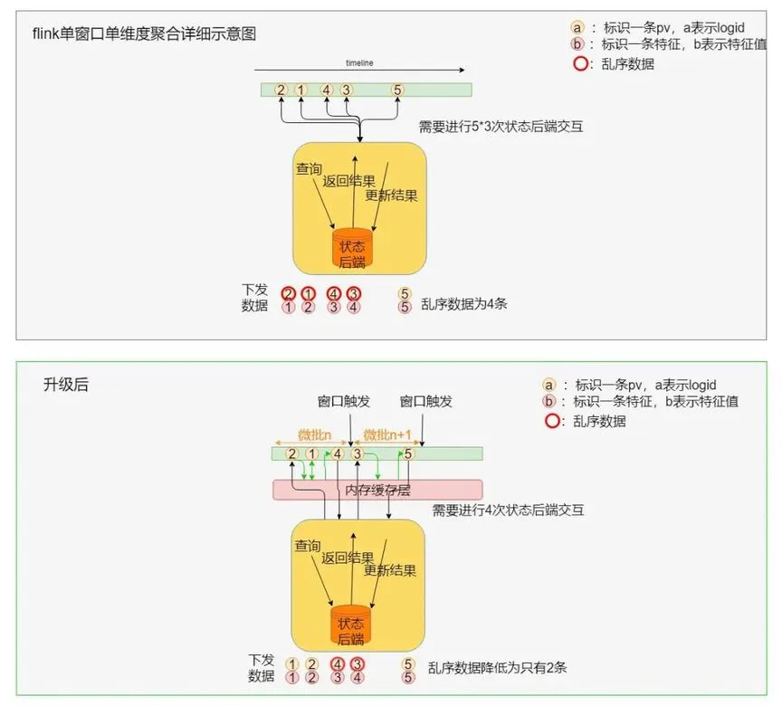

# 基于 Flink 的配置化实时反作弊系统

# 导读
本文详细阐述了基于 Flink 构建的实时反作弊流式过滤系统，针对大流量场景下的复杂特征计算、高频策略热更新、模拟过滤验证及多场景数仓对接等核心挑战，提出来多项解决方案，实现了秒级特征计算的实时过滤功能，有效支撑高并发场景下的精准风控判定，并通过 ClickHouse 与图灵双链路数据输出，满足实时监控与离线分析的多样化需求，为互联网业务提供了高吞吐、低延迟、强稳定的实时反作弊解决方案。

# 01 简介
在互联网业务高速发展的今天，反作弊已成为 APP 厂商生态稳定运行的重要保障。作弊行为层出不穷，包括恶意点击、刷单、羊毛党等，这些行为不仅会破坏平台公平性，还可能造成巨大的经济损失。因此，构建一个高效、灵活、可扩展的实时反作弊系统变得尤为重要。

  

反作弊系统根据业务属性和时效性可分为三类：在线反作弊、实时反作弊与离线反作弊。其中，在线反作弊具备最高的时效性，能够即时响应风险；离线反作弊依托最全面的信息，支持深度分析与建模；而实时反作弊则兼具二者优势，提供平衡的时效性与信息丰富度。

  

在线反作弊系统通过快速处理简单指标进行判断，例如分析当前请求携带的字段信息，并结合基于 Redis 的简单累计值（如访问频率或特定行为计数）来制定策略。这种系统以低延迟为核心，能够在毫秒级别响应反作弊判定结果，适用于拦截时效要求高的风控需求。

  

离线反作弊系统通过对完整的离线数据进行大规模、长周期的数据挖掘和样本分析，为优化线上策略、构建特征黑产库和训练高精度模型提供支持。然而，由于依赖离线数据的批量处理，其时效性相对较低，通常难以满足实时风控的需求，更适合用于长期策略优化和深度分析场景。

  

实时反作弊系统能够在秒级别和分钟级别对用户的异常行为做出反馈，及时识别作弊用户并对业务进行止损。虽然其时效性略低于在线反作弊，但得益于对丰富维度和行为序列特征的分析，实时反作弊可以实现更加精准的策略判定，在精准性与时效性之间达到良好的平衡。

  

  

本篇文章我们将重点分析实时反作弊流式系统的相关实现。

# 02 流式系统面临的核心问题
在实际建设过程中，我们需要解决以下关键挑战。

## **2.1****复杂的特征计算**
在实时反作弊场景中，用户行为数据规模庞大且动态变化（如电商大促、搜索点击等），系统需要处理海量的用户行为数据，并需基于时间窗口快速计算多维特征（如用户点击频率、IP 集中度、设备关联账户数）。这些特征需覆盖不同窗口粒度（秒级、分钟级、天级）和窗口类型（滑动、滚动、会话窗口），以捕捉异常行为模式。

  

+ **窗口特征计算的挑战（多维度多窗口多指标聚合）**：反作弊策略通常需要基于不同时间窗口（如分钟级、小时级、天级），不同维度（用户、设备、IP 等）进行特征累积计算。例如，计算某个用户在过去 1 小时内的点击次数，或者某个 IP 在过去 24 小时内的访问频率。这些计算涉及滑动窗口、滚动窗口等多种窗口类型，计算量大且复杂。
+ **数据乱序问题**：网络延迟或分区消费不均可能导致事件乱序到达，若未正确处理，会导致特征计算不准确，进而影响反作弊策略的判定。
+ **高并发下的状态存储优化**：在高并发场景下，特征累积计算需要频繁访问状态后端（如 RocksDB），导致性能瓶颈。例如，当 QPS 达到数十万甚至上百万时，状态后端的访问压力会显著增加，影响系统的吞吐量和延迟。长周期窗口（如月级）到期时，大量 Key 需同时清理状态，引发瞬时资源争抢，导致作业卡顿。

  

详见 3.2 大规模窗口特征计算，通过 内存缓存+微批处理减少状态访问、事件时间排序缓解乱序影响、keyBy 和 trigger 优化降低状态后端压力，最终支撑高吞吐场景下的精准计算。

## **2.2****高频的策略更新迭代**
反作弊策略需要快速响应新型作弊行为。例如，当出现新的刷单手段或恶意点击行为时，风控团队需要迅速调整策略，以应对新的威胁。此外，不同业务场景（如广告点击、电商交易、社交互动）的反作弊策略差异较大，策略的复杂性和多样性增加了系统维护的难度。

  

+ **高频迭代需求：**
+ 反作弊策略需要根据业务需求和作弊手段的变化进行高频更新，传统开发模式（修改代码→测试→发布）无法满足时效性。部分策略需“热生效”，避免作业重启导致数据丢失或计算中断。
+ **策略复杂性升级：**
+ 多规则嵌套：单一策略可能需组合字段匹配（如 IP 黑名单）、模型评分（如行为异常概率＞90%）、时间窗口特征（如近 5 分钟同一设备注册账号数＞3）等多层条件，这些策略的复杂性增加了开发和维护的成本。
+ **配置管理风险**：
+ 人工修改配置文件易出错(如语法错误、字段误配),导致作业崩溃或策略漏判。

  

详见 3.3 配置化，通过全流程的配置化升级和配置文件托管，将策略规则、特征计算、字段抽取等逻辑抽象为配置文件，支持快速策略调整和上线，减少对底层代码的依赖，提升策略迭代效率。

## **2.3****模拟过滤的支持**
在反作弊策略上线前，风控团队需要对策略进行测试和验证，以确保其有效性和稳定性，这一过程称为模拟过滤。在实时反作弊系统中，模拟过滤是策略上线前的核心验证环节，其必要性体现在以下三个关键维度：

  

提前规避线上风险，防止“误杀”与“漏杀”：直接在生产环境上线新策略存在风险，可能导致误判或漏判，影响业务正常运行。因此，需要在测试环境中对策略进行模拟过滤，确保其准确性和稳定性。

  

验证策略性能，避免作业过载：模拟过滤历史峰值流量（如大促期间数据），验证作业在极限负载下的稳定性。

  

历史回溯与极端场景覆盖：从 HDFS 读取数月前的全量数据（如黑产攻击事件日志），验证策略对历史攻击的检测能力和进行数据回溯。

  

  

详见 3.4 模拟过滤的实现，通过配置化、线上流与测试流隔离、数据 Source 改造等方式，加速策略效果验证环节。

## **2.4 多场景数仓对接与平台整合**
我们的系统产出的数据需要支持业务方的复杂分析需求。例如，基于反作弊结果进行策略优化，实时监控作弊行为的影响，对历史数据进行深度挖掘。

  

目前我们支持多种数仓形式（如实时 ClickHouse 与离线 Hive）的数据产出，满足不同业务场景下的需求，包括实时数据看板、策略评估、历史回溯等应用。

  

+ 数据产出的便利性：反作弊系统需要将计算结果输出到多种存储系统（如 ClickHouse、Hive、Redis 等），以满足不同业务场景的需求。例如，实时数据需要写入 ClickHouse 用于实时监控，离线数据需要写入 Hive 用于历史分析。
+ 自助分析能力：业务方需要对反作弊结果进行多维度的分析，例如按时间、地域、用户群体等维度进行统计分析。传统的固定报表无法满足这种灵活的分析需求。所以支持业务方进行自助分析，能够根据需求灵活查询和分析数据，而不依赖开发团队的支持。

  

详见 3.5 便捷的数据分析，通过将反作弊结果输出到 ClickHouse 和 Hive，支持实时和离线分析。同时，接入 TDA（Turing Data Analysis 自助分析平台），业务方可以通过简单的 SQL 查询或可视化工具，灵活分析反作弊数据，满足复杂的分析需求。

# 03 反作弊流式框架介绍
## **3.1 反作弊系统整体框架**
整个实时反作弊的生效流程图如下：

  

  

上图展示了 Flink 反作弊流式实时过滤系统 的整体架构，包括 风控平台、实时作业、外部存储 三大核心模块，整体流程如下：

  

+ **风控平台（配置分发）**：反作弊工程师在平台上编辑策略规则、配置特征计算逻辑，并一键生成配置文件和启动模拟过滤验证策略效果。测试通过后，策略配置通过平台分发至实时作业。
+ **实时作业（配置解析与执行）**：Flink 作业解析平台下发的配置文件后，构建作业各个模块，包括数据接入、ETL 处理、特征计算、规则匹配等，最后提交并执行流式任务。
+ **作业结果存储（结果输出）**：ClickHouse，存储实时计算结果，支持快速查询与监控。Hive：存储离线数据，用于历史回溯与深度分析。Redis：提供低延迟查询，支持在线服务实时访问反作弊结果。消息队列：将判定结果传输至下游业务系统，供下游实时决策。

  

Flink 作业内部，实时流运行各个模块拆解如下：

  

  

流式作业的主要模块可以分为：

  

+ **数据接入 Source**：业务事件日志数据（用户行为、支付、点击、搜索等）接入。
+ **数据 ETL 处理**：数据清洗、转换、标准化；简单维度拼接（ip 映射城市等）；第三方字段请求（风险评分、黑设备、用户画像等）。
+ **多重窗口特征计算**：时间窗口（分钟级、小时级、天级、周级、月级）、滑动、滚动窗口等，多种维度多种聚合函数进行特征累积聚合。
+ **Join 阶段**：负责将特征和原始日志进行 join。
+ **规则策略匹配与判定**：机器学习模型打分，配置化规则引擎基于之前的所有信息进行最终判定。
+ **下游输出**：实时反馈给线上服务、下发给业务方、入数仓表等方式将判定结果进行输出落盘。

## **3.2 大规模窗口特征计算**
对于整个作业而言，主要计算资源就是用于累积基于窗口的特征。对于业务需求而言，不同窗口下的特征聚合结果是提升判定的准确率和召回率最重要的信息。

  

我们的窗口累积逻辑主要基于 Flink 窗口功能实现，包括 TumblingWindows、SlidingWindows 和 SessionWindows，Session 窗口使用较少。我们未使用其原生 Aggregate 函数，而是采用了更底层的 WindowProcessFunction 实现窗口聚合逻辑。这种方式的优势在于为后续优化提供了更大的灵活性和定制空间。

  

为了满足业务诉求，我们也对原生的窗口机制进行了多项优化，主要升级点有以下几个：

  

+ **提前触发**：无需等待窗口结束即可实时下发累积结果，满足业务对于数据时效性的要求。
+ **批量更新和抗乱序**：采用批量状态更新方式，减少频繁读取与写入，同时在微批更新时进行局部重排序，以降低乱序影响。
+ **键缩减-粗粒度 KeyBy**：优化 keyBy 和窗口触发器设计，减少状态访问频次，提高缓存命中率，降低计算开销。

  

下边将分别进行介绍。

### 3.2.1 时效性优化-提前触发
默认情况下，Flink 的每个窗口自带一个触发器（Trigger），在窗口结束时触发计算并生成聚合结果。然而，在实时性要求较高的反作弊场景中，如果窗口长度长达一天，等待窗口结束再下发结果显然不符合要求的。因此，我们需要在窗口尚未结束时，通过特定条件提前触发窗口计算，这种机制称为“**提前触发**”。

  

Flink 提供了多种现成的窗口触发方式，包括按 ProcessTime 定时触发、按 EventTime 定时触发、按固定条数触发等，同时也支持自定义触发方式。针对我们的业务需求，目前采用的是按事件时间的间隔提前触发方式。具体触发间隔依据不同业务场景设定，能够在秒级或分钟级就能得到窗口的聚合结果。

  

  

**上图:** 展示了 Flink 原生窗口的触发机制及其聚合过程。每个绿色矩形表示一个窗口，窗口范围内累积了多个事件，编号为 1、2、3 、4、5。红色圆圈表示触发时下发的特征数据，从上图可以看到，窗口触发是在窗口结束时统一执行的，下发了 2、5、3、1 四条特征。

  

**下图**：改造后 - 提前触发机制**，**展示了优化后的窗口触发机制，通过提前触发减少延迟。每个绿色矩形依旧表示一个窗口，但触发时间提前，避免了窗口结束时的集中计算，红色圆圈同样表示输出结果。提前触发机制在窗口中按事件到达顺序多次输出，窗口中的事件可以更早地被处理，提升了时效性。

### **3.2.2 乱序和性能优化-批量更新和乱序纠正**
在大流量场景下的测试表明，当前吞吐瓶颈主要受限于窗口聚合时 RocksDB 状态后端读写。由于一条数据会抽取多条特征，所以特征窗口累积算子会对 Source 输入数据进行爆炸式扩展，例如当输入数据 QPS 达到 10 万时，特征累积算子的 QPS 可能攀升至数十万甚至上百万，导致大量状态读写请求集中在 RocksDB，使其难以支撑高吞吐需求。

  

Flink 默认的窗口机制会在每条数据到达时更新累积值，并与状态后端交互，进一步加剧了 RocksDB 的负担。为优化性能，我们将窗口触发和累积调整为**微批模式**，每次批量更新数据，并引入**内存缓存层**，微批内优先访问内存缓存，有效减少状态的访问次数。

  

在百度搜索和点击流量场景下的测试结果显示，该优化方案使**内存缓存命中率提升至 90% 以上**，意味着特征累积阶段减少了约 90% 的状态后端访问。

  

同时，在微批数据内部，我们会进行排序，还能有效缓解数据乱序问题，提高计算准确性。如下图所示。

  

  

上图：Flink 默认窗口累积机制，**绿色矩形代表窗口的时间范围，窗口中的每一条数据（标记为 1、2 等）都会触发累积操作。图示中展示了 5 条 pv 的状态后端访问，每条 pv 都需要与 状态后端（图中黄色区域）进行交互，包括查询、更新、写入等操作。红色圆圈是输出的累积结果，红色边框标记的条目表示乱序数据。上图存在两个问题，第一，对状态后端的频繁随机访问会导致性能瓶颈，尤其是在高并发和大流量场景下。第二，输入数据是乱序的情况下，输出数据也是乱序的。

  

下图：优化后的窗口累积机制，**优化引入了内存缓存和微批模式。数据小批量更新（如标记为 2、1、4 为一批、3、5 为一批）。每次窗口触发时，首先会对本次微批内的数据进行排序(2,1,4 被纠正为 1,2,4)，然后再累积。累积时，窗口内的累积查询会先访问内存缓存，如果内存 miss，再访问状态后端。最终图示中仅有 4 次状态后端交互，较优化前的 15 次减少 11 次。数据乱序也得到了缓解。

### **3.2.3 大流量场景优化-键缩减(粗粒度 KeyBy)**
窗口聚合过程中累积器需要频繁读写状态后端。此前，我们通过引入缓存层和微批模式大幅减少窗口累积器对状态的访问频次，优化效果显著。然而，在实际应用中，我们发现窗口触发器（Trigger） 也会频繁访问状态后端，带来额外的性能开销。

  

在实际业务场景中，特征累积的窗口划分通常较细粒度，例如基于 ip、query、uid 进行 keyBy，且随着业务接入的线索和特征增多，key 的数量变多，计算压力进一步加大。这导致两个主要问题：

  

+ **Key 数量激增，触发频繁访问状态**：keyBy 后的 Key 量级极大，每个 Key 维护独立的 Trigger，这些 Trigger 需要不断访问状态后端进行触发注册，造成高频状态交互，影响吞吐。
+ **窗口清理（clear）导致计算压力骤增**：当水位（watermark）推进到窗口末端时，大量 Key 需要同时触发 Clear 操作，瞬时状态访问量暴增，可能导致作业卡顿甚至崩溃，特别是在窗口长度较长、窗口内 Key 数量庞大的情况下。

  

针对上述问题，我们探索了更高效的 Trigger 机制，以降低状态访问开销，提高作业稳定性。

  

**第一，减少 Trigger 数量：**

  

举个例子，我们基于 UID 进行特征聚合，如果我们在对特征数据执行 keyBy 操作时，直接按照最细粒度的 UID 维度进行分区处理。那么每个唯一的 key 都会绑定一个触发器（trigger），而触发器的数量直接影响状态访问的频次和资源占用。

  

为了解决这个问题，我们采用了按 UID 进行取模分区的方式（例如按 uid%100 进行 keyBy 分区）。这种方式显著减少了触发器的数量，从而降低了状态存储和访问的开销。同时我们定制了聚合函数，保证每个分区内进行聚合计算的时候还是会按照原本的 UID 作为 key 进行特征累积，保证特征累积的准确性。

  

**第二，状态放入内存：**

  

进一步优化时，我们发现，当按照固定数量（如 100 个分区）取模后，key 的数量和值是确定且有限的。基于此特性，我们将触发器的状态从 Flink 的状态后端迁移到内存中管理，这样能够进一步提升性能，避免频繁访问状态存储带来的开销。

  

有人可能担心：触发器状态迁移到内存后，作业一旦发生重启，内存中的数据会丢失，这可能导致窗口数据无法正常触发。例如，若按 UID 进行 keyBy 计算，某个 UID 仅有一条数据，且此时作业重启导致其触发器状态丢失，那么作业恢复后这条数据永远可能无法下发。

  

但通过固定分区取模（如按 %100 分区）后，我们有效解决了这个问题：

  

+ 取模分区的 key 数量是有限的（如 100 个），并且这样能保证每个分区会持续接收到新的数据。
+ 当作业重启时，新数据的到来会自动重新注册触发时间，即便原有内存状态丢失，后续的数据流动能够重新触发正常的处理逻辑。因此，即使触发器状态短暂丢失，取模后的分区会很快自愈，确保数据下发的正确性和完整性。

  

  

上图最左边-原始设计，数据流按照 uid 进行 keyBy 分组，每个 uid 都对应一个独立的 trigger。每个 trigger 需要与状态后端 (StateBackend) 频繁交互，包括保存和更新状态。存在问题是：状态后端需要频繁访问，尤其在高并发场景下，性能瓶颈明显。每个 uid 都维持一个独立的窗口触发器，资源消耗较高。

  

上图中间-第一版优化，将原始 uid 进行取模操作 (uid % 100)，将原本细粒度的分组合并为粗粒度的分组。即多个 uid 合并到同一个分组中，减少了窗口触发器的数量。状态后端的访问频率有所减少，降低资源消耗，提升了整体吞吐量。

  

上图右边-第二版优化，内存的引入，每个 trigger 相关的信息存储于内存中，而不是直接与状态后端交互。大幅减少状态后端的访问次数。提升了系统性能，确保作业稳定运行。

  

综上，在 Flink 反作弊系统的窗口特征累积优化中，我们针对高吞吐、低延迟、抗乱序等业务需求，进行了多项改进。

  

1.**提升时效性**：反作弊策略依赖实时特征，默认窗口触发方式无法满足业务需求。因此，我们采用提前触发机制，基于事件时间间隔触发计算，使特征聚合结果能够秒级或分钟级输出，避免长窗口带来的数据滞后问题。

  

2.**优化性能瓶颈**：在高并发场景下，特征计算涉及海量状态存储访问，容易导致 RocksDB 负载过高，影响作业稳定性。我们引入批量更新、内存缓存 、trigger 优化、分区缩减等方式，大幅提升吞吐量。

  

综合优化后，该方案使 Flink 反作弊系统具备更快的特征计算能力、更高的吞吐性**能**，有效支撑高并发业务场景下的实时风控需求。

# **3.3 配置化**
为了满足反作弊策略的高频上线和模拟过滤等需求，我们的实时系统实现了高度配置化。并且配置文件全部托管到风控平台。通过配置化驱**动**的架构，无论是字段抽取、特征加工、策略规则定义和数仓产出，均可以通过简单的配置操作快速完成，极大地缩短了开发周期，同时降低了对底层框架代码开发的依赖。只需要在风控平台上编辑好策略，就可以一键分发并启动对应的测试或线上作业。

  

  

如上图所示，相关配置文件可以分为两类分别是工程配置（绿色）和策略配置（黄色），策略配置主要用于定义业务过滤规则和逻辑，工程配置侧重于系统的底层运行，比如输入输出、并行度等配置。并且部分配置文件为非必需项，这意味着如果某个计算模块不需要使用，则相应的配置文件可以省略。

## 3.3.1 工程配置
工程配置是管理流式作业运行的系统层面参数。针对反作弊场景的实时流式任务，与 Flink CDC YAML 的设计思路类似，也是通过 YAML 文件对通用工程配置进行抽象和统一管理，确保流式作业能够灵活适配多种业务场景。

  

为了保证一个 Flink 流式作业的正常运行，完整的工程配置需要包含以下几个关键部分：输入配置、输出配置、并发配置。

  

+ 输入配置：决定了 Flink 作业如何接收和解析源数据，定义数据源类型（如 Kafka、HDFS）、连接参数、消费策略等。
+ 输出配置：定义了 Flink 作业的计算结果如何存储或传输到下游系统，指定结果存储方式（如 ClickHouse 表、Redis 集群、Kafka Topic）。
+ 并发配置：直接影响 Flink 作业的性能、吞吐量以及资源使用情况，设置算子并行度、检查点间隔等，优化作业性能。

### 3.3.2 策略配置
策略配置是指将反作弊拦截策略的核心逻辑规范化，以配置文件的形式灵活定义和管理。通过策略配置化设计，能够快速调整或部署反作弊策略，无需修改底层代码。

  

策略的配置主要由字段抽取配置、特征配置、词表配置、模型配置和规则配置等组成。

  

字段抽取配置：字段是反作弊策略和数仓的最基础的信息，根据抽取方式不同分为：

  

+ 基础字段：直接从原始数据流中提取的字段，例如设备 ID、用户 ID 等。
+ 二次计算字段：通过基础字段计算生成的派生字段，设备 ID 是否合法，UID 是否为历史黑用户等。
+ 外部服务字段：通过调用外部服务接口动态获取的字段，例如 IP 地址归属地、安全风控标签等。
+ 维表字段：通过查询词表映射关系获得的字段，例如黑名单匹配结果、分类标签等。

  

我们将字段抽取逻辑进行了配置化抽象，策略开发人员使用类似于写 sql 的方式即可完成简单字段的 etl 逻辑的开发，如常见的 json 字段抽取，字符串处理，反作弊内部的常用 UDF 等，配置能覆盖大部分字段抽取，对于复杂的字段抽取逻辑仍旧使用 Flink 的 Datastream API 开发实现。

  

特征配置：特征是策略的重要判定依据，特征配置包括以下几个关键方面：

  

+ 特征类型：数据的聚合方式，如 sum、count、distinct 等。
+ 窗口信息：设置聚合特征的时间窗口范围和窗口形式，时间范围如：1 分钟、1 小时等，窗口形式如：滑动窗口、滚动窗口等。
+ 特征维度：特征的聚合维度，如用户、设备、IP 地址等。

  

词表配置：词表通常是离线挖掘得到的黑名单、字段映射（如 ip 映射城市）等固定维表信息，配置内容需包括以下几个方面：

  

+ 词表路径：指定词表的存储位置，支持文件路径或分布式存储地址。
+ 词表类型：支持多种形式的词表，包括集合（set）、键值对映射（kv）、正则表达式（regex）等。

  

模型配置：通过模型实现复杂的行为预测和风险判定，关键配置内容包括：

  

+ 模型路径：指定模型的存储位置，支持本地或远程加载。
+ 模型类型：支持多种模型形式，例如线性回归、GBDT 等，目前模型的加载是通过 PMML 框架实现的。
+ 模型输入输出：明确模型所需的输入字段和输出字段等。

  

**规则配置**：规则配置决定了作弊行为的最终判定规则和处置方式：

  

+ 策略判定阈值：定义触发策略的条件，例如基础字段匹配、词表匹配、风险评分的阈值、特征累积阈值、模型打分阈值等。
+ 策略判黑等级：设定风险等级，区分低、中、高风险及对应的处置措施。

  

如下图所示，规则配置能够获取所有字段信息，并基于这些信息进行最后的策略判定。

  

  

这张图展示了反作弊规则的判定流程：

  

1.**输入数据**：每条 PV 包含多个字段**，**包括基础字段（如 IP、手机号、UID 等）、外部抽取字段（如 IP 归属地、是否异常等）、计算得到的特征（如统计特征 fea1、fea2 等）以及模型得分（多个模型计算的分值）。

  

2.**策略判定**：系统基于预设的反作弊规则，对各字段、特征、模型分数进行综合评估。例如，规则 1 要求【fea1 > 100 && model2 > 0.95】，规则 2 要求 【IP like '192.%' && fea2 > 100 && model1 > 0.65】。多个规则都会执行判定逻辑，判断是否命中。

  

3.**结果输出**：最终的 PV 数据会带上反作弊命中结果。例如，在示例中，该 PV 数据命中了规则 2，表明该行为可能存在风险。

  

以上就是策略配置的所有介绍，通过配置化管理字段、特征、词表、模型和规则，反作弊系统能够快速响应业务需求，灵活调整检测逻辑。同时，配置化设计大幅降低了开发部署成本，提高了策略迭代效率。

## **3.4 模拟过滤的实现**
通过配置化的支持，可以方便地切换数据输入和输出，所以仅需调整测试配置文件，即可启动模拟过滤作业，提升测试效率。同样的模拟过滤功能也接入了风控平台，开发者可以直接一键调启模拟过滤任务。

  

对于直接接入实时消息队列进行模拟过滤，基本无需修改输入配置，然而，基于实时消息队列的模拟过滤存在一定局限性，首先运行耗时较长，需要 1:1 的时间来进行测试。如过滤 24 小时数据需 24 小时，难以快速验证策略长期效果，其次消息队列仅保存最近几天的数据，历史数据回溯能力有限。一般仅适用于简单工程测试和策略模拟过滤。

  

为此，我们扩展了 Flink 的 HDFS Source 组件，支持直接读取 HDFS 上的 Parquet 文件进行模拟过滤。在读取 Parquet 文件时，因为是流式计算，主要挑战在于数据顺序问题，为确保数据时序一致性，我们采取了以下优化策略：

  

+ **文件级别排序**：在读取数据时，按照文件路径和名称进行排序，确保数据按时间顺序加载。
+ **顺序读取文件**：严格按照排序后的顺序依次读取 Parquet 文件，避免乱序问题，保证数据的时序性。

  

通过这一优化方案，我们在策略模拟过滤中与线上对比测试，准确率达到 99% 左右，大幅提升了模拟过滤的可靠性和一致性。

  

  

除了 Source 组件适配了读取离线数据外，其他组件跟线上完全一致，这样就保证了模拟过滤的准确性。极端场景下（如线上作业出错需重新回溯数据），可通过此方式对离线数据再次模拟流式过滤，实现数据修正。

## **3.5 便捷的数据分析**
在实时反作弊系统中，数据分析不仅是风控团队优化策略的核心工具，也是业务方监控风险、评估影响的重要支撑。为了满足不同角色的分析需求，系统提供了离线和实时的数仓产出，帮助进行便捷的数据分析。

  

  

上图展示了我们的数仓方案，其中 Flink 负责实时数据流的计算和处理，最终将数据分别存储到 HDFS（Parquet 格式） 和 ClickHouse。

  

+ **离线 Hive 表**：Flink 将数据以 Parquet 格式 存储到 HDFS，支持按刻钟或小时级别分区产出数据，并挂载到图灵表中，便于后续使用 Hive、Spark 进行批量计算和查询。也可以作为后续回溯和测试模拟过滤的直接输入。
+ **实时 ClickHouse 表**：支持实时数据产出，用于高性能的 OLAP 分析，可用于快速分析策略上线效果、构建实时看板以及告警监控等场景。

  

这种架构能够同时满足 实时查询 和 离线存储分析 需求，实现高效的数据流式处理与存储。

  

高效便捷的数据分析主要满足了如下需求：

  

+ **实时监控与告警**：业务方需实时了解反作弊策略的执行效果（如拦截量趋势、高风险用户分布）。
+ 基于 ClickHouse 的秒级查询能力，支持实时生成监控看板（如“近 1 小时拦截量 TOP 10 IP”）。
+ 配置告警规则（如“拦截量突增 50%”），通过邮件或消息推送及时通知相关人员。
+ **自助分析与可视化**：业务方能够灵活分析作弊行为特征（如羊毛党设备型号分布、异常行为时间规律）。
+ 接入 TDA 自助分析平台，支持 SQL 查询与拖拽式可视化分析，无需依赖数据团队。预置常用分析仪表盘，降低使用门槛。
+ **离线挖掘与模型优化**：数据同学能够于历史数据挖掘作弊模式，优化策略规则与机器学习模型。
+ 将全量数据存储至 Hive，支持 Spark、Flink 等分布式计算引擎进行进一步的复杂分析。

  

通过便捷的数据分析能力，系统不仅提升了风控策略的迭代效率，还赋能业务方自主探索数据价值，实现从“被动响应”到“主动洞察”的转变。

# 04 总结
本文介绍了基于 Flink 的实时反作弊流式过滤系统，围绕架构设计、挑战应对及优化方案展开。通过特征计算和配置化管理，提升了系统的检测效率和稳定性。实践表明，该方案在提升数据处理时效性与反作弊效果方面均取得显著成效。未来，将进一步优化策略检测机制，提升检测精准度，并探索更智能的风险识别手段。

  

------END-----

> 更新: 2025-03-17 17:01:49  
> 原文: <https://www.yuque.com/u12222632/as5rgl/lzgy7h675g3aloh6>