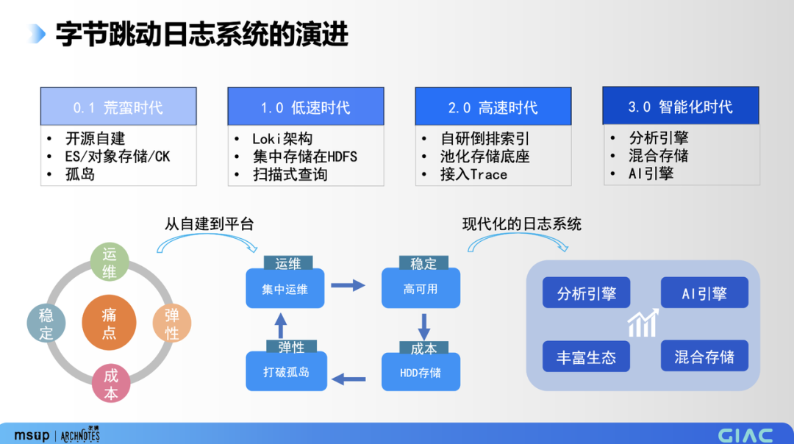
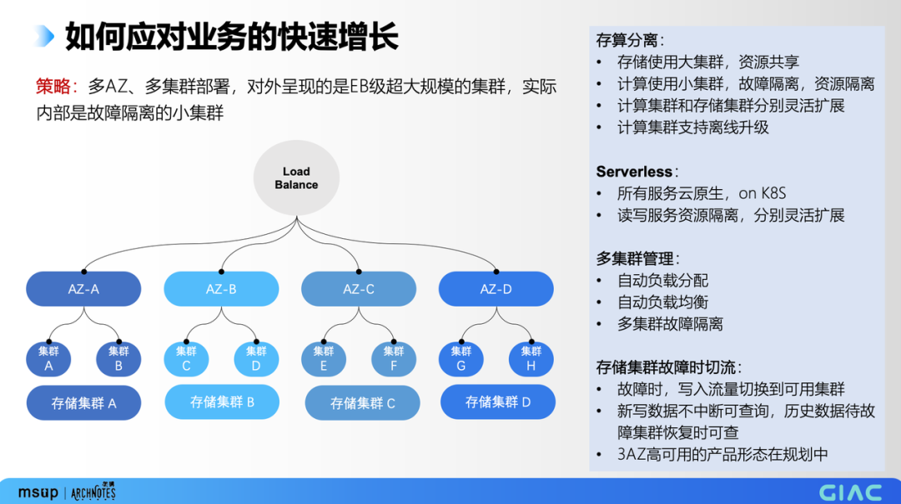
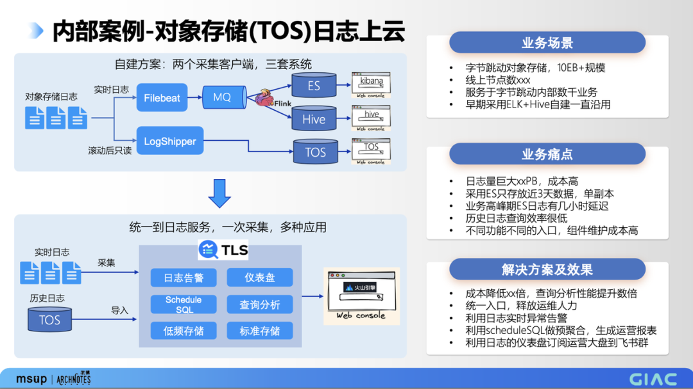

# 字节跳动 EB 级日志系统设计与优化实践

日志在可观测技术发展的早期是用做故障回顾的。 我们通过 metrics 发现指标异常，比如成功率下降，然后通过 trace 找到了有异常的某个服务，最后才通过日志找到具体的原因（接口返回异常）。 在现代日志系统里，这些都可以通过日志来一站式解决： trace 本身就是一种特殊格式的日志，metrics 可以通过日志来实时生成。

日志主要有三个明显优势：

+ 生成和采集非常容易，基本上各个编程语言都有日志框架；
+ 采集是旁路的，不需要用户系统做任何改造。日志生成到文件，日志采集器去读文件后采集到日志系统；
+ 保留了大量的细节。

日志的挑战也很明确：日志量大，流量容易突发，非结构化的数据难以利用。

本文将主要探讨如何解决日志面临的挑战。

**字节跳动日志系统介绍**

**EB 级日志系统 TLS（Tinder Log Service）**

字节跳动在集团内部和火山引擎（公有云）是一套统一的日志系统 TLS（Tinder Log Service），下面简称 TLS。集团内部包括抖音、头条、飞书、懂车帝在内的大部分用户的日志都是在 TLS 上。用户的日志包含了运营、运维、审计和 Trace 等类型的日志。TLS 对用户提供采集、存储、加工、查询分析、告警、消费、投递等功能。大家知道字节跳动的业务规模增长比较迅猛、最近的抖音电商也是快速增长，TLS 经受住了业务快速增长导致日志规模快速增长的考验。

**TLS 的演进**

早期字节跳动没有统一的日志系统，各业务系统存在日志需求，不得不各自自建，选用的方案五花八门，有基于 ELK 的，有基于 Clickhouse 的，也有基于对象存储+Hive 的。自建的日志系统存在稳定性不足、运维复杂、成本高、弹性不足等诸多痛点，于是我们构建了日志的 1.0 系统。因为主要是运维日志，我们调研了业内开源的一些方案，综合需求和进度要求，最终选择了类似 Loki 的方案。

Loki 是 Grafana 旗下一款开源的日志低成本解决方案，没有全文索引，查询日志主要通过扫描。日志 1.0 的数据存储在 HDFS 上，采用扫描式查询，解决了自建系统的稳定性不足、运维复杂、成本高和弹性不足的问题。但是日志 1.0 有一个问题没有解决，那就是性能。因为没有索引，所以查询速度很慢，有同学调侃，查日志的时间，都可以去泡杯咖啡了。

1.0 显然不能满足客户的需求，所以我们又马不停蹄的开发了日志 2.0，我们在 1.0 的基础上增加了自研的倒排索引，同时把底层存储更换为了字节内部自研的池化存储 bytestore，2.0 上线后查询性能得到了很大的提升，所以我们把 trace 的数据也接入进来了。

随着业务系统的进一步演进，只有索引还是不够的，因为有很多用户希望能基于日志来做运营分析，需要实时的日志报表分析，日志告警等能力。因此我们又开发了日志 3.0（TLS），我们认为 TLS 是一个比较现代且全面的日志系统。日志 3.0 在 2.0 的基础上增加了列存、OLAP 分析引擎以及智能 AI 引擎，同时底层存储也引入了高性能的混合存储。为了满足业务系统多样性的需求，我们还加大了在生态兼容方面的投入，3.0 时代，日志规模也达到了 EB 级。

**字节跳动日志系统 TLS 的设计优化实践**

**现代日志系统的核心属性**

在我们看来，一个现代的日志系统具备以下几个方面的核心属性：

+ 高性能：实时的日志系统必须具备查询分析百亿行日志秒级返回的能力。
+ 弹性 &高可用：日志的量不好预估、存在突发，必须要具备弹性能力；高可用是基本的稳定性诉求。
+ 高效率：海量的数据只有在成本足够低的时候才能发挥出重要的价值，要让用户能用的起，所以要提升日志系统的效率，降本增效。
+ 生态兼容：适应用户业务系统的多样性，让更多的用户能方便的接入，让更多的日志发挥出价值。
+ 丰富的功能：日志加工、可视化仪表盘、日志告警满足用户的多样化需求，适应更多场景的日志。
+ 智能化：智能化有两个方面，一是日志系统具备智能运维 AIOPS 的能力，包括日志聚类、智能文本分析、机器学习算子；另外一个是提供智能助手，帮助用户写 SQL，写正则，用自然语言生成图表等。

**为高性能而设计的数据组织方式**

TLS 对外提供写入、消费、查询、分析四个数据面的重要接口，这几个接口的性能决定了 TLS 的性能。

+ 日志原文：日志顺序写入，顺序读取，是消息队列相似的接口，所以我们也按消息队列的方式来组织数据。原文以 append 的方式写入到底层存储，顺序读取消费。我们按日志到达服务端的时间构建了时间的稀疏索引，用于获取消费位点。同时为了能够对流量进行控制，我们引入了 shard 的概念，每个 shard 是一个顺序的性能流，类似于 Kafka 的 partition，用户需要保序的时候可以指定 shard 写入，需要高性能的时候可以分散到多个 shard 做负载均衡。
+ 索引：用户需要通过关键字查询日志原文，为了提升查询效率，我们构建了倒排索引。倒排索引存储了关键字和日志行号的对应关系，查询关键字的时候直接获取日志行号，不用做扫描查询。用户查询是指定时间窗口查询的，我们在索引里存放了日志的时间。为了减少查询时间窗口内的数据量，我们做了个优化，把时间相近的日志存放在一起，并以小时为切分单位来分组存放。查询某一个小时内的日志只需要处理对应小时的分组，其它小时的分组可以直接跳过。同时按小时分组存放还有一个好处，小时内的索引只需要存放小时内的时间，如果精确到秒用 0-3599（12 位） 就可以表示时间，大大缩小了时间字段的存储空间。因为数据量少了，一次 I/O 可以读更多的有效数据上来，也提升了时间过滤的效率。
+ 列存：OLAP 引擎分析数据最高效的就是列式存储了，因为对某一个字段的聚合分析不需要读取别的字段。还是上面的那个道理，相对于行存，列存一次 I/O 可以读取更多的有效数据，自然就提升了性能。TLS 为了适应小流量的场景，列存的切分窗口设置为按天切分，如果按小时切分一些小流量的场景列存会切的太碎，I/O 太小读取效率不高。
+ 存储：TLS 的这三种类型的数据都统一存放到了字节跳动内部的池化存储 bytestore，池化存储通过 EC 做数据冗余，保证数据的可靠性。

**系统架构**

这是 TLS 的系统架构，分为存储集群、计算集群和管控集群。 重点介绍一下计算集群的组件：

+ API Gateway：用户操作的统一入口；
+ ShardServer：原文引擎，负责原文的写入、消费、索引查询到 行号后返回日志原文；
+ Query：OLAP 查询分析引擎，负责列存 SQL 分析和查询结果的聚合；
+ IndexServer：索引、列存的写入构建；
+ SearchServer：索引查询。

可以看到我们的系统架构遵循了三个原则：

+ 存算分离：计算和存储可以分别扩展，这是为了弹性而做出的选择。
+ 读写分离：也是为了适应弹性做出的选择。前面介绍过字节内部的日志系统是从扫描查询演进过来的，有非常重的读，计算节点会把 100G 的网卡读带宽打满。所以对我们来说，读写分离很重要，一方面是读写资源隔离，另一方面业务系统也在向索引查询切换，需要足够的弹性来支撑这种迁移。
+ 数据面和管控面分离：数据面和管控面是完全分离的。数据面有完整的配置信息缓存，管控面故障时，数据面的业务不会中断。

**多级缓存和热点消除**

增加缓存是提升性能最有效的手段，我们在系统的多个层级都设置了缓存。

+ ShardServer：近期写入的数据马上就会被消费，所以 shardserver 在数据落盘的同时在内存里保存了最近写入的数据，保证索引消费、实时消费、投递都能在缓存里命中。
+ IndexServer：缓存索引列存构建的元数据信息，包括索引、列存文件清单，索引的 meta 信息以及列存的 footer 信息，查询的时候从 IndexServer 实时获取才能查询到最新的数据。
+ Query：Query 上有元数据缓存，中间结果缓存，数据缓存。重点提一下中间结果缓存：因为查询分析命令大部分都是分析最近时间点的数据，所以直接缓存结果大多是无效的，我们需要的是一个中间结果的缓存，联合最新写入的数据和之前查询的中间结果缓存一起计算出当前查询的结果后返回，中间结果的缓存命中率是很高的。
+ SearchServer：Searchserver 的缓存和 query 类似，SearchServer 是索引查询的缓存，query 是 SQL 分析的缓存。
+ Bytestore：Bytestore 上会缓存热点数据，主要是对物理盘的缓存。

缓存可以提升系统的性能，但缓存要么是全局的，要么就要有亲和节点。我们的缓存是按节点亲和的，会碰到一个问题：日志的流量不太好预估，由于某些事件或者故障发生，日志的量会出现井喷。调度的亲和会造成节点的热点，产生瓶颈。我们的解决方式是在每个服务的入口都设置队列，当一个节点的队列达到水位，说明这个节点已经有请求积压了，处于繁忙状态，这时候会返回 busy，发送节点会根据节点的负载情况，重新选择一个负载低的节点进行重试，从而消除热点。

**索引实时可见**

索引的实时可见是实时业务系统的需求。我们的日志系统 TLS 已经应用到了实时业务场景，所以对从写入成功到可以查询的时间是有要求的，而索引和列存是一个批处理的数据结构，这决定了写入到查询不是立即可见的。用开源自建的小伙伴应该了解 ES 有一个 refresh_interval 参数来控制索引的可见时间，官方建议不能配置的太小，否则频繁刷盘会影响性能。

能否兼顾性能和可见性？我们做了索引的内存可见，实测可以在 HDD 的场景把索引的可见性做到 3 秒以内。什么是内存可见呢？数据到了 IndexWriter 后，先放在内存的 buffer 中，如果数据量比较大，buffer 达到设定大小后就开始构建索引写盘，如果 3 秒还没达到设定大小，我们在内存里构建了索引的数据结构，查询的时候可以从内存里查，这就做到了索引的 3 秒可见。内存中的索引会有一定的淘汰策略，进行 merge 后刷盘。

需要注意，ES 有一个 translog ，用途是在掉电的时候恢复数据，而我们不需要 translog，因为我们有日志原文，我们通过记录原文消费的 offset 来记录索引的构建进度。但如果处理的不好，内存构建的索引会有幻读的问题，比如在内存中构建了索引，用户也查询到了，突然这个节点故障，内存里的数据丢失，重新启动后提供服务，之前已经查到的数据又查不到了，只有等索引从记录的进度开始重新构建后才能查到，这就是幻读。我们是通过一致性的视图管理来解决幻读的，通过 commit point 记录了索引可见的进度，故障后重启时只有当 commit point 之前的索引都构建好了才会让用户再次查询到。

**EB 级日志系统 TLS 的采集客户端**

系统的采集客户端叫 LogCollector ，采用的是多 pipeline 的设计，目的是进行资源隔离、故障隔离。比如某个 output 出现问题，不会影响到其它的 output。在 pipeline 设置有自适应的反压机制，输出端慢采集速度也会放慢。在资源上采用的是资源共享和自动调配机制，每个 pipeline 有独享的内存资源，还有一个全局的共享资源池以应对某些 pipeline 的流量突发。

为了应对 AI 时代训练任务的需求，我们还开发了秒级生命周期的容器日志采集能力，通过实时监控 K8s 的事件，做到启动到退出生命周期只有几秒的容器日志能正常采集，不漏不丢。采集客户端的性能非常重要，因为采集客户端部署在用户侧，装机量大，效率提升对成本的收益非常明显。我们也持续在优化采集客户端的性能，这些优化包括：

+ 批量处理：将日志读取一批后统一处理，降低了 Lock/Unlock 操作的次数，减少了日志状态等对象的内存分配频率。
+ 并行处理：日志的结构化全部并发多线程执行，提升了 CPU 密集型任务的处理的速率。虽然我们采集客户端通常只配置 1C，但是因为有很多 I/O 操作，多线程是可以提高处理性能的。
+ 零拷贝技术：日志读取到结构化处理到 OutPut，共用一份内存，避免无效的内存拷贝性能开销，省略非必要的编码/解码动作。
+ 内存池：对通用数据结构进行池化管理，减少内存碎片。
+ 其他（以 JSON 采集模式为例）：byte 级别直接操作 JSON 日志，省略内存分配，避免类型转换和反射，提高了 JSON 日志的处理速度。

**如何应对业务的快速增长**

应对业务的快速增长，我们的策略是多 AZ、多集群部署。TLS 对用户看到是统一的 EB 级大集群，实际内部是由多个小的集群组成的。这样设计有两个方面的考虑，一是故障域隔离，减少故障爆炸半径；二是能充分利用多个机房的资源，有这种灵活性才能拿到足够多的机器应对业务突发上量。

+ 存算分离：前面提到过存算分离，这里再详细说说。我们的存储使用相对大一些的集群，方便资源共享，而计算使用相对小的集群，故障隔离，资源隔离。这样做除了计算集群和存储集群分别灵活扩展外，还有一个优势：计算集群支持离线升级。一个存储集群上有多个计算集群，因为是共享存储，在升级某个计算集群的时，可以把待升级的集群上的业务全部切到其他计算集群，切走后在没有业务流量的情况下升级计算集群，升级完再逐渐把流量灰度切回来。
+ Serverless：所有的服务都是云原生的，包括存储都是 on K8s，读写服务资源隔离，分别灵活扩展。
+ 多集群管理：因为有多个小的集群，多集群管理就非常重要了，弹性是通过多集群管理来实现的，自动负载分配，自动负载均衡。
+ 存储集群故障时切换：计算集群故障时对业务是没有影响的，快速切换集群后只需要根据水位处理扩容。存储集群故障时，是不是业务就中断了呢？我们在存储集群故障时做了一些降级处理的预案：因为日志写入不中断很重要，写入如果中断有些 SDK 上传的日志就丢了，所以我们在存储集群故障时将写入流量切换到新集群，切换后写数据不中断，新写入的数据在新集群上也可查询，只是历史数据需要等待故障集群恢复时才可查。有些用户对日志的稳定性要求更高，给我们提了 3AZ 高可用的需求，目前在规划中。

**租户隔离**

无论是公有云还是内部的系统，除非系统的建设是垂直隔离的孤岛，都绕不开租户隔离的问题。我们的处理策略是多点位的流控和资源控制，并且按照单请求/单 shard/单 topic/单租户设置多个分级，控制住扇入和扇出。

+ 写入和消费链路：写入和消费是对用户明确了系统的规格的，shard 就是读写的性能单元。为了防止一些异常的场景，我们还设置了租户级别的流控：

按 shard/租户的写入带宽流控，写入 QPS 流控；

按 shard/租户的读取带宽流控，读取 QPS 流控。

+ 查询分析链路：查询分析链路对用户明确了单个 Topic 的并发控制

按 Topic /租户的并发数流控

+ 访问存储：访问存储的流控就是要控制扇出，当然存储自己也会有控制扇入的流控，这里是一个双重保障。

分析引擎单 shard 扫描数据量的流控；

单节点访问存储的带宽/QPS 流控。

+ 资源控制：资源控制有三个方面的控制，CPU、内存的使用量、读盘量：

分析引擎按请求/Topic/租户的三级资源流控

查询引擎按请求/Topic/租户的三级资源流控

访问存储按 shard 设置了单次请求扫描的数据量

**高效混合存储**

开源自建的日志系统，通常使用全 SSD，因为 HDD 的 IOPS 能力有限，需要做大量的优化，否则 HDD 的 IOPS 性能会成为系统的瓶颈。但是对于日志的应用场景，HDD 比 SSD 更适合，因为日志的读写都是顺序 I/O，HDD 的带宽能力是足够的，且 HDD 没有寿命问题、单位容量成本比 SSD 低很多，所以我们需要一个高效率的混合存储，充分利用 SSD 的小 I/O 响应延迟以及 HDD 的低成本优势。

通常的混合存储是转储模型，数据先以 3 副本的方式写入 SSD，然后后台 Dump 到 HDD。这种模型会有以下四个问题：

+ 三副本导致 SSD 的寿命和成本问题。
+ 小 I/O 性能差：SSD overlap 写入的问题，小于 4KB 写要对齐到 4KB，写前擦除等。
+ 后台读对 SSD 的压力，dump 到 HDD 会有一次全量的数据读。
+ 三副本导致的网络流量放大（图中箭头旁边的数字标识的是流量放大）。

我们的高效混合存储在架构上做了大的优化，实现了全流程的 EC 直写。首先我们设置了一个 WAL log 层，整个节点上的所有写请求汇聚成一条大的顺序流，聚合后 EC 满条带写入到 SSD，如果用户下发的本身就是大 I/O，就会 bypassSSD 直写 HDD。用户的数据在 Membuffer 里聚合，聚合到一定大小或者达到了强制刷盘的时间才下刷到 HDD。这么设计后，用户写入的数据先给用户返回成功后，在内存中充分聚合，充分聚合到满条带 EC 写 HDD。

+ 写 SSD 由副本变成了 EC，大幅减少写入量和网络流量。
+ 都是大块 IO 写 SSD、HDD。SSD 寿命、系统的吞吐量、访问延迟都有极大的改善。

**私有编解码协议**

我们发现日志里的 key 占比通常会超过 30% ，而每条日志的 key 几乎都是一样的，对于这种结构化的日志，如果对 key 进行一个编码，可以大幅缩减数据量。通常大家使用 ProtoBuffer 的标准编解码在盘上存储或在网络上发送数据，Protobuffer 没法对相同的 key 进行压缩。因此我们自研了一个私有编解码协议，把日志的 key 映射成数字编码，解码的时候把数字再转换为 key，把 key 到数字的映射存放在日志里，这样 key 只有一次存储，节省约 30% 的网络数据传输和存储空间。

同时日志在流转及查询过程中，大部分场景不需要读数据，只需要读 header 里的元数据。但是在 PB 编码的情况下是需要对整个 PB 进行反序列化的，浪费大量的计算资源，增加了延迟。因此，在我们的私有化协议里，把 head 和 data 分别编码和压缩，读 head 的时候，只需要解压和序列化 header，大幅提升了流转过程中的解析速度。

**弹性 &高性能 &高效率的总结**

**生态兼容实践-输入和输出生态建设**

我们认为最好的生态是支持标准协议的兼容的同时提供更高性能的私有接口，让用户有更多的兼容性选择。在 TLS 上也在践行这一套理念。

标准协议兼容：写入和消费 TLS 支持标准的 Kafka 协议接口，OpenTelemetry 接口，S3 接口，在查询分析侧我们支持开源的 Grafana，支持 SQL92 标准的 SQL 命令，也提供了 ES 类似的 stringquery 接口。

私有高性能接口：日志采集提供了高性能的采集客户端 LogCollector、多语言 SDK，日志消费提供了消费组和消费者的多语言 SDK，查询分析侧也提供了高性能的多语言 SDK。

**生态兼容实践-Kafka 协议**

刚刚提到了开源的生态兼容，Kafka 协议是大数据生态的标准协议，使用范围广，因此我们选择了兼容 Kafka 协议。由于底层存储是共享存储，因此不需要 Kafka 的副本机制，我们将 Kafka 改造成了一个存算分离的架构，共享日志原文的存储，可兼容 TLS 的输入和输入生态，支持采集过来的日志用 Kafka 协议消费，也支持从 Kafka 协议导入的数据通过 SDK 进行消费。

在 Kafka 业务层面，保留了 Kafka 的 broker 和 coordinator 的实现逻辑，分别支持水平扩展，保留了对 Kafka 协议的兼容，用户在使用的时候看到的是一个增强的 Serverless 的 Kafka。

**数据加工（ETL）**

数据加工是日志数据结构化的一个必备功能，TLS 为用户提供了简单易用，类 Python 的日志加工脚本语言，支持语法调试、执行预览，很容易上手。用户只需要简单的编写加工语句即可对日志数据进行加工。日志加工的工作流程是读取源 Topic 内的日志数据，根据用户配置的加工语句对日志进行过滤、富化、脱敏、分发的处理，然后输入出到目的 Topic。TLS 提供了丰富的日志加工函数，通过加工函数来便捷的加工日志。

**日志智能化的实践—快速故障定位**

日志系统的智能化目前在进行两个方向的建设：智能运维和 AI 日志助手。

智能运维主要是通过机器学习的聚类算法进行日志聚类、文本分析、模板匹配；AI 助手主要是用自然语言去生成查询分析语句，写 SQL，配置正则表达式，生成图表等。

这里重点介绍下日志智能化的应用。快速故障定位是火山引擎稳定性团队的诉求，期望能够借助日志实现【快速感知】【快速决策】【快速止损】【快速恢复】。我们的实现方式是：以存储产品为例，首先将各个业务模块的日志都接入到日志系统 TLS，在线上模拟常见的故障，根据日志聚类的结果，将出现的日志模板配置到对应的故障。下次出现类似的日志 pattern 时，TLS 就会判断出现了对应的故障，将结果以告警的形式推送，并直接明确故障类型，处理预案。线上出现故障后也可以提取模板，配置到故障库里，下次再出现类似的故障就会产生告警。同时 TLS 还支持故障的拓扑，在出现故障的时候明确出问题的节点。

**内容回顾**

**用户案例**

**内部案例：对象存储日志上云**

字节跳动的对象存储建设的比日志系统早，早期对象存储有对日志的需求而集团没有日志系统，所以采用了自建。对象存储团队基于自己的业务需求，采用了 2 个采集 agent + 3 套日志查询系统来支撑业务。1 个 agent 采集实时日志，用 filebeat，另一个 agent 自己开发，采集滚动后的历史日志，上传到对象存储降低成本。对于热日志使用 ES 做实时查询，Hive 做离线分析。对于冷日志，开发了一套扫描查询引擎去询对象存储内的日志。

对象存储自建的这套系统建设复杂，运维成本高，3 个查询入口查询起来不方便，成本非常高，也没有精力投入后续的优化。后来日志系统 TLS 建立起来后，对象存储果断切换到 TLS，一次采集，多种应用集成，低成本多功能，免运维。切换后对象存储的同学用起来非常满意，后面把历史冷日志也导入了 TLS，他们专心于自己的业务能力建设。

**客户案例—某国际旅行社**

该案例把火山引擎的日志系统 TLS 当作一个在线的 OLAP 数据库在使用。客户为在线机票服务商，通过自己的搜索服务在各航空公司网站获取机票报价信息，经过处理后，对线上的机票平台提供报价、订单等服务，并对验价异常、报价异常、订单异常等实时告警。我们为客户提供了日志加工、运营大盘、检索分析、日志告警等功能。因为是在线的系统，TLS 的可用性、可靠性就非常重要，任何问题都会直接对客户产生资损。目前客户在 TLS 上运行 2 年多，非常平稳。

**下一步展望**

**关于作者**

刘卯银，火山引擎日志系统架构师 ，现负责火山引擎日志系统的设计、研发和架构技术演进。从 0 到 1 构建了火山引擎云原生日志系统 TLS，并主导了日志系统架构的升级换代。

> 更新: 2025-03-17 17:13:10  
> 原文: <https://www.yuque.com/u12222632/as5rgl/izdnhvytoo1dn0x7>