# 得物 App 全栈可观测平台落地实践

得物初版以资讯类 App 在 2015 年上线，为了帮助年轻人了解潮流文化资讯，其中创造性的引入了“**先鉴别、后发货**”的方式解决在交易过程中遇到的问题，最近几年逐步从球鞋品类把它过渡到服装、箱包、化妆品等，到今天为止得物 App 它就不是一个简单的是球鞋交易平台，而是一个全品类综合性的电商平台。随着业务规模和复杂度的增加，监控的规模也随之扩大。

**监控系统发展史**

得物的技术栈主要是 Java 和 Go，在 2021 年前主要选择当时业界比较流行的监控开源产品，像日志选择 Loki，指标基于 Prometheus 生态，应用上报到注册中心后可实现自动化采集，存储选择 VictoriaMetrics，Trace 基于 Jaeger，采用组合采样策略，头部采样和每分钟固定采样，最终采样率在 3%左右，大盘基于 Grafana 构建。

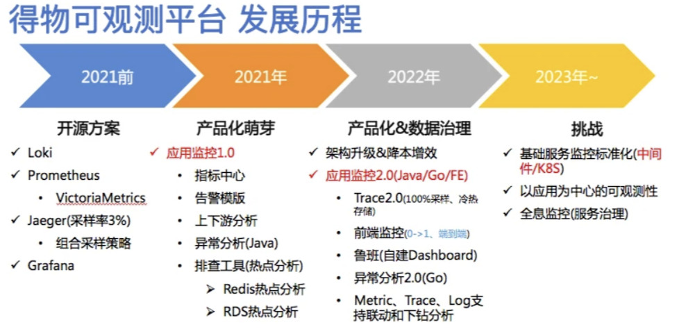

2021 年我们开始制定标准进行监控治理，结合排查经验，引入应用监控，提供异常分析、慢 MySQL 统计和 Redis 热点分析，包括命中率、大 Key。  

2022 年针对监控各个领域专项做深度迭代和打磨，比如 Trace，解决采样率低问题， 全量上报后通过尾部采样解决冷热存储问题以及引入 OSS 将**存储成本降低 90%**。另一方面在数据联动上指标和 Trace 缺乏强关联性，引入 OT 打造端到端的链路追踪。在标准协议下实现指标关联 Trace，Trace 关联日志，在产品侧实现下钻分析。产品层开始摆脱 Grafana 的依赖，图表基于 antv 构建。

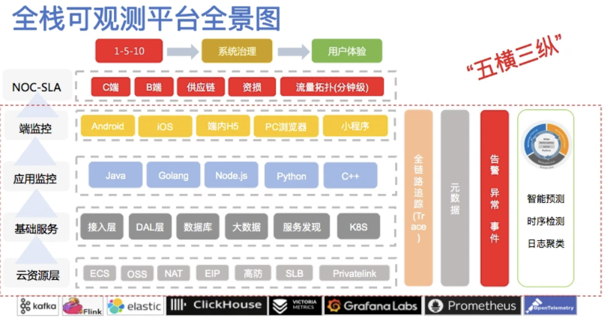

整个 2022 年我们在数据质量方面和架构方面做了一个巨大的调整，主要是为了我们在 2023 年建设全息监控做准备，第一基于应用的这套体系快速的覆盖到中间件，包括 K8s，实现指标的标准化，大盘的标准化，告警的标准化。再就是我们要以应用为中心，搭建一个可观性平台，通过以应用为中心构建一个元数据中心，同时基于 Trace 构建整个业务拓扑图，得到整个知识图谱实现一个全息监控。

通过 Trace 打通了所有层的关联，基于这些关联关系将元数据与异常仓库进行关联支撑整个得物 NOC-SLA 的体系建设,完成**“1-5-10”**的目标，并且在系统治理和用户体验上面得到一个很大的提升。

**为什么选择 OpenTelemetry 呢？**

要实现一个链路追踪系统，我们首先要解决的就是数据采集的问题，早期得物的链路追踪使用 SDK 方式，升级起来比较麻烦，所以我们新的链路追踪就希望使用 Java Agent 采用字节码增强的方式，对应用透明，然后当时市面上基于 Java Agent 字节码增强实现比较成熟的有 Pinpoint、Skywalking 和 OpenTelemetry。

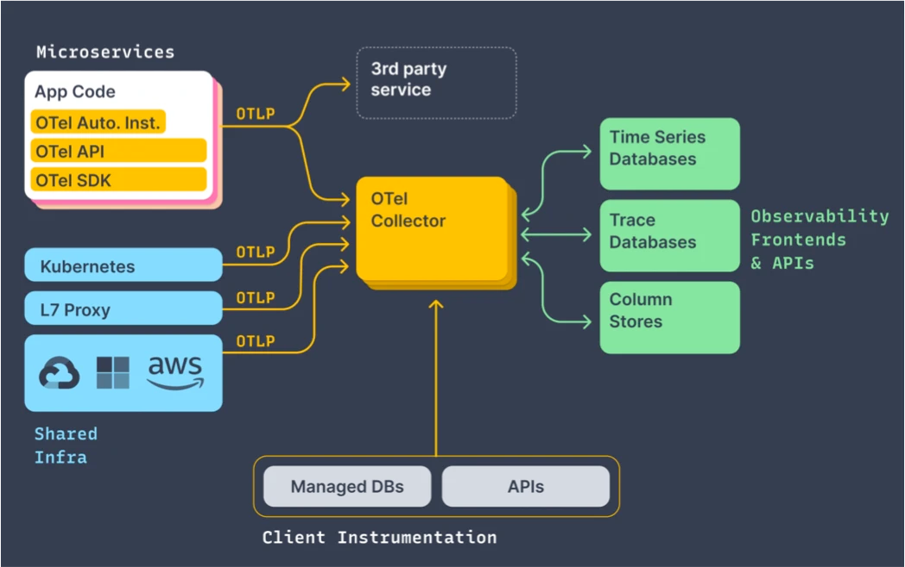

  

那 OpenTelemetry 是 CNCF 云原生基金会里面的项目，它规范了各观测数据的类型，以及采集和导出的一个标准方法，其中包括 Trace、Metric、Log，如果基于 OpenTelemetry 的话，我们就可以通过一套标准的方案将 Trace、Metric、Log 进行生成和导出，然后可以将这些不同类型的数据友好的把它关联起来，从而降低我们在开发过程中对不同类型的观察数据的使用成本，且无缝兼容现有的主流可观测性系统，比如 Prometheus、OpenTracing。

同时国内外各大厂商都在适配它，包括谷歌、微软、阿里云、腾讯云等，不依赖任何特定的厂商，然后我们团队也比较看好 OpenTelemetry 以后的一个发展趋势，并且希望跟进 OpenTelemetry 的社区享受社区带来的技术红利和影响力，最终我们选择了基于 OpenTelemetry 来建设得物的 Trace2.0。  

**分布式链路追踪 Trace2.0 架构**

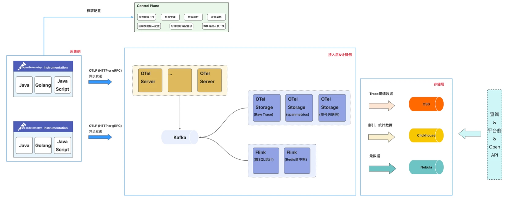

1. 采集端：通过集成并定制 OT 提供的多语言 SDK(Agent)，生成统一格式的数据。目前支持 Java\Go\Python\JS 四个语言。
2. 控制平面：中心化的配置中心向采集侧下发各类配置并动态生效；支持应用按实例数灰度接入，并提供出入参动态开关、性能剖析、版本管理等
3. 数据网关： OTel Server 兼容 OT 协议，提供 gRPC 和 HTTP 两种方式,并将数据写入 Kafka
4. 计算侧：除了将 Span 数据落盘之外，还提供了场景化的数据分析能力包括：SpanMetric 的计算、Redis 热点分析、MySQL 热点分析、单号关联 Trace
5. 存储侧：主要引入对象存储，Trace 的索引数据存放在 ClickHouse 中，明细数据存放 OSS，元数据存放在图数据库中

  

**Trace2.0 能力建设**

首先最重要的就是 Trace2.0 保存所有有价值的一个 Trace 的完整的链路，那哪些是“有价值”的 Trace。（详见[《得物云原生全链路追踪Trace2.0架构实践》](https://www.yuque.com/u12222632/as5rgl/mtzs3x6et5920ie5?singleDoc# )）

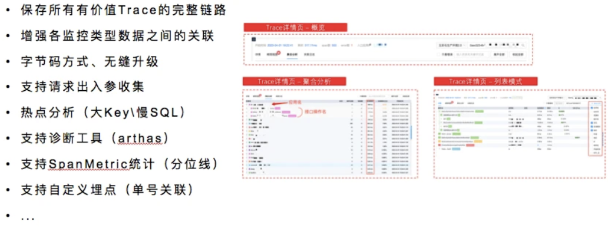

同时 Trace2.0 支持各类型监控的一个关联，就可以实现指标关联 Trace，Trace 关联日志，然后采集端基于 JavaAgent 构建，接入时只需要添加一个 JVM 参数就可以了，后续升级就比较方便，对应用无感知，Trace2.0 还提供了请求的出入参、应用自定义埋点、诊断工具等方面的能力。

**Trace2.0 在存储层的演进历程**

第一阶段 Trace 完全基于 ClickHouse 构建，有两张表分别是 SpanIndex 表和 SpanData 表，SpanIndex 用于高级检索，SpanData 存储每个 Span 的明细数据，为什么选择 ClickHouse 呢，ClickHouse 每秒可以支持数百万甚至数千万行的写入。全量采集下写入能力还是非常重要的，此外稀疏索引可以提供更好的查询性能和内存占用。

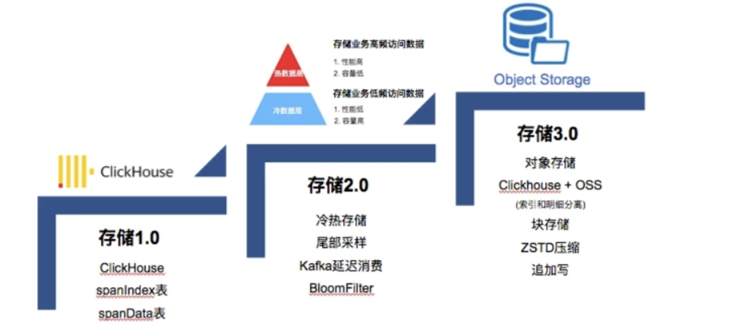

第二阶段我们对 Trace 数据做了冷热分离，电商履约系统经常需要排查超过 7 天的场景，为此我们做了冷热存储分离，近 7 天的数据全量保存，超过 7 天的只保留“有价值”的数据，为什么选择基于 kafka 的延迟消费方式呢，主要是当前市面的的尾部采样都是在端侧决策，对异步场景支持不友好，容易导致 Trace 保留不全，无法保障完整的链路。

第二阶段的 Trace 数据还是保留在 ClickHouse 中，虽然采用冷热存储解决了长时间保留的问题，但 ClickHouse 的磁盘利用率比较高，使用的 SSD 盘价格也不低，第三阶段我们引入对象存储进一步的把 Trace 存储成本降低。

**Trace2.0 - 冷热存储**

下面来详细介绍下冷热存储和对象存储：

+ 冷热存储主要基于 Kafka 的延迟消费和 BloomFilter 编码，数据网关将客户端上报 Trace 数据写入到 Kafka 中，并把满足采样规则（主要是错慢的 Trace）TraceID 通过 BloomFilter 编码写入 DB 中；
+ 热集群实时消费 Kafka 中的数据，并持久化到 ClickHouse 中，数据保留 7 天；
+ 冷集群延迟消费 Kafka 中的数据，通过 BloomFilter 判断 TraceID 是否命中，命中则写入 ClickHouse 中，数据保留 30 天；

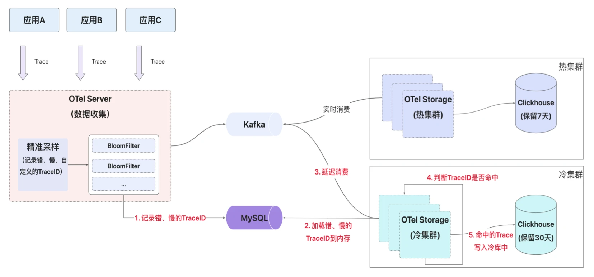

  
相关设计细节可以参考[《得物云原生全链路追踪Trace2.0架构实践》](https://www.yuque.com/u12222632/as5rgl/mtzs3x6et5920ie5?singleDoc# )

****

**Trace2.0 - 对象存储 写入流程**

如何降低 Trace 的存储成本，第一个想到的开源项目就是 Grafana 的 Tempo，Tempo 使用对象存储(索引和明细)，并兼容一些主流协议像 Zipkin，Jaeger，OpenTelemetry，综合考虑后决定引入对象存储，将索引放在 ClickHouse 中，明细存放在对象存储中。

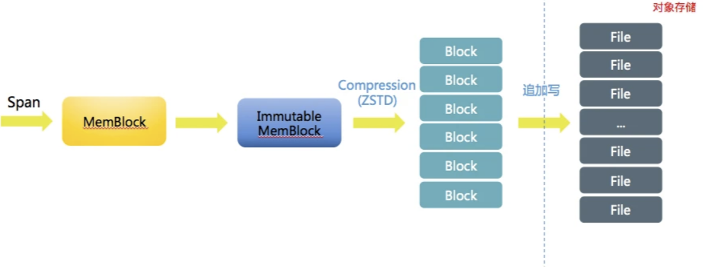

从 Kafka 消费 Span 后，先将 Span 写内存，当内存满足一定条件后会对这批 Span 数据进行 ZSTD 压缩后刷盘到对象存储 OSS 后。写 OSS 采用追加写方式，每次写入可获得 OSS 的文件名和偏移量，将地理位置存储 ClickHouse 中。

**Trace2.0 - 对象存储 查询流程**

查询时，先通过 ClickHouse 确定一个 TraceID 都在哪些 OSS 文件块中，获得文件块偏移量后通过随机读(Range)方式将文件块下载到本地(注意这里是文件块，不是文件)，再通过块内偏移量解析得到 Span。汇聚所有 Span 得到一个完整的 Trace。

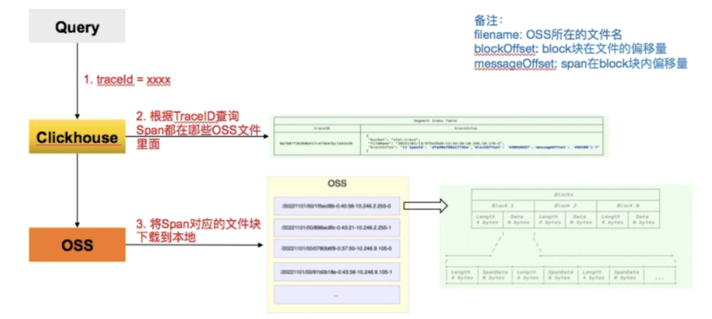

这里需要注意文件块的大小，一次批量写会包含不同 Trace 下的 Span，如果文件块过大，会导致解压时间过长，查询会超时，测下来文件块设置 4MB 是一个比较合适的值。

**实施效果：Trace2.0 现状**

Trace2.0 在得物落地一年多时间，现已覆盖公司绝大部分在线业务。

+ 每秒 TPS 在 12M/s 个 Span
+ Trace 点查 P50 耗时在 300ms, P90 查询耗时在 800ms
+ 每天日增数据量在 700+TB
+ 热存保留 6 天总存储 4PB、冷存保留 30 天存储 1PB，采用 ZSTD 压缩比在 12，
+ ClickHouse 单机可支持每秒 40w 个 Span 写入

**可观测性平台 - 前端监控**

第一个案例的话就是我们前后端链路打通的能力，在前后端没有打通之前，当前端收到一个异常后，我们无法全面地了解系统的性能状况，无法监控请求的传输路径和处理时间，也无法对系统的性能指标进行全面的分析。

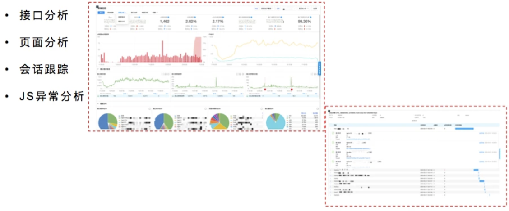

为了解决这个痛点的话，我们做了前后端的链路打通。这边是一个效果图，前端的异常就可以看到后端的链路，关联了哪些服务，通过出入参可以很方便的排查问题。同时提供了接口分析和页面分析。另外也支持会话跟踪，当出现问题时通过 SessionID 实现全链路追踪，还原用户的行为轨迹，包括页面加载、接口请求、和用户操作等。

**可观测性平台 - 容器监控**

随着公司应用全面容器化，对于 K8s 集群的稳定性要求越来越高，但是针对 K8s 监控没有一个专业和全面的监控产品满足问题发现和故障定位。

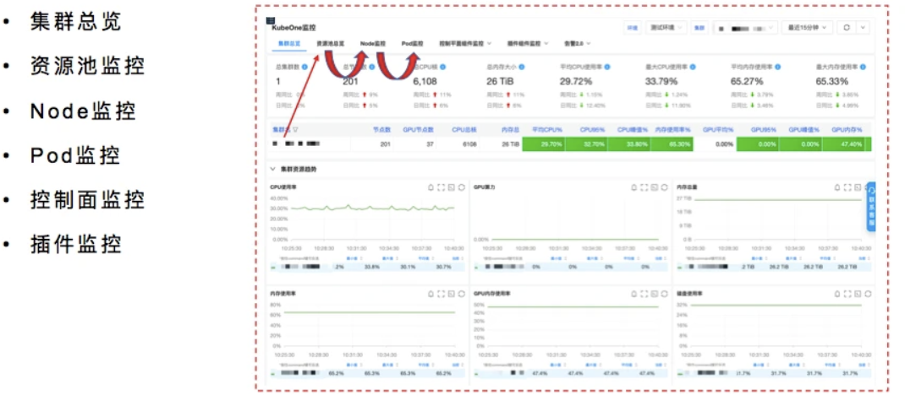

早期 K8s 监控大盘基于 Grafana 构建，指标理解和大盘配置门槛较高，且监控面板比较分散，

SRE 积累的排障工具无法与监控产品做融合，图表无下钻能力，为此打造一款专业的 K8s 监控产品，统一指标计算口径，对现有指标做好分类分级，单击单个集群视角可查看关联资源池监控，资源池可下钻分析单个 Node 节点的监控，POD 视角可关联查看 Node 相关监控，大盘之间可进行联动分析，以及提供控制平面 API-Server 和 etcd 的监控。

**可观测性平台 - 应用监控（接口分析）**

讲完 K8S 监控我们再看看应用监控，首先我们来看下接口分析，接口我们按照组件类型分为接口、下游调用、SQL 调用、NoSQL 调用、以及 MQ 和其他进行分类。

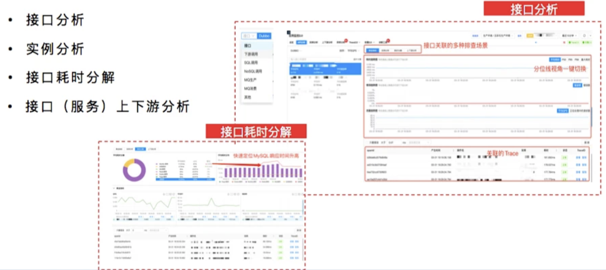

第二个是错误码分析，主要根据响应体里的 Code 码和 CodeMessage，通过对业务码分类，可以快速的帮助我们了解业务需求和业务流程，有助于问题的发现和定位。

第三块是 MySQL 热点分析，按照 SQL 指纹统计调用次数、慢 SQL 次数以及关联的接口名。

第四块是 Redis 热点分析，通过客户端记录 Redis 的入参和出参，统计 Redis 命中率、大 Key、高频写、慢调用。

**可观测性平台 - 应用监控（链路追踪）**

接下来介绍下应用监控的链路 Trace 部分。用户可以在接口分析页的黄金三指标曲线上点击就能看到对应的 Trace 链路。同时也在接口页面的右下角展示 Trace 检索页，可以快速的看出错、慢 Trace。

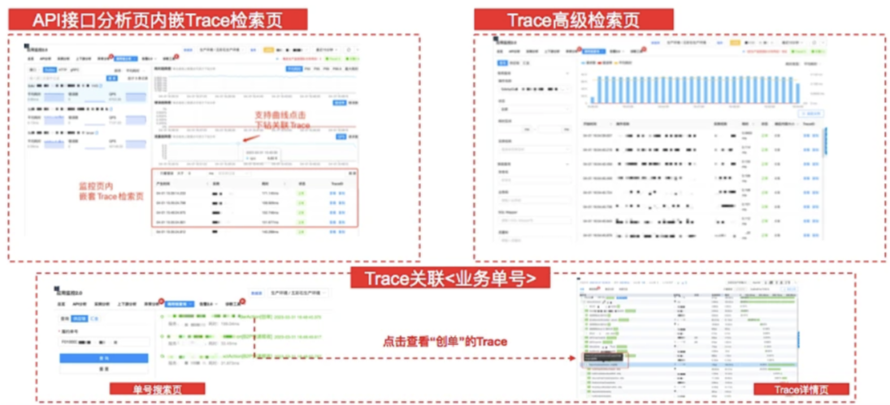

此外提供高级检索模式，满足研发自定义查询场景，支持多维查询，比如实例、或者指定上游或者指定下游进行过滤。

此外，在电商场景下，研发多以订单号、作为排障的场景，因此我们和研发团队约定埋点规则 ——在 Span 的 Tag 上记录单号—— 便会在 ClickHouse 中新写一条“单号关联表”。用于记录单号 ID 和 TraceID 的映射关系，研发通过单号查看所有的 Trace。

**可观测性平台 - 应用监控（Trace 详情）**

Trace 详情页的话会将一个 Trace 下的所有 Span 在一张图中显示摘要信息根据 TraceID 解码当前链路的发生时间和来源 IP。

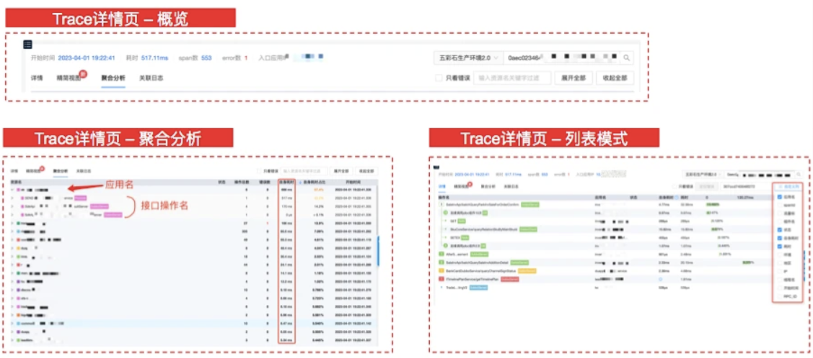

目前我们提供两种展示模式，列表详情以及聚合统计。

+ 在聚合统计模式下，可以查看 trace 的整体性能指标，这次请求经过哪些服务，以及该服务请求了哪些组件，可以直观的看出哪个服务耗时最高以及耗时最大的接口是哪个。
+ 列表模式下支持自定义列，通过自定义可以快速的帮助我们理解 Trace 上下文，比如在染色环境下，测试同学想一眼看出当前链路是否跨环境了，再比如通过线程名可以快速帮助我们理解异步上下文。

**可观测性平台 - 应用监控（Trace 详情）**

单击某个 Span，Span 详情会以抽屉方式展示，上面是 Span 的摘要信息，下面按照属性含义做了分类。部分属性支持跳转到其他平台，比如 CMDB 和容器平台，在 Span 详情页的打通了指标和日志，日志主要根据 TraceID 关联。

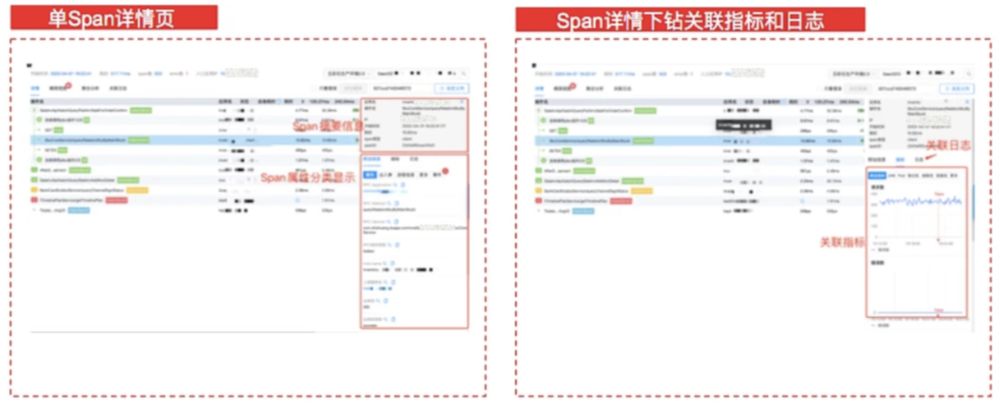

指标可显示当前 Span 的黄金三指标、以及当前 Span 所在 JVM 状态包括 GC、线程池和 POD 的 CPU 和内存以及 POD 所在宿主机的资源使用情况，这样可以减少页面来回切换。

**可观测性平台 - 应用监控（告警平台）**

在报警分析上，主要使用 Prometheus 作为数据源，通过专家经验梳理告警模板，可以快速的应用到其他服务，同时可以保障新应用上线后低成本接入，目前共提供 50 多个模版。

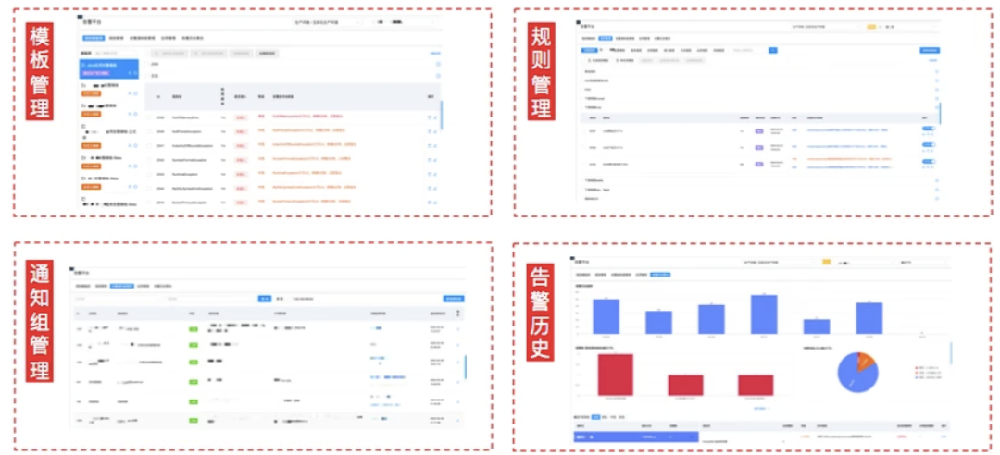

在告警规则上，支持同比、环比、无数据。在通知组上支持飞书、短信、电话，以及支持分钟级、小时级、天级的告警聚合通知。

> 更新: 2025-03-17 19:17:04  
> 原文: <https://www.yuque.com/u12222632/as5rgl/almclgkqqs0vgcaa>