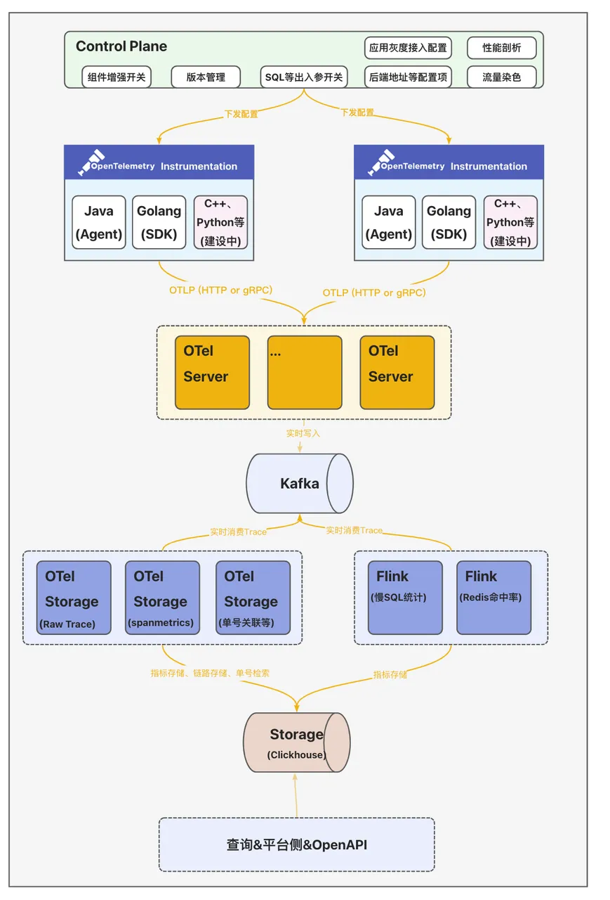
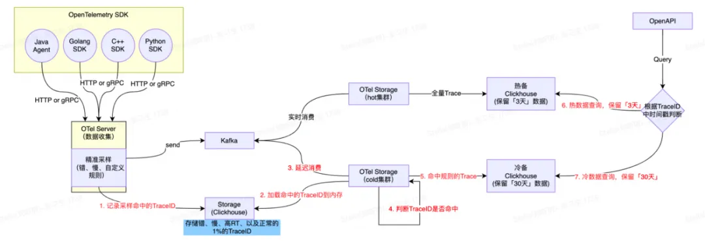
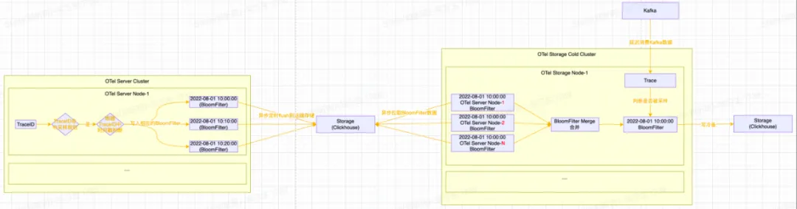
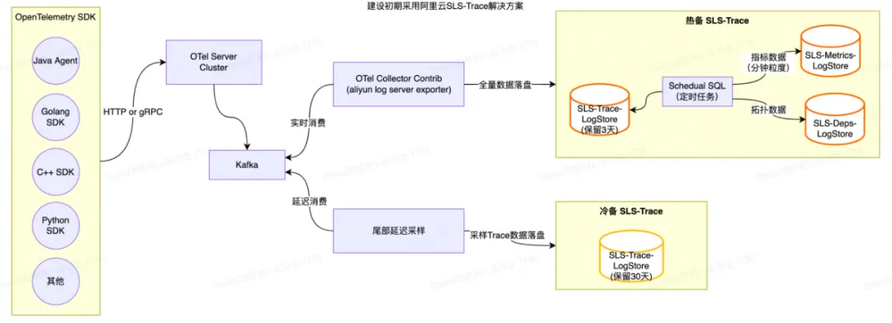
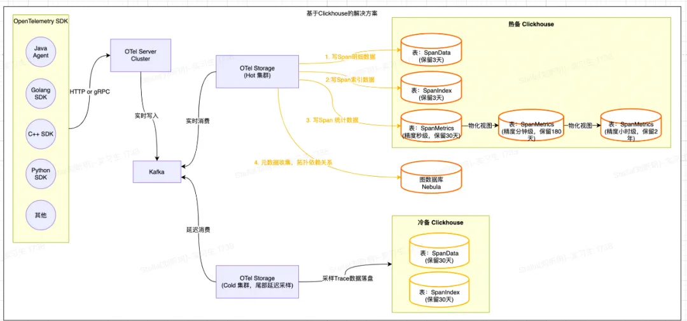
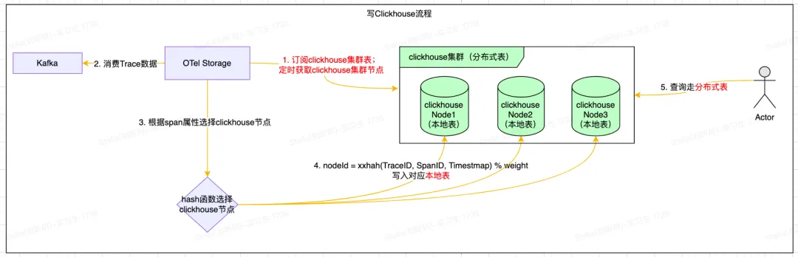

# 得物云原生全链路追踪Trace2.0架构实践

**导读：**

分布式链路追踪作为解决分布式应用可观测问题的重要技术，得物全链路追踪(简称Trace2.0)基于OpenTelemetry提供的可观测标准方案实现新一代的一站式全链路观测诊断平台，并通过全量采集Trace帮助业务提高故障诊断、性能优化、架构治理的效率。

全量采集Trace数据(日增数百TB 、数千亿条Span数据)并以较低的成本保证数据的实时处理与高效查询，对Trace2.0后端整体的可观测性解决方案提出了极高的要求。本文将详细介绍Trace2.0背后的架构设计、尾部采样和冷热存储方案，以及我们是如何通过自建存储实现进一步的降本增效(存储成本下降66%)。


# **1. 整体架构设计  
**


  


全链路追踪Trace2.0从数据接入侧、计算、存储到查询整体模块架构如上图所示。这里说一下各组件的核心能力：

+ **<font style="color:rgb(46, 161, 33);">客户端&数据采集：</font>**集成并定制OpenTelemetry提供的多语言SDK(Agent)，生成统一格式的可观测数据。
+ **<font style="color:rgb(46, 161, 33);">控制平面Control Plane：</font>**统一的配置中心向数据采集侧下发各类动态配置发并实时生效；支持向各采集器下发动态配置并实时生效，支持应用按实例数灰度接入，并提供出入参收集动态开关、性能剖析动态开关、流量染色动态配置、客户端版本管理等。
+ **<font style="color:rgb(46, 161, 33);">数据收集服务OTel Server：</font>**数据收集器OTel Server兼容OpenTelemetry Protocol（OTLP)协议，提供gRPC和HTTP两种方式接收采集器发送的可观测数据。
+ **<font style="color:rgb(46, 161, 33);">分析计算&存储OTel Storage：</font>**计算侧除了基础的实时检索能力外，还提供了场景化的数据分析计算主要包括：
    - **存储Trace数据：**数据分为两段，一段是索引字段，包括TraceID、ServiceName、SpanName、StatusCode、Duration和起止时间等基本信息，用于高级检索；另一段是明细数据(源数据，包含所有的Span数据)
    - **计算SpanMetrics数据：**聚合计算Service、SpanName、Host、StatusCode、Env、Region等维度的执行总次数、总耗时、最大耗时、最小耗时、分位线等数据；
    - **业务单号关联Trace：**电商场景下部分研发多以订单号、履约单号、汇金单号作为排障的输入，因此和业务研发约定特殊埋点规则后--在Span的Tag里添加一个特殊字段"bizOrderId={实际单号}"--便将这个Tag作为ClickHouse的索引字段；从而实现业务链路到全链路Trace形成一个完整的排障链路；
    - **Redis热点数据统计：**在客户端侧扩展调用Redis时入参和出参SpanTag埋点，以便统Redis命中率、大Key、高频写、慢调用等指标数据；
    - **MySQL****热点数据统计：**按照SQL指纹统计调用次数、慢SQL次数以及关联的接口名。


# **2. 尾部采样&冷热存储  
**
得物早期的全链路追踪方案出于对存储成本的考虑，在客户端设置了1%的采样率，导致研发排查问题时经常查询不到想看的Trace链路。那么Trace2.0为了解决这个问题，就不能仅仅只是简单地将客户端的采样率调整为100%，而是需要在客户端全量采集Trace数据的同时，合理地控制Trace存储成本。且从实践经验来看，Trace数据的价值分布是不均匀的，随着时间的推移Trace的数据价值是急速降低的。


全量存储Trace数据不仅会造成巨大的成本浪费，还会显著地影响整条数据处理链路的性能以及稳定性。所以，如果我们能够只保存那些有价值、大概率会被用户实际查询的Trace，就能取得成本与收益的平衡。那什么是有价值的Trace呢？根据日常排查经验，我们发现业务研发主要关心以下四类优先级高场景：  


1. 在调用链上出现了异常ERROR；
2. 在调用链上出现了大于「200ms」的数据库调用；
3. 整个调用链耗时超过「1s」；
4. 业务场景的调用链，比如通过订单号关联的调用链。


在这个背景下，并结合业界的实践经验，落地Trace2.0的过程中设计了尾部采样&冷热分层存储方案，方案如下:

+ 「3天」内的Trace数据全量保存，定义为热数据。
+ 基于Kafka延迟消费+Bloom Filter尾部采样的数据(错、慢、自定义采样规则、以及默认常规0.1%采样数据)保留「30天」，定义为冷数据。

  





整体处理流程如下：


+ **<font style="color:rgb(46, 161, 33);">OTel Server数据收集&采样规则：</font>**将客户端采集器上报的全量Trace数据实时写入Kafka中，并把满足采样规则(上述定义的场景)的Span数据对应的TraceID记录到Bloom Filter中;
+ **<font style="color:rgb(46, 161, 33);">OTel Storage持久化热数据：</font>**实时消费Kafka中数据，并全量持久化到ClickHouse热集群中；
+ **<font style="color:rgb(46, 161, 33);">OTel Storage持久化冷数据：</font>**订阅上游OTel Server的Bloom Filter，**延迟**消费Kafka中的数据，将TraceID在Bloom Filter中可能存在的Span数据持久化到ClickHouse冷集群中；
    - 延迟时间配置的30分钟，尽量保证一个Trace下的Span完整保留。
+ **<font style="color:rgb(46, 161, 33);">TraceID点查：</font>** Trace2.0自定义了TraceID的生成规则；在生成TraceID时，会把当前时间戳秒数的16进制编码结果(占8个字节)作为TraceID的一部分。查询时只需要解码TraceId中的时间戳，即可知道应该查询热集群还是冷集群。


接下来再介绍一下尾部采样中Bloom Filter的设计细节，如下图所示：  





整体处理流程如下：


1. OTel Server会将满足采样规则的Span数据对应的TraceID，根据TraceID中的时间戳写入到对应时间戳的Bloom Filter中；
2. Bloom Filter会按十分钟粒度(可根据实际的数据量并结合BloomFilter的误算率和样本大小计算内存消耗并调整)进行分片，十分钟过后将Bloom Filter进行序列化并写入到ClickHouse存储中；
3. OTel Storage消费侧拉取Bloom Filter数据(注意：同一个时间窗口，每一个OTel Server节点都会生成一个BloomFilter)并进行合并Merge(减少Bloom Filter的内存占用并提高Bloom Filter的查询效率)。  


综上所述，Trace2.0仅使用了较少的资源就完成了尾部采样和冷热分层存储。既为公司节约了成本，又保存了几乎所有「有价值」Trace，解决了业务研发日常排查时查询不到想看的Trace的问题。


# **3. 自建存储&降本增效**
## **3.1 基于SLS-Trace的解决方案**
Trace2.0建设初期采用了_SLS专为OpenTelemetry定制的Trace方案 _【1】，提供了Trace查询、调用分析、拓扑分析等功能，如下图所示：  




SLS-Trace主要处理流程如下：

1. 利用OpenTelemetry Collector _aliyunlogserverexporter_【2】将Trace数据写入到SLS-Trace Logstore中；
2. SLS-Trace通过默认提供的Scheduled SQL任务定时聚合Trace数据并生成相应的Span指标与应用、接口粒度的拓扑指标等数据。

随着Trace2.0在公司内部全面铺开，SLS的存储成本压力变得越来越大，为了响应公司“利用技术手段实现降本提效”的号召，我们决定自建存储。


## **3.2 基于ClickHouse的解决方案  
**
目前业内比较流行的全链路追踪开源项目(SkyWalking、Pinpoint、Jaeger等)采用的存储大都是基于ES或者HBase实现的。而近几年新兴的开源全链路追踪开源项目(_Uptrace_【3】、_Signoz_【4】等)采用的存储大都是基于ClickHouse实现的，同时将Span数据清洗出来的指标数据也存储在ClickHouse中。且ClickHouse的物化视图(很好用)也很好地解决了指标数据降采样(DownSampling)的问题。最终经过一番调研，我们决定基于ClickHouse来自建新的存储解决方案。整体架构图如下：  


  


整体处理流程如下：  


+ **<font style="color:rgb(46, 161, 33);">Trace索引&明细数据：</font>**OTel Storage会将基于Span原始数据构建的索引数据写入到SpanIndex表中，将Span原始明细数据写入到SpanData表中(相关表设计可以参考_Uptrace_【5】)；  

+ **<font style="color:rgb(46, 161, 33);">计算&持久化SpanMetrics数据：</font>**OTel Storage会根据Span的Service、SpanName、Host、StatusCode等属性统计并生成「30秒」粒度的总调用次数、总耗时、最大耗时、最小耗时、分位线等指标数据，并写入到SpanMetrics表；
    - **指标****Down****S****ampling功能****：**利用ClickHouse的物化视图将「秒级」指标聚合成「分钟级」指标，再将「分钟级」指标聚合成「小时级」指标；从而实现多精度的指标以满足不同时间范围的查询需求；

```plain
-- span_metrics_10m_mv
CREATE MATERIALIZED VIEW IF NOT EXISTS '{database}'.span_metrics_10m_mv_local
            on cluster '{cluster}'
            TO '{database}'.span_metrics_10m_local
AS
SELECT a.serviceName                     as serviceName,
       a.spanName                        as spanName,
       a.kind                            as kind,
       a.statusCode                      as statusCode,
       toStartOfTenMinutes(a.timeBucket) as timeBucket,
       sum(a.count)                      as count,
       sum(a.timeSum)                    as timeSum,
       max(a.timeMax)                    as timeMax,
       min(a.timeMin)                    as timeMin
FROM '{database}'.span_metrics_30s_local as a
GROUP BY a.serviceName, a.spanName, a.kind, a.statusCode,
    toStartOfTenMinutes(a.timeBucket);
```


+ **<font style="color:rgb(46, 161, 33);">元数据(上下游拓扑数据)：</font>**OTel Storage根据Span属性中的上下游关系(需要在客户端埋相关属性)，将拓扑依赖关系写入到图数据库Nebula中。

### **ClickHouse写入细节  
**
ClickHouse使用Distributed引擎实现了Distributed(分布式)表机制，可以在所有分片(本地表)上建立视图，实现分布式查询。并且Distributed表自身不会存储任何数据，它会通过读取或写入其他远端节点的表来进行数据处理。SpanData表创建语句如下所示：

```plain
-- span_dataCREATE TABLE IF NOT EXISTS '{database}'.span_data_local ON CLUSTER '{cluster}'(    traceID                   FixedString(32),    spanID                    FixedString(16),    startTime                 DateTime64(6 ) Codec (Delta, Default),    body                      String CODEC (ZSTD(3))) ENGINE = MergeTreeORDER BY (traceID,startTime,spanID)PARTITION BY toStartOfTenMinutes(startTime)TTL toDate(startTime) + INTERVAL '{TTL}' HOUR;
-- span_data_distributedCREATE TABLE IF NOT EXISTS '{database}'.span_data_all ON CLUSTER '{cluster}'as '{database}'.span_data_local    ENGINE = Distributed('{cluster}', '{database}', span_data_local,                         xxHash64(concat(traceID,spanID,toString(toDateTime(startTime,6)))));
```


整体写入流程比较简单(注意：避免使用分布式表)，如下所示：

+ 定时获取ClickHouse集群节点；
+ 通过Hash函数选择对应的ClickHouse节点，然后批量写ClickHouse的本地表。





### **上线效果**
全链路追踪是一个典型的写多读少的场景，因此我们采用了ClickHouse ZSTD压缩算法对数据进行了压缩，压缩后的压缩比高达12，效果非常好。目前ClickHouse冷热集群各使用数十台16C64G ESSD机器，单机写入速度25w/s(ClickHouse写入的行数)。相比于初期的阿里云SLS-Trace方案，存储成本下降66%，查询速度也从800+ms下降至490+ms。


### **下一步规划**
目前Trace2.0将Span的原始明细数据也存储在了ClickHouse中，导致ClickHouse的磁盘使用率会有些偏高，后续考虑将Span明细数据先写入HDFS/OSS等块存储设备中，ClickHouse来记录每个Span在块存储中的offset，从而进一步降低ClickHouse的存储成本。


**关于我们：**

得物监控团队提供一站式的可观测性平台，负责链路追踪、时序数据库、日志系统，包括自定义大盘、应用大盘、业务监控、智能告警、AIOPS等排障分析。

欢迎对可观测性/监控/告警/AIOPS 等领域感兴趣的同学加入我们。

**引用**

【1】**SLS-Trace方案 **

https://developer.aliyun.com/article/785854

【2】**SLS-Trace Contrib **

https://github.com/open-telemetry/opentelemetry-collector-contrib/tree/main/exporter/alibabacloudlogserviceexporter

【3】**Uptrace **

https://uptrace.dev/

【4】**Signoz** 

https://signoz.io/

【5】**Uptrace Schema设计**

https://github.com/uptrace/uptrace/tree/v0.2.16/pkg/bunapp/migrations

  


  


> 更新: 2025-03-17 19:07:54  
> 原文: <https://www.yuque.com/u12222632/as5rgl/mtzs3x6et5920ie5>