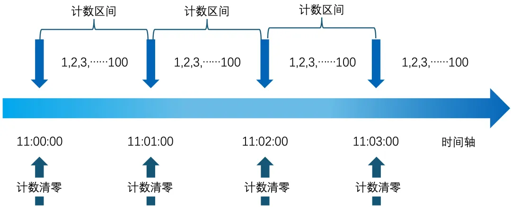

# 微服务常见限流方案及 TSF 限流原理

# 目录
1 限流前考虑什么

2 如何进行限流

3 关于 TSF 的限流

# 1.限流前考虑什么
## 1.1 限流的目的是什么
珍稀之物如星辰般散落，在广袤的大地上熠熠生辉‌‌。稀缺的资源总是珍贵的，对于计算机系统来说，在业务的高峰期时也往往会存在资源挤占的情况，甚至导致业务的宕机。例如我们腾讯的游戏类业务有时候会举行一些运营活动，比如卡券领用等，往往会导致用户大流量的产生。还有视频类业务，在遇到热点事件的时候，也会导致突发的大流量冲击问题。而限流则是一种服务很好的保护机制，可以保障服务平稳的运行。服务提供者和服务消费者均可按照一定规则进行限流保护，例如请求的频率达到阈值后做限流处理，防止服务因为流量过大而崩溃。限流主要有两个目的：

+ **防止系统过载：**确保系统在高负载情况下仍能保持稳定运行。
+ **增强安全性：**速率限制可防止暴力破解登录、促销代码等安全密集型功能。对这些功能的请求数量在用户级别受到限制，因此暴力破解算法在这些场景中不起作用。
+ **保证服务质量：**为所有用户提供公平的服务，避免某些用户占用过多资源。
+ **控制运营成本：**在按使用付费模式自动扩展资源的情况下，速率限制通过对资源扩展设置虚拟上限来帮助控制运营成本。如果不采用速率限制，资源可能会不成比例地扩展，从而导致指数级的账单。

## 1.2 限流机制应该考虑什么
好的限流机制需要综合考虑多个关键因素以确保限流系统的有效性和公平性。

+ **公平：**是限流设计中的首要原则，确保所有用户和客户端能够平等地访问服务。
+ **灵活：**考虑不同的业务场景，如接口、设备、IP、账户 ID 等维度进行限流‌，限流策略能够适应不同的流量模式和业务需求，例如在高流量期间放宽限制。
+ ‌**解耦‌：**将限流服务与具体业务逻辑分离，可以减少业务逻辑变更时对限流服务的修改需求，提高系统的可维护性。
+ **可观测：**要求限流规则和当前状态对用户可见，使用户能够了解他们被限流的原因和情况。

## 1.3 针对什么来限流
从限流的对象来看，可以分为单机限流、集群限流、‌针对业务对象的限流‌。

+ 单机限流‌：在单机上通过固定窗口或滑动窗口算法实现限流。
+ ‌集群限流‌：一般需要借助 Redis 之类的中间件来记录流量和阈值，来实现前面的限流算法。
+ 针对业务对象限流‌：如针对 IP、用户 ID 或业务 ID 进行限流。

VIP 用户不限流而普通用户限流。

针对 IP 限流。用户登录或参与秒杀都可以使用这种限流，比如说设置一秒钟最多有 50 个请求。

针对业务 ID 限流，比如用户 ID。

# 2. 如何进行限流
## 2.1 主流的限流方式对比
常见的限流方案有固定窗口计数器、滑动窗口计数器、漏斗(漏桶)、令牌桶等，下面我们来看看几种方式的对比情况。

### 2.1.1 固定窗口计数器
**基本概念：**

固定窗口计数器算法是一种基本的限流方法，它通过在固定时间窗口内跟踪请求的数量来实现限流。  

**实现原理：**

固定窗口计数器算法通过设置一个固定的时间窗口（例如每分钟）和一个在这个窗口内允许的请求数量限制（例如 10 个请求）。在每个时间窗口开始时，计数器重置为零，随着请求的到来，计数器递增。当计数器达到限制时，后续的请求将被拒绝，直到窗口重置。

**优点：**

+ 程序实现简单直观。
+ 容易理解和实现。
+ 可以保证在任何给定的固定时间窗口内，请求的数量不会超过设定的阈值。

**缺点：**

+ 在窗口切换的瞬间可能会有请求高峰，因为计数器重置可能导致大量请求几乎同时被处理。
+ 无法平滑地处理突发流量，可能导致服务体验不佳。  

**适用场景：**

适用于请求分布相对均匀的场景，例如统计 PV/UV 请求等。但请求在短时间内集中到达的场景下，可能需要考虑更复杂的限流算法。

### 2.1.2 滑动窗口计数器
**基本概念：**

  

这个算法是固定窗口计数器算法的一个改进，它通过覆盖多个时间段来平滑请求流量，避免瞬时高峰。这种算法通常需要使用更高级的数据结构，如时间轮（Timing Wheel），来实现。  

**实现原理：**

滑动窗口算法通过将时间分为多个小的时间段，每个时间段内维护一个独立的计数器。当一个请求到达时，它会被分配到当前时间所在的小时间段，并检查该时间段的计数器是否已达到限制。如果未达到，则允许请求并增加计数；如果已达到，则拒绝请求。随着时间的推移，旧的时间段会淡出窗口，新的时间段会加入。  

**优点：**

+ 相比固定窗口算法，滑动窗口算法能够更平滑地处理请求，避免瞬时高峰。
+ 可以提供更细致的流量控制。  

**缺点：**

+ 程序实现相对复杂，需要维护多个计数器和时间索引。
+ 对内存和计算的要求更高。  

**适用场景：**

适用于需要平滑流量控制的场景，尤其是在面对突发流量时，能够提供比固定窗口计数器更优的流量控制效果。

### 2.1.3 漏斗/漏桶
**基本概念：**

  

  

漏斗算法，又名漏桶算法，是一种经典的流量控制方法，特别适合于平滑突发流量，确保数据以均匀的速率被处理。  

**实现原理：**

通过一个固定容量的队列来模拟桶，以恒定速率从桶中取出请求进行处理，无论请求到达的频率如何，都保证请求以均匀的速度被处理，从而平滑流量并防止流量突增。  

**优点：**

+ 能够强制实现固定的数据处理速率，平滑流量。
+ 即使面对突发流量，也能保持稳定的处理速率。

**缺点：**

+ 对于突发流量的处理不够灵活，可能会延迟处理。
+ 实现相对简单，但需要维护桶的状态。

  

**适用场景：**

漏斗适用于需要流量整形（强制固定速率等）场景，如网络流量控制、API 请求限制、DB 保护等。通过控制令牌的添加速率，漏桶算法能够有效地避免系统因瞬时流量高峰而过载。

### 2.1.4 令牌桶
**基本概念：**

令牌桶算法是一种流行的限流算法，它允许一定程度的突发流量，同时保持长期的平均速率。  

**实现原理：**

令牌桶算法使用一个令牌桶来调节数据流的速率，允许一定程度的流量突发。桶初始时为空，并以固定速率填充令牌，直至达到预设的容量上限。与漏桶算法不同，令牌桶算法在桶未满时，可以在每个时间间隔内向桶中添加多个令牌，从而积累处理突发请求的能力。当请求到达时，如果桶中存在令牌，算法会从桶中移除相应数量的令牌来处理请求。如果桶中的令牌不足，请求将被延迟处理或根据策略拒绝服务。如果桶已满，额外的令牌将不会被添加，确保了令牌数量不会超过桶的容量限制。  

**优点：**

+ 允许一定程度的突发流量，更加灵活。
+ 可以平滑流量，同时在桶未满时快速处理请求。

**缺点：**

+ 程序实现相对复杂，需要维护桶的状态和时间。
+ 对于计算和同步的要求更高。

**适用场景：**

适用于需要处理突发流量的场景，如网络通信、秒杀、热点新闻等。通过控制令牌的填充速率和桶的容量，令牌桶算法能够有效地平衡流量，防止系统过载，同时允许在短期内处理更多的请求。

## 2.2 限流后采取什么动作
在一个正常的请求被限流之后，我们也可以采取一些方案来进行后续的处理。常见的后续动作有如下几种：

+ ‌拒绝新请求‌：当服务达到限流阈值时，新的请求会被拒绝，通常返回一个错误信息，告知用户当前服务过于繁忙，稍后再试‌。
+ 同步阻塞等待一段时间。如果遇到偶发性限流场景，往往再稍微阻塞等待一段时间后大概率能恢复处理。例如我们设置 1 秒钟 50 个请求，恰好来了 51 个请求，多出来的 1 个请求可以阻塞等待 1 秒钟就会被处理。
+ 优化负载均衡算法：如果某个请求限流了，可以通知负载均衡器尽可能少的给这个节点发送请求，例如通过动态调整节点的权重等。
+ ‌返回错误信息‌：限流后系统可以返回一个标准的错误响应，通常是一个 HTTP 状态码和相应的错误信息，例如 429 Too Many Requests‌。
+ ‌记录相关日志‌：记录被限流的请求、时间、IP 地址等相关日志信息，以便后续分析和优化‌。

  

# 3.关于 TSF 的限流
## 3.1 TSF 限流功能
TSF（Tencent Service Framework）微服务平台是一个围绕着应用和微服务的 PaaS 平台，提供应用全生命周期管理、数据化运营、立体化监控和服务治理等功能。TSF 拥抱 Spring Cloud 、Service Mesh 微服务框架，帮助企业客户解决传统集中式架构转型的困难，打造大规模高可用的分布式系统架构，实现业务、产品的快速落地。  

TSF 限流的原理是监控服务流量的 QPS 指标，当达到指定的阈值时进行流量控制，避免被瞬时高峰流量冲垮，从而确保服务的高可用。TSF 目前支持在被调服务上设置限流规则，服务的限流对象（下文称为限流资源）可以通过标签表达式灵活配置，常见的限流对象如当前服务，当前服务的特定 API 等，并且可以通过标签表达式区分不同的调用来源，针对不同的调用关系进行限流。一条限流规则主要包括以下几个元素：

+ **限流粒度：**通过标签表达式表示被调方的限流资源和调用来源。
+ **限流阈值：**单位时间和请求数，如果单位时间设置为 1 秒，则限流阈值为 QPS。
+ **生效状态：**限流规则是否生效。

  

  

TSF 限流采用了动态配额分配制，限流中控根据实例的历史流量记录，动态计算预测下一时刻该实例的流量，若所有实例的流量预测值都小于额定平均值（总配额/在线实例数），则以该平均值作为所有实例分配的配额；否则按预测流量的比例分配，且保证一个最小值。

  

TSF 支持全局限流和基于标签限流两种模式：

+ **全局限流。**从每个服务的视角整体把控服务容量，并且不区分调用请求的来源。所有流经被调用服务的请求都将被统计计数，一旦统计数字超过了全局限流配置的阈值，整个服务会拒绝超过配额的请求。
+ **基于标签限流。**通过标签化能力，将上游请求进行分类，针对不同种类的请求配置不同的限流规则，同时限流规则甚至可以精确控制到每个请求上。最终通过多个限流规则的组合，实现针对服务中不同 API、不同流量来源的组合型防护。  

  

TSF 支持对服务提供者的角度设置限流规则。一条限流规则包括规则名、作用域、限流阈值（单位时间内的请求数）。作用域可以是某一个微服务来源或是所有请求；一个服务可以有多个同时生效的限流规则，当一个请求被多个限流规则约束时，则仅当所有作用规则都判通时才会放行，这是对每个作用规则的通行请求数+1，若被一个规则拦截，则在该规则的限流请求数+1，请求被拦截。

## 3.2 TSF 限流原理
### 3.2.1 TSF 限流逻辑
通过 TSF 页面配置限流规则→调用 yunapi 接口→tsf-dispatch→tsf-ratelimit 组件。tsf-ratelimit 组件同步数据库以及注册配置模块中的配置。tsf-ratelimit-master 组件作为流量中控，从各个实例中获取到历史流量，动态计算出下一时刻实例的流量，根据限流规则决定下发配额（超出流量阈值则缩小配额），返回给各个实例。SDK 通过这个配额，进行限流，这里使用的是令牌桶算法，能够限制数据的平均传输速率，还要允许某种程度的突发传输。

  

  

一般在下游服务配置限流规则，例如：服务 A 访问服务 B，由于服务 B 所在的服务器核数较低，一次承载不了太多请求，因此在服务 B 做服务限流，上游服务为服务 A，规则为 1s 内只允许一条请求。改规则下发后，通过 tsf-ratelimit 组件更新到注册配置模块以及数据库 DB 中，而 tsf-ratelimit-master 组件作为流控中心，会拉取 DB 中的限流规则。此时如果服务 A 在 1s 内请求了服务 B 两次，那么服务 B 就会上报这个流量记录到流控中心，而流控中心通过与限流规则对比，发现流量超标，则返回 1 个配额给服务 B，服务 B 的 SDK 通过令牌桶算法，限制服务 A 的请求。

  

  

+ SDK 分多种维度统计的流量；
+ SDK 统计完一个周期的流量（比如一秒）则立即上报到中控；
+ 中控将各节点的流量数据汇总到存储；
+ 中控统计上周期各节点的流量情况决策下周期各节点配额在上报请求中返回；
+ SDK 执行令牌桶算法实现配额限流。

### 3.2.2 TSF 令牌桶细节
TSF 使用的令牌桶限流，具体来说原理如下：  

  

+ 假如用户配置的平均发送速率为 r，则每隔 1/r 秒一个令牌被加入到桶中（每秒会有 r 个令牌放入桶中）；
+ 假设桶中最多可以存放 b 个令牌。如果令牌到达时令牌桶已经满了，那么这个令牌会被丢弃；
+ 当一个 n 个字节的数据包到达时，就从令牌桶中删除 n 个令牌（不同大小的数据包，消耗的令牌数量不一样），并且数据包被发送到网络；
+ 如果令牌桶中少于 n 个令牌，那么不会删除令牌，并且认为这个数据包在流量限制之外（n 个字节，需要 n 个令牌。该数据包将被缓存或丢弃）；
+ 算法允许最长 b 个字节的突发，但从长期运行结果看，数据包的速率被限制成常量 r；
+ 对于在流量限制外的数据包可以被三种不同的方式处理：被丢弃；排放在队列中以便当令牌桶中累积了足够多的令牌时再传输；继续发送，但需要做特殊标记，网络过载的时候将这些特殊标记的包丢弃。

## 3.3 限流使用场景
TSF 通常适用于根据调用方进行限流和针对不同资源限流等场景，具体如下：

| 场景 | 应用场景描述 | 应用示例 |
| :--- | :--- | :--- |
| 根据调用方进行限流 | 调用关系中包括调用方和被调用方，一个被调服务可能同时被多个服务调用。在限流规则中，限流粒度字段可以用于根据调用来源进行流量控制。      区分调用方除了使用上游服务名等系统标签外，还可以使用自定义标签来区分带有不同业务信息的调用。例如针对特定用户 foo 的调用进行限流，可以在代码中设置 user 参数，然后在限流规则中配置业务标签为 user，逻辑关系为等于，值为 foo。 | + **不区分调用者：**限流粒度选择全局限流时，来自任何调用者的请求都将进行限流统计。如果限流资源的调用总和超过了这条规则定义的阈值，则触发限流。 + **针对特定的调用者：**限流粒度选择基于标签限流，设置系统标签为上游服务名，逻辑关系为等于，值为特定的调用服务。 + **针对除特定调用者之外的调用方：**限流粒度选择基于标签限流，设置系统标签为上游服务名，逻辑关系为不等于，值为特定的调用服务。 |
| 针对不同资源限流 | 一个服务包含一个或多个 API，TSF 支持针对服务或者 API 进行限流。在限流规则中，限流粒度字段可以用于区分不同的限流资源。 | + **针对当前服务：**无须额外设置。 + **针对特定的 API：** 限流粒度选择基于标签限流，设置系统标签为当前服务的 API Path，逻辑关系为等于，值为特定的 API Path。如果需要指定 HTTP Method，则需要再增加一条 HTTP Method 的系统标签来约束。 + **针对特定 API 之外的 API：**限流粒度选择基于标签限流，设置系统标签为当前服务的 API Path，逻辑关系为不等于，值为特定的 API Path。如果需要指定 HTTP Method，则需要再增加一条 HTTP Method 的系统标签来约束。 |

## 3.4 其他治理方式补充
最后，我想说的是在微服务治理方面，限流也肯定并非银弹。在应对大流量的时候，限流固然是个办法之一，但是微服务架构中通常存在多个服务之间的相互调用，这些外部服务可能是 RPC 接口、数据库、第三方 API 接口等。而当我们依赖的外部服务出现不稳定的情况时，可能会导致服务自身调用外部服务的响应时间也变长，甚者形成级联效应。这样一来，服务自身的线程可能会积压，最终耗尽业务自身的线程池，导致服务本身变得不可用。为了保证整体系统的可用性和用户体验，除了限流我们一般还需要结合服务熔断与降级等治理手段来进行综合防控。

TSF 基于腾讯成熟的分布式核心基础组件，提供丰富的微服务治理与可观测等产品能力。TSF 还可以与 TCS/TCE 专有云底座、TDMQ 消息中间件等产品无缝对接，帮助企业轻松构建专属的云原生分布式系统，支撑企业业务的稳定运行。

> 更新: 2025-03-17 16:33:47  
> 原文: <https://www.yuque.com/u12222632/as5rgl/xpo3oopot3ir9u9v>