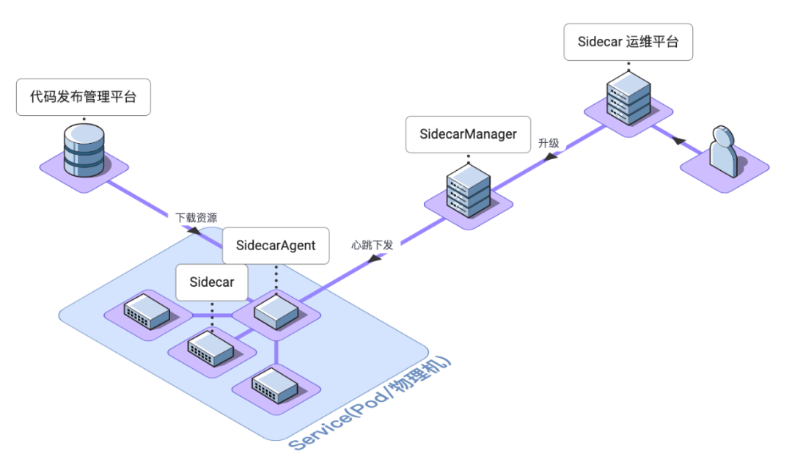
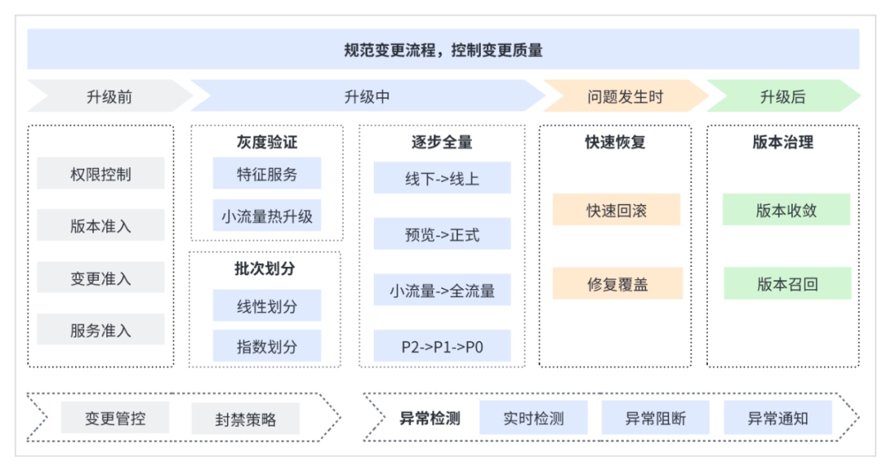

# 支持几十种业务场景，字节跳动大规模 Sidecar 运维管理实践

  
本文主要介绍了字节跳动 Sidecar 应用场景，以及进行 Sidecar 大规模版本升级的实践和总结。

  

## 字节 Sidecar 场景介绍
  

Sidecar 是一种用于扩展应用程序功能的架构模式。在 Sidecar 架构中，应用程序主进程和一个或多个 Sidecar 进程运行在同一个计算节点中，例如 Pod、物理机等，Sidecar 进程与主进程保持相同的生命周期，为应用程序提供额外的功能支持，例如网络、安全、日志、监控等相关功能。

  

  

目前，在字节跳动的微服务架构下，有丰富的 Sidecar 应用场景，包括 Service Mesh、网关、风控、流量录制、业务安全等几十种业务场景 Sidecar，支持了抖音、飞书、基础架构等多个业务线 / 部门。

  

以下，对几个典型 Sidecar 应用场景进行介绍。

### Service Mesh
  

在微服务体系下，RPC 框架是微服务之间通信的核心组件，RPC 框架支持了服务发现、流量调度、负载均衡、访问控制等复杂的服务治理功能。随着微服务规模变大，RPC 框架暴露出一些问题：

  

+ **多语言成本高**：服务使用的开发语言分散，包含 Go、Python、C++ 等多种语言，各语言 RPC 框架都要实现完备的服务治理功能，开发、维护成本很高；
+ **升级成本高**：治理功能更新后，需要升级框架版本，但是推动业务升级成本很高，如果版本有 Bug 也难以收敛；

  

  

Service Mesh 解决了上述问题，作为服务通信的基础设施，它实现了一个高性能多协议的数据面代理和一个灵活可扩展的控制面服务，RPC 框架复杂的治理功能下沉到了数据面，数据面以 Sidecar 的形式部署在服务实例中。

  

相比于传统的 RPC 框架，Service Mesh 优势如下：

  

+ **多语言成本低**：治理功能收敛到了数据面，各语言 RPC 框架轻量化，维护成本降低；
+ **升级成本低**：治理功能更新后，只需要升级数据面 Sidecar，Sidecar 与业务代码不耦合，可以单独升级；

### 分布式 API 网关
  

API 网关（APIGateway）以 API 为核心，提供流量调度、稳定性策略、服务治理等全套解决方案。

  

API 网关最初的架构是中心化网关，一个网关集群为多个服务进行分流，存在一些痛点问题：

  

+ **网关变更风险大**：网关的逻辑变更发布一旦有问题，将会影响所有业务；
+ **业务故障隔离差**：多个服务共用同一个网关集群，单服务出现问题可能影响其他服务；
+ **大促容量评估难**：每年双 11、新春红包活动，上万 API 接口的 QPS 很难评估，不同 API 的 延时、QPS、BodySize 对于网关性能的影响都是不同的，为了网关入口的稳定性，只能大量的扩容；

  

  

API 网关团队将网关改造成 Sidecar 部署到服务实例中，实现了分布式网关，并通过 Sidecar 运维平台对分布式网关进行管理。

  

通过分布式网关方案，解决了上述痛点问题：

  

+ **网关变更风险小**：网关的更新操作，只影响被变更的服务，粒度可控；
+ **业务故障隔离强**：不同服务相互隔离，出问题不会互相影响；
+ **无容量评估问题**：网关部署在服务 Pod 内，服务自行承担成本，自行扩容；

  

除了上述优化，也有其他收益：

  

+ 由于网关和 Service 通信由 RPC 改为了 IPC，**延时收益明显**，性能得到了提升。

### 风控 Sidecar
  

风控团队为业务提供 API 反爬取、反作弊支持，可以降低业务接口风险，加强 API 安全防护。

  

风控最初提供 SDK 接入方式，用户接入时，需要在业务代码中主动集成风控 SDK，存在以下痛点问题：

  

+ **用户接入成本高**：API 防护是基本的安全能力，有大量的 API 服务需接入，但是业务接入仍需修改代码，有一定的接入成本；
+ **多语言 SDK 维护成本高**：API 服务使用的语言不一致，不同语言均需要实现 SDK，SDK 更新迭代成本高；
+ **升级迭代困难**：SDK 和业务代码耦合在一起，SDK 升级时需要业务配合升级，版本迭代、问题收敛效率低；

  

  

为解决以上问题，风控团队和 Service Mesh 团队合作，借助 Sidecar 方案和 Service Mesh 的能力，设计开发了风控 Sidecar：

  

+ Mesh Proxy 与风控 Sidecar 通信进行 http 请求 / 应答的风控判断处理，Service 不感知风控逻辑；
+ 如果风控 Sidecar 拦截 http 请求，请求直接返回，Service 不会处理请求；

  

对比风控 SDK，通过风控 Sidecar 的方案，解决了上述痛点问题：

  

+ **用户接入成本低**：通过 Sidecar 运维平台动态注入 Sidecar，业务无感接入，接入成本低；
+ **无需维护多语言 SDK**：风控逻辑收敛到 Sidecar，只需要迭代 Sidecar；
+ **升级迭代简单**：风控逻辑更新，仅需升级 Sidecar，不用推动业务升级，升级节奏可控。

### MQ Sidecar
  

消息队列 MQ 团队提供了 RocketMQ/BMQ 两种消息队列来处理在线、离线场景。为了满足业务接入，目前每种消息队列提供了多个语言的 SDK，存在一些问题：

  

+ **多语言 SDK 维护成本高**：功能很难对齐，MQ  SDK 需要拓展流量治理、动态配置等能力，完善统一 Log、Metrics 逻辑，支持成本高；
+ **SDK 更新迭代速度慢**：SDK 版本更新后，需要随业务代码发版，由于使用 MQ 的业务很多，业务发版速度很慢；

  

  

因此，MQ 团队引入 Sidecar 架构方案，实现了 MQ Sidecar：

  

+ MQ Sidecar 负责对接 MQ，流量治理等复杂逻辑收敛在 MQ Sidecar；
+ 保留 MQ SDK，SDK 只有基本 Produce/Consume 逻辑，接口保持一致，业务无需感知 Sidecar；

  

对比 MQ SDK，通过 MQ Sidecar 的方案，解决了上述痛点问题：

  

+ **多语言 SDK 维护成本低**：MQ SDK 只保留基本逻辑，更新频率低，减少维护成本；
+ **更新迭代速度快**：MQ SDK 更新频率低，MQ Sidecar 更新频率高，但是 Sidecar 升级不受业务限制，升级速度快。

## Sidecar 架构的优势和挑战
### 优势
  

综合对几个典型 Sidecar 应用场景的介绍，可以总结出 Sidecar 架构核心优势如下：

  

+ **多语言维护成本低**：业务逻辑收敛到 Sidecar，降低维护多语言 SDK 的成本；
+ **用户接入成本低**：业务能力以 Sidecar 形式提供，用户可以无感接入，或者低成本接入；
+ **版本升级灵活可控**：Sidecar 版本更新后，可以单独升级，支持有效的版本收敛、缺陷版本召回。

### 挑战 - 升级运维
  

从上述分析可以看出，Sidecar 架构的关键是 Sidecar 进程可以独立运行、单独升级，因此，只有支持 Sidecar 的升级运维能力，才能使 Sidecar 架构真正发挥出优势。然而，Sidecar 的升级运维面临严峻的挑战。

  

不同于传统的微服务升级，Sidecar  升级场景更加复杂：

  

  

其中最关键的特点，Sidecar 升级面向的服务规模很大，以 Service Mesh Sidecar 举例，生产环境接入情况如下：

  

+ 微服务数量超过 **4W**
+ 实例数量超过 **400W**

  

在如此大规模的场景下，在进行版本升级的时候，一些问题会被放大：

  

+ **事故风险**：不同于升级单个 / 少量服务，升级的服务覆盖面过广时，如果版本有缺陷且扩散到很多服务，可能导致严重的业务受损，甚至出现挂站风险；
+ **时间成本**：由于服务数量过多，运维人员在进行升级时，需要进行灰度验证、灰度观察、全区域发布等操作，如果发现问题还要操作回滚、修复，这将耗费大量时间，可能影响迭代速度，也耗费大量人力；

#### 事故案例介绍
  

以下是一个真实的事故案例，展示了一次 Service Mesh 升级导致业务故障的处理全过程：

  

1. 开始：Mesh 团队操作升级，类型为热升级，升级了一批服务的小流量；
2. 业务报警：升级完成后，很快出现多个业务报警，包括 API 5xx、CPU 异常、MEM 异常报警；
3. 业务排查：业务开始排查，发现报错的都是小流量实例，怀疑是 Paas 平台异常或者流量调度问题，因此拉了 Paas 和 Mesh Oncall 进行排查；
4. 定位：Mesh 团队很快定位到是新版本问题，初步定位是新 feature 引入的 Bug 导致的 CPU 升高；
5. 处理：Mesh 团队操作热升级回滚，并对一些回滚失败的实例进行迁移解决；
6. 恢复：Mesh 版本回滚后，业务恢复正常；
7. 改进：Mesh 团队确认问题并修复，对后续发版流程进行了优化，完善了升级过程监控，加强了灰度验证流程。

  

  

#### 核心问题：稳定性 & 效率
  

在进行大规模 Sidecar 升级时，最核心的两个问题是**稳定性**和**效率**。

  

对于稳定性，主要关注业务故障风险：

  

+ 新版本缺陷：新版本可能引入缺陷，比如逻辑 Bug、SDK 兼容问题等，导致业务发生故障；
+ 灰度验证有效性：升级新版本时，需要进行灰度验证，但是灰度验证不充分，导致没有发现问题；
+ 故障感知与处理：问题发生时，Sidecar 运维人员缺少报警没有及时感知到，并在继续升级的过程中，异常版本大范围扩散，导致回滚、止损成本高。

  

历史上，Service Mesh 升级导致过 P0 事故，导致业务受损

  

对于效率，主要关注时间、人力成本：

  

+ 发布周期长：一个版本的发布周期可能很长，发布过程中，会出现多种情况影响发布速度，比如新 feature 随意插入、紧急 feature、缺陷修复等；
+ 耗费人力：发布过程中，会有多种原因导致人力耗费严重，比如发布周期长，自动化程度低导致灰度、升级、版本召回繁琐等。

  

历史上，Service Mesh 进行 1 次大版本升级，历时 5 个月，期间多次 feature 插入、问题修复，共发了 25 个小版本才最终完成升级

## Sidecar 大规模升级 - 思考
  

如何设计一套可靠的 Sidecar 大规模升级方案？为应对稳定性和效率两个挑战，主要从变更安全和变更效率两个角度展开思考：

  

+ 变更安全：确保升级过程是安全的，不会对业务造成稳定性影响；
+ 变更效率：尽可能缩短升级的时间，减少手工操作，降低人力成本。

### 变更安全
  

要保障升级过程的安全，必须树立对风险的正确意识：**问题一定存在**！

  

只不过，对于问题，存在已知问题和未知问题，对两种问题有不同的应对措施：

  

+ **杜绝**已知问题：对于已知问题，要有严密的机制防止其发生，比如：维护缺陷版本，拦截缺陷版本的升级，拒绝不该升级的服务；
+ **谨慎验证**未知问题：保证版本验证流程的合理性，尽早的将问题暴露出来，防止扩散。

  

当然，总有问题不可避免的发生，此时需要**积极应对**已发生问题：

  

+ 主动发现问题：要有主动检测、发现问题的手段，主动、尽早发现问题，缩短影响时间；
+ 阻断问题扩散：问题出现，要及时阻断，防止问题扩散面积过大；
+ 快速修复：要对问题快速修复，及时止损，比如快速回滚、修复版本快速覆盖等。

### 变更效率
  

为提升变更效率，首先，要完善变更规范：

  

+ 加强准入限制：杜绝随意的 feature 插入，并保证合入的 feature 经过严格测试，防止出现 Bug 影响发布速度；

  

其次，通过技术手段，尽量加快升级速度：

  

+ 自动化：提升灰度验证、逐步扩量、版本召回等流程的自动化水平，减少人的参与，减少人为导致问题的风险；
+ 安全加速：在有安全保证的前提下，合理的进行发布加速，提升速度。

### 总结
  

综上，对 Sidecar 大规模升级的思路进行总结：

  

  

在不同的升级阶段，综合多种策略保障变更安全和变更效率：

  

  

同时，最关键的，要将版本升级流程平台化，将上述策略固化在平台上。

## Sidecar 大规模升级 - 方案解析
  

我们构建了一套 Sidecar 运维管理系统，在系统上落地了 Sidecar 大规模升级方案，本节对如何进行安全、高效的 Sidecar 大规模升级进行详细解析。

### 运维管理系统
  

Sidecar 运维管理系统提供了一套 Sidecar 应用运维管理解决方案，支持多种云环境下 Sidecar 标准化接入、安全运行、观测运维、版本治理等能力。

  

系统包含以下核心组件：

  

+ **SidecarAgent**：与业务进程部署在同一个实例中，负责管理 Sidecar 进程的生命周期，包括启动、升级、退出、异常处理等；
+ **SidecarManager**：负责存储 Service 启用的 Sidecar 列表及版本信息，并下发给 SidecarAgent；
+ **Sidecar 运维平台**：负责 Sidecar 运维管理，支持 Sidecar 元信息管理、启 / 停用、升级等运维能力，平台的**升级计划**功能支持 Sidecar 大规模升级。

  

### 方案总览
  

以下为完整的升级方案总览：

  

  

方案从升级的各个阶段入手，通过引入多项措施控制变更质量，保障变更安全，并在安全的基础上加速升级，提升变更效率。

  

在**升级前**，严格控制准入，包括：变更准入、版本准入、服务准入等策略。

  

在**升级中**，平台构建了灰度验证、逐步全量的自动化发布流程，可以谨慎的对版本进行验证，并且谨慎的将版本逐步全量。

  

在**问题发生时**，平台支持通过快速回滚、修复覆盖的流程，支持快速恢复，快速止损。

  

在**升级后**，支持版本治理，包括对长尾版本的收敛，以及在版本发现异常后，对版本进行快速的召回。

  

另外，在发布的整个流程中：

  

+ 加强**变更管控**：平台对齐公司变更管控、封禁策略，杜绝在非可变更窗口进行升级，降低变更风险；
+ 主动**检测异常**：构建了异常检测机制，支持在升级中，对服务进行异常检测，在发现异常后，及时阻断升级。

  

以下，对升级流程中灰度验证、逐步全量和异常检测进行介绍，详细介绍如何将上述策略**落地**。

### 升级流程
#### 灰度验证
  

灰度是逐步将新版本验证稳定、可靠的过程，要在灰度阶段尽可能的验证出问题，不要到全量阶段才暴露出问题，不然会导致更大面积的影响。

  

**谨慎验证**

  

首先，关于**灰度覆盖面**，要确保灰度验证的有效性，需要保证足够的覆盖面，这样才能验证到足够多的场景。

  

但是，如何保证足够的覆盖面，对于 Sidecar 新版本可能影响的服务，分为两类：

  

+ 预期内受影响的服务：新版本的逻辑改动，对于预期内会受影响的服务，在升级时会明确关注；

  

比如：新版本变更了负载均衡算法，升级时会明确关注服务的流量负载情况

  

+ 预期外受影响的服务：新版本的逻辑改动，意外的影响到了某些服务，这些服务不会被关注到。

  

比如：一些历史逻辑受影响，或者有用户使用了非公开的特性

  

但是，「预期外受影响的服务」是很难知道的，如果灰度覆盖不到这些服务，就无法保证灰度的有效性。为了简单起见，我们选择了大力出奇迹的做法，选择对所有服务进行灰度，这样就尽量保证了覆盖面。

  

其次，关于**单服务灰度范围**，字节的服务部署区分小流量、单机房、全流量的部署阶段，小流量阶段一般只部署少量的实例，业务升级服务时使用该阶段进行新版本验证，因此 Sidecar 也使用小流量阶段进行灰度验证。

  

另外，关于**升级方式**，要保证灰度版本快速生效，这样有问题才能尽快暴露出来，因此，我们选择使用热升级的方式，热升级后，服务使用的 Sidecar 版本可以立即更新。

  

最后，还构建了**特征服务机制**，Sidecar 的升级，可能会对特定服务产生影响，比如特定语言、框架、通信协议，或者使用了特殊配置的服务，因此，我们构建了特征集合，并对每种特征选取有代表性的服务集合，灰度验证时，首先对这些服务进行验证，并充分观察服务是否异常。

  

比如：Service Mesh HTTP 压缩算法调整，影响到了配置特殊 HTTP 压缩算法的服务

  

  

**防扩散**

  

在灰度阶段，要将问题尽早的暴露出来，并防止问题扩散，其中有两个关键点：

  

+ 防扩散到全量阶段：在灰度阶段，将问题验证出来，并及时阻断后续升级流程；
+ 防扩散到过大灰度范围：因为要灰度覆盖所有服务，即便是在灰度阶段，出现问题后，也要避免影响过多服务，将业务影响降到最低。

  

为达成防扩散的目标，设计实现了以下方案：

  

首先，控制**升级顺序**，保障：

  

+ 服务敏感 / 重要程度：不敏感 / 不重要 -> 敏感 / 重要
+ 升级后观察充分程度：观察充分 -> 观察不充分

  

具体顺序如下：

  

+ 服务等级：P2 -> P1 -> P0
+ 部署区域：线下 -> 线上各区域
+ 部署环境：预览环境 -> 生产环境
+ 服务分类：特征服务 -> 全量服务

  

基于上述升级顺序，对全量服务进行顺序编排，然后逐步对服务进行灰度升级。

  

其次，控制**升级节奏**，要防止一次变更影响过多服务，控制好爆炸半径：

  

分批发布：对服务进行合理的批次划分，确定合适的分批间隔，逐个批次进行升级，目前平台支持指数分批、线性分批策略；

  

限制变更数量上限：限制好每批的变更数量上限，也限制好每天的变更数量上限。

  

  

分批发布 - 指数分批

  

  

分批发布 - 线性分批

  

最后，支持**异常检测、异常阻断**：

  

+ 异常检测：在升级时，创建异常检测任务，对服务异常进行检测；
+ 异常阻断：如果检测到异常后，及时阻断升级，并通知用户，进行异常问题确认。

  

  

检测到异常后的工单详情页面

  

  

异常检测详情页面

  

#### 逐步全量
  

灰度验证完成后，说明新版本已经基本稳定，可以开始全量的发布，但是，仍不排除有特殊问题没有暴露出来，因此，在全量的过程中，也要防范问题的发生。

  

全量阶段，主要目的是进行**安全的铺量**，在保证安全的前提下，将新版本逐步的升级到全量服务。

  

主要采用了以下策略：

  

+ 安全升级

  

不同于灰度阶段使用热升级的方式，使用安全升级进行全量，安全升级不会让版本立即生效，而是配置好目标版本，跟随业务升级生效。使用安全升级，可以避免热升级可能导致的业务流量受损，并且服务在升级时，有服务负责人进行充分的稳定性观察，相比热升级安全很多。

  

+ 控制顺序

  

和灰度验证类似，安全铺量阶段，也采用相同的升级顺序控制，确保先升级不敏感 / 不重要的服务，保障敏感 / 重要的服务。

  

+ 控制节奏

  

和灰度验证类似，安全铺量阶段，也采用相同的升级节奏控制，进行分批升级，限制变更数量上限，控制好爆炸半径。

  

+ 并行加速

  

由于升级的区域很多，为加速升级速度，对不同的区域进行合理的并行推进，加快推进速度。

#### 流程总结
  

对升级流程进行总结，以下为一个升级流程的全貌，包括灰度阶段、全量阶段，以及，升级完成后的版本收敛阶段。

  

平台将这些流程、策略都固化下来，支持了大规模升级流水线，可以支持自动化的版本升级，保障变更安全，提升变更效率。

  

以 Service Mesh 升级为例，各阶段大概耗时如下：

+ 灰度阶段 - 线下：5 个工作日
+ 灰度阶段 - 线上各区域：12 个工作日
+ ‍全量升级（线下 & 线上）：11 个工作日

  

### 异常检测
  

在 Sidecar 升级过程中，平台支持主动检测、主动发现异常，在出现问题后，平台可以及时的阻断异常，降低故障影响时间，减少业务损失。

  

Sidecar 升级过程中，如果新版本有问题，一般会导致 Sidecar 自身或者业务出现异常问题，比如：

  

+ Sidecar 异常：Sidecar 异常退出，Sidecar CPU、MEM 出现异常增长；
+ 服务异常：服务接口错误率升高、延时升高，调用下游错误率升高，实例 CPU、MEM 出现异常增长，甚至服务出现告警等。

  

这些问题一般能从指标、日志等方面检测出来，也可以从服务告警反映出异常。因此，我们可以对这些指标、日志、服务告警等进行检测，检测是否有异常发生。

  

我们和字节内部上线检测平台（Niffler）合作，构建了 Sidecar 检测模型，在升级过程中对服务、Sidecar 的异常进行检测，检测模型包含以下三类检测指标：

  

+ 基座服务指标：检测服务是否出现进程退出 /Panic，CPU、MEM 占用上涨，接口成功率下降、延时上涨，错误日志增多，出现服务告警等；
+ Sidecar 通用指标：检测 Sidecar 是否发生进程退出 /Panic，CPU、MEM  占用上涨等；
+ Sidecar 自定义指标：Sidecar 开发者可以配置自定义指标，检测这些指标是否出现异常。

## 落地效果
  

以 Service Mesh 为例，该大规模升级方案上线后，升级稳定性和效率都有明显收益：

  

在**稳定性**方面，很多问题在灰度验证时被及时发现，异常检测机制也检测、发现到很多异常，版本升级导致的**事故数量、等级明显降低**。

  

在**升级效率**方面，Service Mesh 发布一次大版本，**小版本数量**和**发布耗时**都明显下降：

  

Service Mesh 在一个大版本的升级过程中，会发布小版本进行灰度、全量的全流程，如果小版本成功全量到所有服务，则完成大版本的升级。

但是，在小版本发布过程中，如果有紧急 feature、问题修复，则需要重新发布新的小版本，一般要发布多个小版本，才能完成大版本升级。

  

+ 平均小版本数量：从 10+ 个降低到 8.6 个

  

  

+ 一次大版本发布，平均耗时：从 4+ 个月降低到 2.1 个月

  

## 下一步计划
  

**1. 继续提升效率**

  

目前，虽然大规模升级效率已经有了明显提升，但是由于字节跳动业务覆盖区域很多，平台缺乏多区域串联能力，目前操作所有区域的升级仍是一件繁琐的事情。因此，我们计划会进一步增强多区域升级的能力，降低多区域操作成本。

  

另外，为了解决升级过程中，如果发现版本缺陷，进行修复并重新升级，对升级速度影响过大的问题，我们也在探索更高效的小版本自动验证机制，进一步加快问题发现能力，加快升级速度。

  

**2. 完善异常检测**

  

目前，虽然支持了异常检测能力，但是当前的检测模型还比较简单，检测准确率有待提升，存在较多的误报、漏报。因此，我们后续会对检测模型进行进一步调优，提升准确率，以发挥异常检测的更多价值。

  

**3. 加强版本收敛**

  

目前，虽然设计了版本收敛阶段，但是平台对于版本收敛的功能支持并不好。有些 Sidecar 仍旧会存在比较多的长尾版本，并且如果出现缺陷版本，召回流程也比较繁琐。因此，我们后续会进一步加强版本收敛能力，支持更有效的长尾版本收敛、缺陷版本召回功能。

> 更新: 2025-03-17 17:23:10  
> 原文: <https://www.yuque.com/u12222632/as5rgl/yf6pssxtesoz6pu3>