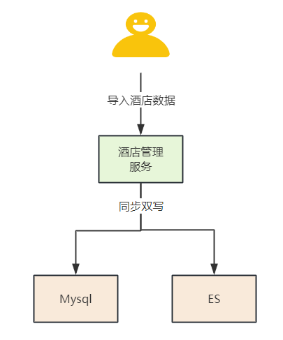
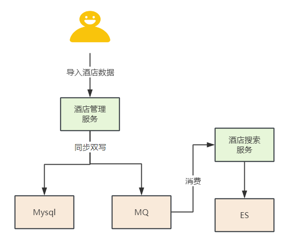
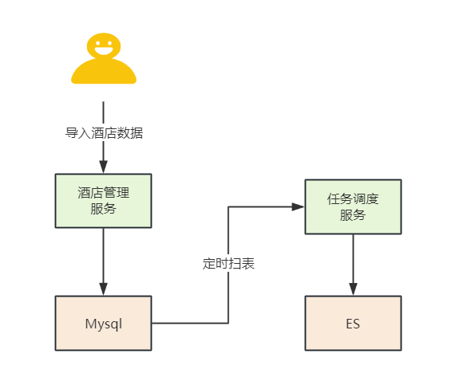
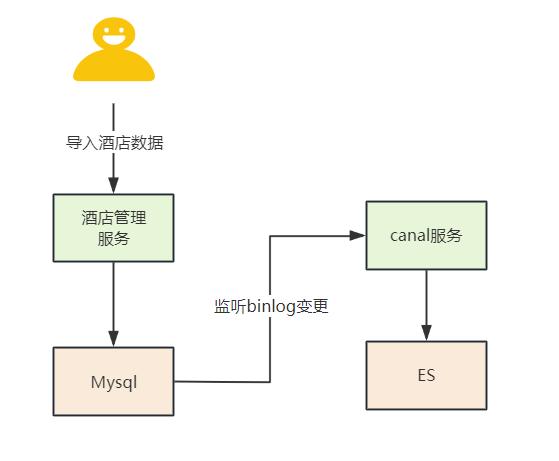
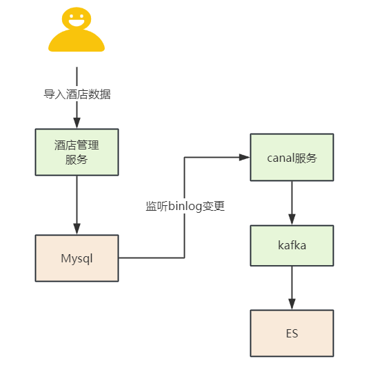

# Mysql同步到ES，如何保证数据一致性

# **1.业务场景介绍**
## **1.1 需求分析**
某知名的在线旅游平台，在即将到来的元旦春节促销活动之前，决定推出一项新的功能：用户可以通过输入目的地、酒店名称、房型、价格范围等属性来搜索旅游优惠酒店。为了及时上线这一功能，运营团队需要将现有的酒店数据同步到高效的搜索引擎中，以支持用户的高频搜索需求。

+ 功能需求：按目的地、酒店名称、房型、价格范围等属性进行全模糊搜索酒店信息。
+ 非功能需求：
    - 性能：预计春季促销期间酒店搜索的QPS将达到1000左右，搜索结果会包含丰富的酒店信息。
    - 响应时间：搜索响应时间需控制在500毫秒以内，以确保良好的用户体验。
    - 数据一致性：确保搜索结果反映的是最新的酒店信息及可用性。

## **1.2 技术实现方案**
假设底层使用MySQL数据库存储酒店数据，以下是实现该需求的技术方案：

+ 数据同步：利用MySQL的binlog或第三方数据同步工具（如Debezium、Canal等）来实时监听酒店数据的变更，并将这些变更同步到Elasticsearch中。
+ 索引构建：在Elasticsearch中为目的地、酒店名称、房型、价格范围等字段建立合适的索引，以支持快速和高效的模糊搜索。

通过将数据从MySQL实时同步到Elasticsearch，并优化查询性能，我们可以实现一个快速、准确的酒店搜索功能，满足春季促销期间的高并发搜索需求。

思考： 如何保证Mysql数据库和ES的数据一致性？

# **2.业界常用数据一致性方案分析**
在确保My数据库和Elasticsearch（ES）数据一致性方面，业界有几种常见的方案：

1. **同步双写方案**

在代码中对数据库和ES进行双写操作，确保先更新数据库后更新ES。如果数据库更新成功而ES更新失败，可以通过事务回滚来保证一致性。这种方案简单易实现，但可能存在性能瓶颈和不一致的风险。 

1. **MQ异步双写方案**

使用消息队列（如RocketMQ、Kafka等）作为中间件，应用程序在更新数据库后发送消息到MQ，由MQ的消费者异步更新ES。这种方案可以解耦数据库和ES，提高性能，但可能存在消息延迟和系统复杂度增加的问题。 

1. **扫表定时同步方案**

通过定时任务定期扫描数据库，将变更的数据同步到ES。这种方案的实时性较差，但可以减少对数据库的即时压力。 

1. **监听binlog同步方案**

通过直接监听MySQL的binlog来实现数据库和ES之间的实时同步。这种方案对业务代码没有侵入性，可以实现数据库和ES的实时同步，但需要额外的框架和可能存在一定的延迟。 

## **2.1 同步双写方案**
### **实现思路**
在数据写入MySQL的同时，直接将相同的数据写入ES。

### **优缺点对比**
#### **优点**
1. 数据一致性：双写策略可以保证在MySQL和Elasticsearch之间数据的强一致性，因为每次数据库的变更都会在Elasticsearch中同步反映。
2. 实时性：双写策略可以实现数据的实时同步，用户在MySQL中进行的任何操作都会立即在Elasticsearch中体现。
3. 易于实现：从技术角度来说，双写策略的实现相对简单，通常只需要在应用程序代码中添加额外的写入逻辑。

#### **缺点**
1. 代码复杂性：需要在应用程序中增加额外的代码来处理数据的双写，这会增加代码的复杂性和维护难度。
2. 性能开销：每次数据库操作都需要执行两次，这会导致额外的性能开销，尤其是在高并发的场景下。
3. 数据不一致风险：在双写过程中，如果发生系统故障或网络延迟，可能会出现数据不一致的情况，尤其是在写入MySQL成功但写入ES失败时。

### **应****用场景**
系统特点:旧系统年限长、单体架构且技术比较落后,如果引入除es之外的其他中间件治理成本很高，可以考虑这个方案。

业务场景:用户量少、偏后台管理类的系统，对数据同步的实时性要求很高,接近实时。

## **2.2 MQ异步双写方案**
### **实现思路**
使用消息队列（如RocketMQ、Kafka等）作为中间件，应用程序在更新数据库后发送消息到MQ，由MQ的消费者异步更新ES。

**方案核心**

+ 生产者端双写：生产者系统在发送消息到MQ的同时，也写入到Mysql。
+ 消费者端异步处理：消费者从MQ中读取消息，并异步地将消息处理结果写入到ES。

### **优缺点对比**
#### **优点**
+ 系统解耦：MQ的使用使得MySQL和ES之间的依赖性降低，提高了系统的可维护性和扩展性。
+ 高可用性：MQ可以提供消息的持久化存储，确保即使系统故障，消息也不会丢失。
+ 容错性：在双写过程中，即使某个系统出现故障，数据仍然可以通过其他系统恢复。

#### **缺点**
+ 延迟：异步处理可能会导致数据同步的延迟，特别是在高负载或系统资源不足的情况下。
+ 复杂度：引入MQ和双写机制增加了系统的复杂度，需要更多的开发和维护工作。
+ 补偿机制：需要设计复杂的补偿机制来处理同步失败的情况，增加了系统的复杂性。

### **应用场景**
**系统特点**：

+ C端系统：该系统面向最终用户，可能是移动应用、Web应用或桌面应用。
+ 引入MQ中间件：系统架构中已经包含了消息队列中间件，这为异步处理提供了基础。
+ 接口TPS性能要求：系统对接口的吞吐量（TPS，Transactions Per Second）有一定要求，需要保证高并发情况下的性能。

**业务场景**：

+ 用户体量大，高并发场景：系统服务的大量用户同时进行操作，导致系统面临高并发压力。
+ 业务变更少：业务逻辑变更相对较少，数据同步的需求比较稳定。
+ 允许一定的延迟：在保证用户体验的前提下，数据同步的延迟在秒级范围内是可以接受的。

## **2.3 扫表定期同步方案**
### **实现思路**
通过定时任务定期扫描数据库，将变更的数据同步到ES。

### **优缺点对比**
#### **优点**
**1. 实现简单**：使用定时任务调度框架，不需要复杂的开发工作。

**2. 适合批量数据**：对于大量数据的迁移，批量处理可以减少网络传输次数和ES的写入压力。

**3. 对业务影响小**：定时任务可以在系统负载较低的时段运行，对在线业务影响较小。

#### **缺点**
**1. 实时性差**：由于是定期执行，数据同步存在延迟，不适合对实时性要求高的应用。

**2. 性能影响**：同步过程中可能会对MySQL和ES的性能产生短期影响，尤其是在数据量大时。

**3. 数据一致性**：如果在同步周期内数据发生变化，可能会导致ES中数据与MySQL不一致。

### **应用场景**
系统特点:旧系统年限长、技术框架老旧，引入其他的中间件成本很高。

业务场景:用户体量小、偏报表统计类业务、对数据实时性要求不高。

## **2.4 监听binlog同步方案**
### **实现思路**
通过直接监听MySQL的binlog来实现数据库和ES之间的实时同步。

在高并发场景下，直接将binlog事件推送到ES可能会导致ES负载过高。Kafka可以作为缓冲层，暂时存储binlog事件，平滑数据流，避免瞬时的高负载。

### **优缺点对比**
#### **优点**
+ 业务无侵入，数据同步准实时
+ 业务解耦，不需要关注原来系统的业务逻辑。

#### **缺点**
+ 构建 Binlog 系统复杂；
+ 如果采用 MQ 消费解析的 Binlog 信息，也会像方案二一样存在 MQ 延时的风险。

### **应用场景**
系统特点: c端系统，开放mysql binlog日志监听，引入第三方canal中间件成本不高。

业务场景: 互联网公司，用户体量大、大型多中心组织、高并发场景，业务上允许有一定的延迟(秒级)。

> 更新: 2024-12-18 10:31:17  
> 原文: <https://www.yuque.com/u12222632/as5rgl/ovzm04r24tgwmgnx>