# RocketMQ5.x实战

## 1.RocketMQ介绍
RocketMQ是一款由阿里巴巴开源的分布式消息中间件。它具有低延迟、高吞吐量、高可用性和高可靠性等特点，适用于构建具有海量消息堆积和异步解耦功能的应用系统。

### <font style="color:rgb(28, 30, 33);background-color:rgb(250, 250, 250);">1.1.基本概念</font>
+ **<font style="color:rgb(28, 30, 33);background-color:rgb(250, 250, 250);">生产者（Producer）</font>**<font style="color:rgb(28, 30, 33);background-color:rgb(250, 250, 250);">：也称为</font><font style="color:rgb(18, 18, 18);">消息发布者，</font><font style="color:rgb(28, 30, 33);background-color:rgb(250, 250, 250);">是RocketMQ中用来构建并传输消息到服务端的运行实体。</font>
+ **<font style="color:rgb(28, 30, 33);background-color:rgb(250, 250, 250);">主题（Topic）</font>**<font style="color:rgb(28, 30, 33);background-color:rgb(250, 250, 250);">：Topic是RocketMQ中消息传输和存储的顶层容器，用于标识同一类业务逻辑的消息；</font><font style="color:rgb(28, 30, 33);background-color:rgb(250, 250, 250);">Topic是一个逻辑概念，并不是实际的消息容器；</font><font style="color:rgb(28, 30, 33);background-color:rgb(250, 250, 250);"></font>
+ **<font style="color:rgb(28, 30, 33);background-color:rgb(250, 250, 250);">消息队列（MessageQueue）</font>**<font style="color:rgb(28, 30, 33);background-color:rgb(250, 250, 250);">：队列是RocketMQ中消息存储和传输的实际容器，也是消息的最小存储单元。</font>
+ **<font style="color:rgb(28, 30, 33);background-color:rgb(250, 250, 250);">消费者（Consumer）</font>**<font style="color:rgb(28, 30, 33);background-color:rgb(250, 250, 250);">：</font><font style="color:rgb(18, 18, 18);">也称为消息订阅者，</font><font style="color:rgb(28, 30, 33);background-color:rgb(250, 250, 250);">是RocketMQ中用来接收并处理消息的运行实体。</font>
+ **<font style="color:rgb(28, 30, 33);background-color:rgb(250, 250, 250);">消费者组（ConsumerGroup）</font>**<font style="color:rgb(28, 30, 33);background-color:rgb(250, 250, 250);">：消费者组是RocketMQ中承载多个消费行为一致的消费者负载均衡分组。和消费者不同，消费者组是一个逻辑概念。</font>
+ **NameServer**：<font style="color:rgb(37, 41, 51);">可以理解成注册中心，负责</font><font style="color:rgb(18, 18, 18);">更新和发现Broker服务</font><font style="color:rgb(37, 41, 51);">。在NameServer的集群中，NameServer与NameServer之间是没有任何通信的，它是无状态的。</font>
+ **<font style="color:rgb(37, 41, 51);">Broker</font>**<font style="color:rgb(37, 41, 51);">：可以理解为</font><font style="color:rgb(18, 18, 18);">消息中转角色，</font>负责消息的存储和转发，接收生产者产生的消息并持久化消息；当用户发送的消息被发送到Broker时，Broker会将消息转发到与之关联的Topic中，以便让更多的接收者进行处理。

### 1.2.消息模型  
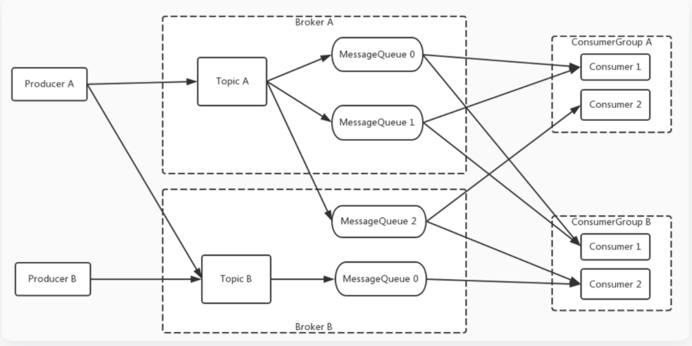
### 1.3.部署模型
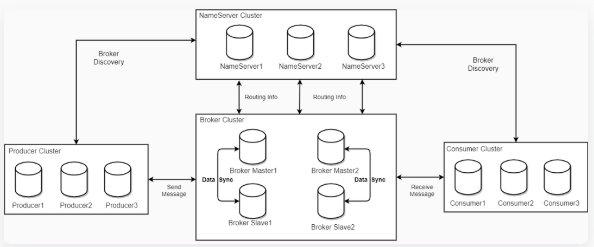

## 2.下载RocketMQ
RocketMQ的官网地址：[https://rocketmq.apache.org/](https://rocketmq.apache.org/)

Github地址：[https://github.com/apache/rocketmq](https://github.com/apache/rocketmq) 

下载地址：[https://rocketmq.apache.org/zh/download/](https://rocketmq.apache.org/zh/download/)

当前最新的版本为5.1.0，本教程安装5.1.0版本。

## 3.安装RocketMQ
### 3.1.安装前需要准备一个CentOS7的Linux机器，使用的Linux版本如下：
```powershell
[root@localhost bin]# uname -a
```

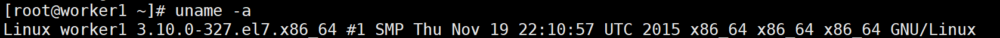

### 3.2.安装JDK
推荐使用JDK1.8版本。可以使用课件资料包或者自行下载tar.gz包。

#### 1.统一规划目录，创建app文件夹，在创建jdk文件夹，将jdk的包上载到 /app/jdk目录下然后解压
```powershell
[root@localhost /]# cd ..
[root@localhost /]# mkdir app
[root@localhost /]# cd app/
[root@localhost app]# mkdir jdk
[root@localhost app]# cd jdk/
[root@localhost jdk]# tar -zxvf jdk-8u171-linux-x64.tar.gz
```

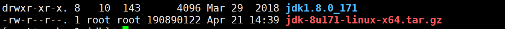

#### 2.配置jdk环境变量，将JAVA_HOME变量加上;将path路径替换成相应配置
```powershell
[root@localhost jdk]# vi /etc/profile
#jdk解压后的目录路径
export JAVA_HOME=/app/jdk/jdk1.8.0_171/  
PATH=$JAVA_HOME/bin:$PATH:$HOME/.local/bin:$HOME/bin
```


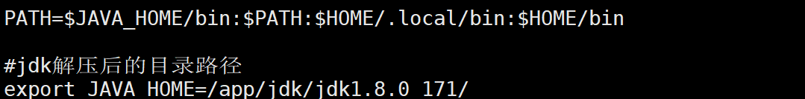

#### 3.更新配置并查看jdk版本，显示以下信息则安装成功。
```powershell
[root@localhost jdk]# source /etc/profile
[root@localhost jdk]# java -version
```

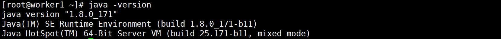

### 3.3.安装RocketMQ
#### 3.3.1.将安装包上载到 /app/rocketMQ目录下
```powershell
#先在app目录下创建rocketMQ文件夹
[root@localhost jdk]# cd ..
[root@localhost app]# mkdir rocketMQ

#将bin上载到/app/rocketMQ目录然后解压（也可以先解压在上载，推荐先上载后解压）
[root@localhost app]# cd rocketMQ/
[root@localhost rocketMQ]# unzip rocketmq-all-5.1.0-bin-release.zip
```

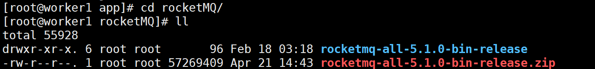

#### 3.3.2.配置rocketMQ环境变量
```powershell
#将ROCKETMQ_HOME变量加上，在path路径加上$ROCKETMQ_HOME/bin:
[root@localhost rocketMQ]# vi /etc/profile
#rocketMQ路径
export ROCKETMQ_HOME=/app/rocketMQ/rocketmq-all-5.1.0-bin-release
export PATH=$ROCKETMQ_HOME/bin:$JAVA_HOME/bin:$PATH:$HOME/.local/bin:$HOME/bin
#namesrv后续broker会使用到,先加上
export NAMESRV_ADDR='worker1:9876;worker2:9876;worker3:9876'
```

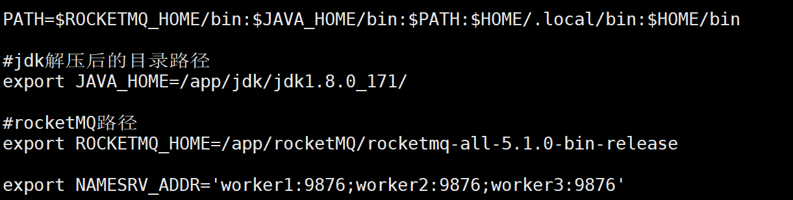

#### 3.3.3.更新配置
```powershell
[root@localhost rocketMQ]# source /etc/profile
```

ROCKETMQ_HOME的环境变量是必须要单独配置的，如果不配置的话，启动NameSever和Broker都会报错。这个环境变量的作用是用来加载$ROCKETMQ_HOME/conf下的除broker.conf以外的几个配置文件。所以实际情况中，可以不按这个配置，但是一定要能找到配置文件。这样RocketMQ就安装完成了。

### 3.4.RocketMQ工作原理
官网5.0版本速览链接：[https://rocketmq.apache.org/zh/version/](https://rocketmq.apache.org/zh/version/)

<font style="color:rgb(28, 30, 33);background-color:rgb(250, 250, 250);">RocketMQ5.0 引入了全新的弹性无状态代理模式，将当前的Broker职责进行拆分，对于客户端协议适配、权限管理、消费管理等计算逻辑进行抽离，独立无状态的代理角色提供服务，Broker则继续专注于存储能力的持续优化。值得注意的是RocketMQ 5.0的全新模式是和4.0的极简架构模式相容相通的，5.0的代理架构完全可以以Local模式运行，实现与4.0架构完全一致的效果。开发者可以根据自身的业务场景自由选择架构部署，本教程也是部署的Local模式。</font>

RocketMQ启动流程如下：

        * 启动NameServer
        * 启动Broker


### 3.5.NameServer服务搭建
启动NameServer非常简单，在$ROCKETMQ_HOME/bin目录下有个mqnamesrv。直接执行这个脚本就可以启动RocketMQ的NameServer服务。

由于RocketMQ默认预设的JVM内存是4G，这是RocketMQ给我们的最佳配置。但是通常我们用虚拟机的话都是不够4G内存的，所以需要调整下JVM内存

大小。修改的方式是直接修改runserver.sh。 

#### 3.5.1.修改NameServer启动配置
```powershell
[root@localhost rocketMQ]# cd rocketmq-all-5.1.0-bin-release/bin/
[root@localhost bin]# vi runserver.sh
#将JAVA_OPT="${JAVA_OPT} -server -Xms4g -Xmx4g -Xmn2g 修改为 -server -Xms512m -Xmx512m -Xmn256m
```

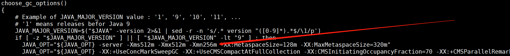

#### 3.5.2.启动NameServer
NameServer的配置修改完成，然后我们用静默启动的方式启动NameServer服务，启动完成后在nohup.out里看到这一条关键日志就是启动成功。并且使用jps指令可以看到有一个NamesrvStartup进程。

```powershell
#静默启动
[root@localhost bin]# nohup ./mqnamesrv &
#查看日志
[root@localhost bin]# tail -f nohup.out 
```

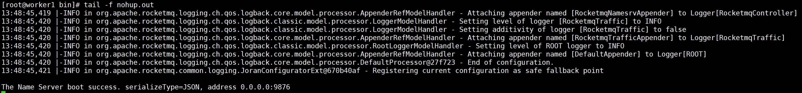

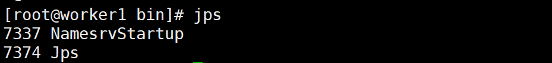

### 3.6.Broker服务搭建
启动Broker的脚本是runbroker.sh。Broker的默认预设内存是8G，启动前，如果内存不够，同样需要调整下JVM内存。修改的方式是直接修改runbroker.sh。

#### 3.6.1.修改broker启动脚本配置
```powershell
[root@localhost bin]# vi runbroker.sh
#将JAVA_OPT="${JAVA_OPT} -server -Xms8g -Xmx8g" 修改为 JAVA_OPT="${JAVA_OPT} -server -Xms512m -Xmx512m"
```

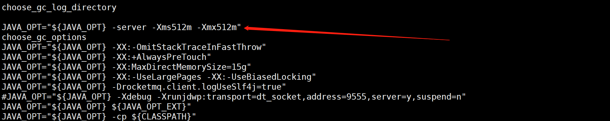

#### 3.6.2.修改broker配置文件
```powershell
#修改broker资源配置文件，允许自动创建Topic
[root@localhost bin]# cd ../conf/
[root@localhost conf]# vi broker.conf
#允许自动创建topic
autoCreateTopicEnable=true
#添加nameserver地址
namesrvAddr=localhost:9876
```

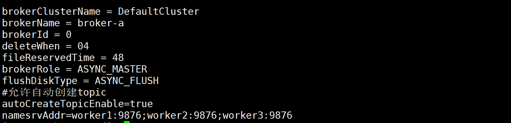

#### 3.6.3.启动broker服务
Broker的配置修改完成，然后我们用静默启动的方式启动Broker服务，同样是检查nohup.out日志, 并且jps指令可以看到一个BrokerStartup进程。

```powershell
1.回到bin目录下，静默启动broker
[root@localhost conf]# cd ../bin
[root@localhost bin]# nohup ./mqbroker -c ../conf/broker.conf &
2.查看日志,显示如下即显示成功*********每次启动broker时都要关注是否注册到目标nameserver上（name server is worker1:9876）
[root@localhost bin]# tail -f nohup.out 
[root@localhost bin]# jps
```

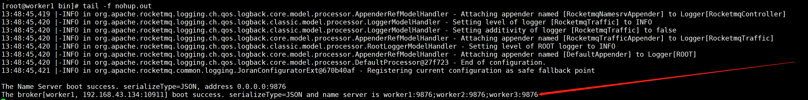

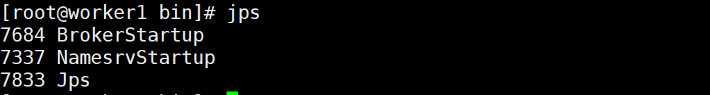

### 3.7.测试RocketMQ消息发送与消费
在RocketMQ的安装包中，提供了一个tools.sh工具可以用来在命令行快速验证RocketMQ服务。

#### 1.我们在bin录下执行以下命令测试消息发送，默认会发1000条消息，发送完成自动关闭
**<font style="color:#DF2A3F;">如果出现route报错，跳转到目录4.2.1章节</font>**

```powershell
[root@localhost bin]# export NAMESRV_ADDR='localhost:9876'
[root@localhost bin]# ./tools.sh org.apache.rocketmq.example.quickstart.Producer
```

#### 2.出现以下提示则代表消息发送成功
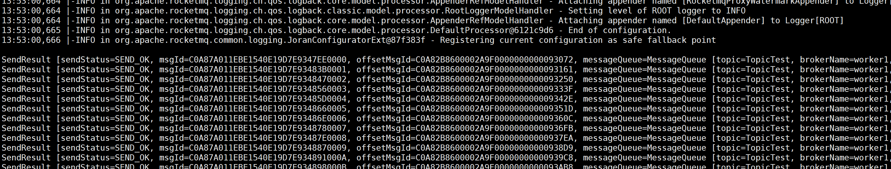

#### 3.执行以下命令测试消息接收，Consumer执行不会自动关闭，会一直挂起等待新消息过来；
**<font style="color:rgb(223, 42, 63);">需</font>****<font style="color:rgb(223, 42, 63);">如果出现route报错，跳转到目录4.2.1章节</font>**

```powershell
[root@localhost bin]# export NAMESRV_ADDR='localhost:9876'
[root@localhost bin]# ./tools.sh org.apache.rocketmq.example.quickstart.Consumer
```

#### 4.出现以下提示则代表消息接收成功
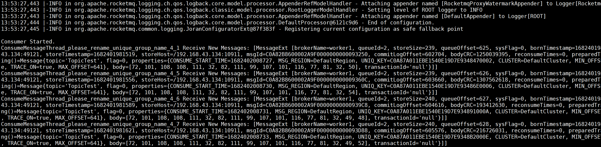

### 3.8.关闭RocketMQ服务
在bin目录下通过脚本关闭服务：

#### 1.关闭Broker
```powershell
sh ./mqshutdown broker
```

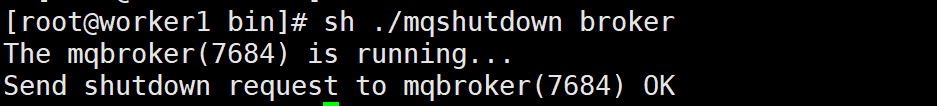

#### 2.关闭NameServer
```powershell
sh ./mqshutdown namesrv
```

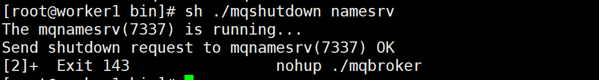

#### 3.查看服务
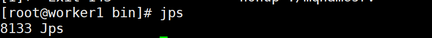

**至此RockMQ单机测试成功，接下来搭建集群。**

## 4.RocketMQ集群架构
刚才的演示中，我们已经体验到了RocketMQ是如何工作的。我们回头看RocketMQ的集群架构，就能够有更全面的理解了。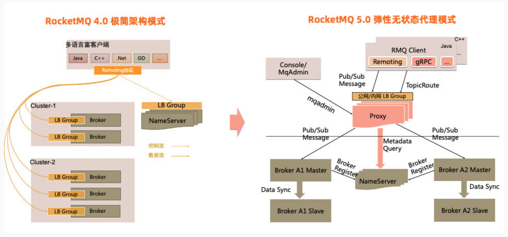

### 4.1.RocketMQ集群架构解析
一个完整的RocketMQ集群中，有如下几种角色 ：

+ Producer：消息的发送者；举例：发信者
+ Consumer：消息接收者；举例：收信者
+ Broker：暂存和传输消息；举例：邮局
+ NameServer：管理Broker；举例：各个邮局的管理机构
+ Topic：区分消息的种类；一个发送者可以发送消息给一个或者多个Topic；一个消息的接收者可以订阅一个或者多个Topic消息 。
+ Message Queue：相当于是Topic的分区；用于并行发送和接收消息。

### 4.2.RocketMQ集群搭建
准备三台虚机，并配置机器名。可以利用安装好的虚机通过克隆出另外两个机器。

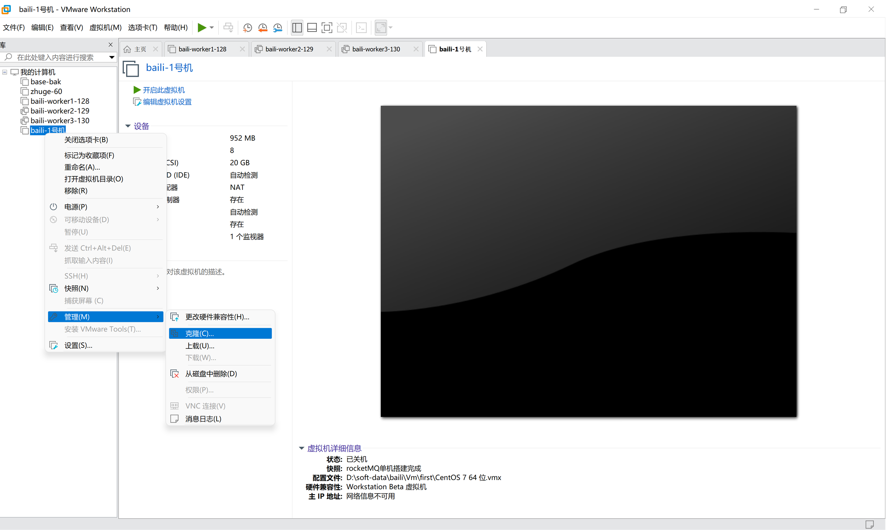

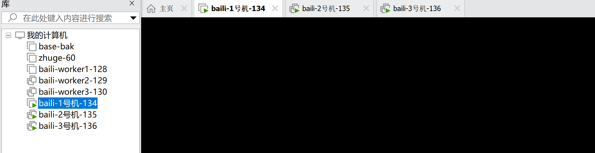

#### 4.2.1.系统配置
##### 1.使用vi /etc/hosts命令，配置机器名，在文件末尾加上以下配置:
```powershell
[root@localhost ~]# vi /etc/hosts
192.168.43.134 worker1
192.168.43.135 worker2
192.168.43.136 worker3
```

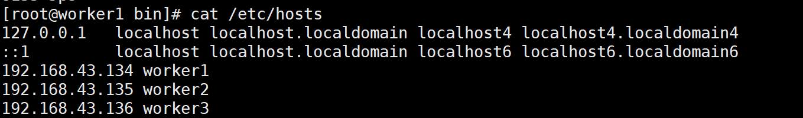

##### 2.服务之间设置免密登陆，三个机器都使用ssh-keygen生成秘钥。提示录入直接回车即可
```powershell
[root@localhost ~]# ssh-keygen
```

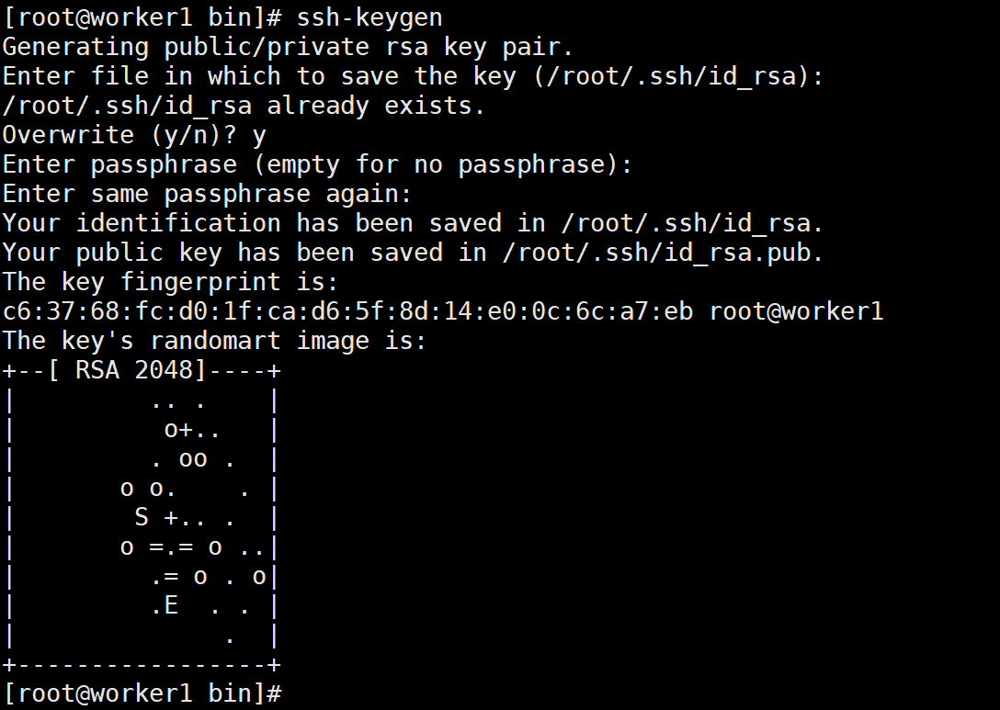

##### 3.三个机器都使用以下命令分发给其他机器，输入yes，然后输入密码；这样可以直接某个机器使用ssh或者scp到另外的机器。
```powershell
[root@localhost ~]# ssh-copy-id worker1
[root@localhost ~]# ssh-copy-id worker2
[root@localhost ~]# ssh-copy-id worker3
```

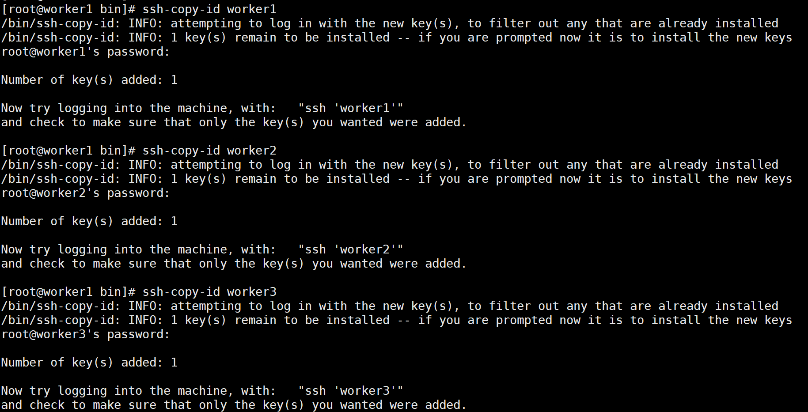

##### 4.停止并禁用防火墙或者删除防火墙，我这边使用的是删除防火墙。
```powershell
#检查防火墙状态
[root@localhost ~]# firewall-cmd --state
#停止并禁用防火墙
[root@localhost ~]# systemctl stop firewalld
[root@localhost ~]# systemctl disable firewalld
#删除防火墙
[root@localhost ~]# yum remove firewalld
```


#### 4.2.2.配置RocketMQ主从集群
使用conf/2m-2s-async下的配置文件搭建一个2主2从异步刷盘的集群。设计的集群情况如下：

| 机器名 | nemaeServer节点部署 | broker节点部署  |
| --- | --- | --- |
| worker1 | nameserver  |  |
| worker2 | nameserver  | broker-a,broker-b-s |
| worker3 | nameserver  | broker-b,broker-a-s |


##### 4.2.2.1.配置方式：conf目录下存在三种配置方式
+ 2m-2s-async：2主2从异步刷盘(吞吐量较大，但是消息可能丢失)
+ 2m-2s-sync：2主2从同步刷盘(吞吐量会下降，但是消息更安全)
+ 2m-noslave：2主无从(单点故障)，然后还可以直接配置broker.conf，进行单点环境配置

而dleger就是用来实现主从切换的。集群中的节点会基于Raft协议随机选举出一个leader，其他的就都是follower。通常正式环境都会采用这种方式来搭建集群。

##### 4.2.2.2.搭建2主2从模式，配置2m-2s-async目录Broker文件：
```powershell
1.进入conf/2m-2s-async下:
[root@localhost /]# cd /app/rocketMQ/rocketmq-all-5.1.0-bin-release/conf/2m-2s-async/

2.配置worker2机器的主节点,将下方broker-a.properties内容配置到相应文件中，原有配置使用 #号屏蔽
[root@localhost 2m-2s-async]# vi broker-a.properties 

3.配置worker2机器的主节点,将下方broker-b-s.properties内容配置到相应文件中，原有配置使用 #号屏蔽
[root@localhost 2m-2s-async]# vi broker-b-s.properties 

4.配置worker3机器的主节点,将下方broker-b.properties内容配置到相应文件中，原有配置使用 #号屏蔽
[root@localhost 2m-2s-async]# vi broker-b.properties 

5.配置worker3机器的主节点,将下方broker-a-s.properties内容配置到相应文件中，原有配置使用 #号屏蔽
[root@localhost 2m-2s-async]# vi broker-a-s.properties 
```

```powershell
#所属集群名字，名字一样的节点就在同一个集群内
brokerClusterName=DefaultCluster
#broker名字，名字一样的节点就是一组主从节点。
brokerName=broker-a
#brokerid,0就表示是Master，>0的都是表示Slave
brokerId=0
#nameServer地址，分号分割
namesrvAddr=worker1:9876;worker2:9876;worker3:9876
#在发送消息时，自动创建服务器不存在的topic，默认创建的队列数
defaultTopicQueueNums=4
#是否允许Broker自动创建Topic，建议线下开启，线上关闭
autoCreateTopicEnable=true
#是否允许Broker自动创建订阅组，建议线下开启，线上关闭
autoCreateSubscriptionGroup=true
#Broker对外服务的监听端口
listenPort=10911
#删除文件时间点，默认凌晨4点
deleteWhen=04
#文件保留时间，默认48小时
fileReservedTime=120
#commitLog每个文件的大小默认1G
mapedFileSizeCommitLog=1073741824
#ConsumeQueue每个文件默认存30W条，根据业务情况调整
mapedFileSizeConsumeQueue=300000
#destroyMapedFileIntervalForcibly=120000
#redeleteHangedFileInterval=120000
#检测物理文件磁盘空间
diskMaxUsedSpaceRatio=88
#存储路径
storePathRootDir=/app/rocketMQ/store
#commitLog存储路径
storePathCommitLog=/app/rocketMQ/store/commitlog
#消费队列存储路径存储路径
storePathConsumeQueue=/app/rocketMQ/store/consumequeue
#消息索引存储路径
storePathIndex=/app/rocketMQ/store/index
#checkpoint文件存储路径
storeCheckpoint=/app/rocketMQ/store/checkpoint
#abort文件存储路径
abortFile=/app/rocketMQ/store/abort
#限制的消息大小
maxMessageSize=65536
#flushCommitLogLeastPages=4
#flushConsumeQueueLeastPages=2
#flushCommitLogThoroughInterval=10000
#flushConsumeQueueThoroughInterval=60000
#Broker的角色
#-ASYNC_MASTER异步复制Master
#-SYNC_MASTER同步双写Master
#-SLAVE
brokerRole=ASYNC_MASTER
#刷盘方式
#-ASYNC_FLUSH异步刷盘
#-SYNC_FLUSH同步刷盘
flushDiskType=ASYNC_FLUSH
#checkTransactionMessageEnable=false
#发消息线程池数量
#sendMessageThreadPoolNums=128
#拉消息线程池数量
#pullMessageThreadPoolNums=128
#开启Sql过滤
enablePropertyFilter=true
#重试支持过滤
filterSupportRetry=true
```

```powershell
#所属集群名字，名字一样的节点就在同一个集群内
brokerClusterName=DefaultCluster
#broker名字，名字一样的节点就是一组主从节点。
brokerName=broker-b
#brokerid,0就表示是Master，>0的都是表示Slave
brokerId=0
#nameServer地址，分号分割
namesrvAddr=worker1:9876;worker2:9876;worker3:9876
#在发送消息时，自动创建服务器不存在的topic，默认创建的队列数
defaultTopicQueueNums=4
#是否允许Broker自动创建Topic，建议线下开启，线上关闭
autoCreateTopicEnable=true
#是否允许Broker自动创建订阅组，建议线下开启，线上关闭
autoCreateSubscriptionGroup=true
#Broker对外服务的监听端口
listenPort=10911
#删除文件时间点，默认凌晨4点
deleteWhen=04
#文件保留时间，默认48小时
fileReservedTime=120
#commitLog每个文件的大小默认1G
mapedFileSizeCommitLog=1073741824
#ConsumeQueue每个文件默认存30W条，根据业务情况调整
mapedFileSizeConsumeQueue=300000
#destroyMapedFileIntervalForcibly=120000
#redeleteHangedFileInterval=120000
#检测物理文件磁盘空间
diskMaxUsedSpaceRatio=88
#存储路径
storePathRootDir=/app/rocketMQ/store
#commitLog存储路径
storePathCommitLog=/app/rocketMQ/store/commitlog
#消费队列存储路径存储路径
storePathConsumeQueue=/app/rocketmQ/store/consumequeue
#消息索引存储路径
storePathIndex=/app/rocketMQ/store/index
#checkpoint文件存储路径
storeCheckpoint=/app/rocketMQ/store/checkpoint
#abort文件存储路径
abortFile=/app/rocketMQ/store/abort
#限制的消息大小
maxMessageSize=65536
#flushCommitLogLeastPages=4
#flushConsumeQueueLeastPages=2
#flushCommitLogThoroughInterval=10000
#flushConsumeQueueThoroughInterval=60000
#Broker的角色
#-ASYNC_MASTER异步复制Master
#-SYNC_MASTER同步双写Master
#-SLAVE
brokerRole=ASYNC_MASTER
#刷盘方式
#-ASYNC_FLUSH异步刷盘
#-SYNC_FLUSH同步刷盘
flushDiskType=ASYNC_FLUSH
#checkTransactionMessageEnable=false
#发消息线程池数量
#sendMessageThreadPoolNums=128
#拉消息线程池数量
#pullMessageThreadPoolNums=128
#开启Sql过滤
enablePropertyFilter=true
#重试支持过滤
filterSupportRetry=true
```

```powershell
#所属集群名字，名字一样的节点就在同一个集群内
brokerClusterName=DefaultCluster
#broker名字，名字一样的节点就是一组主从节点。
brokerName=broker-a
#brokerid,0就表示是Master，>0的都是表示Slave
brokerId=1
#nameServer地址，分号分割
namesrvAddr=worker1:9876;worker2:9876;worker3:9876
#在发送消息时，自动创建服务器不存在的topic，默认创建的队列数
defaultTopicQueueNums=4
#是否允许Broker自动创建Topic，建议线下开启，线上关闭
autoCreateTopicEnable=true
#是否允许Broker自动创建订阅组，建议线下开启，线上关闭
autoCreateSubscriptionGroup=true
#Broker对外服务的监听端口
listenPort=11011
#删除文件时间点，默认凌晨4点
deleteWhen=04
#文件保留时间，默认48小时
fileReservedTime=120
#commitLog每个文件的大小默认1G
mapedFileSizeCommitLog=1073741824
#ConsumeQueue每个文件默认存30W条，根据业务情况调整
mapedFileSizeConsumeQueue=300000
#destroyMapedFileIntervalForcibly=120000
#redeleteHangedFileInterval=120000
#检测物理文件磁盘空间
diskMaxUsedSpaceRatio=88
#存储路径
storePathRootDir=/app/rocketMQ/storeSlave
#commitLog存储路径
storePathCommitLog=/app/rocketMQ/storeSlave/commitlog
#消费队列存储路径存储路径
storePathConsumeQueue=/app/rocketMQ/storeSlave/consumequeue
#消息索引存储路径
storePathIndex=/app/rocketMQ/storeSlave/index
#checkpoint文件存储路径
storeCheckpoint=/app/rocketMQ/storeSlave/checkpoint
#abort文件存储路径
abortFile=/app/rocketMQ/storeSlave/abort
#限制的消息大小
maxMessageSize=65536
#flushCommitLogLeastPages=4
#flushConsumeQueueLeastPages=2
#flushCommitLogThoroughInterval=10000
#flushConsumeQueueThoroughInterval=60000
  #Broker的角色
#-ASYNC_MASTER异步复制Master
#-SYNC_MASTER同步双写Master
#-SLAVE
brokerRole=SLAVE
#刷盘方式
#-ASYNC_FLUSH异步刷盘
#-SYNC_FLUSH同步刷盘
flushDiskType=ASYNC_FLUSH
#checkTransactionMessageEnable=false
#发消息线程池数量
#sendMessageThreadPoolNums=128
#拉消息线程池数量
#pullMessageThreadPoolNums=128
#开启Sql过滤
enablePropertyFilter=true
#重试支持过滤
filterSupportRetry=true
```

```powershell
#所属集群名字，名字一样的节点就在同一个集群内
brokerClusterName=DefaultCluster
#broker名字，名字一样的节点就是一组主从节点。
brokerName=broker-b
#brokerid,0就表示是Master，>0的都是表示Slave
brokerId=1
#nameServer地址，分号分割
namesrvAddr=worker1:9876;worker2:9876;worker3:9876
#在发送消息时，自动创建服务器不存在的topic，默认创建的队列数
defaultTopicQueueNums=4
#是否允许Broker自动创建Topic，建议线下开启，线上关闭
autoCreateTopicEnable=true
#是否允许Broker自动创建订阅组，建议线下开启，线上关闭
autoCreateSubscriptionGroup=true
#Broker对外服务的监听端口
listenPort=11011
#删除文件时间点，默认凌晨4点
deleteWhen=04
#文件保留时间，默认48小时
fileReservedTime=120
#commitLog每个文件的大小默认1G
mapedFileSizeCommitLog=1073741824
#ConsumeQueue每个文件默认存30W条，根据业务情况调整
mapedFileSizeConsumeQueue=300000
#destroyMapedFileIntervalForcibly=120000
#redeleteHangedFileInterval=120000
#检测物理文件磁盘空间
diskMaxUsedSpaceRatio=88
#存储路径
storePathRootDir=/app/rocketMQ/storeSlave
#commitLog存储路径
storePathCommitLog=/app/rocketMQ/storeSlave/commitlog
#消费队列存储路径存储路径
storePathConsumeQueue=/app/rocketMQ/storeSlave/consumequeue
#消息索引存储路径
storePathIndex=/app/rocketMQ/storeSlave/index
#checkpoint文件存储路径
storeCheckpoint=/app/rocketMQ/storeSlave/checkpoint
#abort文件存储路径
abortFile=/app/rocketMQ/storeSlave/abort
#限制的消息大小
maxMessageSize=65536
#flushCommitLogLeastPages=4
#flushConsumeQueueLeastPages=2
#flushCommitLogThoroughInterval=10000
#flushConsumeQueueThoroughInterval=60000
#Broker的角色
#-ASYNC_MASTER异步复制Master
#-SYNC_MASTER同步双写Master
#-SLAVE
brokerRole=SLAVE
#刷盘方式
#-ASYNC_FLUSH异步刷盘
#-SYNC_FLUSH同步刷盘
flushDiskType=ASYNC_FLUSH
#checkTransactionMessageEnable=false
#发消息线程池数量
#sendMessageThreadPoolNums=128
#拉消息线程池数量
#pullMessageThreadPoolNums=128
#开启Sql过滤
enablePropertyFilter=true
#重试支持过滤
filterSupportRetry=true
```

这样2主2从的集群配置基本就完成了。搭建过程中需要注意的配置项： 

        * 同一机器上两个实例的store目录不能相同，否则会报错 Lock failed,MQ already started 
        * 同一机器上两个实例的listenPort也不能相同。否则会报端口占用的错
        * 如果是多网卡的机器，比如云服务器，那么需要在broker.conf中增加brokerIP1属性，指定所在机器的外网网卡地址。

#### 4.2.3.启动集群 
由于我们之前已经在worker1单机部署过，所以相关的启动jvm参数已经调整过，如果是新配置需要注意jvm参数根据实际的内存大小分配。其他两个机器是克隆过来的所以无需在进行调整，nameServer不需要进行配置，直接启动nameServer即可。这也看出nameserver是无状态的。

RocketMQ5.X版本兼容之前旧版本的启动方式，即如下部署方式：

##### 4.2.3.1.启动worker1、worker2、worker3的nameServer，并观察启动日志
```powershell
[root@localhost 2m-2s-async]# cd ../../bin/
#启动之前使用jps命令查看下环境是否正常，有时候会出现环境变量异常，需要重新使用source ~/.bash_profile命令刷新配置
[root@localhost bin]# nohup ./mqnamesrv &
#观察日志查看是否启动成功，同样出现The Name Server boot success. serializeType=JSON 即成功启动
[root@localhost bin]# tail -f nohup.out
#也可以使用tail -f ~/logs/rocketmqlogs/namesrv.log 观察日志
```

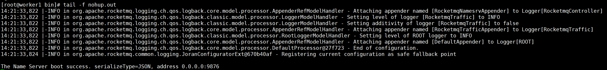

##### 4.2.3.2.worker2上启动broker-a节点与broker-b-s节点
```powershell
[root@localhost bin]# nohup ./mqbroker -c ../conf/2m-2s-async/broker-a.properties & 
#出现以下日志即启动成功，观察注册的nameServer服务
#The broker[broker-a, 192.168.43.135:10911] boot success. serializeType=JSON and name server is worker1:9876;worker2:9876;worker3:9876

[root@localhost bin]# nohup ./mqbroker -c ../conf/2m-2s-async/broker-b-s.properties & 
[root@localhost bin]# tail -f nohup.out 
#出现以下日志即启动成功，观察注册的nameServer服务
#The broker[broker-b, 192.168.43.135:11011] boot success. serializeType=JSON and name server is worker1:9876;worker2:9876;worker3:9876
#也可以使用tail -f ~/logs/rocketmqlogs/broker.log 观察日志
```

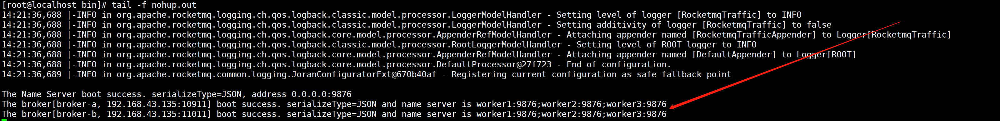

##### 4.2.3.3.worker3上启动broker-b节点与broker-a-s节点
```powershell
[root@localhost bin]# nohup ./mqbroker -c ../conf/2m-2s-async/broker-b.properties & 
#出现以下日志即启动成功，观察注册的nameServer服务
#The broker[broker-b, 192.168.43.136:10911] boot success. serializeType=JSON and name server is worker1:9876;worker2:9876;worker3:9876

[root@localhost bin]# nohup ./mqbroker -c ../conf/2m-2s-async/broker-a-s.properties &
#出现以下日志即启动成功，观察注册的nameServer服务
#The broker[broker-b, 192.168.43.136:10911] boot success. serializeType=JSON and name server is worker1:9876;worker2:9876;worker3:9876
```

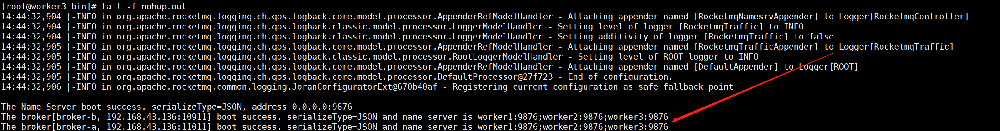

##### 4.2.3.4.使用测试工具测试消息收发
```powershell
# worker2发送消息
[root@localhost bin]# ./tools.sh org.apache.rocketmq.example.quickstart.Producer
```

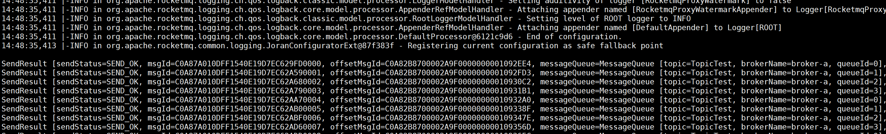

```powershell
# worker3接受消息
[root@localhost bin]# ./tools.sh org.apache.rocketmq.example.quickstart.Consumer
```

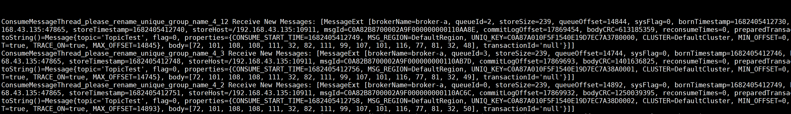

RocketMQ5.X版本兼容之前旧版本部署完成。在部署新版之前先通过maven安装一个rocketmq-dashboard可视化界面查看我们的集群。

#### 4.2.4.安装rocketmq-dashboard
##### 4.2.4.1.在1号机通过maven安装dashboard，所以要先安装maven服务
```powershell
1.回到app目录，创建一个maven目录，将maven压缩包上载到该目录。
#maven包可以自行在官网下载，也可以使用课件资料中的maven包，官网下载地址：http://maven.apache.org/download.cgi
[root@localhost bin]# cd /app/
[root@localhost app]# mkdir maven
[root@localhost app]# cd maven/
#上载完成后解压
[root@localhost maven]# tar zxvf apache-maven-3.9.1-bin.tar.gz
#创建jar包仓库目录，然后修改maven配置
[root@localhost maven]# mkdir repository
```

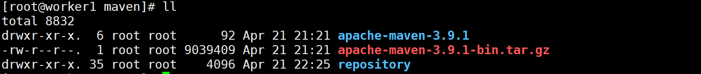

##### 4.2.4.2.配置maven环境变量
```powershell
#配置MAVEN_HOME，并在path目录最前加上$MAVEN_HOME/bin:
[root@localhost maven]# vi /etc/profile
export MAVEN_HOME=/app/maven/apache-maven-3.9.1
$MAVEN_HOME/bin:
```

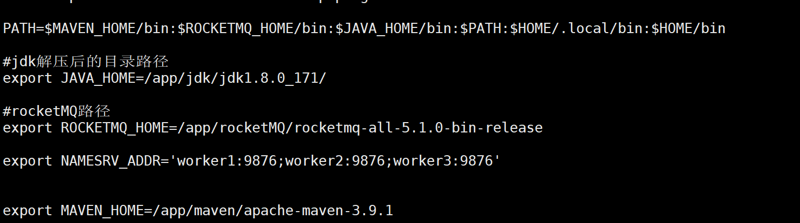

##### 4.2.4.3.更新环境配置，查看maven是否成功
```powershell
[root@localhost maven]# source /etc/profile
[root@localhost maven]# mvn -v
#显示如下信息即安装成功
```

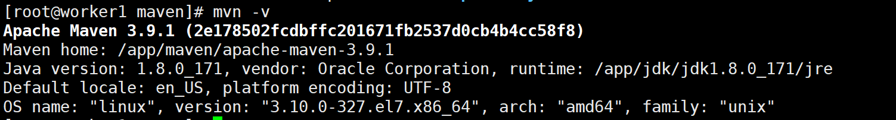

##### 4.2.4.4.修改maven仓库配置
```powershell
#进入maven配置目录
[root@localhost maven]# cd apache-maven-3.9.1/conf/
#修改配置文件
[root@localhost conf]# vi settings.xml
#找到<localRepository>节点，添加本地仓库目录，注意不要添加在注释的代码中，单独拷贝节点，然后修改路径。
<localRepository>/app/maven/repository</localRepository>

#找到<mirror>节点，将节点内容更换成以下配置:
<mirror>
  <id>alimaven</id>
  <name>aliyun maven</name>
  <url>https://maven.aliyun.com/repository/public/</url>
  <mirrorOf>*</mirrorOf>
</mirror>
```

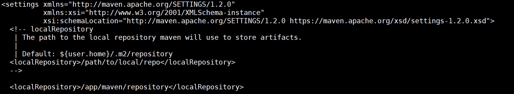


##### 4.2.4.5.安装dashboard
```powershell
#返回app目录创建dashboard目录，将下好的压缩包上载到该目录，同样可以使用资料中的压缩包或者自行下载。
[root@localhost dashboard]# cd /app/
[root@localhost app]# mkdir dashboard
[root@localhost app]# cd dashboard/
#上载后解压
[root@localhost dashboard]# unzip rocketmq-dashboard-rocketmq-dashboard-1.0.0.zip
```

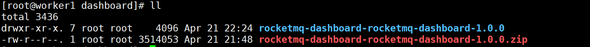

##### 4.2.4.6.编译dashboard
```powershell
#进入源码目录使用mvn打包，也可以使用资料包中已经编译好的jar包。
#因为rocketMQ5.1版本对应dashboard的一些类还没有升级，最后编译时会异常，所以还是使用4.9版本打包dashboard，使用中未发现明显bug。
[root@localhost rocketmq-dashboard-rocketmq-dashboard-1.0.0]# cd rocketmq-dashboard-rocketmq-dashboard-1.0.0/
[root@localhost rocketmq-dashboard-rocketmq-dashboard-1.0.0]# mvn clean package -Dmaven.test.skip=true

#打包失败可以使用以下命令，清除编译结果，重新打包。（编译成功无需使用）
[root@localhost rocketmq-dashboard-rocketmq-dashboard-1.0.0]# mvn clean install -U -Dmaven.test.skip=true
```

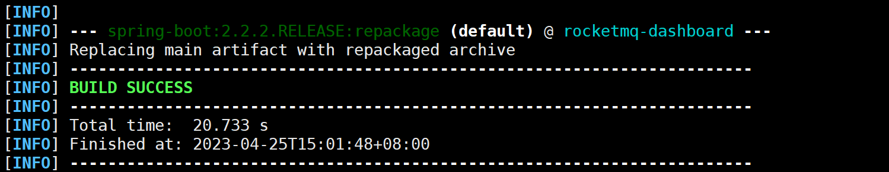

##### 4.2.4.7.启动dashboard
**<font style="color:#DF2A3F;">如果编译失败，使用提供的 jar 启动报错，请在下载源码本机启动项目，只需改动 yml 中的 namesrvAddrs 配置</font>**

```powershell
#编译成功后，进入target目录，静默启动dashboard
[root@localhost rocketmq-dashboard-rocketmq-dashboard-1.0.0]# cd target/
[root@localhost target]# nohup java -jar rocketmq-dashboard-1.0.0.jar &
#查看日志
[root@worker1 target]# tail -f nohup.out
```

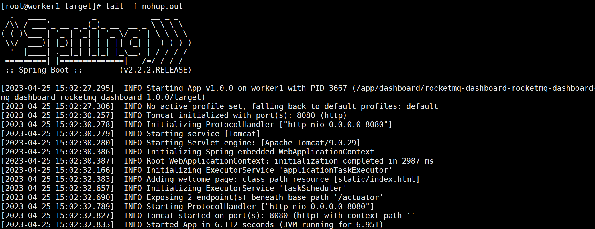

##### 4.2.4.8.启动成功后访问：[http://192.168.43.134:8080/#/](http://192.168.43.134:8080/#/)  操作dashboard界面:
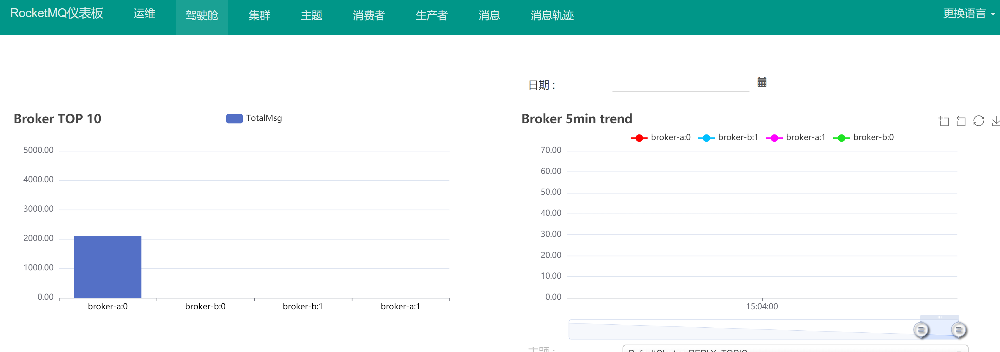

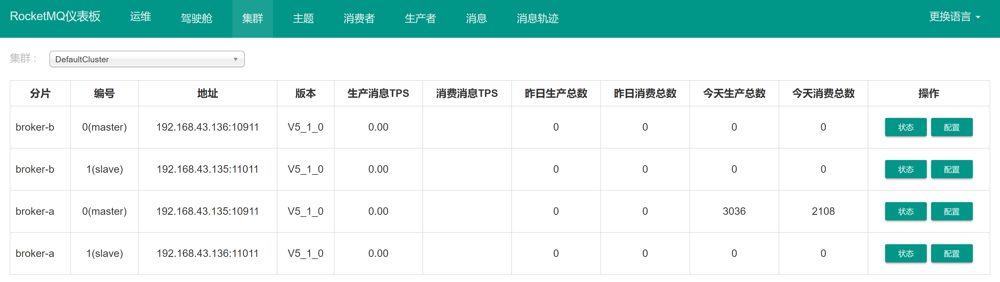

#### 4.2.5.部署5.x版本-<font style="color:rgb(28, 30, 33);background-color:rgb(250, 250, 250);">Local模式</font>
<font style="color:rgb(28, 30, 33);background-color:rgb(250, 250, 250);">Apache RocketMQ 5.0 版本完成基本消息收发，包括 NameServer、Broker、Proxy 组件。 在 5.0 版本中 Proxy 和 Broker 根据实际诉求可以分为 Local 模式和 Cluster 模式，一般情况下如果没有特殊需求，或者遵循从早期版本平滑升级的思路，可以选用Local模式。</font>

+ <font style="color:rgb(28, 30, 33);background-color:rgb(250, 250, 250);">在 Local 模式下，Broker 和 Proxy 是同进程部署，只是在原有 Broker 的配置基础上新增 Proxy 的简易配置就可以运行。</font>
+ <font style="color:rgb(28, 30, 33);background-color:rgb(250, 250, 250);">在 Cluster 模式下，Broker 和 Proxy 分别部署，即在原有的集群基础上，额外再部署 Proxy 即可。</font>

##### <font style="color:rgb(28, 30, 33);background-color:rgb(250, 250, 250);">4.2.5.1.</font>关闭worker2,worker3的broker服务
```powershell
[root@localhost bin]# sh ./mqshutdown broker
```

##### 4.2.5.2.使用Local方式部署，每个机器只能部署一个broker，否则会出现端口占用的异常，这里启用worker2的broker-a与worker3的broker-b节点。
```powershell
# worker2机器
[root@localhost bin]# nohup ./mqbroker -c ../conf/2m-2s-async/broker-a.properties --enable-proxy &
# worker3机器
[root@localhost bin]# nohup ./mqbroker -c ../conf/2m-2s-async/broker-b.properties --enable-proxy &

#使用tail -f ~/logs/rocketmqlogs/proxy.log查看日志
[root@localhost bin]# tail -f ~/logs/rocketmqlogs/proxy.log
# 出现以下异常即成功启动
# 2023-04-23 15:09:33 INFO main - The broker[broker-a, 192.168.43.135:10911] boot success. serializeType=JSON and name server is worker1:9876;worker2:9876;worker3:9876
# 2023-04-23 15:09:34 INFO main - grpc server start successfully.
```

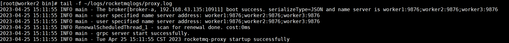

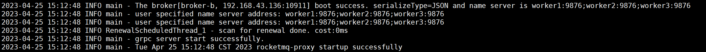

##### 4.2.5.3.测试消息收发
```powershell
[root@localhost bin]# ./tools.sh org.apache.rocketmq.example.quickstart.Producer
[root@localhost bin]# ./tools.sh org.apache.rocketmq.example.quickstart.Consumer
```

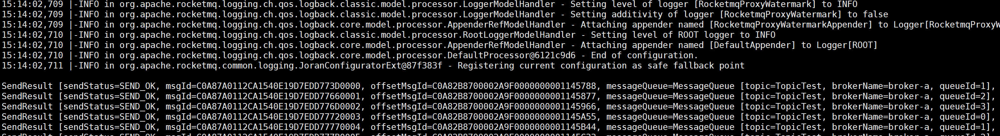

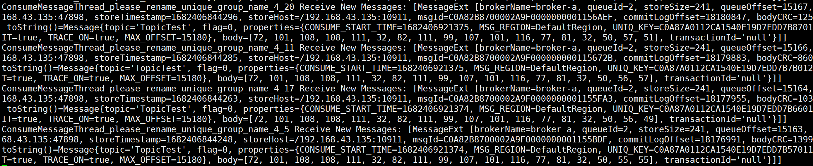

##### 4.2.5.4.登录dashboard页面查看注册成功
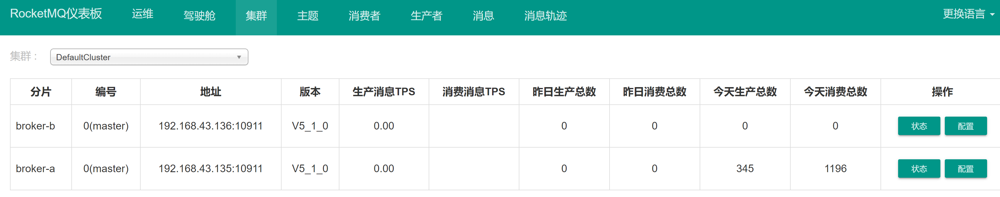

##### 4.2.5.5.其他部署模式
官网还提供了其他部署模式，有兴趣的小伙伴可以自行研究，官网部署方式：[https://rocketmq.apache.org/zh/docs/deploymentOperations/01deploy](https://rocketmq.apache.org/zh/docs/deploymentOperations/01deploy)。

**集群部署搭建的过程我们到此结束，接下来我们使用官方提供的exmaple代码进行实战。**

## 5.官方API实战
实战之前，我们需要先搭建一个基于Maven的springboot项目，只需要加入以下依赖：

```powershell
<dependency>
  <groupId>org.apache.rocketmq</groupId>
  <artifactId>rocketmq-client</artifactId>
  <version>5.1.0</version>
</dependency>
```

接下来使用IDEA搭建一个Maven项目:

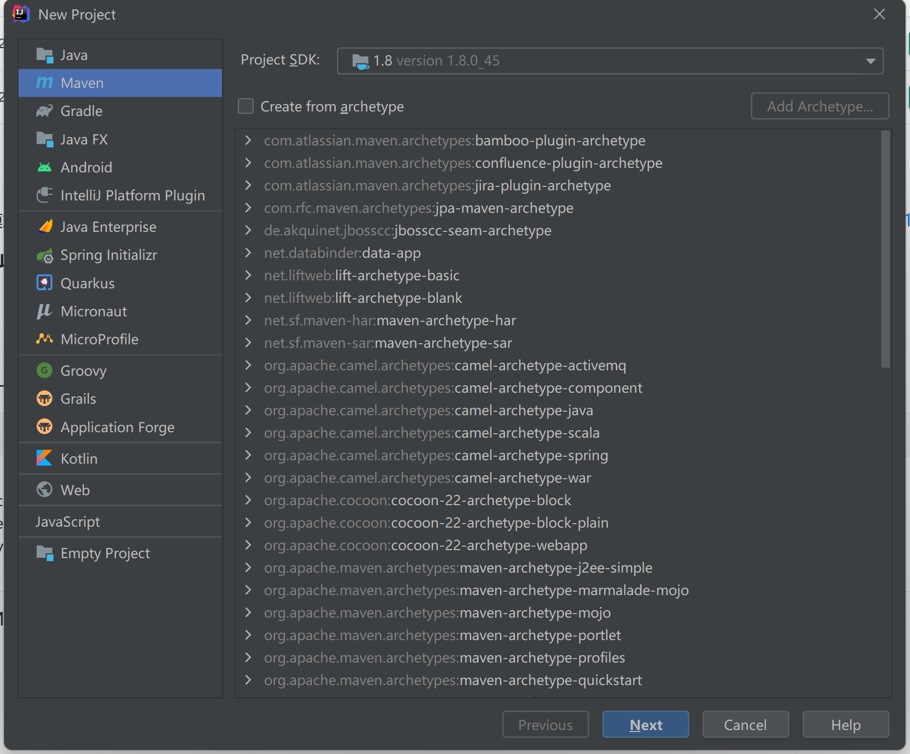

工程创建后，我们添加Pom依赖：

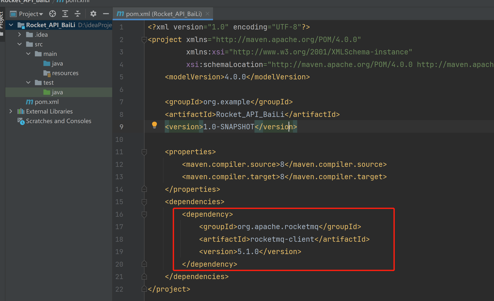

这样工程就搭建完成了，接下来我们进入API实战。

### 5.1.基本样例
消息生产者分别通过三种方式发送消息：

+ 同步发送：等待消息返回后再继续进行下面的操作。
+ 异步发送：不等待消息返回直接进入后续流程。broker将结果返回后调用callback函数，并使用CountDownLatch计数。
+ 单向发送：只负责发送，不管消息是否发送成功。

```java
package Simple;

import org.apache.rocketmq.client.exception.MQBrokerException;
import org.apache.rocketmq.client.exception.MQClientException;
import org.apache.rocketmq.client.producer.DefaultMQProducer;
import org.apache.rocketmq.client.producer.SendResult;
import org.apache.rocketmq.common.message.Message;
import org.apache.rocketmq.remoting.exception.RemotingException;

import java.nio.charset.StandardCharsets;

/**
* 同步发送
* Created by BaiLi
*/
public class SyncProducer {
    public static void main(String[] args) throws MQClientException, MQBrokerException, RemotingException, InterruptedException {
        DefaultMQProducer producer = new DefaultMQProducer("SyncProducer");
        producer.setNamesrvAddr("192.168.43.137:9876");
        producer.start();
        for (int i = 0; i < 2; i++) {
            Message msg = new Message("Simple", //主题
                                      "TagA",  //设置消息Tag，用于消费端根据指定Tag过滤消息。
                                      "Simple-Sync".getBytes(StandardCharsets.UTF_8) //消息体。
                                     );
            SendResult send = producer.send(msg);
            System.out.printf(i + ".发送消息成功：%s%n", send);
        }
        producer.shutdown();
    }
}

```

```java
package Simple;

import org.apache.rocketmq.client.exception.MQBrokerException;
import org.apache.rocketmq.client.exception.MQClientException;
import org.apache.rocketmq.client.producer.DefaultMQProducer;
import org.apache.rocketmq.client.producer.SendCallback;
import org.apache.rocketmq.client.producer.SendResult;
import org.apache.rocketmq.common.message.Message;
import org.apache.rocketmq.remoting.exception.RemotingException;

import java.nio.charset.StandardCharsets;
import java.util.concurrent.CountDownLatch;
import java.util.concurrent.TimeUnit;

/**
* 异步发送
* Created by BaiLi
*/
public class AsyncProducer {
    public static void main(String[] args) throws MQClientException, MQBrokerException, RemotingException, InterruptedException {
        DefaultMQProducer producer = new DefaultMQProducer("AsyncProducer");
        producer.setNamesrvAddr("192.168.43.137:9876");
        producer.start();
        CountDownLatch countDownLatch = new CountDownLatch(100);//计数
        for (int i = 0; i < 100; i++) {
            Message message = new Message("Simple", "TagA", "Simple-Async".getBytes(StandardCharsets.UTF_8));
            final int index = i;
            producer.send(message, new SendCallback() {
                @Override
                public void onSuccess(SendResult sendResult) {
                    countDownLatch.countDown();
                    System.out.printf("%d 消息发送成功%s%n", index, sendResult);
                }

                @Override
                public void onException(Throwable throwable) {
                    countDownLatch.countDown();
                    System.out.printf("%d 消息失败%s%n", index, throwable);
                    throwable.printStackTrace();
                }
            }
                         );
        }
        countDownLatch.await(5, TimeUnit.SECONDS);
        producer.shutdown();
    }
}

```

```java
package Simple;

import org.apache.rocketmq.client.exception.MQClientException;
import org.apache.rocketmq.client.producer.DefaultMQProducer;
import org.apache.rocketmq.common.message.Message;
import org.apache.rocketmq.remoting.exception.RemotingException;

import java.nio.charset.StandardCharsets;

/**
* 单向发送
* Created by BaiLi
*/
public class OnewayProducer {
    public static void main(String[] args) throws MQClientException, RemotingException, InterruptedException {
        DefaultMQProducer producer = new DefaultMQProducer("AsyncProducer");
        producer.setNamesrvAddr("192.168.43.137:9876");
        producer.start();
        for (int i = 0; i < 10; i++) {
            Message message = new Message("Simple","TagA", "Simple-Oneway".getBytes(StandardCharsets.UTF_8));
            producer.sendOneway(message);
            System.out.printf("%d 消息发送完成 %n" , i);
        }
        Thread.sleep(5000);
        producer.shutdown();
    }
}

```

消费者消费消息分两种：

+ 拉模式：消费者主动去Broker上拉取消息。
+ 推模式：消费者等待Broker把消息推送过来。

```java
package Simple;

import org.apache.rocketmq.client.consumer.DefaultMQPullConsumer;
import org.apache.rocketmq.client.consumer.PullResult;
import org.apache.rocketmq.client.consumer.store.ReadOffsetType;
import org.apache.rocketmq.client.exception.MQBrokerException;
import org.apache.rocketmq.client.exception.MQClientException;
import org.apache.rocketmq.common.message.MessageQueue;
import org.apache.rocketmq.remoting.exception.RemotingException;

import java.util.HashSet;
import java.util.Set;

/**
* 拉模式
* Created by BaiLi
*/
public class PullConsumer {
    public static void main(String[] args) throws MQClientException {
        DefaultMQPullConsumer pullConsumer = new DefaultMQPullConsumer("SimplePullConsumer");
        pullConsumer.setNamesrvAddr("192.168.43.137:9876");//执行nameserver地址
        Set<String> topics = new HashSet<>();
        topics.add("Simple");//添加Topic
        topics.add("TopicTest");
        pullConsumer.setRegisterTopics(topics);
        pullConsumer.start();
        while (true) { //循环拉取消息
            pullConsumer.getRegisterTopics().forEach(n -> {
                try {
                    Set<MessageQueue> messageQueues = pullConsumer.fetchSubscribeMessageQueues(n);//获取主题中的Queue
                    messageQueues.forEach(l -> {
                        try {
                            //获取Queue中的偏移量
                            long offset = pullConsumer.getOffsetStore().readOffset(l, ReadOffsetType.READ_FROM_MEMORY);
                            if (offset < 0) {
                                offset = pullConsumer.getOffsetStore().readOffset(l, ReadOffsetType.READ_FROM_STORE);
                            }
                            if (offset < 0) {
                                offset = pullConsumer.maxOffset(l);
                            }
                            if (offset < 0) {
                                offset = 0;
                            }
                            //拉取Queue中的消息。每次获取32条
                            PullResult pullResult = pullConsumer.pull(l, "*", offset, 32);
                            System.out.printf("循环拉取消息ing %s%n",pullResult);
                            switch (pullResult.getPullStatus()) {
                                case FOUND:
                                    pullResult.getMsgFoundList().forEach(p -> {
                                        System.out.printf("拉取消息成功%s%n", p);
                                    });
                                    //更新偏移量
                                    pullConsumer.updateConsumeOffset(l, pullResult.getNextBeginOffset());
                            }
                        } catch (MQClientException e) {
                            e.printStackTrace();
                        } catch (RemotingException e) {
                            e.printStackTrace();
                        } catch (MQBrokerException e) {
                            e.printStackTrace();
                        } catch (InterruptedException e) {
                            e.printStackTrace();
                        }
                        });
                        } catch (MQClientException e) {
                            e.printStackTrace();
                        }
                        });
                        }
                        }
                        }

```

```java
package Simple;

import org.apache.rocketmq.client.consumer.DefaultMQPushConsumer;
import org.apache.rocketmq.client.consumer.listener.ConsumeConcurrentlyContext;
import org.apache.rocketmq.client.consumer.listener.ConsumeConcurrentlyStatus;
import org.apache.rocketmq.client.consumer.listener.MessageListenerConcurrently;
import org.apache.rocketmq.client.exception.MQClientException;
import org.apache.rocketmq.common.message.MessageExt;

import java.util.List;

/**
* 推模式
* Created by BaiLi
*/
public class Consumer {
    public static void main(String[] args) throws MQClientException {
        DefaultMQPushConsumer pushConsumer = new DefaultMQPushConsumer("SimplePushConsumer");
        pushConsumer.setNamesrvAddr("192.168.43.137:9876");
        pushConsumer.subscribe("Simple","*");
        pushConsumer.setMessageListener(new MessageListenerConcurrently() {
            @Override
            public ConsumeConcurrentlyStatus consumeMessage(List<MessageExt> list, ConsumeConcurrentlyContext consumeConcurrentlyContext) {
                list.forEach( n->{
                    System.out.printf("收到消息: %s%n" , n);
                });
                return ConsumeConcurrentlyStatus.CONSUME_SUCCESS;
            }
        });
        pushConsumer.start();
        System.out.printf("Consumer Started.%n");
    }
}

```

通常情况下，用推模式比较简单。需要注意DefaultMQPullConsumerImpl这个消费者类已标记为过期，但是还是可以使用的。替换的类是DefaultLitePullConsumerImpl。

+ LitePullConsumerSubscribe：随机获取一个queue消息
+ LitePullConsumerAssign：指定一个queue消息

```java
package Simple;

import org.apache.rocketmq.client.consumer.DefaultLitePullConsumer;
import org.apache.rocketmq.client.exception.MQClientException;
import org.apache.rocketmq.common.message.MessageExt;

import java.util.List;

/**
* Created by BaiLi
*/
public class PullLiteConsumer {
    public static void main(String[] args) throws MQClientException {
        DefaultLitePullConsumer litePullConsumer = new DefaultLitePullConsumer("SimpleLitePullConsumer");
        litePullConsumer.setNamesrvAddr("192.168.43.137:9876");
        litePullConsumer.subscribe("Simple");
        litePullConsumer.start();
        while (true) {
            List<MessageExt> poll = litePullConsumer.poll();
            System.out.printf("消息拉取成功 %s%n" , poll);
        }
    }
}
```

```java
package Simple;

import org.apache.rocketmq.client.consumer.DefaultLitePullConsumer;
import org.apache.rocketmq.common.message.MessageExt;
import org.apache.rocketmq.common.message.MessageQueue;

import java.util.ArrayList;
import java.util.Collection;
import java.util.List;

/**
* 指定获取messageQueue消息
* Created by BaiLi
*/
public class PullLiteConsumerAssign {
    public static void main(String[] args) throws Exception {
        DefaultLitePullConsumer litePullConsumer = new DefaultLitePullConsumer("SimpleLitePullConsumer");
        litePullConsumer.setNamesrvAddr("192.168.43.137:9876");
        litePullConsumer.start();
        Collection<MessageQueue> messageQueues = litePullConsumer.fetchMessageQueues("TopicTest");
        List<MessageQueue> list = new ArrayList<>(messageQueues);
        litePullConsumer.assign(list);
        litePullConsumer.seek(list.get(0), 10);
        try {
            while (true) {
                List<MessageExt> messageExts = litePullConsumer.poll();
                System.out.printf("%s %n", messageExts);
            }
        } finally {
            litePullConsumer.shutdown();
        }
    }
}

```

```plain
生产者：
	同步发送：org.apache.rocketmq.example.simple.Producer
  异步发送：org.apache.rocketmq.example.simple.AsyncProducer
  单向发送：org.apache.rocketmq.example.simple.OnewayProducer
消费者：
  拉模式：org.apache.rocketmq.example.simple.PullConsumer
  推模式：org.apache.rocketmq.example.simple.PushConsumer
  拉模式（随机获取一个queue）：org.apache.rocketmq.example.simple.LitePullConsumerSubscribe.java
  拉模式（指定获取一个queue）：org.apache.rocketmq.example.simple.LitePullConsumerAssign.java
```

### 5.2.顺序消息
顺序消息指生产者局部有序发送到一个queue，但多个queue之间是全局无序的。

+ 顺序消息生产者样例：通过MessageQueueSelector将消息有序发送到同一个queue中。
+ 顺序消息消费者样例：通过MessageListenerOrderly消费者每次读取消息都只从一个queue中获取（通过加锁的方式实现）。

```java
package Order;

import org.apache.rocketmq.client.exception.MQBrokerException;
import org.apache.rocketmq.client.exception.MQClientException;
import org.apache.rocketmq.client.producer.DefaultMQProducer;
import org.apache.rocketmq.client.producer.MessageQueueSelector;
import org.apache.rocketmq.client.producer.SendResult;
import org.apache.rocketmq.common.message.Message;
import org.apache.rocketmq.common.message.MessageQueue;
import org.apache.rocketmq.remoting.exception.RemotingException;

import java.nio.charset.StandardCharsets;
import java.util.List;

/**
* 顺序消息生产者
* Created by BaiLi
*/
public class OrderProducer {
    public static void main(String[] args) throws MQClientException, MQBrokerException, RemotingException, InterruptedException {
        DefaultMQProducer producer = new DefaultMQProducer("OrderProducer");
        producer.setNamesrvAddr("192.168.43.137:9876");
        producer.start();
        for (int j = 0; j < 5; j++) {
            for (int i = 0; i < 10; i++) {
                Message message = new Message("OrderTopic","TagA",
                                              ("order_" + j + "_step_" + i).getBytes(StandardCharsets.UTF_8));
                SendResult sendResult = producer.send(message, new MessageQueueSelector() {
                    @Override
                    public MessageQueue select(List<MessageQueue> list, Message message, Object o) {
                        Integer id = (Integer) o;
                        int index = id % list.size();
                        return list.get(index);
                    }
                }, j);
                System.out.printf("%s%n", sendResult);
            }
        }
        producer.shutdown();
    }
}

```

```java
package Order;

import org.apache.rocketmq.client.consumer.DefaultMQPushConsumer;
import org.apache.rocketmq.client.consumer.listener.ConsumeOrderlyContext;
import org.apache.rocketmq.client.consumer.listener.ConsumeOrderlyStatus;
import org.apache.rocketmq.client.consumer.listener.MessageListenerOrderly;
import org.apache.rocketmq.client.exception.MQClientException;
import org.apache.rocketmq.common.message.MessageExt;

import java.util.List;

/**
 * 顺序消息消费者
 * Created by BaiLi
 */
public class OrderConsumer {
    public static void main(String[] args) throws MQClientException {
        DefaultMQPushConsumer consumer = new DefaultMQPushConsumer("OrderConsumer");
        consumer.setNamesrvAddr("192.168.43.137:9876");
        consumer.subscribe("OrderTopic","*");
        consumer.registerMessageListener(new MessageListenerOrderly() {
            @Override
            public ConsumeOrderlyStatus consumeMessage(List<MessageExt> list, ConsumeOrderlyContext consumeOrderlyContext) {
                list.forEach(n->{
                    System.out.println("QueueId:"+n.getQueueId() + "收到消息内容 "+new String(n.getBody()));
                });
                return ConsumeOrderlyStatus.SUCCESS;
            }
        });
        consumer.start();
        System.out.printf("Consumer Started.%n");
    }
}

```

```plain
生产者：
	org.apache.rocketmq.example.order.Producer 
消费者：
	org.apache.rocketmq.example.order.Consumer
```

### 5.3.广播消息
广播消息并没有特定的消息消费者样例，这是因为这涉及到消费者的集群消费模式。

+ MessageModel.BROADCASTING：广播消息。一条消息会发给所有订阅了对应主题的消费者，不管消费者是不是同一个消费者组。
+ MessageModel.CLUSTERING：集群消息。每一条消息只会被同一个消费者组中的一个实例消费。

```java
package broadcast;

import org.apache.rocketmq.client.consumer.DefaultMQPushConsumer;
import org.apache.rocketmq.client.consumer.listener.ConsumeConcurrentlyContext;
import org.apache.rocketmq.client.consumer.listener.ConsumeConcurrentlyStatus;
import org.apache.rocketmq.client.consumer.listener.MessageListenerConcurrently;
import org.apache.rocketmq.client.exception.MQClientException;
import org.apache.rocketmq.common.message.MessageExt;
import org.apache.rocketmq.remoting.protocol.heartbeat.MessageModel;

import java.util.List;

/**
 * 广播消息消费模式
 * Created by BaiLi
 */
public class BroadcastConsumer {
    public static void main(String[] args) throws MQClientException {
        DefaultMQPushConsumer consumer = new DefaultMQPushConsumer("BroadCastConsumer");
        consumer.setNamesrvAddr("192.168.43.137:9876");
        consumer.subscribe("simple","*");
        consumer.setMessageModel(MessageModel.BROADCASTING); //广播模式
//        consumer.setMessageModel(MessageModel.CLUSTERING);//集群模式
        consumer.registerMessageListener(new MessageListenerConcurrently() {
            @Override
            public ConsumeConcurrentlyStatus consumeMessage(List<MessageExt> list, ConsumeConcurrentlyContext consumeConcurrentlyContext) {
                list.forEach(n->{
                    System.out.println("QueueId:"+n.getQueueId() + "收到消息内容 "+new String(n.getBody()));
                });
                return ConsumeConcurrentlyStatus.CONSUME_SUCCESS;
            }
        });
        consumer.start();
        System.out.printf("Broadcast Consumer Started.%n");
    }
}

```

```plain
消费者样例：
	org.apache.rocketmq.example.broadcast.PushConsumer
```

### 5.4.延迟消息
延迟消息实现的效果就是在调用producer.send方法后，消息并不会立即发送出去，而是会等一段时间再发送出去。这是RocketMQ特有的一个功能。

+ message.setDelayTimeLevel(3)：预定日常定时发送。1到18分别对应messageDelayLevel=1s 5s 10s 30s 1m 2m 3m 4m 5m 6m 7m 8m 9m 10m 20m 30m 1h 2h；可以在dashboard中broker配置查看。
+ msg.setDelayTimeMs(10L)：指定时间定时发送。默认支持最大延迟时间为3天，可以根据broker配置：timerMaxDelaySec修改。

```java
package schedule;

import org.apache.rocketmq.client.exception.MQBrokerException;
import org.apache.rocketmq.client.exception.MQClientException;
import org.apache.rocketmq.client.producer.DefaultMQProducer;
import org.apache.rocketmq.client.producer.SendResult;
import org.apache.rocketmq.common.message.Message;
import org.apache.rocketmq.remoting.exception.RemotingException;

import java.nio.charset.StandardCharsets;
import java.time.LocalTime;

/**
 * 预定日程定时发送
 * Created by BaiLi
 */
public class ScheduleProducer {
    public static void main(String[] args) throws MQClientException, MQBrokerException, RemotingException, InterruptedException {
        DefaultMQProducer producer = new DefaultMQProducer("ScheduleProducer");
        producer.setNamesrvAddr("192.168.43.137:9876");
        producer.start();
        for (int i = 0; i < 2; i++) {
            Message msg = new Message("Schedule", //主题
                    "TagA",  //设置消息Tag，用于消费端根据指定Tag过滤消息。
                    "ScheduleProducer".getBytes(StandardCharsets.UTF_8) //消息体。
            );
            //1到18分别对应messageDelayLevel=1s 5s 10s 30s 1m 2m 3m 4m 5m 6m 7m 8m 9m 10m 20m 30m 1h 2h
            msg.setDelayTimeLevel(3);
            producer.send(msg);
            System.out.printf(i + ".发送消息成功：%s%n", LocalTime.now());
        }
        producer.shutdown();
    }
}

```

```java
package schedule;

import org.apache.rocketmq.client.consumer.DefaultMQPushConsumer;
import org.apache.rocketmq.client.consumer.listener.ConsumeConcurrentlyContext;
import org.apache.rocketmq.client.consumer.listener.ConsumeConcurrentlyStatus;
import org.apache.rocketmq.client.consumer.listener.MessageListenerConcurrently;
import org.apache.rocketmq.client.exception.MQClientException;
import org.apache.rocketmq.common.message.MessageExt;

import java.time.LocalDateTime;
import java.time.LocalTime;
import java.util.List;

/**
 * 预定日程消费者
 * Created by BaiLi
 */
public class ScheduleConsumer {
    public static void main(String[] args) throws MQClientException {
        DefaultMQPushConsumer pushConsumer = new DefaultMQPushConsumer("SimplePushConsumer");
        pushConsumer.setNamesrvAddr("192.168.43.137:9876");
        pushConsumer.subscribe("Schedule","*");
        pushConsumer.setMessageListener(new MessageListenerConcurrently() {
            @Override
            public ConsumeConcurrentlyStatus consumeMessage(List<MessageExt> list, ConsumeConcurrentlyContext consumeConcurrentlyContext) {
                list.forEach( n->{
                    System.out.printf("接收时间：%s %n", LocalTime.now());
                });
                return ConsumeConcurrentlyStatus.CONSUME_SUCCESS;
            }
        });
        pushConsumer.start();
        System.out.printf("Simple Consumer Started.%n");
    }
}

```

```java
package schedule;

import org.apache.rocketmq.client.exception.MQBrokerException;
import org.apache.rocketmq.client.exception.MQClientException;
import org.apache.rocketmq.client.producer.DefaultMQProducer;
import org.apache.rocketmq.client.producer.SendResult;
import org.apache.rocketmq.common.message.Message;
import org.apache.rocketmq.remoting.exception.RemotingException;

import java.nio.charset.StandardCharsets;
import java.time.LocalTime;

/**
 * 指定时间发送
 * 默认支持最大延迟时间为3天，可以根据broker配置：timerMaxDelaySec 修改
 * Created by BaiLi
 */
public class TimeProducer {
    public static void main(String[] args) throws MQClientException, MQBrokerException, RemotingException, InterruptedException {
        DefaultMQProducer producer = new DefaultMQProducer("TimeProducer");
        producer.setNamesrvAddr("192.168.43.137:9876");
        producer.start();
        for (int i = 0; i < 2; i++) {
            Message msg = new Message("Schedule", //主题
                    "TagA",  //设置消息Tag，用于消费端根据指定Tag过滤消息。
                    "TimeProducer".getBytes(StandardCharsets.UTF_8) //消息体。
            );
            // 相对时间：延时消息。此消息将在 10 秒后传递给消费者。
            msg.setDelayTimeMs(10000L);
            // 绝对时间：定时消息。设置一个具体的时间，然后在这个时间之后多久在进行发送消息
//            msg.setDeliverTimeMs(System.currentTimeMillis() + 10000L);
            producer.send(msg);
            System.out.printf(i + ".发送消息成功：%s%n", LocalTime.now());
        }
        producer.shutdown();
    }
}

```

```java
package schedule;

import org.apache.rocketmq.client.consumer.DefaultMQPushConsumer;
import org.apache.rocketmq.client.consumer.listener.ConsumeConcurrentlyContext;
import org.apache.rocketmq.client.consumer.listener.ConsumeConcurrentlyStatus;
import org.apache.rocketmq.client.consumer.listener.MessageListenerConcurrently;
import org.apache.rocketmq.client.exception.MQClientException;
import org.apache.rocketmq.common.message.MessageExt;

import java.time.LocalTime;
import java.util.List;

/**
 * 定时发送消费者
 * Created by BaiLi
 */
public class TimeConsumer {
    public static void main(String[] args) throws MQClientException {
        DefaultMQPushConsumer pushConsumer = new DefaultMQPushConsumer("TimeConsumer");
        pushConsumer.setNamesrvAddr("192.168.43.137:9876");
        pushConsumer.subscribe("Schedule","*");
        pushConsumer.setMessageListener(new MessageListenerConcurrently() {
            @Override
            public ConsumeConcurrentlyStatus consumeMessage(List<MessageExt> list, ConsumeConcurrentlyContext consumeConcurrentlyContext) {
                list.forEach( n->{
                    System.out.printf("接收时间：%s %n", LocalTime.now());
                });
                return ConsumeConcurrentlyStatus.CONSUME_SUCCESS;
            }
        });
        pushConsumer.start();
        System.out.printf("Simple Consumer Started.%n");
    }
}

```

```plain
生产者：
	预定日期发送：org.apache.rocketmq.example.schedule.ScheduledMessageProducer.java
	指定时间发送：org.apache.rocketmq.example.schedule.TimerMessageProducer.java
消费者：
	预定日期消费：org.apache.rocketmq.example.schedule.ScheduledMessageConsumer.java
  指定时间消费：org.apache.rocketmq.example.schedule.TimerMessageConsumer.java
```

### 5.5.批量消息
批量消息是指将多条消息合并成一个批量消息，一次发送出去。这样的好处是可以减少网络IO，提升吞吐量。

批量消息的使用限制：

+ 消息大小不能超过4M，虽然源码注释不能超1M，但是实际使用不超过4M即可。平衡整体的性能，建议保持1M左右。
+ 相同的Topic，
+ 相同的waitStoreMsgOK
+ 不能是延迟消息、事务消息等

```java
package batch;

import org.apache.rocketmq.client.exception.MQBrokerException;
import org.apache.rocketmq.client.exception.MQClientException;
import org.apache.rocketmq.client.producer.DefaultMQProducer;
import org.apache.rocketmq.client.producer.SendResult;
import org.apache.rocketmq.common.message.Message;
import org.apache.rocketmq.remoting.exception.RemotingException;

import java.nio.charset.StandardCharsets;
import java.util.ArrayList;

/**
 * 批量发送消息
 * Created by BaiLi
 */
public class BatchProducer {
    public static void main(String[] args) throws MQClientException, MQBrokerException, RemotingException, InterruptedException {
        DefaultMQProducer producer = new DefaultMQProducer("BatchProducer");
        producer.setNamesrvAddr("192.168.43.137:9876");
        producer.start();
        ArrayList<Message> messages = new ArrayList<>();
        messages.add(new Message("simple","TagA", "BatchProducer0".getBytes(StandardCharsets.UTF_8)));
        messages.add(new Message("simple","TagA", "BatchProducer1".getBytes(StandardCharsets.UTF_8)));
        messages.add(new Message("simple","TagA", "BatchProducer2".getBytes(StandardCharsets.UTF_8)));
        SendResult send = producer.send(messages);
        System.out.printf(".发送消息成功：%s%n", send);
        producer.shutdown();
    }
}

```

```java
package batch;

import org.apache.rocketmq.client.exception.MQBrokerException;
import org.apache.rocketmq.client.exception.MQClientException;
import org.apache.rocketmq.client.producer.DefaultMQProducer;
import org.apache.rocketmq.client.producer.SendResult;
import org.apache.rocketmq.common.message.Message;
import org.apache.rocketmq.remoting.exception.RemotingException;

import java.nio.charset.StandardCharsets;
import java.util.ArrayList;
import java.util.Iterator;
import java.util.List;
import java.util.Map;

/**
 * 分批批量发送消息
 * 注意修改SIZE_LIMIT为 = 10 * 1000，不然发送消息时会提示消息体积过大
 * Created by BaiLi
 */
public class SplitBatchProducer {
    public static void main(String[] args) throws MQClientException, MQBrokerException, RemotingException, InterruptedException {
        DefaultMQProducer producer = new DefaultMQProducer("SplitBatchProducer");
        producer.setNamesrvAddr("192.168.43.137:9876");
        producer.start();
        ArrayList<Message> messages = new ArrayList<>();
        for (int i = 0; i < 10000; i++) {
            messages.add(new Message("simple","TagA", ("SplitBatchProducer"+i).getBytes(StandardCharsets.UTF_8)));
        }
        ListSplitter splitter = new ListSplitter(messages);
        while (splitter.hasNext()) {
            List<Message> listItem = splitter.next();
            SendResult sendResult = producer.send(listItem);
            System.out.printf(".发送消息成功：%s%n", sendResult);
        }
        producer.shutdown();
    }
}

class ListSplitter implements Iterator<List<Message>> {
    private static final int SIZE_LIMIT = 10 * 1000;  // 每个消息批次的最大大小
    private final List<Message> messages;	// 待发送的消息列表
    private int currIndex; // 当前拆分到的位置

    public ListSplitter(List<Message> messages) {
        this.messages = messages;
    }

    @Override
    public boolean hasNext() {
        return currIndex < messages.size();
    }

    @Override
    public List<Message> next() {
        int nextIndex = currIndex;
        int totalSize = 0;
        for (; nextIndex < messages.size(); nextIndex++) {
            Message message = messages.get(nextIndex);
            int tmpSize = message.getTopic().length() + message.getBody().length;
            Map<String, String> properties = message.getProperties();
            for (Map.Entry<String, String> entry : properties.entrySet()) {
                tmpSize += entry.getKey().length() + entry.getValue().length();
            }
            tmpSize = tmpSize + 20;
            // 如果超过了单个批次所允许的大小，就将此消息之前的消息作为下一个子列表返回
            if (tmpSize > SIZE_LIMIT) {
                // 如果是第一条消息就超出大小限制，就跳过这条消息再继续扫描
                if (nextIndex - currIndex == 0) {
                    nextIndex++;
                }
                break;
            }
            // 如果当前子列表大小已经超出所允许的单个批次大小，那么就暂停添加消息
            if (tmpSize + totalSize > SIZE_LIMIT) {
                break;
            } else {
                totalSize += tmpSize;
            }
        }
        // 返回从currIndex到nextIndex之间的所有消息
        List<Message> subList = messages.subList(currIndex, nextIndex);
        currIndex = nextIndex;
        return subList;
    }
}

```

```plain
生产者：
	org.apache.rocketmq.example.batch.SimpleBatchProducer
	org.apache.rocketmq.example.batch.SplitBatchProducer
```

### 5.6.过滤消息
在大多数情况下，可以使用Message的Tag属性来简单快速的过滤信息。

#### 5.6.1.使用Tag方式过滤（通过consumer.subscribe("TagFilterTest", "TagA || TagC")实现）：
```java
package filter;

import org.apache.rocketmq.client.exception.MQBrokerException;
import org.apache.rocketmq.client.exception.MQClientException;
import org.apache.rocketmq.client.producer.DefaultMQProducer;
import org.apache.rocketmq.client.producer.SendResult;
import org.apache.rocketmq.common.message.Message;
import org.apache.rocketmq.remoting.exception.RemotingException;

import java.nio.charset.StandardCharsets;

/**
 * 过滤消息-tag过滤生产者
 * Created by BaiLi
 */
public class TagFilterProducer {
    public static void main(String[] args) throws MQClientException, MQBrokerException, RemotingException, InterruptedException {
        DefaultMQProducer producer = new DefaultMQProducer("SyncProducer");
        producer.setNamesrvAddr("192.168.43.137:9876");
        producer.start();
        String[] tags = new String[] {"TagA","TagB","TagC"};
        for (int i = 0; i < 15; i++) {
            Message msg = new Message("FilterTopic", //主题
                    tags[i % tags.length],  //设置消息Tag，用于消费端根据指定Tag过滤消息。
                    ("TagFilterProducer_"+tags[i % tags.length]).getBytes(StandardCharsets.UTF_8) //消息体。
            );
            SendResult send = producer.send(msg);
            System.out.printf(i + ".发送消息成功：%s%n", send);
        }
        producer.shutdown();
    }
}

```

```java
package filter;

import org.apache.rocketmq.client.consumer.DefaultMQPushConsumer;
import org.apache.rocketmq.client.consumer.listener.ConsumeConcurrentlyContext;
import org.apache.rocketmq.client.consumer.listener.ConsumeConcurrentlyStatus;
import org.apache.rocketmq.client.consumer.listener.MessageListenerConcurrently;
import org.apache.rocketmq.client.exception.MQClientException;
import org.apache.rocketmq.common.message.MessageExt;

import java.util.List;

/**
 * 过滤消息-tag过滤消费者
 * Created by BaiLi
 */
public class TagFilterConsumer {
    public static void main(String[] args) throws MQClientException {
        DefaultMQPushConsumer pushConsumer = new DefaultMQPushConsumer("SimplePushConsumer");
        pushConsumer.setNamesrvAddr("192.168.43.137:9876");
        pushConsumer.subscribe("FilterTopic","TagA || TagC");
        pushConsumer.setMessageListener(new MessageListenerConcurrently() {
            @Override
            public ConsumeConcurrentlyStatus consumeMessage(List<MessageExt> list, ConsumeConcurrentlyContext consumeConcurrentlyContext) {
                list.forEach( n->{
                    System.out.printf("收到消息: %s%n" , new String(n.getBody()));
                });
                return ConsumeConcurrentlyStatus.CONSUME_SUCCESS;
            }
        });
        pushConsumer.start();
        System.out.printf("TagFilter Consumer Started.%n");
    }
}

```

```plain
生产者： 
	org.apache.rocketmq.example.filter.TagFilterProducer 
消费者： 
	org.apache.rocketmq.example.filter.TagFilterConsumer
```

Tag是RocketMQ中特有的一个消息属性。

RocketMQ的最佳实践中就建议使用RocketMQ时，一个应用可以就用一个Topic，而应用中的不同业务就用Tag来区分。

Tag方式有一个很大的限制，就是一个消息只能有一个Tag，这在一些比较复杂的场景就有点不足了。 这时候可以使用SQL表达式来对消息进行过滤。

#### 5.6.2.使用Sql方式过滤（通过MessageSelector.bySql(String sql)参数实现）：
这里面的sql语句是按照SQL92标准来执行的。sql中可以使用的参数有默认的TAGS和一个在生产者中加入的自定义属性。 

```java
package filter;

import org.apache.rocketmq.client.exception.MQBrokerException;
import org.apache.rocketmq.client.exception.MQClientException;
import org.apache.rocketmq.client.producer.DefaultMQProducer;
import org.apache.rocketmq.client.producer.SendResult;
import org.apache.rocketmq.common.message.Message;
import org.apache.rocketmq.remoting.exception.RemotingException;

import java.nio.charset.StandardCharsets;

/**
* 过滤消息-SQL过滤生产者
* Created by BaiLi
*/
public class SqlFilterProducer {
    public static void main(String[] args) throws MQClientException, MQBrokerException, RemotingException, InterruptedException {
        DefaultMQProducer producer = new DefaultMQProducer("SyncProducer");
        producer.setNamesrvAddr("192.168.43.137:9876");
        producer.start();
        String[] tags = new String[] {"TagA","TagB","TagC"};
        for (int i = 0; i < 15; i++) {
            Message msg = new Message("FilterTopic", //主题
                                      tags[i % tags.length],  //设置消息Tag，用于消费端根据指定Tag过滤消息。
                                      ("TagFilterProducer_"+tags[i % tags.length] +  "_i_" + i).getBytes(StandardCharsets.UTF_8) //消息体。
                                     );
            msg.putUserProperty("baiLi", String.valueOf(i));
            SendResult send = producer.send(msg);
            System.out.printf(i + ".发送消息成功：%s%n", send);
        }
        producer.shutdown();
    }
}

```

```java
package filter;

import org.apache.rocketmq.client.consumer.DefaultMQPushConsumer;
import org.apache.rocketmq.client.consumer.MessageSelector;
import org.apache.rocketmq.client.consumer.listener.ConsumeConcurrentlyContext;
import org.apache.rocketmq.client.consumer.listener.ConsumeConcurrentlyStatus;
import org.apache.rocketmq.client.consumer.listener.MessageListenerConcurrently;
import org.apache.rocketmq.client.exception.MQClientException;
import org.apache.rocketmq.common.message.MessageExt;

import java.util.List;

/**
 * 过滤消息-SQL过滤消费者
 * Created by BaiLi
 */
public class SqlFilterConsumer {
    public static void main(String[] args) throws MQClientException {
        DefaultMQPushConsumer pushConsumer = new DefaultMQPushConsumer("SimplePushConsumer");
        pushConsumer.setNamesrvAddr("192.168.43.137:9876");
        pushConsumer.subscribe("FilterTopic", MessageSelector.bySql("(TAGS is not null And TAGS IN ('TagA','TagC'))"
        + "and (baiLi is not null and baiLi between 0 and 3)"));
        pushConsumer.setMessageListener(new MessageListenerConcurrently() {
            @Override
            public ConsumeConcurrentlyStatus consumeMessage(List<MessageExt> list, ConsumeConcurrentlyContext consumeConcurrentlyContext) {
                list.forEach( n->{
                    System.out.printf("收到消息: %s%n" , new String(n.getBody()));
                });
                return ConsumeConcurrentlyStatus.CONSUME_SUCCESS;
            }
        });
        pushConsumer.start();
        System.out.printf("SqlFilter Consumer Started.%n");
    }
}

```

```plain
生产者：
	org.apache.rocketmq.example.filter.SqlFilterProducer 
消费者：
	org.apache.rocketmq.example.filter.SqlFilterConsumer
```

SQL92语法： 

RocketMQ只定义了一些基本语法来支持这个特性。我们可以很容易地扩展它。

+ 数值比较，比如：>，>=，<，<=，BETWEEN，=； 
+ 字符比较，比如：=，<>，IN； 
+ IS NULL ，IS NOT NULL； 
+ 逻辑符号 AND，OR，NOT；

常量支持类型为： 

+ 数值，比如：123，3.1415； 
+ 字符，比如：'abc'，必须用单引号包裹起来；
+ NULL，特殊的常量 
+ 布尔值，TRUE 或 FALSE

使用注意：

+ 只有推模式的消费者可以使用SQL过滤。拉模式是用不了的；
+ 另外消息过滤是在Broker端进行的，提升网络传输性能，但是broker服务会比较繁忙。（consumer将过滤条件推送给broker端）

### 5.7.事务消息
这个事务消息是RocketMQ提供的一个非常有特色的功能，需要着重理解。

#### 5.7.1.什么是事务消息
事务消息是在分布式系统中保证最终一致性的两阶段提交的消息实现。他可以保证本地事务执行与消息发送两个操作的原子性，也就是这两个操作一起成功或者一起失败。

#### 5.7.2.事务消息的实现机制
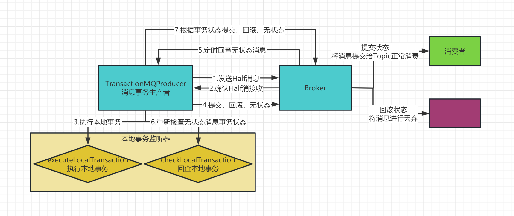

事务消息机制的关键是在发送消息时会将消息转为一个half半消息，并存入RocketMQ内部的一个Topic(RMQ_SYS_TRANS_HALF_TOPIC)，这个Topic对消费者是不可见的。再经过一系列事务检查通过后，再将消息转存到目标Topic，这样对消费者就可见了。

#### 5.7.3.事务消息的编程模型
事务消息只保证消息发送者的本地事务与发消息这两个操作的原子性，因此，事务消息的示例只涉及到消息发送者，对于消息消费者来说，并没有什么特别的。

事务消息的关键是在TransactionMQProducer中指定了一个TransactionListener事务监听器，这个事务监听器就是事务消息的关键控制器。

```java
package transaction;

import org.apache.rocketmq.client.exception.MQClientException;
import org.apache.rocketmq.client.producer.TransactionListener;
import org.apache.rocketmq.client.producer.TransactionMQProducer;
import org.apache.rocketmq.client.producer.TransactionSendResult;
import org.apache.rocketmq.common.message.Message;

import java.nio.charset.StandardCharsets;
import java.util.concurrent.*;

/**
 * 事务消息生产者
 * Created by BaiLi
 */
public class TransactionProducer {
    public static void main(String[] args) throws MQClientException, InterruptedException {
        TransactionMQProducer producer = new TransactionMQProducer("TransProducer");
        producer.setNamesrvAddr("192.168.43.137:9876");
        //使用executorService异步提交事务状态，从而提高系统的性能和可靠性
        ExecutorService executorService = new ThreadPoolExecutor(2, 5, 100, TimeUnit.SECONDS, new ArrayBlockingQueue<Runnable>(2000), new ThreadFactory() {
            @Override
            public Thread newThread(Runnable r) {
                Thread thread = new Thread(r);
                thread.setName("client-transaction-msg-check-thread");
                return thread;
            }
        });
        producer.setExecutorService(executorService);

        //本地事务监听器
        TransactionListener transactionListener = new TransactionListenerImpl();
        producer.setTransactionListener(transactionListener);

        producer.start();
        String[] tags = new String[] {"TagA","TagB","TagC","TagD","TagE"};
        for (int i = 0; i < 10; i++) {
            Message message = new Message("TransactionTopic",
                    tags[ i % tags.length],
                    ("Transaction_"+ tags[ i % tags.length]).getBytes(StandardCharsets.UTF_8));
            TransactionSendResult transactionSendResult = producer.sendMessageInTransaction(message, null);
            System.out.printf("%s%n", transactionSendResult);

            Thread.sleep(10); //延迟10毫秒
        }

        Thread.sleep(100000);//等待broker端回调
        producer.shutdown();
    }
}

```

```java
package transaction;

import org.apache.commons.lang3.StringUtils;
import org.apache.rocketmq.client.producer.LocalTransactionState;
import org.apache.rocketmq.client.producer.TransactionListener;
import org.apache.rocketmq.common.message.Message;
import org.apache.rocketmq.common.message.MessageExt;

/**
 * 本地事务监听器
 * Created by BaiLi
 */
public class TransactionListenerImpl implements TransactionListener {

    @Override
    /**
     * 在提交完事务消息后执行。
     * 返回COMMIT_MESSAGE状态的消息会立即被消费者消费到。
     * 返回ROLLBACK_MESSAGE状态的消息会被丢弃。
     * 返回UNKNOWN状态的消息会由Broker过一段时间再来回查事务的状态。
     */
    public LocalTransactionState executeLocalTransaction(Message message, Object o) {
        String tags = message.getTags();
        //TagA的消息会立即被消费者消费到
        if(StringUtils.contains(tags,"TagA")){
            return LocalTransactionState.COMMIT_MESSAGE;
            //TagB的消息会被丢弃
        }else if(StringUtils.contains(tags,"TagB")){
            return LocalTransactionState.ROLLBACK_MESSAGE;
            //其他消息会等待Broker进行事务状态回查。
        }else{
            return LocalTransactionState.UNKNOW;
        }
    }

    @Override
    /**
     * 在对UNKNOWN状态的消息进行状态回查时执行。
     * 返回COMMIT_MESSAGE状态的消息会立即被消费者消费到。
     * 返回ROLLBACK_MESSAGE状态的消息会被丢弃。
     * 返回UNKNOWN状态的消息会由Broker过一段时间再来回查事务的状态。
     */
    public LocalTransactionState checkLocalTransaction(MessageExt messageExt) {
        String tags = messageExt.getTags();
        //TagC的消息过一段时间会被消费者消费到
        if(StringUtils.contains(tags,"TagC")){
            return LocalTransactionState.COMMIT_MESSAGE;
            //TagD的消息也会在状态回查时被丢弃掉
        }else if(StringUtils.contains(tags,"TagD")){
            return LocalTransactionState.ROLLBACK_MESSAGE;
            //剩下TagE的消息会在多次状态回查后最终丢弃
        }else{
            return LocalTransactionState.UNKNOW;
        }
    }
}

```

```plain
生产者：
	org.apache.rocketmq.example.transaction.TransactionProducer
```

#### 5.7.4.事务消息的使用限制
+ 事务消息不支持延迟消息和批量消息。 
+ 为了避免单个消息被检查太多次而导致半队列消息累积，我们默认将单个消息的检查次数限制为 15 次，但是用户可以通过 Broker 配置文件的transactionCheckMax参数来修改此限制。如果已经检查某条消息超过N次的话（N = transactionCheckMax）则 Broker 将丢弃此消息，并在默认情况下同时打印错误日志。可以通过重写AbstractTransactionCheckListener类来修改这个行为。 
+ 事务性消息可能不止一次被检查或消费。 

## 6.RocketMQ使用中常见的问题
#### 6.1.RocketMQ如何保证消息不丢失
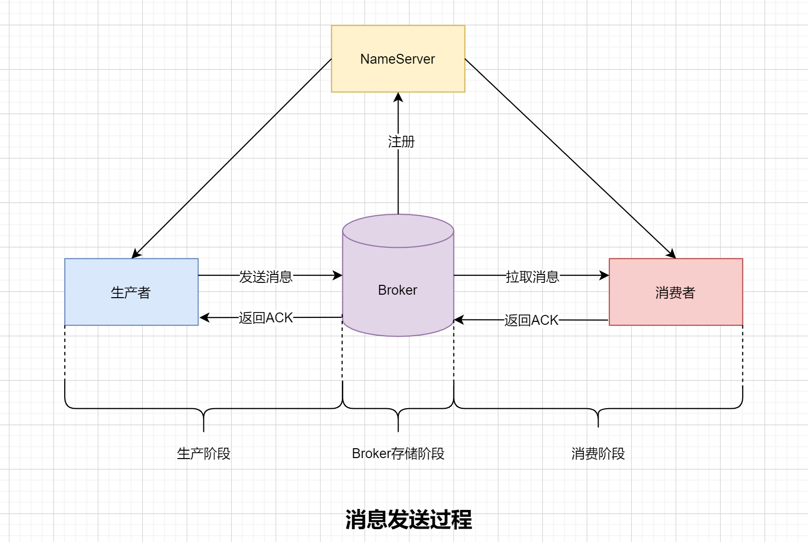

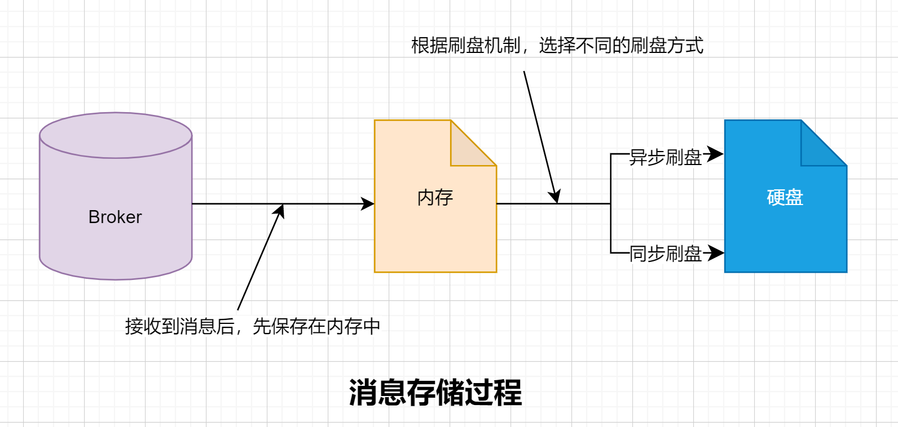

<font style="color:rgb(18, 18, 18);">我们将消息流程分为三大部分，每一部分都有可能会丢失数据。</font>

+ <font style="color:rgb(18, 18, 18);">生产阶段：Producer通过网络将消息发送给Broker，这个发送可能会发生丢失。比如网络延迟不可达等。</font>
+ <font style="color:rgb(18, 18, 18);">存储阶段：Broker肯定是先把消息放到内存的，然后根据刷盘策略持久化到硬盘中。刚收到Producer的消息，放入内存，但是异常宕机了，导致消息丢失。</font>
+ <font style="color:rgb(18, 18, 18);">消费阶段：消费失败。比如先提交ack再消费，处理过程中出现异常，该消息就出现了丢失。</font>

解决方案：

+ <font style="color:rgb(18, 18, 18);">生产阶段：使用同步发送失败重试机制；异步发送重写回调方法检查发送结果；Ack确认机制。</font>
+ <font style="color:rgb(18, 18, 18);">存储阶段：同步刷盘机制；集群模式采用同步复制。</font>
+ <font style="color:rgb(18, 18, 18);">消费阶段：正常消费处理完成才提交ACK；如果处理异常返回重试标识。</font>

除了上述，在生产阶段与消费者阶段部分消息还需要确保消息顺序消费。

#### 6.2.RocketMQ的消息持久化机制
RocketMQ的消息持久化机制是指将消息存储在磁盘上，以确保消息能够可靠地存储和检索。RocketMQ 的消息持久化机制涉及到以下三个角色：CommitLog、ConsumeQueue 和 IndexFile。

+ CommitLog：消息真正的存储文件，**所有的消息**都存在 CommitLog文件中。

RocketMQ默认会将消息数据先存储到内存中的一个缓冲区，每当缓冲区中积累了一定量的消息或者一定时间后，就会将缓冲区中的消息批量写入到磁盘上的 CommitLog 文件中。消息在写入 CommitLog 文件后就可以被消费者消费了。

Commitlog文件的大小固定1G，写满之后生成新的文件，并且采用的是**顺序写**的方式。

+ ConsumeQueue：消息消费逻辑队列，类似数据库的索引文件。

RocketMQ 中每个主题下的每个消息队列都会对应一个 ConsumeQueue。ConsumeQueue存储了消息的offset以及该offset对应的消息在CommitLog文件中的位置信息，便于消费者快速定位并消费消息。

每个ConsumeQueue文件固定由30万个固定大小20byte的数据块组成；据块的内容包括：msgPhyOffset(8byte，消息在文件中的起始位置)+msgSize(4byte，消息在文件中占用的长度)+msgTagCode(8byte，消息的tag的Hash值)。  

+ IndexFile：消息索引文件，主要存储消息Key与offset的对应关系，提升消息检索速度。

如果生产者在发送消息时设置了消息Key，那么RocketMQ会将消息Key值和消息的物理偏移量（offset）存储在IndexFile文件中，这样当消费者需要根据消息Key查询消息时，就可以直接在IndexFile文件中查找对应的offset，然后通过 ConsumeQueue文件快速定位并消费消息。

IndexFile文件大小固定400M，可以保存2000W个索引。

三个角色构成的消息存储结构如下：

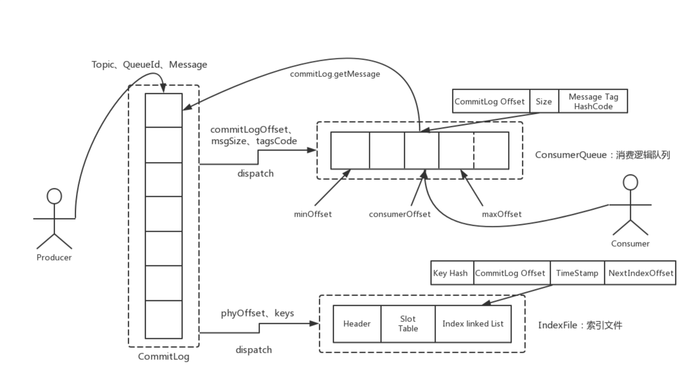

消息存储过程：

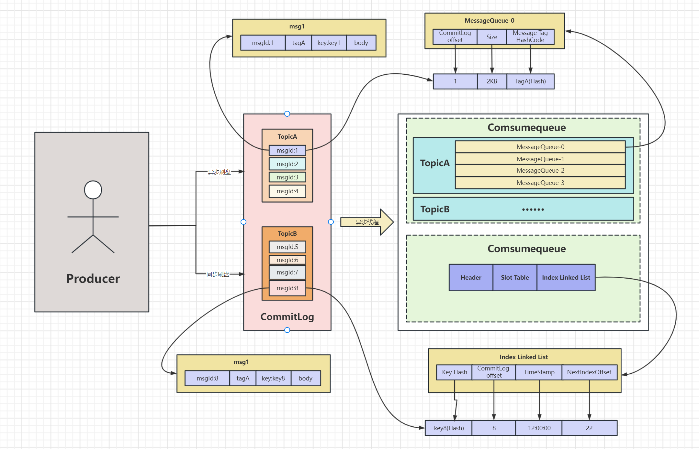

#### 6.3.RocketMQ如何保证消息顺序
RocketMQ架构本身是无法保证消息有序的，但是提供了相应的API保证消息有序消费。RocketMQ API利用FIFO先进先出的特性，保证生产者消息有序进入同一队列，消费者在同一队列消费就能达到消息的有序消费。

+ 使用MessageQueueSelector编写有序消息生产者

有序消息生产者会按照一定的规则将消息发送到同一个队列中，从而保证同一个队列中的消息是有序的。RocketMQ 并不保证整个主题内所有队列的消息都是按照发送顺序排列的。

+ 使用MessageListenerOrderly进行顺序消费与之对应的MessageListenerConcurrently并行消费（push模式）

MessageListenerOrderly是RocketMQ 专门提供的一种顺序消费的接口，它可以让消费者按照消息发送的顺序，一个一个地处理消息。这个接口支持按照消息的重试次数进行顺序消费、订单ID等作为消息键来实现顺序消费、批量消费等操作。	

通过加锁的方式实现（有超时机制），一个队列同时只有一个消费者；并且存在一个定时任务，每隔一段时间就会延长锁的时间，直到整个消息队列全部消费结束。

+ 消费端自己保证消息顺序消费（pull模式）
+ 消费者并发消费时设置消费线程为1

RocketMQ 的消费者可以开启多个消费线程同时消费同一个队列中的消息，如果要保证消息的顺序，需要将消费线程数设置为1。这样，在同一个队列中，每个消息只会被单个消费者线程消费，从而保证消息的顺序性

rokectMQ消息模型：

#### 6.4.RocketMQ的事务消息原理
RocketMQ 的事务消息是一种保证消息可靠性的机制。在RocketMQ中，事务消息的实现原理主要是通过两个发送阶段和一个确认阶段来实现的。

+ 发送消息的预处理阶段：在发送事务消息之前，RocketMQ 会将消息的状态设置为“Preparing”，并将消息存储到消息存储库中。
+ 执行本地事务：当预处理阶段完成后，消息发送者需要执行本地事务，并返回执行结果（commit 或 rollback）。
+ 消息的二次确认阶段：根据本地事务的执行结果，如果是 commit，则 RocketMQ 将消息的状态设置为“Committing”；否则将消息的状态设置为“Rollback”。
+ 完成事务：最后在消息的消费者消费该消息时，RocketMQ 会根据消息的状态来决定是否提交该消息。如果消息的状态是“Committing”，则直接提交该消息；否则忽略该消息。

需要注意的是，如果在消息发送的过程中出现异常或者网络故障等问题，RocketMQ 会触发消息回查机制。在回查过程中，RocketMQ 会调用消息发送方提供的回查接口来确认事务的提交状态，从而解决消息投递的不确定性。

#### 
#### 6.5.RocketMQ 消息积压问题
<font style="color:rgb(37, 41, 51);">RocketMQ是一种可靠的、可扩展的消息中间件，广泛应用于分布式系统中的消息通信。然而，在高并发的场景下，由于消息产生速度超过消费速度，可能会导致消息积压的问题。比如说：</font>

在一个系统中，由生产者系统和消费者系统两个环节组成，生产者系统不停的把消息写入RocketMQ里去，然后消费者系统就负责从RocketMQ里消费消息。

该系统在生产环境的高峰期内，大概有100多万条消息进入MQ。然后消费者系统从MQ里获取消息，并依赖Redis去进行一些业务逻辑的实现。

某天在高峰期突然间出了问题。导致消费者系统也阻塞无法继续执行下去了。

消费者系统的阻塞停止运行，意味着不会再从RocketMQ里去消费数据和处理了。而此时的生产者系统依旧不间断往MQ里写入100多万的消息，那么这些消息都会积压在MQ里，而无法被及时消费和处理掉。

##### 消息积压的场景
1.<font style="color:rgba(0, 0, 0, 0.82);">消费者处理速度慢：</font>业务高峰期业务量激增，生产太快，消费者不充<font style="color:rgb(37, 41, 51);">足</font>

2.<font style="color:rgba(0, 0, 0, 0.82);">消息消费失败：由于某个队列的消息迟迟不能被消费导致消费进度无法提交</font>

3.<font style="color:rgba(0, 0, 0, 0.82);">配置不合理：消息队列的配置不当，例如队列容量设置过小或消费者数量不足，都会导致消息积压。</font>

4.<font style="color:rgba(0, 0, 0, 0.82);">系统瓶颈：服务器性能瓶颈或网络延迟也可能导致消息无法及时被消费，从而积压。</font>

##### 解决消息积压
1. **<font style="color:rgba(0, 0, 0, 0.82);">增加消费者数量</font>**<font style="color:rgba(0, 0, 0, 0.82);">:</font>
    - <font style="color:rgba(0, 0, 0, 0.82);">增加消费者实例的数量，以提高消息的消费速度。</font>
    - <font style="color:rgba(0, 0, 0, 0.82);">确保消费者实例数量与消息队列数量匹配，以便每个队列都有专门的消费者处理。</font>
2. **<font style="color:rgba(0, 0, 0, 0.82);">优化消费者逻辑</font>**<font style="color:rgba(0, 0, 0, 0.82);">:</font>
    - <font style="color:rgba(0, 0, 0, 0.82);">优化消费者的处理逻辑，提高单个消费者的处理效率。</font>
    - <font style="color:rgba(0, 0, 0, 0.82);">使用批量消费的方式来减少每次消费的开销。</font>
3. **<font style="color:rgba(0, 0, 0, 0.82);">扩展消息队列容量</font>**<font style="color:rgba(0, 0, 0, 0.82);">:</font>
    - <font style="color:rgba(0, 0, 0, 0.82);">增加消息队列的数量，以分散消息负载。</font>
    - <font style="color:rgba(0, 0, 0, 0.82);">动态调整队列数量，增加处理能力，实现更高的并行处理。</font>
4. **<font style="color:rgba(0, 0, 0, 0.82);">设置消息消费失败处理机制</font>**<font style="color:rgba(0, 0, 0, 0.82);">:</font>
    - <font style="color:rgba(0, 0, 0, 0.82);">实施重试机制，确保消费失败的消息能够被重新处理。</font>
    - <font style="color:rgba(0, 0, 0, 0.82);">设置死信队列（DLQ）来处理多次消费失败的消息。</font>
5. **<font style="color:rgba(0, 0, 0, 0.82);">快速失败丢弃消息</font>**<font style="color:rgba(0, 0, 0, 0.82);">:</font>
    - <font style="color:rgba(0, 0, 0, 0.82);">如果某些消息可以丢弃，考虑在高峰期快速丢弃这些消息以减轻负担。</font>
6. **<font style="color:rgba(0, 0, 0, 0.82);">提升系统性能</font>**<font style="color:rgba(0, 0, 0, 0.82);">:</font>
    - <font style="color:rgba(0, 0, 0, 0.82);">优化服务器性能，增加硬件资源，如CPU、内存和网络带宽。</font>
    - <font style="color:rgba(0, 0, 0, 0.82);">确保网络连接的稳定性和速度，以减少延迟。</font>

## 7.部署过程相关的命令集汇总
```java
#更新配置
source ~/.bash_profile

vi /etc/hosts
#配置主机名
192.168.43.128 worker1
192.168.43.129 worker2
192.168.43.130 worker3

#生成key，免密登录
ssh-keygen
ssh-copy-id worker1
ssh-copy-id worker2
ssh-copy-id worker3

#检查防火墙状态
firewall-cmd --state
#停止防火墙
systemctl stop firewalld
#并禁用防火墙
systemctl disable firewalld
#删除防火墙
yum remove firewalld

#解压tar.gz包
tar zxvf apache-maven-3.9.1-bin.tar.gz

#解压zip包
unzip rocketmq-dashboard-rocketmq-dashboard-1.0.0.zip

#切换路径
cd /app/rocketMQ/rocketmq-all-5.1.0-bin-release/bin

#添加环境配置命令
vi ~/.bash_profile
#更新配置
source ~/.bash_profile
    
#临时指定namesrv地址
export NAMESRV_ADDR='worker1:9876;worker2:9876;worker3:9876';
	
#启动NameServer
nohup ./mqnamesrv &
#启动Broker
nohup ./mqbroker &
nohup ./mqbroker -c ../conf/2m-2s-async/broker-a.properties --enable-proxy & 
nohup ./mqbroker -c ../conf/2m-2s-async/broker-a-s.properties --enable-proxy & 
nohup ./mqbroker -c ../conf/2m-2s-async/broker-b.properties --enable-proxy &
nohup ./mqbroker -c ../conf/2m-2s-async/broker-b-s.properties --enable-proxy & 
   
#1.关闭NameServer
sh ./mqshutdown namesrv
#2.关闭Broker
sh ./mqshutdown broker

#查看nohup日志
tail -f nohup
#查看namesrv日志
tail -f ~/logs/rocketmqlogs/namesrv.log
#查看broker日志
tail -f ~/logs/rocketmqlogs/broker.log
#查看proxy日志
tail -f ~/logs/rocketmqlogs/proxy.log
#可以使用less命令替换tail命令
    
#测试发送消息
./tools.sh org.apache.rocketmq.example.quickstart.Producer

#测试接受消息
./tools.sh org.apache.rocketmq.example.quickstart.Consumer

#编译dashboard
mvn clean package -Dmaven.test.skip=true
    
#启动dashboard
nohup java -jar rocketmq-dashboard-1.0.0.jar &
```

## 8.机器配置后的完整截图
### 8.1.hosts配置：cat /etc/hosts
三个机器都是如此

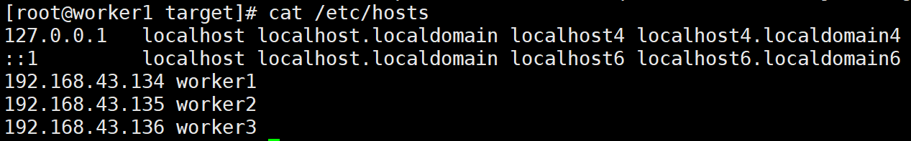

### 8.2.bash_profile配置：cat ~/.bash_profile
##### 8.2.1worker1：
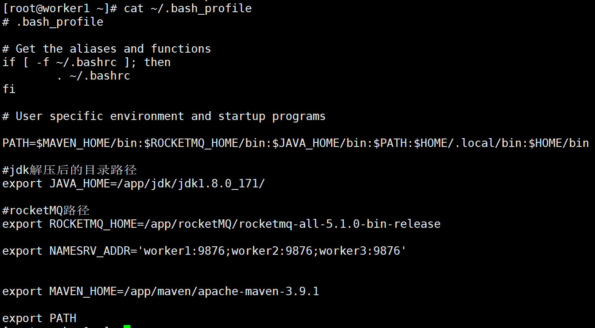

##### 8.2.2.worker2、worker3：
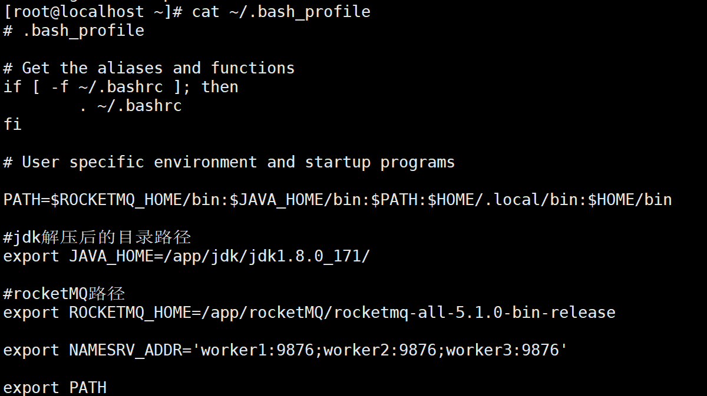

### 8.3.conf/broker.conf配置文件：cat borker.conf
#### 8.3.1.worker1：borker.conf
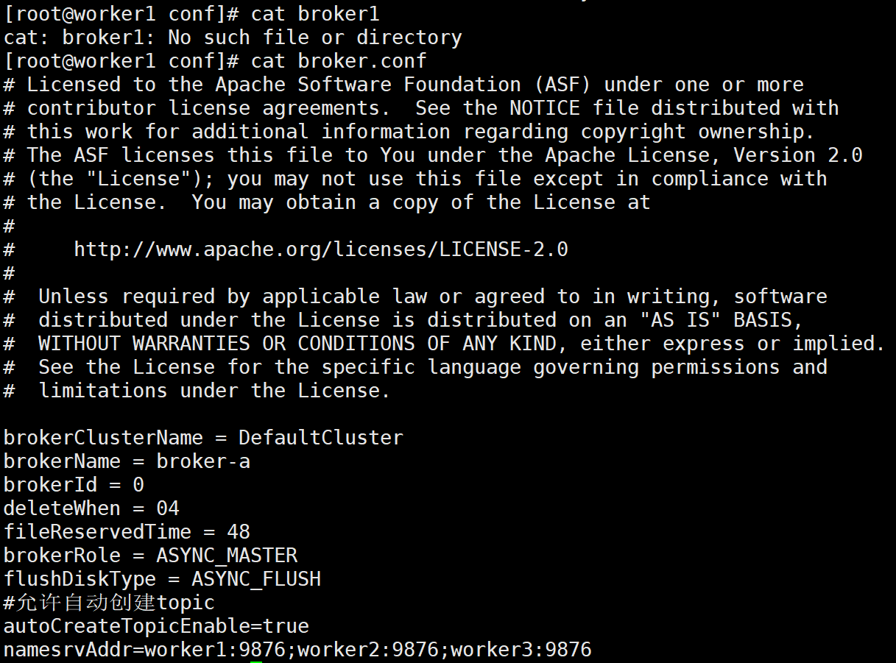

#### 8.3.2.主2从架构：cd conf/2m-2s-async/
##### 8.3.2.1.worker2：broker-a.properties
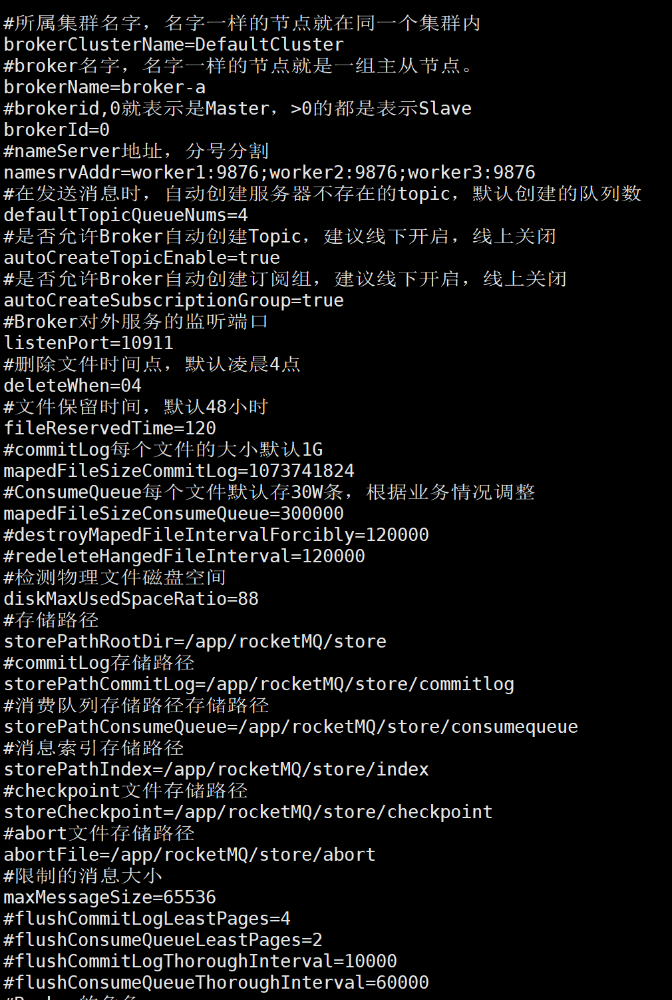

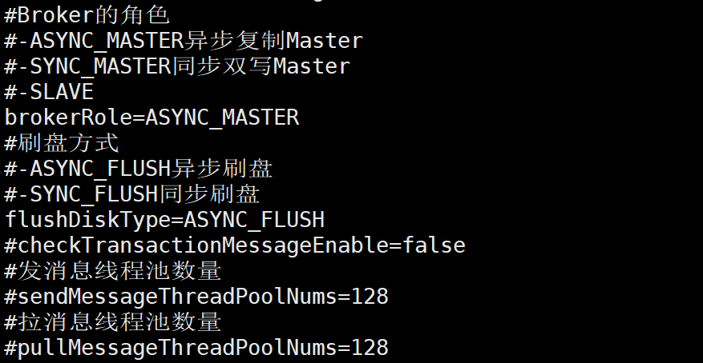

##### 8.3.2.2worker2：broker-b-s.properties
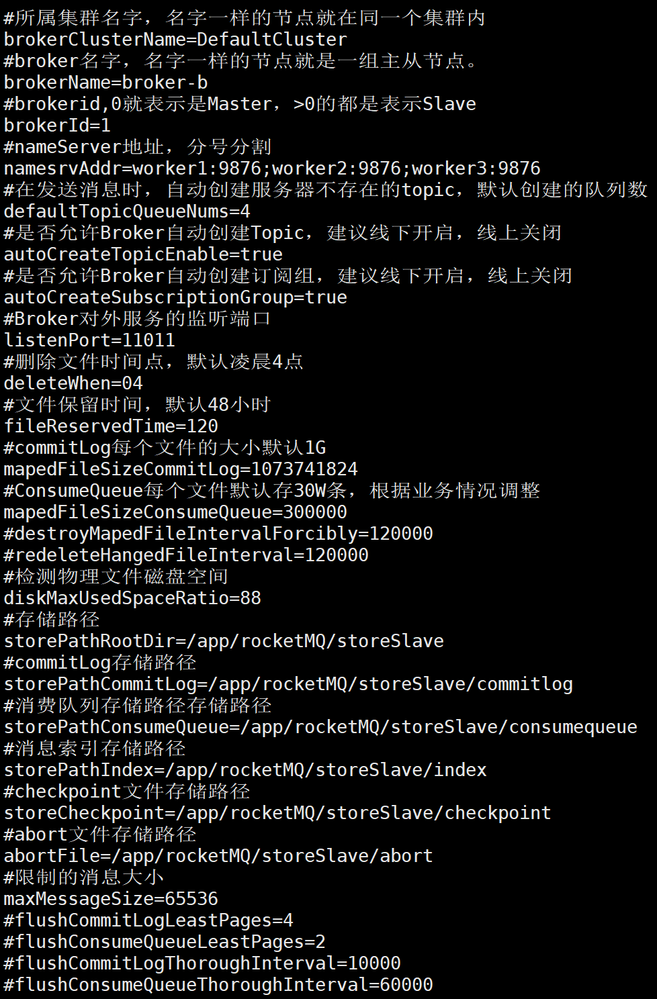

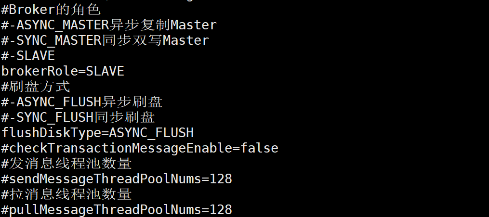

##### 8.3.2.3.worker3：broker-b.properties
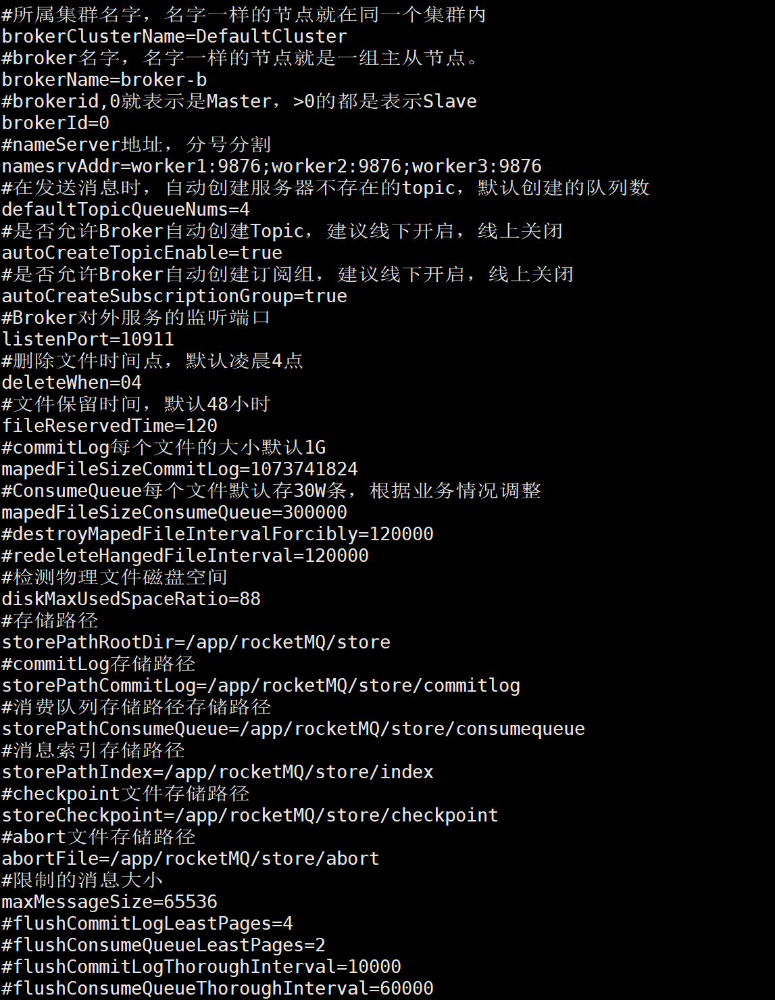

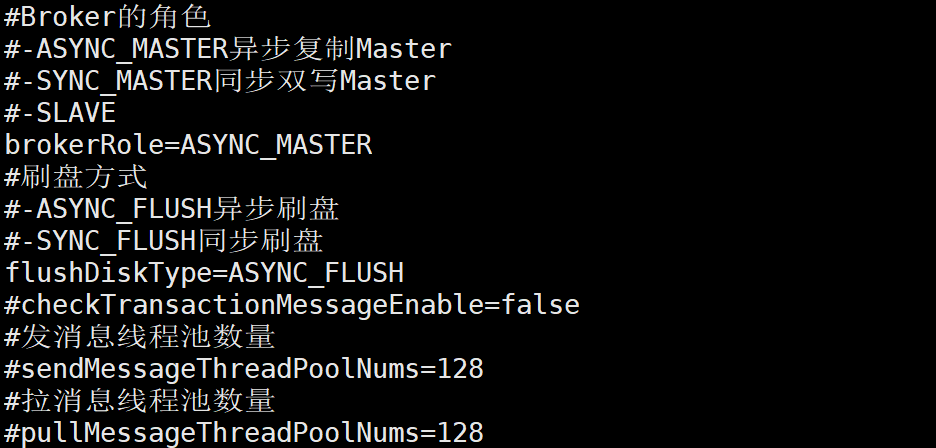

##### 8.3.2.4.worker3：broker-a-s.properties
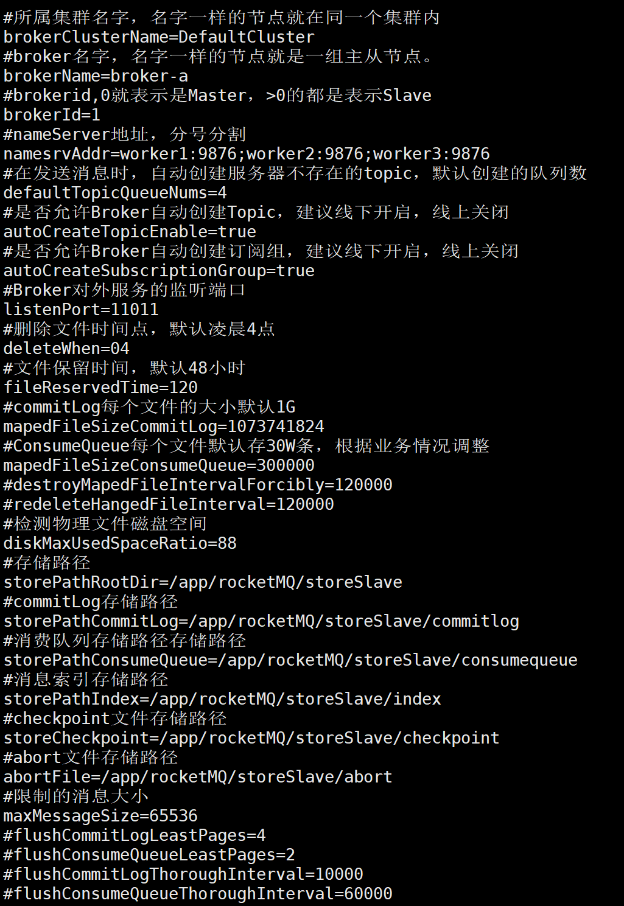

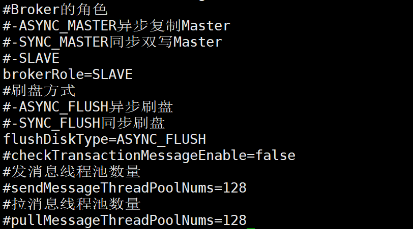

### 8.4.Maven配置（worker1）
#### 8.4.1.本地仓库路径
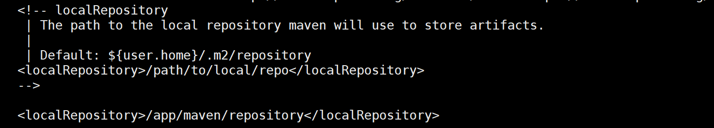

#### 8.4.2.阿里云配置
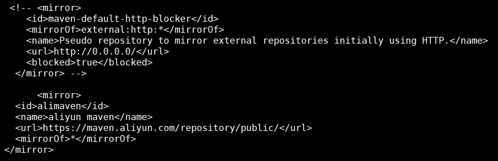

### 8.5.整体文件目录结构
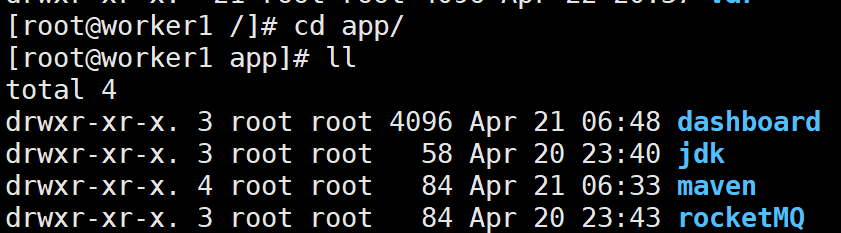


> 更新: 2025-04-15 14:24:22  
> 原文: <https://www.yuque.com/u12222632/as5rgl/gb5mulsye6ydsg3v>