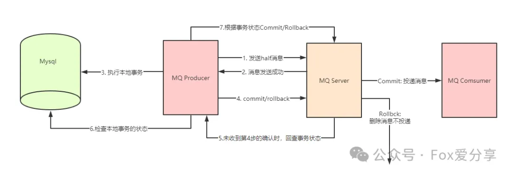

# RocketMQ消息0丢失的终极方案——事务消息篇

#### **<font style="color:rgba(0, 0, 0, 0.9);">你的消息系统，能扛得住“双11”吗？</font>**
<font style="color:rgba(0, 0, 0, 0.9);">你是否经历过这样的场景：</font>**<font style="color:rgba(0, 0, 0, 0.9);">用户在支付订单时，系统卡顿导致订单支付失败，但扣款却成功了？</font>**<font style="color:rgba(0, 0, 0, 0.9);">  
</font><font style="color:rgba(0, 0, 0, 0.9);">或者，</font>**<font style="color:rgba(0, 0, 0, 0.9);">订单支付成功，但消息未能发送到物流系统，导致用户迟迟收不到货？</font>**<font style="color:rgba(0, 0, 0, 0.9);">  
</font><font style="color:rgba(0, 0, 0, 0.9);">在高并发场景下，消息丢失不仅影响用户体验，还可能导致公司损失惨重。</font><font style="color:rgba(0, 0, 0, 0.9);">  
</font><font style="color:rgba(0, 0, 0, 0.9);">在之前的文章中，我们从</font>**<font style="color:rgba(0, 0, 0, 0.9);">生产阶段</font>****<font style="color:rgba(0, 0, 0, 0.9);">、</font>****<font style="color:rgba(0, 0, 0, 0.9);">存储阶段</font>****<font style="color:rgba(0, 0, 0, 0.9);">、</font>****<font style="color:rgba(0, 0, 0, 0.9);">消费阶段</font>**<font style="color:rgba(0, 0, 0, 0.9);">三个环节解析了</font>**<font style="color:rgba(0, 0, 0, 0.9);">RocketMQ消息0丢失的解决方案</font>**<font style="color:rgba(0, 0, 0, 0.9);">。</font><font style="color:rgba(0, 0, 0, 0.9);">  
</font>[RocketMQ消息0丢失，如何实现？滴滴、阿里、美团面试必考题深度解析！](https://mp.weixin.qq.com/s?__biz=MzU1ODk1NTQ0Mg==&mid=2247485799&idx=1&sn=99e4666d3c8c5bbf9cce0b926dfee6e9&scene=21#wechat_redirect)

<font style="color:rgba(0, 0, 0, 0.9);">但还有一个关键机制被遗漏了——</font>**<font style="color:rgba(0, 0, 0, 0.9);">事务消息</font>**<font style="color:rgba(0, 0, 0, 0.9);">。</font><font style="color:rgba(0, 0, 0, 0.9);">  
</font><font style="color:rgba(0, 0, 0, 0.9);">那么，</font>**<font style="color:rgba(0, 0, 0, 0.9);">事务消息是什么？如何通过事务消息实现消息的0丢失？</font>**<font style="color:rgba(0, 0, 0, 0.9);">这篇文章将为你揭晓！</font>

**<font style="color:rgba(0, 0, 0, 0.9);">为什么需要事务消息？</font>**

<font style="color:rgba(0, 0, 0, 0.9);">在分布式系统中，消息的发送和业务的执行通常分布在不同的服务中。</font>

<font style="color:rgba(0, 0, 0, 0.9);">如果没有事务机制，可能会出现以下问题：</font>

1. **<font style="color:rgba(0, 0, 0, 0.9);">消息发送成功，业务执行失败</font>**<font style="color:rgba(0, 0, 0, 0.9);">：消息已经发送到Broker，但业务逻辑执行失败，导致数据不一致。</font>
2. **<font style="color:rgba(0, 0, 0, 0.9);">业务执行成功，消息发送失败</font>**<font style="color:rgba(0, 0, 0, 0.9);">：业务逻辑执行成功，但消息未能发送到Broker，导致下游系统无法感知业务变化。</font>

<font style="color:rgba(0, 0, 0, 0.9);">为了解决这些问题，RocketMQ引入了事务消息机制，确保消息发送和业务执行的原子性。</font>

**<font style="color:rgba(0, 0, 0, 0.9);">事务消息的工作原理</font>**

<font style="color:rgba(0, 0, 0, 0.9);">RocketMQ事务消息的核心思想是</font>**<font style="color:rgba(0, 0, 0, 0.9);">两阶段提交（2PC）</font>**<font style="color:rgba(0, 0, 0, 0.9);">，具体流程如下：</font>

**<font style="color:rgba(0, 0, 0, 0.9);">1.发送Half消息</font>**

<font style="color:rgba(0, 0, 0, 0.9);">Producer发送一条Half消息到Broker，此时消息对Consumer不可见。</font>

**<font style="color:rgba(0, 0, 0, 0.9);">2.执行本地事务</font>**

<font style="color:rgba(0, 0, 0, 0.9);">Producer执行本地业务逻辑。</font>

**<font style="color:rgba(0, 0, 0, 0.9);">3.提交或回滚事务</font>**

+ <font style="color:rgba(0, 0, 0, 0.9);">如果本地事务执行成功，Producer发送Commit请求，Broker将消息标记为可消费。</font>
+ <font style="color:rgba(0, 0, 0, 0.9);">如果本地事务执行失败，Producer发送Rollback请求，Broker将消息丢弃。</font>

**<font style="color:rgba(0, 0, 0, 0.9);">4.回查机制</font>**

<font style="color:rgba(0, 0, 0, 0.9);">如果Producer未明确提交或回滚事务，Broker会定期向Producer发送事务回查，Producer根据业务状态决定提交或回滚。</font>



**<font style="color:rgba(0, 0, 0, 0.9);">代码示例：事务消息实现</font>**

```plain
// 定义事务监听器
public class TransactionListenerImpl implements TransactionListener {
    @Override
    public LocalTransactionState executeLocalTransaction(Message msg, Object arg) {
        // 执行本地事务逻辑
        try {
            boolean success = doBusinessLogic();
            if (success) {
                return LocalTransactionState.COMMIT_MESSAGE; // 提交事务
            } else {
                return LocalTransactionState.ROLLBACK_MESSAGE; // 回滚事务
            }
        } catch (Exception e) {
            return LocalTransactionState.UNKNOW; // 事务状态未知，触发回查
        }
    }

    @Override
    public LocalTransactionState checkLocalTransaction(MessageExt msg) {
        // 事务回查逻辑
        boolean success = checkBusinessStatus();
        if (success) {
            return LocalTransactionState.COMMIT_MESSAGE; // 提交事务
        } else {
            return LocalTransactionState.ROLLBACK_MESSAGE; // 回滚事务
        }
    }
}

// 创建事务Producer
TransactionMQProducer producer = new TransactionMQProducer("transaction_group");
producer.setNamesrvAddr("127.0.0.1:9876");
producer.setTransactionListener(new TransactionListenerImpl());
producer.start();

// 发送事务消息
Message msg = new Message("topic", "tag", "Hello RocketMQ".getBytes());
SendResult sendResult = producer.sendMessageInTransaction(msg, null);
System.out.println("消息发送结果：" + sendResult.getSendStatus());
```

<font style="color:rgba(0, 0, 0, 0.9);">  
</font>

**<font style="color:rgba(0, 0, 0, 0.9);">事务消息的应用场景</font>**

**<font style="color:rgba(0, 0, 0, 0.9);">1.订单支付</font>**

+ <font style="color:rgba(0, 0, 0, 0.9);">本地事务：扣减库存、生成订单。</font>
+ <font style="color:rgba(0, 0, 0, 0.9);">消息：通知物流系统发货。</font>

<font style="color:rgba(0, 0, 0, 0.9);">  
</font>

**<font style="color:rgba(0, 0, 0, 0.9);">2.库存更新</font>**

+ <font style="color:rgba(0, 0, 0, 0.9);">本地事务：更新库存数量。</font>
+ <font style="color:rgba(0, 0, 0, 0.9);">消息：通知下游系统库存变化。</font>

<font style="color:rgba(0, 0, 0, 0.9);">  
</font>

**<font style="color:rgba(0, 0, 0, 0.9);">3.积分变更</font>**

+ <font style="color:rgba(0, 0, 0, 0.9);">本地事务：更新用户积分。</font>
+ <font style="color:rgba(0, 0, 0, 0.9);">消息：通知营销系统发送积分奖励。</font>

<font style="color:rgba(0, 0, 0, 0.9);">  
</font>

**<font style="color:rgba(0, 0, 0, 0.9);">事务消息的优缺点</font>**

**<font style="color:rgba(0, 0, 0, 0.9);">优点：</font>**

<font style="color:rgba(0, 0, 0, 0.9);">确保消息发送和业务执行的原子性，彻底解决数据不一致问题。</font>

**<font style="color:rgba(0, 0, 0, 0.9);">缺点：</font>**

<font style="color:rgba(0, 0, 0, 0.9);">性能开销较大，适用于对数据一致性要求较高的场景。</font>

**<font style="color:rgba(0, 0, 0, 0.9);">总结</font>**

<font style="color:rgba(0, 0, 0, 0.9);">为了确保</font>**<font style="color:rgba(0, 0, 0, 0.9);">消息的0丢失</font>**<font style="color:rgba(0, 0, 0, 0.9);">，可以将</font>**<font style="color:rgba(0, 0, 0, 0.9);">事务消息</font>****<font style="color:rgba(0, 0, 0, 0.9);">与</font>****<font style="color:rgba(0, 0, 0, 0.9);">本地消息表</font>**<font style="color:rgba(0, 0, 0, 0.9);">结合使用：</font>

1. **<font style="color:rgba(0, 0, 0, 0.9);">生产阶段</font>**<font style="color:rgba(0, 0, 0, 0.9);">使用事务消息确保消息发送和业务执行的原子性。</font>
2. **<font style="color:rgba(0, 0, 0, 0.9);">消费阶段</font>**<font style="color:rgba(0, 0, 0, 0.9);">使用本地消息表记录消费状态，定时扫描未确认的消息。</font>

<font style="color:rgba(0, 0, 0, 0.9);">  
</font>

<font style="color:rgba(0, 0, 0, 0.9);">RocketMQ事务消息机制通过</font>**<font style="color:rgba(0, 0, 0, 0.9);">两阶段提交和回查机制</font>**<font style="color:rgba(0, 0, 0, 0.9);">，解决了消息发送和业务执行的一致性问题。结合本地消息表，可以进一步确保消息的0丢失。</font>

**<font style="color:rgba(0, 0, 0, 0.9);">关于分布式事务往期文章回顾：</font>**

[分布式事务模型详解](https://mp.weixin.qq.com/s?__biz=MzU1ODk1NTQ0Mg==&mid=2247484959&idx=1&sn=b7067cd9b991391523ba0c07d8372dec&scene=21#wechat_redirect)

[Alibaba分布式事务组件Seata TCC模式实战](https://mp.weixin.qq.com/s?__biz=MzU1ODk1NTQ0Mg==&mid=2247485048&idx=1&sn=1abbefa9575d974eca5bf15b9a2d4e18&scene=21#wechat_redirect)

<font style="color:rgba(0, 0, 0, 0.9);">如果觉得这篇文章对你有所帮助，欢迎点个 </font>**“推荐”**<font style="color:rgba(6, 8, 31, 0.88);"> 或分享给更多的小伙伴！关注公众号「</font>**<font style="color:rgba(6, 8, 31, 0.88);">Fox爱分享</font>**<font style="color:rgba(6, 8, 31, 0.88);">」</font><font style="color:rgb(64, 64, 64);">，</font>**<font style="color:rgb(64, 64, 64);">解锁更多精彩内容！</font>**


> 更新: 2025-03-31 16:32:45  
> 原文: <https://www.yuque.com/u12222632/as5rgl/uuas3nkh6uxn1ugo>