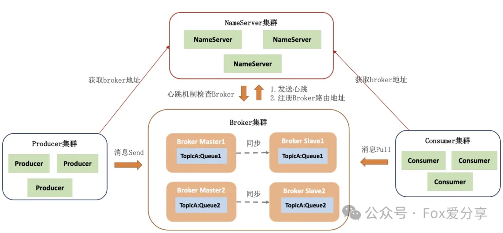

# RocketMQ消息0丢失，如何实现？滴滴、阿里、美团面试必考题深度解析！

<font style="color:rgba(0, 0, 0, 0.9);">你有没有遇到过这样的场景：</font>**<font style="color:rgba(0, 0, 0, 0.9);">业务高峰期，消息丢失，订单无法处理，</font>**<font style="color:rgba(0, 0, 0, 0.9);">用户投诉不断，公司损失惨重？</font>

<font style="color:rgba(0, 0, 0, 0.9);">如果消息丢失问题得不到解决，RocketMQ 将不再是你的助力，而是业务的最大瓶颈。</font>

<font style="color:rgba(0, 0, 0, 0.9);">最近，很多小伙伴在面试滴滴、阿里、美团等大厂时，都遇到了一个高频问题：</font>**<font style="color:rgba(0, 0, 0, 0.9);">如何实现RocketMQ消息0丢失？</font>**

<font style="color:rgba(0, 0, 0, 0.9);">今天，我们就从</font>**<font style="color:rgba(0, 0, 0, 0.9);">生产阶段</font>**<font style="color:rgba(0, 0, 0, 0.9);">、</font>**<font style="color:rgba(0, 0, 0, 0.9);">Broker阶段</font>**<font style="color:rgba(0, 0, 0, 0.9);">、</font>**<font style="color:rgba(0, 0, 0, 0.9);">消费阶段</font>**<font style="color:rgba(0, 0, 0, 0.9);">三个核心环节，为你深度解析RocketMQ消息0丢失的终极解决方案！</font>

**<font style="color:rgba(0, 0, 0, 0.9);">RocketMQ消息丢失的根本原因是什么？</font>**

<font style="color:rgba(0, 0, 0, 0.9);">RocketMQ消息的传递过程分为三个阶段：</font>

1. **<font style="color:rgba(0, 0, 0, 0.9);">生产阶段</font>**<font style="color:rgba(0, 0, 0, 0.9);">：Producer发送消息到Broker，可能因网络抖动或Broker故障导致消息丢失。</font>
2. **<font style="color:rgba(0, 0, 0, 0.9);">存储阶段</font>**<font style="color:rgba(0, 0, 0, 0.9);">：Broker将消息存储到磁盘，可能因刷盘策略不当或服务器宕机导致消息丢失。</font>
3. **<font style="color:rgba(0, 0, 0, 0.9);">消费阶段</font>**<font style="color:rgba(0, 0, 0, 0.9);">：Consumer从Broker拉取消息，可能因消费失败或超时导致消息丢失。</font>



<font style="color:rgba(0, 0, 0, 0.9);">那么，</font>**<font style="color:rgba(0, 0, 0, 0.9);">如何在每个阶段实现消息的0丢失？</font>**<font style="color:rgba(0, 0, 0, 0.9);">我们来逐一解析！</font>

**<font style="color:rgba(0, 0, 0, 0.9);">核心环节一：生产阶段——如何保证消息100%投递？</font>**

**<font style="color:rgba(0, 0, 0, 0.9);">问题背景</font>**<font style="color:rgba(0, 0, 0, 0.9);">：生产阶段的消息丢失通常是由网络抖动或Broker故障引起的。如果无法保证消息的可靠投递，业务将面临严重损失。</font>

**<font style="color:rgba(0, 0, 0, 0.9);">解决方案：</font>**

**<font style="color:rgba(0, 0, 0, 0.9);">1.同步发送</font>**

<font style="color:rgba(0, 0, 0, 0.9);">使用同步发送方式，Producer发送消息后会阻塞等待Broker的响应，确保消息成功投递。</font>

<font style="color:rgba(0, 0, 0, 0.9);">代码示例：</font>

```plain

SendResult sendResult = producer.send(message);
if (sendResult.getSendStatus() == SendStatus.SEND_OK) {
    System.out.println("消息发送成功！");
}
```

**<font style="color:rgba(0, 0, 0, 0.9);">2.失败重试机制</font>**<font style="color:rgba(0, 0, 0, 0.9);">  
</font><font style="color:rgba(0, 0, 0, 0.9);">设置消息发送失败时的重试次数，确保在网络抖动时消息能够成功投递。</font><font style="color:rgba(0, 0, 0, 0.9);">  
</font>**<font style="color:rgba(0, 0, 0, 0.9);">代码示例</font>**<font style="color:rgba(0, 0, 0, 0.9);">：</font>

```plain
producer.setRetryTimesWhenSendFailed(10); // 设置重试次数为10
```

**<font style="color:rgba(0, 0, 0, 0.9);">3.本地消息表+定时扫描</font>**

<font style="color:rgba(0, 0, 0, 0.9);">在业务层面，通过本地消息表记录消息发送状态，定时扫描未确认的消息并进行重试。</font>

<font style="color:rgba(0, 0, 0, 0.9);">核心逻辑：</font>

+ <font style="color:rgba(0, 0, 0, 0.9);">消息发送前，将消息状态记录为“待发送”。</font>
+ <font style="color:rgba(0, 0, 0, 0.9);">发送成功后，更新消息状态为“已发送”。</font>
+ <font style="color:rgba(0, 0, 0, 0.9);">定时任务扫描“待发送”消息，重新发送直至成功。</font>

<font style="color:rgba(0, 0, 0, 0.9);">  
</font>

**<font style="color:rgba(0, 0, 0, 0.9);">核心环节二：Broker阶段——如何保证消息100%存储？</font>**

**<font style="color:rgba(0, 0, 0, 0.9);">问题背景</font>**<font style="color:rgba(0, 0, 0, 0.9);">：Broker存储消息时，如果刷盘策略不当或服务器宕机，可能导致消息丢失。</font>

**<font style="color:rgba(0, 0, 0, 0.9);">解决方案</font>**<font style="color:rgba(0, 0, 0, 0.9);">：</font>

**<font style="color:rgba(0, 0, 0, 0.9);">1.同步刷盘</font>**

<font style="color:rgba(0, 0, 0, 0.9);">设置Broker的刷盘策略为同步刷盘，确保消息写入内存后立即持久化到磁盘。</font>

**<font style="color:rgba(0, 0, 0, 0.9);">配置示例</font>**<font style="color:rgba(0, 0, 0, 0.9);">：</font>

```plain
flushDiskType = SYNC_FLUSH
```

**<font style="color:rgba(0, 0, 0, 0.9);">2.副本同步机制</font>**<font style="color:rgba(0, 0, 0, 0.9);">  
</font><font style="color:rgba(0, 0, 0, 0.9);">设置Broker的副本同步机制为</font>**<font style="color:rgba(0, 0, 0, 0.9);">同步复制</font>**<font style="color:rgba(0, 0, 0, 0.9);">，确保消息在Master和Slave节点都存储成功后才返回响应。</font>

**<font style="color:rgba(0, 0, 0, 0.9);">配置示例</font>**<font style="color:rgba(0, 0, 0, 0.9);">：</font>

```plain
brokerRole = SYNC_MASTER
```

**<font style="color:rgba(0, 0, 0, 0.9);">核心环节三：消费阶段——如何保证消息100%消费？</font>**

**<font style="color:rgba(0, 0, 0, 0.9);">问题背景</font>**<font style="color:rgba(0, 0, 0, 0.9);">：消费阶段的消息丢失通常是由于消费失败或超时引起的，需要确保消息被正确消费。</font>

**<font style="color:rgba(0, 0, 0, 0.9);">解决方案</font>**<font style="color:rgba(0, 0, 0, 0.9);">：</font>

**<font style="color:rgba(0, 0, 0, 0.9);">1.同步消费</font>**

<font style="color:rgba(0, 0, 0, 0.9);">Consumer在消费消息后，手动发送CONSUME_SUCCESS响应，确保消息被正确消费。</font>

<font style="color:rgba(0, 0, 0, 0.9);">代码示例：</font>

```plain
consumer.registerMessageListener(new MessageListenerConcurrently() {
    @Override
    public ConsumeConcurrentlyStatus consumeMessage(List<MessageExt> msgs, ConsumeConcurrentlyContext context) {
        for (MessageExt msg : msgs) {
            // 业务处理逻辑
        }
        return ConsumeConcurrentlyStatus.CONSUME_SUCCESS; // 确认消费成功
    }
});
```

**<font style="color:rgba(0, 0, 0, 0.9);">2.异步消费+本地消息表</font>**

<font style="color:rgba(0, 0, 0, 0.9);">在异步消费场景下，通过本地消息表记录消息消费状态，定时扫描未确认的消息并进行重试。</font>

<font style="color:rgba(0, 0, 0, 0.9);">某电商平台在“双11”期间，通过</font>**<font style="color:rgba(0, 0, 0, 0.9);">同步发送 + 同步刷盘 + 同步复制 + 本地消息表</font>**<font style="color:rgba(0, 0, 0, 0.9);">的组合，成功实现了消息的0丢失。</font>

**<font style="color:rgba(0, 0, 0, 0.9);">总结</font>**

<font style="color:rgba(0, 0, 0, 0.9);">RocketMQ消息0丢失的实现，需要从生产阶段、存储阶段、消费阶段三个环节入手，结合同步发送、同步刷盘、同步复制、本地消息表等技术手段，打造一套坚不可摧的消息保障体系。</font>

<font style="color:rgba(0, 0, 0, 0.9);">在本文中，我们从</font>**<font style="color:rgba(0, 0, 0, 0.9);">生产阶段、存储阶段、消费阶段</font>**<font style="color:rgba(0, 0, 0, 0.9);">三个环节解析了</font>**<font style="color:rgba(0, 0, 0, 0.9);">RocketMQ消息0丢失的解决方案</font>**<font style="color:rgba(0, 0, 0, 0.9);">。但还有一个关键机制被遗漏了——</font>**<font style="color:rgba(0, 0, 0, 0.9);">事务消息</font>**<font style="color:rgba(0, 0, 0, 0.9);">。</font>

<font style="color:rgba(0, 0, 0, 0.9);">那么，</font>**<font style="color:rgba(0, 0, 0, 0.9);">事务消息是什么？如何通过事务消息实现消息的0丢失？</font>**<font style="color:rgba(0, 0, 0, 0.9);">下篇文章将为你揭晓！</font>

<font style="color:rgba(0, 0, 0, 0.9);">如果觉得这篇文章对你有所帮助，欢迎点个 </font>**“推荐”**<font style="color:rgba(6, 8, 31, 0.88);"> 或分享给更多的小伙伴！关注公众号「</font>**<font style="color:rgba(6, 8, 31, 0.88);">Fox爱分享</font>**<font style="color:rgba(6, 8, 31, 0.88);">」</font><font style="color:rgb(64, 64, 64);">，</font>**<font style="color:rgb(64, 64, 64);">解锁更多精彩内容！</font>**


> 更新: 2025-03-31 15:58:54  
> 原文: <https://www.yuque.com/u12222632/as5rgl/dsefv7ox8t5dor4y>