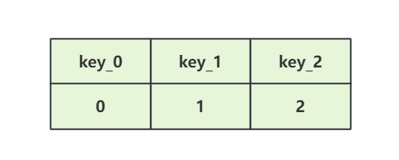

# redis集群如何扛住百万级热点key的访问

众所周知Redis扛并发的能力是非常强的，所以高并发场景下经常会使用Redis，但是Redis单分片的写入瓶颈在2w左右，读瓶颈在10w左右，如果在超高并发下即使是集群部署Redis，单分片的Redis也是有可能扛不住的，如下图所示：

虽然Redis做了集群部署，但是Redis的key只会存在一个分片上，此时超高并发下redis1很有可能会被打垮。那么在超高的并发如何解决某个热key带来的单分片被打垮的问题呢？下面聊聊Redis分key来解决这个问题的方案。

**1、什么是Redis分key**

Redis分key就是将一个热点key通过拆分成若干key，然后让这若干个key分散到Redis集群的不同节点，如下图所示：

将热点key拆分成3个小key，然后通过Redis的算法将这3个key分散到Redis集群的分片上（集群有多少个分片，就拆分成几个key）。这样由原先的一个key拆分成3个小key，在超高并发下由这3个key共同的来承担原先一个热点key扛的流量。

> Redis集群插槽取值范围为：0-16383。
>
> 当存取数据的时候，Redis会根据CRC16的算法得出一个结果，然后把结果对16384取模，这样每个key都会对应一个编号在0-16383之间的哈希槽。通过这个编号，去找到对应的插槽所对应的节点，然后自动跳转到这个对应的节点上进行存取操作。
>
> [算法之Redis集群CRC16算法](https://blog.csdn.net/Lyon_yong/article/details/129796495)
>

**2、拆分后的key分散到集群的分片上**

拆分key的思路可以很好的解决单个热点key可能打垮Redis集群中某个分片的问题，但是我们如何保证一个小key落到一个分片上呢？首先我们来回顾一下Redis集群中key落分片的原理，如下所示的Redis的集群：

从原理上分析key落在哪个节点上是经过了两次的映射，第一次映射是CRC16计算出来key哈希值除以16384之后得到是对应的槽，第二次映射是槽映射到redis的节点，这样可以知道key落在哪个分片上。

根据上述的原理，我们可以通过Redis的命令来获取Redis集群上的集群关系来计算key落在哪个分片上。我们现在为了保证一个key落在一个分片上，可以通过手动的方式来设置key，设置的过程如下：

（1）手写第一个key_0，然后自己手动根据CRC16和槽映射关系之后就知道它落到了哪个节点（假设是redis0上）如下所示：

（2）准备第二个key（如key_11），假设计算之后发现也落到了redis0上，那么我们换一个key（如key_1）,经过计算发现其落在redis1上，如下所示：

（3）同样的方式，准备第三个key（如key_2）,保证其可以落在redis2上即可，如下所示：

分key的时候，我们不要追求 key 是有规律的了，可以随便加点前缀与后缀，只要保证每个小key都分散到集群的分片上即可。

通过上述的试探我们得到了3个拆分后的小key，并且这些小key可以落到集群的节点上，整理出这些拆分后的key如下所示：

**3、分key的工作原理**

经过手动尝试出来的三个key我们写固定到代码中（或者放在配置中心上）。当业务请求过来之后，我们可以通过业务id与拆分出来的key数量取模的方式映射出当前请求打到哪个key上（如key_0）,然后通过这个可以经过redis的两次映射找到对应的节点，找到节点后就可以操作数据了。

**总结：**

（1）Redis分可以的原理就是将一个热点key拆分成若干个小key后分散到集群的不同节点上（集群有几个节点就拆分成几个小key）

（2）为保证key可以分散到集群节点上，采用的是手动尝试的方式来获取拆分后的小key。

（3）分key的方案常用于超高并发业务场景下，如抢优惠券、实时榜单等。

> 更新: 2024-12-06 09:54:36  
> 原文: <https://www.yuque.com/u12222632/as5rgl/lb7lvtmkn6527uta>