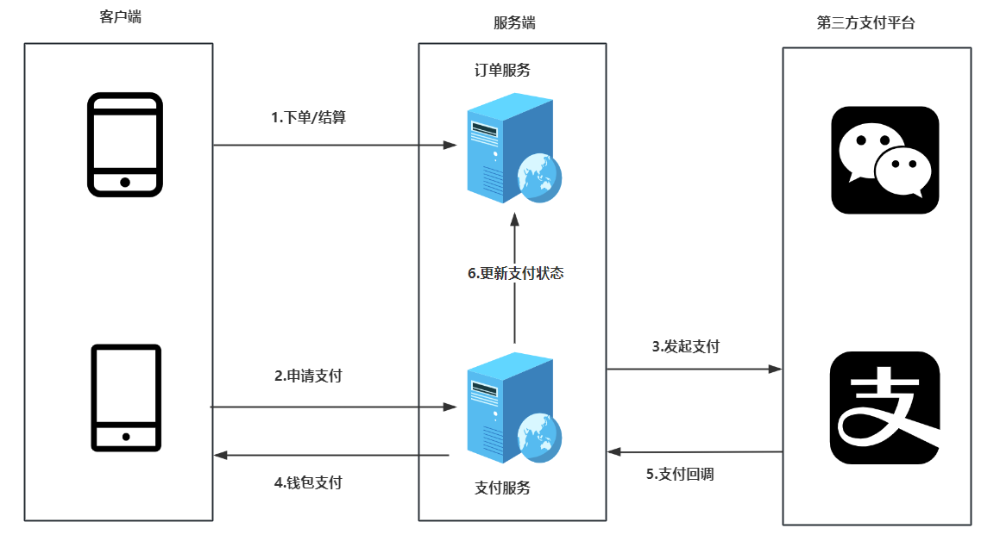
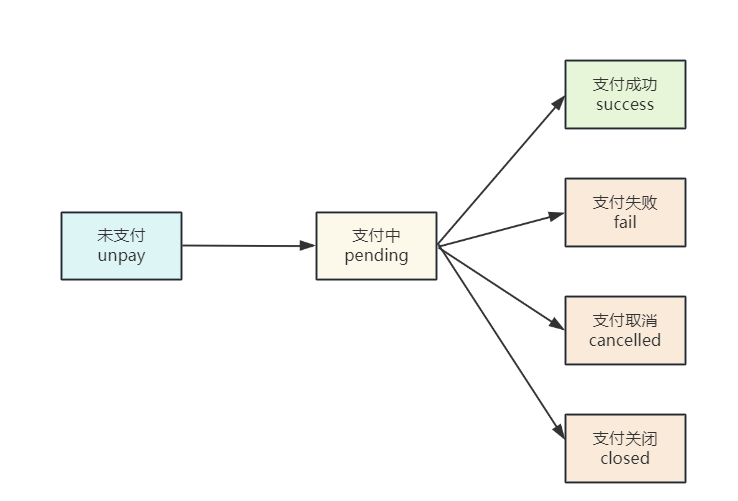
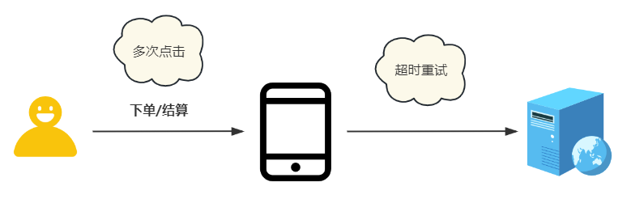
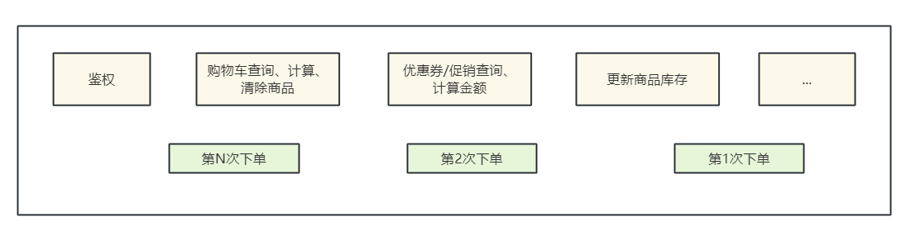
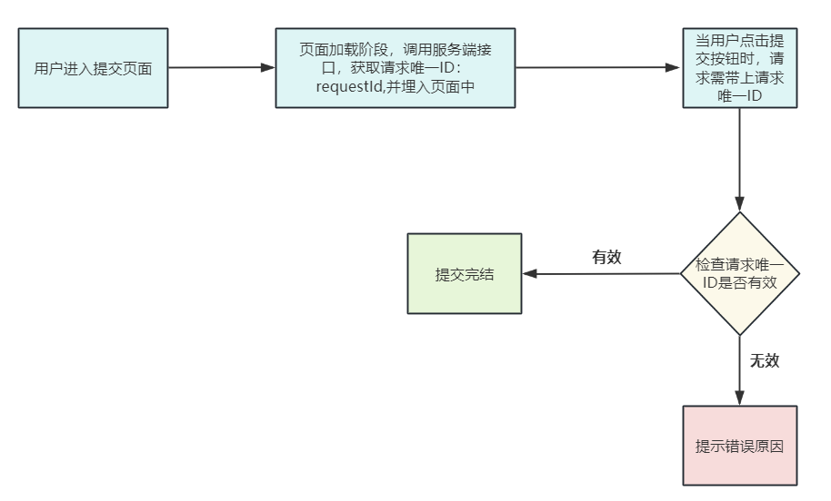
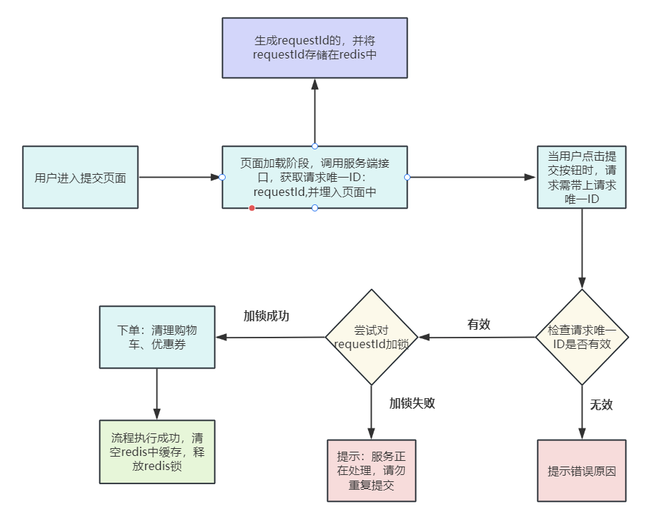
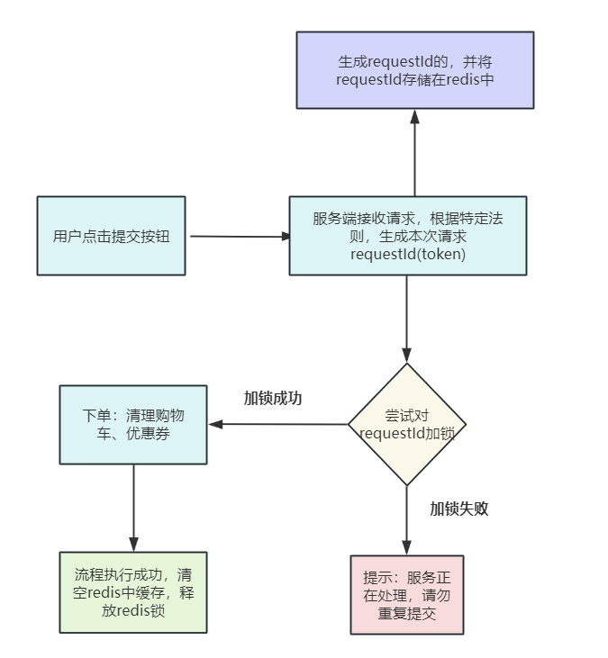

# 京东面试：10wqps高并发，如何防止重复下单？

<font style="color:rgb(36, 41, 46);">最近有小伙伴在面试京东，又遇到了这个的面试题。</font>

> <font style="color:rgb(106, 115, 125);">10wqps高并发，如何防止重复提交/支付订单？</font>
>
> <font style="color:rgb(106, 115, 125);">10wqps高并发，如何防止重复下单？</font>
>
> <font style="color:rgb(106, 115, 125);">10wqps高并发，如何防止重复支付？</font>
>
> <font style="color:rgb(106, 115, 125);">10wqps高并发，如何解决重复操作问题？</font>
>

<font style="color:rgb(36, 41, 46);">小伙伴支支吾吾的说了几句，面试官不满意，面试挂了。</font>

## 1.基础知识：电商订单支付核心流程
<font style="color:rgb(36, 41, 46);">首先，来看看 订单支付的业务流程和交互流程。</font>

### <font style="color:rgb(30, 30, 30);background-color:rgb(212, 224, 250);">图解：订单支付的业务流程和交互流程</font>
<font style="color:rgb(36, 41, 46);">结合下图来看看 订单支付的业务流程和交互流程。</font>



<font style="color:rgb(36, 41, 46);">订单支付流程， 分为 大致 的 6个步骤 ：</font>

**<font style="color:rgb(36, 41, 46);">1.下单/结算：</font>**

<font style="color:rgb(36, 41, 46);">下单作为支付的入口，但并非起点，</font>

<font style="color:rgb(36, 41, 46);">支付相关的金额等信息全部来至结算，此时订单处于 未支付 状态。</font>

**<font style="color:rgb(36, 41, 46);">2.申请支付：</font>**

<font style="color:rgb(36, 41, 46);">用户开始申请支付，客户端调用支付服务，</font>

<font style="color:rgb(36, 41, 46);">此时在支付系统内产生一笔订单支付流水，这笔支付流水处于 未支付 状态。</font>

**<font style="color:rgb(36, 41, 46);">3.发起支付：</font>**

<font style="color:rgb(36, 41, 46);">支付服务调用 第三方支付平台，</font>

<font style="color:rgb(36, 41, 46);">通常, 第三方支付平台 是 钱包类的支付方式，</font>

<font style="color:rgb(36, 41, 46);">在发起支付这一步骤，支付平台会响应一些支付的链接，客户端会对链接进行相应的处理。</font>

**<font style="color:rgb(36, 41, 46);">4.钱包支付：</font>**

<font style="color:rgb(36, 41, 46);">用户进行支付，</font>

<font style="color:rgb(36, 41, 46);">用户 APP端直接拉去钱包进行支付。</font>

**<font style="color:rgb(36, 41, 46);">5.支付回调：</font>**

<font style="color:rgb(36, 41, 46);">用户完成支付之后，三方支付平台会回调 商户的支付服务 接口，通知支付结果。</font>

**<font style="color:rgb(36, 41, 46);">6.更新订单状态：</font>**

<font style="color:rgb(36, 41, 46);">支付服务 确认订单支付完成后，会向 订单服务同步 支付的结果。</font>

<font style="color:rgb(36, 41, 46);">订单服务变更服务的状态：</font>`<font style="color:rgb(36, 41, 46);">未支付</font>`<font style="color:rgb(36, 41, 46);">变更为  </font>`<font style="color:rgb(36, 41, 46);">待发货</font>`<font style="color:rgb(36, 41, 46);">。</font>

  
 

### <font style="color:rgb(30, 30, 30);background-color:rgb(212, 224, 250);">图解：支付状态的变化</font>
<font style="color:rgb(36, 41, 46);">如下图，从支付流水角度来分析一下支付状态的变化：</font>



<font style="color:rgb(36, 41, 46);">1.从未支付，到有支付结果的终态，中间还有一个中间状态：</font>`<font style="color:rgb(36, 41, 46);">支付中</font>`

<font style="color:rgb(36, 41, 46);">2.用户通过打开钱包--》完成支付--》支付回调，这段时间的支付流水就处于：</font>`<font style="color:rgb(36, 41, 46);">支付中</font>`

<font style="color:rgb(36, 41, 46);"></font>

## 2.重复下单的定义、危害、应对策略
### <font style="color:rgb(30, 30, 30);background-color:rgb(212, 224, 250);">什么是重复下单</font>
<font style="color:rgb(36, 41, 46);">现在问题来了， 什么是重复下单？</font>

<font style="color:rgb(36, 41, 46);">用户在下单页面进行下单时，由于用户点击下单按钮 多次 、或者 重试策略 导致在订单服务中接收到了 两次同样 的下单请求。</font>



### <font style="color:rgb(30, 30, 30);background-color:rgb(212, 224, 250);">重复下单带来的危害</font>
**<font style="color:rgb(36, 41, 46);">重复下单场景，第N次的下单会对数据进行打乱，导致系统整体数据异常</font>**

+ <font style="color:rgb(36, 41, 46);">库存数据异常</font>
+ <font style="color:rgb(36, 41, 46);">金额数据异常</font>
+ <font style="color:rgb(36, 41, 46);">优惠券数据异常</font>
+ <font style="color:rgb(36, 41, 46);">等等</font>



<font style="color:rgb(36, 41, 46);">重复下单带来的危害， 总结起来，有以下几点：</font>

##### <font style="color:rgba(0, 0, 0, 0.9);">1.系统资源占用与性能下降</font>
+ <font style="color:rgb(36, 41, 46);">重复下单会占用系统资源，包括服务器、数据库等，特别是在下单高峰期，可能导致系统性能下降，响应速度变慢。</font>
+ <font style="color:rgb(36, 41, 46);">重复请求可能引发系统拥堵，影响其他正常用户的购物体验。</font>

##### <font style="color:rgba(0, 0, 0, 0.9);">2.订单处理复杂性增加</font>
+ <font style="color:rgb(36, 41, 46);">商家在处理订单时，需要花费额外的时间和精力去识别、合并或取消重复订单，增加了订单处理的复杂性。</font>
+ <font style="color:rgb(36, 41, 46);">重复订单可能导致库存数量出现错误，进而影响后续订单的履行。</font>

##### <font style="color:rgba(0, 0, 0, 0.9);">3.财务结算与对账难度增大</font>
+ <font style="color:rgb(36, 41, 46);">重复下单可能导致财务结算时出现混乱，需要花费更多时间和精力去核对和调整账目。</font>
+ <font style="color:rgb(36, 41, 46);">对账过程中需要区分哪些是重复订单，哪些是有效订单，增加了对账的难度。</font>

##### <font style="color:rgba(0, 0, 0, 0.9);">4.用户体验受损</font>
+ <font style="color:rgb(36, 41, 46);">消费者在遇到重复下单时，可能会感到困惑和不满，影响对电商平台的信任度和忠诚度。</font>
+ <font style="color:rgb(36, 41, 46);">重复下单可能导致消费者错过优惠活动或促销时机，影响其购物体验。</font>

##### <font style="color:rgba(0, 0, 0, 0.9);">5.数据异常与决策误导</font>
+ <font style="color:rgb(36, 41, 46);">重复下单的数据会干扰销售数据的准确性，可能导致商家在决策时受到误导。</font>
+ <font style="color:rgb(36, 41, 46);">错误的销售数据可能影响商家的库存规划、生产计划等关键决策。</font>

##### <font style="color:rgba(0, 0, 0, 0.9);">6.售后服务与退换货问题</font>
+ <font style="color:rgb(36, 41, 46);">如果消费者对重复下单的商品申请了退换货，会增加售后服务的处理难度和成本。</font>
+ <font style="color:rgb(36, 41, 46);">重复订单可能导致退换货政策执行混乱，影响消费者的售后体验。</font>

##### <font style="color:rgba(0, 0, 0, 0.9);">7.安全风险与欺诈行为</font>
+ <font style="color:rgb(36, 41, 46);">重复下单有时可能是恶意行为，如刷单、欺诈等，给电商平台带来安全风险。</font>
+ <font style="color:rgb(36, 41, 46);">需要重点加强对重复下单的监控和识别，以防范潜在的安全风险。</font>

> <font style="color:rgb(106, 115, 125);background-color:rgb(249, 249, 249);">重复下单问题，主要解决办法就是做好幂等，因为在分布式系统中，我们是没有办法保证用户一定不会快速点击两次下单。</font>
>
> <font style="color:rgb(106, 115, 125);background-color:rgb(249, 249, 249);">Order 服务调用 Pay 服务，刚好网络超时，然后 Order 服务开始重试机制，于是 Pay 服务对同一支付请求，就接收到了两次，而且因为轮询负载均衡算法，请求落在了不同业务服务节点，所以一个分布式系统服务，须保证幂等性。</font>
>

### <font style="color:rgb(30, 30, 30);background-color:rgb(212, 224, 250);">什么场景下回发生重复下单？</font>
**<font style="color:rgb(36, 41, 46);">场景1：客户端bug</font>**

<font style="color:rgb(36, 41, 46);">用户短时间内多次点击下单按钮，或浏览器刷新按钮导致。</font>

<font style="color:rgb(36, 41, 46);">比如下单的按键在点按之后，在没有收到服务器请求之前，按键的状态没有设为已禁用状态，还可以继续点击。又或者，在触摸屏下，用户手指的点按可能被手机操作系统识别为多次点击。</font>

**<font style="color:rgb(36, 41, 46);">场景2：超时重试</font>**

<font style="color:rgb(36, 41, 46);">Nginx或Spring Cloud Gateway 网关层、RPC通信重试或业务层重试，进行超时重试导致的。</font>

<font style="color:rgb(36, 41, 46);">用户的设备与服务器之间，可能是不稳定的网路。这样一个下单请求过去，服务器不一定及时返回结果。</font>

<font style="color:rgb(36, 41, 46);">超时最大的问题：从用户的角度，他无法确定下单的请求是否达到服务器，还是已经到了服务器但是返回结果时数据丢失了。所以用户无法区分到底这个订单是否下单成功。</font>

**<font style="color:rgb(36, 41, 46);">场景3：用户APP强退/闪退之后重新下单</font>**

<font style="color:rgb(36, 41, 46);">心急的用户可能会重启流程/重启App/重启手机。在这种强制的手段下，任何技术手段都会失效。</font>

**<font style="color:rgb(36, 41, 46);">场景4：黑客或恶意用户</font>**

<font style="color:rgb(36, 41, 46);">黑客或恶意用户使用postman等网络工具，重复恶意提交订单。</font>

<font style="color:rgb(36, 41, 46);"></font>

## 3.重复下单问题与幂等性问题
<font style="color:rgb(36, 41, 46);">重复下单问题，本质上，就是下单操作的幂等性问题</font>

<font style="color:rgb(36, 41, 46);">说到底，“下单防重”的问题是属于“接口幂等性”的问题范畴。</font>

> [最系统的幂等性方案：一锁二判三更新](https://www.yuque.com/u12222632/as5rgl/xgfgz6gw2ry327h0)
>
> <font style="color:rgb(36, 41, 46);">接口接口幂等问题，只需记住一句口令：一锁、二判、三更新。只需严格按照这个过程，那么就可以解决接口幂等问题，总结如下：</font>
>
> <font style="color:rgb(106, 115, 125);background-color:rgb(249, 249, 249);">1.一锁：先加锁，可以加分布式锁、悲观锁都可以，但是一定是一个互斥锁。</font>
>
> <font style="color:rgb(106, 115, 125);background-color:rgb(249, 249, 249);">2.二判：进行幂等性判断，可以基于状态机、业务流水表、数据库唯一索引等，进行重复操作的判断。</font>
>
> <font style="color:rgb(106, 115, 125);background-color:rgb(249, 249, 249);">3.三更新：对数据进行更新，将数据进行持久化。</font>
>

## 4.如何解决重复下单问题？
### <font style="color:rgb(30, 30, 30);background-color:rgb(212, 224, 250);">方案一：提交订单按钮置灰</font>
<font style="color:rgb(36, 41, 46);">防止用户提交，最常规的做法，就是客户端点击下单之后，在收到服务端响应之前，按钮置灰。</font>

<font style="color:rgb(36, 41, 46);">前端页面直接防止用户重复提交表单，但网络错误会导致重传，很多RPC框架、网关都有自动重试机制，所以重复请求在前端侧无法完全避免。</font>

<font style="color:rgb(36, 41, 46);">当然，这种方案也不是真的没有价值。</font>

<font style="color:rgb(36, 41, 46);">这种方案可以在高并发场景下，</font>**<font style="color:rgb(36, 41, 46);">从浏览器端去拦住一部分请求，减少后端服务器的处理压力，达到过滤流量的效果。</font>**

**<font style="color:rgb(36, 41, 46);">方案一优点：</font>**<font style="color:rgb(36, 41, 46);">简单。</font><font style="color:rgb(36, 41, 46);">基本可以防止重复点击提交按钮造成的重复提交问题。</font>

**<font style="color:rgb(36, 41, 46);">方案一缺点：</font>**<font style="color:rgb(36, 41, 46);">前进后退操作</font><font style="color:rgb(36, 41, 46);">，或者F5刷新页面等问题并不能得到解决。 </font>

### <font style="color:rgb(30, 30, 30);background-color:rgb(212, 224, 250);">方案二：请求唯一ID+数据库唯一索引约束</font>
<font style="color:rgb(36, 41, 46);">首先来向大家介绍一种最简单的、成本最低的解决方案。</font>

<font style="color:rgb(36, 41, 46);">防重是第一步，需要识别是否重复请求，</font>

<font style="color:rgb(36, 41, 46);">所以，需要客户端在请求下单接口的时候，需要生成一个唯一的请求号：</font>`<font style="color:rgb(36, 41, 46);">requestId</font>`<font style="color:rgb(36, 41, 46);">，服务端拿这个请求号，判断是否重复请求。</font>

<font style="color:rgb(36, 41, 46);">核心流程图：</font>



<font style="color:rgb(36, 41, 46);">实现的逻辑，流程如下：</font>

1. <font style="color:rgb(36, 41, 46);">当用户进入订单提交界面的时候，调用后端获取请求唯一ID，并将唯一ID值埋点在页面里面。</font>
2. <font style="color:rgb(36, 41, 46);">当用户点击提交按钮时，后端检查这个唯一ID是否用过，如果没有用过，继续后续逻辑；如果用过，就提示重复提交。</font>
3. <font style="color:rgb(36, 41, 46);">最关键的一步操作，就是把这个唯一ID 存入业务表中，同时设置这个字段为唯一索引类型，从数据库层面做防止重复提交。</font>

**<font style="color:rgb(36, 41, 46);">对于下单流量不算高的系统，可以采用这种 请求唯一ID + 数据表增加唯一索引约束`的方式，来防止接口重复提交</font>**<font style="color:rgb(36, 41, 46);">！</font>

<font style="color:rgb(36, 41, 46);">但是这个并发量太低，10wqps高并发， 这个根本没法满足。</font>

<font style="color:rgb(36, 41, 46);"></font>

### <font style="color:rgb(30, 30, 30);background-color:rgb(212, 224, 250);">方案三：redis分布式锁+请求唯一ID</font>
<font style="color:rgb(36, 41, 46);">在上一个方案中，我们详细的介绍了</font>**<font style="color:rgb(36, 41, 46);">对于下单流量不算高的系统，可以通过 请求唯一ID+数据表增加唯一索引约束`这种方案来实现防止接口重复提交</font>**<font style="color:rgb(36, 41, 46);">！</font>

<font style="color:rgb(36, 41, 46);">随着业务的快速增长，每一秒的下单请求次数，可能从几十上升到几百甚至几万。</font>

<font style="color:rgb(36, 41, 46);">面对这种下单流量越来越高的场景，此时数据库的访问压力会急剧上升，数据库会成为整个下单流程的瓶颈。</font>

<font style="color:rgb(36, 41, 46);">对于这样的场景，我们可以选择引入</font>**<font style="color:rgb(36, 41, 46);">缓存中间件</font>**<font style="color:rgb(36, 41, 46);">来缓解数据库高并发场景下的压力，</font>

<font style="color:rgb(36, 41, 46);">下面，我们以引入</font>`<font style="color:rgb(36, 41, 46);">redis</font>`<font style="color:rgb(36, 41, 46);">缓存中间件，向大家介绍具体的解决方案。</font>



<font style="color:rgb(36, 41, 46);">流程如下：</font>

1. <font style="color:rgb(36, 41, 46);">当用户进入订单提交界面的时候，调用后端获取请求唯一 ID，同时后端将请求唯一ID存储到</font>`<font style="color:rgb(36, 41, 46);">redis</font>`<font style="color:rgb(36, 41, 46);">中再返回给前端，前端将唯一 ID 值埋点在页面里面。</font>
2. <font style="color:rgb(36, 41, 46);">当用户点击提交按钮时，后端检查这个请求唯一 ID 是否存在，如果不存在，提示错误信息；如果存在，继续后续检查流程。</font>
3. <font style="color:rgb(36, 41, 46);">使用</font>`<font style="color:rgb(36, 41, 46);">redis</font>`<font style="color:rgb(36, 41, 46);">的分布式锁服务，对请求 ID 在限定的时间内进行加锁，如果加锁成功，继续后续流程；如果加锁失败，提示说明：服务正在处理，请勿重复提交。</font>
4. <font style="color:rgb(36, 41, 46);">最后一步，如果加锁成功后，需要将锁手动释放掉，以免再次请求时，提示同样的信息；同时如果任务执行成功，需要将</font>`<font style="color:rgb(36, 41, 46);">redis</font>`<font style="color:rgb(36, 41, 46);">中的请求唯一 ID 清理掉。</font>

> <font style="color:rgb(106, 115, 125);background-color:rgb(249, 249, 249);">至于数据库是否需要增加字段唯一索引，理论上可以不用加，如果加了更保险。</font>
>

<font style="color:rgb(36, 41, 46);">这个通过扩展，可以满足 10wqps高并发要求。</font>

<font style="color:rgb(36, 41, 46);"></font>

### <font style="color:rgb(30, 30, 30);background-color:rgb(212, 224, 250);">方案四：redis分布式锁+token</font>
<font style="color:rgb(36, 41, 46);">在上一个方案中，每次提交订单的时候，都需要调用服务端获取请求唯一ID：requestId，然后才能提交，这里面存在以下问题：</font>

<font style="color:rgb(36, 41, 46);">下单链路中，多了的一次请求， 这一次请求专门用于请求 request id。这次请求是否可以减少呢？</font>

<font style="color:rgb(36, 41, 46);">当然是可以的，比如， 可以用户的请求的特征数据，根据特定规则生成token，来替代 那个专用的 request id。</font>

<font style="color:rgb(36, 41, 46);">而不用专门去来减少一次客户端与服务端之间的交互次数，提高下单流程效率。</font>

###### <font style="color:rgb(106, 115, 125);">特定规则生成token， 比如说，可以组合一些核心参数，去生成token， 核心参数包括：</font>
```plain
应用名+接口名+方法名+请求参数签名（请求header、body参数，取SHA1值）
```



<font style="color:rgb(36, 41, 46);">组合一些核心参数，去生成token ，大致 流程如下：</font>

1. <font style="color:rgb(36, 41, 46);">用户点击提交按钮，服务端接受到请求后，通过规则计算出本次请求唯一ID值</font>
2. <font style="color:rgb(36, 41, 46);">使用</font>`<font style="color:rgb(36, 41, 46);">redis</font>`<font style="color:rgb(36, 41, 46);">的分布式锁服务，对请求 ID 在限定的时间内尝试进行加锁，如果加锁成功，继续后续流程；如果加锁失败，说明服务正在处理，请勿重复提交。</font>
3. <font style="color:rgb(36, 41, 46);">最后一步，如果加锁成功后，需要将锁手动释放掉，以免再次请求时，提示同样的信息。</font>

<font style="color:rgb(36, 41, 46);">方案四和方式三的最大不同，在于 唯一请求 ID 的生成 环节，</font>

<font style="color:rgb(36, 41, 46);">方案四 放在服务端通过组合来实现 唯一请求 ID 的生成 ，在保证防止接口重复提交的效果同时，也可以显著的降低接口测试复杂度！</font>

<font style="color:rgb(36, 41, 46);">方案四的性能，比方案三更高。</font>

<font style="color:rgb(36, 41, 46);"></font>

### <font style="color:rgb(30, 30, 30);background-color:rgb(212, 224, 250);">方案五：技术+产品+运营支持</font>
<font style="color:rgb(36, 41, 46);">如果经过上述方案处理，还是会有用户误操作，直到收到两份商品才发现下重了。</font>

<font style="color:rgb(36, 41, 46);">在实际设计中，无论多么好的技术，也不可能100%的拦截所有的可能性，必须依靠**</font>`<font style="color:rgb(36, 41, 46);">技术+产品设计+运营支持</font>`<font style="color:rgb(36, 41, 46);">**的综合手段才能解决这类问题。</font>

<font style="color:rgb(36, 41, 46);">此时就得依靠运营/客服的支持了。</font>

<font style="color:rgb(36, 41, 46);">所以即便京东这一类电商等也是配合运营手段进行处理。</font>

<font style="color:rgb(36, 41, 46);"></font>

## 5.10wqps高并发，防止重复下单总结
<font style="color:rgb(36, 41, 46);">防止重复下单，本质上就是先做重复判断，然后服务端做好幂等性控制，结合实际业务场景选择相应的方案。</font>

<font style="color:rgb(36, 41, 46);">实现幂等性需要先理解自身业务需求，根据业务逻辑来实现这样才合理，处理好其中的每一个结点细节，完善整体的业务流程设计，才能更好的保证系统正常运行。</font>


> 更新: 2024-11-25 21:49:47  
> 原文: <https://www.yuque.com/u12222632/as5rgl/lepk0czzn2qav1rm>