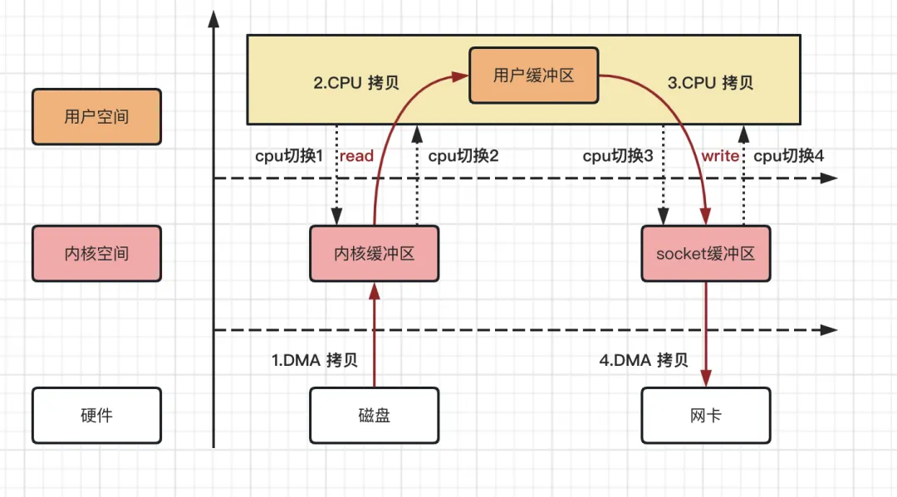
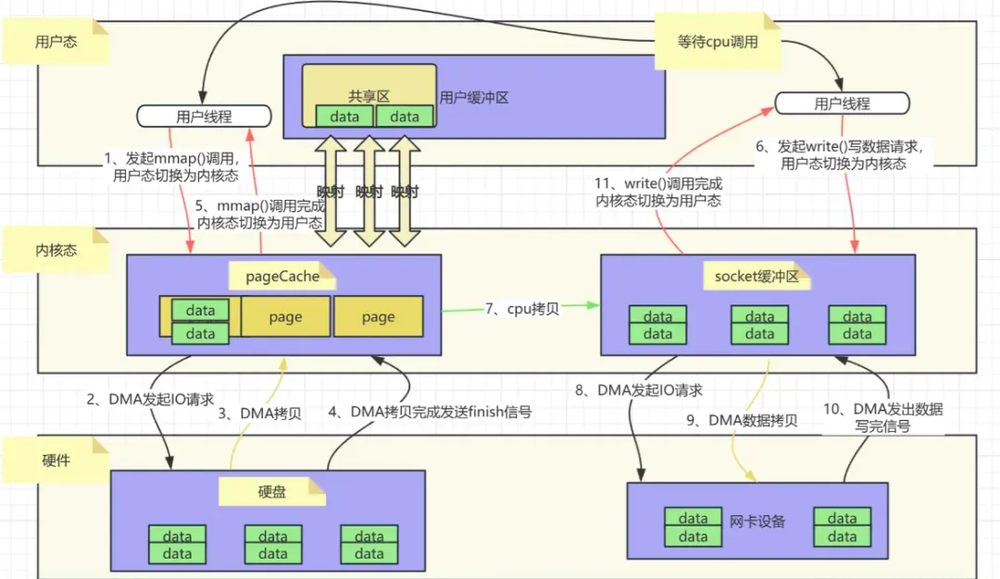
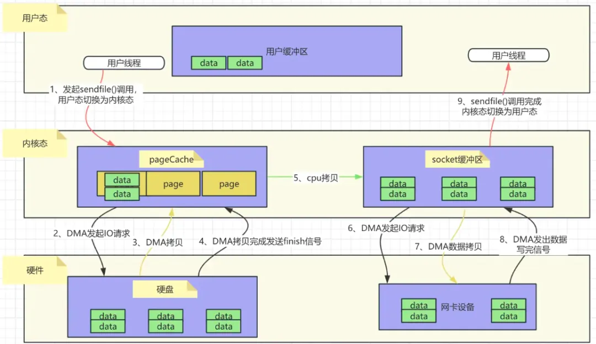
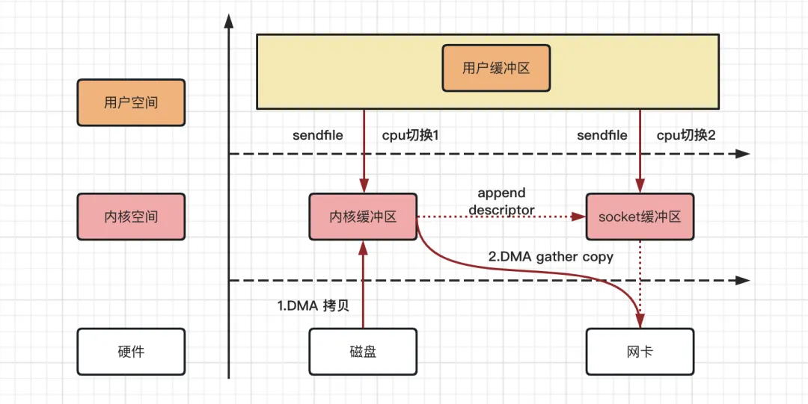
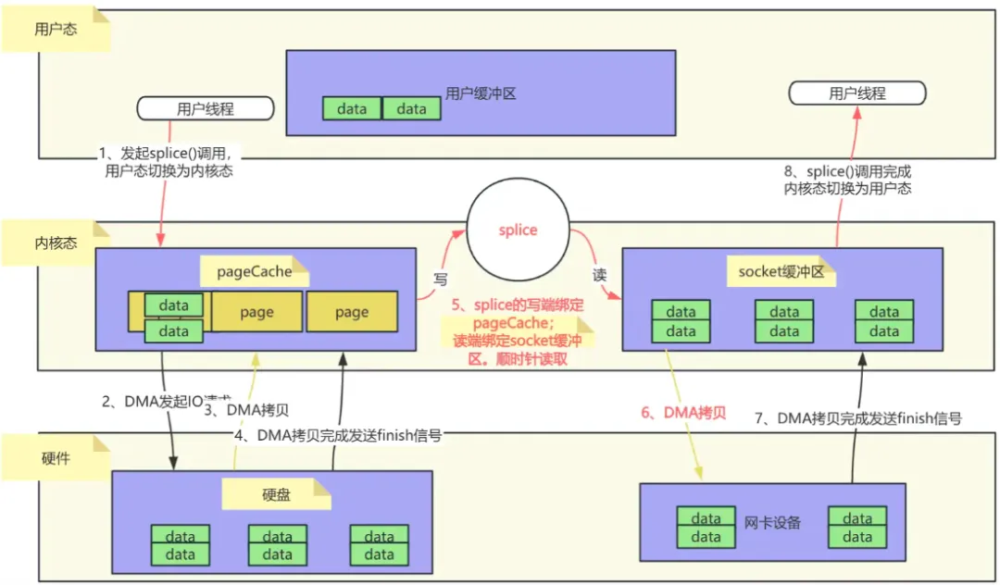
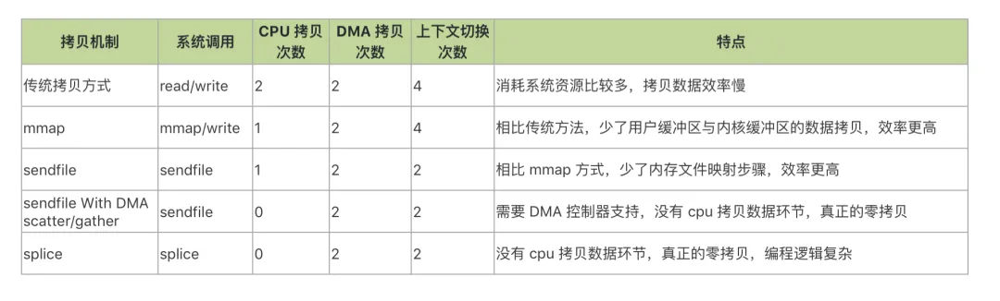

# 华为二面：什么是零拷贝技术？mmap和sendfile如何实现零拷贝，它们是否真正实现了零拷贝？

面试概览：

+ 说说看什么是零拷贝，它和传统的IO执行流程有什么差别？
+ mmap内存映射是如何实现零拷贝的？
+ 说说看sendfile系统调用是如何实现零拷贝的？
+ sendfile+DMA scatter/gather相比单纯的sendfile有何优势？
+ splice是否是真正实现了零拷贝，它的流程和原理是怎么样的？
+ 使用零拷贝有什么缺点或者注意点么？  

  

**面试官：说说看什么是零拷贝，它和传统的IO执行流程有什么差别？**

说到零拷贝，首先需要介绍一下传统的IO拷贝是怎么样执行的。以下是对该流程的详细阐述：

传统的IO拷贝执行流程主要涉及用户空间、内核空间以及硬件之间的数据交互。在这个过程中，数据通常需要从硬盘（或其他存储设备）读取到内核缓冲区，然后再复制到用户缓冲区，最后根据需要将数据发送到网络或其他外部设备。

具体步骤如下：

  

  

1. **用户进程发起读请求**：
    - 当用户进程需要读取文件时，它会通过系统调用（如`read()`）向操作系统发起读请求。
    - 此时，用户进程的上下文从用户态切换到内核态。
2. **DMA拷贝数据到内核缓冲区**：
    - 操作系统接收到读请求后，会利用DMA（Direct Memory Access，直接内存存取）控制器将数据从硬盘（或其他存储设备）拷贝到内核缓冲区。
    - 这个过程是由DMA控制器完成的，不需要CPU的参与，从而减轻了CPU的负担。
3. **CPU拷贝数据到用户缓冲区**：
    - 数据被DMA拷贝到内核缓冲区后，CPU会将数据从内核缓冲区拷贝到用户缓冲区。
    - 这个过程需要CPU的参与，因为它需要执行内存访问指令来完成数据的复制。
4. **用户进程处理数据**：
    - 数据被拷贝到用户缓冲区后，用户进程可以对其进行处理。
    - 此时，用户进程的上下文从内核态切换回用户态。
5. **用户进程发起写请求**（如果需要）：
    - 如果用户进程需要将数据写入到网络或其他外部设备，它会通过系统调用（如`write()`）向操作系统发起写请求。
    - 同样，用户进程的上下文会从用户态切换到内核态。
6. **CPU拷贝数据到socket缓冲区**：
    - 操作系统接收到写请求后，CPU会将数据从用户缓冲区拷贝到socket缓冲区（或其他设备缓冲区）。
    - 这个过程也需要CPU的参与。
7. **DMA拷贝数据到外部设备**：
    - 最后，DMA控制器会将数据从socket缓冲区拷贝到网卡（或其他外部设备），完成数据的发送。
    - 这个过程同样是由DMA控制器完成的，不需要CPU的参与。
8. **系统调用返回**：
    - 当数据成功发送后，系统调用会返回给用户进程，用户进程的上下文从内核态切换回用户态。

从上述过程可以看出总共经历了4 次拷贝次数、4 次上下文切换次数。

其中数据拷贝次数包括2 次 DMA 拷贝，2 次 CPU 拷贝；而CPU 切换次数包括4 次用户态和内核态的切换。

  

  

零拷贝（Zero-Copy）技术是一种高效的数据传输技术，旨在减少或消除数据在传输过程中的拷贝次数，从而提高数据传输效率和系统性能。

  

以下是关于零拷贝技术的详细解释：

### 一、定义与原理
零拷贝技术并非指完全没有数据拷贝的过程，而是减少用户态和内核态的切换次数以及CPU拷贝的次数。它通常通过直接内存访问（DMA）技术和内存映射（如mmap）等机制来实现。

1. **DMA技术**：DMA允许硬件设备（如网卡、硬盘控制器等）直接访问内存，而无需CPU的介入。在数据传输过程中，DMA控制器负责将数据从源地址传输到目标地址，从而减少了CPU的拷贝工作。
2. **内存映射**：内存映射技术将文件或设备的内容映射到进程的地址空间中，使得进程可以直接访问这些数据，而无需通过传统的读/写系统调用。这种方式减少了数据在用户空间和内核空间之间的拷贝次数。

###   

### 零拷贝技术广泛应用于网络传输、文件读写等场景，以提高数据传输效率和系统性能。  

  

### 二、实现方式
零拷贝技术的实现方式有多种，包括但不限于以下几种：

1. **sendfile系统调用**：sendfile系统调用允许在内核空间中直接传输数据，避免了数据在用户空间和内核空间之间的额外拷贝。
2. **mmap内存映射**：mmap函数通过内存映射将文件或设备的内容映射到进程的地址空间中，使得进程可以直接访问这些数据。这种方式减少了数据在用户空间和内核空间之间的拷贝次数，并提高了数据访问速度。
3. **splice系统调用**：splice系统调用用于在管道（pipe）或套接字（socket）之间高效地传输数据。它允许将一个文件描述符的数据直接传输到另一个文件描述符，而无需经过用户空间的拷贝。

  

### 三、优势与挑战
零拷贝技术的优势在于能够显著提高数据传输效率和系统性能，减少CPU和内存的开销。然而，它也面临一些挑战：由于零拷贝技术减少了数据在用户空间和内核空间之间的拷贝次数，因此可能会增加安全风险。例如，恶意程序可能会利用零拷贝技术绕过某些安全机制来访问敏感数据。因此，在实现零拷贝技术时需要加强安全措施。

  

  

**面试官：你刚刚提到了mmap内存映射，能说说它是如何实现零拷贝的吗？**

**  
**

mmap是Linux内核提供的一种内存映射文件的方式，它可以将一个进程的虚拟地址映射到磁盘文件地址，实现零拷贝。具体来说，mmap通过以下机制实现零拷贝：

  

### 一、mmap的基本原理
mmap技术利用了虚拟内存的特性，将内核中的读缓冲区与用户空间的缓冲区进行映射。这种映射关系建立后，进程可以直接通过访问虚拟内存地址来读写文件内容。

  

### 二、mmap实现零拷贝的过程
1. **映射建立**：
    - 用户进程通过mmap系统调用，请求将文件的某个部分或全部内容映射到进程的虚拟地址空间。
    - 内核响应这个请求，创建映射关系，并将文件的页缓存（page cache）与进程的虚拟内存地址进行绑定。
2. **数据访问**：
    - 当用户进程访问映射后的虚拟内存地址时，如果对应的内存页尚未加载到物理内存中，会触发缺页异常。
    - 内核处理缺页异常，将文件内容从磁盘加载到页缓存，并更新进程的页表，使页表指向页缓存中的相应页。
3. **数据读写**：
    - 用户进程对映射后的虚拟内存地址进行读写操作，这些操作实际上是对页缓存的读写。
    - 由于页缓存与文件内容保持同步，因此这些操作也会反映到文件上。
4. **减少拷贝次数**：
    - 在传统的文件读写操作中，数据需要从磁盘拷贝到页缓存，再从页缓存拷贝到用户空间缓冲区，最后从用户空间缓冲区拷贝到网络缓冲区或磁盘（如果是写操作）。
    - 而使用mmap后，数据只需要从磁盘拷贝到页缓存一次，用户进程可以直接通过映射后的虚拟内存地址访问数据，无需将数据从内核缓冲区拷贝到用户缓冲区这一步。
    -   

如下图所示，是一个用户程序通过mmap从磁盘读取数据并通过网络发送出去的过程。  

### 一共发生了2 次 DMA 拷贝，1 次 CPU 拷贝CPU 切换次数：4 次用户态和内核态的切换。相比于传统的IO流程少了1次CPU拷贝。
  

### 三、mmap零拷贝的优势与限制
**优势**：

+ 减少了数据拷贝次数和上下文切换次数，提高了IO操作的效率。
+ 对于大文件传输，mmap可以显著提高性能。
+ 提供进程间共享内存及互相通信的方式。不管是父子进程还是无亲缘关系进程，都可以将自身空间用户映射到同一个文件或者匿名映射到同一片区域。从而通过各自映射区域的改动，打到进程间通信和进程间共享的目的。

**限制**：

+ mmap需要占用进程的虚拟地址空间，对于小文件传输，可能会由于文件内容不满一个页而浪费进程的虚拟地址空间，也就是产生碎片空间的浪费。
+   

  

**面试官：请再****说说看sendfile系统调用是如何实现零拷贝的？**

  

sendfile系统调用可以在内核态中直接将文件内容发送到网络设备的缓冲区，避免了数据在用户态和内核态之间的拷贝。

  

其工作原理如下：

1. **文件描述符**：
    - sendfile系统调用需要两个文件描述符作为参数：输入文件描述符（in_fd）和输出文件描述符（out_fd）。输入文件描述符指向要发送的文件，输出文件描述符通常指向一个网络套接字。
2. **数据传输**：
    - 当调用sendfile时，内核会直接从输入文件描述符对应的文件缓冲区中读取数据，并将其发送到输出文件描述符对应的网络缓冲区中。这个过程是在内核态中完成的，无需将数据复制到用户空间。
3. **减少上下文切换和数据复制**：
    - 使用sendfile系统调用可以减少上下文切换和数据复制的次数。在传统的数据传输方式中，需要多次上下文切换和数据复制。而使用sendfile时，只需一次上下文切换（从用户态切换到内核态进行sendfile调用），并减少了数据在用户空间和内核空间之间的复制。

  

如下图所示，是一个用户程序通过sendfile从磁盘读取数据并通过网络发送出去的过程。

###   

### sendfile系统调用的实现细节
1. **DMA（Direct Memory Access）**：
    - 在sendfile系统调用的过程中，DMA技术被用来加速数据传输。DMA允许硬件设备（如磁盘和网络设备）直接访问内存，而无需CPU的介入。这进一步提高了数据传输的效率。
2. **管道和环形缓冲区**：
    - 在某些实现中，sendfile可能会使用管道和环形缓冲区来优化数据传输。例如，当需要将文件数据拷贝至socket缓冲区时，可以临时创建一个管道（环形缓冲区），将文件数据先拷贝至管道，再将管道数据迁移至socket缓冲区。这个过程并不是真正的数据拷贝，而是将指针指向内存地址。
3. **splice系统调用**：
    - 从Linux内核2.6.17版本开始，splice系统调用被用来在内部实现sendfile。splice可以将一个文件描述符的数据直接传输到另一个文件描述符，也可以将数据从一个文件描述符传输到网络设备的缓冲区。它支持零拷贝操作，并提供了更灵活的数据传输方式。

整个过程中只发生了2次上下文切换，1次cpu拷贝；相比mmap+write()又节省了2次上下文切换。同时内核缓冲区和用户缓冲区也无需建立内存映射，节省了内存上的占用开销。

  

**面试官：知道sendfile的gather操作吗，sendfile+DMA scatter/gather相比单纯的sendfile有何优势？**

  

以下是对这两种技术的详细比较：

1. **单纯的sendfile**
    - **拷贝过程**：sendfile系统调用在Linux内核中实现了将磁盘数据通过DMA拷贝到内核态Buffer后，再通过CPU拷贝（或少量参与）和DMA拷贝到网卡设备的过程。尽管sendfile已经减少了CPU的拷贝负担，但在数据从内核Buffer传输到socket Buffer的过程中，CPU仍然需要参与一定的拷贝或调度工作。
    - **拷贝次数**：通常包括2次DMA拷贝和1次CPU拷贝（尽管在某些实现中CPU拷贝可能被优化至最低程度），以及必要的上下文切换。
2. **sendfile+DMA scatter/gather**
    - **拷贝过程**：在Linux 2.4内核版本中引入的SG-DMA技术，对DMA拷贝加入了scatter/gather操作。这意味着DMA控制器可以直接从内核空间缓冲区中读取数据并传输到网卡，无需CPU的进一步拷贝。
    - **拷贝次数**：实现了真正的零拷贝，即全程没有CPU参与数据拷贝。数据拷贝完全由DMA控制器完成，包括2次DMA拷贝和0次CPU拷贝。

  

  

**面试官：gather实现了真正的零拷贝，那你知道splice吗？splice是否是真正实现了零拷贝，它的流程和原理是怎么样的？**

  

splice确实实现了真正的零拷贝，下面是splice的原理：

  

### splice的流程
splice的工作流程大致如下：

1. **准备阶段**：
    - 在使用splice之前，通常需要创建一个管道（pipe）作为数据的中转站。这个管道并不会真正存储数据，而是作为一个通道来传递数据指针或元数据。
2. **数据拷贝阶段**：
    - 使用splice系统调用，将源文件（如磁盘文件）的数据直接“拷贝”到管道的写端。这里的“拷贝”实际上是将文件的页缓存（Page Cache）与管道的环形缓冲区（Ring Buffer）进行绑定。
    - 接着，再次使用splice系统调用，将管道读端的数据“拷贝”到目标文件（如网络套接字）中，这一步CPU并没有参与数据拷贝，因为它只是将管道的环形缓冲区与目标文件的缓冲区进行绑定，并传递数据指针。
3. **数据传输完成**：
    - 通过上述两次splice操作，数据就完成了从源文件到目标文件的传输，而无需经过用户态的拷贝。这大大提高了数据传输的效率。

  

这个过程中全程没有CPU参与数据拷贝。数据拷贝完全由DMA控制器完成，包括2次DMA拷贝和0次CPU拷贝。

  

  

**面试官：****使用零拷贝有什么缺点或者注意点么？**  

  

使用零拷贝技术时，需要注意以下几个关键问题：

### 一、硬件与操作系统支持
1. **硬件支持**：
    - 零拷贝技术，特别是与DMA scatter/gather相关的功能，通常需要特定的硬件支持。例如，网卡需要支持SG-DMA技术，才能通过传递文件描述符的方式避免内核空间内的一次CPU拷贝。
    - 在选择和使用零拷贝技术时，应确保系统硬件满足相关要求，以充分发挥技术的优势。
2. **操作系统支持**：
    - 零拷贝技术的实现依赖于操作系统的内核功能。例如，Linux内核提供了sendfile系统调用和DMA scatter/gather功能，而Windows系统可能提供类似但不同的机制。
    - 在使用零拷贝技术时，应确保操作系统版本和配置支持所需的功能。

### 二、数据完整性和安全性
1. **数据完整性**：
    - 零拷贝技术减少了数据在内存之间的拷贝次数，但也可能增加了数据被篡改或损坏的风险。例如，如果数据在传输过程中被意外修改，可能会导致数据不一致或损坏。
    - 在使用零拷贝技术时，应采取适当的措施来确保数据的完整性，如使用校验和、加密等技术。
2. **安全性**：
    - 零拷贝技术可能会涉及用户空间和内核空间之间的数据交互，这可能会增加系统被攻击的风险。例如，恶意软件可能会利用零拷贝技术中的漏洞来攻击系统。
    - 在使用零拷贝技术时，应确保系统安全性得到充分的保障，如加强权限管理、使用安全协议等技术。

### 三、性能优化与资源利用
1. **性能优化**：
    - 零拷贝技术旨在提高数据传输效率，但并非所有情况下都能达到最佳性能。例如，在某些情况下，由于系统资源限制或配置不当，零拷贝技术可能无法充分发挥其优势。
    - 在使用零拷贝技术时，应根据具体应用场景和系统环境进行性能优化，如调整系统参数、优化代码逻辑等。
2. **资源利用**：
    - 零拷贝技术减少了CPU和内存的开销，提高了系统资源利用率。然而，在某些情况下，如果系统资源不足或配置不当，可能会导致性能下降或资源竞争。
    - 在使用零拷贝技术时，应确保系统资源得到合理的分配和利用，以避免资源竞争和性能瓶颈。

### 四、代码复杂性与可维护性
1. **代码复杂性**：
    - 零拷贝技术的实现通常涉及复杂的系统调用和底层硬件操作，这可能会增加代码的复杂性和开发难度。
    - 在使用零拷贝技术时，应确保开发人员具备足够的技术能力和经验，以应对潜在的代码复杂性和开发挑战。
2. **可维护性**：
    - 零拷贝技术的实现可能会涉及多个系统组件和模块之间的交互，这可能会增加系统的复杂性和维护难度。
    - 在使用零拷贝技术时，应确保系统具有良好的可维护性，如采用模块化设计、提供清晰的文档和注释等技术手段。

> 更新: 2025-02-11 14:24:08  
> 原文: <https://www.yuque.com/u12222632/as5rgl/gpsr6nb9bwlnci9q>