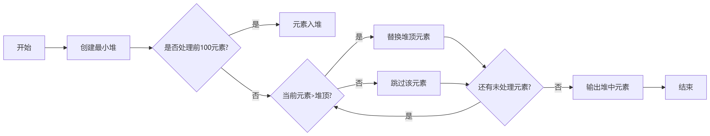
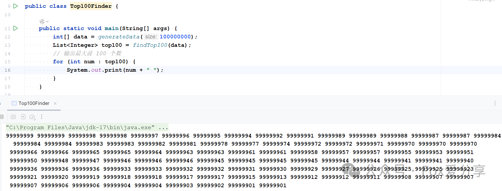

# 大厂高频TopK面试题：如何快速从1 亿个数据中取出最大的前 100 个？

**面试场景再现**

面试官：“**说说看，从1亿个整数中快速找出去最大的前100个，怎么搞？**”

<font style="color:rgba(0, 0, 0, 0.9);">我（故作淡定）："这个量级，堆排序最合适不过了！"</font>

<font style="color:rgba(0, 0, 0, 0.9);">面试官："展开说说？" </font>

**错误示范：**

+ "先全<font style="color:rgba(0, 0, 0, 0.9);">部排序再取前100个..." </font><font style="color:rgba(0, 0, 0, 0.9);">❌</font><font style="color:rgba(0, 0, 0, 0.9);">（面试官摇头）  </font>
+ <font style="color:rgba(0, 0, 0, 0.9);">"用冒泡排</font>序100次..." ❌（面试官扶额）

**正确姿势：**

"用最小堆！能在O(N logK)时间复杂度内解决TopK问题，其中K=100，N=1亿" 💡（面试官眼睛亮了）


**一、堆排序法（最优解） **

要从1亿个数据中找出最大的前100个，通常可以使用堆（Heap）数据结构来实现，特别是最小堆（Min Heap）。

**实现步骤：**

1. 创建一个最小堆，并将前100个数据插入堆中。
2. 遍历剩余的数据，对于每个数据，如果它比堆顶的元素大，就将堆顶元素弹出，然后将当前数据插入堆中。
3. 继续遍历所有数据，不断地维护堆，确保堆中保留的是最大的100个数据。
4. 当遍历完成后，堆中的元素就是前100个最大的数据。



在Java中，你可以使用PriorityQueue（优先队列）来实现最小堆，PriorityQueue默认是最小堆，因此可以很方便地解决这个问题。以下是一个示例代码：

```plain
public class Top100Finder {

    public static void main(String[] args) {
        int[] data = generateData(100000000);
        List<Integer> top100 = findTop100(data);
        // 输出最大前 100 个数
        for (int num : top100) {
            System.out.print(num + " ");
        }
    }

    public static List<Integer> findTop100(int[] nums) {
        PriorityQueue<Integer> minHeap = new PriorityQueue<>();
        // 1. 填充初始堆
        for (int i = 0; i < 100; i++) {
            minHeap.offer(nums[i]);
        }
        // 2. 动态淘汰最小值
        for (int i = 100; i < nums.length; i++) {
            if (nums[i] > minHeap.peek()) {
                minHeap.poll();
                minHeap.offer(nums[i]);
            }
        }
        // 3. 转换为有序列表
        return new ArrayList<>(minHeap)
                .stream()
                .sorted(Comparator.reverseOrder())
                .collect(Collectors.toList());
    }

    public static int[] generateData(int size) {
        int[] data = new int[size];
        for (int i = 0; i < size; i++) {
            data[i] = (int) (Math.random() * 100000000);
        }
        return data;
    }

}
```




**性能对比**


**灵魂拷问**

<font style="color:rgba(0, 0, 0, 0.87);">❓</font><font style="color:rgba(0, 0, 0, 0.87);"> </font>**<font style="color:rgba(0, 0, 0, 0.87);">面试官追问1</font>**<font style="color:rgba(0, 0, 0, 0.87);">："如果数据无法全加载到内存怎么办？"</font>  
<font style="color:rgba(0, 0, 0, 0.87);">💡</font><font style="color:rgba(0, 0, 0, 0.87);"> 加分回答：</font>  
<font style="color:rgba(0, 0, 0, 0.87);">"用分治！把1亿数据切分成100个文件，每个文件找Top100，最后合并结果再筛选。</font>

<font style="color:rgba(0, 0, 0, 0.87);">❓</font><font style="color:rgba(0, 0, 0, 0.87);"> </font>**<font style="color:rgba(0, 0, 0, 0.87);">面试官追问2</font>**<font style="color:rgba(0, 0, 0, 0.87);">："为什么不用最大堆？"  
</font><font style="color:rgba(0, 0, 0, 0.87);">💡</font><font style="color:rgba(0, 0, 0, 0.87);"> 陷阱预警：  
</font><font style="color:rgba(0, 0, 0, 0.87);">"最大堆需要维护1亿个元素，内存直接OOM！而最小堆只要100个就能守住Top100的门槛"</font>

<font style="color:rgba(0, 0, 0, 0.87);"></font>

**<font style="color:rgba(0, 0, 0, 0.87);">你在面试中还遇到过哪些TopK变形题？</font>**<font style="color:rgba(0, 0, 0, 0.87);">欢迎在评论区讨论！</font>

<font style="color:rgba(0, 0, 0, 0.87);"></font>

**<font style="color:rgb(0, 0, 0);">如果觉得这篇文章对你有所帮助，欢迎点个 </font>****“在看”****<font style="color:rgba(6, 8, 31, 0.88);"> 或分享给更多的小伙伴！</font>**

**<font style="color:rgba(6, 8, 31, 0.88);">更多技术干货，欢迎</font>****<font style="color:rgb(64, 64, 64);">关注公众号「Fox爱分享」</font>****<font style="color:rgb(64, 64, 64);">，解锁更多精彩内容！</font>**


<font style="color:rgb(64, 64, 64);">▲ 扫码关注，解锁100万字金三银四面试秘籍</font>

<font style="color:rgba(0, 0, 0, 0.87);"></font>


> 更新: 2025-02-26 22:25:41  
> 原文: <https://www.yuque.com/u12222632/as5rgl/yvmipafncsog882y>