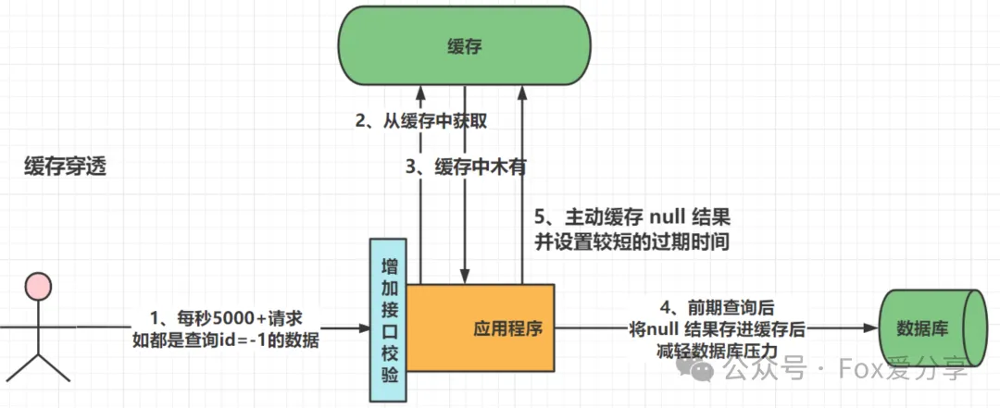
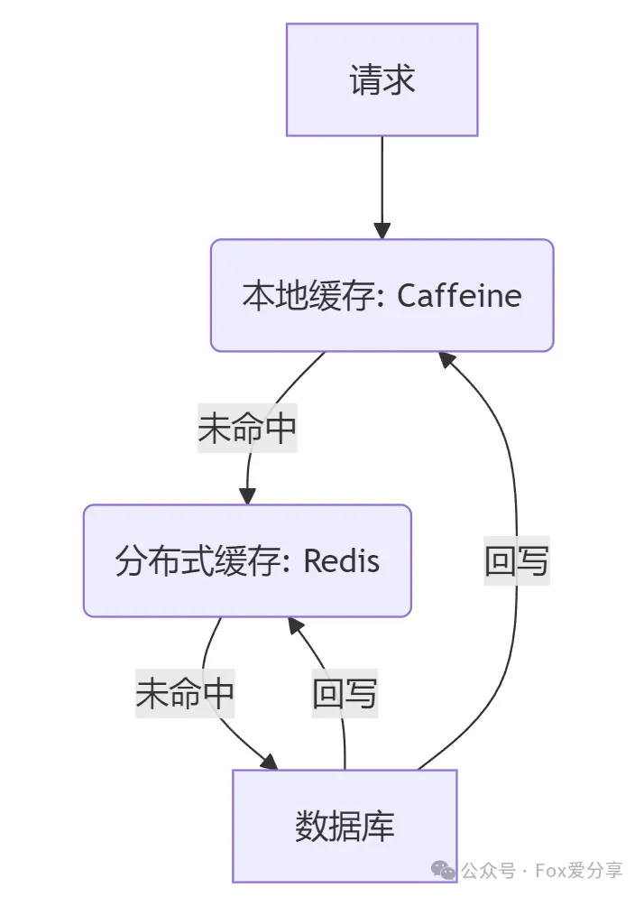
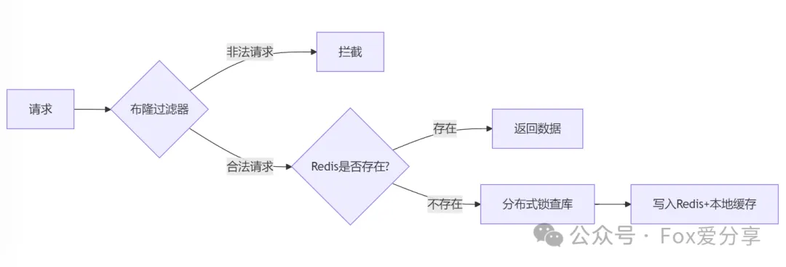

# 大厂高频面试题：Redis三大缓存问题（缓存穿透、雪崩、击穿）的原因及解决方案详解，面试必问，建议收藏


### **<font style="color:rgb(64, 64, 64);">一、缓存穿透：“查无此物”的攻击</font>**
### 缓存穿透是指客户端请求的数据在缓存中和数据库中都不存在，这样缓存永远不会生效，这些请求都会打到数据库。
### 
#### **<font style="color:rgb(64, 64, 64);">1.1 原因分析</font>**
+ **<font style="color:rgb(64, 64, 64);">恶意请求</font>**<font style="color:rgb(64, 64, 64);">：黑客暴力扫描不存在的ID（如-1、0等非法值）</font>
+ **<font style="color:rgb(64, 64, 64);">逻辑缺陷</font>**<font style="color:rgb(64, 64, 64);">：业务未校验参数有效性，直接透传至数据库</font>


#### **<font style="color:rgb(64, 64, 64);">1.2 解决方案</font>**
**<font style="color:rgb(64, 64, 64);">方案一：布隆过滤器（Bloom Filter）</font>**

**<font style="color:rgb(51, 51, 51);">原理</font>**<font style="color:rgb(51, 51, 51);">：预加载所有可能存在的数据哈希值到布隆过滤器中，查询时先判断数据是否存在。</font>

**<font style="color:rgb(64, 64, 64);">代码示例</font>**

```plain
// 使用Guava实现布隆过滤器
BloomFilter<Long> bloomFilter = BloomFilter.create(
    Funnels.longFunnel(), 
    1000000, // 预期元素量
    0.01     // 误判率
);

// 预热数据
for (long id : validIds) {
    bloomFilter.put(id);
}

// 查询拦截
public String getProduct(Long id) {
    if (!bloomFilter.mightContain(id)) {
        return "非法ID"; 
    }
    // 继续查询流程...
}
```

**<font style="color:rgb(64, 64, 64);">✅</font>****<font style="color:rgb(64, 64, 64);"> 优点</font>****<font style="color:rgb(64, 64, 64);">：内存占用少（1百万数据仅需1MB）</font>****<font style="color:rgb(64, 64, 64);">  
</font>****<font style="color:rgb(64, 64, 64);">❌</font>****<font style="color:rgb(64, 64, 64);"> 缺点</font>****<font style="color:rgb(64, 64, 64);">：存在误判率（可配置）</font>**

**<font style="color:rgb(64, 64, 64);"></font>**

**<font style="color:rgb(64, 64, 64);">方案二：空值缓存</font>**

**<font style="color:rgb(51, 51, 51);">原理</font>**<font style="color:rgb(51, 51, 51);">：将查询结果为空的键也存入缓存，设置较短过期时间（如5分钟）。</font>

**<font style="color:rgb(64, 64, 64);">代码示例</font>**

```java
public String getProduct(Long id) {
    String key = "product:" + id;
    String value = redis.get(key);
    if ("NULL".equals(value)) {
        return "商品不存在"; // 命中空缓存
    }
    if (value == null) {
        value = db.query(id);
        if (value == null) {
            redis.setex(key, 300, "NULL"); // 空值缓存5分钟
        } else {
            redis.setex(key, 3600, value);
        }
    }
    return value;
}
```

**<font style="color:rgb(64, 64, 64);">✅</font>****<font style="color:rgb(64, 64, 64);"> 优点</font>**<font style="color:rgb(64, 64, 64);">：实现简单</font><font style="color:rgb(51, 51, 51);">  
</font>**<font style="color:rgb(64, 64, 64);">❌</font>****<font style="color:rgb(64, 64, 64);"> 缺点</font>**<font style="color:rgb(64, 64, 64);">：可能缓存大量无效Key</font>

#### **<font style="color:rgb(64, 64, 64);">1.3 适用场景</font>**
+ <font style="color:rgb(64, 64, 64);">电商商品ID扫描攻击</font>
+ <font style="color:rgb(64, 64, 64);">社交平台查询已注销用户</font>

<font style="color:rgb(64, 64, 64);">  
</font>

### **<font style="color:rgb(64, 64, 64);">二、缓存雪崩：“集体罢工”的灾难</font>**
#### **<font style="color:rgb(64, 64, 64);">2.1 原因分析</font>**
+ **<font style="color:rgb(64, 64, 64);">批量过期</font>**<font style="color:rgb(64, 64, 64);">：大量Key设置相同TTL，同时失效</font>
+ **<font style="color:rgb(64, 64, 64);">Redis宕机</font>**<font style="color:rgb(64, 64, 64);">：集群故障导致所有请求压到数据库</font>

#### **<font style="color:rgb(64, 64, 64);">2.2 解决方案</font>**
**<font style="color:rgb(64, 64, 64);">方案一：随机过期时间</font>**

```java
public void setProductCache(Long id, Product product) {
    int baseTTL = 3600; // 基础1小时
    int randomTTL = baseTTL + new Random().nextInt(600); // 增加0-10分钟随机值
    redis.setex("product:" + id, randomTTL, product.toString());
}
```

**<font style="color:rgb(64, 64, 64);">✅</font>****<font style="color:rgb(64, 64, 64);"> 优点</font>**<font style="color:rgb(64, 64, 64);">：分散压力</font><font style="color:rgb(64, 64, 64);">  
</font>**<font style="color:rgb(64, 64, 64);">❌</font>****<font style="color:rgb(64, 64, 64);"> 缺点</font>**<font style="color:rgb(64, 64, 64);">：无法应对Redis宕机</font>

**<font style="color:rgb(64, 64, 64);"></font>**

**<font style="color:rgb(64, 64, 64);">方案二：多级缓存架构</font>**



#### **<font style="color:rgb(64, 64, 64);">2.3 适用场景</font>**
+ <font style="color:rgb(64, 64, 64);">双11整点秒杀</font>
+ <font style="color:rgb(64, 64, 64);">新闻APP热点事件推送</font>

<font style="color:rgb(64, 64, 64);"></font>

### **<font style="color:rgb(64, 64, 64);">三、缓存击穿：</font>****<font style="color:rgb(64, 64, 64);">“顶流明星”的暴击</font>**
#### **<font style="color:rgb(64, 64, 64);">3.1 原因分析</font>**
+ **<font style="color:rgb(64, 64, 64);">热点Key失效</font>**<font style="color:rgb(64, 64, 64);">：高并发访问的Key突然过期</font>
+ **<font style="color:rgb(64, 64, 64);">无保护机制</font>**<font style="color:rgb(64, 64, 64);">：所有请求直接穿透到数据库</font><font style="color:rgb(51, 51, 51);">  
</font>

#### **<font style="color:rgb(64, 64, 64);">3.2 解决方案</font>**
**<font style="color:rgb(64, 64, 64);">方案一：分布式锁（Redisson实现）</font>**

**<font style="color:rgb(51, 51, 51);">原理</font>**<font style="color:rgb(51, 51, 51);">：当缓存失效时，通过分布式锁控制仅一个线程重建缓存。</font>

**<font style="color:rgb(51, 51, 51);">代码示例</font>**<font style="color:rgb(51, 51, 51);">：</font>

```java
public String getHotNews(String newsId) {
String key = "news:" + newsId;
String value = redis.get(key);
if (value == null) {
    RLock lock = redisson.getLock(key + ":lock");
    try {
        if (lock.tryLock(3, 30, TimeUnit.SECONDS)) {
            // 双重检查
            value = redis.get(key);
            if (value == null) {
                value = db.query(newsId);
                redis.setex(key, 600, value);
            }
        }
    } finally {
        lock.unlock();
    }
}
return value;
}
```

**<font style="color:rgb(64, 64, 64);">✅</font>****<font style="color:rgb(64, 64, 64);"> 优点</font>**<font style="color:rgb(64, 64, 64);">：强一致性</font><font style="color:rgb(64, 64, 64);">  
</font>**<font style="color:rgb(64, 64, 64);">❌</font>****<font style="color:rgb(64, 64, 64);"> 缺点</font>**<font style="color:rgb(64, 64, 64);">：性能损耗约10%</font>

**<font style="color:rgb(64, 64, 64);">  
</font>**

**<font style="color:rgb(64, 64, 64);">方案二：逻辑过期时间</font>**

**<font style="color:rgb(51, 51, 51);">原理</font>**<font style="color:rgb(51, 51, 51);">：缓存永不过期，但存储数据时附加逻辑过期时间。</font>

**<font style="color:rgb(51, 51, 51);">示例代码</font>**

```java
// 缓存数据包装类
@Data
public class CacheWrapper {
    private String data;
    private Long expireTime; // 逻辑过期时间
}

public String getHotNews(String newsId) {
CacheWrapper wrapper = redis.get(newsId);
if (wrapper == null) {
    return loadAndCache(newsId);
}
if (wrapper.getExpireTime() < System.currentTimeMillis()) {
    // 异步更新
    threadPool.submit(() -> loadAndCache(newsId));
}
return wrapper.getData();
}
```

**<font style="color:rgb(64, 64, 64);">✅</font>****<font style="color:rgb(64, 64, 64);"> 优点</font>**<font style="color:rgb(64, 64, 64);">：零等待时间  
</font>**<font style="color:rgb(64, 64, 64);">❌</font>****<font style="color:rgb(64, 64, 64);"> 缺点</font>**<font style="color:rgb(64, 64, 64);">：数据短暂不一致</font>

#### **<font style="color:rgb(64, 64, 64);">3.3 适用场景</font>**
+ <font style="color:rgb(64, 64, 64);">微博顶流明星发帖</font>
+ <font style="color:rgb(64, 64, 64);">小米手机秒杀活动</font>

### **<font style="color:rgb(64, 64, 64);">四、总结对比表</font>**
| **问题类型** | **触发条件** | **核心方案** | **性能影响** | **适用场景** |
| --- | --- | --- | --- | --- |
| <font style="color:rgb(64, 64, 64);">穿透</font> | <font style="color:rgb(64, 64, 64);">查询不存在数据</font> | <font style="color:rgb(64, 64, 64);">布隆过滤器</font> | <font style="color:rgb(64, 64, 64);">低</font> | <font style="color:rgb(64, 64, 64);">防恶意攻击</font> |
| <font style="color:rgb(64, 64, 64);">雪崩</font> | <font style="color:rgb(64, 64, 64);">批量Key失效/Redis宕机</font> | <font style="color:rgb(64, 64, 64);">随机TTL+多级缓存</font> | <font style="color:rgb(64, 64, 64);">中</font> | <font style="color:rgb(64, 64, 64);">大促活动</font> |
| <font style="color:rgb(64, 64, 64);">击穿</font> | <font style="color:rgb(64, 64, 64);">单个热点Key失效</font> | <font style="color:rgb(64, 64, 64);">分布式锁+逻辑过期</font> | <font style="color:rgb(64, 64, 64);">高</font> | <font style="color:rgb(64, 64, 64);">秒杀/顶流事件</font> |


**<font style="color:rgb(64, 64, 64);">综合应用</font>**



<font style="color:rgb(64, 64, 64);">你在项目中遇到过最棘手的缓存问题是什么？如何解决的？</font>

**<font style="color:rgb(0, 0, 0);">如果觉得这篇文章对你有所帮助</font>****<font style="color:rgb(0, 0, 0);">，欢迎点个 </font>****“在看”****<font style="color:rgba(6, 8, 31, 0.88);"> 或分享给更多的小伙伴！</font>**

**<font style="color:rgba(6, 8, 31, 0.88);">欢迎</font>****<font style="color:rgb(64, 64, 64);">关注公众号</font>****<font style="color:rgb(64, 64, 64);">「Fox爱分享」</font>****<font style="color:rgb(64, 64, 64);">，解锁更多精彩内容！</font>**


> 更新: 2025-04-22 12:07:35  
> 原文: <https://www.yuque.com/u12222632/as5rgl/gfwike93mm3kxgo0>