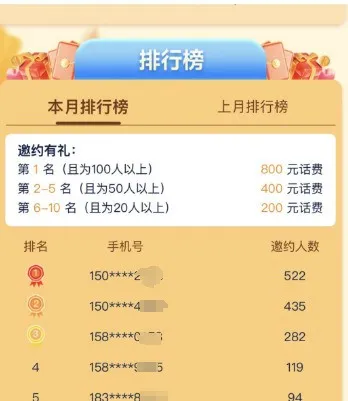
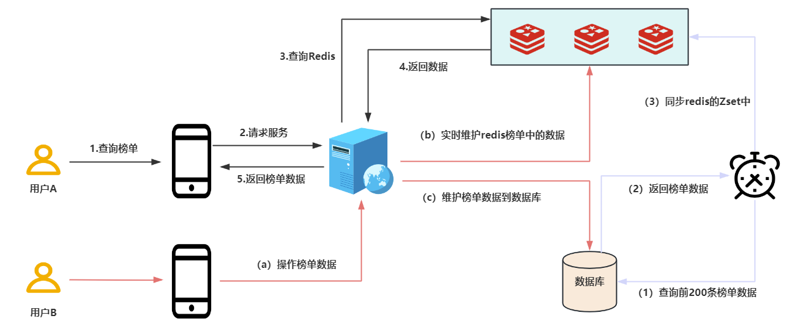
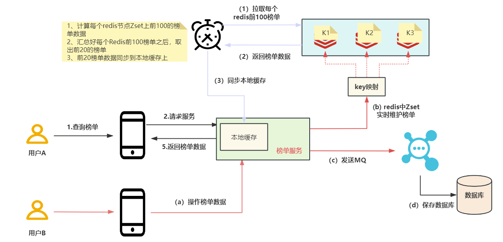
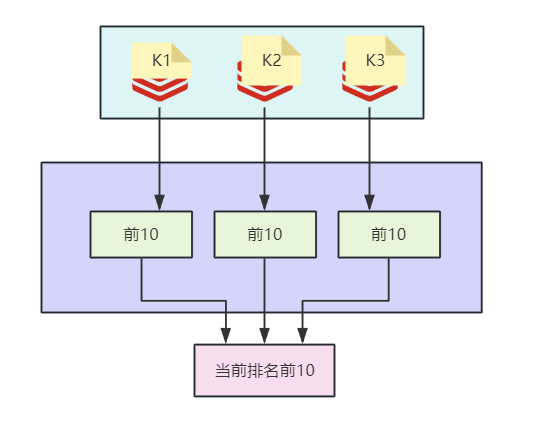

# 如何在高并发下使用Redis实现排行榜的功能

在我们日常的生活中排行榜是常见的功能，如游戏的排行榜，销售额的排行榜等等，排行榜不仅可以让用户有更多的激情参与到活动中来，而且可以更好的留存住用户，如下所示的拉新排行榜：

排行榜是一个常见的业务需求，下面我们就来聊聊如何通过Redis来设计一套支持高并发的排行榜的功能。  

**1、支持高并发的Zset实现榜单方案**  

假设业务需要展示排名前10名的用户在榜单上，假如在每一小时内前10名必然是在前200名之中产生，我们使用Redis的Zset数据结构来设计的方案如下所示：  

（1）定时任务定期（如60分钟执行一次）从数据库中同步排名前200名用户到Redis的Zset中。

（2）Redis实时维护前200名用户数据，当榜单数据发生变化的时候，我们同步数据到Redis上和数据库中，但是数据库中数据的变化不会在下一次定时任务执行之前影响到当前的榜单数据。

（3）定时任务下一个周期到了之后，就重新同步数据库中最新的前200名排名数据到Redis上。  

本方案将排名靠前的数据（前200名）放到Redis中，这样避免在Redis的Zset中实时维护全量数据的问题，同时定时任务更新数据到Redis上的周期是可以根据业务需要来变更的。  

针对突发的热点数据，当前的榜单设计就难以及时反映出来，需要等到下一个定时任务的周期才能同步到Redis上，当然本方案也是适应的，因为高并发下市面上的排行榜一般都是近实时的。

**2、支持超高并发的榜单设计方案**

在超大数据量、超高并发下，以至于超过了Redis单一节点的上限（单个Redis的写入瓶颈在2w左右，读瓶颈在10w左右），如果使用一个Zset来维护榜单数据的时候Redis是支撑不住的，即使Redis集群部署也是没有意义的，因为一个Zset就是一个key，一个key只会落在集群的一个Redis节点上，针对这样的场景，可以考虑采用分key的方案来实现榜单功能，如下图所示：

（1）将Zset上原先的一个key拆分成多个小key，然后通过这些小key来存储所有的榜单数据。拆分key的方案之前老师也分享过，有兴趣的小伙伴可以看一下：redis集群如何扛住百万级热点key的访问

（2）实时维护Zset上的榜单数据变化

（3）定时任务定期从各Zset节点上各取前10名的数据，然后将各个节点报送过来的前10名汇总在一起后取出全局的前10名数据，最后同步到服务器的本地缓存上。

在超高并发、大数据量下通过分key的方案可以有效的解决单key无法支撑的问题，这就是一种分而治之的思想。

设计本地缓存是因为在超高并发下保护Redis节点的一种做法，所有的请求都会打到本地的缓存上，Redis通过定时任务将最新的数据定期同步到本地的缓存上。  

总结：

（1）高并发下排行榜的功能我们可以通过定时任务+Redis的方式来实现

（2）针对超高并发、大数量的的业务场景，我们采用Redis分key+本地缓存的方案来实现。

> 更新: 2025-01-18 23:32:22  
> 原文: <https://www.yuque.com/u12222632/as5rgl/yy376zvp5rel6wey>