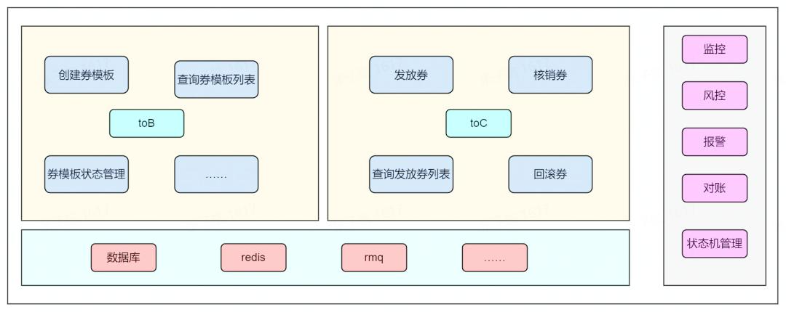

# 如何设计一个10w QPS高并发的抢券系统？从限流、防刷、幂等性三大维度拆解

在电商大促、直播秒杀等场景中，抢券系统往往需要承受十万级甚至百万级的并发请求。这类系统的核心挑战在于：如何在高并发下保证系统稳定、防止恶意刷券，同时确保数据一致性。本文将从限流设计、防刷策略、幂等性保障三个核心维度，拆解千万级流量下的抢券系统设计方案，并结合具体技术选型分析实现细节。

# 一、限流设计：从入口到核心链路的流量管控
## 1. 多级限流策略：分层过滤无效流量
### （1）网关层限流：全局流量拦截
+ 技术方案：使用 Nginx+Lua 实现基于 IP 的访问频率限制，通过limit_req_zone模块实现固定窗口限流（如每分钟单 IP 访问不超过 200 次）。
+ 选型依据：Nginx 作为流量入口，具备高性能网络 IO 处理能力，Lua 脚本可直接操作共享内存（shm_zone），实现毫秒级响应的限流逻辑，适合拦截恶意高频请求。

### （2）应用层限流：核心接口精准控制
+ 算法对比与选型：
    - 令牌桶算法（推荐）：使用 Guava RateLimiter 或 Redis 分布式令牌桶，允许突发流量（如用户集中点击时的瞬时峰值）。例如，设置每秒生成 10 万个令牌，每个请求消耗 1 个令牌，突发时可消耗桶内累积令牌（适合抢券场景的流量突刺特性）。
    - 漏桶算法：通过队列平滑请求速率，适合对流量稳定性要求高的场景（如支付接口），但不适合抢券这种短时间高并发场景。
+ 分布式实现：对于分布式部署的应用，可使用 Redis 的INCRBY原子操作实现分布式计数器，记录接口访问次数，结合EXPIRE设置滑动窗口（如每秒统计请求数）。

### （3）资源层限流：保护下游服务
+ 对库存查询、扣减等核心接口，使用 Sentinel 或 Hystrix 实现熔断降级，设置线程池隔离（如每个接口独立分配 200 个线程），防止某接口过载拖垮整个系统。

## 2. 库存扣减的分布式锁优化
+ Redis 分布式锁 vs 数据库行锁：
    - 对于秒杀场景，优先使用 Redis Redisson 实现可重入锁（基于SETNX+PX原子指令），锁超时时间需大于库存扣减逻辑执行时间（如 100ms），避免出现 "超卖" 漏洞。
    - 数据库行锁（如 MySQL 的SELECT ... FOR UPDATE）适用于库存精度要求极高的场景，但性能较低（单节点 QPS 约 5000），需配合分片库存（如按券 ID 哈希分库）提升并发能力。

# 二、防刷策略：从规则引擎到智能识别的立体防护
## 1. 基础防刷：规则化流量清洗
+ IP 限流：通过 Redis 记录每个 IP 的请求次数，设置滑动窗口（如 5 分钟内同一 IP 请求超过 50 次则触发熔断），使用ZSET数据结构存储时间戳，定期清理过期数据。
+ 设备指纹：客户端生成唯一设备 ID（结合 UUID、MAC 地址、IMEI 等），调用 Redis 判断该设备是否在短时间内多次请求（如 1 分钟内超过 10 次），防止同一设备多账号刷券。
+ 验证码机制：对触发阈值的请求（如 IP 请求次数超过 30 次 / 分钟），返回图形验证码或行为验证码（如滑动拼图），通过阿里云验证码、极验等第三方服务提升破解难度。

## 2. 进阶防刷：行为分析与机器学习
+ 实时行为建模：使用 Flink 或 Spark Streaming 实时分析用户行为特征，如请求间隔分布、地理位置突变（同一账号 1 分钟内出现在北京和上海）、高频点击（每秒点击超过 5 次）等异常行为，动态调整限流阈值。
+ 黑名单系统：将被识别为机器刷票的 IP、设备 ID、用户 ID 存入 Redis 黑名单，后续请求直接返回失败，黑名单数据定期同步到 MySQL 长期存储。

### 3. 数据层防刷：库存预热与熔断保护
+ 预扣库存：将优惠券库存按比例拆分（如 10 万张券拆分为 1000 个库存单元，每个单元 100 张），用户抢到券时先预扣单元库存，减少锁竞争；
+ 熔断降级：当库存低于 10% 时，自动切换为 "排队模式"，通过 Kafka 消息队列缓冲请求，前端显示 "排队中"，避免瞬时流量击垮系统。

# 三、幂等性设计：确保操作唯一性与一致性
## 1. 唯一标识生成：请求去重的核心
+ 业务唯一键：生成全局唯一的请求 ID（如 UUID + 时间戳），用户每次请求携带该 ID，服务端通过 RedisSETNX request_id 1 EX 60判断是否重复提交，确保同一请求仅处理一次。
+ 数据库唯一索引：在订单表中设置(user_id, coupon_id)唯一索引，防止同一用户重复领取同一张券；库存扣减表使用(coupon_id, transaction_id)唯一索引，避免重复扣减。

## 2. 接口设计：幂等性实现的关键
+ HTTP 方法选择：使用POST方法时，通过请求体中的唯一 ID 实现幂等；对于查询类接口，使用GET方法天然支持幂等。
+ 状态机设计：定义清晰的业务状态流转（如 "未领取→已领取→已使用→已过期"），每次操作前校验状态（如 "已领取" 状态不可重复领取），通过数据库事务保证状态一致性。

## 3. 重试机制：容错与幂等的配合
+ 客户端重试时携带相同请求 ID，服务端通过 Redis 或数据库唯一键判断是否已处理，避免重试导致重复操作；
+ 对于异步任务（如发券通知），使用消息队列的 ack 机制和消费者幂等处理（如根据消息 ID 去重），确保消息不重复消费。

# 四、技术选型与架构优化
## 1. 分层缓存设计：提升响应效率
+ 本地缓存：使用 Caffeine 缓存热点数据（如用户基本信息、券基础配置），减少对 Redis 的压力，缓存有效期设置为 5-10 分钟；
+ 分布式缓存：Redis 存储实时计数（如 IP 访问次数、设备指纹）、库存余量等高频访问数据，采用 Cluster 模式分片存储，单节点 QPS 可达 10 万 +；
+ 多级缓存失效策略：本地缓存与分布式缓存设置不同过期时间，避免缓存雪崩，同时通过 Canal 监听数据库变更，实时更新缓存数据。

## 2. 异步化处理：削峰填谷
+ 将非核心流程（如用户积分记录、日志上报）通过 Kafka 消息队列异步处理，消费者采用批量处理模式（如每次处理 100 条消息），提升吞吐量；
+ 库存扣减等核心操作采用 "先扣减 Redis 库存，再异步同步到 MySQL" 的策略，通过数据库事务 + 重试机制保证最终一致性。

## 3. 压测与监控：保障系统稳定性
+ 全链路压测：使用 JMeter、Gatling 模拟 10w QPS 并发请求，重点测试限流阈值、锁竞争、缓存命中率等指标，发现瓶颈后优化（如增加 Redis 分片、调整令牌桶容量）；
+ 实时监控：通过 Prometheus+Grafana 监控接口 QPS、延迟、错误率，Redis 内存使用率、网络带宽，数据库连接数、慢查询等，设置告警阈值（如 Redis 内存使用率超过 80% 时触发扩容）。

# 总结：全链路设计的核心思维
设计高并发抢券系统的本质，是在性能、可用性、一致性之间找到平衡：

+ 限流解决 "系统能承受多少流量" 的问题，需要根据业务峰值选择合适的算法（令牌桶应对突发流量，漏桶平滑稳定流量）和分层策略（网关→应用→资源层）；
+ 防刷解决 "如何区分有效用户与恶意请求" 的问题，需结合规则引擎（IP / 设备限流）与智能分析（行为建模 / 机器学习），构建立体防护体系；
+ 幂等性解决 "如何保证操作唯一性" 的问题，核心是通过唯一标识（请求 ID、数据库索引）和状态校验，确保无论请求重试多少次，结果始终一致。

此外，技术选型需结合场景特性：Redis 适合高频计数与分布式锁，MySQL 保证数据持久化，消息队列削峰填谷，本地 + 分布式缓存提升响应效率。最终通过全链路压测与实时监控，形成 "设计 - 实现 - 优化" 的闭环，才能打造出稳定可靠的高并发系统。

你的抢券系统是否遇到过流量突刺问题？欢迎在评论区分享你的解决方案！

关注【Fox爱分享】，获取《高并发抢券系统设计》全系列更新！

> 更新: 2025-04-21 21:21:25  
> 原文: <https://www.yuque.com/u12222632/as5rgl/sngc77d4gu36dh3m>