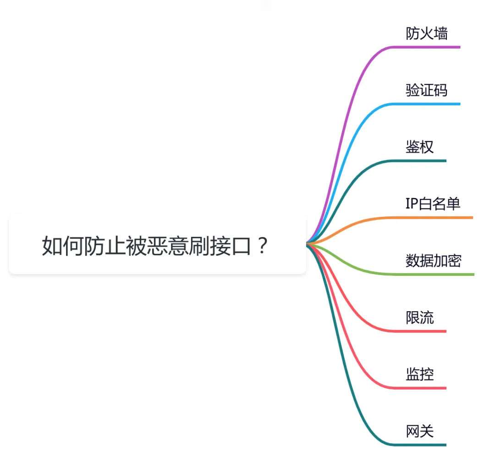
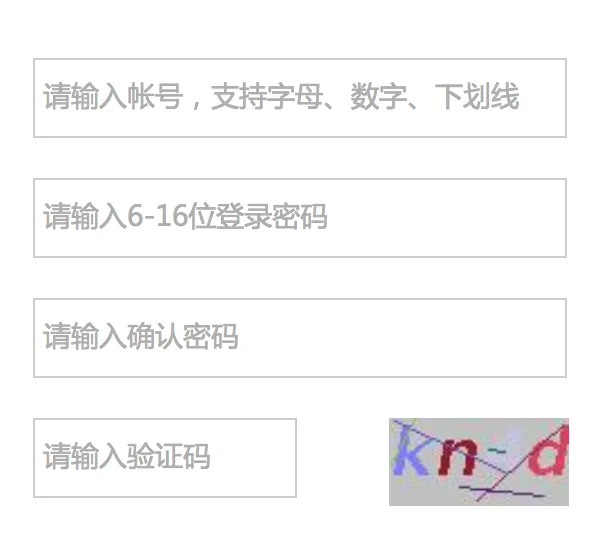
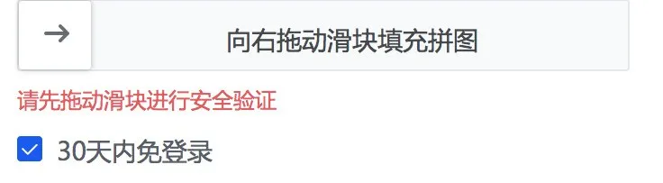
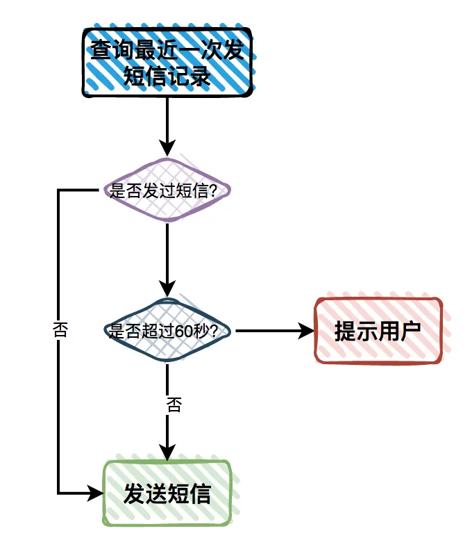
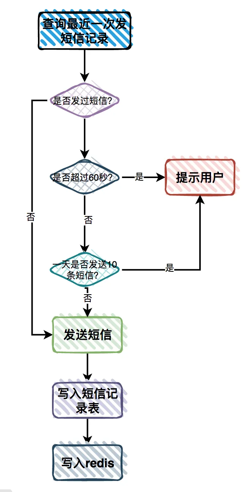
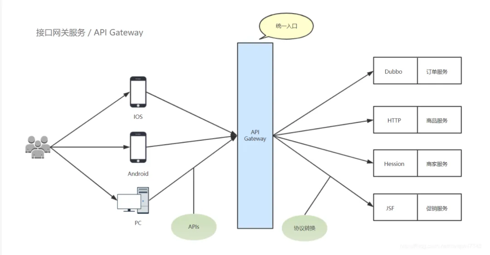

# 如何防止被恶意刷接口？

## **前言**
在面试时，经常会被问一个问题：**如何防止别人恶意刷接口？**

这是一个非常有意思的问题，防范措施挺多的。

## **1 防火墙**
防火墙是网络安全中最基本的安全设备之一，主要用于防止未经授权的网络访问和攻击。

防火墙可以防止的攻击行为包括：

+ `无效数据包`：防火墙可以识别和过滤掉无效的数据包，如错误的 IP 地址、伪造的数据包和无法识别的协议等。
+ `DOS 和 DDOS 攻击`：防火墙可以使用不同的技术来检测和阻止 DOS 和 DDOS 攻击，如阻止大量 TCP/UDP 连接、IP 地址过滤和流量限制等。
+ `病毒和蠕虫攻击`：防火墙可以使用特定的病毒和蠕虫检测技术，如签名检测、行为检测、模式识别等，来防止这些恶意软件的传播。
+ `网络钓鱼和欺骗攻击`：防火墙可以检测和防止网络钓鱼和欺骗攻击，如防止虚假登录页面和欺骗的网站等。
+ `恶意流量攻击`：防火墙可以检测和防止恶意流量攻击，如过滤掉带有恶意载荷的数据包和防止被黑客利用的端口。
+ `网络侦察攻击`：防火墙可以使用一些技术来防止网络侦察攻击，如防止扫描、端口扫描和漏洞利用等。

防火墙主要用于过滤和控制网络流量，以保护网络安全。

## **2 验证码**
对于一些非常重要的接口，在做接口设计的时候，要考虑恶意用户刷接口的情况。

最早的用户注册接口，是需要用图形验证码校验的，比如下面这样的：用户只需要输入：账号名称、密码和验证码即可，完成注册。

其中账号名称作为用户的唯一标识。

但有些图形验证码比较简单，很容易被一些暴力破解工具破解。

由此，要给图形验证码增加难道，增加一些干扰项，增加暴力破解工具的难道。

但有个问题是：如果图形验证码太复杂了，会对正常用户使用造成一点的困扰，增加了用户注册的成本，让用户注册功能的效果会大打折扣。

因此，仅靠图形验证码，防止用户注册接口被刷，难道太大了。

后来，又出现了一种移动滑块形式的图形验证方式，安全性更高。此外，使用验证码比较多的地方是发手机短信的功能。

发手机短信的功能，一般是购买的云服务厂商的短信服务，按次收费，比如：发一条短信0.1元。

如果发送短信的接口，不做限制，被用户恶意调用，可能会产生非常昂贵的费用。

## **3 鉴权**
对于有些查看对外的API接口，需要用户登录之后，才能访问。

这种情况就需要校验登录了。

可以从当前用户上下文中获取用户信息，校验用户是否登录。

如果用户登录了，当前用户上下文中该用户的信息不为空。

否则，如果用户没登录，则当前用户上下文中该用户的信息为空。

对于有些重要的接口，比如订单审核接口，只有拥有订单审核权限的运营账号，才有权限访问该接口。

我们需要对该接口做功能权限控制。

可以自定义一个权限注解，在注解上可以添加权限点。

在网关层有个拦截器，会根据当前请求的用户的权限，去跟请求的接口的权限做匹配，只有匹配上次允许访问该接口。

## **4 IP白名单**
对于有些非常重要的基础性的接口，比如：会员系统的开通会员接口，业务系统可能会调用该接口开通会员。

会员系统为了安全性考虑，在设计开通会员接口的时候，可能会加一个ip白名单，对非法的服务器请求进行拦截。

这个ip白名单前期可以做成一个Apollo配置，可以动态生效。

如果后期ip数量多了的话，可以直接保存到数据库。

只有ip在白名单中的那些服务器，才允许调用开通会员接口。

这样即使开通会员接口地址和请求参数被泄露了，调用者的ip不在白名单上，请求开通会员接口会直接失败。

除非调用者登录到了某一个白名单ip的对应的服务器，这种情况极少，因为一般运维会设置对访问器访问的防火墙。

当然如果用了Fegin这种走内部域名的方式访问接口，可以不用设置ip白名单，内部域名只有在公司的内部服务器之间访问，外面的用户根本访问不了。

但对于一些第三方平台的接口，他们更多的是通过设置ip白名单的方式保证接口的安全性。

## **5 数据加密**
以前很多接口使用的是HTTP（HyperText Transport Protocol，即超文本传输协议）协议，它用于传输客户端和服务器端的数据。

虽说HTTP使用很简单也很方便，但却存在以下3个致命问题：

使用明文通讯，内容容易被窃听。不验证通讯方的真实身份，容易遭到伪装。无法证明报文的完整性，报文很容易被篡改。为了解决HTTP协议的这些问题，出现了HTTPS协议。

HTTPS协议是在HTTP协议的基础上，添加了加密机制：

SSL：它是Secure Socket Layer的缩写， 表示安全套接层。TLS：它是Transport Layer Security的缩写，表示传输层安全。HTTPS = HTTP + 加密 + 认证 + 完整性保护。

为了安全性考虑，我们的接口如果能使用HTTPS协议，尽量少使用HTTP协议。

如果你访问过一些大厂的网站，会发现他们提供的接口，都是使用的HTTPS协议。

## **6 限流**
之前提到的发送短信接口，只校验验证码还不够，还需要对用户请求做限流。

从页面上的验证码，只能限制当前页面的不能重复发短信，但如果用户刷新了页面，也可以重新发短信。

因此非常有必要在服务端，即：发送短信接口做限制。

我们可以增加一张短信发送表。

该表包含：id、短信类型、短信内容、手机号、发送时间等字段。

有用户发送短信请求过来时：

先查询该手机号最近一次发送短信的记录 如果没有发送过，则发送短信。如果该手机号已经发送过短信，但发送时间跟当前时间比超过了60秒，则重新发送一条新的短信。如果发送时间跟当前时间比没超过60秒，则直接提示用户操作太频繁，请稍后重试。这样就能非常有效的防止恶意用户刷短信的行为。

但还是有漏洞。

比如：用户知道在60秒以内，是没法重复发短信的。他有个程序，刚好每隔60秒发一条短信。

这样1个手机号在一天内可以发：60*24 = 1440 条短信。

如果他有100个手机号，那么一天也可以刷你很多条短信。

由此，还需要限制每天同一个手机号可以发的短信次数。

其实可以用redis来做。

用户发短信之后，在redis中保存一条记录，key是手机号，value是发短信的次数，过期时间是24小时。

这样在发送短信之前，要先查询一下，当天发送短信的次数是否超过10次（假设同一个手机号一天最多允许发10条短信）。

如果超过10次，则直接提示用户操作太频繁，请稍后重试。

如果没超过10次，则发送短信，并且把redis中该手机号对应的value值加1。

短信发送接口完整的校验流程如下：

## **7 监控**
为了防止被别人恶意刷接口，对接口的调用情况进行监控，是非常有必要的。

我们的程序中可以将用户的请求记录，打印到相关日志中。

然后有专门的程序，统计用户接口的调用情况，如果发现有突增的流量，会自动发短信或者邮件提醒。

有了监控之后，我们可以及时发现异常的用户请求。

后面可以进行人工干预处理。

## **8 网关**
为了保证我们接口的安全性，可以提供统一的API网关，它可以实现过滤、鉴权、限流等功能。

用户请求我们的API接口时，需要先经过API网关，它转发请求到具体的API接口。有了API网关层，可以保护API接口。

> 更新: 2024-12-06 09:14:05  
> 原文: <https://www.yuque.com/u12222632/as5rgl/bslikxi20vvor766>