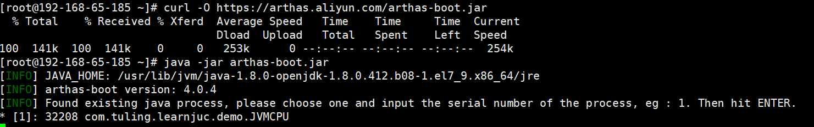
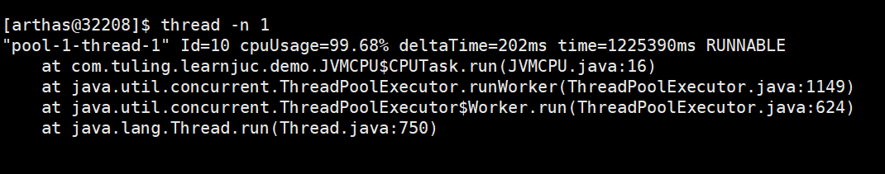

# 字节面试：CPU飙升100%如何排查

<font style="color:rgb(36, 41, 46);">最近有小伙伴在面试字节，又遇到了CPU100%问题。</font>

> <font style="color:rgb(106, 115, 125);">线上CPU飙升100%，你是怎么处理的？</font>
>

<font style="color:rgb(36, 41, 46);">小伙伴支支吾吾的说了几句，没答好， 卒。</font>

## 1.cpu占用很高的3大类型，9大场景:
<font style="color:rgb(36, 41, 46);">CPU 飙升是一个常见的问题。</font>

<font style="color:rgb(36, 41, 46);">在生产环境中，会出现由代码问题导致CPU占用很高，该如何诊断出是哪行java代码导致? 是大家的一项重要基本功，也是大家面试中的家常骗饭。</font>

<font style="color:rgb(36, 41, 46);">如果连CPU 飙升的问题都回答不清楚， 都支支吾吾， 面试就很难通过了。</font>

<font style="color:rgb(36, 41, 46);"></font>

<font style="color:rgb(36, 41, 46);">cpu占用很高的三大类型问题，9大问题场景。</font>


### 第1大类型导致CPU100%的问题： 业务类问题


#### <font style="color:rgba(0, 0, 0, 0.9);">1.1 死循环</font>
> <font style="color:rgb(106, 115, 125);background-color:rgb(249, 249, 249);">while(true)条件</font>
>

<font style="color:rgb(36, 41, 46);">导致 CPU 占用率高的最简单但最具破坏性的编程错误之一就是死循环。</font>

<font style="color:rgb(36, 41, 46);">当程序中的循环缺乏正确的退出条件或条件从未满足时，就会出现这种情况，</font>

<font style="color:rgb(36, 41, 46);">死循环无休止地运行，消耗过多的处理器时间，导致CPU100%</font>

#### <font style="color:rgba(0, 0, 0, 0.9);">1.2 死锁</font>
<font style="color:rgb(36, 41, 46);">发生死锁后，就会存在忙等待或自旋锁等编程问题，从而导致 繁忙等待问题。</font>

<font style="color:rgb(36, 41, 46);">即进程在不释放 CPU 的情况下反复检查条件是否满足，会导致 CPU 占用率居高不下。</font>

<font style="color:rgb(36, 41, 46);">这种低效率的资源使用会妨碍 CPU 执行其他任务。</font>

#### <font style="color:rgba(0, 0, 0, 0.9);">1.3 不必要的代码块</font>
<font style="color:rgb(36, 41, 46);">在不需要的地方使用</font>`<font style="color:rgb(36, 41, 46);">synchronized</font>`<font style="color:rgb(36, 41, 46);">块，会导致线程竞争和上下文切换</font>

<font style="color:rgb(36, 41, 46);">解决方案:尽量减少同步块的使用范围</font>

<font style="color:rgb(36, 41, 46);"></font>

### 第2大类型导致CPU100%的问题：并发类问题


#### <font style="color:rgba(0, 0, 0, 0.9);">1.4 大量计算密集型的任务</font>
<font style="color:rgb(36, 41, 46);">比如复杂的数学计算，图像处理，视频编码</font>

<font style="color:rgb(36, 41, 46);">计算密集型的任务需要大量的计算能力。在没有足够系统资源的情况下运行这些应用程序，可能会导致 CPU 占用率达到 100%，因为它们试图执行高要求的任务。</font>

<font style="color:rgb(36, 41, 46);">解决方案:优化算法，使用更高效的库，或者利用并行计算来分摊</font>

#### <font style="color:rgba(0, 0, 0, 0.9);">1.5 大量并发线程</font>
<font style="color:rgb(36, 41, 46);">多个线程同时运行会导致对 CPU 资源的竞争，尤其是当其中许多线程都是资源密集型进程时。</font>

<font style="color:rgb(36, 41, 46);">这会导致所有线程获得的 CPU 时间减少，当每个线程都试图完成自己的任务时，CPU 时间可能会被耗尽。</font>

#### <font style="color:rgba(0, 0, 0, 0.9);">1.6 大量的上下文切换</font>
<font style="color:rgb(36, 41, 46);">创建过多的线程，导致频繁的上下文切换</font>

<font style="color:rgb(36, 41, 46);">解决方案:使用线程池来管理线程的数量</font>

<font style="color:rgb(36, 41, 46);"></font>

### 第3大类导致CPU100%的问题：内存类问题


#### <font style="color:rgba(0, 0, 0, 0.9);">1.7 内存不足</font>
<font style="color:rgb(36, 41, 46);">当系统内存不足时，就会将磁盘存储作为虚拟内存使用，而虚拟内存的运行速度要慢得多。</font>

<font style="color:rgb(36, 41, 46);">这种</font>**<font style="color:rgb(36, 41, 46);">过度的分页和交换</font>**<font style="color:rgb(36, 41, 46);">会导致 CPU 占用率居高不下，因为处理器需要花费更多时间来管理内存访问，而不是高效地执行进程。</font>

#### <font style="color:rgba(0, 0, 0, 0.9);">1.8 频繁GC</font>
<font style="color:rgb(36, 41, 46);">创建大量的短生命周期的对象，频繁触发GC</font>

<font style="color:rgb(36, 41, 46);">解决方案: 优化代码， 减少对象的创建 ，或者调整JVM的参数来优化</font>

#### <font style="color:rgba(0, 0, 0, 0.9);">1.9 内存泄漏</font>
<font style="color:rgb(36, 41, 46);">程序持续分配内存但不释放，会导致频繁的GC</font>

<font style="color:rgb(36, 41, 46);">解决方案:使用内存分析工具VisualVM进行检测和修复</font>

<font style="color:rgb(36, 41, 46);"></font>

## 2.CPU100%定位的两大神器:


<font style="color:rgb(36, 41, 46);">想要定位到具体是哪一行的代码导致， 一般都会使用下面的两大神器</font>

+ <font style="color:rgb(36, 41, 46);">通常使用的jvm自带的工具jstack，</font>
+ <font style="color:rgb(36, 41, 46);">还有一种就是开源神器arthas，</font>

<font style="color:rgb(36, 41, 46);">一般而言，arthas还有其它的功能，所以选择它多一点.</font>

<font style="color:rgb(36, 41, 46);"></font>

## 3 CPU 飙升100%的解决思路与方法论


## 4 使用jstack 解决CPU 100%问题实操
<font style="color:rgb(36, 41, 46);">使用jstack 解决CPU 100%问题，在方法论上要用到两个命令，</font>

+ <font style="color:rgb(36, 41, 46);">top 命令查看TOP N线程，</font>
+ <font style="color:rgb(36, 41, 46);">jstack命令查看堆栈信息</font>


### <font style="color:rgb(30, 30, 30);background-color:rgb(212, 224, 250);">4.1.jstack命令讲解</font>
<font style="color:rgb(36, 41, 46);">命令jstack是java堆栈的跟踪工具，可以打印出程序中所有线程的堆栈信息，包括线程状态，调用栈信息，锁信息等。</font>

<font style="color:rgb(36, 41, 46);">jstack可以诊断线程死锁、内存泄漏等问题</font>

<font style="color:rgb(36, 41, 46);">命令格式: jstack [options] pid</font>

<font style="color:rgb(106, 115, 125);background-color:rgb(249, 249, 249);">常用例子: jstack -l pid，查看线程的堆栈信息</font>

<font style="color:rgb(36, 41, 46);">堆栈信息解读:</font>

```shell
[root@192-168-65-185 ~]# jstack -l 29440
2024-12-17 13:48:51
Full thread dump OpenJDK 64-Bit Server VM (25.412-b08 mixed mode):

"Attach Listener" #12 daemon prio=9 os_prio=0 tid=0x00007f097c001000 nid=0x763a runnable [0x0000000000000000]
   java.lang.Thread.State: RUNNABLE

   Locked ownable synchronizers:
	- None

"DestroyJavaVM" #11 prio=5 os_prio=0 tid=0x00007f09e004b800 nid=0x7301 waiting on condition [0x0000000000000000]
   java.lang.Thread.State: RUNNABLE

   Locked ownable synchronizers:
	- None

"pool-1-thread-1" #10 prio=5 os_prio=0 tid=0x00007f09e0166000 nid=0x7316 runnable [0x00007f09cc9cb000]
   java.lang.Thread.State: RUNNABLE
	at com.tuling.learnjuc.demo.JVMCPU$CPUTask.run(JVMCPU.java:16)
	- locked <0x0000000757d645b8> (a java.lang.Object)
	at java.util.concurrent.ThreadPoolExecutor.runWorker(ThreadPoolExecutor.java:1149)
	at java.util.concurrent.ThreadPoolExecutor$Worker.run(ThreadPoolExecutor.java:624)
	at java.lang.Thread.run(Thread.java:750)

   Locked ownable synchronizers:
	- <0x0000000757d65d00> (a java.util.concurrent.ThreadPoolExecutor$Worker)

"Service Thread" #9 daemon prio=9 os_prio=0 tid=0x00007f09e0140000 nid=0x7314 runnable [0x0000000000000000]
   java.lang.Thread.State: RUNNABLE

   Locked ownable synchronizers:
	- None

"C1 CompilerThread3" #8 daemon prio=9 os_prio=0 tid=0x00007f09e0133000 nid=0x7313 waiting on condition [0x0000000000000000]
   java.lang.Thread.State: RUNNABLE

   Locked ownable synchronizers:
	- None

"C2 CompilerThread2" #7 daemon prio=9 os_prio=0 tid=0x00007f09e0131000 nid=0x7312 waiting on condition [0x0000000000000000]
   java.lang.Thread.State: RUNNABLE

   Locked ownable synchronizers:
	- None

"C2 CompilerThread1" #6 daemon prio=9 os_prio=0 tid=0x00007f09e012f000 nid=0x7311 waiting on condition [0x0000000000000000]
   java.lang.Thread.State: RUNNABLE

   Locked ownable synchronizers:
	- None

"C2 CompilerThread0" #5 daemon prio=9 os_prio=0 tid=0x00007f09e012c800 nid=0x7310 waiting on condition [0x0000000000000000]
   java.lang.Thread.State: RUNNABLE

   Locked ownable synchronizers:
	- None

"Signal Dispatcher" #4 daemon prio=9 os_prio=0 tid=0x00007f09e011e000 nid=0x730f runnable [0x0000000000000000]
   java.lang.Thread.State: RUNNABLE

   Locked ownable synchronizers:
	- None

"Finalizer" #3 daemon prio=8 os_prio=0 tid=0x00007f09e00f2000 nid=0x730e in Object.wait() [0x00007f09cd1d3000]
   java.lang.Thread.State: WAITING (on object monitor)
	at java.lang.Object.wait(Native Method)
	- waiting on <0x0000000757d08f00> (a java.lang.ref.ReferenceQueue$Lock)
	at java.lang.ref.ReferenceQueue.remove(ReferenceQueue.java:144)
	- locked <0x0000000757d08f00> (a java.lang.ref.ReferenceQueue$Lock)
	at java.lang.ref.ReferenceQueue.remove(ReferenceQueue.java:165)
	at java.lang.ref.Finalizer$FinalizerThread.run(Finalizer.java:188)

   Locked ownable synchronizers:
	- None

"Reference Handler" #2 daemon prio=10 os_prio=0 tid=0x00007f09e00ed000 nid=0x730d in Object.wait() [0x00007f09cd2d4000]
   java.lang.Thread.State: WAITING (on object monitor)
	at java.lang.Object.wait(Native Method)
	- waiting on <0x0000000757d06b98> (a java.lang.ref.Reference$Lock)
	at java.lang.Object.wait(Object.java:502)
	at java.lang.ref.Reference.tryHandlePending(Reference.java:191)
	- locked <0x0000000757d06b98> (a java.lang.ref.Reference$Lock)
	at java.lang.ref.Reference$ReferenceHandler.run(Reference.java:153)

   Locked ownable synchronizers:
	- None

"VM Thread" os_prio=0 tid=0x00007f09e00e3800 nid=0x730c runnable 

"GC task thread#0 (ParallelGC)" os_prio=0 tid=0x00007f09e005e000 nid=0x7302 runnable 

"GC task thread#1 (ParallelGC)" os_prio=0 tid=0x00007f09e0060000 nid=0x7303 runnable 

"GC task thread#2 (ParallelGC)" os_prio=0 tid=0x00007f09e0062000 nid=0x7304 runnable 

"GC task thread#3 (ParallelGC)" os_prio=0 tid=0x00007f09e0064000 nid=0x7305 runnable 

"GC task thread#4 (ParallelGC)" os_prio=0 tid=0x00007f09e0065800 nid=0x7306 runnable 

"GC task thread#5 (ParallelGC)" os_prio=0 tid=0x00007f09e0067800 nid=0x7307 runnable 

"GC task thread#6 (ParallelGC)" os_prio=0 tid=0x00007f09e0069800 nid=0x7308 runnable 

"GC task thread#7 (ParallelGC)" os_prio=0 tid=0x00007f09e006b800 nid=0x7309 runnable 

"GC task thread#8 (ParallelGC)" os_prio=0 tid=0x00007f09e006d000 nid=0x730a runnable 

"GC task thread#9 (ParallelGC)" os_prio=0 tid=0x00007f09e006f000 nid=0x730b runnable 

"VM Periodic Task Thread" os_prio=0 tid=0x00007f09e0142800 nid=0x7315 waiting on condition 

JNI global references: 5

```

<font style="color:rgb(36, 41, 46);">你会发现上面的信息其实是一段一段的，摘取其中的一段为大家说明:</font>

```plain
"pool-1-thread-1" #10 prio=5 os_prio=0 tid=0x00007f09e0166000 nid=0x7316 runnable [0x00007f09cc9cb000]
   java.lang.Thread.State: RUNNABLE
	at com.tuling.learnjuc.demo.JVMCPU$CPUTask.run(JVMCPU.java:16)
	- locked <0x0000000757d645b8> (a java.lang.Object)
	at java.util.concurrent.ThreadPoolExecutor.runWorker(ThreadPoolExecutor.java:1149)
	at java.util.concurrent.ThreadPoolExecutor$Worker.run(ThreadPoolExecutor.java:624)
	at java.lang.Thread.run(Thread.java:750)

   Locked ownable synchronizers:
	- <0x0000000757d65d00> (a java.util.concurrent.ThreadPoolExecutor$Worker)

```

`<font style="color:rgb(36, 41, 46);">pool-1-thread-1</font>`<font style="color:rgb(36, 41, 46);">:线程名称</font>

`<font style="color:rgb(36, 41, 46);">#1</font>`<font style="color:rgb(36, 41, 46);">:当前线程ID，从main开始，jvm会根据线程创建的顺序为其线程编号</font>

`<font style="color:rgb(36, 41, 46);">prio</font>`<font style="color:rgb(36, 41, 46);">:优先级的顺序，一般默认是5</font>

`<font style="color:rgb(36, 41, 46);">os_prio</font>`<font style="color:rgb(36, 41, 46);">:线程对应系统的优先级</font>

`<font style="color:rgb(36, 41, 46);">tid</font>`<font style="color:rgb(36, 41, 46);">:java内的线程id</font>

`<font style="color:rgb(36, 41, 46);">nid</font>`<font style="color:rgb(36, 41, 46);">:操作系统级别的线程id，是一个十六进制</font>

<font style="color:rgb(36, 41, 46);">关于线程的信息:</font>

`<font style="color:rgb(36, 41, 46);">NEW</font>`<font style="color:rgb(36, 41, 46);">:线程新建，还没开始运行</font>

`<font style="color:rgb(36, 41, 46);">RUNNABLE</font>`<font style="color:rgb(36, 41, 46);">:正在java虚拟机中运行的线程</font>

`<font style="color:rgb(36, 41, 46);">BLOCKED</font>`<font style="color:rgb(36, 41, 46);"> :被阻塞，正在等待监视器锁的线程</font>

`<font style="color:rgb(36, 41, 46);">WAITING</font>`<font style="color:rgb(36, 41, 46);"> :无限期等待另一个线程执行特定操作的线程</font>

`<font style="color:rgb(36, 41, 46);">TIMED_WAITING</font>`<font style="color:rgb(36, 41, 46);">:等待另一个线程执行操作达到指定等待时间的线程</font>

`<font style="color:rgb(36, 41, 46);">TERMINATED</font>`<font style="color:rgb(36, 41, 46);">:已经退出的线程</font>

<font style="color:rgb(36, 41, 46);">我们这里关注的最多的就是</font>`<font style="color:rgb(36, 41, 46);">nid</font>`

### <font style="color:rgb(30, 30, 30);background-color:rgb(212, 224, 250);">4.2.使用jstack解决CPU占用很高的问题并定位具体行数</font>
<font style="color:rgb(36, 41, 46);">先来看一段代码:</font>

```plain
package com.tuling.learnjuc.demo;

import java.util.concurrent.ExecutorService;
import java.util.concurrent.Executors;

public class JVMCPU {
    private static ExecutorService service = Executors.newFixedThreadPool(5);
    private static Object lock = new Object();
    public static class CPUTask implements Runnable{

        @Override
        public void run() {
            synchronized (lock){
                long sum = 0L;
                while(true){
                    sum +=1;
                }
            }
        }
    }
    public static void main(String[] args) {

        CPUTask cpuTask = new CPUTask();
        service.execute(cpuTask);

    }
}
```

<font style="color:rgb(36, 41, 46);">将这段代码上传到linux服务器上编译</font>


> <font style="color:rgb(36, 41, 46);">注意：如果提示javac: 未找到命令... ，执行yum install java-1.8.0-openjdk-devel</font>
>

<font style="color:rgb(36, 41, 46);">使用</font>`<font style="color:rgb(36, 41, 46);">nohup java com.tuling.learnjuc.demo.JVMCPU &</font>`<font style="color:rgb(36, 41, 46);">运行</font>


<font style="color:rgb(36, 41, 46);">使用</font>`<font style="color:rgb(36, 41, 46);">top</font>`<font style="color:rgb(36, 41, 46);">命令可以看到cpu被打满了</font>


<font style="color:rgb(36, 41, 46);">知道了进程的PID，如何找到进程下是哪个线程呢?可以使用命令</font>`<font style="color:rgb(36, 41, 46);">top -Hp 32208</font>`<font style="color:rgb(36, 41, 46);">，如下所示</font>


> <font style="color:rgb(36, 41, 46);">如果能获取到线程名，下面这步可以忽略，不需要再根据线程id找线程</font>
>
> <font style="color:rgb(36, 41, 46);">从上面的图可以看到，cpu占用最多的线程是32230这个线程id，接下来就是使用</font>`<font style="color:rgb(36, 41, 46);">jstack</font>`<font style="color:rgb(36, 41, 46);">命令来查看程序的所有堆栈信息，但是，这里需要有一个注意的点，32230这个是一个十进制</font>
>
> <font style="color:rgb(36, 41, 46);">的，使用jstack看到的nid是十六进制，所以我们需要转换，可以使用</font>`<font style="color:rgb(36, 41, 46);">printf "%x\n"</font>`<font style="color:rgb(36, 41, 46);">这个命令</font>
>
> 
>

<font style="color:rgb(36, 41, 46);">接下来使用</font>`<font style="color:rgb(36, 41, 46);">jstack -l 32208</font>`<font style="color:rgb(36, 41, 46);">打印堆栈信息</font>

```plain
[root@192-168-65-185 ~]# jstack -l 32208
2024-12-17 14:04:09
Full thread dump OpenJDK 64-Bit Server VM (25.412-b08 mixed mode):

"Attach Listener" #12 daemon prio=9 os_prio=0 tid=0x00007fb498001000 nid=0x4e5 waiting on condition [0x0000000000000000]
   java.lang.Thread.State: RUNNABLE

   Locked ownable synchronizers:
	- None

"DestroyJavaVM" #11 prio=5 os_prio=0 tid=0x00007fb4fc04b800 nid=0x7dd1 waiting on condition [0x0000000000000000]
   java.lang.Thread.State: RUNNABLE

   Locked ownable synchronizers:
	- None

"pool-1-thread-1" #10 prio=5 os_prio=0 tid=0x00007fb4fc16e000 nid=0x7de6 runnable [0x00007fb4e87fe000]
   java.lang.Thread.State: RUNNABLE
	at com.tuling.learnjuc.demo.JVMCPU$CPUTask.run(JVMCPU.java:16)
	- locked <0x0000000757d645b8> (a java.lang.Object)
	at java.util.concurrent.ThreadPoolExecutor.runWorker(ThreadPoolExecutor.java:1149)
	at java.util.concurrent.ThreadPoolExecutor$Worker.run(ThreadPoolExecutor.java:624)
	at java.lang.Thread.run(Thread.java:750)

   Locked ownable synchronizers:
	- <0x0000000757d65d00> (a java.util.concurrent.ThreadPoolExecutor$Worker)

"Service Thread" #9 daemon prio=9 os_prio=0 tid=0x00007fb4fc140000 nid=0x7de4 runnable [0x0000000000000000]
   java.lang.Thread.State: RUNNABLE

   Locked ownable synchronizers:
	- None

"C1 CompilerThread3" #8 daemon prio=9 os_prio=0 tid=0x00007fb4fc133000 nid=0x7de3 waiting on condition [0x0000000000000000]
   java.lang.Thread.State: RUNNABLE

   Locked ownable synchronizers:
	- None

"C2 CompilerThread2" #7 daemon prio=9 os_prio=0 tid=0x00007fb4fc131000 nid=0x7de2 waiting on condition [0x0000000000000000]
   java.lang.Thread.State: RUNNABLE

   Locked ownable synchronizers:
	- None

"C2 CompilerThread1" #6 daemon prio=9 os_prio=0 tid=0x00007fb4fc12f000 nid=0x7de1 waiting on condition [0x0000000000000000]
   java.lang.Thread.State: RUNNABLE

   Locked ownable synchronizers:
	- None

"C2 CompilerThread0" #5 daemon prio=9 os_prio=0 tid=0x00007fb4fc12c800 nid=0x7de0 waiting on condition [0x0000000000000000]
   java.lang.Thread.State: RUNNABLE

   Locked ownable synchronizers:
	- None

"Signal Dispatcher" #4 daemon prio=9 os_prio=0 tid=0x00007fb4fc11e000 nid=0x7ddf runnable [0x0000000000000000]
   java.lang.Thread.State: RUNNABLE

   Locked ownable synchronizers:
	- None

"Finalizer" #3 daemon prio=8 os_prio=0 tid=0x00007fb4fc0f2000 nid=0x7dde in Object.wait() [0x00007fb4e92d4000]
   java.lang.Thread.State: WAITING (on object monitor)
	at java.lang.Object.wait(Native Method)
	- waiting on <0x0000000757d08f00> (a java.lang.ref.ReferenceQueue$Lock)
	at java.lang.ref.ReferenceQueue.remove(ReferenceQueue.java:144)
	- locked <0x0000000757d08f00> (a java.lang.ref.ReferenceQueue$Lock)
	at java.lang.ref.ReferenceQueue.remove(ReferenceQueue.java:165)
	at java.lang.ref.Finalizer$FinalizerThread.run(Finalizer.java:188)

   Locked ownable synchronizers:
	- None

"Reference Handler" #2 daemon prio=10 os_prio=0 tid=0x00007fb4fc0ed000 nid=0x7ddd in Object.wait() [0x00007fb4e93d5000]
   java.lang.Thread.State: WAITING (on object monitor)
	at java.lang.Object.wait(Native Method)
	- waiting on <0x0000000757d06b98> (a java.lang.ref.Reference$Lock)
	at java.lang.Object.wait(Object.java:502)
	at java.lang.ref.Reference.tryHandlePending(Reference.java:191)
	- locked <0x0000000757d06b98> (a java.lang.ref.Reference$Lock)
	at java.lang.ref.Reference$ReferenceHandler.run(Reference.java:153)

   Locked ownable synchronizers:
	- None

"VM Thread" os_prio=0 tid=0x00007fb4fc0e3800 nid=0x7ddc runnable 

"GC task thread#0 (ParallelGC)" os_prio=0 tid=0x00007fb4fc05e000 nid=0x7dd2 runnable 

"GC task thread#1 (ParallelGC)" os_prio=0 tid=0x00007fb4fc060000 nid=0x7dd3 runnable 

"GC task thread#2 (ParallelGC)" os_prio=0 tid=0x00007fb4fc062000 nid=0x7dd4 runnable 

"GC task thread#3 (ParallelGC)" os_prio=0 tid=0x00007fb4fc064000 nid=0x7dd5 runnable 

"GC task thread#4 (ParallelGC)" os_prio=0 tid=0x00007fb4fc065800 nid=0x7dd6 runnable 

"GC task thread#5 (ParallelGC)" os_prio=0 tid=0x00007fb4fc067800 nid=0x7dd7 runnable 

"GC task thread#6 (ParallelGC)" os_prio=0 tid=0x00007fb4fc069800 nid=0x7dd8 runnable 

"GC task thread#7 (ParallelGC)" os_prio=0 tid=0x00007fb4fc06b800 nid=0x7dd9 runnable 

"GC task thread#8 (ParallelGC)" os_prio=0 tid=0x00007fb4fc06d000 nid=0x7dda runnable 

"GC task thread#9 (ParallelGC)" os_prio=0 tid=0x00007fb4fc06f000 nid=0x7ddb runnable 

"VM Periodic Task Thread" os_prio=0 tid=0x00007fb4fc142800 nid=0x7de5 waiting on condition 

JNI global references: 5
```

<font style="color:rgb(36, 41, 46);">从上面的信息中，可以看到转换的结果和nid是一致的，</font>

<font style="color:rgb(36, 41, 46);">从下面的信息中就可以看到问题其实是出现在</font>`<font style="color:rgb(36, 41, 46);">JVMCPU.java</font>`<font style="color:rgb(36, 41, 46);">的16行左右，这里给出的是16行，但是实际情况是16行的附近</font>

```plain
"pool-1-thread-1" #10 prio=5 os_prio=0 tid=0x00007fb4fc16e000 nid=0x7de6 runnable [0x00007fb4e87fe000]
   java.lang.Thread.State: RUNNABLE
	at com.tuling.learnjuc.demo.JVMCPU$CPUTask.run(JVMCPU.java:16)
	- locked <0x0000000757d645b8> (a java.lang.Object)
	at java.util.concurrent.ThreadPoolExecutor.runWorker(ThreadPoolExecutor.java:1149)
	at java.util.concurrent.ThreadPoolExecutor$Worker.run(ThreadPoolExecutor.java:624)
	at java.lang.Thread.run(Thread.java:750)

   Locked ownable synchronizers:
	- <0x0000000757d65d00> (a java.util.concurrent.ThreadPoolExecutor$Worker)
```

<font style="color:rgb(36, 41, 46);">结合代码来看一下就很容易问题</font>


## 5.使用arthas解决CPU占用很高的问题，定位具体代码行
> 官方文档：[https://arthas.aliyun.com/](https://arthas.aliyun.com/)
>

<font style="color:rgb(36, 41, 46);">使用arthas解决CPU 100%问题，在方法论上要用到两个命令，</font>

+ <font style="color:rgb(36, 41, 46);">dashboard 命令查看TOP N线程，</font>
+ <font style="color:rgb(36, 41, 46);">thread 命令查看堆栈信息</font>


<font style="color:rgb(36, 41, 46);">先来运行</font>`<font style="color:rgb(36, 41, 46);">arthas</font>`

```plain
curl -O https://arthas.aliyun.com/arthas-boot.jar
java -jar arthas-boot.jar
```



<font style="color:rgb(36, 41, 46);">输入1显示如下</font>


<font style="color:rgb(36, 41, 46);">输入</font>`<font style="color:rgb(36, 41, 46);">dashboard</font>`<font style="color:rgb(36, 41, 46);">命令可以看到是哪个线程占用cpu最高</font>


<font style="color:rgb(36, 41, 46);">接下来输入</font>`<font style="color:rgb(36, 41, 46);">thread -n 1</font>`<font style="color:rgb(36, 41, 46);">，表示最忙的线程并打印信息</font>



<font style="color:rgb(36, 41, 46);">从上面的图中可以看到arthas和jstack展示的信息差不多，都定位到了</font>`<font style="color:rgb(36, 41, 46);">JVMCPU.java</font>`<font style="color:rgb(36, 41, 46);">的16行程序</font>

<font style="color:rgb(36, 41, 46);"></font>

## 6.死锁导致CPU占用很高的问题分析
<font style="color:rgb(36, 41, 46);">先来看一段代码:</font>

```plain
package com.tuling.learnjuc.demo;

public class DeadlockDemo {

    // 创建两个锁对象
    private static final Object lock1 = new Object();
    private static final Object lock2 = new Object();

    public static void main(String[] args) {

        // 线程1尝试获取lock1，然后获取lock2
        Thread thread1 = new Thread(() -> {
            synchronized (lock1) {
                System.out.println("Holding lock 1...");

                try {
                    Thread.sleep(100);
                } catch (InterruptedException e) {
                }

                System.out.println("Waiting for lock 2...");

                synchronized (lock2) {
                    System.out.println("Holding lock 1 & 2...");
                }
            }
        });

        // 线程2尝试获取lock2，然后获取lock1
        Thread thread2 = new Thread(() -> {
            synchronized (lock2) {
                System.out.println("Holding lock 2...");

                try {
                    Thread.sleep(100);
                } catch (InterruptedException e) {
                }

                System.out.println("Waiting for lock 1...");

                synchronized (lock1) {
                    System.out.println("Holding lock 2 & 1...");
                }
            }
        });

        thread1.start();
        thread2.start();
    }
}
```

<font style="color:rgb(36, 41, 46);">将上面的代码上传到服务器，使用</font>`<font style="color:rgb(36, 41, 46);">nohup java com.tuling.learnjuc.demo.DeadlockDemo &</font>`<font style="color:rgb(36, 41, 46);">运行起来</font>


<font style="color:rgb(36, 41, 46);">接下来使用arthas进行分析</font>

<font style="color:rgb(106, 115, 125);background-color:rgb(249, 249, 249);">这里选择arthas，不选择jstack是因为arthas更加的方便，它的功能也比jstack丰富</font>

<font style="color:rgb(36, 41, 46);">输入thread就可以输出线程的统计信息，其中BLOCKED代表当前阻塞的线程数</font>


<font style="color:rgb(36, 41, 46);">接下来，输入</font>`<font style="color:rgb(36, 41, 46);">thread -b</font>`<font style="color:rgb(36, 41, 46);">就可以看到线程具体的情况，在下面的图中已经准确的说明了代码在哪一行</font>


## 7.小提示
<font style="color:rgb(36, 41, 46);">工具的选择建议使用arthas，它还有很多的功能在实际中很有用</font>

<font style="color:rgb(36, 41, 46);">大家在面试的时候如果遇到cpu被打满该如何排查这样的问题，不要上来就是使用arthas来定位问题，我们的第一反应永远都是回滚版本，</font>

<font style="color:rgb(36, 41, 46);">因为在实际中代码的问题需要分析，不会像举例子这么简单，代码经过分析改动再上线，会浪费很多时间，而有的业务是绝对不允许这么操作的，比如电商，金融的业务，</font>

<font style="color:rgb(36, 41, 46);">所以在回答面试官的问题时候一定要先说回滚，在说解决办法.</font>


> 更新: 2025-03-26 19:11:36  
> 原文: <https://www.yuque.com/u12222632/as5rgl/kdotyfqesdqxhh8o>