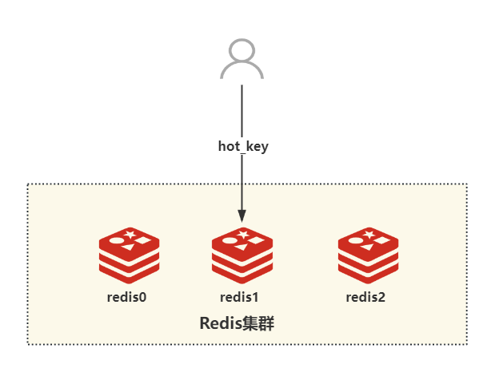
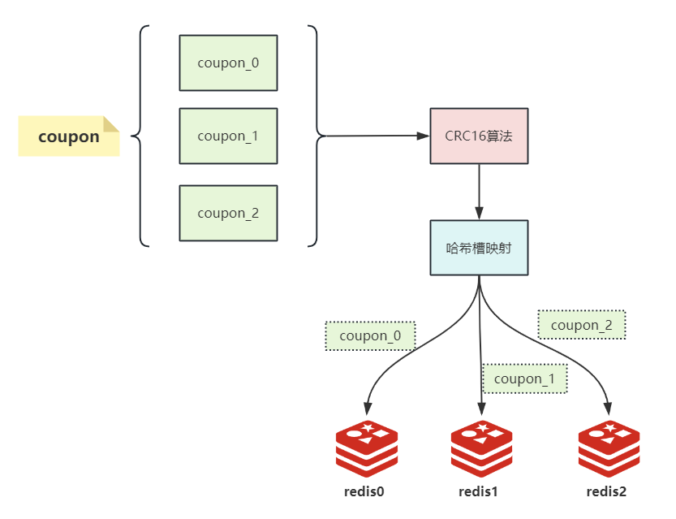
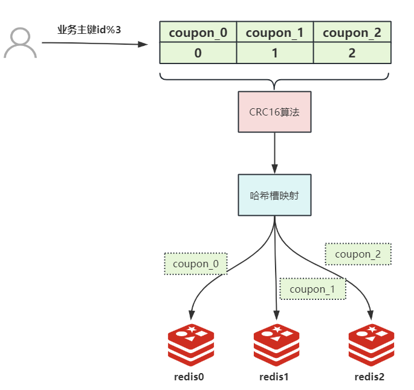
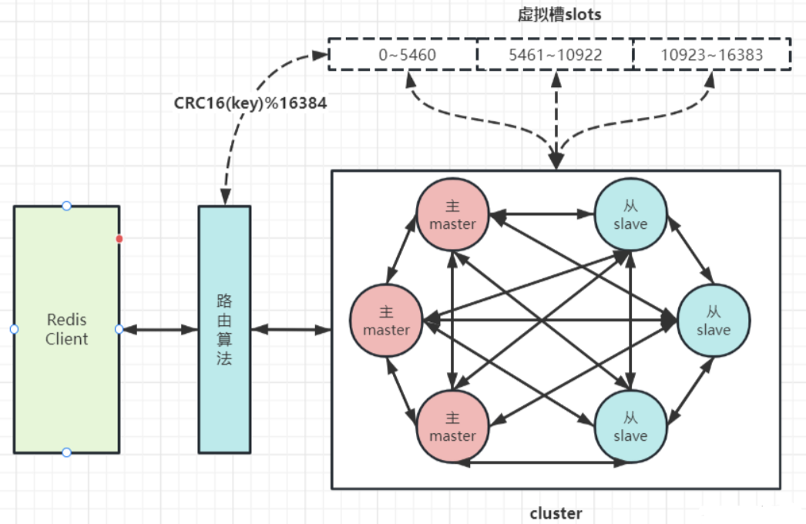

# 字节面试：百万用户同时抢1万张优惠券，Redis热点key性能瓶颈如何破解？

前段时间，有个小伙伴分享了他去字节的面试经历。他被问到了一道关于Redis热key的问题：

> **在一个超高并发的场景中，比如有百万用户同时抢购1万张优惠券，Redis作为缓存系统可能会因为某个热点key的访问量过高而导致性能瓶颈。请问你会如何解决这个问题？**
>

小伙伴支支吾吾说了几句，面试官不满意，面试挂了。

这其实是一个经典的高并发场景下的Redis优化问题，而问题的核心在于如何有效地处理热key带来的压力。

### 1. 理解题目：从Redis和热key说起
我们先来分析一下问题本身。Redis以其高性能和低延迟而广泛应用于高并发场景，但在面对热点key时，单个分片的写入瓶颈约为20,000次/秒，读取瓶颈为100,000次/秒。在百万用户同时请求的情况下，某个热门优惠券的请求可能瞬间淹没Redis的某个分片，导致系统崩溃。

所以问题的本质就是“在高并发情况下，如何有效地解决Redis热key带来的性能瓶颈”。

### 2. 解决方案：使用Redis分key的策略
#### 2.1 什么是Redis分key？
Redis分key是将一个热点key拆分成若干个小key，并将这些小key均匀分散到Redis集群的不同节点上。比如，将名为"coupon"的热点key拆分成多个小key（如`coupon_0`, `coupon_1`, `coupon_2`等），每个小key对应集群的一个分片。这样，原本由一个key承载的流量由多个key共同承担，从而提升了系统的整体性能。

#### 2.2 如何实现Redis分key？
回到我们的问题：在百万用户抢购1万张优惠券的场景中，如何通过分key来解决热key问题？

步骤如下：

1）**拆分热点key**：将热点key（如"coupon"）拆分为多个小key，例如`coupon_0`, `coupon_1`, `coupon_2`等。确保这些小key均匀分布到Redis集群的不同节点上。

2）**计算key的分片**：使用Redis的CRC16算法，将每个小key映射到哈希槽，确保每个小key能够落到不同的Redis节点。通过手动计算或编写代码来验证每个小key的分布情况。

3）**请求处理**：在业务请求到达时，根据用户的唯一标识符（如用户ID）与小key的数量进行取模运算，以确定当前请求对应哪个小key。这样就可以通过Redis的哈希槽映射机制，快速定位到存储该key的Redis节点进行操作。

**拓展：**

在Redis每一个节点上，都有插槽slot，插槽取值范围为：0-16383。

当存取数据的时候，Redis会根据CRC16的算法得出一个结果，然后把结果对16384取余数，这样每个key都会对应一个编号在0-16383之间的哈希槽。

通过这个取余值，去找到对应的插槽所对应的节点，然后自动跳转到这个对应的节点上进行存取操作。

### 2.3 Redis分key的优缺点
**优点：**

+ **平衡负载**：通过将热点key拆分为多个小key，有效分散了请求压力，避免了单个分片的性能瓶颈。
+ **提高并发处理能力**：多个小key可以并行处理，提高了系统的整体吞吐量。

**缺点：**

+ **实现复杂性**：需要额外的逻辑来拆分和管理多个小key，增加了系统的复杂性。
+ **可能的额外开销**：在某些情况下，拆分key可能导致数据管理上的额外开销。

### 3. 总结
通过这道题我们看到了Redis分key策略的有效性，它能够在高并发场景下有效解决热key问题。更重要的是，这种思路在许多高并发应用中都有广泛应用，比如抢购、实时排行榜等。

你还有其他更好的思路吗？欢迎留言讨论~

> 更新: 2025-01-19 16:11:50  
> 原文: <https://www.yuque.com/u12222632/as5rgl/ewdk3g0gx436kedz>