# 字节面试：百亿级数据存储架构，多副本之间的数据一致如何实现？

前几天一个小伙伴面试字节，就遇到了这道题

> ## 百亿级数据存储架构，多副本之间的数据一致如何实现？

小伙伴没有系统的去梳理和总结，所以支支吾吾的说了几句，但是面试官不满意，面试挂了。

## 百亿级数据存储架构，多副本之间的数据一致如何实现？
便于商品的聚合搜索，高速搜索，采用两大优化方案：

+ 把商品数据冗余存储在Elasticsearch中，实现高速搜索
+ 把商品数据冗余存储在redis 中，实现高速缓存

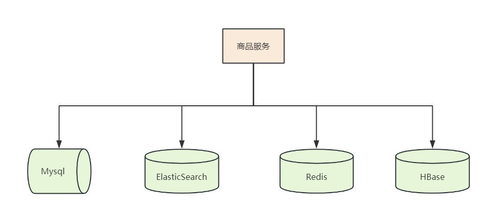

既然有了多个副本，那么，如何保持很高的数据一致性？

比如：

+ 要求 mysql 与 es 做到秒级别的数据同步。
+ 要求 mysql 与 redis 做到秒级别的数据同步。
+ 要求 mysql 与 hbase 做到秒级别的数据同步。

接下来，以 mysql 与 es 的数据一致，作为业务场景进行分析， 其他的场景比如mysql 与 redis 的数据一致性方案，都是差不多的。

### 方案一：同步双写
同步双写是一种最为简单的方式，在将数据写到 MySQL 时，同时将数据写到 ES。

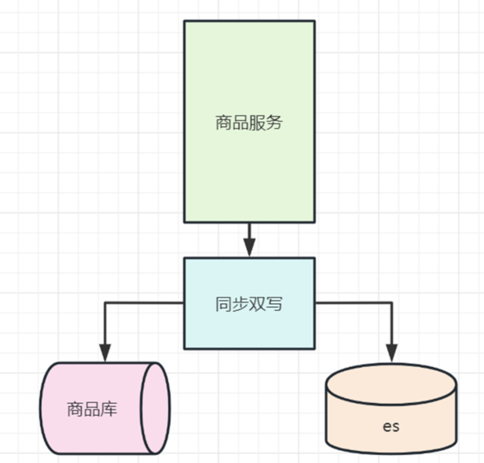

**同步双写优点：**

这种方式简单粗暴，实时写入能做到秒级。

**同步双写缺点：**

+ 业务耦合，这种方式代码侵入性强，商品的管理中耦合大量数据同步代码，要在之前写 mysql 的地方加写 es 的代码。以后写 mysql 的地方也要加写 es 的代码。
+ 影响性能，写入两个存储，响应时间变长，本来 MySQL 的性能不是很高，再加一个 ES，系统的性能必然会下降。
+ 不便扩展：搜索可能有一些个性化需求，需要对数据进行聚合，这种方式不便实现
+ 高风险：存在双写失败丢数据风险

### 方案二：异步双写
同步操作性能低，异步性能高。

异步双写，分为两种：

+ 使用内存队列（如阻塞队列）异步
+ 使用消息队列进行异步

### 方案2.1 使用内存队列（如阻塞队列）异步
先把商品数据写入DB后，然后把 数据写入 BlockingQueue 阻塞队列

消费线程异步从 drain 数据，batch 写入 ElasticSearch, 保证数据一致性

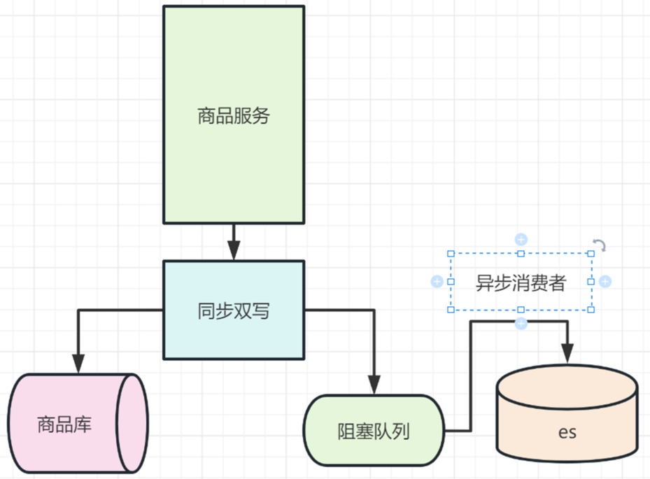

### 方案2.2 使用消息队列（如阻塞队列）异步
如果内存队列里边数据丢失，那么es 当中的数据和DB就不一致了

如果解决呢？

+ 方式1：定期同步 db数据到 es ，同步周期一般比较长，这里有比较长时间的不一致
+ 方式2：保证队列的可靠性，使用高可靠消息队列

生产场景中，一般会有一个搜索服务，由搜索服务去订阅商品变动的消息，来完成同步。

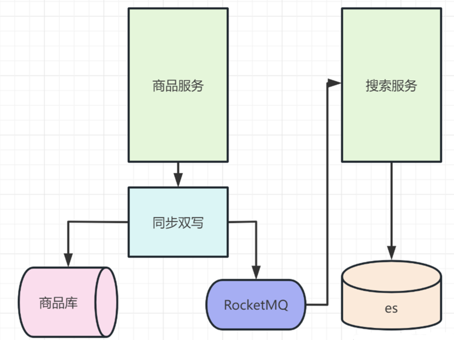

**异步双写优点：**

+ 性能高；
+ 不易出现数据丢失问题，主要基于 MQ 消息的消费保障机制，比如 ES 宕机或者写入失败，还能重新消费 MQ 消息；
+ 多源写入之间相互隔离，便于扩展更多的数据源写入。

**异步双写缺点：**

+ 硬编码问题，接入新的数据源需要实现新的消费者代码；
+ 系统复杂度增加，引入了消息中间件；
+ MQ是异步消费模型，用户写入的数据不一定可以马上看到，造成延时。

### 方案三：定期同步
为了保证 DB和ES /HBase 数据一致性，包括两个方面：

+ 增量数据一致性
+ 全量数据一致性

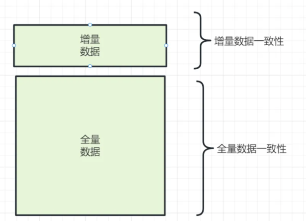

为了保证 DB和ES /HBase 的全量数据一致性， 往往需要进行定期的全量数据同步

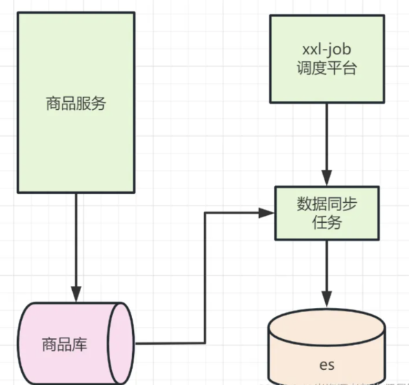

数据增量数据，很少，并且，一致性要求不高，那么可以把增量数据一致性行的 同步双写、异步双写去掉。

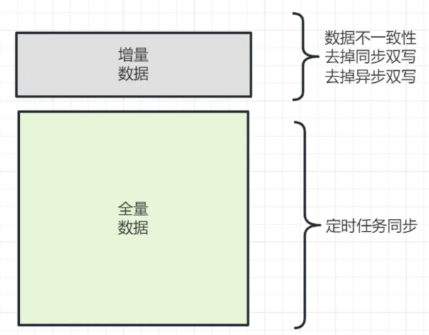

**定期同步优点：**

实现比较简单

**定期同步缺点：**

+ 实时性难以保证
+ 对存储压力较大

当然，增量数据，可以考虑用定时任务来处理：

1. 数据库的相关表中增加一个字段为 timestamp 的字段，任何 CURD 操作都会导致该字段的时间发生变化；
2. 原来程序中的 CURD 操作不做任何变化；
3. 增加一个定时器程序，让该程序按一定的时间周期扫描指定的表，把该时间段内发生变化的数据提取出来；
4. 逐条写入到 ES 中。

### 方案四：数据订阅
如果要提高实时性，又要低入侵, 可以利用 MySQL 的 Binlog 来进行同步。

MySQL通过binlog订阅实现主从同步，canal Server 是一个伪装的slave节点，接收到binlog日志后，发送到MQ, 其他的 存储消费 MQ里边 的binlog日志，实现数据订阅。

架构图如下

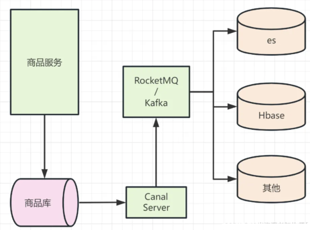

这种方式和异步双写比较像，但是有两个优点：

+ 第一降低了商品服务的入侵性，
+ 第二数据的实时性更好。

所以使用数据订阅：

+ 优点：
    - 业务入侵较少
    - 实时性较好

至于数据订阅框架的选型，主流的大体上是这些：

|     | Cancal | Maxwell | Python-Mysql-Rplication |
| --- | --- | --- | --- |
| 开源方 | 阿里巴巴 | Zendesk | 社区 |
| 开发语言 | Java | Java | Python |
| 活跃度 | 活跃 | 活跃 | 活跃 |
| 高可用 | 支持 | 支持 | 不支持 |
| 客户端 | Java/Go/PHP/Python/Rust | 无 | Python |
| 消息落地 | Kafka/RocketMQ 等 | Kafka/RabbitNQ/Redis 等 | 自定义 |
| 消息格式 | 自定义 | JSON | 自定义 |
| 文档详略 | 详细 | 详细 | 详细 |
| Boostrap | 不支持 | 支持 | 不支持 |

注意: 这种架构，存在秒级延迟。如果不允许有秒级延迟的场景，不能使用这种架构。

### 方案五：冗余表的同步双写/异步双写

**为什么要有冗余表？**

当t_order表达到500万条或2GB时需要考虑水平分表，进行水平分表需要根据某个列进行分割，假设根据userId分割。用户查询自己的订单携带着userId，因此能够定位到具体哪张表。

而商家查询者自己店铺的订单，没办法确定userId，只能访问一遍所有的分表再合并结果，效率非常低。

为了加快商家端的查询，可以冗余一份订单表，这份冗余表根据merchantId切分，商家访问冗余表，效率就很好。

这是引入冗余表的好处，坏处是我们要维护普通表和冗余表的数据一致。

#### 冗余表的同步双写实现方案
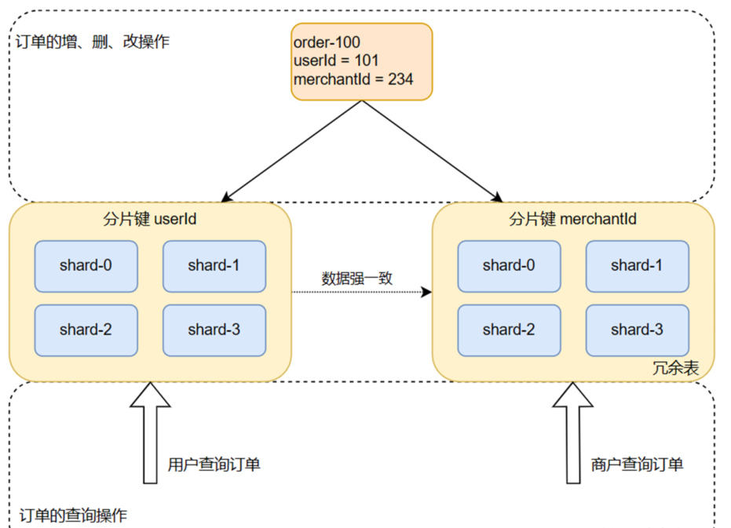

更新t_order的操作要执行两次，一次更新普通表，一次更新冗余表，写两次。优点：

+ 实现简单，由一次写变为两次写
+ 容易维护数据的一致性

缺点：

+ 代码冗余，第二次写跟第一次写的代码类似，而且每个更新的地方都要写两次
+ 请求处理时间变长

#### 冗余表的异步双写实现方案：
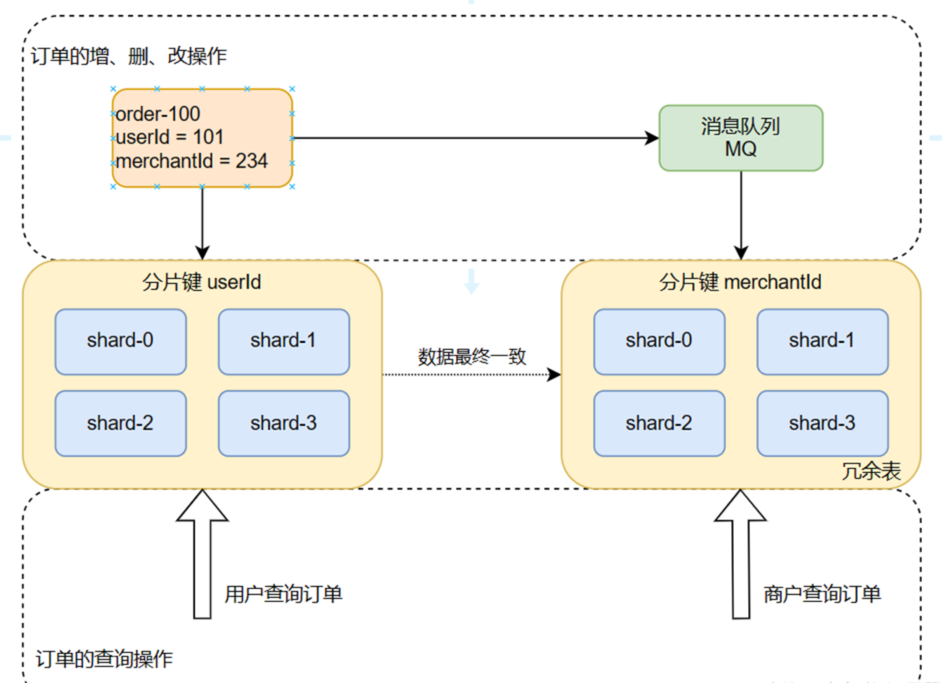

更新请求过来，写一次数据库，再发送一条消息到消息中间件，返回响应。消费者拉取消息进行写操作。优点：

+ 处理时间是单次写

缺点

+ 较复杂，引入了消息中间件
+ 不容易维护数据的一致性

### 方案六：ETL数据同步
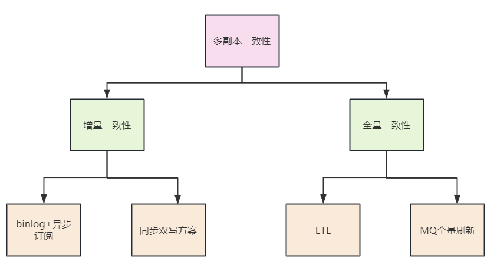

一致性分为两种：

+ 增量一致性: 前面的的双写方案，主要是保持增量数据的一致性。
+ 全量一致性: ETL数据同步主要用于同步全量数据。

MySQL数据全量同步到Redis、MySQL同步到hbase、MySQL同步到es、或机房同步、主从同步等，都可以考虑使用elt工具。

**什么是ETL 工具呢？**

ETL，是英文 Extract-Transform-Load 的缩写，用来描述将数据从来源端经过抽取（extract）、转换（transform）、加载（load）至目的端的过程。ETL一词较常用在数据仓库，但其对象并不限于数据仓库。

ETL是构建数据仓库的重要一环，用户从数据源抽取出所需的数据，经过数据清洗,最终按照预先定义好的数据仓库模型，将数据加载到数据仓库中去。

常用的etl工具有：databus、canal （方案四用了这个组件，有etl 的部分功能）、otter 、kettle 等

下面以 databus为例，介绍一下。

Databus 是一个低延迟、可靠的、支持事务的、保持一致性的数据变更抓取系统。由 LinkedIn 于 2013 年开源。

Databus 通过挖掘数据库日志的方式，将数据库变更实时、可靠的从数据库拉取出来，业务可以通过定制化 client 实时获取变更并进行其他业务逻辑。

特点：

+ 多数据源：Databus 支持多种数据来源的变更抓取，包括 Oracle 和 MySQL。
+ 可扩展、高度可用：Databus 能扩展到支持数千消费者和事务数据来源，同时保持高度可用性。
+ 事务按序提交：Databus 能保持来源数据库中的事务完整性，并按照事务分组和来源的提交顺寻交付变更事件。
+ 低延迟、支持多种订阅机制：数据源变更完成后，Databus 能在毫秒级内将事务提交给消费者。同时，消费者使用D atabus 中的服务器端过滤功能，可以只获取自己需要的特定数据。
+ 无限回溯：对消费者支持无限回溯能力，例如当消费者需要产生数据的完整拷贝时，它不会对数据库产生任何额外负担。当消费者的数据大大落后于来源数据库时，也可以使用该功能。

再看看 Databus 的系统架构。

Databus 由 Relays、bootstrap 服务和 Client lib 等组成，Bootstrap 服务中包括 Bootstrap Producer 和 Bootstrap Server。

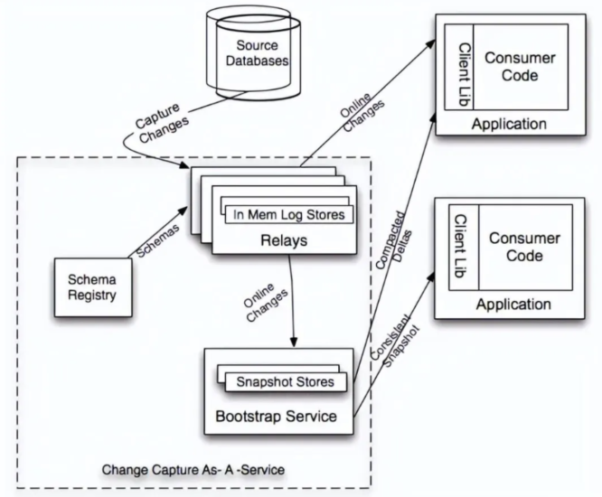

+ 快速变化的消费者直接从 Relay 中取事件；
+ 如果一个消费者的数据更新大幅落后，它要的数据就不在 Relay 的日志中，而是需要**请求 Bootstrap 服务，返回的将会是自消费者上次处理变更之后的所有数据变更快照。**

> 开源地址：https://github.com/linkedin/databus
>

> 更新: 2025-01-19 19:47:13  
> 原文: <https://www.yuque.com/u12222632/as5rgl/mhet9ozwbsngu1pw>