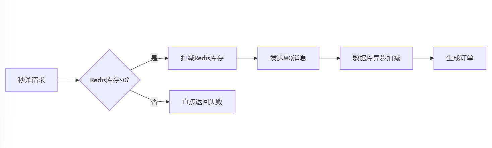

# 拼多多一面：秒杀场景下库存超卖如何解决？四大方案终极对决


### **<font style="color:rgb(36, 41, 47);">引言</font>**
<font style="color:rgb(36, 41, 47);">在电商秒杀场景中，库存超卖是致命的系统漏洞——100件商品可能被卖出1000单。</font>

### **<font style="color:rgb(36, 41, 47);">一、库存超卖的根源</font>**
**<font style="color:rgb(64, 64, 64);">超卖现象</font>**<font style="color:rgb(64, 64, 64);"> = 非原子性操作 + 并发竞争</font>

<font style="color:rgb(64, 64, 64);">典型错误流程：</font>

```java
// 伪代码漏洞示例
int stock = select stock from items where id=1; // 非原子操作
if(stock > 0){
    update items set stock=stock-1 where id=1; // 并发场景可能覆盖
}
```

<font style="color:rgb(36, 41, 47);">例如：</font>

1. <font style="color:rgb(36, 41, 47);">用户A查询库存为1，准备下单。</font>
2. <font style="color:rgb(36, 41, 47);">用户B同时查询库存也为1，同样发起扣减。</font>
3. <font style="color:rgb(36, 41, 47);">两者均扣减成功，最终库存变为-1。</font>

<font style="color:rgb(36, 41, 47);">解决核心在于：</font>**<font style="color:rgb(36, 41, 47);">加锁，让"查询库存"和"扣减库存"这两个操作成为不可分割的原子操作，可以使用分布式锁</font>**<font style="color:rgb(36, 41, 47);">。</font>

<font style="color:rgb(36, 41, 47);"></font>

## <font style="color:rgb(64, 64, 64);">二、四大分布式锁方案深度对比</font>
### <font style="color:rgb(64, 64, 64);">方案1：MySQL行锁方案</font>
**<font style="color:rgb(64, 64, 64);">实现原理</font>**

```java
BEGIN;
SELECT * FROM items WHERE id=1 FOR UPDATE; -- 行级排他锁
UPDATE items SET stock=stock-1 WHERE id=1;
COMMIT;

```

**<font style="color:rgb(64, 64, 64);">核心缺陷</font>**

+ <font style="color:rgb(64, 64, 64);">锁粒度过大：事务提交前持续持有锁</font>
+ <font style="color:rgb(64, 64, 64);">性能天花板：JDBC基准测试显示QPS<500</font>
+ <font style="color:rgb(64, 64, 64);">死锁风险：长事务易导致锁等待超时</font>

<font style="color:rgb(64, 64, 64);"></font>

### <font style="color:rgb(64, 64, 64);">方案2：MySQL乐观锁方案</font>
**<font style="color:rgb(64, 64, 64);">实现原理</font>**

```java
UPDATE items 
SET stock=stock-1, version=version+1 
WHERE id=1 AND version=#{currentVersion};
```

**<font style="color:rgb(64, 64, 64);">适用场景</font>**

+ <font style="color:rgb(64, 64, 64);">读多写少的中低并发场景（QPS<2000）</font>
+ <font style="color:rgb(64, 64, 64);">需要配合重试机制（如3次重试）</font>

<font style="color:rgb(64, 64, 64);"></font>

### <font style="color:rgb(64, 64, 64);">方案3：ZooKeeper分布式锁</font>
**<font style="color:rgb(64, 64, 64);">实现流程</font>**

1. <font style="color:rgb(64, 64, 64);">创建临时有序节点：/lock/item_001_</font>
2. <font style="color:rgb(64, 64, 64);">判断自己是否最小节点</font>
3. <font style="color:rgb(64, 64, 64);">执行业务逻辑</font>
4. <font style="color:rgb(64, 64, 64);">删除当前节点</font>

**<font style="color:rgb(64, 64, 64);">核心优势</font>**

+ <font style="color:rgb(64, 64, 64);">强一致性：基于ZAB协议</font>
+ <font style="color:rgb(64, 64, 64);">自动清理：Session断开自动删除临时节点</font>
+ <font style="color:rgb(64, 64, 64);">公平锁：顺序节点保障先到先得</font>

**<font style="color:rgb(64, 64, 64);">性能瓶颈</font>**

+ <font style="color:rgb(64, 64, 64);">创建节点耗时约2-5ms，实测QPS<3000</font>
+ <font style="color:rgb(64, 64, 64);">Watch机制导致线程阻塞</font>

<font style="color:rgb(64, 64, 64);"></font>

### <font style="color:rgb(64, 64, 64);">方案4：Redis+Lua分布式锁（生产级方案）</font>
**<font style="color:rgb(64, 64, 64);">完整实现架构</font>**

```java
# 原子加锁
SET lock_key unique_value NX PX 30000

# 原子扣减库存
local stock = redis.call('GET', KEYS[1])
if tonumber(stock) > 0 then
    redis.call('DECR', KEYS[1])
    return 'SUCCESS'
end
return 'FAIL'

# 安全解锁
if redis.call("GET",KEYS[1]) == ARGV[1] then
    return redis.call("DEL",KEYS[1])
end
```


**<font style="color:rgb(64, 64, 64);">四大优化技巧</font>**

1. <font style="color:rgb(64, 64, 64);">令牌桶预热：提前生成秒杀令牌到Redis</font>
2. <font style="color:rgb(64, 64, 64);">锁分段：将item_001拆分为item_001_01~item_001_10提升并发</font>
3. <font style="color:rgb(64, 64, 64);">锁续期：后台线程定时延长锁过期时间</font>
4. <font style="color:rgb(64, 64, 64);">熔断降级：Sentinel监控自动切换数据库</font>

## <font style="color:rgb(64, 64, 64);">三、方案性能对比（实测数据）</font>
| **方案** | **吞吐量(QPS)** | **平均耗时** | **适用场景** |
| --- | --- | --- | --- |
| <font style="color:rgb(64, 64, 64);">MySQL行锁</font> | <font style="color:rgb(64, 64, 64);">420</font> | <font style="color:rgb(64, 64, 64);">38ms</font> | <font style="color:rgb(64, 64, 64);">低频管理后台</font> |
| <font style="color:rgb(64, 64, 64);">MySQL乐观锁</font> | <font style="color:rgb(64, 64, 64);">1850</font> | <font style="color:rgb(64, 64, 64);">21ms</font> | <font style="color:rgb(64, 64, 64);">普通促销活动</font> |
| <font style="color:rgb(64, 64, 64);">ZooKeeper</font> | <font style="color:rgb(64, 64, 64);">2650</font> | <font style="color:rgb(64, 64, 64);">15ms</font> | <font style="color:rgb(64, 64, 64);">金融交易系统</font> |
| **<font style="color:rgb(64, 64, 64);">Redis+Lua</font>** | **<font style="color:rgb(64, 64, 64);">126,000</font>** | **<font style="color:rgb(64, 64, 64);">0.8ms</font>** | <font style="color:rgb(64, 64, 64);">双十一秒杀</font> |


## <font style="color:rgb(64, 64, 64);">四、生产环境避坑指南</font>
1. **<font style="color:rgb(64, 64, 64);">锁丢失问题</font>**

```java
// 错误示范（未校验锁值）
public void unlock(){
    redis.delete(lockKey); // 可能删除其他线程的锁
}

// 正确实现
public void unlock(){
    String script = 
      "if redis.call('get',KEYS[1]) == ARGV[1] then " +
      "   return redis.call('del',KEYS[1]) " +
      "else " +
      "   return 0 " +
      "end";
    redis.eval(script, lockKey, lockValue); 
}
```


2. **<font style="color:rgb(64, 64, 64);">热点Key问题</font>**
+ <font style="color:rgb(64, 64, 64);">使用本地缓存+Redis多级缓存</font>
+ <font style="color:rgb(64, 64, 64);">采用CLUSTER KEYHASH分片策略</font>

<font style="color:rgb(64, 64, 64);"></font>

3. **<font style="color:rgb(64, 64, 64);">数据一致性方案</font>**




**<font style="color:rgb(64, 64, 64);">终极结论</font>**<font style="color:rgb(64, 64, 64);">：</font>

+ <font style="color:rgb(64, 64, 64);">面试重点掌握Redis+Lua方案</font>
+ <font style="color:rgb(64, 64, 64);">实际开发建议使用Redisson客户端</font>


> 更新: 2025-02-08 04:26:49  
> 原文: <https://www.yuque.com/u12222632/as5rgl/oixigz4xnnzpim5c>