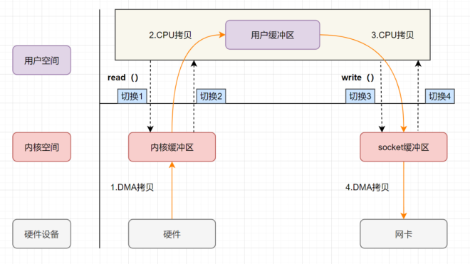
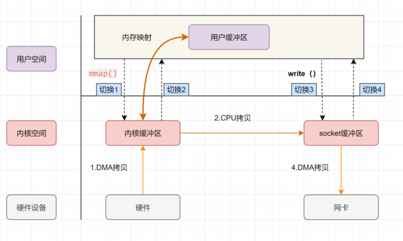
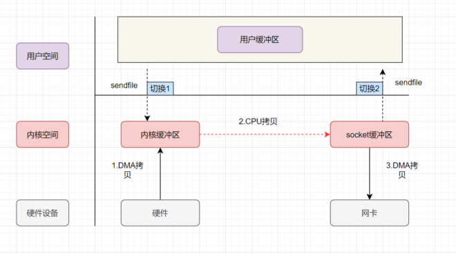
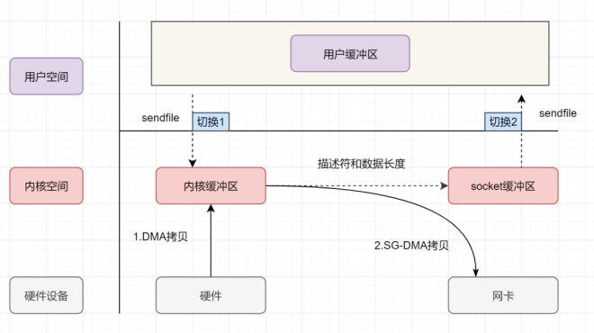
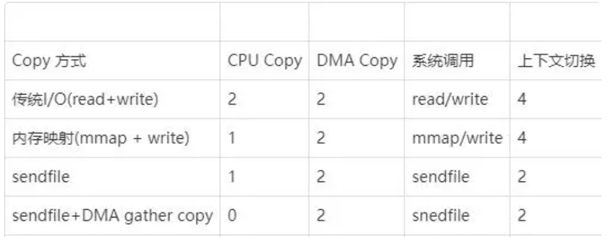

# 揭秘零拷贝，解锁高性能数据传输

# 什么是零拷贝
<font style="color:rgb(34, 34, 34);">当涉及到网络编程和IO操作时，数据拷贝是一个常见的性能瓶颈。传统的数据拷贝过程中，数据需要从内核缓冲区复制到用户空间缓冲区，然后再从用户空间缓冲区复制到内核缓冲区，这个过程会耗费大量的CPU时间和内存带宽，降低系统的性能和吞吐量。</font>

<font style="color:rgb(34, 34, 34);">为了解决这个问题，零拷贝技术应运而生。</font><font style="color:#DF2A3F;"></font>

<font style="color:#DF2A3F;">零拷贝是指计算机执行IO操作时，CPU不需要将数据从一个存储区域复制到另一个存储区域，从而可以减少上下文切换以及CPU的拷贝时间。它是一种</font>`<font style="color:#DF2A3F;">I/O</font>`<font style="color:#DF2A3F;">操作优化技术。</font>


# 传统IO的执行流程
<font style="color:rgb(51, 51, 51);">做服务端开发的小伙伴，文件下载功能应该实现过不少了吧。如果你实现的是一个</font>**<font style="color:rgb(51, 51, 51);">web程序</font>**<font style="color:rgb(51, 51, 51);">，前端请求过来，服务端的任务就是：将服务端主机磁盘中的文件从已连接的socket发出去。关键实现代码如下：</font>

```java
while((n = read(diskfd, buf, BUF_SIZE)) > 0)
  write(sockfd, buf , n);
```

<font style="color:rgb(51, 51, 51);">传统的IO流程，包括read和write的过程。</font>

+ `**<font style="color:#DF2A3F;background-color:rgb(243, 245, 249);">read</font>**`<font style="color:rgb(51, 51, 51);">：把数据从磁盘读取到内核缓冲区，再拷贝到用户缓冲区</font>
+ `**<font style="color:#DF2A3F;background-color:rgb(243, 245, 249);">write</font>**`<font style="color:rgb(51, 51, 51);">：先把数据写入到socket缓冲区，最后写入网卡设备。</font>

**<font style="color:rgb(51, 51, 51);">流程图如下：</font>**



+ <font style="color:rgb(51, 51, 51);">用户应用进程调用read函数，向操作系统发起IO调用，</font>**<font style="color:rgb(51, 51, 51);">上下文从用户态转为内核态（切换1）</font>**
+ <font style="color:rgb(51, 51, 51);">DMA控制器把数据从磁盘中，读取到内核缓冲区。</font>
+ <font style="color:rgb(51, 51, 51);">CPU把内核缓冲区数据，拷贝到用户应用缓冲区，</font>**<font style="color:rgb(51, 51, 51);">上下文从内核态转为用户态（切换2）</font>**<font style="color:rgb(51, 51, 51);">，read函数返回</font>
+ <font style="color:rgb(51, 51, 51);">用户应用进程通过write函数，发起IO调用，</font>**<font style="color:rgb(51, 51, 51);">上下文从用户态转为内核态（切换3）</font>**
+ <font style="color:rgb(51, 51, 51);">CPU将用户缓冲区中的数据，拷贝到socket缓冲区</font>
+ <font style="color:rgb(51, 51, 51);">DMA控制器把数据从socket缓冲区，拷贝到网卡设备，</font>**<font style="color:rgb(51, 51, 51);">上下文从内核态切换回用户态（切换4）</font>**<font style="color:rgb(51, 51, 51);">，write函数返回</font>

<font style="color:rgb(51, 51, 51);">从流程图可以看出，</font>**<font style="color:rgb(51, 51, 51);">传统IO的读写流程</font>**<font style="color:rgb(51, 51, 51);">，包括了4次上下文切换（4次用户态和内核态的切换），4次数据拷贝（</font>**<font style="color:rgb(51, 51, 51);">两次CPU拷贝以及两次的DMA拷贝</font>**<font style="color:rgb(51, 51, 51);">)。</font>

> <font style="color:rgb(51, 51, 51);">《零拷贝涉及的操作系统知识点》</font>[https://www.yuque.com/u12222632/as5rgl/iw0y4y9hgxfo2gfg?singleDoc#](https://www.yuque.com/u12222632/as5rgl/iw0y4y9hgxfo2gfg?singleDoc#)<font style="color:rgb(51, 51, 51);"> </font>
>

# <font style="color:rgb(0, 0, 0);">零拷贝实现的几种方式</font>
<font style="color:rgb(51, 51, 51);">零拷贝并不是没有拷贝数据，而是减少用户态/内核态的切换次数以及CPU拷贝的次数。零拷贝实现有多种方式，分别是</font>

+ <font style="color:rgb(51, 51, 51);">mmap+write</font>
+ <font style="color:rgb(51, 51, 51);">sendfile</font>
+ <font style="color:rgb(51, 51, 51);">带有DMA收集拷贝功能的sendfile</font>

## <font style="color:rgb(0, 0, 0);">mmap+write实现的零拷贝</font>
<font style="color:rgb(51, 51, 51);">mmap 的函数原型如下：</font>

**<font style="color:rgb(0, 0, 0);">代</font>**

```c
void *mmap(void *addr, size_t length, int prot, int flags, int fd, off_t offset);
```

+ <font style="color:rgb(51, 51, 51);">addr：指定映射的虚拟内存地址</font>
+ <font style="color:rgb(51, 51, 51);">length：映射的长度</font>
+ <font style="color:rgb(51, 51, 51);">prot：映射内存的保护模式</font>
+ <font style="color:rgb(51, 51, 51);">flags：指定映射的类型</font>
+ <font style="color:rgb(51, 51, 51);">fd:进行映射的文件句柄</font>
+ <font style="color:rgb(51, 51, 51);">offset:文件偏移量</font>

**<font style="color:rgb(51, 51, 51);">虚拟内存</font>**<font style="color:rgb(51, 51, 51);">可以把内核空间和用户空间的虚拟地址映射到同一个物理地址，从而减少数据拷贝次数！mmap就是用了虚拟内存这个特点，它将内核中的读缓冲区与用户空间的缓冲区进行映射，所有的IO都在内核中完成。</font>

`**<font style="color:#DF2A3F;background-color:rgb(243, 245, 249);">mmap+write</font>**`<font style="color:rgb(51, 51, 51);">实现的零拷贝流程如下：</font>



+ <font style="color:rgb(51, 51, 51);">用户进程通过</font>`**<font style="color:#DF2A3F;background-color:rgb(243, 245, 249);">mmap方法</font>**`<font style="color:rgb(51, 51, 51);">向操作系统内核发起IO调用，</font>**<font style="color:rgb(51, 51, 51);">上下文从用户态切换为内核态</font>**<font style="color:rgb(51, 51, 51);">。</font>
+ <font style="color:rgb(51, 51, 51);">CPU利用DMA控制器，把数据从硬盘中拷贝到内核缓冲区。</font>
+ **<font style="color:rgb(51, 51, 51);">上下文从内核态切换回用户态</font>**<font style="color:rgb(51, 51, 51);">，mmap方法返回。</font>
+ <font style="color:rgb(51, 51, 51);">用户进程通过</font>`<font style="color:#DF2A3F;background-color:rgb(243, 245, 249);">write</font>`<font style="color:rgb(51, 51, 51);">方法向操作系统内核发起IO调用，</font>**<font style="color:rgb(51, 51, 51);">上下文从用户态切换为内核态</font>**<font style="color:rgb(51, 51, 51);">。</font>
+ <font style="color:rgb(51, 51, 51);">CPU将内核缓冲区的数据拷贝到的socket缓冲区。</font>
+ <font style="color:rgb(51, 51, 51);">CPU利用DMA控制器，把数据从socket缓冲区拷贝到网卡，</font>**<font style="color:rgb(51, 51, 51);">上下文从内核态切换回用户态</font>**<font style="color:rgb(51, 51, 51);">，write调用返回。</font>

<font style="color:rgb(51, 51, 51);">可以发现，</font>`<font style="color:#DF2A3F;background-color:rgb(243, 245, 249);">mmap+write</font>`<font style="color:rgb(51, 51, 51);">实现的零拷贝，I/O发生了</font>**<font style="color:rgb(51, 51, 51);">4</font>**<font style="color:rgb(51, 51, 51);">次用户空间与内核空间的上下文切换，以及3次数据拷贝。其中3次数据拷贝中，包括了</font>**<font style="color:rgb(51, 51, 51);">2次DMA拷贝和1次CPU拷贝</font>**<font style="color:rgb(51, 51, 51);">。</font>

> `<font style="color:#DF2A3F;background-color:rgb(243, 245, 249);">mmap</font>`<font style="color:rgb(51, 51, 51);">是将读缓冲区的地址和用户缓冲区的地址进行映射，内核缓冲区和应用缓冲区共享，所以节省了一次CPU拷贝。并且用户进程内存是</font>**<font style="color:rgb(51, 51, 51);">虚拟的</font>**<font style="color:rgb(51, 51, 51);">，只是</font>**<font style="color:rgb(51, 51, 51);">映射</font>**<font style="color:rgb(51, 51, 51);">到内核的读缓冲区，可以节省一半的内存空间。</font>
>

## <font style="color:rgb(0, 0, 0);">sendfile实现的零拷贝</font>
`<font style="color:rgb(10, 191, 91);background-color:rgb(243, 245, 249);">sendfile</font>`<font style="color:rgb(51, 51, 51);">是Linux2.1内核版本后引入的一个系统调用函数，</font><font style="color:rgb(0, 82, 217);">API</font><font style="color:rgb(51, 51, 51);">如下：</font>

```c
ssize_t sendfile(int out_fd, int in_fd, off_t *offset, size_t count);
```

+ <font style="color:rgb(51, 51, 51);">out_fd:为待写入内容的文件描述符，一个socket描述符。</font>
+ <font style="color:rgb(51, 51, 51);">in_fd:为待读出内容的文件描述符，必须是真实的文件，不能是socket和管道。</font>
+ <font style="color:rgb(51, 51, 51);">offset：指定从读入文件的哪个位置开始读，如果为NULL，表示文件的默认起始位置。</font>
+ <font style="color:rgb(51, 51, 51);">count：指定在fdout和fdin之间传输的字节数。</font>

<font style="color:rgb(51, 51, 51);">sendfile表示在两个文件描述符之间传输数据，它是在</font>**<font style="color:rgb(51, 51, 51);">操作系统内核</font>**<font style="color:rgb(51, 51, 51);">中操作的，</font>**<font style="color:rgb(51, 51, 51);">避免了数据从内核缓冲区和用户缓冲区之间的拷贝操作</font>**<font style="color:rgb(51, 51, 51);">，因此可以使用它来实现零拷贝。</font>

<font style="color:rgb(51, 51, 51);">sendfile实现的零拷贝流程如下：</font>



<font style="color:rgb(51, 51, 51);">sendfile实现的零拷贝：</font>

1. <font style="color:rgb(51, 51, 51);">用户进程发起sendfile系统调用，</font>**<font style="color:rgb(51, 51, 51);">上下文（切换1）从用户态转向内核态</font>**
2. <font style="color:rgb(51, 51, 51);">DMA控制器，把数据从硬盘中拷贝到内核缓冲区。</font>
3. <font style="color:rgb(51, 51, 51);">CPU将读缓冲区中数据拷贝到socket缓冲区</font>
4. <font style="color:rgb(51, 51, 51);">DMA控制器，异步把数据从socket缓冲区拷贝到网卡，</font>
5. **<font style="color:rgb(51, 51, 51);">上下文（切换2）从内核态切换回用户态</font>**<font style="color:rgb(51, 51, 51);">，sendfile调用返回。</font>

<font style="color:rgb(51, 51, 51);">可以发现，</font>`**<font style="color:#DF2A3F;background-color:rgb(243, 245, 249);">sendfile</font>**`<font style="color:rgb(51, 51, 51);">实现的零拷贝，I/O发生了</font>**<font style="color:rgb(51, 51, 51);">2</font>**<font style="color:rgb(51, 51, 51);">次用户空间与内核空间的上下文切换，以及3次数据拷贝。其中3次数据拷贝中，包括了</font>**<font style="color:rgb(51, 51, 51);">2次DMA拷贝和1次CPU拷贝</font>**<font style="color:rgb(51, 51, 51);">。那能不能把CPU拷贝的次数减少到0次呢？有的，即</font>`**<font style="color:#DF2A3F;background-color:rgb(243, 245, 249);">带有DMA收集拷贝功能的sendfile</font>**`<font style="color:rgb(51, 51, 51);">！</font>

<font style="color:rgb(51, 51, 51);"></font>

## <font style="color:rgb(0, 0, 0);">sendfile+DMA scatter/gather实现的零拷贝</font>
<font style="color:rgb(0, 82, 217);">linux</font><font style="color:rgb(51, 51, 51);"> 2.4版本之后，对</font>`<font style="color:#DF2A3F;background-color:rgb(243, 245, 249);">sendfile</font>`<font style="color:rgb(51, 51, 51);">做了优化升级，引入SG-DMA技术，其实就是对DMA拷贝加入了</font>`<font style="color:#DF2A3F;background-color:rgb(243, 245, 249);">scatter/gather</font>`<font style="color:rgb(51, 51, 51);">操作，它可以直接从内核空间缓冲区中将数据读取到网卡。使用这个特点搞零拷贝，即还可以多省去</font>**<font style="color:rgb(51, 51, 51);">一次CPU拷贝</font>**<font style="color:rgb(51, 51, 51);">。</font>

<font style="color:rgb(51, 51, 51);">sendfile+DMA scatter/gather实现的零拷贝流程如下：</font>



1. <font style="color:rgb(51, 51, 51);">用户进程发起sendfile系统调用，</font>**<font style="color:rgb(51, 51, 51);">上下文（切换1）从用户态转向内核态</font>**
2. <font style="color:rgb(51, 51, 51);">DMA控制器，把数据从硬盘中拷贝到内核缓冲区。</font>
3. <font style="color:rgb(51, 51, 51);">CPU把内核缓冲区中的</font>**<font style="color:rgb(51, 51, 51);">文件描述符信息</font>**<font style="color:rgb(51, 51, 51);">（包括内核缓冲区的内存地址和偏移量）发送到socket缓冲区</font>
4. <font style="color:rgb(51, 51, 51);">DMA控制器根据文件描述符信息，直接把数据从内核缓冲区拷贝到网卡</font>
5. **<font style="color:rgb(51, 51, 51);">上下文（切换2）从内核态切换回用户态</font>**<font style="color:rgb(51, 51, 51);">，sendfile调用返回。</font>

<font style="color:rgb(51, 51, 51);">可以发现，</font>`**<font style="color:#DF2A3F;background-color:rgb(243, 245, 249);">sendfile+DMA scatter/gather</font>**`<font style="color:rgb(51, 51, 51);">实现的零拷贝，I/O发生了</font>**<font style="color:rgb(51, 51, 51);">2</font>**<font style="color:rgb(51, 51, 51);">次用户空间与内核空间的上下文切换，以及2次数据拷贝。其中2次数据拷贝都是包</font>**<font style="color:rgb(51, 51, 51);">DMA拷贝</font>**<font style="color:rgb(51, 51, 51);">。这就是真正的 </font>**<font style="color:rgb(51, 51, 51);">零拷贝（Zero-copy)</font>**<font style="color:rgb(51, 51, 51);"> 技术，全程都没有通过CPU来搬运数据，所有的数据都是通过DMA来进行传输的。</font>

<font style="color:rgb(51, 51, 51);"></font>

## <font style="color:rgb(51, 51, 51);">小结</font>
<font style="color:rgb(34, 34, 34);">无论是传统I/O拷贝方式，还是引入了零拷贝的方式，2次DMA Copy都是必要的步骤，因为两次DMA都是依赖硬件完成的。</font>




# <font style="color:rgb(34, 34, 34);">零拷贝的实际应用</font>
## <font style="color:rgb(34, 34, 34);">JavaNIO基于零拷贝的实现</font>
**<font style="color:rgb(34, 34, 34);">Java-NIO：</font>**<font style="color:rgb(34, 34, 34);">主要有三个方面用到了零拷贝技术：</font>

+ **<font style="color:rgb(34, 34, 34);">MappedByteBuffer.map()：</font>**<font style="color:rgb(34, 34, 34);">底层调用了操作系统的mmap()内核函数。</font>
+ **<font style="color:rgb(34, 34, 34);">DirectByteBuffer.allocateDirect()：</font>**<font style="color:rgb(34, 34, 34);">可以直接创建基于本地内存的缓冲区。</font>
+ **<font style="color:rgb(34, 34, 34);">FileChannel.transferFrom()/transferTo()：</font>**<font style="color:rgb(34, 34, 34);">底层调用了sendfile()内核函数。</font>

## <font style="color:rgb(34, 34, 34);">主流技术中零拷贝的应用</font>
### <font style="color:rgb(34, 34, 34);">Netty中零拷贝的应用</font>
<font style="color:rgb(34, 34, 34);">Netty中的零拷贝是一种用户进程级别的零拷贝体现，主要也包含三方面：</font>

<font style="color:rgb(34, 34, 34);">1） Netty的发送、接收数据的ByteBuf缓冲区，默认会使用堆外本地内存创建，采用直接内存进行Socket读写，数据传输时无需经过二次拷贝。如果使用传统的堆内存进行Socket网络数据读写，JVM需要先将堆内存中的数据拷贝一份到直接内存，然后才写入Socket缓冲区中，相较于堆外直接内存，消息在发送过程中多了一次缓冲区的内存拷贝。</font>

<font style="color:rgb(34, 34, 34);">2）Netty的文件传输采用了transferTo()/transferFrom()方法，它可以直接将文件缓冲区的数据发送到目标Channel（Socket），底层就是调用了sendfile()内核函数，避免了文件数据的CPU拷贝过程。</font>

<font style="color:rgb(34, 34, 34);">3）Netty提供了组合、拆解ByteBuf对象的API，咱们可以基于一个ByteBuf对象，对数据进行拆解，也可以基于多个ByteBuf对象进行数据合并，这个过程中不会出现数据拷贝，这个是程序级别的零拷贝，实际上就是在原数据的基础上用不同的引用表示而已。</font>

### <font style="color:rgb(34, 34, 34);">其他技术中的零拷贝技术应用</font>
**<font style="color:rgb(34, 34, 34);">Kafka</font>**<font style="color:rgb(34, 34, 34);">底层基于</font>**<font style="color:rgb(34, 34, 34);">java.nio</font>**<font style="color:rgb(34, 34, 34);">包下的</font>**<font style="color:rgb(34, 34, 34);">FileChannel.transferTo()</font>**<font style="color:rgb(34, 34, 34);">实现零拷贝。Kafka Server基于FileChannel将文件中的消息数据发送到SocketChannel。</font>

**<font style="color:rgb(34, 34, 34);">RocketMQ</font>**<font style="color:rgb(34, 34, 34);">基于</font>**<font style="color:rgb(34, 34, 34);">mmap + write</font>**<font style="color:rgb(34, 34, 34);">的方式实现零拷贝。内部实现基于nio提供的java.nio.MappedByteBuffer，基于FileChannel的map方法得到mmap的缓冲区。</font>


> 更新: 2024-12-20 16:13:52  
> 原文: <https://www.yuque.com/u12222632/as5rgl/gr0n4lk5g534rhbs>