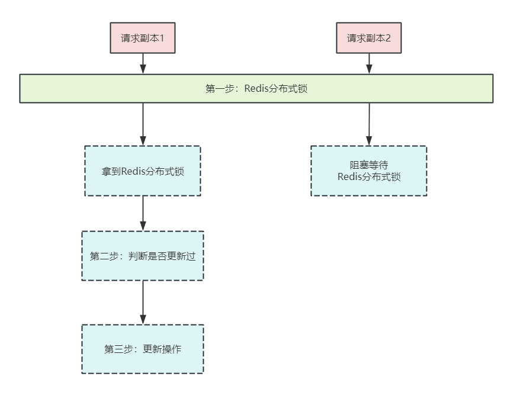

# 最系统的幂等性方案：一锁二判三更新

<font style="color:rgba(0, 0, 0, 0.9);">最近又有小伙伴在面试阿里、网易，都遇到了幂等性相关的面试题。</font>

> <font style="color:rgb(119, 119, 119);">问题1：你们项目，怎么做幂等设计的？</font>
>
> <font style="color:rgb(119, 119, 119);">问题2：接口的幂等性，怎么设计？</font>
>
> <font style="color:rgb(119, 119, 119);">问题3：业务订单的幂等性，怎么设计？</font>
>
> <font style="color:rgb(119, 119, 119);">问题4：付款请求的幂等性，怎么设计？</font>
>
> <font style="color:rgb(119, 119, 119);">问题5：前端重复提交选中的数据，后台只产生一次有效操作，怎么设计？</font>
>

<font style="color:rgba(0, 0, 0, 0.9);">很多小伙伴回答了一些边边角角，但是回答不全面不体系，面试官不满意，面试挂了。</font>

<font style="color:rgba(0, 0, 0, 0.9);"></font>

## 1.什么是幂等性？
<font style="color:rgba(0, 0, 0, 0.9);">所谓幂等性，就是</font>**<font style="color:rgba(0, 0, 0, 0.9);">一次操作和多次操作同一个资源，所产生的影响均与一次操作的影响相同。</font>**

<font style="color:rgba(0, 0, 0, 0.9);">"幂等（idempotent、idempotence）是一个数学与计算机学概念，常见于抽象代数中。</font>

<font style="color:rgba(0, 0, 0, 0.9);">幂等函数，或幂等方法，是指可以使用相同参数重复执行，并能获得相同结果的函数。</font>

<font style="color:rgba(0, 0, 0, 0.9);">幂等性，用数学语言表达就是：</font>

```sql
f(x)=f(f(x))
```

<font style="color:rgba(0, 0, 0, 0.9);">在软件或者系统中，重复使用幂等函数或幂等方法不会影响系统状态，也不用担心重复执行会对系统造成改变。</font>

**<font style="color:rgba(0, 0, 0, 0.9);">通俗点说：</font>**

**<font style="color:rgba(0, 0, 0, 0.9);">一个接口如果幂等，不管被调多少次，只要参数不变，结果也不变。</font>**

**<font style="color:rgba(0, 0, 0, 0.9);"></font>**

## 2.为什么需要幂等性？
<font style="color:rgba(0, 0, 0, 0.9);">如果客户端重复调用，服务端会遇到如下的很多问题：</font>

1. <font style="color:black;">创建订单时，重复调用是否产生两笔订单？</font>
2. <font style="color:black;">扣减库存时，重复调用是否会多扣一次？</font>

<font style="color:rgba(0, 0, 0, 0.9);">这就是出现了幂等性问题。</font>

<font style="color:rgba(0, 0, 0, 0.9);">按照幂等性要求，需要保证一次请求和多次请求同一个资源产生相同的副作用。</font>

<font style="color:rgba(0, 0, 0, 0.9);">所以：创建订单时，重复调用是否产生两笔订单？当然不能。</font>

<font style="color:rgba(0, 0, 0, 0.9);">所以：扣减库存时，重复调是否会多扣一次？当然不能。</font>

<font style="color:rgba(0, 0, 0, 0.9);">这些，都是需要幂等性机制去保障。如果不支持幂等操作，那将会出现以下情况：</font>

+ <font style="color:rgb(1, 1, 1);">电商超卖现象</font>
+ <font style="color:rgb(1, 1, 1);">重复转账、扣款或付款</font>
+ <font style="color:rgb(1, 1, 1);">重复增加金币、积分或优惠券</font>

<font style="color:rgba(0, 0, 0, 0.9);">等等，非常惨的。</font>

<font style="color:rgba(0, 0, 0, 0.9);"></font>

## 3.什么样的原因导致幂等性问题？
### 原因之一：底层网络阻塞和延迟的问题
+ 在系统高并发的环境下，很有可能因为网络阻塞等等问题，导致客户端不能及时的收到服务端响应，甚至是调用超时。这时候用户会重复点击，重复请求。
+ <font style="color:rgba(0, 0, 0, 0.9);">在消息队列组件中，客户端也有重试机制，如果投递失败/投递超时，则会重新投递。对于服务端来说，可能会收到重复投递的一份消息。</font>
+ <font style="color:rgba(0, 0, 0, 0.9);">在RPC组件中，客户端也有重试机制，如果投递失败/投递超时，则会重试调用。对于服务端来说，可能会重复收到通用的调用。</font>

### <font style="color:rgba(0, 0, 0, 0.9);">原因之二：用户层面的重复操作</font>
<font style="color:rgba(0, 0, 0, 0.9);">比如下单的按键在点按之后，在没有收到服务器请求之前，用户还可以被按。</font>

<font style="color:rgba(0, 0, 0, 0.9);">或者，用户的App闪退/人工强退，之后重新打开重新下单</font>

<font style="color:rgba(0, 0, 0, 0.9);"></font>

## <font style="color:rgba(0, 0, 0, 0.9);">4.需要幂等性的 两大场景</font>
<font style="color:rgba(0, 0, 0, 0.9);">可能会发生重复请求或重试操作的场景，在分布式、微服务架构中是随处可见的。</font>

+ **<font style="color:rgba(0, 0, 0, 0.9);">网络波动</font>**<font style="color:rgba(0, 0, 0, 0.9);">：因网络波动，可能会引起重复请求</font>
+ **<font style="color:rgba(0, 0, 0, 0.9);">分布式消息消费</font>**<font style="color:rgba(0, 0, 0, 0.9);">：任务发布后，使用分布式消息服务来进行消费</font>
+ **<font style="color:rgba(0, 0, 0, 0.9);">用户重复操作</font>**<font style="color:rgba(0, 0, 0, 0.9);">：用户在使用产品时，可能无意地触发多笔交易，甚至没有响应而有意触发多笔交易</font>
+ **<font style="color:rgba(0, 0, 0, 0.9);">未关闭的重试机制</font>**<font style="color:rgba(0, 0, 0, 0.9);">：因开发人员、测试人员或运维人员没有检查出来，而开启的重试机制（如Nginx重试、RPC通信重试或业务层重试等）</font>

<font style="color:rgba(0, 0, 0, 0.9);">大致可以分为两大类：</font>

+ <font style="color:rgba(0, 0, 0, 0.9);">第一类：</font>**<font style="color:rgba(0, 0, 0, 0.9);">单数据CRUD操作的幂等性保证方案</font>**
+ <font style="color:rgba(0, 0, 0, 0.9);">第二类：</font>**<font style="color:rgba(0, 0, 0, 0.9);">多数据并发操作的幂等性保证方案</font>**

### <font style="color:rgba(0, 0, 0, 0.9);">第一类：单数据CRUD操作的幂等性保证方案</font>
<font style="color:rgba(0, 0, 0, 0.9);">首先，来看看单数据CRUD操作的幂等性保证方案</font>

<font style="color:rgba(0, 0, 0, 0.9);">对于单数据CRUD操作，很多具备天然幂等性</font>

+ <font style="color:rgba(0, 0, 0, 0.9);">新增类动作：不具备幂等性</font>
+ <font style="color:rgba(0, 0, 0, 0.9);">查询类动作：重复查询不会产生或变更新的数据，查询具有天然幂等性</font>
+ <font style="color:rgba(0, 0, 0, 0.9);">更新类动作：</font>
    - <font style="color:rgba(0, 0, 0, 0.9);">基于主键的计算式Update，不具备幂等性，即</font>**<font style="color:rgba(0, 0, 0, 0.9);">UPDATE goods SET number=number-1 WHERE id=1</font>**
    - <font style="color:rgba(0, 0, 0, 0.9);">基于主键的非计算式Update：具备幂等性，即</font>**<font style="color:rgba(0, 0, 0, 0.9);">UPDATE goods SET number=newNumber WHERE id=1</font>**
    - <font style="color:rgba(0, 0, 0, 0.9);">基于条件查询的Update，不一定具备幂等性（需要根据实际情况进行分析判断）</font>
+ <font style="color:rgba(0, 0, 0, 0.9);">删除类动作：</font>
    - <font style="color:rgba(0, 0, 0, 0.9);">基于主键的Delete具备幂等性</font>
    - <font style="color:rgba(0, 0, 0, 0.9);">一般业务层面都是逻辑删除（即update操作），而基于主键的逻辑删除操作也是具有幂等性的</font>

<font style="color:rgba(0, 0, 0, 0.9);">大家看到，对于单数据CRUD操作， 只有在下面的三个场景，保证幂等即可：</font>

+ <font style="color:rgba(0, 0, 0, 0.9);">主键的计算式Update</font>
+ <font style="color:rgba(0, 0, 0, 0.9);">基于条件查询的Update</font>
+ <font style="color:rgba(0, 0, 0, 0.9);">新增类动作</font>

## <font style="color:rgba(0, 0, 0, 0.9);">第二类：多数据并发操作的幂等性保证方案</font>
<font style="color:rgba(0, 0, 0, 0.9);">大部分，都是这种场景。</font>

<font style="color:rgba(0, 0, 0, 0.9);">现在的应用，大部分都是微服务的。并且一个操作会涉及到多个数据的并发操作，会通过RPC调用到多个微服务。</font>

<font style="color:rgba(0, 0, 0, 0.9);">分为两种情况：</font>

+ <font style="color:rgba(0, 0, 0, 0.9);">多数据同步操作，一般是服务端提供一个统一的同步操作api，客户端调用该api完成，直接获得操作结果。</font>
+ <font style="color:rgba(0, 0, 0, 0.9);">多数据异步操作，由于同步操作性能低，在高并发场景都会同步变异步，于是乎，服务端还要额外提供一个查询操作结果的api，去查询结果。第一次超时之后，调用方调用查询接口，如果查到了就走成功的流程，失败了就走失败的流程。</font>

<font style="color:rgba(0, 0, 0, 0.9);"></font>

**<font style="color:rgba(0, 0, 0, 0.9);">多数据并发操作的经典场景，参考如下：</font>**

1. **<font style="color:rgba(0, 0, 0, 0.9);">高并发抢红包</font>**<font style="color:rgba(0, 0, 0, 0.9);">  
</font><font style="color:rgba(0, 0, 0, 0.9);">在抢一份红包的时候，点击了抢，开始异步抢红包。抢到就有，没抢到就没有。抢完之后，无论我们重复点击多少次，红包都会提示你已经抢过该红包了。</font>
2. **<font style="color:rgba(0, 0, 0, 0.9);">高并发下单</font>**<font style="color:rgba(0, 0, 0, 0.9);">  
</font><font style="color:rgba(0, 0, 0, 0.9);">高并发下单的一个很基本的问题，就是要避免重复订单。如果用户操作一次，由于超时重试等原因，一看下了两个单，甚至10个重复单。用户不晕倒在厕所才怪。</font>
3. **<font style="color:rgba(0, 0, 0, 0.9);">高并发支付</font>**<font style="color:rgba(0, 0, 0, 0.9);">  
</font><font style="color:rgba(0, 0, 0, 0.9);">在支付场景，支付平台会生成唯一的支付连接，不会再次生成另外的支付连接。</font>

[**双十一支付宝突发故障引网友热议：订单重复扣款，官方紧急回应并修复**](https://baijiahao.baidu.com/s?id=1815413654919559320&wfr=spider&for=pc)

**<font style="color:rgba(0, 0, 0, 0.9);"></font>**

## 5.如何保证幂等呢 ？
<font style="color:rgba(0, 0, 0, 0.9);">幂等性的的确保方案，非常多，大致如下图所示</font>


### <font style="color:rgb(30, 30, 30);background-color:rgb(212, 224, 250);">一些基础性的幂等性解决方案</font>
#### **<font style="color:rgba(0, 0, 0, 0.9);">全局唯一ID</font>**
<font style="color:rgba(0, 0, 0, 0.9);">如果使用全局唯一ID，就是</font>**<font style="color:rgba(0, 0, 0, 0.9);">根据业务的操作和内容生成一个全局ID</font>**<font style="color:rgba(0, 0, 0, 0.9);">，在执行操作前先根据这个全局唯一ID是否存在，来判断这个操作是否已经执行。</font>

<font style="color:rgba(0, 0, 0, 0.9);">如果不存在则把全局ID，存储到存储系统中，比如数据库、Redis等。如果存在则表示该方法已经执行。</font>

<font style="color:rgba(0, 0, 0, 0.9);">使用全局唯一ID是一个通用方案，可以支持插入、更新、删除业务操作。</font>

<font style="color:rgba(0, 0, 0, 0.9);">一般情况下，对分布式的全局唯一id，可以参考以下几种方式：</font>

+ <font style="color:rgb(1, 1, 1);">UUID</font>
+ <font style="color:rgb(1, 1, 1);">Snowflake</font>
+ <font style="color:rgb(1, 1, 1);">数据库自增ID</font>
+ <font style="color:rgb(1, 1, 1);">业务本身的唯一约束</font>
+ <font style="color:rgb(1, 1, 1);">业务字段+时间戳拼接</font>

**<font style="color:rgba(0, 0, 0, 0.9);"></font>**

#### **<font style="color:rgba(0, 0, 0, 0.9);">唯一索引(去重表)</font>**
<font style="color:rgba(0, 0, 0, 0.9);">这种方法适用于在业务中有唯一标识的插入场景中，比如在以上的支付场景中，如果一个订单只会支付一次，所以</font>**<font style="color:rgba(0, 0, 0, 0.9);">订单ID可以作为唯一标识</font>**<font style="color:rgba(0, 0, 0, 0.9);">。</font>

<font style="color:rgba(0, 0, 0, 0.9);">这时，我们就可以建一张去重表，并且把唯一标识作为唯一索引，在我们实现时，把创建支付单据写入去重表，放在一个事务中，</font>**<font style="color:rgba(0, 0, 0, 0.9);">如果重复创建，数据库会抛出唯一约束异常</font>**<font style="color:rgba(0, 0, 0, 0.9);">，操作就会回滚。</font>

#### **<font style="color:rgba(0, 0, 0, 0.9);">插入或更新（upsert）</font>**
<font style="color:rgba(0, 0, 0, 0.9);">这种方法插入并且有唯一索引的情况，比如我们要关联商品品类，其中商品的ID和品类的ID可以构成唯一索引，并且在数据表中也增加了唯一索引。这时就可以使用InsertOrUpdate操作。</font>

#### **<font style="color:rgba(0, 0, 0, 0.9);">多版本控制</font>**
<font style="color:rgba(0, 0, 0, 0.9);">这种方法适合在更新的场景中，比如我们要更新商品的名字，这时我们就可以在更新的接口中增加一个版本号，来做幂等：</font>

```sql
boolean updateGoodsName(int id,String newName,int version);
```

<font style="color:rgba(0, 0, 0, 0.9);">在实现时可以如下：</font>

```sql
update goods set name=#{newName},version=#{version} where id=#{id} and version<${version}
```

**<font style="color:rgba(0, 0, 0, 0.9);"></font>**

#### **<font style="color:rgba(0, 0, 0, 0.9);">状态机控制</font>**
<font style="color:rgba(0, 0, 0, 0.9);">这种方法适合在有状态机流转的情况下，比如就会订单的创建和付款，订单的付款肯定是在之前，这时我们可以通过在设计状态字段时，使用int类型，并且通过值类型的大小来做幂等，比如订单的创建为0，付款成功为100，付款失败为99。</font>

<font style="color:rgba(0, 0, 0, 0.9);">在做状态机更新时，我们就可以这样控制：</font>

```sql
update goods_order set status=#{status} where id=#{id} and status<#{status}
```

<font style="color:rgba(0, 0, 0, 0.9);">以上就是保证接口幂等性的一些方法。</font>

### <font style="color:rgb(30, 30, 30);background-color:rgb(212, 224, 250);">综合性的解决方案：一锁二判三更新</font>
<font style="color:rgba(0, 0, 0, 0.9);">前面的方案，都是一些基础性的方案。</font>

<font style="color:rgba(0, 0, 0, 0.9);">在实际的业务中，一般会结合起来使用。</font>

<font style="color:rgba(0, 0, 0, 0.9);">在双11和双12的活动中，对于幂等性问题，支付宝团队摸索出来了一个综合性的解决方案：一锁二判三更新。这个方案，可以作为一个比较通用的综合性的幂等解决方案。</font>

<font style="color:rgba(0, 0, 0, 0.9);">何为“一锁二判三更新”？</font>

<font style="color:rgba(0, 0, 0, 0.9);">简单来说就是当任何一个并发请求过来的时候</font>

+ <font style="color:rgb(1, 1, 1);">1. 先锁定单据</font>
+ <font style="color:rgb(1, 1, 1);">2. </font><font style="color:rgb(1, 1, 1);">然后判断单据状态，是否之前已经更新过对应状态了</font>
+ <font style="color:black;">3.1  如果之前并没有更新，则本次请求可以更新，并完成相关业务逻辑。</font>
+ <font style="color:black;">3.2  如果之前已经有更新，则本次不能更新，也不能完成业务逻辑。</font>

**<font style="color:rgba(0, 0, 0, 0.9);">  
</font>****<font style="color:rgba(0, 0, 0, 0.9);"> </font>**

## 6.一锁、二判、三更性的核心步骤
### <font style="color:rgb(30, 30, 30);background-color:rgb(212, 224, 250);">第一步：先加锁。</font>
<font style="color:rgba(0, 0, 0, 0.9);">高并发场景，建议是redis分布式锁，而不是低性能的DB锁，也不是CP型的 Zookeeper锁。</font>

<font style="color:rgba(0, 0, 0, 0.9);">如果普通的redis分布式锁性能太低，该如何？</font>

<font style="color:rgba(0, 0, 0, 0.9);">还可以考虑引入 锁的分段机制， 比如内部分成100段，总体上，就大概能线性提升 100倍。</font>

### <font style="color:rgb(30, 30, 30);background-color:rgb(212, 224, 250);">第二步：进行幂等性判断。</font>
<font style="color:rgba(0, 0, 0, 0.9);">幂等性判断，就是 进行 数据检查。</font>

<font style="color:rgba(0, 0, 0, 0.9);">可以基于状态机、流水表、唯一性索引等等前面介绍的 基础方案，进行重复操作的判断。</font>

### <font style="color:rgb(30, 30, 30);background-color:rgb(212, 224, 250);">第三步：数据更新</font>
<font style="color:rgba(0, 0, 0, 0.9);">如果通过了第二步的幂等性判断， 说明之前没有执行过更新操作。</font>

<font style="color:rgba(0, 0, 0, 0.9);">那么就进入第三步，进行数据的更新，将数据进行持久化。</font>

<font style="color:rgba(0, 0, 0, 0.9);">操作完成之后， 记得释放锁， 结束整个流程。</font>


> 更新: 2024-12-06 10:19:03  
> 原文: <https://www.yuque.com/u12222632/as5rgl/xgfgz6gw2ry327h0>