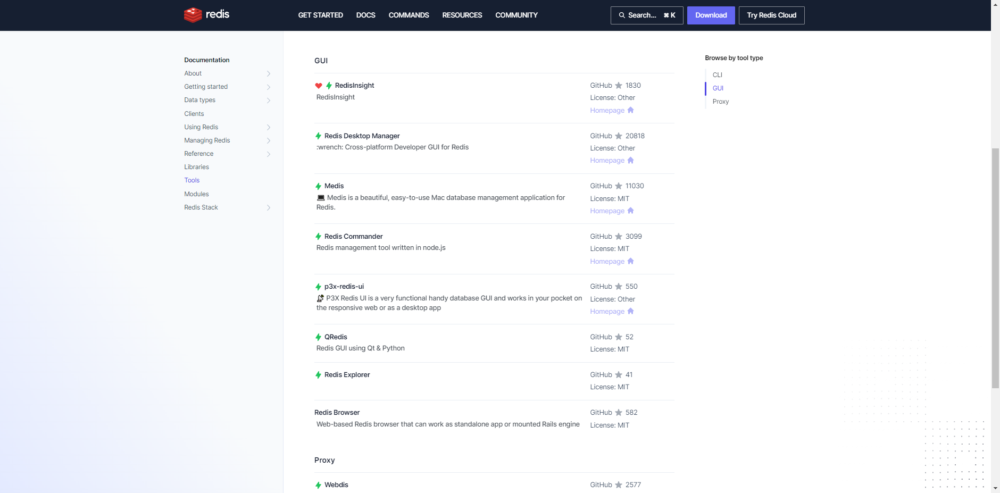
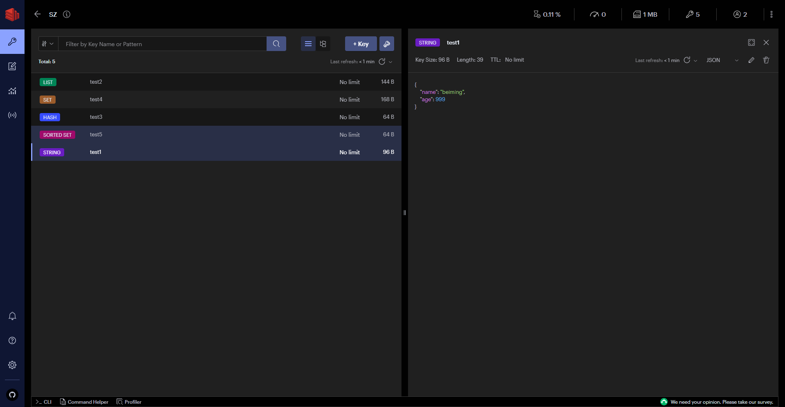
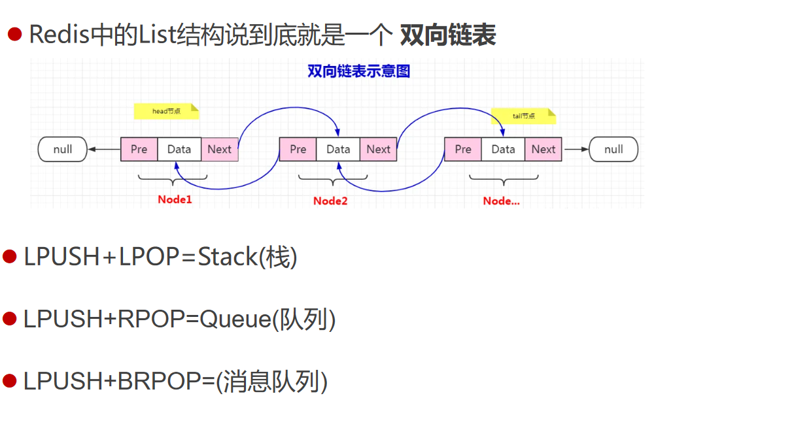
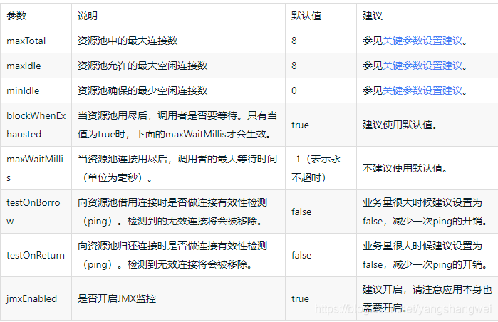
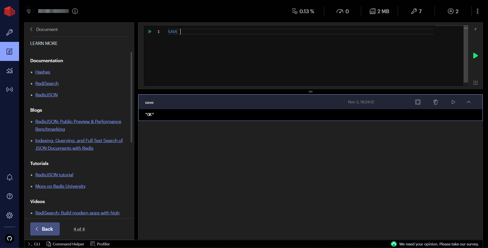
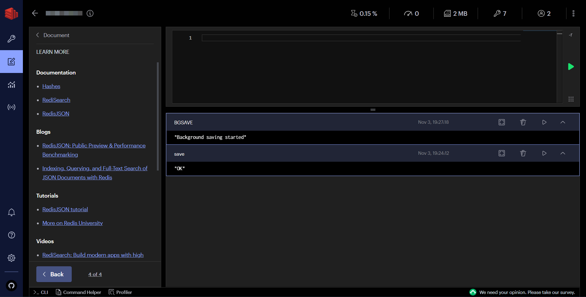
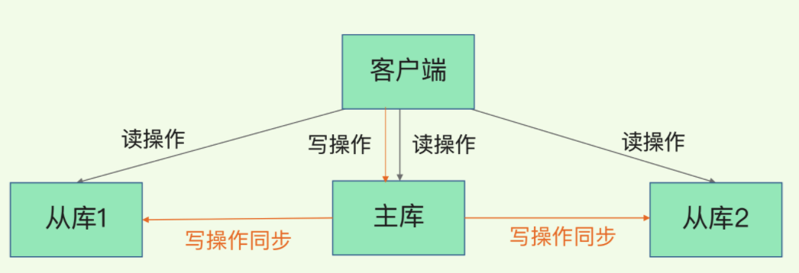
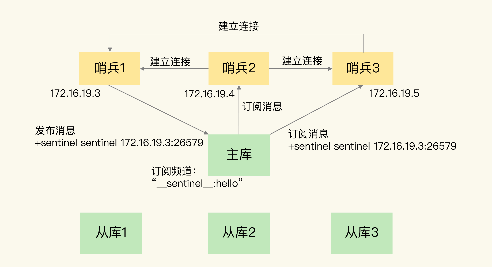
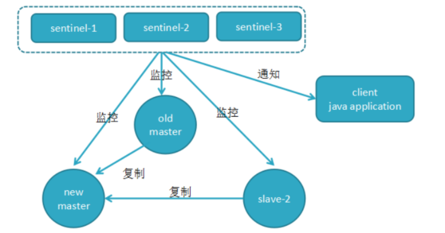

# 深入浅出Redis7

# 基础篇
## NoSQL及Redis介绍
在介绍Redis之前首先我们来谈谈NoSQL，这里的No并不是指“不”的意思，而是<font style="color:rgb(51, 51, 51);">“Not Only”指的是非关系型数据库，我们从字面意思就能够看出来“不仅是SQL”，实际上NoSQL是来弥补关系型数据库在某些场景下不足。</font>

<font style="color:rgb(51, 51, 51);">区别于关系型数据库比如我们常见的MySQL、Oracle等，其中最明显的区别就是非关系型数据库不保证ACID特性。</font>

<font style="color:rgb(51, 51, 51);">那么在NoSQL中也分了几种类型的数据库：</font>

| **<font style="color:rgb(51, 51, 51);">分类</font>** | **<font style="color:rgb(51, 51, 51);">Examples举例</font>** | **<font style="color:rgb(51, 51, 51);">典型应用场景</font>** | **<font style="color:rgb(51, 51, 51);">数据模型</font>** | **<font style="color:rgb(51, 51, 51);">优点</font>** | **<font style="color:rgb(51, 51, 51);">缺点</font>** |
| --- | --- | --- | --- | --- | --- |
| **<font style="color:rgb(51, 51, 51);">键值（key-value）</font>** | <font style="color:rgb(51, 51, 51);">Tokyo Cabinet/Tyrant， Redis， Voldemort， Oracle BDB</font> | <font style="color:rgb(51, 51, 51);">内容缓存，主要用于处理大量数据的高访问负载，也用于一些日志系统等等。</font> | <font style="color:rgb(51, 51, 51);">Key 指向 Value 的键值对，通常用hash table来实现</font> | <font style="color:rgb(51, 51, 51);">查找速度快</font> | <font style="color:rgb(51, 51, 51);">数据无结构化，通常只被当作字符串或者二进制数据</font> |
| **<font style="color:rgb(51, 51, 51);">列存储数据库</font>** | <font style="color:rgb(51, 51, 51);">Cassandra， HBase， Riak</font> | <font style="color:rgb(51, 51, 51);">分布式的文件系统</font> | <font style="color:rgb(51, 51, 51);">以列簇式存储，将同一列数据存在一起</font> | <font style="color:rgb(51, 51, 51);">查找速度快，可扩展性强，更容易进行分布式扩展</font> | <font style="color:rgb(51, 51, 51);">功能相对局限</font> |
| **<font style="color:rgb(51, 51, 51);">文档型数据库</font>** | <font style="color:rgb(51, 51, 51);">CouchDB， MongoDb</font> | <font style="color:rgb(51, 51, 51);">Web应用（与Key-Value类似，Value是结构化的，不同的是数据库能够了解Value的内容）</font> | <font style="color:rgb(51, 51, 51);">Key-Value对应的键值对，Value为结构化数据</font> | <font style="color:rgb(51, 51, 51);">数据结构要求不严格，表结构可变，不需要像关系型数据库一样需要预先定义表结构</font> | <font style="color:rgb(51, 51, 51);">查询性能不高，而且缺乏统一的查询语法。</font> |
| **<font style="color:rgb(51, 51, 51);">图形(Graph)数据库</font>** | <font style="color:rgb(51, 51, 51);">Neo4J， InfoGrid， Infinite Graph</font> | <font style="color:rgb(51, 51, 51);">社交网络，推荐系统等。专注于构建关系图谱</font> | <font style="color:rgb(51, 51, 51);">图结构</font> | <font style="color:rgb(51, 51, 51);">利用图结构相关算法。比如最短路径寻址，N度关系查找等</font> | <font style="color:rgb(51, 51, 51);">很多时候需要对整个图做计算才能得出需要的信息，而且这种结构不太好做分布式的集群方案。</font> |


> **Redis是一个开源内存数据结构存储器，经常用作数据库、缓存以及消息代理等。**
>

**优势**

+ **区别于关系型数据库，它提供了非常丰富的存储结构（String、List、Hash、Set、SortedSet等）**
+ **访问速度快，这主要得益于内存存储，高效的存储结构设计（压缩表，跳表等）**
+ **社区活跃（简洁的API、丰富的文档、活跃的社区）**

## Redis安装部署及启动
请大家记住这个官网网址：[https://redis.io/](https://redis.io/)

介于大部分同学没有Linux和Mac环境，那么我今天讲带领大家在我们的windows环境进行一个安装。

Redis本身没有官方支持windows，但是官网给我们提供了一直方式，通过WSL2来<font style="color:rgb(37, 37, 37);">让我们在Windows中运行Linux二进制程序。它的前置条件是需要运行Windows 10 version 2004或更高的Windows 11。</font>

#### <font style="color:rgb(37, 37, 37);">Windows安装WSL参考链接</font>
[https://learn.microsoft.com/en-us/windows/wsl/install](https://learn.microsoft.com/en-us/windows/wsl/install)

[https://learn.microsoft.com/zh-cn/windows/wsl/install-manual#step-4---download-the-linux-kernel-update-package](https://learn.microsoft.com/zh-cn/windows/wsl/install-manual#step-4---download-the-linux-kernel-update-package)

#### 安装Redis
```bash
curl -fsSL https://packages.redis.io/gpg | sudo gpg --dearmor -o /usr/share/keyrings/redis-archive-keyring.gpg

echo "deb [signed-by=/usr/share/keyrings/redis-archive-keyring.gpg] https://packages.redis.io/deb $(lsb_release -cs) main" | sudo tee /etc/apt/sources.list.d/redis.list

sudo apt-get update
sudo apt-get install redis
sudo service redis-server start
```

#### Redis配置文件
```yaml
# Redis configuration file example.
#
# Note that in order to read the configuration file, Redis must be
# started with the file path as first argument:
#
# ./redis-server /path/to/redis.conf

# Note on units: when memory size is needed, it is possible to specify
# it in the usual form of 1k 5GB 4M and so forth:
#
# 1k => 1000 bytes
# 1kb => 1024 bytes
# 1m => 1000000 bytes
# 1mb => 1024*1024 bytes
# 1g => 1000000000 bytes
# 1gb => 1024*1024*1024 bytes
#
# units are case insensitive so 1GB 1Gb 1gB are all the same.

################################## INCLUDES ###################################

# Include one or more other config files here.  This is useful if you
# have a standard template that goes to all Redis servers but also need
# to customize a few per-server settings.  Include files can include
# other files, so use this wisely.
#
# Note that option "include" won't be rewritten by command "CONFIG REWRITE"
# from admin or Redis Sentinel. Since Redis always uses the last processed
# line as value of a configuration directive, you'd better put includes
# at the beginning of this file to avoid overwriting config change at runtime.
#
# If instead you are interested in using includes to override configuration
# options, it is better to use include as the last line.
#
# Included paths may contain wildcards. All files matching the wildcards will
# be included in alphabetical order.
# Note that if an include path contains a wildcards but no files match it when
# the server is started, the include statement will be ignored and no error will
# be emitted.  It is safe, therefore, to include wildcard files from empty
# directories.
#
# include /path/to/local.conf
# include /path/to/other.conf
# include /path/to/fragments/*.conf
#

################################## MODULES #####################################

# Load modules at startup. If the server is not able to load modules
# it will abort. It is possible to use multiple loadmodule directives.
#
# loadmodule /path/to/my_module.so
# loadmodule /path/to/other_module.so

################################## NETWORK #####################################

# By default, if no "bind" configuration directive is specified, Redis listens
# for connections from all available network interfaces on the host machine.
# It is possible to listen to just one or multiple selected interfaces using
# the "bind" configuration directive, followed by one or more IP addresses.
# Each address can be prefixed by "-", which means that redis will not fail to
# start if the address is not available. Being not available only refers to
# addresses that does not correspond to any network interface. Addresses that
# are already in use will always fail, and unsupported protocols will always BE
# silently skipped.
#
# Examples:
#
# bind 192.168.1.100 10.0.0.1     # listens on two specific IPv4 addresses
# bind 127.0.0.1 ::1              # listens on loopback IPv4 and IPv6
# bind * -::*                     # like the default, all available interfaces
#
# ~~~ WARNING ~~~ If the computer running Redis is directly exposed to the
# internet, binding to all the interfaces is dangerous and will expose the
# instance to everybody on the internet. So by default we uncomment the
# following bind directive, that will force Redis to listen only on the
# IPv4 and IPv6 (if available) loopback interface addresses (this means Redis
# will only be able to accept client connections from the same host that it is
# running on).
#
# IF YOU ARE SURE YOU WANT YOUR INSTANCE TO LISTEN TO ALL THE INTERFACES
# COMMENT OUT THE FOLLOWING LINE.
#
# You will also need to set a password unless you explicitly disable protected
# mode.
# ~~~~~~~~~~~~~~~~~~~~~~~~~~~~~~~~~~~~~~~~~~~~~~~~~~~~~~~~~~~~~~~~~~~~~~~~
bind 127.0.0.1 -::1

# By default, outgoing connections (from replica to master, from Sentinel to
# instances, cluster bus, etc.) are not bound to a specific local address. In
# most cases, this means the operating system will handle that based on routing
# and the interface through which the connection goes out.
#
# Using bind-source-addr it is possible to configure a specific address to bind
# to, which may also affect how the connection gets routed.
#
# Example:
#
# bind-source-addr 10.0.0.1

# Protected mode is a layer of security protection, in order to avoid that
# Redis instances left open on the internet are accessed and exploited.
#
# When protected mode is on and the default user has no password, the server
# only accepts local connections from the IPv4 address (127.0.0.1), IPv6 address
# (::1) or Unix domain sockets.
#
# By default protected mode is enabled. You should disable it only if
# you are sure you want clients from other hosts to connect to Redis
# even if no authentication is configured.
protected-mode yes

# Redis uses default hardened security configuration directives to reduce the
# attack surface on innocent users. Therefore, several sensitive configuration
# directives are immutable, and some potentially-dangerous commands are blocked.
#
# Configuration directives that control files that Redis writes to (e.g., 'dir'
# and 'dbfilename') and that aren't usually modified during runtime
# are protected by making them immutable.
#
# Commands that can increase the attack surface of Redis and that aren't usually
# called by users are blocked by default.
#
# These can be exposed to either all connections or just local ones by setting
# each of the configs listed below to either of these values:
#
# no    - Block for any connection (remain immutable)
# yes   - Allow for any connection (no protection)
# local - Allow only for local connections. Ones originating from the
#         IPv4 address (127.0.0.1), IPv6 address (::1) or Unix domain sockets.
#
# enable-protected-configs no
# enable-debug-command no
# enable-module-command no

# Accept connections on the specified port, default is 6379 (IANA #815344).
# If port 0 is specified Redis will not listen on a TCP socket.
port 6379

# TCP listen() backlog.
#
# In high requests-per-second environments you need a high backlog in order
# to avoid slow clients connection issues. Note that the Linux kernel
# will silently truncate it to the value of /proc/sys/net/core/somaxconn so
# make sure to raise both the value of somaxconn and tcp_max_syn_backlog
# in order to get the desired effect.
tcp-backlog 511

# Unix socket.
#
# Specify the path for the Unix socket that will be used to listen for
# incoming connections. There is no default, so Redis will not listen
# on a unix socket when not specified.
#
# unixsocket /run/redis.sock
# unixsocketperm 700

# Close the connection after a client is idle for N seconds (0 to disable)
timeout 0

# TCP keepalive.
#
# If non-zero, use SO_KEEPALIVE to send TCP ACKs to clients in absence
# of communication. This is useful for two reasons:
#
# 1) Detect dead peers.
# 2) Force network equipment in the middle to consider the connection to be
#    alive.
#
# On Linux, the specified value (in seconds) is the period used to send ACKs.
# Note that to close the connection the double of the time is needed.
# On other kernels the period depends on the kernel configuration.
#
# A reasonable value for this option is 300 seconds, which is the new
# Redis default starting with Redis 3.2.1.
tcp-keepalive 300

# Apply OS-specific mechanism to mark the listening socket with the specified
# ID, to support advanced routing and filtering capabilities.
#
# On Linux, the ID represents a connection mark.
# On FreeBSD, the ID represents a socket cookie ID.
# On OpenBSD, the ID represents a route table ID.
#
# The default value is 0, which implies no marking is required.
# socket-mark-id 0

################################# TLS/SSL #####################################

# By default, TLS/SSL is disabled. To enable it, the "tls-port" configuration
# directive can be used to define TLS-listening ports. To enable TLS on the
# default port, use:
#
# port 0
# tls-port 6379

# Configure a X.509 certificate and private key to use for authenticating the
# server to connected clients, masters or cluster peers.  These files should be
# PEM formatted.
#
# tls-cert-file redis.crt
# tls-key-file redis.key
#
# If the key file is encrypted using a passphrase, it can be included here
# as well.
#
# tls-key-file-pass secret

# Normally Redis uses the same certificate for both server functions (accepting
# connections) and client functions (replicating from a master, establishing
# cluster bus connections, etc.).
#
# Sometimes certificates are issued with attributes that designate them as
# client-only or server-only certificates. In that case it may be desired to use
# different certificates for incoming (server) and outgoing (client)
# connections. To do that, use the following directives:
#
# tls-client-cert-file client.crt
# tls-client-key-file client.key
#
# If the key file is encrypted using a passphrase, it can be included here
# as well.
#
# tls-client-key-file-pass secret

# Configure a DH parameters file to enable Diffie-Hellman (DH) key exchange,
# required by older versions of OpenSSL (<3.0). Newer versions do not require
# this configuration and recommend against it.
#
# tls-dh-params-file redis.dh

# Configure a CA certificate(s) bundle or directory to authenticate TLS/SSL
# clients and peers.  Redis requires an explicit configuration of at least one
# of these, and will not implicitly use the system wide configuration.
#
# tls-ca-cert-file ca.crt
# tls-ca-cert-dir /etc/ssl/certs

# By default, clients (including replica servers) on a TLS port are required
# to authenticate using valid client side certificates.
#
# If "no" is specified, client certificates are not required and not accepted.
# If "optional" is specified, client certificates are accepted and must be
# valid if provided, but are not required.
#
# tls-auth-clients no
# tls-auth-clients optional

# By default, a Redis replica does not attempt to establish a TLS connection
# with its master.
#
# Use the following directive to enable TLS on replication links.
#
# tls-replication yes

# By default, the Redis Cluster bus uses a plain TCP connection. To enable
# TLS for the bus protocol, use the following directive:
#
# tls-cluster yes

# By default, only TLSv1.2 and TLSv1.3 are enabled and it is highly recommended
# that older formally deprecated versions are kept disabled to reduce the attack surface.
# You can explicitly specify TLS versions to support.
# Allowed values are case insensitive and include "TLSv1", "TLSv1.1", "TLSv1.2",
# "TLSv1.3" (OpenSSL >= 1.1.1) or any combination.
# To enable only TLSv1.2 and TLSv1.3, use:
#
# tls-protocols "TLSv1.2 TLSv1.3"

# Configure allowed ciphers.  See the ciphers(1ssl) manpage for more information
# about the syntax of this string.
#
# Note: this configuration applies only to <= TLSv1.2.
#
# tls-ciphers DEFAULT:!MEDIUM

# Configure allowed TLSv1.3 ciphersuites.  See the ciphers(1ssl) manpage for more
# information about the syntax of this string, and specifically for TLSv1.3
# ciphersuites.
#
# tls-ciphersuites TLS_CHACHA20_POLY1305_SHA256

# When choosing a cipher, use the server's preference instead of the client
# preference. By default, the server follows the client's preference.
#
# tls-prefer-server-ciphers yes

# By default, TLS session caching is enabled to allow faster and less expensive
# reconnections by clients that support it. Use the following directive to disable
# caching.
#
# tls-session-caching no

# Change the default number of TLS sessions cached. A zero value sets the cache
# to unlimited size. The default size is 20480.
#
# tls-session-cache-size 5000

# Change the default timeout of cached TLS sessions. The default timeout is 300
# seconds.
#
# tls-session-cache-timeout 60

################################# GENERAL #####################################

# By default Redis does not run as a daemon. Use 'yes' if you need it.
# Note that Redis will write a pid file in /var/run/redis.pid when daemonized.
# When Redis is supervised by upstart or systemd, this parameter has no impact.
daemonize yes

# If you run Redis from upstart or systemd, Redis can interact with your
# supervision tree. Options:
#   supervised no      - no supervision interaction
#   supervised upstart - signal upstart by putting Redis into SIGSTOP mode
#                        requires "expect stop" in your upstart job config
#   supervised systemd - signal systemd by writing READY=1 to $NOTIFY_SOCKET
#                        on startup, and updating Redis status on a regular
#                        basis.
#   supervised auto    - detect upstart or systemd method based on
#                        UPSTART_JOB or NOTIFY_SOCKET environment variables
# Note: these supervision methods only signal "process is ready."
#       They do not enable continuous pings back to your supervisor.
#
# The default is "no". To run under upstart/systemd, you can simply uncomment
# the line below:
#
supervised auto

# If a pid file is specified, Redis writes it where specified at startup
# and removes it at exit.
#
# When the server runs non daemonized, no pid file is created if none is
# specified in the configuration. When the server is daemonized, the pid file
# is used even if not specified, defaulting to "/var/run/redis.pid".
#
# Creating a pid file is best effort: if Redis is not able to create it
# nothing bad happens, the server will start and run normally.
#
# Note that on modern Linux systems "/run/redis.pid" is more conforming
# and should be used instead.
pidfile /run/redis/redis-server.pid

# Specify the server verbosity level.
# This can be one of:
# debug (a lot of information, useful for development/testing)
# verbose (many rarely useful info, but not a mess like the debug level)
# notice (moderately verbose, what you want in production probably)
# warning (only very important / critical messages are logged)
loglevel notice

# Specify the log file name. Also the empty string can be used to force
# Redis to log on the standard output. Note that if you use standard
# output for logging but daemonize, logs will be sent to /dev/null
logfile /var/log/redis/redis-server.log

# To enable logging to the system logger, just set 'syslog-enabled' to yes,
# and optionally update the other syslog parameters to suit your needs.
# syslog-enabled no

# Specify the syslog identity.
# syslog-ident redis

# Specify the syslog facility. Must be USER or between LOCAL0-LOCAL7.
# syslog-facility local0

# To disable the built in crash log, which will possibly produce cleaner core
# dumps when they are needed, uncomment the following:
#
# crash-log-enabled no

# To disable the fast memory check that's run as part of the crash log, which
# will possibly let redis terminate sooner, uncomment the following:
#
# crash-memcheck-enabled no

# Set the number of databases. The default database is DB 0, you can select
# a different one on a per-connection basis using SELECT <dbid> where
# dbid is a number between 0 and 'databases'-1
databases 16

# By default Redis shows an ASCII art logo only when started to log to the
# standard output and if the standard output is a TTY and syslog logging is
# disabled. Basically this means that normally a logo is displayed only in
# interactive sessions.
#
# However it is possible to force the pre-4.0 behavior and always show a
# ASCII art logo in startup logs by setting the following option to yes.
always-show-logo no

# By default, Redis modifies the process title (as seen in 'top' and 'ps') to
# provide some runtime information. It is possible to disable this and leave
# the process name as executed by setting the following to no.
set-proc-title yes

# When changing the process title, Redis uses the following template to construct
# the modified title.
#
# Template variables are specified in curly brackets. The following variables are
# supported:
#
# {title}           Name of process as executed if parent, or type of child process.
# {listen-addr}     Bind address or '*' followed by TCP or TLS port listening on, or
#                   Unix socket if only that's available.
# {server-mode}     Special mode, i.e. "[sentinel]" or "[cluster]".
# {port}            TCP port listening on, or 0.
# {tls-port}        TLS port listening on, or 0.
# {unixsocket}      Unix domain socket listening on, or "".
# {config-file}     Name of configuration file used.
#
proc-title-template "{title} {listen-addr} {server-mode}"

################################ SNAPSHOTTING  ################################

# Save the DB to disk.
#
# save <seconds> <changes> [<seconds> <changes> ...]
#
# Redis will save the DB if the given number of seconds elapsed and it
# surpassed the given number of write operations against the DB.
#
# Snapshotting can be completely disabled with a single empty string argument
# as in following example:
#
# save ""
#
# Unless specified otherwise, by default Redis will save the DB:
#   * After 3600 seconds (an hour) if at least 1 change was performed
#   * After 300 seconds (5 minutes) if at least 100 changes were performed
#   * After 60 seconds if at least 10000 changes were performed
#
# You can set these explicitly by uncommenting the following line.
#
# save 3600 1 300 100 60 10000

# By default Redis will stop accepting writes if RDB snapshots are enabled
# (at least one save point) and the latest background save failed.
# This will make the user aware (in a hard way) that data is not persisting
# on disk properly, otherwise chances are that no one will notice and some
# disaster will happen.
#
# If the background saving process will start working again Redis will
# automatically allow writes again.
#
# However if you have setup your proper monitoring of the Redis server
# and persistence, you may want to disable this feature so that Redis will
# continue to work as usual even if there are problems with disk,
# permissions, and so forth.
stop-writes-on-bgsave-error yes

# Compress string objects using LZF when dump .rdb databases?
# By default compression is enabled as it's almost always a win.
# If you want to save some CPU in the saving child set it to 'no' but
# the dataset will likely be bigger if you have compressible values or keys.
rdbcompression yes

# Since version 5 of RDB a CRC64 checksum is placed at the end of the file.
# This makes the format more resistant to corruption but there is a performance
# hit to pay (around 10%) when saving and loading RDB files, so you can disable it
# for maximum performances.
#
# RDB files created with checksum disabled have a checksum of zero that will
# tell the loading code to skip the check.
rdbchecksum yes

# Enables or disables full sanitization checks for ziplist and listpack etc when
# loading an RDB or RESTORE payload. This reduces the chances of a assertion or
# crash later on while processing commands.
# Options:
#   no         - Never perform full sanitization
#   yes        - Always perform full sanitization
#   clients    - Perform full sanitization only for user connections.
#                Excludes: RDB files, RESTORE commands received from the master
#                connection, and client connections which have the
#                skip-sanitize-payload ACL flag.
# The default should be 'clients' but since it currently affects cluster
# resharding via MIGRATE, it is temporarily set to 'no' by default.
#
# sanitize-dump-payload no

# The filename where to dump the DB
dbfilename dump.rdb

# Remove RDB files used by replication in instances without persistence
# enabled. By default this option is disabled, however there are environments
# where for regulations or other security concerns, RDB files persisted on
# disk by masters in order to feed replicas, or stored on disk by replicas
# in order to load them for the initial synchronization, should be deleted
# ASAP. Note that this option ONLY WORKS in instances that have both AOF
# and RDB persistence disabled, otherwise is completely ignored.
#
# An alternative (and sometimes better) way to obtain the same effect is
# to use diskless replication on both master and replicas instances. However
# in the case of replicas, diskless is not always an option.
rdb-del-sync-files no

# The working directory.
#
# The DB will be written inside this directory, with the filename specified
# above using the 'dbfilename' configuration directive.
#
# The Append Only File will also be created inside this directory.
#
# Note that you must specify a directory here, not a file name.
dir /var/lib/redis

################################# REPLICATION #################################

# Master-Replica replication. Use replicaof to make a Redis instance a copy of
# another Redis server. A few things to understand ASAP about Redis replication.
#
#   +------------------+      +---------------+
#   |      Master      | ---> |    Replica    |
#   | (receive writes) |      |  (exact copy) |
#   +------------------+      +---------------+
#
# 1) Redis replication is asynchronous, but you can configure a master to
#    stop accepting writes if it appears to be not connected with at least
#    a given number of replicas.
# 2) Redis replicas are able to perform a partial resynchronization with the
#    master if the replication link is lost for a relatively small amount of
#    time. You may want to configure the replication backlog size (see the next
#    sections of this file) with a sensible value depending on your needs.
# 3) Replication is automatic and does not need user intervention. After a
#    network partition replicas automatically try to reconnect to masters
#    and resynchronize with them.
#
# replicaof <masterip> <masterport>

# If the master is password protected (using the "requirepass" configuration
# directive below) it is possible to tell the replica to authenticate before
# starting the replication synchronization process, otherwise the master will
# refuse the replica request.
#
# masterauth <master-password>
#
# However this is not enough if you are using Redis ACLs (for Redis version
# 6 or greater), and the default user is not capable of running the PSYNC
# command and/or other commands needed for replication. In this case it's
# better to configure a special user to use with replication, and specify the
# masteruser configuration as such:
#
# masteruser <username>
#
# When masteruser is specified, the replica will authenticate against its
# master using the new AUTH form: AUTH <username> <password>.

# When a replica loses its connection with the master, or when the replication
# is still in progress, the replica can act in two different ways:
#
# 1) if replica-serve-stale-data is set to 'yes' (the default) the replica will
#    still reply to client requests, possibly with out of date data, or the
#    data set may just be empty if this is the first synchronization.
#
# 2) If replica-serve-stale-data is set to 'no' the replica will reply with error
#    "MASTERDOWN Link with MASTER is down and replica-serve-stale-data is set to 'no'"
#    to all data access commands, excluding commands such as:
#    INFO, REPLICAOF, AUTH, SHUTDOWN, REPLCONF, ROLE, CONFIG, SUBSCRIBE,
#    UNSUBSCRIBE, PSUBSCRIBE, PUNSUBSCRIBE, PUBLISH, PUBSUB, COMMAND, POST,
#    HOST and LATENCY.
#
replica-serve-stale-data yes

# You can configure a replica instance to accept writes or not. Writing against
# a replica instance may be useful to store some ephemeral data (because data
# written on a replica will be easily deleted after resync with the master) but
# may also cause problems if clients are writing to it because of a
# misconfiguration.
#
# Since Redis 2.6 by default replicas are read-only.
#
# Note: read only replicas are not designed to be exposed to untrusted clients
# on the internet. It's just a protection layer against misuse of the instance.
# Still a read only replica exports by default all the administrative commands
# such as CONFIG, DEBUG, and so forth. To a limited extent you can improve
# security of read only replicas using 'rename-command' to shadow all the
# administrative / dangerous commands.
replica-read-only yes

# Replication SYNC strategy: disk or socket.
#
# New replicas and reconnecting replicas that are not able to continue the
# replication process just receiving differences, need to do what is called a
# "full synchronization". An RDB file is transmitted from the master to the
# replicas.
#
# The transmission can happen in two different ways:
#
# 1) Disk-backed: The Redis master creates a new process that writes the RDB
#                 file on disk. Later the file is transferred by the parent
#                 process to the replicas incrementally.
# 2) Diskless: The Redis master creates a new process that directly writes the
#              RDB file to replica sockets, without touching the disk at all.
#
# With disk-backed replication, while the RDB file is generated, more replicas
# can be queued and served with the RDB file as soon as the current child
# producing the RDB file finishes its work. With diskless replication instead
# once the transfer starts, new replicas arriving will be queued and a new
# transfer will start when the current one terminates.
#
# When diskless replication is used, the master waits a configurable amount of
# time (in seconds) before starting the transfer in the hope that multiple
# replicas will arrive and the transfer can be parallelized.
#
# With slow disks and fast (large bandwidth) networks, diskless replication
# works better.
repl-diskless-sync yes

# When diskless replication is enabled, it is possible to configure the delay
# the server waits in order to spawn the child that transfers the RDB via socket
# to the replicas.
#
# This is important since once the transfer starts, it is not possible to serve
# new replicas arriving, that will be queued for the next RDB transfer, so the
# server waits a delay in order to let more replicas arrive.
#
# The delay is specified in seconds, and by default is 5 seconds. To disable
# it entirely just set it to 0 seconds and the transfer will start ASAP.
repl-diskless-sync-delay 5

# When diskless replication is enabled with a delay, it is possible to let
# the replication start before the maximum delay is reached if the maximum
# number of replicas expected have connected. Default of 0 means that the
# maximum is not defined and Redis will wait the full delay.
repl-diskless-sync-max-replicas 0

# -----------------------------------------------------------------------------
# WARNING: RDB diskless load is experimental. Since in this setup the replica
# does not immediately store an RDB on disk, it may cause data loss during
# failovers. RDB diskless load + Redis modules not handling I/O reads may also
# cause Redis to abort in case of I/O errors during the initial synchronization
# stage with the master. Use only if you know what you are doing.
# -----------------------------------------------------------------------------
#
# Replica can load the RDB it reads from the replication link directly from the
# socket, or store the RDB to a file and read that file after it was completely
# received from the master.
#
# In many cases the disk is slower than the network, and storing and loading
# the RDB file may increase replication time (and even increase the master's
# Copy on Write memory and replica buffers).
# However, parsing the RDB file directly from the socket may mean that we have
# to flush the contents of the current database before the full rdb was
# received. For this reason we have the following options:
#
# "disabled"    - Don't use diskless load (store the rdb file to the disk first)
# "on-empty-db" - Use diskless load only when it is completely safe.
# "swapdb"      - Keep current db contents in RAM while parsing the data directly
#                 from the socket. Replicas in this mode can keep serving current
#                 data set while replication is in progress, except for cases where
#                 they can't recognize master as having a data set from same
#                 replication history.
#                 Note that this requires sufficient memory, if you don't have it,
#                 you risk an OOM kill.
repl-diskless-load disabled

# Master send PINGs to its replicas in a predefined interval. It's possible to
# change this interval with the repl_ping_replica_period option. The default
# value is 10 seconds.
#
# repl-ping-replica-period 10

# The following option sets the replication timeout for:
#
# 1) Bulk transfer I/O during SYNC, from the point of view of replica.
# 2) Master timeout from the point of view of replicas (data, pings).
# 3) Replica timeout from the point of view of masters (REPLCONF ACK pings).
#
# It is important to make sure that this value is greater than the value
# specified for repl-ping-replica-period otherwise a timeout will be detected
# every time there is low traffic between the master and the replica. The default
# value is 60 seconds.
#
# repl-timeout 60

# Disable TCP_NODELAY on the replica socket after SYNC?
#
# If you select "yes" Redis will use a smaller number of TCP packets and
# less bandwidth to send data to replicas. But this can add a delay for
# the data to appear on the replica side, up to 40 milliseconds with
# Linux kernels using a default configuration.
#
# If you select "no" the delay for data to appear on the replica side will
# be reduced but more bandwidth will be used for replication.
#
# By default we optimize for low latency, but in very high traffic conditions
# or when the master and replicas are many hops away, turning this to "yes" may
# be a good idea.
repl-disable-tcp-nodelay no

# Set the replication backlog size. The backlog is a buffer that accumulates
# replica data when replicas are disconnected for some time, so that when a
# replica wants to reconnect again, often a full resync is not needed, but a
# partial resync is enough, just passing the portion of data the replica
# missed while disconnected.
#
# The bigger the replication backlog, the longer the replica can endure the
# disconnect and later be able to perform a partial resynchronization.
#
# The backlog is only allocated if there is at least one replica connected.
#
# repl-backlog-size 1mb

# After a master has no connected replicas for some time, the backlog will be
# freed. The following option configures the amount of seconds that need to
# elapse, starting from the time the last replica disconnected, for the backlog
# buffer to be freed.
#
# Note that replicas never free the backlog for timeout, since they may be
# promoted to masters later, and should be able to correctly "partially
# resynchronize" with other replicas: hence they should always accumulate backlog.
#
# A value of 0 means to never release the backlog.
#
# repl-backlog-ttl 3600

# The replica priority is an integer number published by Redis in the INFO
# output. It is used by Redis Sentinel in order to select a replica to promote
# into a master if the master is no longer working correctly.
#
# A replica with a low priority number is considered better for promotion, so
# for instance if there are three replicas with priority 10, 100, 25 Sentinel
# will pick the one with priority 10, that is the lowest.
#
# However a special priority of 0 marks the replica as not able to perform the
# role of master, so a replica with priority of 0 will never be selected by
# Redis Sentinel for promotion.
#
# By default the priority is 100.
replica-priority 100

# The propagation error behavior controls how Redis will behave when it is
# unable to handle a command being processed in the replication stream from a master
# or processed while reading from an AOF file. Errors that occur during propagation
# are unexpected, and can cause data inconsistency. However, there are edge cases
# in earlier versions of Redis where it was possible for the server to replicate or persist
# commands that would fail on future versions. For this reason the default behavior
# is to ignore such errors and continue processing commands.
#
# If an application wants to ensure there is no data divergence, this configuration
# should be set to 'panic' instead. The value can also be set to 'panic-on-replicas'
# to only panic when a replica encounters an error on the replication stream. One of
# these two panic values will become the default value in the future once there are
# sufficient safety mechanisms in place to prevent false positive crashes.
#
# propagation-error-behavior ignore

# Replica ignore disk write errors controls the behavior of a replica when it is
# unable to persist a write command received from its master to disk. By default,
# this configuration is set to 'no' and will crash the replica in this condition.
# It is not recommended to change this default, however in order to be compatible
# with older versions of Redis this config can be toggled to 'yes' which will just
# log a warning and execute the write command it got from the master.
#
# replica-ignore-disk-write-errors no

# -----------------------------------------------------------------------------
# By default, Redis Sentinel includes all replicas in its reports. A replica
# can be excluded from Redis Sentinel's announcements. An unannounced replica
# will be ignored by the 'sentinel replicas <master>' command and won't be
# exposed to Redis Sentinel's clients.
#
# This option does not change the behavior of replica-priority. Even with
# replica-announced set to 'no', the replica can be promoted to master. To
# prevent this behavior, set replica-priority to 0.
#
# replica-announced yes

# It is possible for a master to stop accepting writes if there are less than
# N replicas connected, having a lag less or equal than M seconds.
#
# The N replicas need to be in "online" state.
#
# The lag in seconds, that must be <= the specified value, is calculated from
# the last ping received from the replica, that is usually sent every second.
#
# This option does not GUARANTEE that N replicas will accept the write, but
# will limit the window of exposure for lost writes in case not enough replicas
# are available, to the specified number of seconds.
#
# For example to require at least 3 replicas with a lag <= 10 seconds use:
#
# min-replicas-to-write 3
# min-replicas-max-lag 10
#
# Setting one or the other to 0 disables the feature.
#
# By default min-replicas-to-write is set to 0 (feature disabled) and
# min-replicas-max-lag is set to 10.

# A Redis master is able to list the address and port of the attached
# replicas in different ways. For example the "INFO replication" section
# offers this information, which is used, among other tools, by
# Redis Sentinel in order to discover replica instances.
# Another place where this info is available is in the output of the
# "ROLE" command of a master.
#
# The listed IP address and port normally reported by a replica is
# obtained in the following way:
#
#   IP: The address is auto detected by checking the peer address
#   of the socket used by the replica to connect with the master.
#
#   Port: The port is communicated by the replica during the replication
#   handshake, and is normally the port that the replica is using to
#   listen for connections.
#
# However when port forwarding or Network Address Translation (NAT) is
# used, the replica may actually be reachable via different IP and port
# pairs. The following two options can be used by a replica in order to
# report to its master a specific set of IP and port, so that both INFO
# and ROLE will report those values.
#
# There is no need to use both the options if you need to override just
# the port or the IP address.
#
# replica-announce-ip 5.5.5.5
# replica-announce-port 1234

############################### KEYS TRACKING #################################

# Redis implements server assisted support for client side caching of values.
# This is implemented using an invalidation table that remembers, using
# a radix key indexed by key name, what clients have which keys. In turn
# this is used in order to send invalidation messages to clients. Please
# check this page to understand more about the feature:
#
#   https://redis.io/topics/client-side-caching
#
# When tracking is enabled for a client, all the read only queries are assumed
# to be cached: this will force Redis to store information in the invalidation
# table. When keys are modified, such information is flushed away, and
# invalidation messages are sent to the clients. However if the workload is
# heavily dominated by reads, Redis could use more and more memory in order
# to track the keys fetched by many clients.
#
# For this reason it is possible to configure a maximum fill value for the
# invalidation table. By default it is set to 1M of keys, and once this limit
# is reached, Redis will start to evict keys in the invalidation table
# even if they were not modified, just to reclaim memory: this will in turn
# force the clients to invalidate the cached values. Basically the table
# maximum size is a trade off between the memory you want to spend server
# side to track information about who cached what, and the ability of clients
# to retain cached objects in memory.
#
# If you set the value to 0, it means there are no limits, and Redis will
# retain as many keys as needed in the invalidation table.
# In the "stats" INFO section, you can find information about the number of
# keys in the invalidation table at every given moment.
#
# Note: when key tracking is used in broadcasting mode, no memory is used
# in the server side so this setting is useless.
#
# tracking-table-max-keys 1000000

################################## SECURITY ###################################

# Warning: since Redis is pretty fast, an outside user can try up to
# 1 million passwords per second against a modern box. This means that you
# should use very strong passwords, otherwise they will be very easy to break.
# Note that because the password is really a shared secret between the client
# and the server, and should not be memorized by any human, the password
# can be easily a long string from /dev/urandom or whatever, so by using a
# long and unguessable password no brute force attack will be possible.

# Redis ACL users are defined in the following format:
#
#   user <username> ... acl rules ...
#
# For example:
#
#   user worker +@list +@connection ~jobs:* on >ffa9203c493aa99
#
# The special username "default" is used for new connections. If this user
# has the "nopass" rule, then new connections will be immediately authenticated
# as the "default" user without the need of any password provided via the
# AUTH command. Otherwise if the "default" user is not flagged with "nopass"
# the connections will start in not authenticated state, and will require
# AUTH (or the HELLO command AUTH option) in order to be authenticated and
# start to work.
#
# The ACL rules that describe what a user can do are the following:
#
#  on           Enable the user: it is possible to authenticate as this user.
#  off          Disable the user: it's no longer possible to authenticate
#               with this user, however the already authenticated connections
#               will still work.
#  skip-sanitize-payload    RESTORE dump-payload sanitization is skipped.
#  sanitize-payload         RESTORE dump-payload is sanitized (default).
#  +<command>   Allow the execution of that command.
#               May be used with `|` for allowing subcommands (e.g "+config|get")
#  -<command>   Disallow the execution of that command.
#               May be used with `|` for blocking subcommands (e.g "-config|set")
#  +@<category> Allow the execution of all the commands in such category
#               with valid categories are like @admin, @set, @sortedset, ...
#               and so forth, see the full list in the server.c file where
#               the Redis command table is described and defined.
#               The special category @all means all the commands, but currently
#               present in the server, and that will be loaded in the future
#               via modules.
#  +<command>|first-arg  Allow a specific first argument of an otherwise
#                        disabled command. It is only supported on commands with
#                        no sub-commands, and is not allowed as negative form
#                        like -SELECT|1, only additive starting with "+". This
#                        feature is deprecated and may be removed in the future.
#  allcommands  Alias for +@all. Note that it implies the ability to execute
#               all the future commands loaded via the modules system.
#  nocommands   Alias for -@all.
#  ~<pattern>   Add a pattern of keys that can be mentioned as part of
#               commands. For instance ~* allows all the keys. The pattern
#               is a glob-style pattern like the one of KEYS.
#               It is possible to specify multiple patterns.
# %R~<pattern>  Add key read pattern that specifies which keys can be read
#               from.
# %W~<pattern>  Add key write pattern that specifies which keys can be
#               written to.
#  allkeys      Alias for ~*
#  resetkeys    Flush the list of allowed keys patterns.
#  &<pattern>   Add a glob-style pattern of Pub/Sub channels that can be
#               accessed by the user. It is possible to specify multiple channel
#               patterns.
#  allchannels  Alias for &*
#  resetchannels            Flush the list of allowed channel patterns.
#  ><password>  Add this password to the list of valid password for the user.
#               For example >mypass will add "mypass" to the list.
#               This directive clears the "nopass" flag (see later).
#  <<password>  Remove this password from the list of valid passwords.
#  nopass       All the set passwords of the user are removed, and the user
#               is flagged as requiring no password: it means that every
#               password will work against this user. If this directive is
#               used for the default user, every new connection will be
#               immediately authenticated with the default user without
#               any explicit AUTH command required. Note that the "resetpass"
#               directive will clear this condition.
#  resetpass    Flush the list of allowed passwords. Moreover removes the
#               "nopass" status. After "resetpass" the user has no associated
#               passwords and there is no way to authenticate without adding
#               some password (or setting it as "nopass" later).
#  reset        Performs the following actions: resetpass, resetkeys, off,
#               -@all. The user returns to the same state it has immediately
#               after its creation.
# (<options>)   Create a new selector with the options specified within the
#               parentheses and attach it to the user. Each option should be
#               space separated. The first character must be ( and the last
#               character must be ).
# clearselectors            Remove all of the currently attached selectors.
#                           Note this does not change the "root" user permissions,
#                           which are the permissions directly applied onto the
#                           user (outside the parentheses).
#
# ACL rules can be specified in any order: for instance you can start with
# passwords, then flags, or key patterns. However note that the additive
# and subtractive rules will CHANGE MEANING depending on the ordering.
# For instance see the following example:
#
#   user alice on +@all -DEBUG ~* >somepassword
#
# This will allow "alice" to use all the commands with the exception of the
# DEBUG command, since +@all added all the commands to the set of the commands
# alice can use, and later DEBUG was removed. However if we invert the order
# of two ACL rules the result will be different:
#
#   user alice on -DEBUG +@all ~* >somepassword
#
# Now DEBUG was removed when alice had yet no commands in the set of allowed
# commands, later all the commands are added, so the user will be able to
# execute everything.
#
# Basically ACL rules are processed left-to-right.
#
# The following is a list of command categories and their meanings:
# * keyspace - Writing or reading from keys, databases, or their metadata
#     in a type agnostic way. Includes DEL, RESTORE, DUMP, RENAME, EXISTS, DBSIZE,
#     KEYS, EXPIRE, TTL, FLUSHALL, etc. Commands that may modify the keyspace,
#     key or metadata will also have `write` category. Commands that only read
#     the keyspace, key or metadata will have the `read` category.
# * read - Reading from keys (values or metadata). Note that commands that don't
#     interact with keys, will not have either `read` or `write`.
# * write - Writing to keys (values or metadata)
# * admin - Administrative commands. Normal applications will never need to use
#     these. Includes REPLICAOF, CONFIG, DEBUG, SAVE, MONITOR, ACL, SHUTDOWN, etc.
# * dangerous - Potentially dangerous (each should be considered with care for
#     various reasons). This includes FLUSHALL, MIGRATE, RESTORE, SORT, KEYS,
#     CLIENT, DEBUG, INFO, CONFIG, SAVE, REPLICAOF, etc.
# * connection - Commands affecting the connection or other connections.
#     This includes AUTH, SELECT, COMMAND, CLIENT, ECHO, PING, etc.
# * blocking - Potentially blocking the connection until released by another
#     command.
# * fast - Fast O(1) commands. May loop on the number of arguments, but not the
#     number of elements in the key.
# * slow - All commands that are not Fast.
# * pubsub - PUBLISH / SUBSCRIBE related
# * transaction - WATCH / MULTI / EXEC related commands.
# * scripting - Scripting related.
# * set - Data type: sets related.
# * sortedset - Data type: zsets related.
# * list - Data type: lists related.
# * hash - Data type: hashes related.
# * string - Data type: strings related.
# * bitmap - Data type: bitmaps related.
# * hyperloglog - Data type: hyperloglog related.
# * geo - Data type: geo related.
# * stream - Data type: streams related.
#
# For more information about ACL configuration please refer to
# the Redis web site at https://redis.io/topics/acl

# ACL LOG
#
# The ACL Log tracks failed commands and authentication events associated
# with ACLs. The ACL Log is useful to troubleshoot failed commands blocked
# by ACLs. The ACL Log is stored in memory. You can reclaim memory with
# ACL LOG RESET. Define the maximum entry length of the ACL Log below.
acllog-max-len 128

# Using an external ACL file
#
# Instead of configuring users here in this file, it is possible to use
# a stand-alone file just listing users. The two methods cannot be mixed:
# if you configure users here and at the same time you activate the external
# ACL file, the server will refuse to start.
#
# The format of the external ACL user file is exactly the same as the
# format that is used inside redis.conf to describe users.
#
# aclfile /etc/redis/users.acl

# IMPORTANT NOTE: starting with Redis 6 "requirepass" is just a compatibility
# layer on top of the new ACL system. The option effect will be just setting
# the password for the default user. Clients will still authenticate using
# AUTH <password> as usually, or more explicitly with AUTH default <password>
# if they follow the new protocol: both will work.
#
# The requirepass is not compatible with aclfile option and the ACL LOAD
# command, these will cause requirepass to be ignored.
#
# requirepass foobared

# New users are initialized with restrictive permissions by default, via the
# equivalent of this ACL rule 'off resetkeys -@all'. Starting with Redis 6.2, it
# is possible to manage access to Pub/Sub channels with ACL rules as well. The
# default Pub/Sub channels permission if new users is controlled by the
# acl-pubsub-default configuration directive, which accepts one of these values:
#
# allchannels: grants access to all Pub/Sub channels
# resetchannels: revokes access to all Pub/Sub channels
#
# From Redis 7.0, acl-pubsub-default defaults to 'resetchannels' permission.
#
# acl-pubsub-default resetchannels

# Command renaming (DEPRECATED).
#
# ------------------------------------------------------------------------
# WARNING: avoid using this option if possible. Instead use ACLs to remove
# commands from the default user, and put them only in some admin user you
# create for administrative purposes.
# ------------------------------------------------------------------------
#
# It is possible to change the name of dangerous commands in a shared
# environment. For instance the CONFIG command may be renamed into something
# hard to guess so that it will still be available for internal-use tools
# but not available for general clients.
#
# Example:
#
# rename-command CONFIG b840fc02d524045429941cc15f59e41cb7be6c52
#
# It is also possible to completely kill a command by renaming it into
# an empty string:
#
# rename-command CONFIG ""
#
# Please note that changing the name of commands that are logged into the
# AOF file or transmitted to replicas may cause problems.

################################### CLIENTS ####################################

# Set the max number of connected clients at the same time. By default
# this limit is set to 10000 clients, however if the Redis server is not
# able to configure the process file limit to allow for the specified limit
# the max number of allowed clients is set to the current file limit
# minus 32 (as Redis reserves a few file descriptors for internal uses).
#
# Once the limit is reached Redis will close all the new connections sending
# an error 'max number of clients reached'.
#
# IMPORTANT: When Redis Cluster is used, the max number of connections is also
# shared with the cluster bus: every node in the cluster will use two
# connections, one incoming and another outgoing. It is important to size the
# limit accordingly in case of very large clusters.
#
# maxclients 10000

############################## MEMORY MANAGEMENT ################################

# Set a memory usage limit to the specified amount of bytes.
# When the memory limit is reached Redis will try to remove keys
# according to the eviction policy selected (see maxmemory-policy).
#
# If Redis can't remove keys according to the policy, or if the policy is
# set to 'noeviction', Redis will start to reply with errors to commands
# that would use more memory, like SET, LPUSH, and so on, and will continue
# to reply to read-only commands like GET.
#
# This option is usually useful when using Redis as an LRU or LFU cache, or to
# set a hard memory limit for an instance (using the 'noeviction' policy).
#
# WARNING: If you have replicas attached to an instance with maxmemory on,
# the size of the output buffers needed to feed the replicas are subtracted
# from the used memory count, so that network problems / resyncs will
# not trigger a loop where keys are evicted, and in turn the output
# buffer of replicas is full with DELs of keys evicted triggering the deletion
# of more keys, and so forth until the database is completely emptied.
#
# In short... if you have replicas attached it is suggested that you set a lower
# limit for maxmemory so that there is some free RAM on the system for replica
# output buffers (but this is not needed if the policy is 'noeviction').
#
# maxmemory <bytes>

# MAXMEMORY POLICY: how Redis will select what to remove when maxmemory
# is reached. You can select one from the following behaviors:
#
# volatile-lru -> Evict using approximated LRU, only keys with an expire set.
# allkeys-lru -> Evict any key using approximated LRU.
# volatile-lfu -> Evict using approximated LFU, only keys with an expire set.
# allkeys-lfu -> Evict any key using approximated LFU.
# volatile-random -> Remove a random key having an expire set.
# allkeys-random -> Remove a random key, any key.
# volatile-ttl -> Remove the key with the nearest expire time (minor TTL)
# noeviction -> Don't evict anything, just return an error on write operations.
#
# LRU means Least Recently Used
# LFU means Least Frequently Used
#
# Both LRU, LFU and volatile-ttl are implemented using approximated
# randomized algorithms.
#
# Note: with any of the above policies, when there are no suitable keys for
# eviction, Redis will return an error on write operations that require
# more memory. These are usually commands that create new keys, add data or
# modify existing keys. A few examples are: SET, INCR, HSET, LPUSH, SUNIONSTORE,
# SORT (due to the STORE argument), and EXEC (if the transaction includes any
# command that requires memory).
#
# The default is:
#
# maxmemory-policy noeviction

# LRU, LFU and minimal TTL algorithms are not precise algorithms but approximated
# algorithms (in order to save memory), so you can tune it for speed or
# accuracy. By default Redis will check five keys and pick the one that was
# used least recently, you can change the sample size using the following
# configuration directive.
#
# The default of 5 produces good enough results. 10 Approximates very closely
# true LRU but costs more CPU. 3 is faster but not very accurate.
#
# maxmemory-samples 5

# Eviction processing is designed to function well with the default setting.
# If there is an unusually large amount of write traffic, this value may need to
# be increased.  Decreasing this value may reduce latency at the risk of
# eviction processing effectiveness
#   0 = minimum latency, 10 = default, 100 = process without regard to latency
#
# maxmemory-eviction-tenacity 10

# Starting from Redis 5, by default a replica will ignore its maxmemory setting
# (unless it is promoted to master after a failover or manually). It means
# that the eviction of keys will be just handled by the master, sending the
# DEL commands to the replica as keys evict in the master side.
#
# This behavior ensures that masters and replicas stay consistent, and is usually
# what you want, however if your replica is writable, or you want the replica
# to have a different memory setting, and you are sure all the writes performed
# to the replica are idempotent, then you may change this default (but be sure
# to understand what you are doing).
#
# Note that since the replica by default does not evict, it may end using more
# memory than the one set via maxmemory (there are certain buffers that may
# be larger on the replica, or data structures may sometimes take more memory
# and so forth). So make sure you monitor your replicas and make sure they
# have enough memory to never hit a real out-of-memory condition before the
# master hits the configured maxmemory setting.
#
# replica-ignore-maxmemory yes

# Redis reclaims expired keys in two ways: upon access when those keys are
# found to be expired, and also in background, in what is called the
# "active expire key". The key space is slowly and interactively scanned
# looking for expired keys to reclaim, so that it is possible to free memory
# of keys that are expired and will never be accessed again in a short time.
#
# The default effort of the expire cycle will try to avoid having more than
# ten percent of expired keys still in memory, and will try to avoid consuming
# more than 25% of total memory and to add latency to the system. However
# it is possible to increase the expire "effort" that is normally set to
# "1", to a greater value, up to the value "10". At its maximum value the
# system will use more CPU, longer cycles (and technically may introduce
# more latency), and will tolerate less already expired keys still present
# in the system. It's a tradeoff between memory, CPU and latency.
#
# active-expire-effort 1

############################# LAZY FREEING ####################################

# Redis has two primitives to delete keys. One is called DEL and is a blocking
# deletion of the object. It means that the server stops processing new commands
# in order to reclaim all the memory associated with an object in a synchronous
# way. If the key deleted is associated with a small object, the time needed
# in order to execute the DEL command is very small and comparable to most other
# O(1) or O(log_N) commands in Redis. However if the key is associated with an
# aggregated value containing millions of elements, the server can block for
# a long time (even seconds) in order to complete the operation.
#
# For the above reasons Redis also offers non blocking deletion primitives
# such as UNLINK (non blocking DEL) and the ASYNC option of FLUSHALL and
# FLUSHDB commands, in order to reclaim memory in background. Those commands
# are executed in constant time. Another thread will incrementally free the
# object in the background as fast as possible.
#
# DEL, UNLINK and ASYNC option of FLUSHALL and FLUSHDB are user-controlled.
# It's up to the design of the application to understand when it is a good
# idea to use one or the other. However the Redis server sometimes has to
# delete keys or flush the whole database as a side effect of other operations.
# Specifically Redis deletes objects independently of a user call in the
# following scenarios:
#
# 1) On eviction, because of the maxmemory and maxmemory policy configurations,
#    in order to make room for new data, without going over the specified
#    memory limit.
# 2) Because of expire: when a key with an associated time to live (see the
#    EXPIRE command) must be deleted from memory.
# 3) Because of a side effect of a command that stores data on a key that may
#    already exist. For example the RENAME command may delete the old key
#    content when it is replaced with another one. Similarly SUNIONSTORE
#    or SORT with STORE option may delete existing keys. The SET command
#    itself removes any old content of the specified key in order to replace
#    it with the specified string.
# 4) During replication, when a replica performs a full resynchronization with
#    its master, the content of the whole database is removed in order to
#    load the RDB file just transferred.
#
# In all the above cases the default is to delete objects in a blocking way,
# like if DEL was called. However you can configure each case specifically
# in order to instead release memory in a non-blocking way like if UNLINK
# was called, using the following configuration directives.

lazyfree-lazy-eviction no
lazyfree-lazy-expire no
lazyfree-lazy-server-del no
replica-lazy-flush no

# It is also possible, for the case when to replace the user code DEL calls
# with UNLINK calls is not easy, to modify the default behavior of the DEL
# command to act exactly like UNLINK, using the following configuration
# directive:

lazyfree-lazy-user-del no

# FLUSHDB, FLUSHALL, SCRIPT FLUSH and FUNCTION FLUSH support both asynchronous and synchronous
# deletion, which can be controlled by passing the [SYNC|ASYNC] flags into the
# commands. When neither flag is passed, this directive will be used to determine
# if the data should be deleted asynchronously.

lazyfree-lazy-user-flush no

################################ THREADED I/O #################################

# Redis is mostly single threaded, however there are certain threaded
# operations such as UNLINK, slow I/O accesses and other things that are
# performed on side threads.
#
# Now it is also possible to handle Redis clients socket reads and writes
# in different I/O threads. Since especially writing is so slow, normally
# Redis users use pipelining in order to speed up the Redis performances per
# core, and spawn multiple instances in order to scale more. Using I/O
# threads it is possible to easily speedup two times Redis without resorting
# to pipelining nor sharding of the instance.
#
# By default threading is disabled, we suggest enabling it only in machines
# that have at least 4 or more cores, leaving at least one spare core.
# Using more than 8 threads is unlikely to help much. We also recommend using
# threaded I/O only if you actually have performance problems, with Redis
# instances being able to use a quite big percentage of CPU time, otherwise
# there is no point in using this feature.
#
# So for instance if you have a four cores boxes, try to use 2 or 3 I/O
# threads, if you have a 8 cores, try to use 6 threads. In order to
# enable I/O threads use the following configuration directive:
#
# io-threads 4
#
# Setting io-threads to 1 will just use the main thread as usual.
# When I/O threads are enabled, we only use threads for writes, that is
# to thread the write(2) syscall and transfer the client buffers to the
# socket. However it is also possible to enable threading of reads and
# protocol parsing using the following configuration directive, by setting
# it to yes:
#
# io-threads-do-reads no
#
# Usually threading reads doesn't help much.
#
# NOTE 1: This configuration directive cannot be changed at runtime via
# CONFIG SET. Also, this feature currently does not work when SSL is
# enabled.
#
# NOTE 2: If you want to test the Redis speedup using redis-benchmark, make
# sure you also run the benchmark itself in threaded mode, using the
# --threads option to match the number of Redis threads, otherwise you'll not
# be able to notice the improvements.

############################ KERNEL OOM CONTROL ##############################

# On Linux, it is possible to hint the kernel OOM killer on what processes
# should be killed first when out of memory.
#
# Enabling this feature makes Redis actively control the oom_score_adj value
# for all its processes, depending on their role. The default scores will
# attempt to have background child processes killed before all others, and
# replicas killed before masters.
#
# Redis supports these options:
#
# no:       Don't make changes to oom-score-adj (default).
# yes:      Alias to "relative" see below.
# absolute: Values in oom-score-adj-values are written as is to the kernel.
# relative: Values are used relative to the initial value of oom_score_adj when
#           the server starts and are then clamped to a range of -1000 to 1000.
#           Because typically the initial value is 0, they will often match the
#           absolute values.
oom-score-adj no

# When oom-score-adj is used, this directive controls the specific values used
# for master, replica and background child processes. Values range -2000 to
# 2000 (higher means more likely to be killed).
#
# Unprivileged processes (not root, and without CAP_SYS_RESOURCE capabilities)
# can freely increase their value, but not decrease it below its initial
# settings. This means that setting oom-score-adj to "relative" and setting the
# oom-score-adj-values to positive values will always succeed.
oom-score-adj-values 0 200 800


#################### KERNEL transparent hugepage CONTROL ######################

# Usually the kernel Transparent Huge Pages control is set to "madvise" or
# or "never" by default (/sys/kernel/mm/transparent_hugepage/enabled), in which
# case this config has no effect. On systems in which it is set to "always",
# redis will attempt to disable it specifically for the redis process in order
# to avoid latency problems specifically with fork(2) and CoW.
# If for some reason you prefer to keep it enabled, you can set this config to
# "no" and the kernel global to "always".

disable-thp yes

############################## APPEND ONLY MODE ###############################

# By default Redis asynchronously dumps the dataset on disk. This mode is
# good enough in many applications, but an issue with the Redis process or
# a power outage may result into a few minutes of writes lost (depending on
# the configured save points).
#
# The Append Only File is an alternative persistence mode that provides
# much better durability. For instance using the default data fsync policy
# (see later in the config file) Redis can lose just one second of writes in a
# dramatic event like a server power outage, or a single write if something
# wrong with the Redis process itself happens, but the operating system is
# still running correctly.
#
# AOF and RDB persistence can be enabled at the same time without problems.
# If the AOF is enabled on startup Redis will load the AOF, that is the file
# with the better durability guarantees.
#
# Please check https://redis.io/topics/persistence for more information.

appendonly no

# The base name of the append only file.
#
# Redis 7 and newer use a set of append-only files to persist the dataset
# and changes applied to it. There are two basic types of files in use:
#
# - Base files, which are a snapshot representing the complete state of the
#   dataset at the time the file was created. Base files can be either in
#   the form of RDB (binary serialized) or AOF (textual commands).
# - Incremental files, which contain additional commands that were applied
#   to the dataset following the previous file.
#
# In addition, manifest files are used to track the files and the order in
# which they were created and should be applied.
#
# Append-only file names are created by Redis following a specific pattern.
# The file name's prefix is based on the 'appendfilename' configuration
# parameter, followed by additional information about the sequence and type.
#
# For example, if appendfilename is set to appendonly.aof, the following file
# names could be derived:
#
# - appendonly.aof.1.base.rdb as a base file.
# - appendonly.aof.1.incr.aof, appendonly.aof.2.incr.aof as incremental files.
# - appendonly.aof.manifest as a manifest file.

appendfilename "appendonly.aof"

# For convenience, Redis stores all persistent append-only files in a dedicated
# directory. The name of the directory is determined by the appenddirname
# configuration parameter.

appenddirname "appendonlydir"

# The fsync() call tells the Operating System to actually write data on disk
# instead of waiting for more data in the output buffer. Some OS will really flush
# data on disk, some other OS will just try to do it ASAP.
#
# Redis supports three different modes:
#
# no: don't fsync, just let the OS flush the data when it wants. Faster.
# always: fsync after every write to the append only log. Slow, Safest.
# everysec: fsync only one time every second. Compromise.
#
# The default is "everysec", as that's usually the right compromise between
# speed and data safety. It's up to you to understand if you can relax this to
# "no" that will let the operating system flush the output buffer when
# it wants, for better performances (but if you can live with the idea of
# some data loss consider the default persistence mode that's snapshotting),
# or on the contrary, use "always" that's very slow but a bit safer than
# everysec.
#
# More details please check the following article:
# http://antirez.com/post/redis-persistence-demystified.html
#
# If unsure, use "everysec".

# appendfsync always
appendfsync everysec
# appendfsync no

# When the AOF fsync policy is set to always or everysec, and a background
# saving process (a background save or AOF log background rewriting) is
# performing a lot of I/O against the disk, in some Linux configurations
# Redis may block too long on the fsync() call. Note that there is no fix for
# this currently, as even performing fsync in a different thread will block
# our synchronous write(2) call.
#
# In order to mitigate this problem it's possible to use the following option
# that will prevent fsync() from being called in the main process while a
# BGSAVE or BGREWRITEAOF is in progress.
#
# This means that while another child is saving, the durability of Redis is
# the same as "appendfsync no". In practical terms, this means that it is
# possible to lose up to 30 seconds of log in the worst scenario (with the
# default Linux settings).
#
# If you have latency problems turn this to "yes". Otherwise leave it as
# "no" that is the safest pick from the point of view of durability.

no-appendfsync-on-rewrite no

# Automatic rewrite of the append only file.
# Redis is able to automatically rewrite the log file implicitly calling
# BGREWRITEAOF when the AOF log size grows by the specified percentage.
#
# This is how it works: Redis remembers the size of the AOF file after the
# latest rewrite (if no rewrite has happened since the restart, the size of
# the AOF at startup is used).
#
# This base size is compared to the current size. If the current size is
# bigger than the specified percentage, the rewrite is triggered. Also
# you need to specify a minimal size for the AOF file to be rewritten, this
# is useful to avoid rewriting the AOF file even if the percentage increase
# is reached but it is still pretty small.
#
# Specify a percentage of zero in order to disable the automatic AOF
# rewrite feature.

auto-aof-rewrite-percentage 100
auto-aof-rewrite-min-size 64mb

# An AOF file may be found to be truncated at the end during the Redis
# startup process, when the AOF data gets loaded back into memory.
# This may happen when the system where Redis is running
# crashes, especially when an ext4 filesystem is mounted without the
# data=ordered option (however this can't happen when Redis itself
# crashes or aborts but the operating system still works correctly).
#
# Redis can either exit with an error when this happens, or load as much
# data as possible (the default now) and start if the AOF file is found
# to be truncated at the end. The following option controls this behavior.
#
# If aof-load-truncated is set to yes, a truncated AOF file is loaded and
# the Redis server starts emitting a log to inform the user of the event.
# Otherwise if the option is set to no, the server aborts with an error
# and refuses to start. When the option is set to no, the user requires
# to fix the AOF file using the "redis-check-aof" utility before to restart
# the server.
#
# Note that if the AOF file will be found to be corrupted in the middle
# the server will still exit with an error. This option only applies when
# Redis will try to read more data from the AOF file but not enough bytes
# will be found.
aof-load-truncated yes

# Redis can create append-only base files in either RDB or AOF formats. Using
# the RDB format is always faster and more efficient, and disabling it is only
# supported for backward compatibility purposes.
aof-use-rdb-preamble yes

# Redis supports recording timestamp annotations in the AOF to support restoring
# the data from a specific point-in-time. However, using this capability changes
# the AOF format in a way that may not be compatible with existing AOF parsers.
aof-timestamp-enabled no

################################ SHUTDOWN #####################################

# Maximum time to wait for replicas when shutting down, in seconds.
#
# During shut down, a grace period allows any lagging replicas to catch up with
# the latest replication offset before the master exists. This period can
# prevent data loss, especially for deployments without configured disk backups.
#
# The 'shutdown-timeout' value is the grace period's duration in seconds. It is
# only applicable when the instance has replicas. To disable the feature, set
# the value to 0.
#
# shutdown-timeout 10

# When Redis receives a SIGINT or SIGTERM, shutdown is initiated and by default
# an RDB snapshot is written to disk in a blocking operation if save points are configured.
# The options used on signaled shutdown can include the following values:
# default:  Saves RDB snapshot only if save points are configured.
#           Waits for lagging replicas to catch up.
# save:     Forces a DB saving operation even if no save points are configured.
# nosave:   Prevents DB saving operation even if one or more save points are configured.
# now:      Skips waiting for lagging replicas.
# force:    Ignores any errors that would normally prevent the server from exiting.
#
# Any combination of values is allowed as long as "save" and "nosave" are not set simultaneously.
# Example: "nosave force now"
#
# shutdown-on-sigint default
# shutdown-on-sigterm default

################ NON-DETERMINISTIC LONG BLOCKING COMMANDS #####################

# Maximum time in milliseconds for EVAL scripts, functions and in some cases
# modules' commands before Redis can start processing or rejecting other clients.
#
# If the maximum execution time is reached Redis will start to reply to most
# commands with a BUSY error.
#
# In this state Redis will only allow a handful of commands to be executed.
# For instance, SCRIPT KILL, FUNCTION KILL, SHUTDOWN NOSAVE and possibly some
# module specific 'allow-busy' commands.
#
# SCRIPT KILL and FUNCTION KILL will only be able to stop a script that did not
# yet call any write commands, so SHUTDOWN NOSAVE may be the only way to stop
# the server in the case a write command was already issued by the script when
# the user doesn't want to wait for the natural termination of the script.
#
# The default is 5 seconds. It is possible to set it to 0 or a negative value
# to disable this mechanism (uninterrupted execution). Note that in the past
# this config had a different name, which is now an alias, so both of these do
# the same:
# lua-time-limit 5000
# busy-reply-threshold 5000

################################ REDIS CLUSTER  ###############################

# Normal Redis instances can't be part of a Redis Cluster; only nodes that are
# started as cluster nodes can. In order to start a Redis instance as a
# cluster node enable the cluster support uncommenting the following:
#
# cluster-enabled yes

# Every cluster node has a cluster configuration file. This file is not
# intended to be edited by hand. It is created and updated by Redis nodes.
# Every Redis Cluster node requires a different cluster configuration file.
# Make sure that instances running in the same system do not have
# overlapping cluster configuration file names.
#
# cluster-config-file nodes-6379.conf

# Cluster node timeout is the amount of milliseconds a node must be unreachable
# for it to be considered in failure state.
# Most other internal time limits are a multiple of the node timeout.
#
# cluster-node-timeout 15000

# The cluster port is the port that the cluster bus will listen for inbound connections on. When set
# to the default value, 0, it will be bound to the command port + 10000. Setting this value requires
# you to specify the cluster bus port when executing cluster meet.
# cluster-port 0

# A replica of a failing master will avoid to start a failover if its data
# looks too old.
#
# There is no simple way for a replica to actually have an exact measure of
# its "data age", so the following two checks are performed:
#
# 1) If there are multiple replicas able to failover, they exchange messages
#    in order to try to give an advantage to the replica with the best
#    replication offset (more data from the master processed).
#    Replicas will try to get their rank by offset, and apply to the start
#    of the failover a delay proportional to their rank.
#
# 2) Every single replica computes the time of the last interaction with
#    its master. This can be the last ping or command received (if the master
#    is still in the "connected" state), or the time that elapsed since the
#    disconnection with the master (if the replication link is currently down).
#    If the last interaction is too old, the replica will not try to failover
#    at all.
#
# The point "2" can be tuned by user. Specifically a replica will not perform
# the failover if, since the last interaction with the master, the time
# elapsed is greater than:
#
#   (node-timeout * cluster-replica-validity-factor) + repl-ping-replica-period
#
# So for example if node-timeout is 30 seconds, and the cluster-replica-validity-factor
# is 10, and assuming a default repl-ping-replica-period of 10 seconds, the
# replica will not try to failover if it was not able to talk with the master
# for longer than 310 seconds.
#
# A large cluster-replica-validity-factor may allow replicas with too old data to failover
# a master, while a too small value may prevent the cluster from being able to
# elect a replica at all.
#
# For maximum availability, it is possible to set the cluster-replica-validity-factor
# to a value of 0, which means, that replicas will always try to failover the
# master regardless of the last time they interacted with the master.
# (However they'll always try to apply a delay proportional to their
# offset rank).
#
# Zero is the only value able to guarantee that when all the partitions heal
# the cluster will always be able to continue.
#
# cluster-replica-validity-factor 10

# Cluster replicas are able to migrate to orphaned masters, that are masters
# that are left without working replicas. This improves the cluster ability
# to resist to failures as otherwise an orphaned master can't be failed over
# in case of failure if it has no working replicas.
#
# Replicas migrate to orphaned masters only if there are still at least a
# given number of other working replicas for their old master. This number
# is the "migration barrier". A migration barrier of 1 means that a replica
# will migrate only if there is at least 1 other working replica for its master
# and so forth. It usually reflects the number of replicas you want for every
# master in your cluster.
#
# Default is 1 (replicas migrate only if their masters remain with at least
# one replica). To disable migration just set it to a very large value or
# set cluster-allow-replica-migration to 'no'.
# A value of 0 can be set but is useful only for debugging and dangerous
# in production.
#
# cluster-migration-barrier 1

# Turning off this option allows to use less automatic cluster configuration.
# It both disables migration to orphaned masters and migration from masters
# that became empty.
#
# Default is 'yes' (allow automatic migrations).
#
# cluster-allow-replica-migration yes

# By default Redis Cluster nodes stop accepting queries if they detect there
# is at least a hash slot uncovered (no available node is serving it).
# This way if the cluster is partially down (for example a range of hash slots
# are no longer covered) all the cluster becomes, eventually, unavailable.
# It automatically returns available as soon as all the slots are covered again.
#
# However sometimes you want the subset of the cluster which is working,
# to continue to accept queries for the part of the key space that is still
# covered. In order to do so, just set the cluster-require-full-coverage
# option to no.
#
# cluster-require-full-coverage yes

# This option, when set to yes, prevents replicas from trying to failover its
# master during master failures. However the replica can still perform a
# manual failover, if forced to do so.
#
# This is useful in different scenarios, especially in the case of multiple
# data center operations, where we want one side to never be promoted if not
# in the case of a total DC failure.
#
# cluster-replica-no-failover no

# This option, when set to yes, allows nodes to serve read traffic while the
# cluster is in a down state, as long as it believes it owns the slots.
#
# This is useful for two cases.  The first case is for when an application
# doesn't require consistency of data during node failures or network partitions.
# One example of this is a cache, where as long as the node has the data it
# should be able to serve it.
#
# The second use case is for configurations that don't meet the recommended
# three shards but want to enable cluster mode and scale later. A
# master outage in a 1 or 2 shard configuration causes a read/write outage to the
# entire cluster without this option set, with it set there is only a write outage.
# Without a quorum of masters, slot ownership will not change automatically.
#
# cluster-allow-reads-when-down no

# This option, when set to yes, allows nodes to serve pubsub shard traffic while
# the cluster is in a down state, as long as it believes it owns the slots.
#
# This is useful if the application would like to use the pubsub feature even when
# the cluster global stable state is not OK. If the application wants to make sure only
# one shard is serving a given channel, this feature should be kept as yes.
#
# cluster-allow-pubsubshard-when-down yes

# Cluster link send buffer limit is the limit on the memory usage of an individual
# cluster bus link's send buffer in bytes. Cluster links would be freed if they exceed
# this limit. This is to primarily prevent send buffers from growing unbounded on links
# toward slow peers (E.g. PubSub messages being piled up).
# This limit is disabled by default. Enable this limit when 'mem_cluster_links' INFO field
# and/or 'send-buffer-allocated' entries in the 'CLUSTER LINKS` command output continuously increase.
# Minimum limit of 1gb is recommended so that cluster link buffer can fit in at least a single
# PubSub message by default. (client-query-buffer-limit default value is 1gb)
#
# cluster-link-sendbuf-limit 0

# Clusters can configure their announced hostname using this config. This is a common use case for
# applications that need to use TLS Server Name Indication (SNI) or dealing with DNS based
# routing. By default this value is only shown as additional metadata in the CLUSTER SLOTS
# command, but can be changed using 'cluster-preferred-endpoint-type' config. This value is
# communicated along the clusterbus to all nodes, setting it to an empty string will remove
# the hostname and also propagate the removal.
#
# cluster-announce-hostname ""

# Clusters can advertise how clients should connect to them using either their IP address,
# a user defined hostname, or by declaring they have no endpoint. Which endpoint is
# shown as the preferred endpoint is set by using the cluster-preferred-endpoint-type
# config with values 'ip', 'hostname', or 'unknown-endpoint'. This value controls how
# the endpoint returned for MOVED/ASKING requests as well as the first field of CLUSTER SLOTS.
# If the preferred endpoint type is set to hostname, but no announced hostname is set, a '?'
# will be returned instead.
#
# When a cluster advertises itself as having an unknown endpoint, it's indicating that
# the server doesn't know how clients can reach the cluster. This can happen in certain
# networking situations where there are multiple possible routes to the node, and the
# server doesn't know which one the client took. In this case, the server is expecting
# the client to reach out on the same endpoint it used for making the last request, but use
# the port provided in the response.
#
# cluster-preferred-endpoint-type ip

# In order to setup your cluster make sure to read the documentation
# available at https://redis.io web site.

########################## CLUSTER DOCKER/NAT support  ########################

# In certain deployments, Redis Cluster nodes address discovery fails, because
# addresses are NAT-ted or because ports are forwarded (the typical case is
# Docker and other containers).
#
# In order to make Redis Cluster working in such environments, a static
# configuration where each node knows its public address is needed. The
# following four options are used for this scope, and are:
#
# * cluster-announce-ip
# * cluster-announce-port
# * cluster-announce-tls-port
# * cluster-announce-bus-port
#
# Each instructs the node about its address, client ports (for connections
# without and with TLS) and cluster message bus port. The information is then
# published in the header of the bus packets so that other nodes will be able to
# correctly map the address of the node publishing the information.
#
# If cluster-tls is set to yes and cluster-announce-tls-port is omitted or set
# to zero, then cluster-announce-port refers to the TLS port. Note also that
# cluster-announce-tls-port has no effect if cluster-tls is set to no.
#
# If the above options are not used, the normal Redis Cluster auto-detection
# will be used instead.
#
# Note that when remapped, the bus port may not be at the fixed offset of
# clients port + 10000, so you can specify any port and bus-port depending
# on how they get remapped. If the bus-port is not set, a fixed offset of
# 10000 will be used as usual.
#
# Example:
#
# cluster-announce-ip 10.1.1.5
# cluster-announce-tls-port 6379
# cluster-announce-port 0
# cluster-announce-bus-port 6380

################################## SLOW LOG ###################################

# The Redis Slow Log is a system to log queries that exceeded a specified
# execution time. The execution time does not include the I/O operations
# like talking with the client, sending the reply and so forth,
# but just the time needed to actually execute the command (this is the only
# stage of command execution where the thread is blocked and can not serve
# other requests in the meantime).
#
# You can configure the slow log with two parameters: one tells Redis
# what is the execution time, in microseconds, to exceed in order for the
# command to get logged, and the other parameter is the length of the
# slow log. When a new command is logged the oldest one is removed from the
# queue of logged commands.

# The following time is expressed in microseconds, so 1000000 is equivalent
# to one second. Note that a negative number disables the slow log, while
# a value of zero forces the logging of every command.
slowlog-log-slower-than 10000

# There is no limit to this length. Just be aware that it will consume memory.
# You can reclaim memory used by the slow log with SLOWLOG RESET.
slowlog-max-len 128

################################ LATENCY MONITOR ##############################

# The Redis latency monitoring subsystem samples different operations
# at runtime in order to collect data related to possible sources of
# latency of a Redis instance.
#
# Via the LATENCY command this information is available to the user that can
# print graphs and obtain reports.
#
# The system only logs operations that were performed in a time equal or
# greater than the amount of milliseconds specified via the
# latency-monitor-threshold configuration directive. When its value is set
# to zero, the latency monitor is turned off.
#
# By default latency monitoring is disabled since it is mostly not needed
# if you don't have latency issues, and collecting data has a performance
# impact, that while very small, can be measured under big load. Latency
# monitoring can easily be enabled at runtime using the command
# "CONFIG SET latency-monitor-threshold <milliseconds>" if needed.
latency-monitor-threshold 0

################################ LATENCY TRACKING ##############################

# The Redis extended latency monitoring tracks the per command latencies and enables
# exporting the percentile distribution via the INFO latencystats command,
# and cumulative latency distributions (histograms) via the LATENCY command.
#
# By default, the extended latency monitoring is enabled since the overhead
# of keeping track of the command latency is very small.
# latency-tracking yes

# By default the exported latency percentiles via the INFO latencystats command
# are the p50, p99, and p999.
# latency-tracking-info-percentiles 50 99 99.9

############################# EVENT NOTIFICATION ##############################

# Redis can notify Pub/Sub clients about events happening in the key space.
# This feature is documented at https://redis.io/topics/notifications
#
# For instance if keyspace events notification is enabled, and a client
# performs a DEL operation on key "foo" stored in the Database 0, two
# messages will be published via Pub/Sub:
#
# PUBLISH __keyspace@0__:foo del
# PUBLISH __keyevent@0__:del foo
#
# It is possible to select the events that Redis will notify among a set
# of classes. Every class is identified by a single character:
#
#  K     Keyspace events, published with __keyspace@<db>__ prefix.
#  E     Keyevent events, published with __keyevent@<db>__ prefix.
#  g     Generic commands (non-type specific) like DEL, EXPIRE, RENAME, ...
#  $     String commands
#  l     List commands
#  s     Set commands
#  h     Hash commands
#  z     Sorted set commands
#  x     Expired events (events generated every time a key expires)
#  e     Evicted events (events generated when a key is evicted for maxmemory)
#  n     New key events (Note: not included in the 'A' class)
#  t     Stream commands
#  d     Module key type events
#  m     Key-miss events (Note: It is not included in the 'A' class)
#  A     Alias for g$lshzxetd, so that the "AKE" string means all the events
#        (Except key-miss events which are excluded from 'A' due to their
#         unique nature).
#
#  The "notify-keyspace-events" takes as argument a string that is composed
#  of zero or multiple characters. The empty string means that notifications
#  are disabled.
#
#  Example: to enable list and generic events, from the point of view of the
#           event name, use:
#
#  notify-keyspace-events Elg
#
#  Example 2: to get the stream of the expired keys subscribing to channel
#             name __keyevent@0__:expired use:
#
#  notify-keyspace-events Ex
#
#  By default all notifications are disabled because most users don't need
#  this feature and the feature has some overhead. Note that if you don't
#  specify at least one of K or E, no events will be delivered.
notify-keyspace-events ""

############################### ADVANCED CONFIG ###############################

# Hashes are encoded using a memory efficient data structure when they have a
# small number of entries, and the biggest entry does not exceed a given
# threshold. These thresholds can be configured using the following directives.
hash-max-listpack-entries 512
hash-max-listpack-value 64

# Lists are also encoded in a special way to save a lot of space.
# The number of entries allowed per internal list node can be specified
# as a fixed maximum size or a maximum number of elements.
# For a fixed maximum size, use -5 through -1, meaning:
# -5: max size: 64 Kb  <-- not recommended for normal workloads
# -4: max size: 32 Kb  <-- not recommended
# -3: max size: 16 Kb  <-- probably not recommended
# -2: max size: 8 Kb   <-- good
# -1: max size: 4 Kb   <-- good
# Positive numbers mean store up to _exactly_ that number of elements
# per list node.
# The highest performing option is usually -2 (8 Kb size) or -1 (4 Kb size),
# but if your use case is unique, adjust the settings as necessary.
list-max-listpack-size -2

# Lists may also be compressed.
# Compress depth is the number of quicklist ziplist nodes from *each* side of
# the list to *exclude* from compression.  The head and tail of the list
# are always uncompressed for fast push/pop operations.  Settings are:
# 0: disable all list compression
# 1: depth 1 means "don't start compressing until after 1 node into the list,
#    going from either the head or tail"
#    So: [head]->node->node->...->node->[tail]
#    [head], [tail] will always be uncompressed; inner nodes will compress.
# 2: [head]->[next]->node->node->...->node->[prev]->[tail]
#    2 here means: don't compress head or head->next or tail->prev or tail,
#    but compress all nodes between them.
# 3: [head]->[next]->[next]->node->node->...->node->[prev]->[prev]->[tail]
# etc.
list-compress-depth 0

# Sets have a special encoding in just one case: when a set is composed
# of just strings that happen to be integers in radix 10 in the range
# of 64 bit signed integers.
# The following configuration setting sets the limit in the size of the
# set in order to use this special memory saving encoding.
set-max-intset-entries 512

# Similarly to hashes and lists, sorted sets are also specially encoded in
# order to save a lot of space. This encoding is only used when the length and
# elements of a sorted set are below the following limits:
zset-max-listpack-entries 128
zset-max-listpack-value 64

# HyperLogLog sparse representation bytes limit. The limit includes the
# 16 bytes header. When an HyperLogLog using the sparse representation crosses
# this limit, it is converted into the dense representation.
#
# A value greater than 16000 is totally useless, since at that point the
# dense representation is more memory efficient.
#
# The suggested value is ~ 3000 in order to have the benefits of
# the space efficient encoding without slowing down too much PFADD,
# which is O(N) with the sparse encoding. The value can be raised to
# ~ 10000 when CPU is not a concern, but space is, and the data set is
# composed of many HyperLogLogs with cardinality in the 0 - 15000 range.
hll-sparse-max-bytes 3000

# Streams macro node max size / items. The stream data structure is a radix
# tree of big nodes that encode multiple items inside. Using this configuration
# it is possible to configure how big a single node can be in bytes, and the
# maximum number of items it may contain before switching to a new node when
# appending new stream entries. If any of the following settings are set to
# zero, the limit is ignored, so for instance it is possible to set just a
# max entries limit by setting max-bytes to 0 and max-entries to the desired
# value.
stream-node-max-bytes 4096
stream-node-max-entries 100

# Active rehashing uses 1 millisecond every 100 milliseconds of CPU time in
# order to help rehashing the main Redis hash table (the one mapping top-level
# keys to values). The hash table implementation Redis uses (see dict.c)
# performs a lazy rehashing: the more operation you run into a hash table
# that is rehashing, the more rehashing "steps" are performed, so if the
# server is idle the rehashing is never complete and some more memory is used
# by the hash table.
#
# The default is to use this millisecond 10 times every second in order to
# actively rehash the main dictionaries, freeing memory when possible.
#
# If unsure:
# use "activerehashing no" if you have hard latency requirements and it is
# not a good thing in your environment that Redis can reply from time to time
# to queries with 2 milliseconds delay.
#
# use "activerehashing yes" if you don't have such hard requirements but
# want to free memory asap when possible.
activerehashing yes

# The client output buffer limits can be used to force disconnection of clients
# that are not reading data from the server fast enough for some reason (a
# common reason is that a Pub/Sub client can't consume messages as fast as the
# publisher can produce them).
#
# The limit can be set differently for the three different classes of clients:
#
# normal -> normal clients including MONITOR clients
# replica -> replica clients
# pubsub -> clients subscribed to at least one pubsub channel or pattern
#
# The syntax of every client-output-buffer-limit directive is the following:
#
# client-output-buffer-limit <class> <hard limit> <soft limit> <soft seconds>
#
# A client is immediately disconnected once the hard limit is reached, or if
# the soft limit is reached and remains reached for the specified number of
# seconds (continuously).
# So for instance if the hard limit is 32 megabytes and the soft limit is
# 16 megabytes / 10 seconds, the client will get disconnected immediately
# if the size of the output buffers reach 32 megabytes, but will also get
# disconnected if the client reaches 16 megabytes and continuously overcomes
# the limit for 10 seconds.
#
# By default normal clients are not limited because they don't receive data
# without asking (in a push way), but just after a request, so only
# asynchronous clients may create a scenario where data is requested faster
# than it can read.
#
# Instead there is a default limit for pubsub and replica clients, since
# subscribers and replicas receive data in a push fashion.
#
# Note that it doesn't make sense to set the replica clients output buffer
# limit lower than the repl-backlog-size config (partial sync will succeed
# and then replica will get disconnected).
# Such a configuration is ignored (the size of repl-backlog-size will be used).
# This doesn't have memory consumption implications since the replica client
# will share the backlog buffers memory.
#
# Both the hard or the soft limit can be disabled by setting them to zero.
client-output-buffer-limit normal 0 0 0
client-output-buffer-limit replica 256mb 64mb 60
client-output-buffer-limit pubsub 32mb 8mb 60

# Client query buffers accumulate new commands. They are limited to a fixed
# amount by default in order to avoid that a protocol desynchronization (for
# instance due to a bug in the client) will lead to unbound memory usage in
# the query buffer. However you can configure it here if you have very special
# needs, such us huge multi/exec requests or alike.
#
# client-query-buffer-limit 1gb

# In some scenarios client connections can hog up memory leading to OOM
# errors or data eviction. To avoid this we can cap the accumulated memory
# used by all client connections (all pubsub and normal clients). Once we
# reach that limit connections will be dropped by the server freeing up
# memory. The server will attempt to drop the connections using the most
# memory first. We call this mechanism "client eviction".
#
# Client eviction is configured using the maxmemory-clients setting as follows:
# 0 - client eviction is disabled (default)
#
# A memory value can be used for the client eviction threshold,
# for example:
# maxmemory-clients 1g
#
# A percentage value (between 1% and 100%) means the client eviction threshold
# is based on a percentage of the maxmemory setting. For example to set client
# eviction at 5% of maxmemory:
# maxmemory-clients 5%

# In the Redis protocol, bulk requests, that are, elements representing single
# strings, are normally limited to 512 mb. However you can change this limit
# here, but must be 1mb or greater
#
# proto-max-bulk-len 512mb

# Redis calls an internal function to perform many background tasks, like
# closing connections of clients in timeout, purging expired keys that are
# never requested, and so forth.
#
# Not all tasks are performed with the same frequency, but Redis checks for
# tasks to perform according to the specified "hz" value.
#
# By default "hz" is set to 10. Raising the value will use more CPU when
# Redis is idle, but at the same time will make Redis more responsive when
# there are many keys expiring at the same time, and timeouts may be
# handled with more precision.
#
# The range is between 1 and 500, however a value over 100 is usually not
# a good idea. Most users should use the default of 10 and raise this up to
# 100 only in environments where very low latency is required.
hz 10

# Normally it is useful to have an HZ value which is proportional to the
# number of clients connected. This is useful in order, for instance, to
# avoid too many clients are processed for each background task invocation
# in order to avoid latency spikes.
#
# Since the default HZ value by default is conservatively set to 10, Redis
# offers, and enables by default, the ability to use an adaptive HZ value
# which will temporarily raise when there are many connected clients.
#
# When dynamic HZ is enabled, the actual configured HZ will be used
# as a baseline, but multiples of the configured HZ value will be actually
# used as needed once more clients are connected. In this way an idle
# instance will use very little CPU time while a busy instance will be
# more responsive.
dynamic-hz yes

# When a child rewrites the AOF file, if the following option is enabled
# the file will be fsync-ed every 4 MB of data generated. This is useful
# in order to commit the file to the disk more incrementally and avoid
# big latency spikes.
aof-rewrite-incremental-fsync yes

# When redis saves RDB file, if the following option is enabled
# the file will be fsync-ed every 4 MB of data generated. This is useful
# in order to commit the file to the disk more incrementally and avoid
# big latency spikes.
rdb-save-incremental-fsync yes

# Redis LFU eviction (see maxmemory setting) can be tuned. However it is a good
# idea to start with the default settings and only change them after investigating
# how to improve the performances and how the keys LFU change over time, which
# is possible to inspect via the OBJECT FREQ command.
#
# There are two tunable parameters in the Redis LFU implementation: the
# counter logarithm factor and the counter decay time. It is important to
# understand what the two parameters mean before changing them.
#
# The LFU counter is just 8 bits per key, it's maximum value is 255, so Redis
# uses a probabilistic increment with logarithmic behavior. Given the value
# of the old counter, when a key is accessed, the counter is incremented in
# this way:
#
# 1. A random number R between 0 and 1 is extracted.
# 2. A probability P is calculated as 1/(old_value*lfu_log_factor+1).
# 3. The counter is incremented only if R < P.
#
# The default lfu-log-factor is 10. This is a table of how the frequency
# counter changes with a different number of accesses with different
# logarithmic factors:
#
# +--------+------------+------------+------------+------------+------------+
# | factor | 100 hits   | 1000 hits  | 100K hits  | 1M hits    | 10M hits   |
# +--------+------------+------------+------------+------------+------------+
# | 0      | 104        | 255        | 255        | 255        | 255        |
# +--------+------------+------------+------------+------------+------------+
# | 1      | 18         | 49         | 255        | 255        | 255        |
# +--------+------------+------------+------------+------------+------------+
# | 10     | 10         | 18         | 142        | 255        | 255        |
# +--------+------------+------------+------------+------------+------------+
# | 100    | 8          | 11         | 49         | 143        | 255        |
# +--------+------------+------------+------------+------------+------------+
#
# NOTE: The above table was obtained by running the following commands:
#
#   redis-benchmark -n 1000000 incr foo
#   redis-cli object freq foo
#
# NOTE 2: The counter initial value is 5 in order to give new objects a chance
# to accumulate hits.
#
# The counter decay time is the time, in minutes, that must elapse in order
# for the key counter to be divided by two (or decremented if it has a value
# less <= 10).
#
# The default value for the lfu-decay-time is 1. A special value of 0 means to
# decay the counter every time it happens to be scanned.
#
# lfu-log-factor 10
# lfu-decay-time 1

########################### ACTIVE DEFRAGMENTATION #######################
#
# What is active defragmentation?
# -------------------------------
#
# Active (online) defragmentation allows a Redis server to compact the
# spaces left between small allocations and deallocations of data in memory,
# thus allowing to reclaim back memory.
#
# Fragmentation is a natural process that happens with every allocator (but
# less so with Jemalloc, fortunately) and certain workloads. Normally a server
# restart is needed in order to lower the fragmentation, or at least to flush
# away all the data and create it again. However thanks to this feature
# implemented by Oran Agra for Redis 4.0 this process can happen at runtime
# in a "hot" way, while the server is running.
#
# Basically when the fragmentation is over a certain level (see the
# configuration options below) Redis will start to create new copies of the
# values in contiguous memory regions by exploiting certain specific Jemalloc
# features (in order to understand if an allocation is causing fragmentation
# and to allocate it in a better place), and at the same time, will release the
# old copies of the data. This process, repeated incrementally for all the keys
# will cause the fragmentation to drop back to normal values.
#
# Important things to understand:
#
# 1. This feature is disabled by default, and only works if you compiled Redis
#    to use the copy of Jemalloc we ship with the source code of Redis.
#    This is the default with Linux builds.
#
# 2. You never need to enable this feature if you don't have fragmentation
#    issues.
#
# 3. Once you experience fragmentation, you can enable this feature when
#    needed with the command "CONFIG SET activedefrag yes".
#
# The configuration parameters are able to fine tune the behavior of the
# defragmentation process. If you are not sure about what they mean it is
# a good idea to leave the defaults untouched.

# Active defragmentation is disabled by default
# activedefrag no

# Minimum amount of fragmentation waste to start active defrag
# active-defrag-ignore-bytes 100mb

# Minimum percentage of fragmentation to start active defrag
# active-defrag-threshold-lower 10

# Maximum percentage of fragmentation at which we use maximum effort
# active-defrag-threshold-upper 100

# Minimal effort for defrag in CPU percentage, to be used when the lower
# threshold is reached
# active-defrag-cycle-min 1

# Maximal effort for defrag in CPU percentage, to be used when the upper
# threshold is reached
# active-defrag-cycle-max 25

# Maximum number of set/hash/zset/list fields that will be processed from
# the main dictionary scan
# active-defrag-max-scan-fields 1000

# Jemalloc background thread for purging will be enabled by default
jemalloc-bg-thread yes

# It is possible to pin different threads and processes of Redis to specific
# CPUs in your system, in order to maximize the performances of the server.
# This is useful both in order to pin different Redis threads in different
# CPUs, but also in order to make sure that multiple Redis instances running
# in the same host will be pinned to different CPUs.
#
# Normally you can do this using the "taskset" command, however it is also
# possible to this via Redis configuration directly, both in Linux and FreeBSD.
#
# You can pin the server/IO threads, bio threads, aof rewrite child process, and
# the bgsave child process. The syntax to specify the cpu list is the same as
# the taskset command:
#
# Set redis server/io threads to cpu affinity 0,2,4,6:
# server_cpulist 0-7:2
#
# Set bio threads to cpu affinity 1,3:
# bio_cpulist 1,3
#
# Set aof rewrite child process to cpu affinity 8,9,10,11:
# aof_rewrite_cpulist 8-11
#
# Set bgsave child process to cpu affinity 1,10,11
# bgsave_cpulist 1,10-11

# In some cases redis will emit warnings and even refuse to start if it detects
# that the system is in bad state, it is possible to suppress these warnings
# by setting the following config which takes a space delimited list of warnings
# to suppress
#
# ignore-warnings ARM64-COW-BUG
```

redis.conf是我们在使用redis的路上非常重要的一个参数，那么我们在这里先介绍几个在运维部署这块几个重要的参数，后续其他的参数会在与之对应的章节来为大家进行详细的讲解

| 配置名称 | 描述 |
| --- | --- |
| daemonize | 守护进程，默认是no，我们修改为yes，这样当我们启动redis服务的时候，就不会占用我们的窗口了 |
| bind  | 这个是绑定了我们的主机地址，意思是只允许我们主机访问redis，这句话注销掉，因为我们需要远程访问 |
| requirepass | 既然我们设置了允许远程访问，那密码是必不可少的，如果我们设置了密码，客户端连接redis时需要通过auto 命令提供密码，这里我们设置密码为root |
| port  | 这个是端口号的意思，默认是6379，我们不需要修改 |


## Redis图形化界面介绍
下载地址：[https://redis.com/redis-enterprise/redis-insight/](https://redis.com/redis-enterprise/redis-insight/)

目前Redis客户端的GUI是百花齐放，下面这张图是Redis官网为我们推荐的一些图形化客户端，今天我们要给大家介绍的是**RedisInsight，这款GUI是Redis官方为我们提供的。那为什么要推荐这款呢？**

+ **免费（我们知道RedisGUI里面也有一个很好用的RedisDesktopManager****<font style="color:#000000;">，但是它是收费的</font>****）**
+ **简单易用的可视化监控**



我们来看看**RedisInsight**的效果图



## Redis基础数据结构介绍
## Redis基础数据结构-String类型
:::warning
字符串键是Redis中最基本的键值对类型，这种类型的键值对会在数据库中把单独的一个键和单独的一个值关联起来，被关联的键和值既可以是普通的文字数据，也可以是图片、视频、音频、压缩文件等更为复杂的二进制数据。

:::

| 命令名称 | 功能 |
| --- | --- |
| SET | 为字符串键设置值 |
| MSET | 一次为多个字符串键设置值 |
| GET | 获取字符串键的值 |
| MGET | 一次获取多个字符串键的值 |
| GETSET | 获取旧值并设置新值 |
| MSETNX | 只在键不存在的情况下，一次为多个字符串键设置值 |
| STRLEN | 获取字符串值的字节长度 |
| GETRANGE | 获取字符串值指定索引范围上的内容 |
| SETRANGE | 对字符串值的指定索引范围进行设置 |
| APPEND | 追加新内容到值的末尾 |
| INCRBY、DECRBY | 对整数值执行加法操作和减法操作 |
| INCR、DECR | 对整数值执行加1操作和减1操作 |
| INCRBYFLOAT | 对数字值执行浮点数加法操作 |


## Redis基础数据结构-Hash类型
:::warning
Redis hash 是一个 string 类型的 field（字段） 和 value（值） 的映射表，hash 特别适合用于存储对象。

:::

| 命令 | 功能 | |
| --- | --- | --- |
| HSET | 为字段设置值 | |
| HGET | 获取字段的值 | |
| HSETNX | 只在字段不存在的情况下为它设置值 | |
| HINCRBY | 对字段存储的整数值执行加法或减法操作 | |
| HINCRBYFLOAT | 对字段存储的数字值执行浮点数加法或减法操作 | |
| HSTRLEN | 获取字段值的字节长度 | |
| HEXISTS | 检查字段是否存在 | |
| HDEL | 删除字段 | |
| HLEN | 获取散列包含的字段数量 | |
| HMSET | 一次为多个字段设置值 | |
| HMGET | 一次获取多个字段的值 |  HMGET hash field [field ...] |
| HKEYS、HVALS、HGETALL | 获取所有字段、所有值、所有字段和值 | |


## Redis基础数据结构-List类型


| 命令 | 功能 | |
| --- | --- | --- |
| LPUSH | 将元素推入列表左端 | |
| RPUSH | 将元素推入列表右端 | |
| LPUSHX、RPUSHX | 只对已存在的列表执行推入操作 | |
| LPOP | 弹出列表最左端的元素 | |
| RPOP | 弹出列表最右端的元素 | |
| RPOPLPUSH | 将右端弹出的元素推入左端 | |
| LLEN | 获取列表的长度 | |
| LINDEX | 获取指定索引上的元素 | |
| LRANGE | 获取指定索引范围上的元素 | |
|  LSET | 为指定索引设置新元素 | |
| LINSERT | 将元素插入列表 | |
| LTRIM | 修剪列表，只保留给定范围之内的元素 | |
| LREM | 从列表中移除指定元素 | |
| BLPOP | 阻塞式左端弹出操作 | |
| BRPOP | 阻塞式右端弹出操作 | |
| BRPOPLPUSH | 阻塞式弹出并推入操作 | |


## Redis基础数据结构-Set类型


| 命令 | 功能 | |
| --- | --- | --- |
| SADD | 将元素添加到集合 | |
| SREM | 从集合中移除元素 | |
| SMOVE | 将元素从一个集合移动到另一个集合 | |
| SMEMBERS | 获取集合包含的所有元素 | |
| SCARD | 获取集合包含的元素数量 | |
| SISMEMBER | 检查给定元素是否存在于集合 | |
| SRANDMEMBER | 随机获取集合中的元素 | |
| SPOP | 随机地从集合中移除指定数量的元素 | |
| SINTER、SINTERSTORE | 对集合执行交集计算 | |
|  SUNION、SUNIONSTORE | 对集合执行并集计算 | |
| SDIFF、SDIFFSTORE | 对集合执行差集计算 | |


## Redis基础数据结构-SortedSet类型
:::warning
Redis 有序集合和集合一样也是 string 类型元素的集合,且不允许重复的成员。不同的是每个元素都会关联一个 double 类型的分数。redis 正是通过分数来为集合中的成员进行从小到大的排序。

:::

| 命令 | 功能 | |
| --- | --- | --- |
| ZADD | 添加或更新成员 | |
| ZREM | 移除指定的成员 | |
| ZSCORE | 获取成员的分值 | |
| ZINCRBY | 对成员的分值执行自增或自减操作 | |
| ZCARD | 获取有序集合的大小 | |
| ZRANK、ZREVRANK | 获取成员在有序集合中的排名 | |
| ZRANGE、ZREVRANGE | 获取指定索引范围内的成员 | |
|  ZRANGEBYSCORE、ZREVRANGEBYSCORE | 获取指定分值范围内的成员 | |
| ZCOUNT | 统计指定分值范围内的成员数量 | |
| ZREMRANGEBYRANK | 移除指定排名范围内的成员 | |
| ZREMRANGEBYSCORE | 移除指定分值范围内的成员 | |
| ZUNIONSTORE、ZINTERSTORE | 有序集合的并集运算和交集运算 | |
| ZRANGEBYLEX、ZREVRANGEBYLEX | 返回指定字典序范围内的成员 | |
| ZLEXCOUNT | 统计位于字典序指定范围内的成员数量 | |
| ZREMRANGEBYLEX | 移除位于字典序指定范围内的成员 | |
| ZPOPMAX、ZPOPMIN | 弹出分值最高和最低的成员 | |
| BZPOPMAX、BZPOPMIN | 阻塞式最大/最小元素弹出操作 | |


## Redis的Jedis快速入门 & Jedis连接池介绍
<font style="color:rgb(77, 77, 77);">Jedis 是Redis官方推荐的java连接开发工具, 如果你要使用java操作redis那么一定要对Jedis十分的熟悉，使用的第一步我们首先通过pom来导入依赖</font>

```xml
<dependency>
  <groupId>redis.clients</groupId>
  <artifactId>jedis</artifactId>
  <version>4.3.0</version>
</dependency>
```

```java
public static void main(String[] args) {
    
    JedisClientConfig config = DefaultJedisClientConfig
            .builder()
            .password("密码")
            .build();

    try(Jedis jedis = new Jedis("你的IP",6379,config)){
        jedis.set("name","beiming");
    }catch (Exception e){
        e.printStackTrace();
    }

}
```

```java
 public static void main(String[] args) {

        JedisClientConfig config = DefaultJedisClientConfig
                .builder()
                .password("密码")
                .build();

        try(
            JedisPool pool = new JedisPool(new HostAndPort("你的IP",6379),config)
        ){
            Jedis jedis = pool.getResource();
            jedis.set("name:beiming","this is val");
            System.out.println(jedis.get("name:beiming"));
        }catch (Exception e){
            e.printStackTrace();
        }

    }
```

## 
## Redis的Spring-Data-Redis快速入门 & RedisTemplate实战使用
<font style="color:rgb(0, 0, 0);background-color:rgb(250, 250, 250);">Spring Data Redis (SDR) 框架通过 Spring 出色的基础架构支持消除了与存储交互所需的冗余任务和样板代码，从而使编写使用 Redis 键值存储的 Spring 应用程序变得容易。</font>

我们发现其实在使用纯SDK时是比较难受的，那么Spring也为我们提供了对于Redis封装的组件“spring-data-redis”，那么我们首先来看怎么集成

```xml
<dependency>
  <groupId>org.springframework.data</groupId>
  <artifactId>spring-data-redis</artifactId>
  <version>2.7.5</version>
</dependency>
```

# 高级篇
## 基于<font style="color:rgb(51, 51, 51);">HyperLogLog数据结构实现网络UV统计</font>
:::warning
Redis 在 2.8.9 版本添加了 HyperLogLog 结构。Redis HyperLogLog 是用来做基数统计的算法，HyperLogLog 的优点是，在输入元素的数量或者体积非常非常大时，计算基数所需的空间总是固定 的、并且是很小的。在 Redis 里面，每个 HyperLogLog 键只需要花费 12 KB 内存，就可以计算接近 2^64 个不同元素的基 数。这和计算基数时，元素越多耗费内存就越多的集合形成鲜明对比。但是，因为 HyperLogLog 只会根据输入元素来计算基数，而不会储存输入元素本身，所以 HyperLogLog 不能像集合那样，返回输入的各个元素。

:::

| 命令 | 描述 |
| --- | --- |
| pfadd  | 添加 |
| pfcount  | 统计 |
| pfmerge  | 合并两组 |


## <font style="color:rgb(51, 51, 51);">基于Geo数据结构实现附近的人查找</font>
:::warning
Redis 3.2 版本新增了geo相关命令，用于存储和操作地理位置信息。提供的命令包括添加、计算位置之间距离、根据中心点坐标和距离范围来查询地理位置集合。

:::

| 命令 | 描述 |
| --- | --- |
| geoadd  | 添加地理位置 |
| geopos | 获取指定成员的经纬度 |
| geodist | 计算两个成员之间的直线距离 |
| georadius | 计算某个位置半径内的成员 |
| georadiusbymenbers | 计算指定成员半径内的成员 |


## <font style="color:rgb(51, 51, 51);">基于Bitmap实现千万级海量数据统计</font>
:::warning
位图（bitmap）同样属于 string 数据类型。Redis 中一个字符串类型的值最多能存储 512 MB 的内容，每个字符串由多个字节组成，每个字节又由 8 个 Bit 位组成。位图结构正是使用“位”来实现存储的，它通过将比特位设置为 0 或 1来达到数据存取的目的，这大大增加了 value 存储数量，它存储上限为2^32 ，时间复杂度为O(1)。由于bit是计算机中最小的单位，使用它进行储存将非常节省空间，特别适合一些数据量大且使用二值统计的场景。

:::

## Redis持久化之RDB
### 一句话介绍什么是RDB
> RDB（Redis DataBase）持久化是Redis默认的一种持久化功能，它可以创建出一个经过压缩的二进制文件，这个文件包含了服务器在各个数据库中存储的键值对信息。
>

### 怎么使用RDB
#### 阻塞服务器创建RDB文件
> 它是一同步的方式去创建的RDB文件，那么在执行期间Redis服务器将持续阻塞直到完成。如果已经存在RDB文件则会直接替代，它的时间复杂度为O(N)，其中N指的是整个Redis包含的键值对总和
>



#### 非阻塞方式创建RDB文件
> 它区别于SAVE，它是由子进程通过异步方式执行的，它不会等待RDB文件生成完成之后再返回，而是直接返回OK，然后后台执行，那么在BGSAVE同步期间，Redis还是可以处理其他客户端的命令请求。
>



#### 通过配置选项自动创建RDB文件
> 那么我们除了SAVE和BGSAVE我们还可以通过设置SAVE的参数，让它满足条件时自动执行后台创建RDB。
>

```xml
SAVE <SECONDS> <CHANGES>
```

SECONDS

这个命令是指触发持久化操作所需要的时长

CHANGES

这个命令指的是执行多少次修改操作来触发持久化操作命令

举个例子

```basic
// Redis在60S之内执行了1000次修改
SAVE 60 1000
```

Redis也是允许多个SAVE共存的，只要满足其中一个条件就会执行持久化

<font style="color:rgb(38, 38, 38);">tip：</font>

+ <font style="color:rgb(38, 38, 38);">为了避免频繁的执行持久化，每次持久化之后就会将时间计数器和修改计数器进行清零</font>
+ <font style="color:rgb(38, 38, 38);">RDB持久化是Redis默认使用的持久化功能，如果我们没有关闭RDB也没有启动AOF的时候，那么Redis就会按照以下save命令进行持久化</font>

```basic
SAVE 60 10000
SAVE 300 100
SAVE 3600 1
```

### RDB运行的机制是什么
#### RDB总体结构
+ RDB文件标识符
+ 版本号
+ 设备附加信息
+ 数据库数据
    - 数据库结构
        * 数据库号码
        * 键值对总数量
        * 带有过期时间的键值对数量
        * 键值对数据部分
            + 类型
            + 键
            + 值
            + LFU信息
            + LRU信息
            + 过期时间
+ Lua脚本缓存
+ EOF
+ CRC64校验和

## Redis持久化之AOF
### 一句话介绍什么是AOF
<font style="color:rgb(0, 0, 0);">AOF（Append Only File）以日志的形式来记录每个写操作（增量保存），将 Redis 执行过的所有写指令记录下来 (读操作不记录)， 只许追加文件但不可以改写文件，redis 启动之初会读取该文件重新构建数据。</font>

### <font style="color:rgb(0, 0, 0);">如何使用AOF</font>
我们通过配置redis.conf文件来开启AOF

```makefile
# appendonly参数开启AOF持久化
appendonly no

# AOF持久化的文件名，默认是appendonly.aof
appendfilename "appendonly.aof"

# AOF文件的保存位置和RDB文件的位置相同，都是通过dir参数设置的
dir ./

# 同步策略
# appendfsync always
appendfsync everysec
# appendfsync no

# aof重写期间是否同步
no-appendfsync-on-rewrite no

# 重写触发配置
auto-aof-rewrite-percentage 100
auto-aof-rewrite-min-size 64mb

# 加载aof出错如何处理
aof-load-truncated yes

# 文件重写策略
aof-rewrite-incremental-fsync yes
```

### AOF有哪些持久化策略
AOF持久化策略(即缓冲区内容写入和同步sync到AOF中)，可以通过配置appendfsync属性来选择AOF持久化策略：

+ always：
    - 将aof_buf缓冲区中的所有内容写入并同步到AOF文件，每次有新命令追加到 AOF 文件时就执行一次 fsync。
    - <font style="color:rgb(51, 51, 51);">效率最慢的，但安全性是最安全的，即使出现故障宕机，持久化也只会丢失一个事件 循环的命令数据</font>
+ everysec（默认）：
    - 如果上次同步AOF的时间距离现在超过一秒，先将aof_buf缓冲区中的所有内容写入到AOF文件，再次对AOF文件进行同步，且同步操作由一个专门线程负责执行。
    - <font style="color:rgb(51, 51, 51);">兼顾速度和安全性，出现宕机也只是丢失一秒钟的命令数据</font>
+ no：
    - 将aof_buf缓冲区中的所有内容写入到AOF文件，但并不对AOF文件进行同步，何时同步由操作系统(OS)决定。
    - <font style="color:rgb(51, 51, 51);">写入最快，但综合起来单次同步是时间是最长的，且出现宕机时会丢失上传同步AOF文件之后的所有命令数据。</font>

## Redis之混合持久化
### 概括
在实际生产场景中我们会碰到Redis重启的这种场景，那么我们在重启之后就要通过RDB或者AOF来恢复我们内存中的数据，通常情况下来说我们不会使用RDB来恢复，因为可能会丢失大量数据。所以基本采用的是AOF，但是AOF也有自身的缺陷那就是恢复过程时间长，在Redis实例很大的情况下，启动需要花费很长的一段时间。

### 使用方式
修改配置文件

```xml
# 开启混合持久化（必须先开启AOF）
aof‐use‐rdb‐preamble yes
```

### 原理
<font style="color:rgb(0, 0, 0);">如果开启了混合持久化，AOF在重写时，不再是单纯将内存数据转换为RESP命令写入AOF文件，而是将重写这一刻之前的内存做RDB快照处理</font>

<font style="color:rgb(0, 0, 0);">并且将RDB快照内容和增量的AOF修改内存数据的命令存在一起，都写入新的AOF文件，新的文件一开始不叫appendonly.aof,等到重写完新的AOF文件</font>

<font style="color:rgb(0, 0, 0);">才会进行改名，覆盖原有的AOF文件，完成新旧两个AOF文件的替换。</font>

<font style="color:rgb(0, 0, 0);">于是在Redis重启的时候，可以先加载RDB的内容，然后再重放增量AOF日志就可以完全替代之前的AOF全量文件重放，因此重启效率大幅得到提升</font>

## Redis之主从复制
### 概括
复制功能是Redis提供的多机功能中最基础的一个，这个功能是通过主从复制（master-slave replication）模式实现的，它允许用户为存储着目标数据库的服务器创建出多个拥有相同数据库副本的服务器，其中存储目标数据库的服务器被称为主服务器（master server），而存储数据库副本的服务器则被称为从服务器（slave server，或者称为replica）

对于Redis来说，一个主服务器可以拥有任意多个从服务器，而从服务器本身也可以用作其他服务器的主服务器，并以此构建出一个树状的服务器结构，如图18-2所示。需要注意的是，虽然一个主服务器可以拥有多个从服务器，但一个从服务器只能拥有一个主服务器。换句话说，Redis提供的是单主复制功能，而不是多主复制功能。

在默认情况下，处于复制模式的主服务器既可以执行写操作也可以执行读操作，而从服务器则只能执行读操作，图18-3和图18-4分别展示了Redis服务器在无复制和有复制两种状态下的客户端访问模式。

对于开启了复制功能的主从服务器，主服务器在每次执行写操作之后，都会与所有从服务器进行数据同步，以此来将写操作产生的改动反映到各个从服务器之上。举个例子，在主服务器执行了客户端发来的写命令W之后，主服务器会将相同的写命令W发送至所有从服务器执行，以此来保持主从服务器之间的数据一致性，如图18-5所示。

Redis的复制功能可以从性能、安全性和可用性3个方面提升整个Redis系统：

●首先，在性能方面，Redis的复制功能可以给系统的读性能带来线性级别的提升。从理论上来说，用户每增加一倍数量的从服务器，整个系统的读性能就会提升一倍。

●其次，通过增加从服务器的数量，用户可以降低系统在遭遇灾难故障时丢失数据的可能性。具体来说，如果用户只有一台服务器存储着目标数据库，那么当这个服务器遭遇灾难故障时，目标数据库很有可能会随着服务器故障而丢失。但如果用户为Redis服务器（即主服务器）设置了从服务器，那么即使主服务器遭遇灾难故障，用户也可以通过从服务器访问数据库。从服务器的数量越多，因为主服务器遭遇灾难故障而出现数据库丢失的可能性就越低。

●最后，通过同时使用Redis的复制功能和Sentinel功能，用户可以为整个Redis系统提供高可用特性。具有这一特性的Redis系统在主服务器停机时，将会自动挑选一个从服务器作为新的主服务器，以此来继续为客户提供服务，避免造成整个系统停机。



### 全量复制
:::info
在我们Redis 2.8 之前只有我们的全量同步，但是在之后又新增了增量复制功能~	

:::

**确立主从关系**

<font style="color:rgb(44, 62, 80);">例如，现在有实例 1（ip：172.16.19.3）和实例 2（ip：172.16.19.5），我们在实例 2 上执行以下这个命令后，实例 2 就变成了实例 1 的从库，并从实例 1 上复制数据：</font>

```makefile
replicaof 172.16.19.3 6379
```

**全量复制的三个阶段**

**第一阶段是主从库间建立连接、协商同步的过程**，主要是为全量复制做准备。在这一步，从库和主库建立起连接，并告诉主库即将进行同步，主库确认回复后，主从库间就可以开始同步了。

具体来说，从库给主库发送 psync 命令，表示要进行数据同步，主库根据这个命令的参数来启动复制。psync 命令包含了主库的 runID 和复制进度 offset 两个参数。runID，是每个 Redis 实例启动时都会自动生成的一个随机 ID，用来唯一标记这个实例。当从库和主库第一次复制时，因为不知道主库的 runID，所以将 runID 设为“？”。offset，此时设为 -1，表示第一次复制。主库收到 psync 命令后，会用 FULLRESYNC 响应命令带上两个参数：主库 runID 和主库目前的复制进度 offset，返回给从库。从库收到响应后，会记录下这两个参数。这里有个地方需要注意，FULLRESYNC 响应表示第一次复制采用的全量复制，也就是说，主库会把当前所有的数据都复制给从库。

**第二阶段，主库将所有数据同步给从库**。从库收到数据后，在本地完成数据加载。这个过程依赖于内存快照生成的 RDB 文件。

具体来说，主库执行 bgsave 命令，生成 RDB 文件，接着将文件发给从库。从库接收到 RDB 文件后，会先清空当前数据库，然后加载 RDB 文件。这是因为从库在通过 replicaof 命令开始和主库同步前，可能保存了其他数据。为了避免之前数据的影响，从库需要先把当前数据库清空。在主库将数据同步给从库的过程中，主库不会被阻塞，仍然可以正常接收请求。否则，Redis 的服务就被中断了。但是，这些请求中的写操作并没有记录到刚刚生成的 RDB 文件中。为了保证主从库的数据一致性，主库会在内存中用专门的 replication buffer，记录 RDB 文件生成后收到的所有写操作。

**第三个阶段，主库会把第二阶段执行过程中新收到的写命令，再发送给从库**。具体的操作是，当主库完成 RDB 文件发送后，就会把此时 replication buffer 中的修改操作发给从库，从库再重新执行这些操作。这样一来，主从库就实现同步了。

### 增量复制
**<font style="color:rgb(44, 62, 80);">为什么会设计增量复制</font>**<font style="color:rgb(44, 62, 80);">？</font>

<font style="color:rgb(44, 62, 80);">如果主从库在命令传播时出现了网络闪断，那么，从库就会和主库重新进行一次全量复制，开销非常大。从 Redis 2.8 开始，网络断了之后，主从库会采用增量复制的方式继续同步。</font>

**<font style="color:rgb(44, 62, 80);">增量复制的流程</font>**

先看两个概念： replication buffer 和 repl_backlog_buffer

repl_backlog_buffer：它是为了从库断开之后，如何找到主从差异数据而设计的环形缓冲区，从而避免全量复制带来的性能开销。如果从库断开时间太久，repl_backlog_buffer环形缓冲区被主库的写命令覆盖了，那么从库连上主库后只能乖乖地进行一次全量复制，所以**repl_backlog_buffer配置尽量大一些，可以降低主从断开后全量复制的概率**。而在repl_backlog_buffer中找主从差异的数据后，如何发给从库呢？这就用到了replication buffer。

replication buffer：Redis和客户端通信也好，和从库通信也好，Redis都需要给分配一个 内存buffer进行数据交互，客户端是一个client，从库也是一个client，我们每个client连上Redis后，Redis都会分配一个client buffer，所有数据交互都是通过这个buffer进行的：Redis先把数据写到这个buffer中，然后再把buffer中的数据发到client socket中再通过网络发送出去，这样就完成了数据交互。所以主从在增量同步时，从库作为一个client，也会分配一个buffer，只不过这个buffer专门用来传播用户的写命令到从库，保证主从数据一致，我们通常把它叫做replication buffer。

+ **如果在网络断开期间，repl_backlog_size环形缓冲区写满之后，从库是会丢失掉那部分被覆盖掉的数据，还是直接进行全量复制呢**？

对于这个问题来说，有两个关键点：

1. 一个从库如果和主库断连时间过长，造成它在主库repl_backlog_buffer的slave_repl_offset位置上的数据已经被覆盖掉了，此时从库和主库间将进行全量复制。
2. 每个从库会记录自己的slave_repl_offset，每个从库的复制进度也不一定相同。在和主库重连进行恢复时，从库会通过psync命令把自己记录的slave_repl_offset发给主库，主库会根据从库各自的复制进度，来决定这个从库可以进行增量复制，还是全量复制。

## Redis哨兵机制
:::info
<font style="color:rgb(44, 62, 80);">在上文主从复制的基础上，如果注节点出现故障该怎么办呢？ 在 Redis 主从集群中，哨兵机制是实现主从库自动切换的关键机制，它有效地解决了主从复制模式下故障转移的问题。</font>

:::

### 哨兵机制及架构
+ **监控（Monitoring）**：哨兵会不断地检查主节点和从节点是否运作正常。
+ **自动故障转移（Automatic failover）**：当主节点不能正常工作时，哨兵会开始自动故障转移操作，它会将失效主节点的其中一个从节点升级为新的主节点，并让其他从节点改为复制新的主节点。
+ **配置提供者（Configuration provider）**：客户端在初始化时，通过连接哨兵来获得当前Redis服务的主节点地址。
+ **通知（Notification）**：哨兵可以将故障转移的结果发送给客户端。


### 哨兵机制的组件
:::info
<font style="color:rgb(44, 62, 80);">上图中哨兵集群是如何组件的呢？哨兵实例之间可以相互发现，要归功于 Redis 提供的 pub/sub 机制，也就是发布 / 订阅机制。</font>

:::

在主从集群中，主库上有一个名为__sentinel__:hello的频道，不同哨兵就是通过它来相互发现，实现互相通信的。在下图中，哨兵 1 把自己的 IP（172.16.19.3）和端口（26579）发布到__sentinel__:hello频道上，哨兵 2 和 3 订阅了该频道。那么此时，哨兵 2 和 3 就可以从这个频道直接获取哨兵 1 的 IP 地址和端口号。然后，哨兵 2、3 可以和哨兵 1 建立网络连接。

<font style="color:rgb(44, 62, 80);">通过这个方式，哨兵 2 和 3 也可以建立网络连接，这样一来，哨兵集群就形成了。它们相互间可以通过网络连接进行通信，比如说对主库有没有下线这件事儿进行判断和协商。</font>



### 哨兵监控Redis库
:::info
<font style="color:rgb(44, 62, 80);">哨兵监控什么呢？怎么监控呢？</font>

:::

这是由哨兵向主库发送 INFO 命令来完成的。就像下图所示，哨兵 2 给主库发送 INFO 命令，主库接受到这个命令后，就会把从库列表返回给哨兵。接着，哨兵就可以根据从库列表中的连接信息，和每个从库建立连接，并在这个连接上持续地对从库进行监控。哨兵 1 和 3 可以通过相同的方法和从库建立连接。


### 主库下线的判定
:::info
<font style="color:rgb(44, 62, 80);">哨兵如何判断主库已经下线了呢？</font>

:::

首先要理解两个概念：**主观下线**和**客观下线**

+ **主观下线**：任何一个哨兵都是可以监控探测，并作出Redis节点下线的判断；
+ **客观下线**：有哨兵集群共同决定Redis节点是否下线；

当某个哨兵（如下图中的哨兵2）判断主库“主观下线”后，就会给其他哨兵发送 is-master-down-by-addr 命令。接着，其他哨兵会根据自己和主库的连接情况，做出 Y 或 N 的响应，Y 相当于赞成票，N 相当于反对票。


<font style="color:rgb(44, 62, 80);">如果赞成票数（这里是2）是大于等于哨兵配置文件中的 </font><font style="color:rgb(71, 101, 130);">quorum</font><font style="color:rgb(44, 62, 80);"> 配置项（比如这里如果是quorum=2）, 则可以判定</font>**<font style="color:rgb(44, 62, 80);">主库客观下线</font>**<font style="color:rgb(44, 62, 80);">了。</font>

### 哨兵集群的选举
:::info
<font style="color:rgb(44, 62, 80);">判断完主库下线后，由哪个哨兵节点来执行主从切换呢？这里就需要哨兵集群的选举机制了。</font>

:::

+ **为什么必然会出现选举/共识机制**？

为了避免哨兵的单点情况发生，所以需要一个哨兵的分布式集群。作为分布式集群，必然涉及共识问题（即选举问题）；同时故障的转移和通知都只需要一个主的哨兵节点就可以了。

+ **哨兵的选举机制是什么样的**？

哨兵的选举机制其实很简单，就是一个Raft选举算法： **选举的票数大于等于num(sentinels)/2+1时，将成为领导者，如果没有超过，继续选举**

Raft算法你可以参看这篇文章[分布式算法 - Raft算法](/md/algorithm/alg-domain-distribute-x-raft.html)

+ **任何一个想成为 Leader 的哨兵，要满足两个条件**： 
    - 第一，拿到半数以上的赞成票；
    - 第二，拿到的票数同时还需要大于等于哨兵配置文件中的 quorum 值。

以 3 个哨兵为例，假设此时的 quorum 设置为 2，那么，任何一个想成为 Leader 的哨兵只要拿到 2 张赞成票，就可以了。

:::info
更进一步理解

这里很多人会搞混 **判定客观下线** 和 **是否能够主从切换（用到选举机制）** 两个概念，我们再看一个例子。

Redis 1主4从，5个哨兵，哨兵配置quorum为2，如果3个哨兵故障，当主库宕机时，哨兵能否判断主库“客观下线”？能否自动切换？

:::

经过实际测试：

1、哨兵集群可以判定主库“主观下线”。由于quorum=2，所以当一个哨兵判断主库“主观下线”后，询问另外一个哨兵后也会得到同样的结果，2个哨兵都判定“主观下线”，达到了quorum的值，因此，**哨兵集群可以判定主库为“客观下线”**。

2、**但哨兵不能完成主从切换**。哨兵标记主库“客观下线后”，在选举“哨兵领导者”时，一个哨兵必须拿到超过多数的选票(5/2+1=3票)。但目前只有2个哨兵活着，无论怎么投票，一个哨兵最多只能拿到2票，永远无法达到N/2+1选票的结果。

### 新主库的选出
:::info
<font style="color:rgb(44, 62, 80);">主库既然判定客观下线了，那么如何从剩余的从库中选择一个新的主库呢？</font>

:::

+ <font style="color:rgb(44, 62, 80);">过滤掉不健康的（下线或断线），没有回复过哨兵ping响应的从节点</font>
+ <font style="color:rgb(44, 62, 80);">选择</font><font style="color:rgb(71, 101, 130);">salve-priority</font><font style="color:rgb(44, 62, 80);">从节点优先级最高（redis.conf）的</font>
+ <font style="color:rgb(44, 62, 80);">选择复制偏移量最大，只复制最完整的从节点</font>

###   
 <font style="color:rgb(44, 62, 80);">故障的转移</font>
:::info
<font style="color:rgb(44, 62, 80);">新的主库选择出来后，就可以开始进行故障的转移了。</font>

:::

<font style="color:rgb(44, 62, 80);">假设根据我们一开始的图：（我们假设：判断主库客观下线了，同时选出</font><font style="color:rgb(71, 101, 130);">sentinel 3</font><font style="color:rgb(44, 62, 80);">是哨兵leader）,</font>**<font style="color:rgb(44, 62, 80);">故障转移流程如下</font>**<font style="color:rgb(44, 62, 80);">：</font>


+ 将slave-1脱离原从节点（PS: 5.0 中应该是replicaof no one)，升级主节点，
+ 将从节点slave-2指向新的主节点
+ 通知客户端主节点已更换
+ 将原主节点（oldMaster）变成从节点，指向新的主节点

**转移之后**



## Redis集群分片
1. <font style="color:rgb(77, 77, 77);">分片集群需要的节点数量较多，这里我们搭建一个最小的分片集群，包含3个master节点，每个master包含一个slave节点</font>
2. <font style="color:rgb(77, 77, 77);">准备新的</font>`<font style="color:rgb(77, 77, 77);">redis.conf</font>`<font style="color:rgb(77, 77, 77);">文件</font>

```makefile
port 6379
# 开启集群功能
cluster-enabled yes
# 集群的配置文件名称，不需要我们创建，由redis自己维护
cluster-config-file /tmp/6379/nodes.conf
# 节点心跳失败的超时时间
cluster-node-timeout 5000
# 持久化文件存放目录
dir /tmp/6379
# 绑定地址
bind 0.0.0.0
# 让redis后台运行
daemonize yes
# 注册的实例ip
replica-announce-ip 127.0.0.1
# 保护模式
protected-mode no
# 数据库数量
databases 1
# 日志
logfile /tmp/6379/run.log

```

3. 创建集群

```makefile
# 创建集群
redis-cli --cluster create --cluster-replicas 1 127.0.0.1:7001 127.0.0.1:7002 127.0.0.1:7003 127.0.0.1:8001 127.0.0.1:8002 127.0.0.1:8003

# 查看集群状态
cluster nodes

```

# 优化篇
## 缓存雪崩 & 击穿 & 穿透问题
#### 面试题分析
这道题主要考察的是求职者是否具有高并发思维,它也是在面试中一道高频的考点

#### 缓存穿透
> 缓存穿透代表的意思是在我们的缓存中没有找到缓存信息，那么我们在高并发场景下就会面临所有的请求都会直接打到DB，缓存则失去了它原本的意义，并且极有可能导致数据库压力过大而造成服务不可用。
>

+ 缓存空结果信息
+ 布隆过滤器（不存在的一定不存在，存在的可能不存在，通过bitmap实现，想深入布隆过滤器可以专门去看看这部分专题内容）
+ 过滤常见非法参数，拦截大部分无效请求（）

#### 缓存击穿
> 缓存击穿代表的意思是我们数据库中存在数据,但是缓存中不存在数据.这种场景一般是在缓存失效时发生的. 在高并发的场景下极有可能瞬间打垮数据库.
>

+ 我们可以考虑面对请求量大的热点接口直接将缓存设置永不过期.
+ 当然我们也可能碰到一些特殊场景不能设置永久缓存,那么我们可以在db为空时设置互斥锁,当查询完db更新至缓存时再释放锁

#### 缓存雪崩
> 缓存雪崩代表是意思是我们在某一个时间段,碰到大量热点缓存数据过期导致大量请求直接打垮数据库
>

+ 我们可以考虑面对请求量大的热点接口直接将缓存设置永不过期.
+ 缓存过期时间可以设置一个随机的波动值,防止大量数据在同一时间过期

## 如何解决双写问题？
我们来分析一下这道面试题，这道题主要是偏实际应用的

缓存可以提升性能，减轻数据库压力，在获取这部分好处的同时，它却带来了一些新的问题，缓存和数据库之间的数据一致性问题。

想必大家在工作中只要用了咱们缓存势必就会遇到过此类问题，那这道题该如何回答呢？

首先我们来看看一致性：

+ 强一致性
+ 弱一致性

解决双写一致性方案：

+ 延迟双删
    - 延迟双删策略是分布式系统中数据库存储和缓存数据保持一致性的常用策略，但它不是强一致。
    - 实现思路：也是非常简单的，先删除缓存然后更新DB在最后延迟 N 秒去再去执行一次缓存删除
    - 弊端：小概率会出现不一致情况、耦合程度高
+ 通过MQ进行重试删除
    - 更新完DB之后进行删除，如果删除失败则向MQ发送一条消息，然后消费者不断进行删除尝试。
+ binlog异步删除
    - <font style="color:rgb(77, 77, 77);">实现思路：低耦合的解决方案是使用canal。canal伪装成mysql的从机，监听主机mysql的二进制文件，当数据发生变化时发送给MQ。最终消费进行删除</font>

## <font style="color:rgb(68, 68, 68);"></font>


> 更新: 2025-04-13 22:29:48  
> 原文: <https://www.yuque.com/u12222632/as5rgl/lz95d8q8hx8lh7rh>