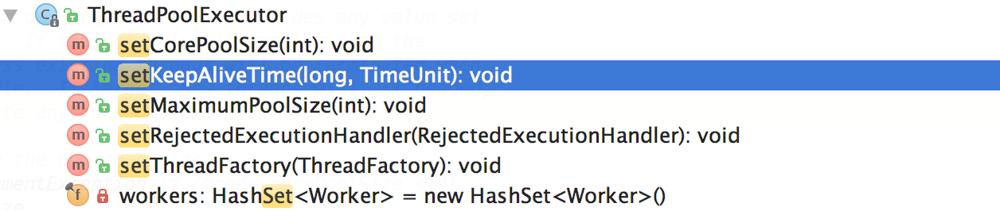

# 电商大促服务高峰期线程池爆满怎么办？动态扩容 + 资源回收扛住流量压力

# 
<font style="color:rgba(6, 8, 31, 0.88);">在电商大促活动中，服务往往会面临极高的并发请求峰值。如果线程池未能灵活应对这种高峰变化，容易导致服务性能恶化或资源浪费问题。本文将带你设计一个基于</font><font style="color:rgba(6, 8, 31, 0.88);"> </font>**<font style="color:rgba(6, 8, 31, 0.88);">Java</font>****<font style="color:rgba(6, 8, 31, 0.88);"> </font>**`**<font style="color:rgba(6, 8, 31, 0.88);">ThreadPoolExecutor</font>**`<font style="color:rgba(6, 8, 31, 0.88);"> </font><font style="color:rgba(6, 8, 31, 0.88);">的高并发线程池，支持动态调整线程数量，通过灵活管理线程池满足高峰需求并节约系统资源。</font>


### **<font style="color:rgba(6, 8, 31, 0.88);">1. 问题背景</font>**
#### <font style="color:rgba(6, 8, 31, 0.88);">常见线程池问题：</font>
+ **<font style="color:rgba(6, 8, 31, 0.88);">高并发任务堆积：</font>**<font style="color:rgba(6, 8, 31, 0.88);">  
</font><font style="color:rgba(6, 8, 31, 0.88);">在大促高峰期，如果线程池配置固定，线程不足会导致任务堆积或请求超时。</font>
+ **<font style="color:rgba(6, 8, 31, 0.88);">资源浪费（线程空闲）：</font>**<font style="color:rgba(6, 8, 31, 0.88);">  
</font><font style="color:rgba(6, 8, 31, 0.88);">高峰过后，线程空闲不被及时释放，会消耗宝贵的服务器资源，增大运行成本。</font>

#### <font style="color:rgba(6, 8, 31, 0.88);">目标：</font>
+ **<font style="color:rgba(6, 8, 31, 0.88);">动态扩缩容：</font>**<font style="color:rgba(6, 8, 31, 0.88);"> </font><font style="color:rgba(6, 8, 31, 0.88);">线程池能根据当前任务量自动调整核心线程数和最大线程数，快速响应高并发需求。</font>
+ **<font style="color:rgba(6, 8, 31, 0.88);">线程回收：</font>**<font style="color:rgba(6, 8, 31, 0.88);"> </font><font style="color:rgba(6, 8, 31, 0.88);">在高峰过后，及时回收空闲线程，避免资源浪费。</font>


### **<font style="color:rgba(6, 8, 31, 0.88);">2. 方案设计</font>**
#### **<font style="color:rgba(6, 8, 31, 0.88);">a. 基于</font>****<font style="color:rgba(6, 8, 31, 0.88);"> </font>**`**<font style="color:rgba(6, 8, 31, 0.88);">ThreadPoolExecutor</font>**`**<font style="color:rgba(6, 8, 31, 0.88);"> </font>****<font style="color:rgba(6, 8, 31, 0.88);">动态调整线程数</font>**
`<font style="color:rgba(6, 8, 31, 0.88);">ThreadPoolExecutor</font>`<font style="color:rgba(6, 8, 31, 0.88);"> </font><font style="color:rgba(6, 8, 31, 0.88);">是 Java 并发包中功能强大的线程池实现，支持灵活调整线程数量。</font>



<font style="color:rgba(6, 8, 31, 0.88);">我们将通过以下方法动态调整线程池配置：</font>

1. **<font style="color:rgba(6, 8, 31, 0.88);">核心线程数（</font>**`**<font style="color:rgba(6, 8, 31, 0.88);">corePoolSize</font>**`**<font style="color:rgba(6, 8, 31, 0.88);">）动态调整：</font>**<font style="color:rgba(6, 8, 31, 0.88);">  
</font><font style="color:rgba(6, 8, 31, 0.88);">使用</font><font style="color:rgba(6, 8, 31, 0.88);"> </font>`<font style="color:rgba(6, 8, 31, 0.88);">setCorePoolSize(int)</font>`<font style="color:rgba(6, 8, 31, 0.88);"> </font><font style="color:rgba(6, 8, 31, 0.88);">方法实时修改线程池核心线程数。</font>
2. **<font style="color:rgba(6, 8, 31, 0.88);">最大线程数（</font>**`**<font style="color:rgba(6, 8, 31, 0.88);">maximumPoolSize</font>**`**<font style="color:rgba(6, 8, 31, 0.88);">）动态调整：</font>**<font style="color:rgba(6, 8, 31, 0.88);">  
</font><font style="color:rgba(6, 8, 31, 0.88);">使用</font><font style="color:rgba(6, 8, 31, 0.88);"> </font>`<font style="color:rgba(6, 8, 31, 0.88);">setMaximumPoolSize(int)</font>`<font style="color:rgba(6, 8, 31, 0.88);"> </font><font style="color:rgba(6, 8, 31, 0.88);">方法调整最大线程数，避免资源耗尽。</font>
3. **<font style="color:rgba(6, 8, 31, 0.88);">任务队列动态扩容：</font>**<font style="color:rgba(6, 8, 31, 0.88);">  
</font><font style="color:rgba(6, 8, 31, 0.88);">配置基于阻塞队列（如</font><font style="color:rgba(6, 8, 31, 0.88);"> </font>`<font style="color:rgba(6, 8, 31, 0.88);">LinkedBlockingQueue</font>`<font style="color:rgba(6, 8, 31, 0.88);">）的调度机制，灵活处理高并发请求。</font>


#### **<font style="color:rgba(6, 8, 31, 0.88);">b. 设置空闲线程回收</font>**
<font style="color:rgba(6, 8, 31, 0.88);">线程池中的空闲线程如果长期存在，会浪费系统资源。通过线程池的以下配置，确保空闲线程高效回收：</font>

1. **<font style="color:rgba(6, 8, 31, 0.88);">线程存活时间（</font>**`**<font style="color:rgba(6, 8, 31, 0.88);">keepAliveTime</font>**`**<font style="color:rgba(6, 8, 31, 0.88);">）：</font>**<font style="color:rgba(6, 8, 31, 0.88);">  
</font><font style="color:rgba(6, 8, 31, 0.88);">设置线程在空闲多久后可以被回收。</font>
2. **<font style="color:rgba(6, 8, 31, 0.88);">允许回收核心线程：</font>**<font style="color:rgba(6, 8, 31, 0.88);">  
</font><font style="color:rgba(6, 8, 31, 0.88);">使用</font><font style="color:rgba(6, 8, 31, 0.88);"> </font>`<font style="color:rgba(6, 8, 31, 0.88);">allowCoreThreadTimeOut(boolean)</font>`<font style="color:rgba(6, 8, 31, 0.88);"> </font><font style="color:rgba(6, 8, 31, 0.88);">方法，使核心线程也能被及时释放。</font>


### **<font style="color:rgba(6, 8, 31, 0.88);">3. 高并发线程池实现</font>**
<font style="color:rgba(6, 8, 31, 0.88);">以下是实现动态调整线程池和空闲回收的核心代码。</font>

#### **<font style="color:rgba(6, 8, 31, 0.88);">代码示例</font>**
```plain
import java.util.concurrent.*;  

public class DynamicThreadPool {  

    private static ThreadPoolExecutor threadPoolExecutor;  

    public static void main(String[] args) throws InterruptedException {  
        // 初始化线程池  
        threadPoolExecutor = new ThreadPoolExecutor(  
            4,                      // 核心线程数（初始值）  
            8,                      // 最大线程数  
            60L,                    // 线程空闲时间  
            TimeUnit.SECONDS,  
            new LinkedBlockingQueue<>(100), // 任务队列  
            Executors.defaultThreadFactory(),  
            new ThreadPoolExecutor.AbortPolicy() // 拒绝策略  
        );  

        // 允许核心线程超时回收  
        threadPoolExecutor.allowCoreThreadTimeOut(true);  

        // 模拟高并发任务处理  
        simulateHighConcurrency();  

        // 动态调整线程池大小  
        adjustThreadPoolSize(8, 16);  

        Thread.sleep(5000); // 模拟等待任务执行完成  

        // 查看线程池状态  
        monitorThreadPool();  

        // 等待一段时间，观察线程自动回收  
        Thread.sleep(10000);  
        monitorThreadPool();  

        threadPoolExecutor.shutdown();  
    }  

    /**  
     * 动态调整线程池核心线程数和最大线程数  
     */  
    private static void adjustThreadPoolSize(int corePoolSize, int maxPoolSize) {  
        threadPoolExecutor.setCorePoolSize(corePoolSize);  
        threadPoolExecutor.setMaximumPoolSize(maxPoolSize);  
        System.out.println("线程池调整完成：核心线程数 = " + corePoolSize + "，最大线程数 = " + maxPoolSize);  
    }  

    /**  
     * 模拟高并发请求  
     */  
    private static void simulateHighConcurrency() {  
        for (int i = 0; i < 50; i++) {  
            threadPoolExecutor.execute(() -> {  
                try {  
                    System.out.println(Thread.currentThread().getName() + " 正在处理任务...");  
                    Thread.sleep(2000); // 模拟任务执行耗时  
                } catch (InterruptedException e) {  
                    e.printStackTrace();  
                }  
            });  
        }  
    }  

    /**  
     * 监控线程池状态  
     */  
    private static void monitorThreadPool() {  
        System.out.println("当前线程池状态：");  
        System.out.println("核心线程数：" + threadPoolExecutor.getCorePoolSize());  
        System.out.println("最大线程数：" + threadPoolExecutor.getMaximumPoolSize());  
        System.out.println("当前线程数：" + threadPoolExecutor.getPoolSize());  
        System.out.println("队列中等待任务数：" + threadPoolExecutor.getQueue().size());  
        System.out.println("------------------------------------------------");  
    }  
}
```


### **<font style="color:rgba(6, 8, 31, 0.88);">4. 运行效果分析</font>**
#### **<font style="color:rgba(6, 8, 31, 0.88);">高峰任务处理</font>**
+ <font style="color:rgba(6, 8, 31, 0.88);">初始设置核心线程数为 4，最大线程数为 8，当高并发调用任务过多时，线程池会利用最大线程数快速创建新线程处理，避免任务堆积。</font>

#### **<font style="color:rgba(6, 8, 31, 0.88);">动态扩容</font>**
+ <font style="color:rgba(6, 8, 31, 0.88);">在高峰期间，通过</font><font style="color:rgba(6, 8, 31, 0.88);"> </font>`<font style="color:rgba(6, 8, 31, 0.88);">setCorePoolSize()</font>`<font style="color:rgba(6, 8, 31, 0.88);"> </font><font style="color:rgba(6, 8, 31, 0.88);">和</font><font style="color:rgba(6, 8, 31, 0.88);"> </font>`<font style="color:rgba(6, 8, 31, 0.88);">setMaximumPoolSize()</font>`<font style="color:rgba(6, 8, 31, 0.88);"> </font><font style="color:rgba(6, 8, 31, 0.88);">将核心线程和最大线程数扩容（如</font>`<font style="color:rgba(6, 8, 31, 0.88);">4 -> 8</font>`<font style="color:rgba(6, 8, 31, 0.88);">,</font><font style="color:rgba(6, 8, 31, 0.88);"> </font>`<font style="color:rgba(6, 8, 31, 0.88);">8 -> 16</font>`<font style="color:rgba(6, 8, 31, 0.88);">），动态提升任务处理能力。</font>

#### **<font style="color:rgba(6, 8, 31, 0.88);">空闲回收</font>**
+ <font style="color:rgba(6, 8, 31, 0.88);">配置</font><font style="color:rgba(6, 8, 31, 0.88);"> </font>`<font style="color:rgba(6, 8, 31, 0.88);">allowCoreThreadTimeOut(true)</font>`<font style="color:rgba(6, 8, 31, 0.88);"> </font><font style="color:rgba(6, 8, 31, 0.88);">和空闲时间</font><font style="color:rgba(6, 8, 31, 0.88);"> </font>`<font style="color:rgba(6, 8, 31, 0.88);">keepAliveTime = 60s</font>`<font style="color:rgba(6, 8, 31, 0.88);"> </font><font style="color:rgba(6, 8, 31, 0.88);">可回收长期无任务处理的线程，高峰过后，线程数逐步下降到最小值，释放系统资源。</font>


### **<font style="color:rgba(6, 8, 31, 0.88);">5. 关键策略总结</font>**
1. **<font style="color:rgba(6, 8, 31, 0.88);">把握并发特性</font>**<font style="color:rgba(6, 8, 31, 0.88);">：</font>
    - <font style="color:rgba(6, 8, 31, 0.88);">高峰期扩展线程池的处理能力。</font>
    - <font style="color:rgba(6, 8, 31, 0.88);">用阻塞队列平衡请求与线程的压力。</font>
2. **<font style="color:rgba(6, 8, 31, 0.88);">动态化管理</font>**<font style="color:rgba(6, 8, 31, 0.88);">：</font>
    - <font style="color:rgba(6, 8, 31, 0.88);">核心线程、最大线程动态调整，灵活应对流量波动。</font>
3. **<font style="color:rgba(6, 8, 31, 0.88);">减少资源浪费</font>**<font style="color:rgba(6, 8, 31, 0.88);">：</font>
    - <font style="color:rgba(6, 8, 31, 0.88);">配置</font>`<font style="color:rgba(6, 8, 31, 0.88);">allowCoreThreadTimeOut</font>`<font style="color:rgba(6, 8, 31, 0.88);">，回收多余空闲线程，节省系统资源。</font>
4. **<font style="color:rgba(6, 8, 31, 0.88);">实时监控：</font>**
    - <font style="color:rgba(6, 8, 31, 0.88);">定期监控线程池的状态（活跃线程数、队列长度等），发现问题及时调整线程池配置。</font>


### **<font style="color:rgba(6, 8, 31, 0.88);">6. 实战场景应用</font>**
1. **<font style="color:rgba(6, 8, 31, 0.88);">电商大促活动</font>**<font style="color:rgba(6, 8, 31, 0.88);">：  
</font><font style="color:rgba(6, 8, 31, 0.88);">在秒杀、限时抢购等场景中，通过动态线程池快速响应瞬时请求，并在活动结束后回收多余线程，避免长期占用资源。</font>
2. **<font style="color:rgba(6, 8, 31, 0.88);">微服务流量管理</font>**<font style="color:rgba(6, 8, 31, 0.88);">：  
</font><font style="color:rgba(6, 8, 31, 0.88);">利用动态线程池处理分布式微服务系统中的流量峰值，确保稳定性。</font>
3. **<font style="color:rgba(6, 8, 31, 0.88);">日志处理系统</font>**<font style="color:rgba(6, 8, 31, 0.88);">：  
</font><font style="color:rgba(6, 8, 31, 0.88);">高并发日志消费/存储场景，动态调整消费线程数量，提高吞吐量并节省资源。</font>


### **<font style="color:rgba(6, 8, 31, 0.88);">7. 动态线程池的优势</font>**
+ **<font style="color:rgba(6, 8, 31, 0.88);">扩展性强：</font>**<font style="color:rgba(6, 8, 31, 0.88);"> </font><font style="color:rgba(6, 8, 31, 0.88);">动态调整核心线程池参数，轻松应对流量波动。</font>
+ **<font style="color:rgba(6, 8, 31, 0.88);">性能兼顾：</font>**<font style="color:rgba(6, 8, 31, 0.88);"> </font><font style="color:rgba(6, 8, 31, 0.88);">保证高峰期处理能力，同时避免空闲线程时的资源浪费。</font>
+ **<font style="color:rgba(6, 8, 31, 0.88);">轻松落地：</font>**<font style="color:rgba(6, 8, 31, 0.88);"> </font><font style="color:rgba(6, 8, 31, 0.88);">基于 JDK 原生线程池，无需额外引入复杂依赖。</font>


<font style="color:rgba(6, 8, 31, 0.88);">通过本文的介绍，你是否已经掌握了动态线程池的设计思路？在高并发场景下，合理利用线程池，不仅能提升系统的性能与稳定性，还能有效节约服务器资源。如果你有更多关于大促活动性能优化的疑问或想法，欢迎评论交流！</font>


> 更新: 2025-02-11 14:25:16  
> 原文: <https://www.yuque.com/u12222632/as5rgl/zuh27c9q8gqtvulv>