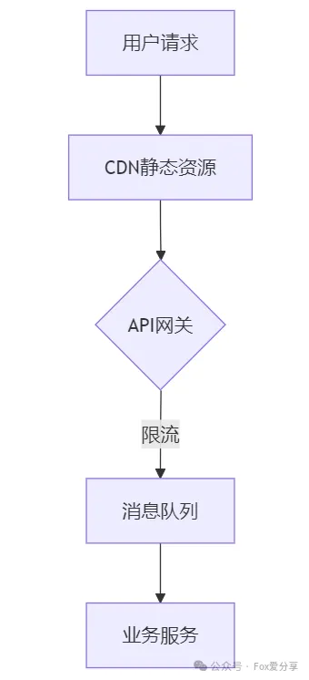
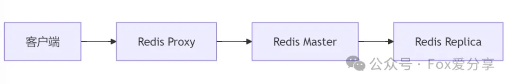
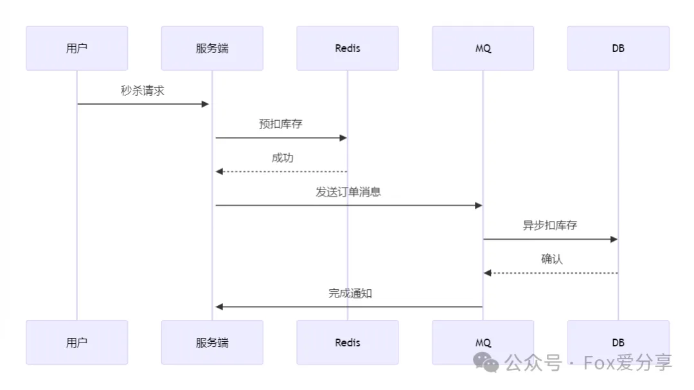

# 百万QPS下的双11秒杀系统设计：4招解决超卖难题！

<font style="color:rgb(64, 64, 64);">如何设计一个百万QPS不超卖的秒杀系统？本文揭秘阿里P8架构师私藏方案，附带可落地的代码实现！</font>

## **<font style="color:rgb(64, 64, 64);">一、分层削峰：三级流量过滤网</font>**


1. **<font style="color:rgb(64, 64, 64);">CDN静态化</font>**<font style="color:rgb(64, 64, 64);">：将商品图片/页面静态化，减少80%服务端请求</font>

```plain

location /product/ {
    expires 1h;
    add_header Cache-Control "public";
}
```

**<font style="color:rgba(0, 0, 0, 0.9);">2.网关限流</font>**<font style="color:rgba(0, 0, 0, 0.9);">：Nginx层实现令牌桶限流</font>

```plain

-- OpenResty实现限流
local limit_req = require "resty.limit.req"
local lim = limit_req.new("my_limit_req_store", 1000, 100) -- 1000r/s
```

**<font style="color:rgba(0, 0, 0, 0.9);">3.队列泄洪</font>**<font style="color:rgba(0, 0, 0, 0.9);">：RocketMQ削峰填谷</font>

```plain

// Spring Cloud Stream消息发送
@Autowired
private StreamBridge streamBridge;

public void seckill(Order order) {
    streamBridge.send("seckill-out-0", order);
}
```

## **<font style="color:rgb(64, 64, 64);">二、缓存爆破：Redis+Lua原子操作</font>**
<font style="color:rgba(0, 0, 0, 0.9);">  
</font>

<font style="color:rgb(64, 64, 64);">库存扣减Lua脚本：</font>

```plain

local key = KEYS[1]
local num = tonumber(ARGV[1])
if (redis.call('exists', key) == 1) then
    local stock = tonumber(redis.call('get', key))
    if (stock >= num) then
        return redis.call('decrby', key, num)
    end
end
return -1
```

## **<font style="color:rgb(64, 64, 64);">三、数据一致：异步最终一致性</font>**
<font style="color:rgba(0, 0, 0, 0.9);">  
</font>

<font style="color:rgb(64, 64, 64);">补偿事务示例：</font>

```plain

@Transactional(rollbackFor = Exception.class)
public void compensateStock(Long productId, Integer num) {
    productDao.revertStock(productId, num);
    log.info("库存补偿成功：{}", productId);
}
```

<font style="color:rgb(64, 64, 64);">服务降级策略：</font>

```plain

@SentinelResource(
    value = "seckillService", 
    fallback = "fallbackHandler",
    blockHandler = "blockHandler"
)
public String seckill(Long productId) {
    // 业务逻辑
}
```

## **<font style="color:rgb(64, 64, 64);">五、性能对比（优化前后）</font>**
| **指标** | **优化前** | **优化后** |
| --- | --- | --- |
| <font style="color:rgb(64, 64, 64);">QPS</font> | <font style="color:rgb(64, 64, 64);">5万</font> | <font style="color:rgb(64, 64, 64);">120万</font> |
| <font style="color:rgb(64, 64, 64);">响应时间</font> | <font style="color:rgb(64, 64, 64);">800ms</font> | <font style="color:rgb(64, 64, 64);">50ms</font> |
| <font style="color:rgb(64, 64, 64);">超卖率</font> | <font style="color:rgb(64, 64, 64);">0.3%</font> | <font style="color:rgb(64, 64, 64);">0%</font> |


<font style="color:rgb(64, 64, 64);"></font>

## **<font style="color:rgb(64, 64, 64);">六、实战建议</font>**
1. **<font style="color:rgb(64, 64, 64);">提前预热热点数据到本地缓存</font>**

```plain

// Caffeine本地缓存
LoadingCache<Long, Product> cache = Caffeine.newBuilder()
    .maximumSize(10_000)
    .refreshAfterWrite(1, TimeUnit.MINUTES)
    .build(productId -> getProduct(productId));
```

**<font style="color:rgba(0, 0, 0, 0.9);">2.全链路压测必须覆盖：</font>**

+ <font style="color:rgb(64, 64, 64);">缓存击穿场景</font>
+ <font style="color:rgb(64, 64, 64);">MQ堆积场景</font>
+ <font style="color:rgb(64, 64, 64);">数据库故障转移</font>

<font style="color:rgb(64, 64, 64);">  
</font>

**<font style="color:rgb(64, 64, 64);">关注公众号「Fox爱分享」，领取100万字 面试资料</font>****<font style="color:rgb(64, 64, 64);">，解锁更多硬核干货</font>**


> 更新: 2025-02-18 19:45:03  
> 原文: <https://www.yuque.com/u12222632/as5rgl/ddn977ifustmh8om>