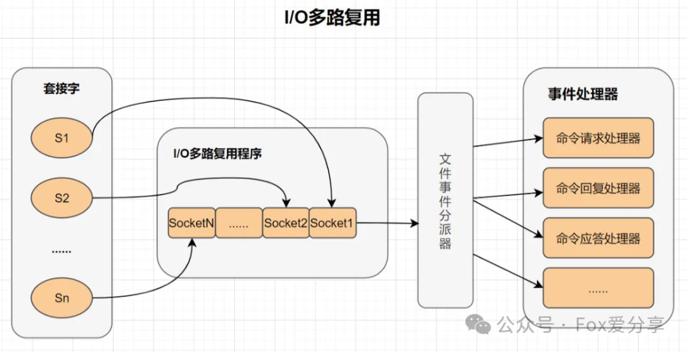
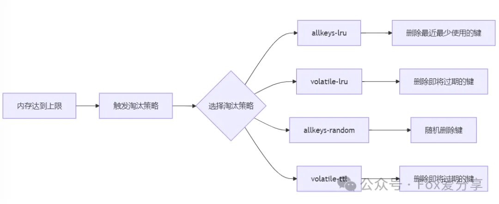
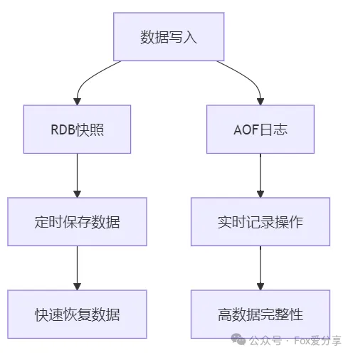
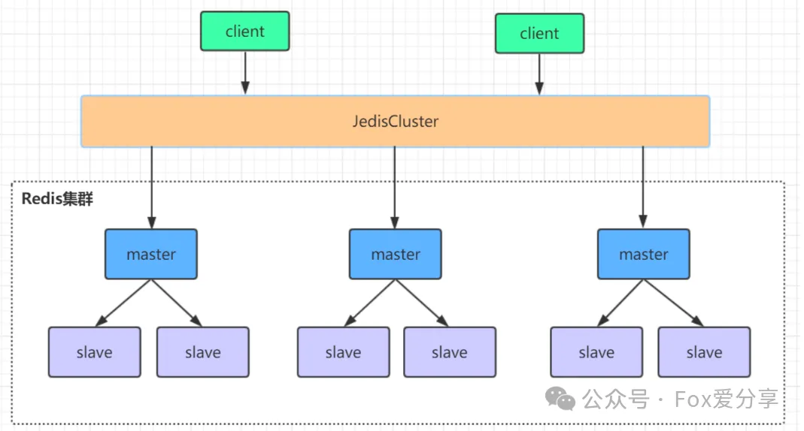

# 美团一面：Redis为什么快？纯内存操作真的就是全部吗？面试官笑了笑，我慌了……

### **<font style="color:rgb(0, 0, 0);">💡</font>****<font style="color:rgb(0, 0, 0);">面试现场：纯内存操作？面试官笑了！</font>**
<font style="color:rgb(0, 0, 0);">“Redis为什么快？”</font><font style="color:rgb(0, 0, 0);">  
</font><font style="color:rgb(0, 0, 0);">“因为它是纯内存操作！”</font><font style="color:rgb(0, 0, 0);">  
</font><font style="color:rgb(0, 0, 0);">面试官微微一笑，我瞬间慌了……</font>

<font style="color:rgb(0, 0, 0);">没错，纯内存操作确实是Redis快的核心之一，但这并不是全部！今天，我们就来揭开Redis高性能的全面真相，让你在面试中不再被“微笑”吓到！</font>

<font style="color:rgba(0, 0, 0, 0.9);">  
</font>

## **<font style="color:rgb(0, 0, 0);">一、Redis快的核心原因：不只是纯内存操作</font>**
### **<font style="color:rgb(0, 0, 0);">1. 纯内存操作：速度的基石</font>**
<font style="color:rgb(0, 0, 0);">Redis将所有数据存储在内存中，避免了传统数据库的磁盘I/O瓶颈。内存的读写速度远高于磁盘，这使得Redis能够实现超高的响应速度。</font>

+ **<font style="color:rgb(0, 0, 0);">性能对比</font>**<font style="color:rgb(0, 0, 0);">：</font>

| **<font style="color:rgba(0, 0, 0, 0.9);">存储介质</font>** | **<font style="color:rgba(0, 0, 0, 0.9);">读写速度</font>** |
| --- | --- |
| <font style="color:rgba(0, 0, 0, 0.9);">内存</font> | <font style="color:rgba(0, 0, 0, 0.9);">纳秒级</font> |
| <font style="color:rgba(0, 0, 0, 0.9);">磁盘</font> | <font style="color:rgba(0, 0, 0, 0.9);">毫秒级</font> |


+ **<font style="color:rgb(0, 0, 0);">适用场景</font>**<font style="color:rgb(0, 0, 0);">：缓存、会话管理、实时数据处理等高并发场景。</font>

**<font style="color:rgb(0, 0, 0);">但！纯内存操作只是Redis快的基础，接下来才是真正的“杀手锏”！</font>**

### **<font style="color:rgb(0, 0, 0);">2. 单线程模型：避免多线程的坑</font>**
<font style="color:rgb(0, 0, 0);">Redis采用单线程模型处理客户端请求，避免了多线程环境下的上下文切换和锁竞争问题。虽然单线程看似“简单”，但它带来了以下优势：</font>

+ **<font style="color:rgb(0, 0, 0);">原子性</font>**<font style="color:rgb(0, 0, 0);">每个操作都是原子执行的，无需考虑并发问题。</font>
+ **<font style="color:rgb(0, 0, 0);">高效性</font>**<font style="color:rgb(0, 0, 0);">没有锁竞争，CPU利用率更高。</font>

**<font style="color:rgb(0, 0, 0);">面试官追问：“单线程会不会成为瓶颈？”</font>**<font style="color:rgb(0, 0, 0);">  
</font><font style="color:rgb(0, 0, 0);">别慌！Redis的单线程模型通过IO多路复用技术解决了这个问题，我们接着往下看！</font>

### **<font style="color:rgb(0, 0, 0);">3. IO多路复用技术：高并发的秘密武器</font>**
<font style="color:rgb(0, 0, 0);">Redis利用IO多路复用技术（如epoll）在一个线程内同时监听多个客户端连接，当有事件发生时，立即处理。这种设计让单线程的Redis也能高效处理高并发请求。</font>

+ **<font style="color:rgb(0, 0, 0);">IO多路复用模型</font>**<font style="color:rgb(0, 0, 0);">：</font>



<font style="color:rgba(0, 0, 0, 0.9);">  
</font>

<font style="color:rgba(0, 0, 0, 0.9);">客户端请求被分发给文件事件分派器，再由事件处理器处理。</font>

+ **<font style="color:rgb(0, 0, 0);">性能优势</font>**<font style="color:rgb(0, 0, 0);">：</font>
    - <font style="color:rgb(0, 0, 0);">无需为每个连接创建线程，减少资源消耗。</font>
    - <font style="color:rgb(0, 0, 0);">快速响应客户端请求，延迟低。</font>

**<font style="color:rgb(0, 0, 0);">面试官再问：“Redis真的只有单线程吗？”</font>**<font style="color:rgb(0, 0, 0);">  
</font><font style="color:rgb(0, 0, 0);">别急！Redis 6.x开始引入了多线程处理网络IO，但核心命令执行依然是单线程，确保性能和一致性。</font>

<font style="color:rgba(0, 0, 0, 0.9);">  
</font>

### **<font style="color:rgb(0, 0, 0);">4. 高效数据结构：速度与内存的平衡</font>**
<font style="color:rgb(0, 0, 0);">Redis不仅依赖内存，还采用多种高效的数据结构来优化性能：</font>

+ **<font style="color:rgb(0, 0, 0);">动态字符串（SDS）</font>**<font style="color:rgb(0, 0, 0);">O(1)复杂度获取字符串长度，支持动态扩展。</font>
+ **<font style="color:rgb(0, 0, 0);">压缩列表（ziplist）</font>**<font style="color:rgb(0, 0, 0);">紧凑存储小型数据，节省内存。</font>
+ **<font style="color:rgb(0, 0, 0);">跳跃表（skiplist）</font>**<font style="color:rgb(0, 0, 0);">O(log N)复杂度实现有序集合的快速查询。</font>
+ **<font style="color:rgb(0, 0, 0);">字典（hash table）</font>**<font style="color:rgb(0, 0, 0);">O(1)复杂度实现键值对的快速查找。</font>

**<font style="color:rgb(0, 0, 0);">案例</font>**<font style="color:rgb(0, 0, 0);">：</font>

+ <font style="color:rgb(0, 0, 0);">使用</font>`<font style="color:rgb(0, 0, 0);">ziplist</font>`<font style="color:rgb(0, 0, 0);">存储短列表，内存占用减少50%。</font>
+ <font style="color:rgb(0, 0, 0);">使用</font>`<font style="color:rgb(0, 0, 0);">skiplist</font>`<font style="color:rgb(0, 0, 0);">实现有序集合，查询速度提升10倍。</font>

**<font style="color:rgb(0, 0, 0);">面试官继续追问：“如何处理内存碎片？”</font>**<font style="color:rgb(0, 0, 0);">  
</font><font style="color:rgb(0, 0, 0);">别怕！Redis通过内存碎片整理和淘汰策略，确保内存高效利用。</font>

<font style="color:rgba(0, 0, 0, 0.9);">  
</font>

### **<font style="color:rgb(0, 0, 0);">5. 高性能网络协议：快速通信的保障</font>**
<font style="color:rgb(0, 0, 0);">Redis采用简单高效的通信协议（如RESP），减少网络传输开销。同时，集群模式下使用Gossip协议，快速同步节点状态，提升集群的可用性和一致性。</font>

**<font style="color:rgb(0, 0, 0);">性能对比</font>**<font style="color:rgb(0, 0, 0);">：</font>

| <font style="color:rgba(0, 0, 0, 0.9);">协议</font> | <font style="color:rgba(0, 0, 0, 0.9);">传输效率</font> |
| --- | --- |
| <font style="color:rgba(0, 0, 0, 0.9);">RESP</font> | <font style="color:rgba(0, 0, 0, 0.9);">高</font> |
| <font style="color:rgba(0, 0, 0, 0.9);">HTTP</font> | <font style="color:rgba(0, 0, 0, 0.9);">中</font> |


<font style="color:rgb(0, 0, 0);">面试官总结：“Redis快的最终原因是什么？”</font><font style="color:rgb(0, 0, 0);">  
</font><font style="color:rgb(0, 0, 0);">别慌！我们来个全面总结！</font>

## **<font style="color:rgb(0, 0, 0);">二、Redis快的最终原因：全面总结</font>**
<font style="color:rgb(0, 0, 0);">Redis之所以快，是因为它结合了以下优势：</font>

1. **<font style="color:rgb(0, 0, 0);">纯内存操作：超高的读写速度。</font>**
2. **<font style="color:rgb(0, 0, 0);">单线程模型：避免上下文切换和锁竞争。</font>**
3. **<font style="color:rgb(0, 0, 0);">IO多路复用技术：高效处理高并发请求。</font>**
4. **<font style="color:rgb(0, 0, 0);">高效数据结构：优化内存和计算性能。</font>**
5. **<font style="color:rgb(0, 0, 0);">高性能网络协议：减少通信开销。</font>**

**<font style="color:rgb(0, 0, 0);">面试官笑了：“不错，下次别只说纯内存操作了！”</font>**

## **<font style="color:rgb(0, 0, 0);">三、面试加分项：Redis优化实践</font>**
### **<font style="color:rgb(0, 0, 0);">内存淘汰策略：合理配置，防止内存溢出</font>**
<font style="color:rgb(0, 0, 0);">Redis的内存淘汰策略决定了当内存达到上限时，哪些数据会被优先删除。合理配置</font>`<font style="color:rgb(0, 0, 0);">maxmemory-policy</font>`<font style="color:rgb(0, 0, 0);">可以避免内存溢出，同时保证热点数据的访问效率。</font>

#### **<font style="color:rgb(0, 0, 0);">常用策略</font>**<font style="color:rgb(0, 0, 0);">：</font>
+ `<font style="color:rgb(0, 0, 0);">allkeys-lru：优先删除最近最少使用的键。</font>`
+ `<font style="color:rgb(0, 0, 0);">volatile-lru：优先删除设置了过期时间且最近最少使用的键。</font>`
+ `<font style="color:rgb(0, 0, 0);">allkeys-random：随机删除键。</font>`
+ `<font style="color:rgb(0, 0, 0);">volatile-ttl：优先删除即将过期的键。</font>`



#### **<font style="color:rgb(0, 0, 0);">配置示例</font>**<font style="color:rgb(0, 0, 0);">：</font>
```plain
# 配置内存淘汰策略为LRUmaxmemory 1gb  
# 设置最大内存限制maxmemory-policy allkeys-lru
```

<font style="color:rgb(51, 51, 51);"></font>

### **<font style="color:rgb(0, 0, 0);">持久化优化：结合RDB和AOF，平衡性能和数据安全</font>**
<font style="color:rgb(0, 0, 0);">Redis提供了两种持久化方式：RDB（快照）和AOF（追加日志）。结合使用两种方式，可以在性能和可靠性之间取得平衡。</font>

#### **<font style="color:rgb(0, 0, 0);">RDB与AOF对比</font>**<font style="color:rgb(0, 0, 0);">：</font>




#### **<font style="color:rgb(0, 0, 0);">配置示例</font>**<font style="color:rgb(0, 0, 0);">：</font>
```plain

# 启用RDB快照
save 900 1  # 900秒内有1次修改则触发保存
save 300 10 # 300秒内有10次修改则触发保存

# 启用AOF并配置每秒同步
appendonly yes
appendfsync everysec
```

### **<font style="color:rgb(0, 0, 0);">集群优化：使用Redis Cluster实现高可用和横向扩展</font>**
<font style="color:rgb(0, 0, 0);">Redis Cluster通过分片技术将数据分散到多个节点，同时提供高可用性和横向扩展能力。</font>

#### **<font style="color:rgb(0, 0, 0);">集群架构</font>**<font style="color:rgb(0, 0, 0);">：</font>
+ **<font style="color:rgb(0, 0, 0);">分片</font>****<font style="color:rgb(0, 0, 0);">：数据被分散到多个节点，每个节点负责一部分数据。</font>**
+ **<font style="color:rgb(0, 0, 0);">高可用</font>****<font style="color:rgb(0, 0, 0);">：每个分片有多个副本，主节点故障时自动切换到副本。</font>**
+ **<font style="color:rgb(0, 0, 0);">横向扩展</font>****<font style="color:rgb(0, 0, 0);">：增加节点即可扩展集群容量</font>****<font style="color:rgb(0, 0, 0);">。</font>**



#### **<font style="color:rgb(0, 0, 0);">配置示例</font>**<font style="color:rgb(0, 0, 0);">：</font>
```plain

# 启动Redis Cluster
redis-cli --cluster create 127.0.0.1:7001 127.0.0.1:7002 \
127.0.0.1:7003 127.0.0.1:7004 127.0.0.1:7005 127.0.0.1:7006 \
--cluster-replicas 1
```

## **<font style="color:rgb(0, 0, 0);">四、总结</font>**
<font style="color:rgb(0, 0, 0);">Redis的快并非偶然，而</font><font style="color:rgb(0, 0, 0);">是内存、单线程、IO多路复用和高效数据结构的完美结合。下次面试，别再只说“纯内存操作”了！掌握这些核心原因，你才能在面试中从容应对，赢得面试官的认可！</font><font style="color:rgb(0, 0, 0);">  
</font><font style="color:rgb(0, 0, 0);">  
</font>

<font style="color:rgb(0, 0, 0);">“你在面试中遇到过哪些关于Redis的‘刁钻’问题？欢迎分享！”</font>

<font style="color:rgb(0, 0, 0);">如果觉得这篇文章对你有所帮助，欢迎点个 </font>“在看”<font style="color:rgba(6, 8, 31, 0.88);"> 或分享给更多的小伙伴！关注公众号「Fox爱分享」</font><font style="color:rgb(64, 64, 64);">，解锁更多精彩内容！</font>


## <font style="color:rgb(0, 0, 0);">  
</font>
  
 


> 更新: 2025-03-25 15:41:17  
> 原文: <https://www.yuque.com/u12222632/as5rgl/dm0b8hsr9ghb4z0t>