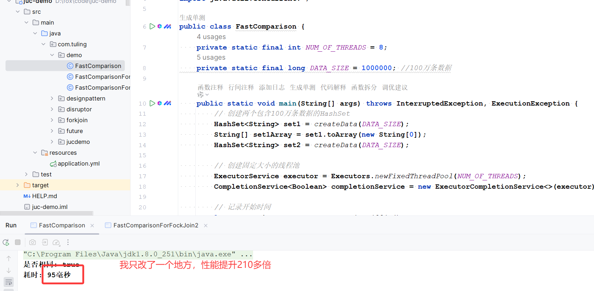

# 美团一面：如何在20秒内完成两个库各100万条数据的快速比对？小伙伴的实现10万数据比对用时21秒，我只改了一处100万用时95毫秒

上周，有个小伙伴参加了美团的面试。面试官给他出了一个很经典的问题：

**两个数据库各有一百万条数据，如何在20秒内完成数据比对？**

小伙伴支支吾吾说了用大数据框架并行处理，没有答到点子上，面试官不满意，最终面试挂了

小伙伴之后将他的单机实现思路发给了我，他说10万数据比对可以保证在20秒内，但是100万要跑很久。

然后我拿到他的代码，改了一处，100万数据比对用时仅需95毫秒。


接下来我分享一下具体细节。


## 方案1：HashSet，10万数据对比用时21秒多
为了实现高效的比对，可以选择HashSet作为主要的数据结构。HashSet的显著特点是利用哈希表实现，保证了元素的唯一性和查询速度。在此场景下，HashSet将提供接近O(1)的查询性能，大大缩短比对时间。

**小伙伴的代码**

```plain
public class FastComparison {
    private static final int NUM_OF_THREADS = 8;
    private static final long DATA_SIZE = 100000; //10万条数据

    public static void main(String[] args) throws InterruptedException, ExecutionException {
        // 创建两个包含100万条数据的HashSet
        HashSet<String> set1 = createData(DATA_SIZE);
        HashSet<String> set2 = createData(DATA_SIZE);

        // 创建固定大小的线程池
        ExecutorService executor = Executors.newFixedThreadPool(NUM_OF_THREADS);
        CompletionService<Boolean> completionService = new ExecutorCompletionService<>(executor);

        // 记录开始时间
        long startTime = System.currentTimeMillis();

        // 提交任务到线程池
        for (int i = 0; i < DATA_SIZE; i += (DATA_SIZE / NUM_OF_THREADS)) {
            final int start = i;
            completionService.submit(() -> {
                for (int j = start; j < start + (DATA_SIZE / NUM_OF_THREADS); j++) {
                    if (!set2.contains(set1.toArray()[j])) {
                        return false;
                    }
                }
                return true;
            });
        }

        // 等待所有任务完成
        int finishedTasks = 0;
        boolean isIdentical = true;
        while (finishedTasks < NUM_OF_THREADS) {
            Future<Boolean> future = completionService.take();
            if (!future.get()) {
                isIdentical = false;
                break;
            }
            finishedTasks++;
        }

        // 关闭线程池
        executor.shutdown();

        // 记录结束时间
        long endTime = System.currentTimeMillis();
        System.out.println("是否相同: " + isIdentical);
        System.out.println("耗时: " + (endTime - startTime) + "毫秒");
    }

    // 创建数据集
    private static HashSet<String> createData(long size) {
        HashSet<String> setData = new HashSet<>();
        for (int i = 0; i < size; i++) {
            setData.add("item" + i);
        }
        return setData;
    }
}
```

**处理用时**

100万数据比对要很久，调整到10万，花了21秒多


**我优化后的代码**

100万数据比对仅需要95ms

```plain
public class FastComparison {
    private static final int NUM_OF_THREADS = 8;
    private static final long DATA_SIZE = 1000000; //100万条数据

    public static void main(String[] args) throws InterruptedException, ExecutionException {
        // 创建两个包含100万条数据的HashSet
        HashSet<String> set1 = createData(DATA_SIZE);
        String[] set1Array = set1.toArray(new String[0]);
        HashSet<String> set2 = createData(DATA_SIZE);

        // 创建固定大小的线程池
        ExecutorService executor = Executors.newFixedThreadPool(NUM_OF_THREADS);
        CompletionService<Boolean> completionService = new ExecutorCompletionService<>(executor);

        // 记录开始时间
        long startTime = System.currentTimeMillis();

        // 提交任务到线程池
        for (int i = 0; i < DATA_SIZE; i += (DATA_SIZE / NUM_OF_THREADS)) {
            final int start = i;
            completionService.submit(() -> {
                for (int j = start; j < start + (DATA_SIZE / NUM_OF_THREADS); j++) {
                    if (!set2.contains(set1Array[j])) {
                        return false;
                    }
                }
                return true;
            });
        }

        // 等待所有任务完成
        int finishedTasks = 0;
        boolean isIdentical = true;
        while (finishedTasks < NUM_OF_THREADS) {
            Future<Boolean> future = completionService.take();
            if (!future.get()) {
                isIdentical = false;
                break;
            }
            finishedTasks++;
        }

        // 关闭线程池
        executor.shutdown();

        // 记录结束时间
        long endTime = System.currentTimeMillis();
        System.out.println("是否相同: " + isIdentical);
        System.out.println("耗时: " + (endTime - startTime) + "毫秒");
    }

    // 创建数据集
    private static HashSet<String> createData(long size) {
        HashSet<String> setData = new HashSet<>();
        for (int i = 0; i < size; i++) {
            setData.add("item" + i);
        }
        return setData;
    }
}
```

**处理用时**



## 方案2：小伙伴继续优化，引入ForkJoin分批次并行处理，10万数据比对用时19秒多
使用Java中的ForkJoin框架来进行多核并行处理。ForkJoin框架基于工作窃取算法，非常适合递归分治任务，可以显著提升大规模数据处理的性能。

**小伙伴的代码**

```plain
public class FastComparisonForFockJoin {
    private static final int DATA_SIZE = 100000; //10万条数据
    private static final int THRESHOLD = 1000; // 任务拆分阈值
    private static HashSet<String> set1;
    private static HashSet<String> set2;
    private static boolean isIdentical = true;
    public static void main(String[] args) throws InterruptedException, ExecutionException {
        // 创建两个包含100万条数据的HashSet
        set1 = createData(DATA_SIZE);
        set2 = createData(DATA_SIZE);
        // 创建ForkJoin池
        ForkJoinPool forkJoinPool = new ForkJoinPool();
        // 记录开始时间
        long startTime = System.currentTimeMillis();
        // 提交任务到ForkJoin池
        CompareTask task = new CompareTask(0, DATA_SIZE);
        forkJoinPool.invoke(task);
        // 关闭ForkJoin池
        forkJoinPool.shutdown();
        // 记录结束时间
        long endTime = System.currentTimeMillis();
        System.out.println("是否相同: " + isIdentical);
        System.out.println("耗时: " + (endTime - startTime) + "毫秒");
    }
    // 创建数据集
    private static HashSet<String> createData(long size) {
        HashSet<String> setData = new HashSet<>();
        for (int i = 0; i < size; i++) {
            setData.add("item" + i);
        }
        return setData;
    }
    // 比较任务
    static class CompareTask extends RecursiveAction {
        private final int start;
        private final int end;
        public CompareTask(int start, int end) {
            this.start = start;
            this.end = end;
        }
        @Override
        protected void compute() {
            if (end - start <= THRESHOLD) {
                for (int i = start; i < end; i++) {
                    if (!set2.contains(set1.toArray()[i])) {
                        isIdentical = false;
                    }
                }
            } else {
                int mid = (start + end) / 2;
                CompareTask leftTask = new CompareTask(start, mid);
                CompareTask rightTask = new CompareTask(mid, end);
                invokeAll(leftTask, rightTask);
            }
        }
    }
}
```

**处理用时**

同样的100万数据比对要很久，调整到10万，花了19秒多


**我优化后的代码**

```plain
public class FastComparisonForFockJoin {
    private static final int DATA_SIZE = 1000000; //100万条数据
    private static final int THRESHOLD = 1000; // 任务拆分阈值
    private static HashSet<String> set1;
    private static String[] set1Array;
    private static HashSet<String> set2;
    private static boolean isIdentical = true;
    public static void main(String[] args) throws InterruptedException, ExecutionException {
        // 创建两个包含100万条数据的HashSet
        set1 = createData(DATA_SIZE);
        set1Array = set1.toArray(new String[0]);
        set2 = createData(DATA_SIZE);
        // 创建ForkJoin池
        ForkJoinPool forkJoinPool = new ForkJoinPool();
        // 记录开始时间
        long startTime = System.currentTimeMillis();
        // 提交任务到ForkJoin池
        CompareTask task = new CompareTask(0, DATA_SIZE);
        forkJoinPool.invoke(task);
        // 关闭ForkJoin池
        forkJoinPool.shutdown();
        // 记录结束时间
        long endTime = System.currentTimeMillis();
        System.out.println("是否相同: " + isIdentical);
        System.out.println("耗时: " + (endTime - startTime) + "毫秒");
    }
    // 创建数据集
    private static HashSet<String> createData(long size) {
        HashSet<String> setData = new HashSet<>();
        for (int i = 0; i < size; i++) {
            setData.add("item" + i);
        }
        return setData;
    }
    // 比较任务
    static class CompareTask extends RecursiveAction {
        private final int start;
        private final int end;
        public CompareTask(int start, int end) {
            this.start = start;
            this.end = end;
        }
        @Override
        protected void compute() {
            if (end - start <= THRESHOLD) {
                for (int i = start; i < end; i++) {
                    if (!set2.contains(set1Array[i])) {
                        isIdentical = false;
                    }
                }
            } else {
                int mid = (start + end) / 2;
                CompareTask leftTask = new CompareTask(start, mid);
                CompareTask rightTask = new CompareTask(mid, end);
                invokeAll(leftTask, rightTask);
            }
        }
    }
}
```

**处理用时**


## 方案3：我提供的方案，Java内置并行流
**示例代码**

```plain
public class FastComparisonParallelStream {

    private static final long DATA_SIZE = 1000000; //100万条数据

    public static void main(String[] args) throws InterruptedException, ExecutionException {
        // 创建两个包含100万条数据的HashSet
        HashSet<String> set1 = createData(DATA_SIZE);
        HashSet<String> set2 = createData(DATA_SIZE);

        // 记录开始时间
        long startTime = System.currentTimeMillis();

        // 并行流
        boolean isIdentical = set1.parallelStream()
                .allMatch(set2::contains);

        // 记录结束时间
        long endTime = System.currentTimeMillis();
        System.out.println("是否相同: " + isIdentical);
        System.out.println("耗时: " + (endTime - startTime) + "毫秒");
    }

    // 创建数据集
    private static HashSet<String> createData(long size) {
        HashSet<String> setData = new HashSet<>();
        for (int i = 0; i < size; i++) {
            setData.add("item" + i);
        }
        return setData;
    }
}
```

**处理用时**


## 拓展：<font style="color:rgba(0, 0, 0, 0.88);background-color:rgb(246, 246, 246);">数据库层面的高效比对</font>
+ **<font style="color:rgba(0, 0, 0, 0.88);background-color:rgb(246, 246, 246);">MD5哈希比对</font>**<font style="color:rgba(0, 0, 0, 0.88);background-color:rgb(246, 246, 246);">：计算行数据的MD5值进行快速比对</font>

```plain
-- MD5比对示例
SELECT sum(case when left_table.record_key is not null then 1 else 0 end) as left_table_num,
       sum(case when right_table.record_key is not null then 1 else 0 end) as right_table_num,
       sum(case when left_table.record_key = right_table.record_key then 1 else 0 end) as left_right_equal_num
FROM (
    SELECT md5(concat_ws('|', col1, col2, ...)) as record_key FROM table1
) left_table
FULL OUTER JOIN (
    SELECT md5(concat_ws('|', col1, col2, ...)) as record_key FROM table2
) right_table ON left_table.record_key = right_table.record_key
```

+ **<font style="color:rgba(0, 0, 0, 0.88);background-color:rgb(246, 246, 246);">勾稽验证法</font>**<font style="color:rgba(0, 0, 0, 0.88);background-color:rgb(246, 246, 246);">：统计两表记录数、非空记录数等快速判断一致性</font>
+ **<font style="color:rgba(0, 0, 0, 0.88);background-color:rgb(246, 246, 246);">暴力比对法</font>**<font style="color:rgba(0, 0, 0, 0.88);background-color:rgb(246, 246, 246);">：对具有唯一ID的表直接JOIN比对</font>


> 更新: 2025-04-18 15:45:28  
> 原文: <https://www.yuque.com/u12222632/as5rgl/vullb4bu5n7lgks3>