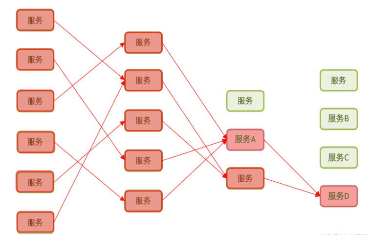
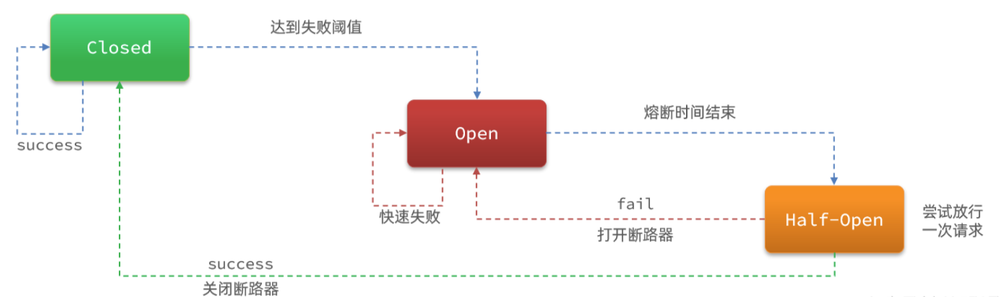

# 美团三面：订单服务调用支付服务时发生雪崩，如何通过熔断降级、服务隔离等手段保证系统可用性？


<font style="color:rgb(36, 41, 47);">在分布式系统中，服务雪崩是典型的级联故障场景：当支付服务出现高延迟或不可用时，订单服务因持续调用而耗尽资源，最终导致整个系统崩溃。本文结合</font>**<font style="color:rgb(36, 41, 47);">熔断降级</font>**<font style="color:rgb(36, 41, 47);">和</font>**<font style="color:rgb(36, 41, 47);">服务隔离</font>**<font style="color:rgb(36, 41, 47);">两大核心手段，详解基于Sentinel的解决方案。</font>

<font style="color:rgb(36, 41, 47);"></font>

### **<font style="color:rgb(36, 41, 47);">一、雪崩根源与解决思路</font>**
#### <font style="color:rgb(36, 41, 47);">1.</font><font style="color:rgb(36, 41, 47);"> </font>**<font style="color:rgb(36, 41, 47);">问题原因</font>**
+ <font style="color:rgb(36, 41, 47);">支付服务故障时，订单服务线程被长时间阻塞，导致线程池耗尽，无法处理新请求。</font>
+ <font style="color:rgb(36, 41, 47);">调用链路的级联故障扩散，引发雪崩效应。</font>



#### <font style="color:rgb(36, 41, 47);">2.</font><font style="color:rgb(36, 41, 47);"> </font>**<font style="color:rgb(36, 41, 47);">解决方向</font>**
+ **<font style="color:rgb(36, 41, 47);">服务隔离</font>**<font style="color:rgb(36, 41, 47);">：限制故障影响范围。</font>
+ **<font style="color:rgb(36, 41, 47);">熔断降级</font>**<font style="color:rgb(36, 41, 47);">：快速失败并执行兜底逻辑。</font>
+ **<font style="color:rgb(36, 41, 47);">Sentinel核心能力</font>**<font style="color:rgb(36, 41, 47);">：提供熔断状态机、线程池/信号量隔离、动态规则配置等</font>

<font style="color:rgb(36, 41, 47);"></font>

### **<font style="color:rgb(36, 41, 47);">二、服务隔离：线程池 vs 信号量</font>**
#### <font style="color:rgb(36, 41, 47);">1.</font><font style="color:rgb(36, 41, 47);"> </font>**<font style="color:rgb(36, 41, 47);">线程池隔离</font>**
+ **<font style="color:rgb(36, 41, 47);">原理</font>**<font style="color:rgb(36, 41, 47);">：为支付服务分配独立线程池，订单服务调用支付服务时，占用该线程池资源。即使支付服务阻塞，订单服务的其他接口不受影响。</font>
+ **<font style="color:rgb(36, 41, 47);">优点</font>**<font style="color:rgb(36, 41, 47);">：支持异步调用和超时控制，隔离彻底。</font>
+ **<font style="color:rgb(36, 41, 47);">缺点</font>**<font style="color:rgb(36, 41, 47);">：线程上下文切换带来额外开销，需维护线程池</font><font style="color:rgb(36, 41, 47);">。</font>

**<font style="color:rgb(36, 41, 47);">Sentinel示例代码（线程数限制）：</font>**

```java
// 定义支付服务的线程池资源
@SentinelResource(
    value = "payService",
    fallback = "fallbackForPay",
    blockHandler = "blockHandlerForPay",
    blockHandlerClass = PayServiceBlockHandler.class
)
public void callPayService() {
    // 远程调用支付服务
}

```

#### <font style="color:rgb(36, 41, 47);">2.</font><font style="color:rgb(36, 41, 47);"> </font>**<font style="color:rgb(36, 41, 47);">信号量隔离</font>**
+ **<font style="color:rgb(36, 41, 47);">原理</font>**<font style="color:rgb(36, 41, 47);">：通过原子计数器限制并发数（如最大100个信号量）。请求获取信号量后执行，释放后归还。</font>
+ **<font style="color:rgb(36, 41, 47);">优点</font>**<font style="color:rgb(36, 41, 47);">：轻量级，无线程切换开销。</font>
+ **<font style="color:rgb(36, 41, 47);">缺点</font>**<font style="color:rgb(36, 41, 47);">：同步阻塞，不支持超时</font><font style="color:rgb(36, 41, 47);">。</font>

**<font style="color:rgb(36, 41, 47);">Sentinel信号量配置（YAML）：</font>**

```java
spring:
  cloud:
    sentinel:
      filter:
        enabled: false
      datasource:
        ds1:
          nacos:
            server-addr: localhost:8848
            dataId: pay-service-rules
            ruleType: FLOW
      # 信号量隔离规则（最大并发数10）
      flow:
        rules:
          - resource: payService
            count: 10
            grade: 1  # 0-线程数,1-QPS,2-信号量

```

#### <font style="color:rgb(36, 41, 47);">3.</font><font style="color:rgb(36, 41, 47);"> </font>**<font style="color:rgb(36, 41, 47);">选型建议</font>**
+ **<font style="color:rgb(36, 41, 47);">线程池</font>**<font style="color:rgb(36, 41, 47);">：适用于外部服务调用（如支付、数据库），需处理超时和熔断。</font>
+ **<font style="color:rgb(36, 41, 47);">信号量</font>**<font style="color:rgb(36, 41, 47);">：适用于内部高并发逻辑（如缓存计算），仅需限制并发</font>

<font style="color:rgb(36, 41, 47);"></font>

### **<font style="color:rgb(36, 41, 47);">三、熔断降级：Sentinel状态机设计</font>**
#### <font style="color:rgb(36, 41, 47);">1.</font><font style="color:rgb(36, 41, 47);"> </font>**<font style="color:rgb(36, 41, 47);">熔断器三态流转</font>**
+ **<font style="color:rgb(36, 41, 47);">Closed（关闭）</font>**<font style="color:rgb(36, 41, 47);"> </font><font style="color:rgb(36, 41, 47);">：正常放行请求，统计异常比例。</font>
+ **<font style="color:rgb(36, 41, 47);">Open（开启）</font>**<font style="color:rgb(36, 41, 47);"> </font><font style="color:rgb(36, 41, 47);">：当异常比例超过阈值（如50%），拦截所有请求，直接降级。</font>
+ **<font style="color:rgb(36, 41, 47);">Half-Open（半开）</font>**<font style="color:rgb(36, 41, 47);"> </font><font style="color:rgb(36, 41, 47);">：经过熔断时间窗后，试探性放行部分请求。若成功则关闭熔断，否则保持开启</font><font style="color:rgb(36, 41, 47);">。</font>



**<font style="color:rgb(36, 41, 47);">Sentinel熔断规则配置：</font>**

```java
// 异常比例熔断（60%异常，时间窗口5秒）
DegradeRule rule = new DegradeRule("payService")
    .setGrade(RuleConstant.DEGRADE_GRADE_EXCEPTION_RATIO)
    .setCount(0.6)    // 阈值60%
    .setTimeWindow(5) // 熔断5秒
    .setMinRequestAmount(10); // 最小请求数
DegradeRuleManager.loadRules(Collections.singletonList(rule));

```


#### <font style="color:rgb(36, 41, 47);">2.</font><font style="color:rgb(36, 41, 47);"> </font>**<font style="color:rgb(36, 41, 47);">降级策略</font>**
+ **<font style="color:rgb(36, 41, 47);">Fallback方法</font>**<font style="color:rgb(36, 41, 47);">：熔断触发时返回默认结果（如“系统繁忙，请稍后重试”）。</font>
+ **<font style="color:rgb(36, 41, 47);">异步处理</font>**<font style="color:rgb(36, 41, 47);">：同步受理请求后快速返回，异步执行支付操作</font><font style="color:rgb(36, 41, 47);">。</font>

**<font style="color:rgb(36, 41, 47);">降级逻辑示例：</font>**

```java
public class PayServiceFallback {
    public static String fallbackForPay(Throwable ex) {
        // 记录日志并返回兜底结果
        return "支付服务暂不可用，已记录订单稍后重试";
    }
}

```


### **<font style="color:rgb(36, 41, 47);">四、完整实现方案</font>**
#### <font style="color:rgb(36, 41, 47);">1.</font><font style="color:rgb(36, 41, 47);"> </font>**<font style="color:rgb(36, 41, 47);">架构设计</font>**
1. **<font style="color:rgb(36, 41, 47);">服务隔离</font>**<font style="color:rgb(36, 41, 47);">：订单服务调用支付服务时，使用线程池隔离（如核心线程数20）。</font>
2. **<font style="color:rgb(36, 41, 47);">熔断降级</font>**<font style="color:rgb(36, 41, 47);">：配置异常比例熔断（60%异常触发），降级时返回预存订单或错误提示。</font>
3. **<font style="color:rgb(36, 41, 47);">异步补偿</font>**<font style="color:rgb(36, 41, 47);">：支付结果通过MQ异步通知，确保最终一致性</font><font style="color:rgb(36, 41, 47);">。</font>

#### <font style="color:rgb(36, 41, 47);">2. </font>**<font style="color:rgb(36, 41, 47);">Sentinel核心配置</font>**
```java
// 定义资源并绑定降级方法
@SentinelResource(
    value = "payService",
    fallback = "fallback",
    blockHandler = "blockHandler",
    blockHandlerClass = SentinelBlockHandler.class
)
public void invokePayService() {
    // 调用支付服务
}

// 熔断规则（Nacos动态配置）
dataId: sentinel-degrade-rules
content: |
  [
    {
      "resource": "payService",
      "grade": 0,           // 异常比例模式
      "count": 0.6,         // 阈值60%
      "timeWindow": 10,     // 熔断10秒
      "minRequestAmount": 5 // 最小请求数
    }
  ]

```


### **<font style="color:rgb(36, 41, 47);">五、总结与最佳实践</font>**
+ **<font style="color:rgb(36, 41, 47);">线程池隔离</font>**<font style="color:rgb(36, 41, 47);">优先用于外部调用，信号量用于内部高并发。</font>
+ **<font style="color:rgb(36, 41, 47);">熔断阈值</font>**<font style="color:rgb(36, 41, 47);">需结合压测结果调整（如异常比例40%~60%）。</font>
+ **<font style="color:rgb(36, 41, 47);">降级策略</font>**<font style="color:rgb(36, 41, 47);">需与业务对齐，确保核心功能可用（如美团仅展示100条订单）</font><font style="color:rgb(36, 41, 47);">。</font>
+ **<font style="color:rgb(36, 41, 47);">监控告警</font>**<font style="color:rgb(36, 41, 47);">：实时监控熔断状态，结合日志排查根本原因</font><font style="color:rgb(36, 41, 47);">。</font>

<font style="color:rgb(36, 41, 47);">通过Sentinel的熔断降级和服务隔离，系统可在支付服务故障时快速止血，保障订单服务的基本可用性，这正是高可用架构设计的精髓。</font>


> 更新: 2025-02-08 03:39:48  
> 原文: <https://www.yuque.com/u12222632/as5rgl/vunbpgz1m9l6zbd4>