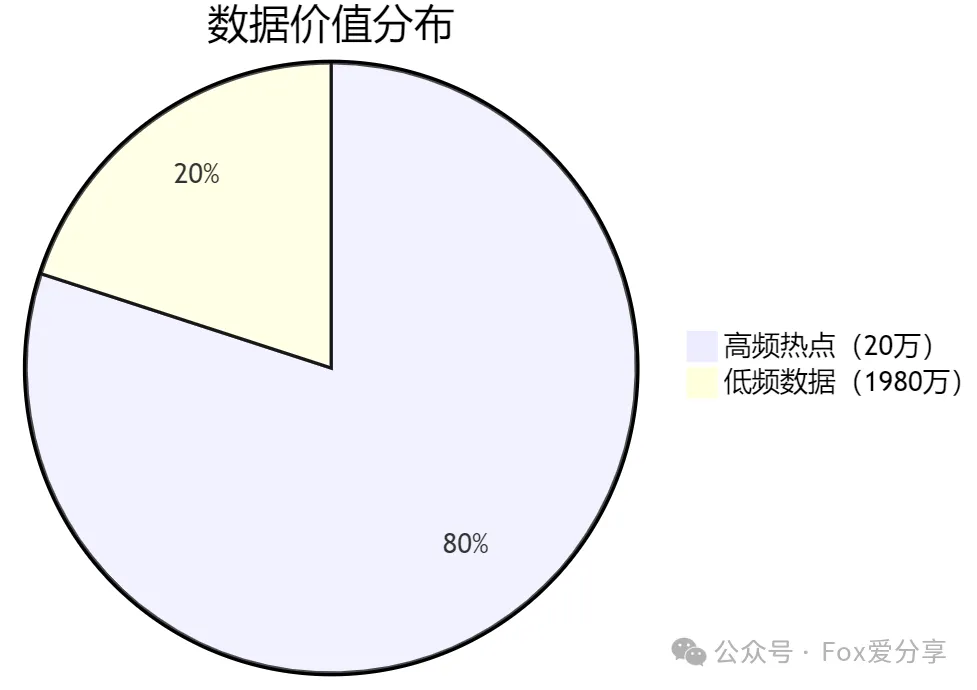
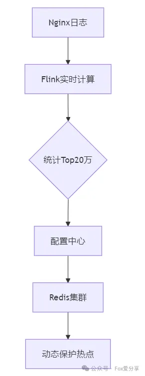
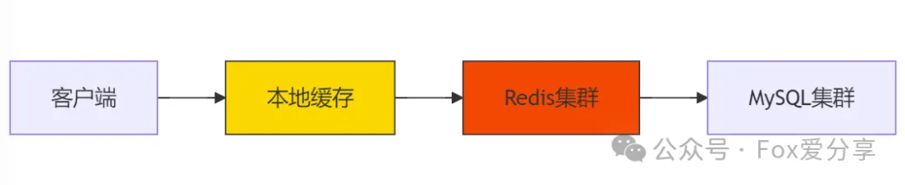
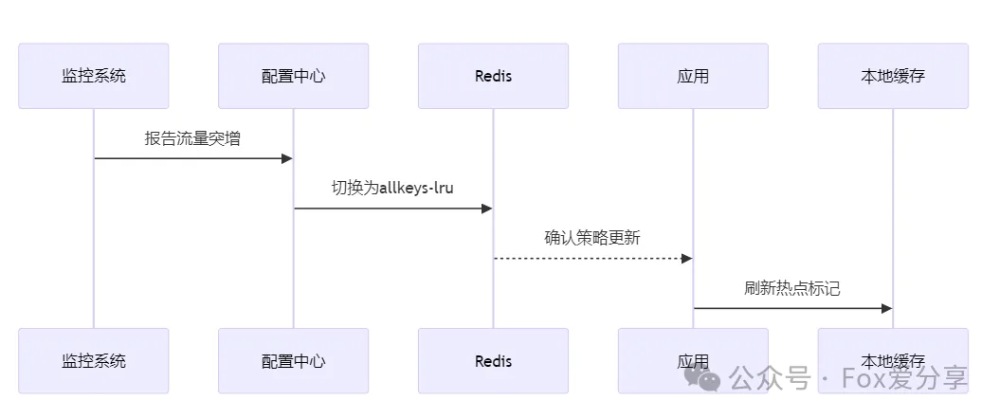
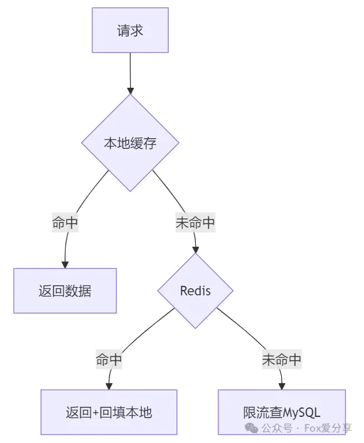

# 美团面试：MySQL里有2000w数据，redis中只存20w的数据，如何保证redis中的数据都是热点数据


**<font style="color:rgb(64, 64, 64);">“2000万数据，只让Redis存20万，怎么保证存的都是最热的？”</font>**

<font style="color:rgb(64, 64, 64);">一位粉丝在美团三面时被问懵。</font>

### **<font style="color:rgb(64, 64, 64);">一、问题本质：缓存系统的“生存游戏”</font>**
<font style="color:rgb(64, 64, 64);">2000万数据中，只有20万是高频访问的“顶流”，剩下1980万都是“冷数据”。这像一场生存游戏——</font>**<font style="color:rgb(64, 64, 64);">如何让Redis精准淘汰“冷数据”，长期保留“热数据”？</font>**<font style="color:rgb(64, 64, 64);">  
</font><font style="color:rgb(64, 64, 64);">以下数据暴露核心矛盾：</font>

+ <font style="color:rgb(64, 64, 64);">Redis内存成本太高</font>
+ <font style="color:rgb(64, 64, 64);">80%请求集中在20%数据（二八法则）</font>
+ <font style="color:rgb(64, 64, 64);">热点数据动态变化（如突发新闻、秒杀商品）</font>



<font style="color:rgba(0, 0, 0, 0.9);">  
</font>

### **<font style="color:rgb(64, 64, 64);">二、三级缓存治理体系</font>**
#### <font style="color:rgb(64, 64, 64);">1. </font>**<font style="color:rgb(64, 64, 64);">第一层：智能淘汰策略（守门员）</font>**
**<font style="color:rgb(64, 64, 64);">Redis配置黄金法则</font>**<font style="color:rgb(64, 64, 64);">：</font>

```java
# redis.conf关键配置
maxmemory 20gb         # 按20万数据*1KB计算
maxmemory-policy allkeys-lfu  # 使用LFU算法（Least Frequently Used）
```

**<font style="color:rgb(64, 64, 64);">淘汰策略对比</font>**<font style="color:rgb(64, 64, 64);">：</font>

| **策略** | **特点** | **适用场景** |
| --- | --- | --- |
| `<font style="color:rgb(64, 64, 64);">allkeys-lfu</font>` | <font style="color:rgb(64, 64, 64);">淘汰访问频率最低</font> | <font style="color:rgb(64, 64, 64);">稳定热点（如商品详情）</font> |
| `<font style="color:rgb(64, 64, 64);">volatile-ttl</font>` | <font style="color:rgb(64, 64, 64);">淘汰剩余时间最短</font> | <font style="color:rgb(64, 64, 64);">限时活动（如秒杀）</font> |
| `<font style="color:rgb(64, 64, 64);">allkeys-random</font>` | <font style="color:rgb(64, 64, 64);">随机淘汰</font> | <font style="color:rgb(64, 64, 64);">无规律访问</font> |


<font style="color:rgb(64, 64, 64);"></font>

#### <font style="color:rgb(64, 64, 64);">2. </font>**<font style="color:rgb(64, 64, 64);">第二层：实时热点探测（雷达系统）</font>**


**<font style="color:rgb(64, 64, 64);">Flink实时统计代码</font>**<font style="color:rgb(64, 64, 64);">：</font>

```plain
DataStream<ItemViewCount> windowData = data
    .keyBy("itemId")
    .window(SlidingProcessingTimeWindows.of(Time.minutes(5), Time.minutes(1)))
    .aggregate(new CountAgg(), new WindowResultFunction());

windowData.keyBy("windowEnd")
    .process(new TopNHotItems(200000)) // 取Top20万
    .addSink(new ZkConfigUpdater()); // 上报配置中心
```

#### <font style="color:rgb(64, 64, 64);">3. </font>**<font style="color:rgb(64, 64, 64);">第三层：多级缓存架构（防御矩阵）</font>**


**<font style="color:rgb(64, 64, 64);">本地+Redis二级缓存实现</font>**<font style="color:rgb(64, 64, 64);">：</font>

```plain
// Caffeine本地缓存（第一级）
LoadingCache<String, Object> localCache = Caffeine.newBuilder()
    .maximumSize(1000)
    .expireAfterWrite(30, TimeUnit.SECONDS)
    .build(key -> {
        // Redis查询（第二级）
        Object val = redis.get(key);
        if(val == null) {
            val = mysql.get(key); 
            redis.setex(key, 3600, val); // 回填Redis
        }
        return val;
    });
```

### **<font style="color:rgb(64, 64, 64);">三、四大核心优化技巧</font>**
#### <font style="color:rgb(64, 64, 64);">1. </font>**<font style="color:rgb(64, 64, 64);">热点标记与保护</font>**
```plain
// 热点标记
ConcurrentHashMap<String, AtomicLong> hotKeyCounter = new ConcurrentHashMap<>();

public Object getData(String key) {
    hotKeyCounter.compute(key, (k,v) -> 
        v == null ? new AtomicLong(1) : v.incrementAndGet());

    if(hotKeyCounter.get(key).get() > 1000) { // 判定为热点
        redis.persist(key); // 取消过期时间
        zkClient.registerHotKey(key); // 上报监控
    }
    return localCache.get(key);
}
```

#### <font style="color:rgb(64, 64, 64);">2. </font>**<font style="color:rgb(64, 64, 64);">冷热数据分离存储</font>**
**<font style="color:rgb(64, 64, 64);">MySQL表优化</font>**<font style="color:rgb(64, 64, 64);">：</font>

```plain
ALTER TABLE products 
    ADD COLUMN hot_score INT DEFAULT 0 COMMENT '热度值',
    ADD INDEX idx_hot_score (hot_score);
```

#### **<font style="color:rgb(64, 64, 64);">Redis存储优化</font>****<font style="color:rgb(64, 64, 64);">：</font>**
```plain

# 使用Hash结构压缩存储
HMSET product:1234 
    data "{...json...}" 
    hot 1 
    expire 1735689600
```

#### <font style="color:rgb(64, 64, 64);">3. </font>**<font style="color:rgb(64, 64, 64);">智能预热机制</font>**
```plain
# 定时预热脚本（每日凌晨执行）
def preheat_cache():
    # 获取昨日Top20万热点
    hot_items = mysql.query("""
        SELECT item_id 
        FROM access_log 
        WHERE date = CURDATE() - INTERVAL 1 DAY
        GROUP BY item_id 
        ORDER BY COUNT(*) DESC 
        LIMIT 200000
    """)

    # 批量写入Redis
    pipeline = redis.pipeline()
    for item in hot_items:
        data = mysql.get(item.id)
        pipeline.setex(item.id, 86400, data) # 缓存24小时
    pipeline.execute()
```

#### <font style="color:rgb(64, 64, 64);">4. </font>**<font style="color:rgb(64, 64, 64);">动态策略调整</font>**


### **<font style="color:rgb(64, 64, 64);">四、压测数据对比</font>**
| **方案** | **缓存命中率** | **平均延迟** | **MySQL负载** |
| --- | --- | --- | --- |
| <font style="color:rgb(64, 64, 64);">无缓存</font> | <font style="color:rgb(64, 64, 64);">0%</font> | <font style="color:rgb(64, 64, 64);">95ms</font> | <font style="color:rgb(64, 64, 64);">100%</font> |
| <font style="color:rgb(64, 64, 64);">基础LRU</font> | <font style="color:rgb(64, 64, 64);">65%</font> | <font style="color:rgb(64, 64, 64);">18ms</font> | <font style="color:rgb(64, 64, 64);">35%</font> |
| <font style="color:rgb(64, 64, 64);">智能方案</font> | **<font style="color:rgb(64, 64, 64);">98.5%</font>** | **<font style="color:rgb(64, 64, 64);">2.1ms</font>** | **<font style="color:rgb(64, 64, 64);">1.5%</font>** |


<font style="color:rgba(0, 0, 0, 0.9);"></font>

### **<font style="color:rgb(64, 64, 64);">五、面试加分项</font>**
**<font style="color:rgba(0, 0, 0, 0.9);">1.缓存雪崩防护</font>**<font style="color:rgba(0, 0, 0, 0.9);">：</font>

<font style="color:rgb(51, 51, 51);">// 随机过期时间避免集体失效public void setCache(String key, Object value) {    int expire = 3600 + new Random().nextInt(600); // 3600~4200秒随机    redis.setex(key, expire, value);}</font>

**<font style="color:rgba(0, 0, 0, 0.9);">2.热点Key分片</font>**<font style="color:rgba(0, 0, 0, 0.9);">：</font>

<font style="color:rgb(51, 51, 51);">def get_cache_key(item_id):    shard = item_id % 10  # 分10个片    return f"item_{shard}_{item_id}"</font>

**<font style="color:rgba(0, 0, 0, 0.9);">3.多级降级策略</font>**<font style="color:rgba(0, 0, 0, 0.9);">：</font>



<font style="color:rgba(0, 0, 0, 0.9);">  
</font>

<font style="color:rgba(0, 0, 0, 0.9);">  
</font>

**<font style="color:rgba(0, 0, 0, 0.9);">六、实战建议</font>**

**<font style="color:rgba(0, 0, 0, 0.9);">1.每日运维</font>**<font style="color:rgba(0, 0, 0, 0.9);">：</font>

+ <font style="color:rgb(64, 64, 64);">凌晨低峰期执行缓存分析脚本</font>
+ <font style="color:rgb(64, 64, 64);">使用</font>`<font style="color:rgb(64, 64, 64);">redis-cli --hotkeys</font>`<font style="color:rgb(64, 64, 64);">主动探测热点</font>

**<font style="color:rgba(0, 0, 0, 0.9);">2.监控预警</font>**<font style="color:rgba(0, 0, 0, 0.9);">：</font>

+ <font style="color:rgb(64, 64, 64);">对缓存击穿率设置分级报警（>5%触发警告）</font>
+ <font style="color:rgb(64, 64, 64);">Redis内存使用超过80%时自动扩容</font>

**<font style="color:rgba(0, 0, 0, 0.9);">3.业务隔离</font>**<font style="color:rgba(0, 0, 0, 0.9);">：</font>

+ <font style="color:rgb(64, 64, 64);">不同业务线使用独立缓存实例（如商品、订单分离）</font>

<font style="color:rgba(0, 0, 0, 0.9);">  
  
</font>

**<font style="color:rgb(0, 0, 0);">如果觉得这篇文章对你有所帮助，欢迎点个 </font>****“在看”****<font style="color:rgba(6, 8, 31, 0.88);"> 或分享给更多的小伙伴！</font>**

**<font style="color:rgba(6, 8, 31, 0.88);">更多技术干货，欢迎</font>****<font style="color:rgb(64, 64, 64);">关注公众号「Fox爱分享」</font>****<font style="color:rgb(64, 64, 64);">，解锁更多精彩内容！</font>**


<font style="color:rgb(64, 64, 64);">▲ 扫码关注，解锁100万字金三银四面试秘籍</font>

<font style="color:rgba(0, 0, 0, 0.9);">  
</font>

<font style="color:rgba(0, 0, 0, 0.9);">思考：</font>**<font style="color:rgb(38, 36, 76);">若某热点商品因流量过大导致Redis分片崩溃，如何在不影响用户体验的前提下实现快速自愈？</font>**


> 更新: 2025-02-20 13:30:28  
> 原文: <https://www.yuque.com/u12222632/as5rgl/nn4b5392k2y2hdom>