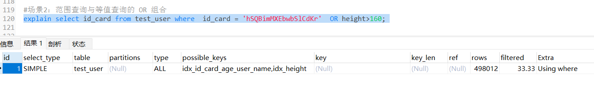

# 美团面试：mysql 索引失效？怎么解决？

<font style="color:rgb(36, 41, 46);">前几天 小伙伴面试 美团，遇到了这个问题。</font>

> <font style="color:rgb(106, 115, 125);">mysql索引失效，主要场景是什么？</font>
>
> <font style="color:rgb(106, 115, 125);">mysql索引失效，如何解决？</font>
>

<font style="color:rgb(36, 41, 46);">但是由于 没有回答好，导致面试挂了。</font>


## 1. 准备工作：造50W数据
<font style="color:rgb(36, 41, 46);">建表和造50W数据，给大家一步步演示效果，尽量做到有理有据。</font>

1. <font style="color:rgb(36, 41, 46);">首先创建一 张测试表 test_user表</font>
2. <font style="color:rgb(36, 41, 46);">为function指定一个参数</font>
3. <font style="color:rgb(36, 41, 46);">创建函数：随机产生字符串</font>
4. <font style="color:rgb(36, 41, 46);">创建函数：用于随机产生多少到多少的编号</font>
5. <font style="color:rgb(36, 41, 46);">创建存储过程：往test_user表中插入50万条数据</font>
6. <font style="color:rgb(36, 41, 46);">查看结果</font>

### 首先创建一张测试表 test_user表
<font style="color:rgb(36, 41, 46);">创建一张user表，表中包含：</font>`<font style="color:rgb(36, 41, 46);">id</font>`<font style="color:rgb(36, 41, 46);">、</font>`<font style="color:rgb(36, 41, 46);">id_card</font>`<font style="color:rgb(36, 41, 46);">、</font>`<font style="color:rgb(36, 41, 46);">age</font>`<font style="color:rgb(36, 41, 46);">、</font>`<font style="color:rgb(36, 41, 46);">user_name</font>`<font style="color:rgb(36, 41, 46);">和</font>`<font style="color:rgb(36, 41, 46);">height</font>`<font style="color:rgb(36, 41, 46);">、address字段。</font>

```sql
CREATE TABLE `test_user` (
  `id` int NOT NULL AUTO_INCREMENT,
  `id_card` varchar(20) COLLATE utf8mb4_bin DEFAULT NULL,
  `age` int DEFAULT '0',
  `user_name` varchar(30) COLLATE utf8mb4_bin DEFAULT NULL,
  `height` int DEFAULT '0',
  `address` varchar(30) COLLATE utf8mb4_bin DEFAULT NULL,
  PRIMARY KEY (`id`),
  KEY `idx_id_card_age_user_name` (`id_card`,`age`,`user_name`),
  KEY `idx_height` (`height`)
) ENGINE=InnoDB AUTO_INCREMENT=4 DEFAULT CHARSET=utf8mb4 COLLATE=utf8mb4_bin
```

<font style="color:rgb(36, 41, 46);">执行结果如下</font>


<font style="color:rgb(36, 41, 46);">脚本中，创建了三个索引：</font>

+ <font style="color:rgb(36, 41, 46);">聚族索引  </font>`<font style="color:rgb(36, 41, 46);">id</font>`<font style="color:rgb(36, 41, 46);">：数据库的聚族索引</font>
+ <font style="color:rgb(36, 41, 46);">联合索引  </font>`<font style="color:rgb(36, 41, 46);">idx_id_card_age_user_name</font>`<font style="color:rgb(36, 41, 46);">：由id_card、age和user_name三个字段组成的联合索引。</font>
+ <font style="color:rgb(36, 41, 46);">非聚族索引  </font>`<font style="color:rgb(36, 41, 46);">idx_height</font>`<font style="color:rgb(36, 41, 46);">：普通索引</font>

### 创建函数：随机产生字符串，给身份证、用户名字段使用
```sql
DELIMITER $$
CREATE FUNCTION rand_string(n INT) RETURNS VARCHAR(255)
BEGIN    
	DECLARE chars_str VARCHAR(100) DEFAULT 'abcdefghijklmnopqrstuvwxyzABCDEFJHIJKLMNOPQRSTUVWXYZ';
	DECLARE return_str VARCHAR(255) DEFAULT '';
	DECLARE i INT DEFAULT 0;
	WHILE i < n DO  
		SET return_str =CONCAT(return_str,SUBSTRING(chars_str,FLOOR(1+RAND()*52),1));  
		SET i = i + 1;
	END WHILE;
	RETURN return_str;
END $$
```


```sql
#假如要删除
#drop function rand_string;
```

<font style="color:rgb(36, 41, 46);">执行创建函数前，可能会报错</font>

<font style="color:rgb(47, 51, 55);background-color:rgb(246, 246, 246);">[Err] 1418 - This function has none of DETERMINISTIC, NO SQL, or READS SQL DATA in its declaration and binary logging is enabled (you *might* want to use the less safe log_bin_trust_function_creators variable)</font>

<font style="color:rgb(36, 41, 46);">解决报错：</font>

```plain
SET GLOBAL log_bin_trust_function_creators = 1;
```

<font style="color:rgb(36, 41, 46);">存储过程函数有可能导致主从的数据不一致，如果未使用主从复制，则设置为信任即可。</font>

### 创建函数：用于随机整数，年龄字段使用<font style="color:rgb(36, 41, 46);">  
</font>
```sql
DELIMITER $$
CREATE FUNCTION  rand_num (from_num INT ,to_num INT) RETURNS INT(11)
BEGIN   
 DECLARE i INT DEFAULT 0;  
 SET i = FLOOR(from_num +RAND()*(to_num -from_num+1))   ;
 RETURN i;  
END$$ 
```


```sql
#假如要删除  函数
#drop function rand_num;
```

### 使用存储过程，插入50W条测试数据
```sql
DELIMITER $$
CREATE PROCEDURE  insert_test_user(  START INT ,  max_num INT )
BEGIN  
	DECLARE i INT DEFAULT 0;   
	#set autocommit =0 把autocommit设置成0  
	 SET autocommit = 0;    
	 REPEAT  
		 SET i = i + 1;  
		 INSERT INTO test_user (`id`, `id_card` ,`age`  ,`user_name`  , `height`  ,`address` ) VALUES ((START+i) ,rand_string(18)   , rand_num(30,50),rand_string(10), rand_num(100,180),rand_string(6) );  
		 UNTIL i = max_num  
	 END REPEAT;  
	 COMMIT;  
END$$ 
```


```sql
#删除
DELIMITER ;
drop PROCEDURE insert_test_user;

# 执行存储过程，往insert_test_user表添加50万条数据
DELIMITER ;
CALL insert_test_user(1,500000); 

```

### 监控MySQL存储过程执行时间
<font style="color:rgb(36, 41, 46);">作为一名经验丰富的开发者，我将教会你如何实现监控MySQL存储过程的执行时间。</font>

<font style="color:rgb(36, 41, 46);">步骤一：创建一个监控表 在MySQL数据库中创建一个表，用于记录存储过程的执行时间。表的结构如下：</font>

```sql
CREATE TABLE proc_execution_time (
  id INT AUTO_INCREMENT PRIMARY KEY,
  proc_name VARCHAR(255),
  start_time DATETIME,
  end_time DATETIME,
  execution_time INT
);
```

<font style="color:rgb(36, 41, 46);">步骤二：修改存储过程 在需要监控执行时间的存储过程中添加代码，以记录开始时间和结束时间。</font>

```sql
DELIMITER $$
CREATE PROCEDURE  insert_test_user(  START INT ,  max_num INT )
BEGIN  
 	DECLARE i INT DEFAULT 0;   
  DECLARE start_time DATETIME;
  DECLARE end_time DATETIME;
  -- 记录开始时间
  SET start_time = NOW();
	-- set autocommit =0 把autocommit设置成0  
	SET autocommit = 0;   
   
	REPEAT  
		 SET i = i + 1;  
		 INSERT INTO test_user (`id`, `id_card` ,`age`  ,`user_name`  , `height`  ,`address` ) VALUES ((START+i) ,rand_string(18)   , rand_num(30,50),rand_string(10), rand_num(100,180),rand_string(6) );  
		 UNTIL i = max_num  
	END REPEAT;  

	 
	   -- 记录结束时间
  SET end_time = NOW();
  
    -- 计算执行时间
  -- 这里我们使用函数TIMESTAMPDIFF来计算两个时间的差值
  SET @execution_time := TIMESTAMPDIFF(SECOND, start_time, end_time);
  
  -- 将执行时间记录到监控表
  INSERT INTO proc_execution_time (`proc_name`, `start_time`, `end_time`, `execution_time`)
  VALUES ('test_01', start_time, end_time, @execution_time);
  
  	COMMIT;  
END$$ 
```

<font style="color:rgb(36, 41, 46);">为了方便给大家做演示，我特意向user表中插入了50万条数据：</font>

```sql
    # 执行存储过程，往insert_test_user表添加50万条数据
    DELIMITER ;
    CALL insert_test_user(1,500000); 
```


### 等待执行结束
这里等待的时间很长


<font style="color:rgb(36, 41, 46);"> 50w数据的插入，时间比较长哈。 大家稍安勿躁。</font>

<font style="color:rgb(36, 41, 46);"></font>

### 查看执行计划
<font style="color:rgb(36, 41, 46);">在mysql中，如果你想查看某条sql语句是否使用了索引，或者已建好的索引是否失效，可以通过</font>`<font style="color:rgb(36, 41, 46);">explain</font>`<font style="color:rgb(36, 41, 46);">关键字，查看该sql语句的执行计划，来判断索引使用情况。</font>

<font style="color:rgb(36, 41, 46);">例如：</font>

```sql
explain select * from test_user where id=1;
```

<font style="color:rgb(36, 41, 46);">执行结果：</font>


<font style="color:rgb(36, 41, 46);">从图中可以看出，由于id字段是主键，该sql语句用到了</font>`<font style="color:rgb(36, 41, 46);">主键索引</font>`<font style="color:rgb(36, 41, 46);">。</font>

<font style="color:rgb(36, 41, 46);"></font>

## 2. 破坏了 最左匹配 原则，导致 索引失效
这里我给大家说一个 破坏 最左匹配原则 ，从而导致 索引失效 的一个例子，这个例子是： 

**<font style="color:rgb(36, 41, 46);">使用联合索引查询时，跳过第一列。</font>**

<font style="color:rgb(36, 41, 46);">之前已经给id_card、age和user_name 3个字段的 联合索引：idx_id_card_age_user_name。</font>

<font style="color:rgb(36, 41, 46);">该索引字段的顺序是：</font>

+ <font style="color:rgb(36, 41, 46);">id_card</font>
+ <font style="color:rgb(36, 41, 46);">age</font>
+ <font style="color:rgb(36, 41, 46);">user_name</font>

<font style="color:rgb(36, 41, 46);">如果在使用联合索引时，没注意最左匹配原则，很有可能导致索引失效喔，不信我们一起往下看。</font>

### <font style="color:rgb(30, 30, 30);background-color:rgb(212, 224, 250);">2.1 什么是联合索引的 最左匹配原则？</font>
<font style="color:rgb(36, 41, 46);">MySQL 的 </font>**<font style="color:rgb(36, 41, 46);">最左匹配原则</font>**<font style="color:rgb(36, 41, 46);"> 是指在使用复合索引（即多个列组成的索引）时，查询条件中的字段必须从索引的最左边开始依次匹配，才能有效利用索引来加速查询。</font>

<font style="color:rgb(36, 41, 46);">最左匹配原则 原则有助于在 数据库 最大化通过 联合索引索引的提升性能。</font>

<font style="color:rgb(36, 41, 46);">假设有一个包含三列 </font>`<font style="color:rgb(36, 41, 46);">A</font>`<font style="color:rgb(36, 41, 46);">, </font>`<font style="color:rgb(36, 41, 46);">B</font>`<font style="color:rgb(36, 41, 46);">, </font>`<font style="color:rgb(36, 41, 46);">C</font>`<font style="color:rgb(36, 41, 46);"> 的复合索引 </font>`<font style="color:rgb(36, 41, 46);">(A, B, C)</font>`<font style="color:rgb(36, 41, 46);">，那么这个索引的匹配规则遵循“最左匹配原则”，即 MySQL 会优先从最左边的列开始依次使用索引。</font>

1. **<font style="color:rgb(36, 41, 46);">全匹配 （满足最左匹配原则）</font>**<font style="color:rgb(36, 41, 46);">：</font>

```sql
SELECT * FROM table WHERE A = 1 AND B = 2 AND C = 3;
```

<font style="color:rgb(36, 41, 46);">这条查询完全匹配了复合索引中的所有列，MySQL 将有效使用 </font>`<font style="color:rgb(36, 41, 46);">(A, B, C)</font>`<font style="color:rgb(36, 41, 46);"> 索引来加速查询。</font>

1. **<font style="color:rgb(36, 41, 46);">部分匹配</font>**<font style="color:rgb(36, 41, 46);">：</font>
+ **<font style="color:rgb(36, 41, 46);">匹配第一列 （满足最左匹配原则）</font>**<font style="color:rgb(36, 41, 46);">：</font>

```sql
SELECT * FROM table WHERE A = 1;
```

<font style="color:rgb(36, 41, 46);">在这条查询中，MySQL 只使用索引的第一列 </font>`<font style="color:rgb(36, 41, 46);">A</font>`<font style="color:rgb(36, 41, 46);">，仍然可以有效利用 </font>`<font style="color:rgb(36, 41, 46);">(A, B, C)</font>`<font style="color:rgb(36, 41, 46);"> 复合索引。</font>

+ **<font style="color:rgb(36, 41, 46);">匹配前两列 （满足最左匹配原则）</font>**<font style="color:rgb(36, 41, 46);">：</font>

```sql
SELECT * FROM table WHERE A = 1 AND B = 2;
```

<font style="color:rgb(36, 41, 46);">此查询使用了索引的前两列 </font>`<font style="color:rgb(36, 41, 46);">A</font>`<font style="color:rgb(36, 41, 46);"> 和 </font>`<font style="color:rgb(36, 41, 46);">B</font>`<font style="color:rgb(36, 41, 46);">，MySQL 会利用索引进行查询加速。</font>

+ **<font style="color:rgb(36, 41, 46);">匹配第1列，中间有跳列 （满足最左匹配原则）</font>**<font style="color:rgb(36, 41, 46);">：</font>

```sql
SELECT * FROM table WHERE A = 1 AND C = 3;
```

<font style="color:rgb(36, 41, 46);">此查询使用了索引的 两列 </font>`<font style="color:rgb(36, 41, 46);">A</font>`<font style="color:rgb(36, 41, 46);"> 和 </font>`<font style="color:rgb(36, 41, 46);">C</font>`<font style="color:rgb(36, 41, 46);">，跳过 </font>`<font style="color:rgb(36, 41, 46);">B</font>`<font style="color:rgb(36, 41, 46);">，MySQL 会利用联合索引 进行查询加速。</font>

+ **<font style="color:rgb(36, 41, 46);">跳过第一列的匹配</font>**<font style="color:rgb(36, 41, 46);">： 如果跳过了索引中的第一列，MySQL 将无法利用索引的剩余部分。比如：</font>

```sql
SELECT * FROM table WHERE B = 2 AND C = 3;
```

<font style="color:rgb(36, 41, 46);">因为查询条件没有涉及到索引的最左列 </font>`<font style="color:rgb(36, 41, 46);">A</font>`<font style="color:rgb(36, 41, 46);">，MySQL 无法使用复合索引 </font>`<font style="color:rgb(36, 41, 46);">(A, B, C)</font>`<font style="color:rgb(36, 41, 46);">来加速这个查询。</font>

1. **<font style="color:rgb(36, 41, 46);">范围查询的影响</font>**<font style="color:rgb(36, 41, 46);">：</font><font style="color:rgb(36, 41, 46);">在使用范围查询（如 </font>`<font style="color:rgb(36, 41, 46);"><</font>`<font style="color:rgb(36, 41, 46);">、</font>`<font style="color:rgb(36, 41, 46);">></font>`<font style="color:rgb(36, 41, 46);">、</font>`<font style="color:rgb(36, 41, 46);">BETWEEN</font>`<font style="color:rgb(36, 41, 46);">、</font>`<font style="color:rgb(36, 41, 46);">LIKE</font>`<font style="color:rgb(36, 41, 46);"> 等）时，复合索引只会匹配到范围查询前的部分。</font><font style="color:rgb(36, 41, 46);">例如：</font>

```sql
SELECT * FROM table WHERE A = 1 AND B > 2 AND C = 3;
```

<font style="color:rgb(36, 41, 46);">MySQL 可以利用索引中的 </font>`<font style="color:rgb(36, 41, 46);">A</font>`<font style="color:rgb(36, 41, 46);"> 和 </font>`<font style="color:rgb(36, 41, 46);">B</font>`<font style="color:rgb(36, 41, 46);"> 列进行过滤，但对于 </font>`<font style="color:rgb(36, 41, 46);">C</font>`<font style="color:rgb(36, 41, 46);"> 列，无法继续利用索引进行优化，因为 </font>`<font style="color:rgb(36, 41, 46);">B</font>`<font style="color:rgb(36, 41, 46);"> 是一个范围查询。</font>

<font style="color:rgb(36, 41, 46);">最左匹配原则简单来说就是：</font>**<font style="color:rgb(36, 41, 46);">复合索引从最左边开始，必须按照顺序依次使用列，不能跳过某一列</font>**<font style="color:rgb(36, 41, 46);">。</font>

<font style="color:rgb(36, 41, 46);">这一原则帮助你设计高效的索引，并使查询能够最大程度地利用索引来提升性能。</font>

<font style="color:rgb(36, 41, 46);"></font>

### 2.2 联合索引的场景：哪些情况，索引是有效的呢？
<font style="color:rgb(36, 41, 46);">对于联合索引来说，就是要满足最左匹配原则。</font>

<font style="color:rgb(36, 41, 46);">假如， 查询下面的一条用户数据，并 使用 explain 进行sql 的解释。</font>

#### 第1种情况，查询 id_card
```sql
explain select * from test_user where id_card='rDUKToLQUcDJMJTAVe';
```


+ <font style="color:rgb(36, 41, 46);">key= idx_id_card_age_user_name</font>

<font style="color:rgb(36, 41, 46);">这种情况，用到了 索引 idx_id_card_age_user_name</font>

+ <font style="color:rgb(36, 41, 46);">type=ref</font>

<font style="color:rgb(36, 41, 46);">表示 MySQL 使用了非唯一索引（例如普通索引或复合索引中的一部分列）进行查询，能够通过匹配某个索引的某些列来查找数据</font>

> #### <font style="color:rgba(0, 0, 0, 0.9);">type=ref 的含义</font>
> 1. **<font style="color:rgb(36, 41, 46);">非唯一索引匹配</font>**<font style="color:rgb(36, 41, 46);">：</font>
>     - `<font style="color:rgb(36, 41, 46);">ref</font>`<font style="color:rgb(36, 41, 46);"> 表示 MySQL 使用了索引，但这个索引并不是唯一的。即在查询时，可能会找到多条符合条件的记录，而不仅仅是一条。</font>
>     - <font style="color:rgb(36, 41, 46);">这种情况常见于查询条件中使用了非唯一索引（例如普通索引或复合索引中的一部分列），因此查询返回的结果可能包含多行数据。</font>
> 2. **<font style="color:rgb(36, 41, 46);">匹配单个值或前缀</font>**<font style="color:rgb(36, 41, 46);">：</font>
>     - `<font style="color:rgb(36, 41, 46);">type=ref</font>`<font style="color:rgb(36, 41, 46);"> 适用于那些匹配某个索引列的单个值或前缀查询。例如，假设有一个索引 </font>`<font style="color:rgb(36, 41, 46);">(A, B)</font>`<font style="color:rgb(36, 41, 46);">，查询语句使用了 </font>`<font style="color:rgb(36, 41, 46);">A</font>`<font style="color:rgb(36, 41, 46);"> 列的条件，那么 MySQL 会使用 </font>`<font style="color:rgb(36, 41, 46);">A</font>`<font style="color:rgb(36, 41, 46);">列上的索引来过滤数据，访问类型为 </font>`<font style="color:rgb(36, 41, 46);">ref</font>`<font style="color:rgb(36, 41, 46);">。</font>
>
> <font style="color:rgb(36, 41, 46);">在 MySQL 的 </font>`<font style="color:rgb(36, 41, 46);">EXPLAIN</font>`<font style="color:rgb(36, 41, 46);"> 输出中，</font>`<font style="color:rgb(36, 41, 46);">type=ref</font>`<font style="color:rgb(36, 41, 46);"> 是一种查询访问类型，表示 MySQL 使用了非唯一索引（或前缀索引）进行查询，能够通过匹配某个索引的某些列来查找数据。这通常比 </font>`<font style="color:rgb(36, 41, 46);">ALL</font>`<font style="color:rgb(36, 41, 46);">（全表扫描）和 </font>`<font style="color:rgb(36, 41, 46);">index</font>`<font style="color:rgb(36, 41, 46);">（全索引扫描）更高效，但不如 </font>`<font style="color:rgb(36, 41, 46);">const</font>`<font style="color:rgb(36, 41, 46);">或 </font>`<font style="color:rgb(36, 41, 46);">eq_ref</font>`<font style="color:rgb(36, 41, 46);"> 等类型的性能更好。</font>
>

#### 第2种情况，查询 id_card 和 age
```sql
explain select * from test_user where id_card='rDUKToLQUcDJMJTAVe' and age=43
```


+ <font style="color:rgb(36, 41, 46);">key= idx_id_card_age_user_name</font>

<font style="color:rgb(36, 41, 46);">这种情况，用到了 索引 idx_id_card_age_user_name</font>

+ <font style="color:rgb(36, 41, 46);">type=ref</font>

<font style="color:rgb(36, 41, 46);">表示 MySQL 使用了非唯一索引（例如普通索引或复合索引中的一部分列）进行查询，能够通过匹配某个索引的某些列来查找数据</font>

#### 第3种情况，查询 id_card 和 age 和 user_name
```sql
explain select * from test_user where id_card='rDUKToLQUcDJMJTAVe' and age=43 and user_name='dryssKwdbY';

```


+ <font style="color:rgb(36, 41, 46);">key= idx_id_card_age_user_name</font>

<font style="color:rgb(36, 41, 46);">这种情况，用到了 索引 idx_id_card_age_user_name</font>

+ <font style="color:rgb(36, 41, 46);">type=ref</font>

<font style="color:rgb(36, 41, 46);">表示 MySQL 使用了非唯一索引（例如普通索引或复合索引中的一部分列）进行查询，能够通过匹配某个索引的某些列来查找数据</font>

#### 第4种情况，查询 id_card 和 user_name
<font style="color:rgb(36, 41, 46);">比较特殊的场景，跳过了 中间的 age 列：</font>

```sql
explain select * from test_user where id_card='rDUKToLQUcDJMJTAVe' and user_name='dryssKwdbY';
```


<font style="color:rgb(36, 41, 46);">查询条件原本的顺序是：id_card、age、user_name，但这里只有id_card和user_name中间断层了，掉了age字段，这种情况也能走id_card字段上的索引。</font>

+ <font style="color:rgb(36, 41, 46);">key= idx_id_card_age_user_name</font>

<font style="color:rgb(36, 41, 46);">这种情况，用到了 索引 idx_id_card_age_user_name</font>

+ <font style="color:rgb(36, 41, 46);">type=ref</font>

<font style="color:rgb(36, 41, 46);">表示 MySQL 使用了非唯一索引（例如普通索引或复合索引中的一部分列）进行查询，能够通过匹配某个索引的某些列来查找数据</font>

+ <font style="color:rgb(36, 41, 46);">Extra = Using index condition</font>

<font style="color:rgb(36, 41, 46);">表明 MySQL 可以利用索引中的部分信息来缩小查询结果范围，但无法只通过索引获取查询所需的所有列数据。数据库还是需要读取相关数据行，以获取完整的数据。</font>

> **"Extra = Using index condition" 的具体介绍**
>
> **<font style="color:rgb(36, 41, 46);">"Using index condition"</font>**<font style="color:rgb(36, 41, 46);"> 表示 MySQL 在查询过程中可以利用索引来进行数据过滤，但仍需要访问数据表的行（而不是完全通过索引获取所有信息）。这是 MySQL 查询优化中的一种情况。</font>
>
> **<font style="color:rgb(36, 41, 46);">"Using index condition"</font>**<font style="color:rgb(36, 41, 46);"> 表明 MySQL 可以利用索引中的部分信息来缩小查询结果范围，但无法只通过索引获取查询所需的所有列数据。数据库还是需要读取相关数据行，以获取完整的数据。</font>
>
> **Using index condition 与 "Using index" 的区别**
>
> + **<font style="color:rgb(36, 41, 46);">Using index</font>**<font style="color:rgb(36, 41, 46);">：表示查询可以完全通过索引来获取数据，不需要访问数据表的行（即 "索引覆盖"）。这种情况性能较好，因为只访问了索引，没有读表。</font>
> + **<font style="color:rgb(36, 41, 46);">Using index condition</font>**<font style="color:rgb(36, 41, 46);">：表示 MySQL 只使用了索引进行部分过滤，但仍然需要读取表中的数据行。虽然通过索引进行了一定的优化，但相比完全使用索引，性能会略逊一筹。</font>
>

#### 最左匹配原则
<font style="color:rgb(36, 41, 46);">上面4种情况，都有id_card字段，并且 id_card是索引字段中的第一个字段，也就是最左边的字段。只要有这个字段在，该sql已经就能走索引。</font>

<font style="color:rgb(36, 41, 46);">这就是我们所说的</font>`<font style="color:rgb(36, 41, 46);">最左匹配原则</font>`<font style="color:rgb(36, 41, 46);">。</font>

<font style="color:rgb(36, 41, 46);"></font>

### 2.3 联合索引的场景：哪些情况，索引是失效的呢？
<font style="color:rgb(36, 41, 46);">接下来，我们重点看看哪些情况下索引会失效。</font>

+ **<font style="color:rgb(36, 41, 46);">跳过第一列的匹配</font>**<font style="color:rgb(36, 41, 46);">： 如果跳过了索引中的第一列，MySQL 将无法利用索引的剩余部分。比如：</font>

```plain
SELECT * FROM table WHERE B = 2 AND C = 3;
```

<font style="color:rgb(36, 41, 46);">因为查询条件没有涉及到索引的最左列 </font>`<font style="color:rgb(36, 41, 46);">A</font>`<font style="color:rgb(36, 41, 46);">，MySQL 无法使用复合索引 </font>`<font style="color:rgb(36, 41, 46);">(A, B, C)</font>`<font style="color:rgb(36, 41, 46);">来加速这个查询。</font>

#### <font style="color:rgb(30, 30, 30);background-color:rgb(212, 224, 250);">第1种情况，跳过第一列，查询age</font>
```plain
explain select * from test_user where  age=43 ;
```


+ <font style="color:rgb(36, 41, 46);">key= null</font>

<font style="color:rgb(36, 41, 46);">这种情况，联合 索引 idx_id_card_age_user_name 没有用到</font>

+ <font style="color:rgb(36, 41, 46);">type= all</font>

<font style="color:rgb(36, 41, 46);">all 没用索引，全表扫描（通常没有建索引的列）</font>

+ <font style="color:rgb(36, 41, 46);">Extra = Using where</font>

`<font style="color:rgb(36, 41, 46);">Extra = Using where</font>`<font style="color:rgb(36, 41, 46);">是一个表示查询优化器正在有效利用</font>`<font style="color:rgb(36, 41, 46);">WHERE</font>`<font style="color:rgb(36, 41, 46);">子句的条件来优化查询执行的标志。</font>

****

> **重点：索引扫描和全表扫描的区别**
>
> <font style="color:rgb(36, 41, 46);">在type这一列，有如下一些可能的选项：</font>
>
> + <font style="color:rgb(36, 41, 46);">system：系统表，少量数据，往往不需要进行磁盘IO</font>
> + <font style="color:rgb(36, 41, 46);">const：常量连接</font>
> + <font style="color:rgb(36, 41, 46);">eq_ref：主键索引(primary key)或者非空唯一索引(unique not null)等值扫描</font>
> + <font style="color:rgb(36, 41, 46);">ref：非主键非唯一索引等值扫描</font>
> + <font style="color:rgb(36, 41, 46);">range：范围扫描</font>
> + <font style="color:rgb(36, 41, 46);">index：索引树扫描</font>
> + <font style="color:rgb(36, 41, 46);">ALL：全表扫描(full table scan)</font>
>
> <font style="color:rgb(36, 41, 46);">索引树 ， 就是会遍历聚簇索引树，底层是一颗B+树，叶子节点存储了所有的实际行数据。</font>
>
> <font style="color:rgb(36, 41, 46);">全表扫描, 也是扫描的聚簇索引树，因为聚簇索引树的叶子节点中存储的就是实际数据，只要扫描遍历聚簇索引树就可以得到全表的数据了。</font>
>
> <font style="color:rgb(36, 41, 46);">那索引扫描和全表扫描究竟有什么区别呢？</font>
>
> + <font style="color:rgb(36, 41, 46);">索引树扫描可以从树根往下 做类似的 二分查找， 时间复杂度是 o（logn）； 全表扫描 是扫描所有的 叶子节点， 时间复杂度是 o（n）；</font>
> + <font style="color:rgb(36, 41, 46);">全表扫描不仅仅需要扫描索引列，还需要扫描每个索引列中指向的实际数据，这里包含了所有的非索引列数据。</font>
>
> <font style="color:rgb(36, 41, 46);">具体地，我们通过下面一张图来更直观地看一下 索引扫描和全表扫描 ：</font>
>
> 
>
> <font style="color:rgb(36, 41, 46);">从上面的图我们可以看到，对于索引扫描来讲，它只需要读取叶子节点的所有key，也就是索引的键，而不需要读取具体的data行数据；</font>
>
> <font style="color:rgb(36, 41, 46);">而对于全表扫描来说，它无法仅仅通过读取索引列获得需要的数据，还需要读取具体的data数据才能获取select中指定的非索引列的具体值。</font>
>
> <font style="color:rgb(36, 41, 46);">所以，全表扫描的效率相比于索引树扫描，差距是很大的。</font>
>

<font style="color:rgb(36, 41, 46);"></font>

#### 第2种情况，跳过第1和第2列，查询user_name
```sql
explain select * from test_user where  user_name='dryssKwdbY' ;

```


<font style="color:rgb(36, 41, 46);">和前面是一样的。</font>

<font style="color:rgb(36, 41, 46);">说明以上3种情况不满足最左匹配原则，没有包含联合索引的 最左边的索引字段，即字段id_card。</font>

+ **<font style="color:rgb(36, 41, 46);">跳过第一列的匹配</font>**<font style="color:rgb(36, 41, 46);">： 如果跳过了索引中的第一列，MySQL 将无法利用索引的剩余部分。比如：</font>

```sql
SELECT * FROM table WHERE B = 2 AND C = 3;
```

<font style="color:rgb(36, 41, 46);">因为查询条件没有涉及到索引的最左列 </font>`<font style="color:rgb(36, 41, 46);">A</font>`<font style="color:rgb(36, 41, 46);">，MySQL 无法使用复合索引 </font>`<font style="color:rgb(36, 41, 46);">(A, B, C)</font>`<font style="color:rgb(36, 41, 46);">来加速这个查询。</font>

<font style="color:rgb(36, 41, 46);"></font>

## 3. 破坏了 索引覆盖 原则，导致的 索引失效
<font style="color:rgb(36, 41, 46);">这里我揭秘一下，一个 破坏联合索引的索引覆盖，导致的 索引失效 的例子是：使用select *。</font>

<font style="color:rgb(36, 41, 46);">在查询的过程中，大家很喜欢使用 select * ，因为这个很方便 ，但是 select * 很容易破坏索引覆盖导致索引失效 ，从而 变成 全表扫描。</font>

### <font style="color:rgb(30, 30, 30);background-color:rgb(212, 224, 250);">什么是索引覆盖 ？</font>
用一句话简单来说：

**索引覆盖：查询的字段全部在索引的字段中。**

<font style="color:rgb(36, 41, 46);">索引覆盖（Index Covering）是指一个查询所需的所有数据都可以从索引中直接获取，而不需要访问表的行本身。</font>

<font style="color:rgb(36, 41, 46);">在使用索引进行查询时，如果索引包含了查询中所需的所有列，那么就可以实现索引覆盖。</font>

<font style="color:rgb(36, 41, 46);">在MySQL中，当一个索引包含了查询所需的所有字段时，数据库引擎可以直接使用这个索引来响应查询请求，而不需要回表（即不需要访问实际的表数据行）去获取数据。</font>

<font style="color:rgb(36, 41, 46);">索引覆盖（Index Covering）可以显著减少数据访问量，提高查询性能，因为索引通常比表数据行要小，而且索引是专门为快速查找设计的。索引覆盖的示例：</font>

<font style="color:rgb(36, 41, 46);">假设有一个表</font>`<font style="color:rgb(36, 41, 46);">employees</font>`<font style="color:rgb(36, 41, 46);">，包含以下列：</font>

+ `<font style="color:rgb(36, 41, 46);">employee_id</font>`<font style="color:rgb(36, 41, 46);">（主键）</font>
+ `<font style="color:rgb(36, 41, 46);">name</font>`
+ `<font style="color:rgb(36, 41, 46);">age</font>`
+ `<font style="color:rgb(36, 41, 46);">department</font>`

<font style="color:rgb(36, 41, 46);">并且有一个索引</font>`<font style="color:rgb(36, 41, 46);">idx_name_age</font>`<font style="color:rgb(36, 41, 46);">包含</font>`<font style="color:rgb(36, 41, 46);">name</font>`<font style="color:rgb(36, 41, 46);">和</font>`<font style="color:rgb(36, 41, 46);">age</font>`<font style="color:rgb(36, 41, 46);">列。</font>

<font style="color:rgb(36, 41, 46);">如果执行以下查询：</font>

```sql
SELECT name, age FROM employees WHERE name = 'Fox';
```

<font style="color:rgb(36, 41, 46);">由于索引</font>`<font style="color:rgb(36, 41, 46);">idx_name_age</font>`<font style="color:rgb(36, 41, 46);">已经包含了查询所需的</font>`<font style="color:rgb(36, 41, 46);">name</font>`<font style="color:rgb(36, 41, 46);">和</font>`<font style="color:rgb(36, 41, 46);">age</font>`<font style="color:rgb(36, 41, 46);">列，MySQL可以直接使用这个索引来获取数据，而不需要回表查询。</font>

<font style="color:rgb(36, 41, 46);">在</font>`<font style="color:rgb(36, 41, 46);">EXPLAIN</font>`<font style="color:rgb(36, 41, 46);">查询计划的输出中，如果一个查询实现了索引覆盖，你通常会看到</font>`<font style="color:rgb(36, 41, 46);">Using index</font>`<font style="color:rgb(36, 41, 46);">的提示。</font>

<font style="color:rgb(36, 41, 46);">这意味着MySQL正在使用索引来满足查询，而不需要访问表的行。</font>

<font style="color:rgb(36, 41, 46);">索引覆盖是数据库查询优化的一个重要方面，合理地设计索引可以显著提高数据库的性能</font>

<font style="color:rgb(36, 41, 46);">索引覆盖的优点包括：</font>

1. **<font style="color:rgb(36, 41, 46);">减少I/O操作</font>**<font style="color:rgb(36, 41, 46);">：由于不需要访问表的数据行，因此减少了磁盘I/O操作，这对于磁盘存储的数据库来说尤其重要。</font>
2. **<font style="color:rgb(36, 41, 46);">提高查询速度</font>**<font style="color:rgb(36, 41, 46);">：索引通常比表数据更加紧凑，并且是经过优化的，所以使用索引覆盖可以加快查询速度。</font>
3. **<font style="color:rgb(36, 41, 46);">减少数据访问量</font>**<font style="color:rgb(36, 41, 46);">：数据库引擎只需要读取索引，而不需要读取整个表，这减少了数据访问量。</font>

### 使用了select * 破坏索引覆盖，导致索引失效
<font style="color:rgb(36, 41, 46);">select * 没有用到索引覆盖 的例子：</font>

```sql
explain  select * from test_user where user_name='dryssKwdbY' ;
```

<font style="color:rgb(36, 41, 46);">explain的参数解释：</font>

+ <font style="color:rgb(36, 41, 46);">key= null</font>

<font style="color:rgb(36, 41, 46);">这种情况，联合 索引 idx_id_card_age_user_name 没有用到</font>

+ <font style="color:rgb(36, 41, 46);">type= all</font>

<font style="color:rgb(36, 41, 46);">all 没用索引，全表扫描（通常没有建索引的列）</font>

+ <font style="color:rgb(36, 41, 46);">Extra = Using where</font>

`<font style="color:rgb(36, 41, 46);">Extra = Using where</font>`<font style="color:rgb(36, 41, 46);">是一个表示查询优化器正在有效利用</font>`<font style="color:rgb(36, 41, 46);">WHERE</font>`<font style="color:rgb(36, 41, 46);">子句的条件来优化查询执行的标志。</font>

<font style="color:rgb(36, 41, 46);">在sql中用了</font>`<font style="color:rgb(36, 41, 46);">select *</font>`<font style="color:rgb(36, 41, 46);">，从执行结果看，走了全表扫描，没有用到任何索引，查询效率是非常低的。</font>

<font style="color:rgb(36, 41, 46);">而使用</font>`<font style="color:rgb(36, 41, 46);">select *</font>`<font style="color:rgb(36, 41, 46);">查询所有列的数据，大概率会查询非索引列的数据，非索引列不会走索引，查询效率非常低。</font>

<font style="color:rgb(36, 41, 46);">所以：在《阿里巴巴开发手册》中明确说过，查询sql中禁止使用</font>`<font style="color:rgb(36, 41, 46);">select *</font>`<font style="color:rgb(36, 41, 46);"> 。</font>

<font style="color:rgb(36, 41, 46);"></font>

### <font style="color:rgb(30, 30, 30);background-color:rgb(212, 224, 250);">使用select 索引列，满足 索引覆盖，避免索引失效</font>
<font style="color:rgb(36, 41, 46);">使用 </font>`<font style="color:rgb(36, 41, 46);">SELECT</font>`<font style="color:rgb(36, 41, 46);"> 查询时，如果只选择那些被索引覆盖的列，可以避免索引失效并实现索引覆盖。</font>

<font style="color:rgb(36, 41, 46);">例如，假设有一个名为 </font>`<font style="color:rgb(36, 41, 46);">users</font>`<font style="color:rgb(36, 41, 46);"> 的表，它有以下结构：</font>

```plain
CREATE TABLE users (
    id INT PRIMARY KEY,
    name VARCHAR(100),
    age INT,
    email VARCHAR(100)
);
```

<font style="color:rgb(36, 41, 46);">并且有一个索引覆盖了 </font>`<font style="color:rgb(36, 41, 46);">name</font>`<font style="color:rgb(36, 41, 46);"> 和 </font>`<font style="color:rgb(36, 41, 46);">email</font>`<font style="color:rgb(36, 41, 46);"> 列：</font>

```sql
CREATE INDEX idx_name_email ON users(name, email);
```

<font style="color:rgb(36, 41, 46);">如果执行以下查询：</font>

```sql
SELECT name, email FROM users WHERE name = 'John Doe';
```

<font style="color:rgb(36, 41, 46);">这个查询是索引覆盖的.</font>

<font style="color:rgb(36, 41, 46);">因为 </font>`<font style="color:rgb(36, 41, 46);">name</font>`<font style="color:rgb(36, 41, 46);"> 和 </font>`<font style="color:rgb(36, 41, 46);">email</font>`<font style="color:rgb(36, 41, 46);"> 都在 </font>`<font style="color:rgb(36, 41, 46);">idx_name_email</font>`<font style="color:rgb(36, 41, 46);"> 索引中，数据库引擎可以直接使用这个索引来获取数据，而不需要全表扫描。</font>

<font style="color:rgb(36, 41, 46);">为了确保查询满足索引覆盖，你可以：</font>

1. **<font style="color:rgb(36, 41, 46);">明确指定需要的列</font>**<font style="color:rgb(36, 41, 46);">：不要使用 </font>`<font style="color:rgb(36, 41, 46);">SELECT *</font>`<font style="color:rgb(36, 41, 46);">，而是只选择那些被索引覆盖的列。</font>
2. **<font style="color:rgb(36, 41, 46);">创建合适的索引</font>**<font style="color:rgb(36, 41, 46);">：确保你的索引包含了查询中需要的所有列。</font>
3. **<font style="color:rgb(36, 41, 46);">使用 EXPLAIN 分析查询</font>**<font style="color:rgb(36, 41, 46);">：在MySQL中，你可以使用 </font>`<font style="color:rgb(36, 41, 46);">EXPLAIN</font>`<font style="color:rgb(36, 41, 46);"> 关键字来分析查询是否会使用覆盖索引。如果 </font>`<font style="color:rgb(36, 41, 46);">Extra</font>`<font style="color:rgb(36, 41, 46);"> 列中包含 </font>`<font style="color:rgb(36, 41, 46);">Using index</font>`<font style="color:rgb(36, 41, 46);">，那么查询就是索引覆盖的。</font>

<font style="color:rgb(36, 41, 46);">在咱们 的50w数据查询的例子中， 使用 select 索引列 的方案为：</font>

```sql
explain select id,age,user_name from test_user where user_name='dryssKwdbY' ;
```


<font style="color:rgb(36, 41, 46);">explain的参数解释：</font>

+ <font style="color:rgb(36, 41, 46);">key= idx_id_card_age_user_name</font>

<font style="color:rgb(36, 41, 46);">这种情况，联合 索引 idx_id_card_age_user_name 有用到</font>

+ <font style="color:rgb(36, 41, 46);">type= index</font>

<font style="color:rgb(36, 41, 46);">索引扫描</font>

+ <font style="color:rgb(36, 41, 46);">Extra = Using where; Using index</font>

<font style="color:rgb(36, 41, 46);">Using index：查询使用了覆盖索引，直接通过索引获取了所需的数据。Using where：尽管使用了覆盖索引，但仍有一部分 </font>`<font style="color:rgb(36, 41, 46);">WHERE</font>`<font style="color:rgb(36, 41, 46);"> 条件需要在索引过滤之后，对结果集进行进一步的过滤。</font>

<font style="color:rgb(36, 41, 46);"></font>

## 4. 破坏了 前缀匹配原则，导致 索引失效
<font style="color:rgb(36, 41, 46);">这里我给大家说一个 破坏 模糊查询的 前缀匹配, 导致 索引失效 的一个例子： </font>**<font style="color:rgb(36, 41, 46);">like左边包含%</font>**<font style="color:rgb(36, 41, 46);"> 。</font>

### 什么是 前缀匹配？
<font style="color:rgb(36, 41, 46);">在 MySQL 中，前缀匹配是指使用索引在查询中匹配字符串的开头部分，这种方式可以大大提升查询的性能。其基本原则如下：</font>

1. **<font style="color:rgb(36, 41, 46);">索引前缀匹配</font>**<font style="color:rgb(36, 41, 46);">：MySQL 可以利用 B+Tree 索引高效查找字符串前缀匹配的记录。例如，给定一个建立在字段 </font>`<font style="color:rgb(36, 41, 46);">name</font>`<font style="color:rgb(36, 41, 46);"> 上的 B+Tree 索引，以下查询可以利用到索引：</font>

```sql
SELECT * FROM users WHERE name LIKE 'John%';
```

<font style="color:rgb(36, 41, 46);">这里的 </font>`<font style="color:rgb(36, 41, 46);">LIKE 'John%'</font>`<font style="color:rgb(36, 41, 46);"> 会匹配以 "John" 开头的所有字符串。</font>

2. **<font style="color:rgb(36, 41, 46);">索引适用于左前缀</font>**<font style="color:rgb(36, 41, 46);">：</font><font style="color:rgb(36, 41, 46);">MySQL 的索引结构适用于从左到右的顺序查找。</font><font style="color:rgb(36, 41, 46);">因此，只能利用字符串从左侧开始的前缀进行匹配，比如 </font>`<font style="color:rgb(36, 41, 46);">LIKE 'prefix%'</font>`<font style="color:rgb(36, 41, 46);">，而不能利用 </font>`<font style="color:rgb(36, 41, 46);">%Suffix</font>`<font style="color:rgb(36, 41, 46);"> 或 </font>`<font style="color:rgb(36, 41, 46);">%Suffix%</font>`<font style="color:rgb(36, 41, 46);"> 这样的查询。这是因为后者要求扫描整个表来找到匹配项，不符合索引的顺序结构。</font>
3. **<font style="color:rgb(36, 41, 46);">复合索引的前缀匹配</font>**<font style="color:rgb(36, 41, 46);">：</font><font style="color:rgb(36, 41, 46);">当查询中涉及多个列时，如果使用复合索引，MySQL 会根据列的顺序从左至右依次匹配前缀。</font><font style="color:rgb(36, 41, 46);">只有符合索引定义顺序的最左部分才能被利用。例如，如果有索引 </font>`<font style="color:rgb(36, 41, 46);">(col1, col2)</font>`<font style="color:rgb(36, 41, 46);">，只有以下查询可以利用该索引：</font>

```sql
SELECT * FROM table WHERE col1 = 'value1' AND col2 LIKE 'value2%';
```

<font style="color:rgb(36, 41, 46);">如果 </font>`<font style="color:rgb(36, 41, 46);">col1</font>`<font style="color:rgb(36, 41, 46);"> 没有出现在查询条件中，索引将无法使用。</font>

4. **<font style="color:rgb(36, 41, 46);">限制前缀长度的索引</font>**<font style="color:rgb(36, 41, 46);">：</font><font style="color:rgb(36, 41, 46);">MySQL 允许在某些数据类型（如 </font>`<font style="color:rgb(36, 41, 46);">VARCHAR</font>`<font style="color:rgb(36, 41, 46);">、</font>`<font style="color:rgb(36, 41, 46);">TEXT</font>`<font style="color:rgb(36, 41, 46);">）上建立前缀长度索引，例如对前 10 个字符建立索引。前缀索引可以减少索引大小，但只适合前缀查询。</font>

<font style="color:rgb(36, 41, 46);">理解这些前缀匹配的原则可以帮助在设计索引时进行优化，确保查询可以充分利用索引来提升性能。</font>

### 例子1：使用前缀匹配 进行 模糊查询
<font style="color:rgb(36, 41, 46);">在日常的工作中， 模糊查询使用频率还是比较高的。</font>

<font style="color:rgb(36, 41, 46);">比如现在有个需求：想查询姓王的同学有哪些?</font>

<font style="color:rgb(36, 41, 46);">首先给我们的表，加上一个 user_name的索引：</font>

```sql
CREATE INDEX idx_user_name ON test_user (user_name);
```

<font style="color:rgb(36, 41, 46);">然后开始查询 姓 a 的用户：</font>

```sql
select * from test_user where user_name like 'a%';
```


<font style="color:rgb(36, 41, 46);">explain 一下， 看看有没有命中索引</font>

```sql
explain select * from test_user where user_name like 'a%';
```


<font style="color:rgb(36, 41, 46);">explain的参数解释：</font>

+ <font style="color:rgb(36, 41, 46);">key= idx_user_name</font>

<font style="color:rgb(36, 41, 46);">这种情况，使用了二级索引 idx_user_name</font>

+ <font style="color:rgb(36, 41, 46);">type= index</font>

<font style="color:rgb(36, 41, 46);">索引扫描</font>

+ <font style="color:rgb(36, 41, 46);">Extra = Using index condition</font>

<font style="color:rgb(36, 41, 46);">当 </font>`<font style="color:rgb(36, 41, 46);">EXPLAIN</font>`<font style="color:rgb(36, 41, 46);"> 的输出中看到 </font>`<font style="color:rgb(36, 41, 46);">Extra</font>`<font style="color:rgb(36, 41, 46);"> 列包含 </font>`<font style="color:rgb(36, 41, 46);">Using index condition</font>`<font style="color:rgb(36, 41, 46);"> 时，这意味着：</font>

1. <font style="color:rgb(36, 41, 46);">MySQL 正在使用索引条件推送优化查询。</font>
2. <font style="color:rgb(36, 41, 46);">部分查询条件在索引层面被评估，而不是在索引查找之后回表进行评估。</font>
3. <font style="color:rgb(36, 41, 46);">这通常意味着查询优化器认为在索引层面进行过滤比回表过滤更高效。</font>

`<font style="color:rgb(36, 41, 46);">Using index condition</font>`<font style="color:rgb(36, 41, 46);"> 是 MySQL 优化查询性能的一种方式，它通过减少不必要的回表操作来提高查询效率。</font>

<font style="color:rgb(36, 41, 46);"></font>

### 例子2：破坏了模糊查询的 前缀匹配 
<font style="color:rgb(36, 41, 46);">但如果like用的不好，就可能会出现性能问题，因为有时候它的索引会失效。</font>

### 例子3：后缀匹配的例子
```sql
explain  select * from test_user where user_name like '%a';
```


<font style="color:rgb(36, 41, 46);">explain的参数解释：</font>

+ <font style="color:rgb(36, 41, 46);">key= null</font>

<font style="color:rgb(36, 41, 46);">这种情况，二级索引 idx_user_name 没有用到</font>

+ <font style="color:rgb(36, 41, 46);">type= all</font>

<font style="color:rgb(36, 41, 46);">all 没用索引，全表扫描（通常没有建索引的列）</font>

+ <font style="color:rgb(36, 41, 46);">Extra = Using where</font>

`<font style="color:rgb(36, 41, 46);">Extra = Using where</font>`<font style="color:rgb(36, 41, 46);">是一个表示查询优化器正在有效利用</font>`<font style="color:rgb(36, 41, 46);">WHERE</font>`<font style="color:rgb(36, 41, 46);">子句的条件来优化查询执行的标志。</font>

<font style="color:rgb(36, 41, 46);"></font>

### <font style="color:rgb(30, 30, 30);background-color:rgb(212, 224, 250);">例子4：中间匹配的例子</font>
```sql
explain  select * from test_user where user_name like '%a%';
```


<font style="color:rgb(36, 41, 46);">explain的参数解释：</font>

+ <font style="color:rgb(36, 41, 46);">key= null</font>

<font style="color:rgb(36, 41, 46);">这种情况，二级索引 idx_user_name 没有用到</font>

+ <font style="color:rgb(36, 41, 46);">type= all</font>

<font style="color:rgb(36, 41, 46);">all 没用索引，全表扫描（通常没有建索引的列）</font>

+ <font style="color:rgb(36, 41, 46);">Extra = Using where</font>

`<font style="color:rgb(36, 41, 46);">Extra = Using where</font>`<font style="color:rgb(36, 41, 46);">是一个表示查询优化器正在有效利用</font>`<font style="color:rgb(36, 41, 46);">WHERE</font>`<font style="color:rgb(36, 41, 46);">子句的条件来优化查询执行的标志。</font>

<font style="color:rgb(36, 41, 46);">下面用一句话总结一下规律：</font>

**<font style="color:rgb(36, 41, 46);">当</font>**`**<font style="color:rgb(36, 41, 46);">like</font>**`**<font style="color:rgb(36, 41, 46);">语句中的</font>**`**<font style="color:rgb(36, 41, 46);">%</font>**`**<font style="color:rgb(36, 41, 46);">，出现在查询条件的左边时，索引会失效。</font>**

<font style="color:rgb(36, 41, 46);">那么，为什么会出现这种现象呢？</font>

<font style="color:rgb(36, 41, 46);">答：其实很好理解，索引就像字典中的目录。一般目录是按字母或者拼音从小到大，从左到右排序，是有顺序的。</font>

<font style="color:rgb(36, 41, 46);">我们在查目录时，通常会先从左边第一个字母进行匹对，</font>

+ <font style="color:rgb(36, 41, 46);">如果相同，再匹对左边第二个字母，</font>
+ <font style="color:rgb(36, 41, 46);">如果再相同匹对其他的字母，以此类推。</font>

<font style="color:rgb(36, 41, 46);">通过这种方式我们能快速锁定一个具体的目录，或者缩小目录的范围。</font>

<font style="color:rgb(36, 41, 46);">但如果 硬要跟目录的设计反着来，先从字典目录右边匹配第一个字母，那么目录的有序性就失效了。</font>

<font style="color:rgb(36, 41, 46);"></font>

## 5. order by 排序不当，导致的索引失效
<font style="color:rgb(36, 41, 46);">在sql语句中，对查询结果进行排序是非常常见的需求，一般情况下我们用关键字：</font>`<font style="color:rgb(36, 41, 46);">order by</font>`<font style="color:rgb(36, 41, 46);">就能搞定。</font>

<font style="color:rgb(36, 41, 46);">在 MySQL 中，</font>`<font style="color:rgb(36, 41, 46);">ORDER BY</font>`<font style="color:rgb(36, 41, 46);"> 子句通常用于根据一个或多个列对结果集进行排序。</font>

<font style="color:rgb(36, 41, 46);">然而，如果不正确地使用 </font>`<font style="color:rgb(36, 41, 46);">ORDER BY</font>`<font style="color:rgb(36, 41, 46);">，它可能会导致索引失效，从而影响查询性能。</font>

<font style="color:rgb(36, 41, 46);">以下是一些可能导致 </font>`<font style="color:rgb(36, 41, 46);">ORDER BY</font>`<font style="color:rgb(36, 41, 46);"> 导致索引失效的情况和相应的解决方案：</font>

1. **<font style="color:rgb(36, 41, 46);">索引列和 ORDER BY 列不匹配</font>**<font style="color:rgb(36, 41, 46);">：</font><font style="color:rgb(36, 41, 46);">如果 </font>`<font style="color:rgb(36, 41, 46);">ORDER BY</font>`<font style="color:rgb(36, 41, 46);"> 子句中引用的列没有被索引覆盖，MySQL 可能无法使用索引来排序，而必须进行额外的排序操作（</font>`<font style="color:rgb(36, 41, 46);">Using filesort</font>`<font style="color:rgb(36, 41, 46);">）。</font><font style="color:rgb(36, 41, 46);">为了解决这个问题，可以创建一个包含 </font>`<font style="color:rgb(36, 41, 46);">ORDER BY</font>`<font style="color:rgb(36, 41, 46);"> 列的索引。</font>
2. **<font style="color:rgb(36, 41, 46);">使用 SELECT *</font>**<font style="color:rgb(36, 41, 46);">：</font><font style="color:rgb(36, 41, 46);">使用 </font>`<font style="color:rgb(36, 41, 46);">SELECT *</font>`<font style="color:rgb(36, 41, 46);"> 可能会导致索引失效，因为查询返回了所有列，而不仅仅是索引列。</font><font style="color:rgb(36, 41, 46);">这可能会迫使数据库进行额外的行查找以获取非索引列的数据。</font>
3. **<font style="color:rgb(36, 41, 46);">ORDER BY 与 WHERE 子句不匹配</font>**<font style="color:rgb(36, 41, 46);">：</font><font style="color:rgb(36, 41, 46);">如果 </font>`<font style="color:rgb(36, 41, 46);">WHERE</font>`<font style="color:rgb(36, 41, 46);"> 子句中的条件列和 </font>`<font style="color:rgb(36, 41, 46);">ORDER BY</font>`<font style="color:rgb(36, 41, 46);"> 子句中的排序列不一致，且没有相应的索引，那么索引可能不会被使用。</font>
4. **<font style="color:rgb(36, 41, 46);">ORDER BY 子句中的列没有索引的最左列</font>**<font style="color:rgb(36, 41, 46);">：如果 </font>`<font style="color:rgb(36, 41, 46);">ORDER BY</font>`<font style="color:rgb(36, 41, 46);"> 子句中的列没有索引的最左列或不遵循最左匹配原则，索引可能不会被使用。</font>
5. **<font style="color:rgb(36, 41, 46);">ORDER BY 子句中的列使用了函数或表达式</font>**<font style="color:rgb(36, 41, 46);">：对列进行函数操作或计算可能会阻止 MySQL 使用索引。</font>
6. **<font style="color:rgb(36, 41, 46);">ORDER BY 子句中的列有 DESC 和 ASC 混合使用</font>**<font style="color:rgb(36, 41, 46);">：如果 </font>`<font style="color:rgb(36, 41, 46);">ORDER BY</font>`<font style="color:rgb(36, 41, 46);"> 子句中既有升序又有降序的排序，可能会引起 </font>`<font style="color:rgb(36, 41, 46);">Using filesort</font>`<font style="color:rgb(36, 41, 46);">。</font>

### 场景1：索引列 和 ORDER BY 列不匹配
<font style="color:rgb(36, 41, 46);">比如， 对不同的索引做order by , 下面是一个例子</font>

```sql
explain select * from test_user  order by id_card, height;
```


<font style="color:rgb(36, 41, 46);">从图中看出索引也失效了。</font>

<font style="color:rgb(36, 41, 46);">explain的参数解释：</font>

+ <font style="color:rgb(36, 41, 46);">key= null</font>

<font style="color:rgb(36, 41, 46);">这种情况，二级索引 没有用到</font>

+ <font style="color:rgb(36, 41, 46);">type= all</font>

<font style="color:rgb(36, 41, 46);">all 没用索引，全表扫描（通常没有建索引的列）</font>

+ <font style="color:rgb(36, 41, 46);">Extra = Using filesort</font>

**<font style="color:rgb(36, 41, 46);">Using filesort</font>**<font style="color:rgb(36, 41, 46);"> 文件排序，通常意味着 MySQL 会将结果集加载到内存中，然后进行排序，这可能会影响查询性能，尤其是在处理大量数据时。</font>

**<font style="color:rgb(36, 41, 46);">Using filesort</font>**<font style="color:rgb(36, 41, 46);"> 文件排序，其实文件排序的话，会有很多种情况，</font>

<font style="color:rgb(36, 41, 46);">比如说：</font>**<font style="color:rgb(36, 41, 46);">根据要排序的内容大小</font>**<font style="color:rgb(36, 41, 46);">，就有</font>**<font style="color:rgb(36, 41, 46);">内部排序</font>**<font style="color:rgb(36, 41, 46);">和</font>**<font style="color:rgb(36, 41, 46);">外部排序</font>**<font style="color:rgb(36, 41, 46);">；</font>

+ <font style="color:rgb(36, 41, 46);">如果，排序的内容比较小，那么，在内存中就可以搞定，这就是内部排序（使用快排）；</font>
+ <font style="color:rgb(36, 41, 46);">如果，要排序的内容太大，那么，就得需要通过磁盘的帮助了，这个就是外部排序（使用归并）。</font>

<font style="color:rgb(36, 41, 46);">还有，就是</font>**<font style="color:rgb(36, 41, 46);">根据一行的大小</font>**<font style="color:rgb(36, 41, 46);">来进行区分，</font>

+ <font style="color:rgb(36, 41, 46);">如果，一行的内容不是很大，那么，就整个字段读取出来进行排序，称为</font>**<font style="color:rgb(36, 41, 46);">全字段排序</font>**<font style="color:rgb(36, 41, 46);">；</font>
+ <font style="color:rgb(36, 41, 46);">如果，整个字段内容很大，那么，就采用</font>**<font style="color:rgb(36, 41, 46);">rowid排序</font>**<font style="color:rgb(36, 41, 46);">，读取rowid和该字段先进行排序，然后，再回表查找其他的内容；</font>

<font style="color:rgb(36, 41, 46);"></font>

### 场景2：使用 SELECT *
**<font style="color:rgb(36, 41, 46);">使用 SELECT *</font>**<font style="color:rgb(36, 41, 46);">：</font>

<font style="color:rgb(36, 41, 46);">使用 </font>`<font style="color:rgb(36, 41, 46);">SELECT *</font>`<font style="color:rgb(36, 41, 46);"> 可能会导致索引失效，因为查询返回了所有列，而不仅仅是索引列。</font>

<font style="color:rgb(36, 41, 46);">这可能会迫使数据库进行额外的行查找以获取非索引列的数据。</font>

<font style="color:rgb(36, 41, 46);">具体的原因，我在前面已经介绍，这里不做展开</font>

### 场景3：ORDER BY 与 WHERE 子句不匹配
<font style="color:rgb(36, 41, 46);">如果 </font>`<font style="color:rgb(36, 41, 46);">WHERE</font>`<font style="color:rgb(36, 41, 46);"> 子句中的条件列和 </font>`<font style="color:rgb(36, 41, 46);">ORDER BY</font>`<font style="color:rgb(36, 41, 46);"> 子句中的排序列不一致，且没有相应的索引，那么索引可能不会被使用。</font>

<font style="color:rgb(36, 41, 46);">比如下面的例子</font>

```sql
explain select height from test_user where  id_card  like '%a%'  order by height;
```

<font style="color:rgb(36, 41, 46);">where 一个索引， order by 一个索引</font>

<font style="color:rgb(36, 41, 46);">id_card是联合索引的第一个字段，在where中使用了，而height 一个独立的索引，在order by中 使用。</font>

<font style="color:rgb(36, 41, 46);">执行结果：</font>


<font style="color:rgb(36, 41, 46);">解决办法：</font>**<font style="color:rgb(36, 41, 46);"> 创建合适的索引，确保where 字句 和  </font>**`**<font style="color:rgb(36, 41, 46);">ORDER BY</font>**`**<font style="color:rgb(36, 41, 46);"> 子句中的列被索引覆盖。</font>**

<font style="color:rgb(36, 41, 46);">下面是一个索引覆盖了 where 字句 和  </font>`<font style="color:rgb(36, 41, 46);">ORDER BY</font>`<font style="color:rgb(36, 41, 46);"> 子句的例子</font>

```sql
explain select age from test_user where  id_card  like '%a%'  order by age;
```


### 总结：order by 排序导致的索引失效的解决方案
<font style="color:rgb(36, 41, 46);">order by 排序导致的索引失效 的解决方案可能包括：</font>

+ <font style="color:rgb(36, 41, 46);">创建合适的索引，确保 </font>`<font style="color:rgb(36, 41, 46);">ORDER BY</font>`<font style="color:rgb(36, 41, 46);"> 子句中的列被索引覆盖。</font>
+ <font style="color:rgb(36, 41, 46);">避免使用 </font>`<font style="color:rgb(36, 41, 46);">SELECT *</font>`<font style="color:rgb(36, 41, 46);">，只选择必要的列。</font>
+ <font style="color:rgb(36, 41, 46);">使用 </font>`<font style="color:rgb(36, 41, 46);">FORCE INDEX</font>`<font style="color:rgb(36, 41, 46);"> 或 </font>`<font style="color:rgb(36, 41, 46);">USE INDEX</font>`<font style="color:rgb(36, 41, 46);"> 来强制查询使用特定的索引。</font>
+ <font style="color:rgb(36, 41, 46);">重新设计查询，以确保 </font>`<font style="color:rgb(36, 41, 46);">ORDER BY</font>`<font style="color:rgb(36, 41, 46);"> 子句中的列可以有效地使用索引。</font>

<font style="color:rgb(36, 41, 46);">在某些情况下，MySQL 优化器可能会决定全表扫描比使用索引更快，尤其是在数据量不大或者索引统计信息不准确时。</font>

<font style="color:rgb(36, 41, 46);">在这种情况下，可以通过分析查询计划（</font>`<font style="color:rgb(36, 41, 46);">EXPLAIN</font>`<font style="color:rgb(36, 41, 46);">）来确定是否确实需要优化索引策略。</font>

<font style="color:rgb(36, 41, 46);">如果需要，可以通过调整索引或查询逻辑来改善性能。</font>

<font style="color:rgb(36, 41, 46);"></font>

## 6. or关键字使用不当，导致索引失效
<font style="color:rgb(36, 41, 46);">提示：平时使用</font>`<font style="color:rgb(36, 41, 46);">or</font>`<font style="color:rgb(36, 41, 46);">关键字的场景非常多，但如果你稍不注意，就可能让已有的索引失效。</font>

<font style="color:rgb(36, 41, 46);">在 SQL 查询中，</font>`<font style="color:rgb(36, 41, 46);">OR</font>`<font style="color:rgb(36, 41, 46);"> 关键字用于组合多个条件，使得只要满足其中之一的条件就会被选中。</font>

<font style="color:rgb(36, 41, 46);">然而，如果 </font>`<font style="color:rgb(36, 41, 46);">OR</font>`<font style="color:rgb(36, 41, 46);"> 使用不当，可能会导致索引失效，从而影响查询性能。</font>

<font style="color:rgb(36, 41, 46);">一些关于 </font>`<font style="color:rgb(36, 41, 46);">OR</font>`<font style="color:rgb(36, 41, 46);"> 使用不当导致索引失效的情况和解决方法：</font>

<font style="color:rgb(36, 41, 46);">导致索引失效的情况，大致如下：</font>

1. **<font style="color:rgb(36, 41, 46);">多个列的 OR 条件</font>**<font style="color:rgb(36, 41, 46);">：</font><font style="color:rgb(36, 41, 46);">如果 </font>`<font style="color:rgb(36, 41, 46);">OR</font>`<font style="color:rgb(36, 41, 46);"> 条件跨越了多个列，而没有建立复合索引，那么索引可能不会被使用。</font><font style="color:rgb(36, 41, 46);">例如，如果有两个列 </font>`<font style="color:rgb(36, 41, 46);">A</font>`<font style="color:rgb(36, 41, 46);"> 和 </font>`<font style="color:rgb(36, 41, 46);">B</font>`<font style="color:rgb(36, 41, 46);">，而查询条件是 </font>`<font style="color:rgb(36, 41, 46);">A = x OR B = y</font>`<font style="color:rgb(36, 41, 46);">，且只有单独在 </font>`<font style="color:rgb(36, 41, 46);">A</font>`<font style="color:rgb(36, 41, 46);"> 或 </font>`<font style="color:rgb(36, 41, 46);">B</font>`<font style="color:rgb(36, 41, 46);"> 上建立的索引，那么索引可能不会被使用。</font>
2. **<font style="color:rgb(36, 41, 46);">范围查询与等值查询的 OR 组合</font>**<font style="color:rgb(36, 41, 46);">：</font><font style="color:rgb(36, 41, 46);">对于像 </font>`<font style="color:rgb(36, 41, 46);">A > x OR B = y</font>`<font style="color:rgb(36, 41, 46);"> 这样的条件，如果 </font>`<font style="color:rgb(36, 41, 46);">A</font>`<font style="color:rgb(36, 41, 46);"> 列的索引是针对范围查询优化的，而 </font>`<font style="color:rgb(36, 41, 46);">B</font>`<font style="color:rgb(36, 41, 46);"> 列的索引是针对等值查询优化的，MySQL 可能无法同时使用这两个索引。</font>

### 场景1：OR跨越了多个列，而没有建立复合索引
```sql
explain select age from test_user where  id_card  like '%a%'  OR height=180;
```


<font style="color:rgb(36, 41, 46);">从图中看出索引也失效了。</font>

<font style="color:rgb(36, 41, 46);">explain的参数解释：</font>

+ <font style="color:rgb(36, 41, 46);">key= null</font>

<font style="color:rgb(36, 41, 46);">这种情况，二级索引 没有用到</font>

+ <font style="color:rgb(36, 41, 46);">type= all</font>

<font style="color:rgb(36, 41, 46);">all 没用索引，全表扫描（通常没有建索引的列）</font>

+ <font style="color:rgb(36, 41, 46);">Extra = Using where</font>

<font style="color:rgb(36, 41, 46);">如果使用了</font>`<font style="color:rgb(36, 41, 46);">or</font>`<font style="color:rgb(36, 41, 46);">关键字，那么它前面和后面的字段都要加索引，不然所有的索引都会失效，这是一个大坑。</font>

<font style="color:rgb(36, 41, 46);"></font>

### <font style="color:rgb(30, 30, 30);background-color:rgb(212, 224, 250);">场景2：范围查询与等值查询的 OR 组合</font>
```sql
explain select id_card from test_user where  id_card = 'hSQBimMXEbwbSlCdKr'  OR height>160;
```



<font style="color:rgb(36, 41, 46);">从图中看出索引也失效了。</font>

<font style="color:rgb(36, 41, 46);">explain的参数解释：</font>

+ <font style="color:rgb(36, 41, 46);">key= null</font>

<font style="color:rgb(36, 41, 46);">这种情况，二级索引 没有用到</font>

+ <font style="color:rgb(36, 41, 46);">type= all</font>

<font style="color:rgb(36, 41, 46);">all 没用索引，全表扫描（通常没有建索引的列）</font>

+ <font style="color:rgb(36, 41, 46);">Extra = Using where</font>

### 总结：or关键字使用不当，导致索引失效解决方法：
1. **<font style="color:rgb(36, 41, 46);">使用复合索引</font>**<font style="color:rgb(36, 41, 46);">：</font><font style="color:rgb(36, 41, 46);">如果可能，创建一个包含所有 </font>`<font style="color:rgb(36, 41, 46);">OR</font>`<font style="color:rgb(36, 41, 46);"> 条件列的复合索引。</font><font style="color:rgb(36, 41, 46);">这样，MySQL 可以更有效地使用索引来处理查询。</font>
2. **<font style="color:rgb(36, 41, 46);">拆分查询</font>**<font style="color:rgb(36, 41, 46);">：</font><font style="color:rgb(36, 41, 46);">将包含 </font>`<font style="color:rgb(36, 41, 46);">OR</font>`<font style="color:rgb(36, 41, 46);"> 条件的查询拆分成多个独立的查询，然后使用 </font>`<font style="color:rgb(36, 41, 46);">UNION</font>`<font style="color:rgb(36, 41, 46);"> 或 </font>`<font style="color:rgb(36, 41, 46);">UNION ALL</font>`<font style="color:rgb(36, 41, 46);">来合并结果。</font><font style="color:rgb(36, 41, 46);">这样每个查询都可以独立地使用其相关的索引。</font>

```plain
SELECT * FROM table WHERE A = x
UNION
SELECT * FROM table WHERE B = y;
```

3. **<font style="color:rgb(36, 41, 46);">使用 FORCE INDEX</font>**<font style="color:rgb(36, 41, 46);">：</font><font style="color:rgb(36, 41, 46);">在某些情况下，可以使用 </font>`<font style="color:rgb(36, 41, 46);">FORCE INDEX</font>`<font style="color:rgb(36, 41, 46);"> 来强制查询使用特定的索引，尽管这可能会限制查询优化器的灵活性。</font>
4. **<font style="color:rgb(36, 41, 46);">调整查询逻辑</font>**<font style="color:rgb(36, 41, 46);">：重新设计查询逻辑，尽量减少使用 </font>`<font style="color:rgb(36, 41, 46);">OR</font>`<font style="color:rgb(36, 41, 46);">，或者将 </font>`<font style="color:rgb(36, 41, 46);">OR</font>`<font style="color:rgb(36, 41, 46);"> 条件转换为等价的 </font>`<font style="color:rgb(36, 41, 46);">IN</font>`<font style="color:rgb(36, 41, 46);"> 子句或其他可以更有效使用索引的形式。</font>

<font style="color:rgb(36, 41, 46);"></font>

## 7. 索引列上有计算或者函数，导致的索引失效
<font style="color:rgb(36, 41, 46);">提示：</font>**<font style="color:rgb(36, 41, 46);">在 SQL 查询中，如果在索引列上进行计算或者使用函数，通常会导致索引失效。</font>**

<font style="color:rgb(36, 41, 46);">为啥：这是因为数据库的查询优化器无法对计算后的结果进行有效的索引查找。</font>

<font style="color:rgb(36, 41, 46);">例如，如果你有一个索引列 </font>`<font style="color:rgb(36, 41, 46);">age</font>`<font style="color:rgb(36, 41, 46);">，并且在查询中使用 </font>`<font style="color:rgb(36, 41, 46);">age * 1.5</font>`<font style="color:rgb(36, 41, 46);"> 或 </font>`<font style="color:rgb(36, 41, 46);">DATE(birthday)</font>`<font style="color:rgb(36, 41, 46);">，索引将不会被使用。</font>

### <font style="color:rgb(30, 30, 30);background-color:rgb(212, 224, 250);">场景1：索引列上有计算，导致的索引失效</font>
```sql
explain select *  from test_user where  id +1 =10000 ;
```


<font style="color:rgb(36, 41, 46);">从图中看出索引也失效了。</font>

<font style="color:rgb(36, 41, 46);">explain的参数解释：</font>

+ <font style="color:rgb(36, 41, 46);">key= null</font>

<font style="color:rgb(36, 41, 46);">这种情况，索引 没有用到</font>

+ <font style="color:rgb(36, 41, 46);">type= all</font>

<font style="color:rgb(36, 41, 46);">all 没用索引，全表扫描（通常没有建索引的列）</font>

+ <font style="color:rgb(36, 41, 46);">Extra = Using where</font>

<font style="color:rgb(36, 41, 46);"></font>

### <font style="color:rgb(30, 30, 30);background-color:rgb(212, 224, 250);">场景2：索引列上有函数，导致的索引失效</font>
```sql
explain select *  from test_user where  ceil(id) =10000 ;
```


<font style="color:rgb(36, 41, 46);">从图中看出索引也失效了。</font>

<font style="color:rgb(36, 41, 46);">explain的参数解释：</font>

+ <font style="color:rgb(36, 41, 46);">key= null</font>

<font style="color:rgb(36, 41, 46);">这种情况，索引 没有用到</font>

+ <font style="color:rgb(36, 41, 46);">type= all</font>

<font style="color:rgb(36, 41, 46);">all 没用索引，全表扫描（通常没有建索引的列）</font>

+ <font style="color:rgb(36, 41, 46);">Extra = Using where</font>

### <font style="color:rgb(30, 30, 30);background-color:rgb(212, 224, 250);">索引列上有计算或者函数，导致的索引失效如何解决</font>
<font style="color:rgb(36, 41, 46);">为了避免这种情况，你可以采取以下措施：</font>

1. **<font style="color:rgb(36, 41, 46);">避免在索引列上使用计算和函数</font>**<font style="color:rgb(36, 41, 46);">：重写查询，将计算和函数移出索引列。例如，如果可能，可以在应用层进行计算，或者使用已经计算好的列（如果适用）。</font>
2. **<font style="color:rgb(36, 41, 46);">使用合适的索引</font>**<font style="color:rgb(36, 41, 46);">：如果某些函数操作是不可避免的，考虑创建一个计算列并为其建立索引。例如，如果经常需要根据 </font>`<font style="color:rgb(36, 41, 46);">DATE(birthday)</font>`<font style="color:rgb(36, 41, 46);"> 来查询，可以创建一个存储日期的计算列并为其建立索引。</font>

<font style="color:rgb(36, 41, 46);">通过这些方法，可以最大限度地减少索引失效的情况，从而提高查询性能。</font>

<font style="color:rgb(36, 41, 46);"></font>

## 8. 使用 not in和not exists不当，导致索引失效
<font style="color:rgb(36, 41, 46);">日常工作中用得也比较多的，还有范围查询，常见的有：</font>

+ <font style="color:rgb(36, 41, 46);">in</font>
+ <font style="color:rgb(36, 41, 46);">exists</font>
+ <font style="color:rgb(36, 41, 46);">not in</font>
+ <font style="color:rgb(36, 41, 46);">not exists</font>
+ <font style="color:rgb(36, 41, 46);">between and</font>

<font style="color:rgb(36, 41, 46);">其中，</font>`<font style="color:rgb(36, 41, 46);">NOT IN</font>`<font style="color:rgb(36, 41, 46);"> 和 </font>`<font style="color:rgb(36, 41, 46);">NOT EXISTS</font>`<font style="color:rgb(36, 41, 46);"> 子句通常用于排除某些记录，如果不正确使用这些子句，它们可能会导致索引失效，从而影响查询性能。</font>

<font style="color:rgb(36, 41, 46);">以下是一些关于 </font>`<font style="color:rgb(36, 41, 46);">NOT IN</font>`<font style="color:rgb(36, 41, 46);"> 和 </font>`<font style="color:rgb(36, 41, 46);">NOT EXISTS</font>`<font style="color:rgb(36, 41, 46);"> 导致索引失效的情况和解决方法：</font>

### 使用 NOT IN 不当，导致索引失效
**<font style="color:rgb(36, 41, 46);">下面来一个 普通索引的 not in的例子</font>**

```sql
explain select * from test_user  where height  not   in (173,174,175,176);
```


<font style="color:rgb(36, 41, 46);">从图中看出索引也失效了。</font>

<font style="color:rgb(36, 41, 46);">explain的参数解释：</font>

+ <font style="color:rgb(36, 41, 46);">key= null</font>

<font style="color:rgb(36, 41, 46);">这种情况，索引 没有用到</font>

+ <font style="color:rgb(36, 41, 46);">type= all</font>

<font style="color:rgb(36, 41, 46);">all 没用索引，全表扫描（通常没有建索引的列）</font>

+ <font style="color:rgb(36, 41, 46);">Extra = Using where</font>

**<font style="color:rgb(36, 41, 46);">换成 普通索引 in 试试， 下面的语句：</font>**

```sql
explain select * from test_user  where height    in (173,174,175,176);
```


<font style="color:rgb(36, 41, 46);">从图中看出索引 生效了。</font>

<font style="color:rgb(36, 41, 46);">explain的参数解释：</font>

+ <font style="color:rgb(36, 41, 46);">key= idx_height</font>

<font style="color:rgb(36, 41, 46);">这种情况，索引 没有用到</font>

+ <font style="color:rgb(36, 41, 46);">type= range</font>

<font style="color:rgb(36, 41, 46);">type= range 表示 MySQL 正在使用索引来检索位于某个范围内的行</font>

+ <font style="color:rgb(36, 41, 46);">Extra = Using index condition</font>

> **<font style="color:rgb(30, 30, 30);background-color:rgb(212, 224, 250);">type = range 的含义</font>**
>
> + **<font style="color:rgb(36, 41, 46);">范围查询</font>**<font style="color:rgb(36, 41, 46);">：</font>`<font style="color:rgb(36, 41, 46);">range</font>`<font style="color:rgb(36, 41, 46);"> 表示 MySQL 正在使用索引来检索位于某个范围内的行。这通常发生在使用 </font>`<font style="color:rgb(36, 41, 46);">BETWEEN...AND...</font>`<font style="color:rgb(36, 41, 46);">、</font>`<font style="color:rgb(36, 41, 46);">></font>`<font style="color:rgb(36, 41, 46);">、</font>`<font style="color:rgb(36, 41, 46);"><</font>`<font style="color:rgb(36, 41, 46);">、</font>`<font style="color:rgb(36, 41, 46);">>=</font>`<font style="color:rgb(36, 41, 46);">、</font>`<font style="color:rgb(36, 41, 46);"><=</font>`<font style="color:rgb(36, 41, 46);"> 或 </font>`<font style="color:rgb(36, 41, 46);">LIKE</font>`<font style="color:rgb(36, 41, 46);">（当模式以通配符 </font>`<font style="color:rgb(36, 41, 46);">%</font>`<font style="color:rgb(36, 41, 46);"> 结尾时除外）等操作符时。</font>
> + **<font style="color:rgb(36, 41, 46);">索引扫描</font>**<font style="color:rgb(36, 41, 46);">：</font>`<font style="color:rgb(36, 41, 46);">range</font>`<font style="color:rgb(36, 41, 46);"> 表明 MySQL 正在执行索引扫描，这是介于全表扫描（</font>`<font style="color:rgb(36, 41, 46);">type = ALL</font>`<font style="color:rgb(36, 41, 46);">）和索引查找（如 </font>`<font style="color:rgb(36, 41, 46);">type = ref</font>`<font style="color:rgb(36, 41, 46);"> 或 </font>`<font style="color:rgb(36, 41, 46);">type = eq_ref</font>`<font style="color:rgb(36, 41, 46);">）之间的一种访问方法。它比全表扫描更高效，但可能不如直接索引查找快。</font>
>

**<font style="color:rgb(36, 41, 46);">换成PRIMARY 索引 in 试试， 下面的语句：</font>**

```sql
explain select * from test_user  where id    not in (173,174,175,176);
```


<font style="color:rgb(36, 41, 46);">从图中看出索引 生效了。</font>

<font style="color:rgb(36, 41, 46);">explain的参数解释：</font>

+ <font style="color:rgb(36, 41, 46);">key= PRIMARY</font>

<font style="color:rgb(36, 41, 46);">这种情况， 用到 PRIMARY 索引</font>

+ <font style="color:rgb(36, 41, 46);">type= range</font>

<font style="color:rgb(36, 41, 46);">type= range 表示 MySQL 正在使用索引来检索位于某个范围内的行</font>

+ <font style="color:rgb(36, 41, 46);">Extra = Using where</font>

### 使用 NOT IN 导致索引失效 的原因
<font style="color:rgb(36, 41, 46);">使用 </font>`<font style="color:rgb(36, 41, 46);">NOT IN</font>`<font style="color:rgb(36, 41, 46);"> 可能导致 MySQL 索引失效的主要原因在于其处理方式与 MySQL 的优化器机制存在冲突，尤其是在处理大数据集和 </font>`<font style="color:rgb(36, 41, 46);">NULL</font>`<font style="color:rgb(36, 41, 46);"> 值时。具体原因如下：</font>

**<font style="color:rgb(36, 41, 46);">1. NOT IN 与 NULL 值的影响</font>**

<font style="color:rgb(36, 41, 46);">NOT IN 查询的逻辑是从某个集合中排除匹配的值。</font>

<font style="color:rgb(36, 41, 46);">如果集合中包含 </font>`<font style="color:rgb(36, 41, 46);">NULL</font>`<font style="color:rgb(36, 41, 46);"> 值，MySQL 的行为会变得不确定。</font>

这是因为在 SQL 逻辑中，`NULL` 表示未知值，无法确定一个值是否“不在”包含 `NULL`的集合中。

<font style="color:rgb(36, 41, 46);">因此，</font>`<font style="color:rgb(36, 41, 46);">NOT IN</font>`<font style="color:rgb(36, 41, 46);"> 查询在遇到 </font>`<font style="color:rgb(36, 41, 46);">NULL</font>`<font style="color:rgb(36, 41, 46);"> 时会停止利用索引。</font>

<font style="color:rgb(36, 41, 46);">例如，以下查询中如果 </font>`<font style="color:rgb(36, 41, 46);">subquery</font>`<font style="color:rgb(36, 41, 46);"> 的结果集包含 </font>`<font style="color:rgb(36, 41, 46);">NULL</font>`<font style="color:rgb(36, 41, 46);">，索引将无法有效利用：</font>

```sql
SELECT * FROM table1 WHERE id NOT IN (SELECT id FROM table2);
```

<font style="color:rgb(36, 41, 46);">当 </font>`<font style="color:rgb(36, 41, 46);">table2.id</font>`<font style="color:rgb(36, 41, 46);"> 包含 </font>`<font style="color:rgb(36, 41, 46);">NULL</font>`<font style="color:rgb(36, 41, 46);"> 时，MySQL 无法正确处理，并且可能会选择全表扫描来确保结果正确性。</font>

**<font style="color:rgb(36, 41, 46);">2. 优化器对索引的选择</font>**

<font style="color:rgb(36, 41, 46);">MySQL 的查询优化器会在执行查询时, 会根据数据分布和索引结构做出选择。</font>

<font style="color:rgb(36, 41, 46);">对于 </font>`<font style="color:rgb(36, 41, 46);">NOT IN</font>`<font style="color:rgb(36, 41, 46);"> 操作，优化器有时会认为全表扫描比使用索引更高效，尤其当需要过滤大量数据时。</font>

<font style="color:rgb(36, 41, 46);">在这种情况下，即便存在适合的索引，MySQL 仍可能选择不使用索引。</font>

<font style="color:rgb(36, 41, 46);">例如：</font>

```sql
SELECT * FROM users WHERE id NOT IN (1, 2, 3);
```

<font style="color:rgb(36, 41, 46);">当 </font>`<font style="color:rgb(36, 41, 46);">id</font>`<font style="color:rgb(36, 41, 46);"> 列有索引，但如果 </font>`<font style="color:rgb(36, 41, 46);">NOT IN</font>`<font style="color:rgb(36, 41, 46);"> 的结果集包含很多数据，优化器可能认为使用索引不是最佳选择，从而直接进行全表扫描。</font>

<font style="color:rgb(36, 41, 46);">这时候，可以强制走索引：force index(idx_xxx) ，例如：</font>

```sql
explain select * from test_user force index(idx_height)  where height  not   in (173,174,175,176) 

```


<font style="color:rgb(36, 41, 46);">强制走索引，从图中看出索引 生效了。</font>

<font style="color:rgb(36, 41, 46);">explain的参数解释：</font>

+ <font style="color:rgb(36, 41, 46);">key= idx_height</font>

<font style="color:rgb(36, 41, 46);">这种情况，索引 没有用到</font>

+ <font style="color:rgb(36, 41, 46);">type= range</font>

<font style="color:rgb(36, 41, 46);">type= range 表示 MySQL 正在使用索引来检索位于某个范围内的行</font>

+ <font style="color:rgb(36, 41, 46);">Extra = Using index condition</font>

**<font style="color:rgb(36, 41, 46);">3. 反向逻辑的处理成本高</font>**

`<font style="color:rgb(36, 41, 46);">NOT IN</font>`<font style="color:rgb(36, 41, 46);"> 本质上是排除某些匹配项的操作，而排除操作相较于直接匹配操作，计算成本通常更高。</font>

<font style="color:rgb(36, 41, 46);">MySQL 需要检查每一行数据是否在某个集合中不存在，这种反向操作很难利用 B+Tree 等类型的索引结构，因为索引通常用于正向查找，而非排除式的匹配。</font>

<font style="color:rgb(36, 41, 46);"></font>

### 使用 NOT EXISTS 不当，导致索引失效
<font style="color:rgb(36, 41, 46);">NOT EXISTS 子句通常用于检查一个子查询是否不返回任何记录。</font>

<font style="color:rgb(36, 41, 46);">如果NOT EXISTS 子查询没有使用索引，或者子查询的执行成本较高，可能会影响外部查询的索引使用。</font>

<font style="color:rgb(36, 41, 46);">示例：</font>

```sql
explain select * from test_user  t1 where  not exists (select 1 from test_user t2 where t2.height=178 and t1.id_card=t2.id_card)
```


<font style="color:rgb(36, 41, 46);">从图中看出sql语句中使用not exists关键后，t1表走了全表扫描，并没有走索引。</font>

<font style="color:rgb(36, 41, 46);">解决方法：</font>

+ <font style="color:rgb(36, 41, 46);">考虑重写查询，使用 </font>`<font style="color:rgb(36, 41, 46);">LEFT JOIN</font>`<font style="color:rgb(36, 41, 46);"> 来替代 </font>`<font style="color:rgb(36, 41, 46);">NOT EXISTS</font>`<font style="color:rgb(36, 41, 46);">。</font>

```sql
 explain select * from test_user t1  LEFT JOIN  test_user t2  on t1.id_card=t2.id_card where t2.height=178   and t2.id_card IS NULL;

```


### 使用 NOT EXISTS 导致索引失效 的原因
<font style="color:rgb(36, 41, 46);">在 MySQL 中，使用 </font>`<font style="color:rgb(36, 41, 46);">NOT EXISTS</font>`<font style="color:rgb(36, 41, 46);"> 查询时可能导致索引失效，</font>

<font style="color:rgb(36, 41, 46);">主要原因是 MySQL 处理 </font>`<font style="color:rgb(36, 41, 46);">NOT EXISTS</font>`<font style="color:rgb(36, 41, 46);"> 的方式和索引匹配机制存在一定的差异。</font>

<font style="color:rgb(36, 41, 46);">具体原因包括以下几点：</font>

1. **<font style="color:rgb(36, 41, 46);">反向逻辑操作的处理</font>**

`<font style="color:rgb(36, 41, 46);">NOT EXISTS</font>`<font style="color:rgb(36, 41, 46);"> 本质上是在查询某个子查询中</font>**<font style="color:rgb(36, 41, 46);">不存在</font>**<font style="color:rgb(36, 41, 46);">某些记录。</font>

<font style="color:rgb(36, 41, 46);">MySQL 对于这种反向逻辑的处理需要扫描整个表，确认没有符合条件的记录。</font>

<font style="color:rgb(36, 41, 46);">这种全表扫描会导致索引的优势丧失，因为索引是为了优化数据的快速定位，而非逐一检查所有数据行。</font>

```sql
SELECT * FROM table1 WHERE NOT EXISTS (
  SELECT * FROM table2 WHERE table1.id = table2.id
);
```

<font style="color:rgb(36, 41, 46);">在这个查询中，MySQL 需要遍历 </font>`<font style="color:rgb(36, 41, 46);">table2</font>`<font style="color:rgb(36, 41, 46);">，逐行判断是否存在与 </font>`<font style="color:rgb(36, 41, 46);">table1.id</font>`<font style="color:rgb(36, 41, 46);"> 匹配的记录。</font>

<font style="color:rgb(36, 41, 46);">如果 </font>`<font style="color:rgb(36, 41, 46);">table2</font>`<font style="color:rgb(36, 41, 46);"> 的某列存在索引，但由于 </font>`<font style="color:rgb(36, 41, 46);">NOT EXISTS</font>`<font style="color:rgb(36, 41, 46);"> 的反向操作，MySQL 通常无法高效利用索引来做排除式判断。</font>

2. **<font style="color:rgb(36, 41, 46);">NULL 值的影响</font>**

`<font style="color:rgb(36, 41, 46);">NOT EXISTS</font>`<font style="color:rgb(36, 41, 46);"> 在处理与 </font>`<font style="color:rgb(36, 41, 46);">NULL</font>`<font style="color:rgb(36, 41, 46);"> 相关的记录时可能遇到问题。</font>

<font style="color:rgb(36, 41, 46);">如果查询中包含 </font>`<font style="color:rgb(36, 41, 46);">NULL</font>`<font style="color:rgb(36, 41, 46);"> 值，MySQL 可能无法使用索引，原因是索引通常不包含 </font>`<font style="color:rgb(36, 41, 46);">NULL</font>`<font style="color:rgb(36, 41, 46);"> 值。</font>

<font style="color:rgb(36, 41, 46);">在这种情况下，即便定义了索引，MySQL 也可能选择全表扫描而非使用索引。</font>

3. **<font style="color:rgb(36, 41, 46);">优化器选择</font>**

<font style="color:rgb(36, 41, 46);">MySQL 的查询优化器在执行查询时，会根据数据的分布、索引的选择性以及表的大小来决定是否使用索引。</font>

<font style="color:rgb(36, 41, 46);">在某些情况下，即使查询理论上可以使用索引，优化器可能会因为某些特定原因选择全表扫描。</font>

<font style="color:rgb(36, 41, 46);">例如，当优化器认为表中的大部分数据都符合 </font>`<font style="color:rgb(36, 41, 46);">NOT EXISTS</font>`<font style="color:rgb(36, 41, 46);"> 的条件时，它可能会放弃使用索引。</font>

<font style="color:rgb(36, 41, 46);"></font>

## 9. 其他场景，如：列的比对，导致索引失效
<font style="color:rgb(36, 41, 46);">假如我们现在有这样一个需求：过滤出表中某两列值相同的记录。</font>

<font style="color:rgb(36, 41, 46);">列的比对例子：</font>

<font style="color:rgb(36, 41, 46);">对比user表中id字段（primary索引）和height字段（idx_height索引），查询出这两个字段中值相同的记录。</font>

```sql
explain select * from test_user   where id=height
```


<font style="color:rgb(36, 41, 46);">从图中看出索引也失效了。</font>

<font style="color:rgb(36, 41, 46);">explain的参数解释：</font>

+ <font style="color:rgb(36, 41, 46);">key= null</font>

<font style="color:rgb(36, 41, 46);">这种情况，索引 没有用到</font>

+ <font style="color:rgb(36, 41, 46);">type= all</font>

<font style="color:rgb(36, 41, 46);">all 没用索引，全表扫描（通常没有建索引的列）</font>

+ <font style="color:rgb(36, 41, 46);">Extra = Using where</font>

<font style="color:rgb(36, 41, 46);">为什么会出现这种结果？</font>

<font style="color:rgb(36, 41, 46);">id字段本身是有主键索引的，同时height字段也建了普通索引的，并且两个字段都是int类型，类型是一样的。</font>

<font style="color:rgb(36, 41, 46);">结论是：</font>

<font style="color:rgb(36, 41, 46);">如果把两个单独建了索引的列，用来做列对比时索引会失效。</font>

<font style="color:rgb(36, 41, 46);"></font>


> 更新: 2024-12-06 13:29:21  
> 原文: <https://www.yuque.com/u12222632/as5rgl/gzb1ootd85c8sknx>