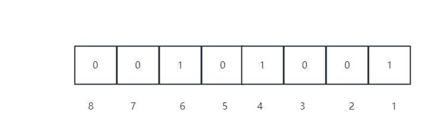
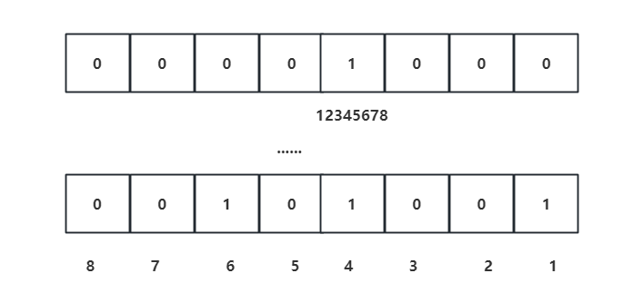
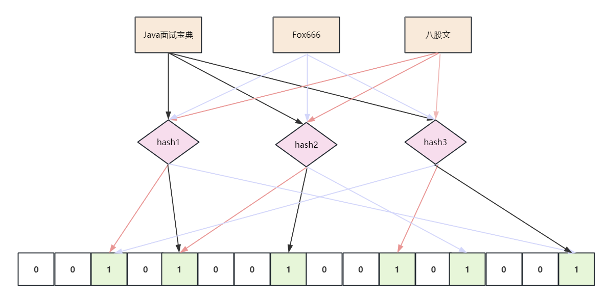
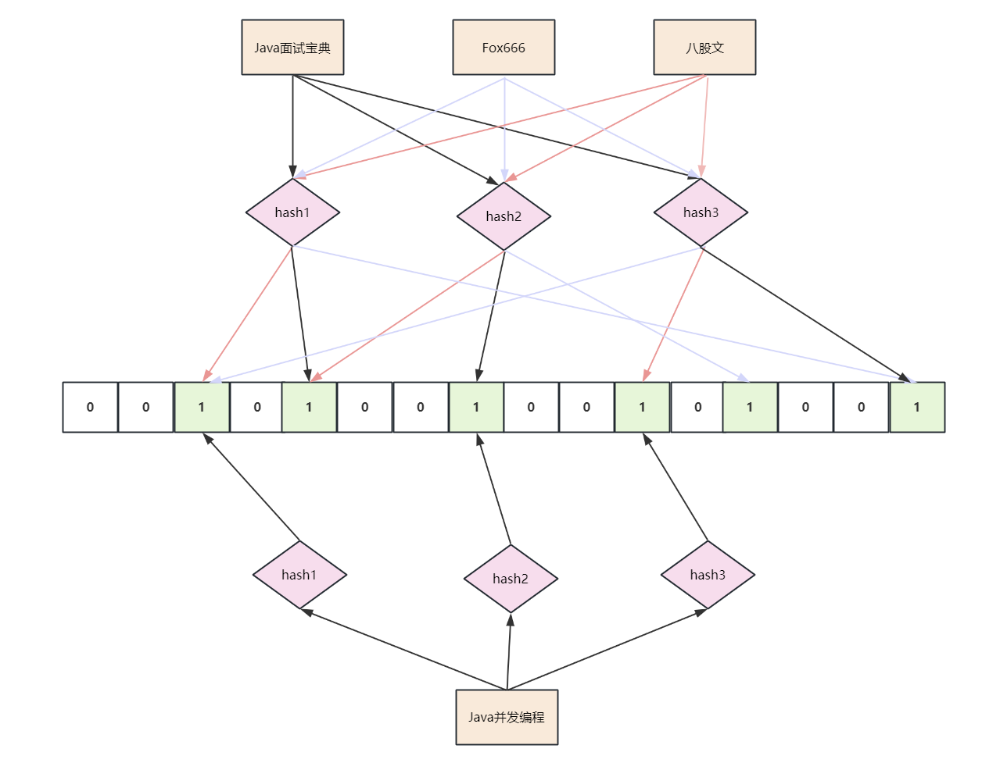
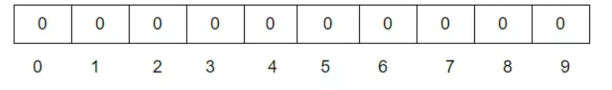
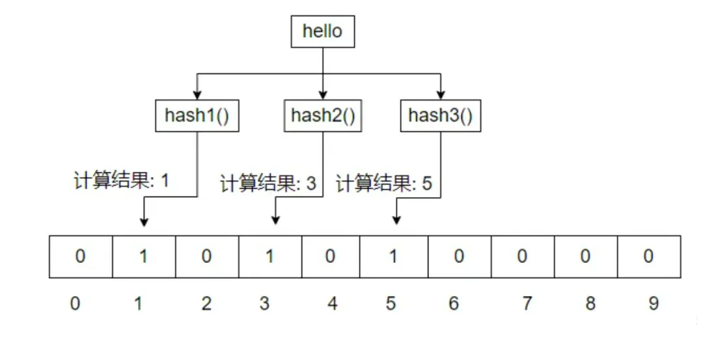

# 腾讯面试：40亿QQ号，给1G内存，怎么去重？

<font style="color:rgba(0, 0, 0, 0.9);">近段时间，有小伙伴面试腾讯，说遇到一个去重的面试题：</font>

> <font style="color:rgb(1, 1, 1);">40亿QQ号如何设计算法去重，相同的QQ号码仅保留一个，内存限制为1个G?</font>
>

<font style="color:rgb(36, 41, 46);">小伙伴由于 没有回答好，导致面试挂了。</font>


## 问题场景分析
<font style="color:rgba(0, 0, 0, 0.9);">分析一下QQ号码的数量：</font>

<font style="color:rgba(0, 0, 0, 0.9);">腾讯的QQ号都是4字节正整数 32个bit位，所以QQ号码的个数是43亿左右，理论值2^32-1个，</font>

<font style="color:rgba(0, 0, 0, 0.9);">又因为是无符号的，翻倍了一下，所以43亿左右。</font>

<font style="color:rgba(0, 0, 0, 0.9);">回顾一下问题：40亿QQ号如何设计算法去重，相同的QQ号码仅保留一个，内存限制为1个G?</font>

<font style="color:rgba(0, 0, 0, 0.9);">问题的本质：这个就是一个海量数据去重的问题， 但是有一个受限条件， 内存限制为1个G。</font>

<font style="color:rgba(0, 0, 0, 0.9);">解决方案有很多，但是主流的方案有两种：</font>

+ <font style="color:rgb(1, 1, 1);">方案1：使用BitMap进行海量数据去重</font>
+ <font style="color:rgb(1, 1, 1);">方案2：使用布隆过滤器进行海量数据去重</font>

<font style="color:rgb(1, 1, 1);"></font>

## 方式1：使用BitMap进行海量数据去重
<font style="color:rgba(0, 0, 0, 0.9);">首先看看，什么是BitMap？BitMap的使用场景</font>

### 什么是BitMap？有什么用？
<font style="color:rgba(0, 0, 0, 0.9);">所谓位图（BitMap）其实就是一个bit数组，即每一个位置都是一个bit，其中的取值可以是0或者1</font>

<font style="color:rgba(0, 0, 0, 0.9);">位图（BitMap）思想：就是用一个bit来标记元素，bit是计算机中最小的单位，也就是我们常说的计算机中的0和1，这种就是用一个位来表示的。</font>



<font style="color:rgba(0, 0, 0, 0.9);">像上面的这个位图，可以用来记录三个数：1，4，6。为啥呢？第1位、第4位、第6位 三个位置为 1。</font>

<font style="color:rgba(0, 0, 0, 0.9);">如果不用位图的话，我们想要记录1，4，6 这三个整型的话，怎么办？</font>

<font style="color:rgba(0, 0, 0, 0.9);">就需要用三个unsigned int，已知每个unsigned int占4个字节，那么就是</font>`<font style="color:rgb(239, 112, 96);">3*4 = 12</font>`<font style="color:rgba(0, 0, 0, 0.9);">个字节，一个字节有8 bit，那么就是</font><font style="color:rgba(0, 0, 0, 0.9);"> </font>`<font style="color:rgb(239, 112, 96);">12*8 = 96</font>`<font style="color:rgba(0, 0, 0, 0.9);"> </font><font style="color:rgba(0, 0, 0, 0.9);">个bit。</font>

<font style="color:rgba(0, 0, 0, 0.9);">结论是：位图最大的好处就是节省空间。这里节省了 12倍。</font>

### <font style="color:rgb(30, 30, 30);background-color:rgb(212, 224, 250);">如何使用BitMap进行40亿个QQ号去重？</font>
<font style="color:rgba(0, 0, 0, 0.9);">回到问题：40亿个QQ号，限制1G内存，如何去重？</font>

<font style="color:rgba(0, 0, 0, 0.9);">前面分析过：一个qq号码，就是一个unsigned int。</font>

<font style="color:rgba(0, 0, 0, 0.9);">40亿个QQ号，就是40亿个 unsigned int，一个 unsigned int占用4个字节。</font>

<font style="color:rgba(0, 0, 0, 0.9);">假如，40亿个 unsigned int直接用内存存储的话，需要多少内存呢？</font>

<font style="color:rgba(0, 0, 0, 0.9);">简单计算一下：</font>

```plain
4000000000*4 /1024/1024/1024 = 14.9G
```

<font style="color:rgba(0, 0, 0, 0.9);">所以，如果直接把 40亿个QQ号放入内存，需要15个G，1G的空间也是不够用的。</font>

<font style="color:rgba(0, 0, 0, 0.9);">那么，怎么办呢？</font>

<font style="color:rgba(0, 0, 0, 0.9);">qq号是数字，刚好可以使用bitmap。</font>

<font style="color:rgba(0, 0, 0, 0.9);">比如要把一个QQ号"12345678"放到Bitmap中，就需要找到第12345678这个位置，然后把他设置成1就可以了。</font>



<font style="color:rgba(0, 0, 0, 0.9);">这样，把40亿个数字都放到Bitmap之后，位置上是1的表示存在，不为1的表示不存在。</font>

<font style="color:rgba(0, 0, 0, 0.9);">相同的QQ号只需要设置一次1就可以了，那么，最终就把所有是1的数字遍历出来就行了。</font>

<font style="color:rgba(0, 0, 0, 0.9);">使用位图的话，一个数字只需要占用1个bit，那么40亿个数字也就是：</font>

```plain
4000000000 * 1 /8/1024/1024 = 476M
```

<font style="color:rgba(0, 0, 0, 0.9);">相比于之前的14.9G来说，大大的节省了很多空间。</font>

<font style="color:rgba(0, 0, 0, 0.9);">大约节省了 30倍的空间。</font>

### BitMap位图的优势和不足
<font style="color:rgba(0, 0, 0, 0.9);">位图（BitMap），基本思想就是用一个bit来标记元素，bit是计算机中最小的单位，也就是我们常说的计算机中的0和1，这种就是用一个位来表示的。</font>

<font style="color:rgba(0, 0, 0, 0.9);">BitMap位图的主要优势在于它可以非常高效地进行集合运算。具体来说，如果我们需要对一个集合进行多次交集、并集、差集等操作，使用 BitMap 可以将这些操作的时间复杂度降低到 O(1) 级别，而传统的集合实现则需要 O(n) 的时间复杂度，其中 n 是集合的大小。</font>

<font style="color:rgba(0, 0, 0, 0.9);">此外，BitMap 还可以节省存储空间。对于一个只包含 0 和 1 的集合，我们可以使用一个比特位来表示一个元素是否在集合中，这样可以将集合的存储空间降低到原来的 1/8 左右。</font>

<font style="color:rgba(0, 0, 0, 0.9);">所以，位图最大的好处就是节省空间。</font>

<font style="color:rgba(0, 0, 0, 0.9);">位图有很多种用途，特别适合用在去重、排序等场景中，著名的布隆过滤器就是基于位图实现的。</font>

<font style="color:rgba(0, 0, 0, 0.9);">但是位图也有着一定的限制，那就是他只能表示0和1，无法存储其他的数字。</font>

<font style="color:rgba(0, 0, 0, 0.9);">所以BitMap只适合这种能表示ture or false的场景。</font>

<font style="color:rgba(0, 0, 0, 0.9);">其次，BitMap 只适用于值域比较小的集合，因为如果值域过大，BitMap 的存储空间也会过大，这时候使用布隆过滤器可能更为合适。</font>

<font style="color:rgba(0, 0, 0, 0.9);">最后，BitMap 不支持删除操作，因为删除一个元素需要将对应的比特位设置为 0，这可能会影响到其他元素的状态。</font>

<font style="color:rgba(0, 0, 0, 0.9);"></font>

## 方式2：使用布隆过滤器进行海量数据去重
<font style="color:rgba(0, 0, 0, 0.9);">如果 值域过大，BitMap 的存储空间也会过大，这个时候，需要使用布隆过滤器，进一步进行空间的压缩。</font>

### 什么是布隆过滤器，实现原理是什么？
<font style="color:rgba(0, 0, 0, 0.9);">布隆过滤器是一种数据结构，用于快速检索一个元素是否可能存在于一个集合(bit 数组)中。</font>

<font style="color:rgba(0, 0, 0, 0.9);">它的基本原理是利用多个哈希函数，将一个元素映射成多个位，然后将这些位设置为 1。</font>

<font style="color:rgba(0, 0, 0, 0.9);">本质上：布隆过滤器内部包含一个bit数组和多个哈希函数，每个哈希函数都会生成一个index 索引值。</font>

<font style="color:rgba(0, 0, 0, 0.9);">由两个部分组成：</font>

+ <font style="color:rgb(1, 1, 1);">一个bit数组， 存储数据</font>
+ <font style="color:rgb(1, 1, 1);">多个哈希函数， 计算key的 index 索引</font>

<font style="color:rgba(0, 0, 0, 0.9);">如下图所示，里边有三个key：Java面试宝典、Fox666、八股文</font>



<font style="color:rgba(0, 0, 0, 0.9);">问题：如何做 exist（key）这种存在性的判定呢？</font>

<font style="color:rgba(0, 0, 0, 0.9);">答案：</font><font style="color:#DF2A3F;">当查询一个元素时，如果这些位都被设置为 1，则认为元素可能存在于集合中，否则肯定不存在</font>

<font style="color:rgba(0, 0, 0, 0.9);">比如说：</font>

```plain
exist（"Java面试宝典"） 的结果为 true
```

<font style="color:rgba(0, 0, 0, 0.9);">但是：布隆过滤器可以准确的判断一个元素是否一定不存在。注意，是判断一定不存在。</font>

<font style="color:rgba(0, 0, 0, 0.9);">为啥呢？因为哈希冲突的存在。</font>

### <font style="color:rgb(30, 30, 30);background-color:rgb(212, 224, 250);">什么是哈希冲突</font>
<font style="color:rgba(0, 0, 0, 0.9);">什么是 哈希冲突？哈希冲突是指两个或多个不同的key 键值被映射到了同一个哈希值。</font>

<font style="color:rgba(0, 0, 0, 0.9);">下面有个例子：</font>



<font style="color:rgba(0, 0, 0, 0.9);">比如说，来了一个新的key "Java并发编程" ，现在要判是否存在？</font>

```plain
exist（"Java并发编程"） 的结果为 true
```

<font style="color:rgba(0, 0, 0, 0.9);">结果是存在的。</font>

<font style="color:rgba(0, 0, 0, 0.9);">为啥呢？</font>

<font style="color:rgba(0, 0, 0, 0.9);">hash1（"Java并发编程"）=1，为啥呢？ 这个之前被  hash1（"Java面试宝典"），  hash3（"八股文"）设置过了，设置两次1.</font>

<font style="color:rgba(0, 0, 0, 0.9);">hash2（"Java并发编程"）=1，为啥呢？ 这个之前被  hash2（"Fox666"）设置过了1.</font>

<font style="color:rgba(0, 0, 0, 0.9);">hash3（"Java并发编程"）=1，为啥呢？ 这个之前被    hash3（"八股文"）设置过了1.</font>

<font style="color:rgba(0, 0, 0, 0.9);">由于， hash1（"Java并发编程"）=1 、 hash2（"Java并发编程"）=1、 hash3（"Java并发编程"）=1，所以，exist（"Java并发编程"） 的结果为 true。</font>

<font style="color:rgba(0, 0, 0, 0.9);">可是key "Java并发编程"  之前真的没有设置过，是不存在的。</font>

<font style="color:rgba(0, 0, 0, 0.9);">结论是：</font><font style="color:#DF2A3F;">由于hash冲突，布隆过滤器没办法判断一个元素一定存在。只能判断可能存在。或者判不存在。</font>

<font style="color:rgba(0, 0, 0, 0.9);">如何降低存在性误判的概率</font>

<font style="color:rgba(0, 0, 0, 0.9);">想要降低这种存在性误判的概率，主要的办法就是降低哈希冲突的概率及引入更多的哈希算法。</font>

<font style="color:rgba(0, 0, 0, 0.9);"></font>

### <font style="color:rgb(30, 30, 30);background-color:rgb(212, 224, 250);">布隆过滤器的工作过程</font>
<font style="color:rgba(0, 0, 0, 0.9);">下面是布隆过滤器的工作过程：</font>

#### <font style="color:rgba(0, 0, 0, 0.9);">1、初始化布隆过滤器</font>
<font style="color:rgba(0, 0, 0, 0.9);">在初始化布隆过滤器时，需要指定集合的大小和误判率。</font>

#### <font style="color:rgba(0, 0, 0, 0.9);">2、添加元素到布隆过滤器</font>
<font style="color:rgba(0, 0, 0, 0.9);">要将一个元素添加到布隆过滤器中，首先需要将该元素通过多个哈希函数生成多个索引值，然后将这些索引值对应的位设置为 1。如果这些索引值已经被设置为 1，则不需要再次设置。</font>

#### <font style="color:rgba(0, 0, 0, 0.9);">3、查询元素是否存在于布隆过滤器中</font>
<font style="color:rgba(0, 0, 0, 0.9);">要查询一个元素是否存在于布隆过滤器中，需要将该元素通过多个哈希函数生成多个索引值，并判断这些索引值对应的位是否都被设置为 1。如果这些位都被设置为 1，则认为元素可能存在于集合中，否则肯定不存在。</font>

<font style="color:rgba(0, 0, 0, 0.9);">布隆过滤器的主要优点是可以快速判断一个元素是否属于某个集合，并且可以在空间和时间上实现较高的效率。</font>

<font style="color:rgba(0, 0, 0, 0.9);">但是，它也存在一些缺点，例如：</font>

<font style="color:rgba(0, 0, 0, 0.9);">（1）.布隆过滤器在判断元素是否存在时，有一定的误判率。、</font>

<font style="color:rgba(0, 0, 0, 0.9);">（2）.布隆过滤器删除元素比较困难，因为删除一个元素需要将其对应的多个位设置为 0，但这些位可能被其他元素共享。</font>

### <font style="color:rgb(30, 30, 30);background-color:rgb(212, 224, 250);">布隆过滤器举例</font>
#### <font style="color:rgba(0, 0, 0, 0.9);">1、布隆过滤器初始状态</font>
<font style="color:rgba(0, 0, 0, 0.9);">布隆过滤器 也是用一个二进制数组进行数据存储。</font>

<font style="color:rgba(0, 0, 0, 0.9);">一开始，二进制数组里是没有值的</font>



#### <font style="color:rgba(0, 0, 0, 0.9);">2、存储操作</font>
<font style="color:rgba(0, 0, 0, 0.9);">假设，存储一个数据数据hello</font>

<font style="color:rgba(0, 0, 0, 0.9);">首先，对数据hello经过三次hash运算，分别得到三个值（假设1，3，5）。</font>

<font style="color:rgba(0, 0, 0, 0.9);">然后，在对应的二进制数组里，将下标为1，3，5的值置为1。</font>



#### <font style="color:rgba(0, 0, 0, 0.9);">3、查询操作</font>
<font style="color:rgba(0, 0, 0, 0.9);">对于数据hello。对数据hello经过三次hash运算，分别得到三个值（假设1，3，5）。</font>

<font style="color:rgba(0, 0, 0, 0.9);">在二进制数组里，将下标为1，3，5的值取出来，如果都为1，则表示该数据已经存在。</font>

#### <font style="color:rgba(0, 0, 0, 0.9);">4、删除操作</font>
<font style="color:rgba(0, 0, 0, 0.9);">布隆过滤器在使用的时候，不建议进行删除操作。</font>

<font style="color:rgba(0, 0, 0, 0.9);">布隆过滤器里边的部分bit位，完全可能被复用。</font>

<font style="color:rgba(0, 0, 0, 0.9);">假设两个 key：hello、world，如果hash2(hello)结果为3，hash2(world)结果也为3，那么如果删除了hello的hash2(hello)值，就意味着world的hash2(world)值也会被其删除。造成数据的误删。</font>

#### <font style="color:rgba(0, 0, 0, 0.9);">5、误判率</font>
<font style="color:rgba(0, 0, 0, 0.9);">假设保存两个值，hello和world。hello对应的三个 hash 计算后的index为1，3，5，world三个 hash 对应的index（也就是hash计算后的值）也为1，3，5 ， 那么  exist(world) = true ，就是一种误判</font>

### <font style="color:rgb(30, 30, 30);background-color:rgb(212, 224, 250);">布隆过滤器应用场景</font>
<font style="color:rgba(0, 0, 0, 0.9);">布隆过滤器因为他的效率非常高，所以被广泛的使用，比较典型的场景有以下几个：</font>

<font style="color:rgba(0, 0, 0, 0.9);">1、</font>**<font style="color:rgba(0, 0, 0, 0.9);">网页爬虫</font>**<font style="color:rgba(0, 0, 0, 0.9);">：爬虫程序可以使用布隆过滤器来过滤掉已经爬取过的网页，避免重复爬取和浪费资源。</font>

<font style="color:rgba(0, 0, 0, 0.9);">2、</font>**<font style="color:rgba(0, 0, 0, 0.9);">缓存系统</font>**<font style="color:rgba(0, 0, 0, 0.9);">：缓存系统可以使用布隆过滤器来判断一个查询是否可能存在于缓存中，从而减少查询缓存的次数，提高查询效率。布隆过滤器也经常用来解决缓存穿透的问题。</font>

<font style="color:rgba(0, 0, 0, 0.9);">3、</font>**<font style="color:rgba(0, 0, 0, 0.9);">分布式系统</font>**<font style="color:rgba(0, 0, 0, 0.9);">：在分布式系统中，可以使用布隆过滤器来判断一个元素是否存在于分布式缓存中，避免在所有节点上进行查询，减少网络负载。</font>

<font style="color:rgba(0, 0, 0, 0.9);">4、</font>**<font style="color:rgba(0, 0, 0, 0.9);">垃圾邮件过滤</font>**<font style="color:rgba(0, 0, 0, 0.9);">：布隆过滤器可以用于判断一个邮件地址是否在垃圾邮件列表中，从而过滤掉垃圾邮件。</font>

<font style="color:rgba(0, 0, 0, 0.9);">5、</font>**<font style="color:rgba(0, 0, 0, 0.9);">黑名单过滤</font>**<font style="color:rgba(0, 0, 0, 0.9);">：布隆过滤器可以用于判断一个IP地址或手机号码是否在黑名单中，从而阻止恶意请求。</font>

<font style="color:rgba(0, 0, 0, 0.9);"></font>

### <font style="color:rgb(30, 30, 30);background-color:rgb(212, 224, 250);">如何实现实现布隆过滤器</font>
<font style="color:rgba(0, 0, 0, 0.9);">Java中可以使用第三方库来实现布隆过滤器，常见的有Google Guava库和</font><font style="color:rgba(0, 0, 0, 0.9);">Redisson</font><font style="color:rgba(0, 0, 0, 0.9);">库以及Jedis库。</font>

#### <font style="color:rgba(0, 0, 0, 0.9);">Guava版本的布隆过滤器:</font>
<font style="color:rgba(0, 0, 0, 0.9);">Guava 20.0版本已经引入了布隆过滤器(BloomFilter)的实现。你可以使用以下步骤来使用Guava的布隆过滤器：</font>

1. **<font style="color:black;">引入Guava依赖</font>**<font style="color:rgb(1, 1, 1);">：</font>

```java
<dependency>
<groupId>com.google.guava</groupId>
<artifactId>guava</artifactId>
<version>20.0</version>
</dependency>
```

1. **<font style="color:black;">创建布隆过滤器</font>**<font style="color:rgb(1, 1, 1);">：</font>

```java
int expectedInsertions = 1000000;
double fpp = 0.01;
BloomFilter<String> bloomFilter = BloomFilter.create(Funnels.stringFunnel(Charset.defaultCharset()), expectedInsertions, fpp);
```

<font style="color:rgba(0, 0, 0, 0.9);">其中，</font>`<font style="color:rgb(239, 112, 96);">expectedInsertions</font>`<font style="color:rgba(0, 0, 0, 0.9);">表示预期插入的元素数量，</font>`<font style="color:rgb(239, 112, 96);">fpp</font>`<font style="color:rgba(0, 0, 0, 0.9);">表示误判率(false positive probability)，</font>`<font style="color:rgb(239, 112, 96);">Funnels.stringFunnel(Charset.defaultCharset())</font>`<font style="color:rgba(0, 0, 0, 0.9);">表示元素类型为String。</font>

1. **<font style="color:black;">添加元素</font>**<font style="color:rgb(1, 1, 1);">：</font>

```java
bloomFilter.put("hello");
bloomFilter.put("world");
```

1. **<font style="color:black;">判断元素是否存在</font>**<font style="color:rgb(1, 1, 1);">：</font>

```java
bloomFilter.mightContain("hello"); // true
bloomFilter.mightContain("world"); // true
bloomFilter.mightContain("test"); // false
```

<font style="color:rgba(0, 0, 0, 0.9);">注意，布隆过滤器判断元素是否存在，有一定的误判率。如果</font>`<font style="color:rgb(239, 112, 96);">mightContain</font>`<font style="color:rgba(0, 0, 0, 0.9);">返回</font>`<font style="color:rgb(239, 112, 96);">false</font>`<font style="color:rgba(0, 0, 0, 0.9);">，则可以确定该元素一定不存在；如果</font>`<font style="color:rgb(239, 112, 96);">mightContain</font>`<font style="color:rgba(0, 0, 0, 0.9);">返回</font>`<font style="color:rgb(239, 112, 96);">true</font>`<font style="color:rgba(0, 0, 0, 0.9);">，则该元素可能存在，需要进一步验证。</font>

1. **<font style="color:black;">序列化和反序列化</font>**<font style="color:rgb(1, 1, 1);">：</font>

```java
// 序列化
FileOutputStream fos = new FileOutputStream("bloom_filter.bin");
ObjectOutputStream oos = new ObjectOutputStream(fos);
oos.writeObject(bloomFilter);
oos.close();

// 反序列化
FileInputStream fis = new FileInputStream("bloom_filter.bin");
ObjectInputStream ois = new ObjectInputStream(fis);
BloomFilter<String> bloomFilter2 = (BloomFilter<String>) ois.readObject();
ois.close();
```

<font style="color:rgba(0, 0, 0, 0.9);">注意，序列化和反序列化的过程中，需要将</font>`<font style="color:rgb(239, 112, 96);">BloomFilter</font>`<font style="color:rgba(0, 0, 0, 0.9);">类实现</font>`<font style="color:rgb(239, 112, 96);">Serializable</font>`<font style="color:rgba(0, 0, 0, 0.9);">接口。</font>

#### <font style="color:rgba(0, 0, 0, 0.9);">Redisson版本的布隆过滤器</font>
<font style="color:rgba(0, 0, 0, 0.9);">Redisson 是一个基于 Redis 的 Java 客户端，提供了丰富的分布式对象和服务，其中包括布隆过滤器。Redisson 的布隆过滤器实现了标准的布隆过滤器算法，并提供了一些额外的功能，如自动扩容和持久化等。</font>

<font style="color:rgba(0, 0, 0, 0.9);">使用 Redisson 的布隆过滤器非常简单，只需要创建一个 RedissonClient 对象，然后通过该对象获取一个 RBloomFilter 对象即可。</font>

<font style="color:rgba(0, 0, 0, 0.9);">RBloomFilter 提供了一系列的方法，包括添加元素、判断元素是否存在、清空过滤器等。</font>

<font style="color:rgba(0, 0, 0, 0.9);">以下是一个简单的使用 Redisson 布隆过滤器的示例代码：</font>

```java
// 创建 Redisson 客户端
Config config = new Config();
config.useSingleServer().setAddress("redis://127.0.0.1:6379");
RedissonClient redisson = Redisson.create(config);

// 获取布隆过滤器对象
RBloomFilter<String> bloomFilter = redisson.getBloomFilter("bloom-filter");

// 初始化布隆过滤器，设置预计元素数量和误判率
bloomFilter.tryInit(10000, 0.03);

// 添加元素
bloomFilter.add("hello");
bloomFilter.add("world");

// 判断元素是否存在
System.out.println(bloomFilter.contains("hello"));
System.out.println(bloomFilter.contains("redis"));

// 清空过滤器
bloomFilter.delete();
```

<font style="color:rgba(0, 0, 0, 0.9);">需要注意的是，Redisson 的布隆过滤器并不支持动态修改预计元素数量和误判率，因此在初始化时需要仔细考虑这两个参数的取值。</font>

#### <font style="color:rgba(0, 0, 0, 0.9);">Jedis版本的布隆过滤器</font>
<font style="color:rgba(0, 0, 0, 0.9);">如果没有用Redisson， Jedis也可以使用布隆过滤器，参考代码如下 ：</font>

```java
Jedis jedis = new Jedis("localhost");
jedis.bfCreate("myfilter", 100, 0.01);
jedis.bfAdd("myfilter", "Fox");
jedis.bfAdd("myfilter", "666");
jedis.bfAdd("myfilter", "八股文");
System.out.println(jedis.bfExists("myfilter", "Fox"));
System.out.println(jedis.bfExists("myfilter", "张三"));jedis.close();
```

<font style="color:rgba(0, 0, 0, 0.9);">由于布隆过滤器存在一定的误判率，因此不能完全替代传统的数据结构，应该根据具体应用场景进行选择。</font>

## 海量数据去重场景：布隆过滤器和位图如何选择
<font style="color:rgba(0, 0, 0, 0.9);">布隆过滤器和位图都是常用的数据结构，但它们的应用场景和实现方式不同。</font>

<font style="color:rgba(0, 0, 0, 0.9);">布隆过滤器是一种概率型数据结构，用于判断一个元素是否存在于一个集合中。但有一定的误判概率。因此，Bloom Filter不适合那些“零错误”的应用场合。而在能容忍低错误率的应用场合下，Bloom Filter通过极少的错误换取了存储空间的极大节省。</font>

<font style="color:rgba(0, 0, 0, 0.9);">位图是一种简单的数据结构，用于表示一个二进制序列。它通过一个比特位数组来表示一个集合，其中每个比特位表示一个元素是否存在于集合中。当需要判断一个元素是否存在于集合中时，只需要检查对应的比特位是否为 1 或 0 即可。</font>

<font style="color:rgba(0, 0, 0, 0.9);">相比之下，布隆过滤器的空间效率更高，但存在一定的误判概率；而位图的空间效率较低，但不存在误判。因此，在实际应用中，需要根据具体的场景选择合适的数据结构。</font>


> 更新: 2024-12-03 19:25:34  
> 原文: <https://www.yuque.com/u12222632/as5rgl/ug6pu02obgewbu8c>